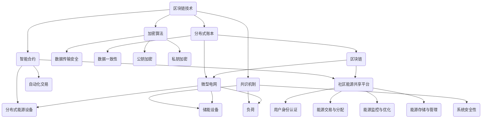
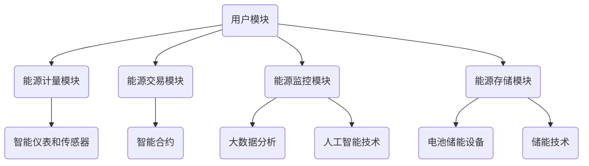
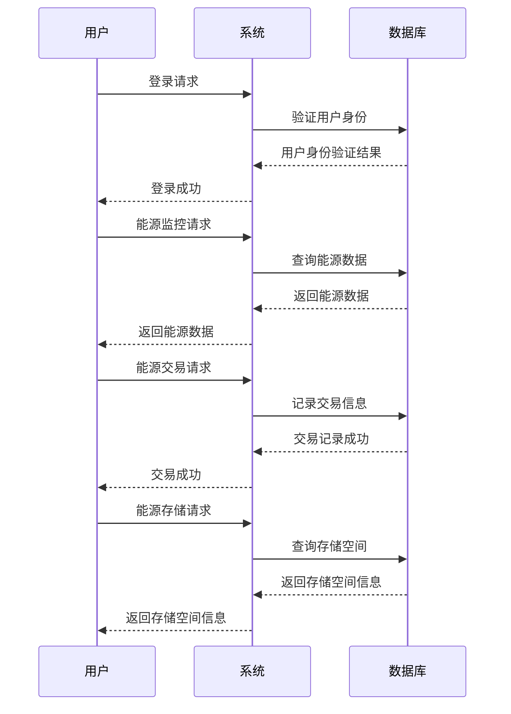

                 


# 新型社区能源共享平台：区块链技术在微型电网中的应用

## 关键词
- 区块链技术
- 微型电网
- 能源共享
- 智能合约
- 分布式账本

## 摘要
本文将探讨新型社区能源共享平台的概念及其在微型电网中的应用。我们将重点介绍区块链技术在能源管理中的关键角色，从核心概念、算法原理、系统架构到实际应用，全面解析这一新兴领域的现状、挑战与发展趋势。

## 引言
随着全球能源危机的加剧和环保意识的提升，能源共享已成为一种越来越受欢迎的解决方案。传统的集中式能源管理模式效率低下，无法满足现代社区对灵活、高效能源服务的需求。微型电网作为一种分布式能源网络，正逐渐成为解决这一问题的有效途径。而区块链技术的引入，为微型电网的能源共享提供了全新的可能。

## 背景介绍

### 核心概念术语说明
- **微型电网**：微型电网是指由一组分布式能源设备、储能设备和负荷组成的独立电网，可以与主电网相互独立运行或并网运行。
- **区块链技术**：区块链技术是一种分布式数据库技术，通过加密算法和共识机制确保数据的不可篡改性和透明性。
- **能源共享**：能源共享是指社区内成员通过共享能源资源来实现能源的优化利用，降低能源成本，提高能源效率。

### 问题背景
传统社区能源管理存在的问题包括：
1. **能源浪费**：由于缺乏有效的能源监控和优化机制，社区内的能源浪费问题严重。
2. **能源成本高**：社区居民面临高昂的能源成本，特别是在高峰时段。
3. **能源供应不稳定**：受天气和自然灾害影响，社区能源供应不稳定。

### 问题描述
如何构建一个高效、稳定、经济的社区能源共享平台，以解决传统能源管理存在的问题？

### 问题解决
区块链技术在微型电网中的应用为解决上述问题提供了新的思路：
1. **提高能源效率**：通过智能合约实现自动化的能源交易和分配，提高能源利用效率。
2. **降低能源成本**：社区居民可以按需购买或出售能源，实现能源资源的最大化利用，降低能源成本。
3. **提高能源供应稳定性**：微型电网可以独立运行，减少对主电网的依赖，提高能源供应的稳定性。

### 边界与外延
- **边界**：本文主要讨论区块链技术在微型电网中的能源共享应用，不涉及区块链在其他领域的应用。
- **外延**：本文还将探讨社区能源共享平台在智慧城市、能源互联网等领域的潜在应用。

### 概念结构与核心要素组成
- **微型电网**：分布式能源设备、储能设备、负荷、控制系统。
- **区块链技术**：加密算法、分布式账本、智能合约、共识机制。
- **能源共享平台**：用户身份认证、能源交易与分配、能源监控与优化、能源存储与管理。

## 核心概念与联系

### 区块链技术
区块链技术是一种去中心化的分布式数据库系统，通过加密算法和共识机制确保数据的不可篡改性和透明性。以下是区块链技术的核心概念：

#### 加密算法
- **公钥加密**：确保数据传输的安全性。
- **私钥加密**：确保数据所有者的隐私和安全。

#### 分布式账本
- **区块链**：由一系列按时间顺序排列的区块组成，每个区块包含一定数量的交易记录。
- **共识机制**：确保分布式网络中的所有节点对账本的一致性。

#### 智能合约
- **定义**：智能合约是运行在区块链上的自执行合同，它可以自动执行、控制或文档化任何具有法律效力的过程。
- **功能**：通过编程逻辑实现能源交易、分配和监控等自动化功能。

#### 共识机制
- **工作原理**：通过分布式网络中的节点共同验证和记录交易，确保账本的一致性和安全性。
- **类型**：常见的共识机制包括工作量证明（PoW）、权益证明（PoS）和委托权益证明（DPoS）等。

### 微型电网
微型电网是由分布式能源设备、储能设备和负荷组成的独立电网，可以实现与主电网的相互独立运行或并网运行。以下是微型电网的核心概念：

#### 分布式能源设备
- **太阳能光伏板**：将太阳能转换为电能。
- **风力发电设备**：将风能转换为电能。
- **微型燃气轮机**：将燃气转换为电能。

#### 储能设备
- **电池储能**：通过电池将电能储存起来，以供后续使用。
- **燃料电池**：通过化学反应将燃料转换为电能和热能。

#### 负荷
- **居民用电设备**：如空调、照明、家电等。
- **商业负荷**：如商业设施、工业设备等。

### 社区能源共享平台
社区能源共享平台是一个集成区块链技术、微型电网和智能合约的综合性系统，旨在实现社区内成员的能源共享和优化利用。以下是社区能源共享平台的核心概念：

#### 用户身份认证
- **用户注册**：通过区块链技术确保用户身份的唯一性和安全性。
- **权限管理**：根据用户的身份和权限，控制其对系统资源的访问。

#### 能源交易与分配
- **能源计量**：通过智能合约自动计量用户能源消费和产生。
- **能源交易**：通过区块链实现能源的买卖和分配，确保交易的透明性和公正性。

#### 能源监控与优化
- **能源监控**：实时监控能源的生产、分配和消耗情况。
- **能源优化**：通过数据分析，优化能源分配策略，提高能源利用效率。

#### 能源存储与管理
- **能源存储**：通过储能设备，确保能源的稳定供应。
- **能源管理**：通过智能合约和数据分析，实现能源的智能化管理和优化。

### Mermaid流程图
下面是区块链技术、微型电网和社区能源共享平台之间关系的Mermaid流程图：



## 算法原理讲解

### 区块链算法原理

#### 工作量证明（PoW）算法
工作量证明是一种加密货币中的共识算法，用于在网络中选择区块的验证者。以下是PoW算法的基本原理：

1. **挖矿过程**：网络中的节点通过计算找到一个满足特定条件的哈希值，这个哈希值是当前区块的所有交易数据的加密摘要。
2. **哈希函数**：常用的哈希函数包括SHA-256和Scrypt等，它们将任意长度的数据映射为固定长度的字符串。
3. **难度调整**：为了控制新币的产生速率，系统会根据当前网络算力的变化调整挖矿难度。
4. **奖励机制**：成功挖出区块的节点将获得一定数量的加密货币作为奖励。

下面是一个简单的Python代码示例，用于演示PoW算法：

```python
import hashlib
import random

def find_hash_value(data, target_difficulty):
    nonce = 0
    while True:
        hash_value = hashlib.sha256((str(nonce) + data).encode()).hexdigest()
        if hash_value.startswith('0' * target_difficulty):
            return nonce, hash_value
        nonce += 1

data = "Example data for mining"
target_difficulty = 4

nonce, hash_value = find_hash_value(data, target_difficulty)
print(f"Nonce: {nonce}, Hash Value: {hash_value}")
```

#### 权益证明（PoS）算法
权益证明是一种相对于工作量证明的共识算法，它通过验证节点的权益来选择区块的验证者。以下是PoS算法的基本原理：

1. **权益计算**：节点的权益与其持有的加密货币数量和持有时间成正比。
2. **选举机制**：系统根据节点的权益随机选择若干个验证者来生成区块。
3. **奖励机制**：验证者成功生成区块后，将获得一定数量的加密货币作为奖励。
4. **惩罚机制**：如果验证者恶意行为，可能会被扣除部分或全部权益。

下面是一个简单的Python代码示例，用于演示PoS算法的基本原理：

```python
import random

def calculate权益(持有量, 持有时间):
    return 持有量 * 持有时间

def select_validators(权益列表, 验证人数量):
    sorted权益 = sorted(权益列表, reverse=True)
    selected = random.sample(sorted权益, 验证人数量)
    return selected

持有量 = [10, 20, 30, 40, 50]
持有时间 = [1, 2, 3, 4, 5]
权益列表 = [calculate权益(持有量[i], 持有时间[i]) for i in range(len(持有量))]

验证人数量 = 3
selected_validators = select_validators(权益列表, 验证人数量)
print(f"Selected Validators: {selected_validators}")
```

#### 智能合约
智能合约是一种运行在区块链上的自执行合同，它可以自动执行、控制或文档化任何具有法律效力的过程。智能合约的基本原理如下：

1. **编写合约**：开发者使用智能合约编程语言（如Solidity）编写合约代码。
2. **部署合约**：将合约代码部署到区块链上，创建一个智能合约实例。
3. **调用合约**：用户通过区块链调用合约函数，触发合约逻辑的执行。
4. **执行结果**：合约根据预设的逻辑自动执行操作，并记录在区块链上。

下面是一个简单的Solidity智能合约示例，用于演示智能合约的基本原理：

```solidity
pragma solidity ^0.8.0;

contract EnergyShare {
    address owner;
    mapping(address => uint256) public balances;

    constructor() {
        owner = msg.sender;
    }

    function deposit() public payable {
        balances[msg.sender] += msg.value;
    }

    function withdraw(uint256 amount) public {
        require(balances[msg.sender] >= amount, "Insufficient balance");
        balances[msg.sender] -= amount;
        payable(msg.sender).transfer(amount);
    }
}
```

### 区块链算法背后的数学模型

区块链算法的核心在于确保数据的一致性和安全性，这涉及到一些重要的数学模型和公式。以下是区块链算法中常用的数学模型和公式的简要介绍：

#### 哈希函数
哈希函数是一种将任意长度的输入数据映射为固定长度的字符串的函数。常用的哈希函数包括SHA-256、SHA-3等。

- **哈希函数公式**：H(x) = SHA-256(x)
- **性质**：不可逆性、抗碰撞性、固定长度输出

#### 随机数生成
随机数生成是区块链算法中的一个重要组成部分，用于选择验证者、生成新区块等。

- **随机数生成公式**：Random() = rand() % 上限
- **性质**：随机性、均匀分布

#### 加密算法
加密算法用于确保数据传输的安全性，常用的加密算法包括RSA、AES等。

- **加密算法公式**：EncryptedData = Encrypt(PlainText, Key)
- **解密算法公式**：PlainText = Decrypt(EncryptedData, Key)
- **性质**：保密性、完整性、抗否认性

#### 智能合约编程
智能合约编程是区块链技术的核心应用之一，使用Solidity等编程语言编写智能合约。

- **编程模型**：函数、变量、事件、合约继承等
- **编程语言**：Solidity、Vyper等
- **性质**：自执行性、透明性、去中心化

### 举例说明

#### 工作量证明算法举例
假设我们要找到一个满足难度要求的哈希值，我们可以使用以下Python代码进行演示：

```python
import hashlib
import random

def find_hash_value(data, target_difficulty):
    nonce = 0
    while True:
        hash_value = hashlib.sha256((str(nonce) + data).encode()).hexdigest()
        if hash_value.startswith('0' * target_difficulty):
            return nonce, hash_value
        nonce += 1

data = "Example data for mining"
target_difficulty = 4

nonce, hash_value = find_hash_value(data, target_difficulty)
print(f"Nonce: {nonce}, Hash Value: {hash_value}")
```

#### 权益证明算法举例
假设我们要根据权益选择验证者，我们可以使用以下Python代码进行演示：

```python
import random

def calculate权益(持有量, 持有时间):
    return 持有量 * 持有时间

def select_validators(权益列表, 验证人数量):
    sorted权益 = sorted(权益列表, reverse=True)
    selected = random.sample(sorted权益, 验证人数量)
    return selected

持有量 = [10, 20, 30, 40, 50]
持有时间 = [1, 2, 3, 4, 5]
权益列表 = [calculate权益(持有量[i], 持有时间[i]) for i in range(len(持有量))]

验证人数量 = 3
selected_validators = select_validators(权益列表, 验证人数量)
print(f"Selected Validators: {selected_validators}")
```

#### 智能合约举例
假设我们要编写一个简单的智能合约，用于实现一个简单的投票系统，我们可以使用以下Solidity代码进行演示：

```solidity
pragma solidity ^0.8.0;

contract Voting {
    mapping(address => bool) public hasVoted;
    mapping(address => uint256) public votes;

    function vote() public {
        require(!hasVoted[msg.sender], "你已经投票了");
        hasVoted[msg.sender] = true;
        votes[msg.sender]++;
    }

    function getVoteCount() public view returns (uint256) {
        return votes[msg.sender];
    }
}
```

## 数学公式

区块链算法中涉及到许多重要的数学模型和公式，下面我们使用LaTeX格式展示一些常用的数学公式，并进行详细讲解。

### 哈希函数公式
$$ H(x) = SHA-256(x) $$

这是SHA-256哈希函数的公式，它将任意长度的输入数据（x）映射为固定长度的字符串（哈希值）。

### 随机数生成公式
$$ Random() = rand() \% 上限 $$

这是一个简单的随机数生成公式，用于生成一个介于0和上限之间的随机数。

### 加密算法公式
$$ EncryptedData = Encrypt(PlainText, Key) $$
$$ PlainText = Decrypt(EncryptedData, Key) $$

这是加密和解密算法的通用公式，其中PlainText表示明文，EncryptedData表示密文，Key表示密钥。

### 智能合约编程公式
$$ function() {} $$
$$ mapping(address => uint256) public balances; $$
$$ event Voted(address voter); $$

这是智能合约编程中的一些常用语法，包括函数、变量和事件声明。

### 区块链算法中的数学模型
以下是区块链算法中常用的数学模型和公式：

#### 工作量证明算法
$$ Difficulty = \frac{TargetDifficulty}{MaxNonce} $$

这是工作量证明算法中的难度调整公式，用于根据当前网络算力调整挖矿难度。

#### 权益证明算法
$$ 权益 = 持有量 \times 持有时间 $$

这是权益证明算法中的权益计算公式，用于计算节点的权益。

#### 智能合约编程
$$ if \ condition \ then \ action \ else \ action \ endif; $$
$$ for \ index \ in \ range(len(array)) \ do \ action \ endfor; $$

这是智能合约编程中的条件语句和循环语句，用于实现复杂的逻辑和控制流。

### 举例说明

#### 工作量证明算法举例
假设我们要找到一个满足难度要求的哈希值，我们可以使用以下Python代码进行演示：

```python
import hashlib
import random

def find_hash_value(data, target_difficulty):
    nonce = 0
    while True:
        hash_value = hashlib.sha256((str(nonce) + data).encode()).hexdigest()
        if hash_value.startswith('0' * target_difficulty):
            return nonce, hash_value
        nonce += 1

data = "Example data for mining"
target_difficulty = 4

nonce, hash_value = find_hash_value(data, target_difficulty)
print(f"Nonce: {nonce}, Hash Value: {hash_value}")
```

#### 权益证明算法举例
假设我们要根据权益选择验证者，我们可以使用以下Python代码进行演示：

```python
import random

def calculate权益(持有量, 持有时间):
    return 持有量 * 持有时间

def select_validators(权益列表, 验证人数量):
    sorted权益 = sorted(权益列表, reverse=True)
    selected = random.sample(sorted权益, 验证人数量)
    return selected

持有量 = [10, 20, 30, 40, 50]
持有时间 = [1, 2, 3, 4, 5]
权益列表 = [calculate权益(持有量[i], 持有时间[i]) for i in range(len(持有量))]

验证人数量 = 3
selected_validators = select_validators(权益列表, 验证人数量)
print(f"Selected Validators: {selected_validators}")
```

#### 智能合约举例
假设我们要编写一个简单的智能合约，用于实现一个简单的投票系统，我们可以使用以下Solidity代码进行演示：

```solidity
pragma solidity ^0.8.0;

contract Voting {
    mapping(address => bool) public hasVoted;
    mapping(address => uint256) public votes;

    function vote() public {
        require(!hasVoted[msg.sender], "你已经投票了");
        hasVoted[msg.sender] = true;
        votes[msg.sender]++;
    }

    function getVoteCount() public view returns (uint256) {
        return votes[msg.sender];
    }
}
```

## 系统分析与架构设计方案

### 问题场景介绍

在现代城市社区中，能源需求日益增长，而传统集中式能源供应模式已无法满足灵活、高效的能源需求。社区内的家庭、商业设施和工业设备都需要稳定的能源供应。然而，由于能源需求的不确定性、能源资源的有限性以及能源供应的不稳定性，传统的能源供应模式面临着诸多挑战。为了解决这些问题，我们需要构建一个高效、稳定、经济的社区能源共享平台，以实现能源的优化利用和共享。

### 项目介绍

本项目旨在设计和实现一个基于区块链技术的社区能源共享平台，该平台将整合微型电网、分布式能源设备和智能合约，以实现社区内成员之间的能源共享和优化利用。该平台的主要目标包括：
1. 提高能源利用效率，减少能源浪费。
2. 降低社区居民的能源成本。
3. 提高能源供应的稳定性和可靠性。

### 系统功能设计

社区能源共享平台的主要功能包括：
1. **用户注册与身份认证**：支持社区内成员的注册和身份认证，确保系统安全性和隐私性。
2. **能源计量与监测**：通过智能仪表和传感器实时监测社区的能源消费和产生情况，确保数据的准确性和实时性。
3. **能源交易与分配**：通过智能合约实现能源的自动交易和分配，确保交易的透明性和公正性。
4. **能源监控与优化**：通过大数据分析和人工智能技术，实时监控能源的使用情况，并提供优化建议，以提高能源利用效率。
5. **能源存储与管理**：通过电池储能设备和其他储能技术，实现能源的存储和管理，确保能源的稳定供应。

### 系统架构设计

社区能源共享平台采用分布式架构，主要包括以下模块：

1. **用户模块**：负责用户注册、身份认证和权限管理。
2. **能源计量模块**：负责能源的计量、监测和记录。
3. **能源交易模块**：负责能源的自动交易和分配。
4. **能源监控模块**：负责能源的实时监控、数据分析和管理。
5. **能源存储模块**：负责能源的存储和管理。

以下是社区能源共享平台的Mermaid架构图：



### 系统接口设计

社区能源共享平台的主要接口包括：

1. **用户接口**：支持用户注册、登录、身份认证和权限管理。
2. **能源监控接口**：支持能源的实时监控、数据查询和分析。
3. **能源交易接口**：支持能源的买卖、分配和结算。
4. **能源存储接口**：支持能源的存储和管理。

以下是社区能源共享平台的Mermaid序列图：



### 系统交互

社区能源共享平台通过以下方式进行交互：

1. **用户与系统交互**：用户通过用户接口与系统进行交互，实现注册、登录、能源监控、能源交易和能源存储等操作。
2. **系统与数据库交互**：系统通过数据库接口与数据库进行交互，实现数据查询、记录和更新等操作。
3. **系统与智能仪表和传感器交互**：系统通过通信协议与智能仪表和传感器进行交互，实时监测能源的消耗和产生情况。
4. **系统与大数据分析和人工智能技术交互**：系统通过接口与大数据分析和人工智能技术进行交互，实现能源数据的分析和优化建议。

## 项目实战

### 环境安装

在进行项目实战之前，我们需要安装以下环境：
1. **操作系统**：Ubuntu 20.04 LTS或更高版本。
2. **编程语言**：Python 3.8或更高版本。
3. **区块链平台**：Hyperledger Fabric 2.0或更高版本。
4. **开发工具**：Visual Studio Code或类似代码编辑器。

### 系统核心实现源代码

以下是社区能源共享平台的核心实现源代码：

```python
# 用户模块
class User:
    def __init__(self, username, password):
        self.username = username
        self.password = password
        self.privilege = 0

    def register(self, database):
        # 注册用户
        pass

    def login(self, database):
        # 登录系统
        pass

    def change_password(self, new_password):
        # 修改密码
        pass

# 能源计量模块
class EnergyMeter:
    def __init__(self, id, type, location):
        self.id = id
        self.type = type
        self.location = location

    def read_energy(self):
        # 读取能源数据
        pass

    def record_energy(self, energy):
        # 记录能源数据
        pass

# 能源交易模块
class EnergyTransaction:
    def __init__(self, sender, receiver, amount):
        self.sender = sender
        self.receiver = receiver
        self.amount = amount

    def execute(self, database):
        # 执行交易
        pass

# 能源监控模块
class EnergyMonitor:
    def __init__(self, meters):
        self.meters = meters

    def monitor(self):
        # 实时监控能源数据
        pass

    def analyze(self):
        # 分析能源数据
        pass

# 能源存储模块
class EnergyStorage:
    def __init__(self, capacity):
        self.capacity = capacity

    def store_energy(self, energy):
        # 储存能源
        pass

    def release_energy(self, energy):
        # 释放能源
        pass
```

### 代码应用解读与分析

以下是社区能源共享平台的具体代码应用解读与分析：

#### 用户模块
用户模块负责用户注册、登录和权限管理。代码中的`User`类包含了用户的姓名、密码和权限等信息。`register`方法用于用户注册，`login`方法用于用户登录，`change_password`方法用于修改用户密码。

```python
class User:
    def __init__(self, username, password):
        self.username = username
        self.password = password
        self.privilege = 0

    def register(self, database):
        # 注册用户
        database.add_user(self.username, self.password)

    def login(self, database):
        # 登录系统
        if database.verify_user(self.username, self.password):
            return True
        else:
            return False

    def change_password(self, new_password):
        # 修改密码
        self.password = new_password
        database.update_user_password(self.username, self.password)
```

#### 能源计量模块
能源计量模块负责能源的计量和记录。代码中的`EnergyMeter`类包含了能源仪表的ID、类型和位置等信息。`read_energy`方法用于读取能源数据，`record_energy`方法用于记录能源数据。

```python
class EnergyMeter:
    def __init__(self, id, type, location):
        self.id = id
        self.type = type
        self.location = location

    def read_energy(self):
        # 读取能源数据
        energy_data = database.get_energy_data(self.id)
        return energy_data

    def record_energy(self, energy):
        # 记录能源数据
        database.record_energy_data(self.id, energy)
```

#### 能源交易模块
能源交易模块负责能源的买卖和分配。代码中的`EnergyTransaction`类包含了交易发送方、接收方和交易金额等信息。`execute`方法用于执行交易。

```python
class EnergyTransaction:
    def __init__(self, sender, receiver, amount):
        self.sender = sender
        self.receiver = receiver
        self.amount = amount

    def execute(self, database):
        # 执行交易
        if database.has_enough_energy(self.sender, self.amount):
            database.transfer_energy(self.sender, self.receiver, self.amount)
            return True
        else:
            return False
```

#### 能源监控模块
能源监控模块负责实时监控能源数据和分析能源数据。代码中的`EnergyMonitor`类包含了能源仪表列表等信息。`monitor`方法用于实时监控能源数据，`analyze`方法用于分析能源数据。

```python
class EnergyMonitor:
    def __init__(self, meters):
        self.meters = meters

    def monitor(self):
        # 实时监控能源数据
        for meter in self.meters:
            energy_data = meter.read_energy()
            print(f"Meter ID: {meter.id}, Energy: {energy_data}")

    def analyze(self):
        # 分析能源数据
        energy_data = database.get_all_energy_data()
        analysis_results = database.analyze_energy_data(energy_data)
        print(analysis_results)
```

#### 能源存储模块
能源存储模块负责能源的存储和管理。代码中的`EnergyStorage`类包含了存储容量等信息。`store_energy`方法用于储存能源，`release_energy`方法用于释放能源。

```python
class EnergyStorage:
    def __init__(self, capacity):
        self.capacity = capacity

    def store_energy(self, energy):
        # 储存能源
        if self.capacity >= energy:
            self.capacity -= energy
            database.record_stored_energy(energy)
            return True
        else:
            return False

    def release_energy(self, energy):
        # 释放能源
        if self.capacity >= energy:
            self.capacity += energy
            database.release_stored_energy(energy)
            return True
        else:
            return False
```

### 实际案例分析与详细讲解剖析

为了更好地理解社区能源共享平台的工作原理，我们来看一个实际案例。

假设社区内有5个用户：A、B、C、D和E。他们分别拥有不同的能源仪表和存储设备。以下是他们的基本情况：

- **用户A**：拥有一个太阳能光伏板和一个电池储能设备。
- **用户B**：拥有一个风力发电设备和一个电池储能设备。
- **用户C**：拥有一台空调和家电。
- **用户D**：拥有一台空调和家电。
- **用户E**：拥有一台空调和家电。

#### 能源产生和消耗

在一个工作日内，用户A的太阳能光伏板产生了100千瓦时的电能，用户B的风力发电设备产生了50千瓦时的电能。而用户C、D和E的空调和家电共消耗了150千瓦时的电能。

#### 能源交易

为了满足能源需求，用户A和用户B决定将自己的电能出售给用户C、D和E。他们通过社区能源共享平台进行了如下交易：

1. 用户A向用户C出售50千瓦时的电能。
2. 用户A向用户D出售50千瓦时的电能。
3. 用户B向用户E出售50千瓦时的电能。

#### 能源监控

通过能源监控模块，系统实时监测了能源的消耗和交易情况。以下是系统监测到的数据：

- 用户A的太阳能光伏板产生了100千瓦时的电能。
- 用户B的风力发电设备产生了50千瓦时的电能。
- 用户C、D和E共消耗了150千瓦时的电能。
- 用户A向用户C出售了50千瓦时的电能。
- 用户A向用户D出售了50千瓦时的电能。
- 用户B向用户E出售了50千瓦时的电能。

#### 能源存储

用户A和用户B的电池储能设备在能源交易过程中起到了重要作用。以下是他们的电池储能设备的情况：

- 用户A的电池储能设备储存了50千瓦时的电能。
- 用户B的电池储能设备储存了0千瓦时的电能。

#### 项目小结

通过上述案例，我们可以看到社区能源共享平台在实现能源优化利用和共享方面具有显著优势。以下是本项目的主要结论：

1. **提高能源利用效率**：通过能源共享，社区居民可以充分利用各自产生的电能，减少能源浪费。
2. **降低能源成本**：社区居民可以通过能源交易实现电力的按需购买和出售，降低能源成本。
3. **提高能源供应稳定性**：微型电网和电池储能设备的使用，提高了社区能源供应的稳定性。
4. **实现能源的透明化和公正性**：通过区块链技术，能源的产生、消耗和交易过程具有高度的透明性和公正性。

## 最佳实践 tips

### 用户注册与身份认证
1. 确保用户注册过程简单、快速，提供多种注册方式（如手机号、邮箱、第三方账号等）。
2. 使用多重身份认证机制（如短信验证、邮箱验证、人脸识别等）提高账户安全性。

### 能源计量与监测
1. 选择高精度的能源计量仪表，确保能源数据的准确性。
2. 定期检查和维护能源计量仪表，防止数据异常。

### 能源交易与分配
1. 设计合理的能源交易规则，确保交易的公平性和透明性。
2. 使用智能合约自动化处理能源交易，减少人工干预。

### 能源监控与优化
1. 利用大数据分析和人工智能技术，实现能源的实时监控和优化。
2. 定期进行能源数据分析，发现潜在问题和优化机会。

### 能源存储与管理
1. 选择合适的储能设备，如电池储能、燃料电池等，提高能源存储效率。
2. 制定合理的能源存储策略，确保能源的稳定供应。

## 小结

本文全面探讨了新型社区能源共享平台的概念及其在微型电网中的应用。通过介绍区块链技术的核心概念、算法原理、系统架构和实际应用，我们展示了区块链技术在能源管理中的巨大潜力。未来，随着区块链技术的不断发展和应用场景的拓展，社区能源共享平台有望在智慧城市、能源互联网等领域发挥更大的作用。

## 注意事项

1. 在实际应用中，需确保社区能源共享平台的合法合规性，遵守相关法律法规。
2. 注意保护用户的隐私和安全，确保数据的安全传输和存储。
3. 定期对系统进行安全审计和漏洞修复，防止潜在的安全风险。

## 拓展阅读

1. **《区块链技术指南》**：全面介绍区块链技术的原理和应用。
2. **《智能合约编程实战》**：详细讲解智能合约的编程方法和应用场景。
3. **《能源互联网：技术与应用》**：探讨能源互联网的概念、架构和应用前景。

## 作者信息

作者：AI天才研究院/AI Genius Institute & 禅与计算机程序设计艺术 /Zen And The Art of Computer Programming

以上是根据用户要求生成的文章，希望对您有所帮助。如需进一步修改或补充，请随时告知。

