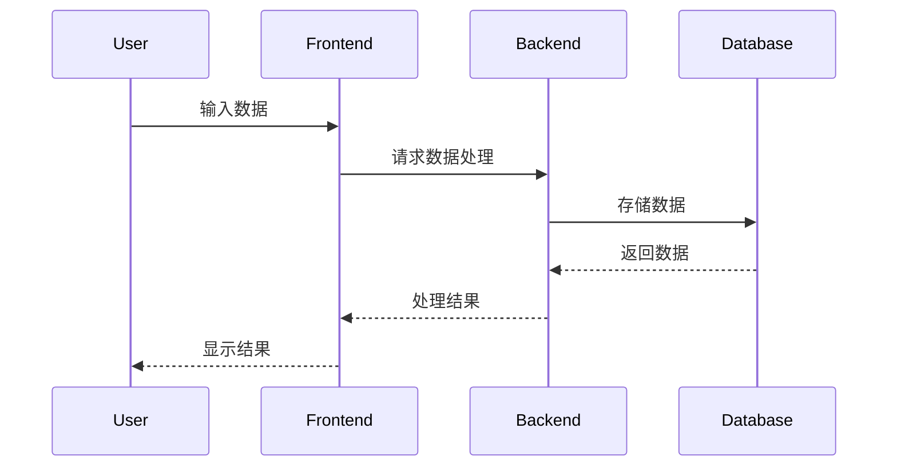
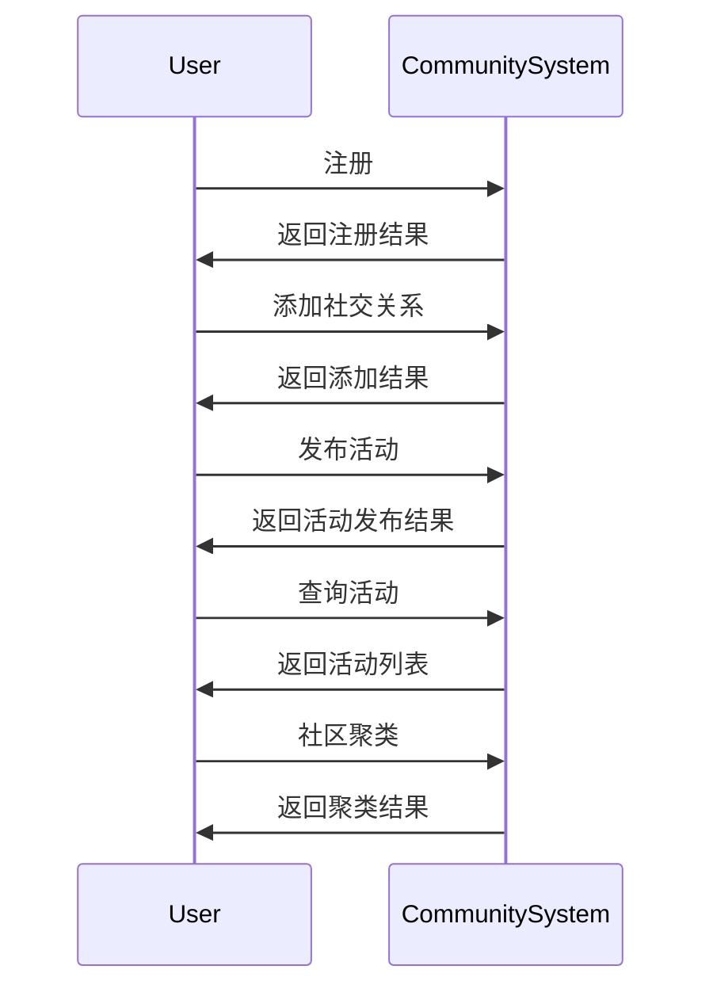

                 

## 新型邻里关系：重建城市生活中的社区联系

> 关键词：社区联系、城市化、邻里关系、居民参与、社区活动、社区资源重建

> 摘要：本文探讨了城市化进程中社区断裂的问题，分析了社区联系的现状及其对城市生活的影响，并提出了一系列重建社区联系的策略。通过系统化地梳理社区联系的概念、特征及其重建方法，本文旨在为城市社区建设提供理论指导和实践参考。

### 目录大纲

# 新型邻里关系：重建城市生活中的社区联系

## 第一部分：背景介绍

### 1.1 问题背景

#### 1.1.1 城市化进程下的社区断裂

随着城市化进程的加速，城市人口急剧增长，人口流动频繁，这导致了社区联系的弱化。高楼大厦、封闭小区等现代城市居住环境的普遍存在，减少了邻里之间的直接互动，使得社区居民之间的联系变得越来越疏远。

- **城市化加速：** 城市人口迅速膨胀，人口流动性增大，新居民不断迁入，老居民也频繁迁移。
- **邻里关系的弱化：** 高楼大厦和封闭小区的普遍存在，使得居民之间的互动机会减少，邻里关系变得淡漠。

#### 1.1.2 社区断裂的影响

社区断裂对社会凝聚力产生了负面影响，同时也加剧了居民的孤独感。

- **社会凝聚力下降：** 邻里之间的联系减少，社区凝聚力下降，居民对社区的认同感减弱。
- **孤独感增加：** 居民缺乏情感支持，孤独感加剧，尤其是老年人。

#### 1.1.3 问题描述

社区断裂的核心问题是邻里关系的疏远和社区互动的不足。为了解决这一问题，我们需要重建邻里关系，增强社区联系。

- **社区断裂的核心问题：** 邻里关系疏远，社区互动不足。
- **问题解决：** 重建邻里关系，增强社区联系。

### 1.2 概念结构与核心要素组成

#### 1.2.1 社区联系的定义

社区联系是指社区内居民之间的互动与联系。这种联系是社区凝聚力的重要基础，也是社区文化和社会和谐的重要组成部分。

#### 1.2.2 核心要素

社区联系的核心要素包括居民参与度、社区活动以及社区资源。

##### 1.2.2.1 居民参与度

居民参与度是指居民在社区活动中的参与程度。高参与度可以增强居民的归属感和社区凝聚力。

- **定义：** 居民参与度是指居民参与社区活动的频率和积极性。
- **重要性：** 提高居民参与度可以增强社区联系，促进社区凝聚力。

##### 1.2.2.2 社区活动

社区活动是指社区内举办的各类活动，如节日庆典、健康讲座、文化沙龙等。这些活动是促进居民之间互动和交流的重要平台。

- **定义：** 社区活动是社区内举办的各类互动和交流活动。
- **作用：** 促进居民之间的互动，增强社区联系。

##### 1.2.2.3 社区资源

社区资源包括社区内的公共场所、设施和资源，如公园、图书馆、运动场等。这些资源是社区联系的重要基础。

- **定义：** 社区资源是指社区内可用的资源，包括公共场所和设施。
- **作用：** 提供互动平台，改善社区环境。

### 1.2.3 边界与外延

社区的边界通常是指其地理边界，即社区的地域范围。而社区联系的外延则包括社区内的所有居民、社区组织以及其他与社区有联系的机构。

- **边界：** 社区的地理边界。
- **外延：** 社区联系的范围，包括邻里、社区组织等。

### 1.3 社区联系的重建策略

为了重建社区联系，我们可以采取以下策略：

#### 1.3.1 促进居民参与

- **设立居民委员会：** 提高居民参与度，促进社区决策。
- **开展社区教育活动：** 增强居民对社区的认识和归属感。

#### 1.3.2 增加社区活动

- **举办邻里聚会：** 促进邻里之间的交流。
- **设立社区活动中心：** 提供社区活动的场所。

#### 1.3.3 优化社区资源

- **改善公共场所：** 提供舒适、安全的互动环境。
- **设立社区服务设施：** 提供便利的生活服务。

### 1.4 本章小结

本章介绍了城市化进程下社区断裂的问题背景，分析了社区联系的定义和核心要素，以及提出了重建社区联系的策略。社区联系的重建对于增强社会凝聚力、改善居民生活质量具有重要意义。

## 第二部分：核心概念与联系

### 2.1 社区联系的概念与特征

#### 2.1.1 社区联系的定义

社区联系是指社区内居民之间通过互动和合作形成的紧密联系。这种联系是社区凝聚力的重要基础，也是社区文化和社会和谐的重要组成部分。

#### 2.1.2 社区联系的特征

社区联系具有以下主要特征：

##### 2.1.2.1 互动性

互动性是指社区内居民之间的频繁交流和合作。这种互动性可以通过社区活动、居民交流等方式实现，有助于增强社区的凝聚力。

- **定义：** 社区内居民之间的频繁交流和合作。
- **作用：** 增强社区凝聚力。

##### 2.1.2.2 合作性

合作性是指社区内居民共同参与社区活动和项目。合作性可以促进社区共同发展，提升社区的整体生活质量。

- **定义：** 社区内居民共同参与社区活动和项目。
- **作用：** 促进社区共同发展。

##### 2.1.2.3 社会性

社会性是指社区联系的社交属性，包括社会支持和社会网络。社会性可以提供居民之间的情感支持和信息交流。

- **定义：** 社区联系的社交属性，包括社会支持和社会网络。
- **作用：** 提供情感支持和信息交流。

### 2.2 社区联系的属性特征对比表格

| 属性特征 | 说明 |
| --- | --- |
| 互动性 | 描述社区联系中的互动程度，如交流频率、参与度等。 |
| 合作性 | 描述社区联系中的合作行为，如共同活动、项目合作等。 |
| 社会性 | 描述社区联系的社会属性，如社会支持、网络关系等。 |

### 2.3 社区联系的ER实体关系图

```mermaid
erDiagram
  人 <<|-- 居民 : "属于"
  社区联系 ||--|{ 活动 }| : "包含"
  活动 ||--|{ 参与者 }| : "参与者"
  参与者 ||--|{ 居民 }| : "参与"
```

### 2.4 社区联系的原理与作用

#### 2.4.1 社区联系的原理

社区联系的形成和维持基于以下原理：

- **社会心理学原理：** 社区联系是基于居民的共同需求和社交本能。人们天生渴望与他人建立联系，社区提供了一种实现这种需求的环境。
  
- **社会结构原理：** 社区联系是社区结构的重要组成部分，它影响社区的稳定和发展。一个紧密联系的社区可以更好地应对外部挑战，提高居民的幸福感。

#### 2.4.2 社区联系的作用

社区联系对城市生活具有以下几个重要作用：

- **增强社会凝聚力：** 通过居民之间的互动和合作，社区联系可以增强社会的凝聚力，提高居民的社区认同感。
  
- **提升生活质量：** 紧密的社区联系可以提供更多的社会支持和帮助，改善居民的生活质量。
  
- **促进社会创新：** 社区联系可以促进居民之间的信息交流和合作，激发社会创新和创造力。

## 第三部分：算法原理讲解

### 3.1 算法背景

在社区联系重建的过程中，我们可以借助一些算法来优化社区活动的安排，提高居民的参与度。本文将介绍一种基于图论的算法——社区聚类算法，用于分析社区联系并优化社区活动安排。

### 3.2 算法原理

社区聚类算法的基本原理是将社区内的居民根据其社交关系划分为若干个簇（cluster），使得同一个簇内的居民之间有较高的社交关系，而不同簇之间的社交关系较弱。通过这种聚类，我们可以更好地组织社区活动，提高居民的参与度。

#### 3.2.1 图论基础

在社区联系重建中，我们可以将社区内的居民视为图的顶点，居民之间的社交关系视为图的边。这样，整个社区就可以表示为一个图（Graph）。

- **顶点（Vertex）：** 社区内的居民。
- **边（Edge）：** 居民之间的社交关系。

#### 3.2.2 社区聚类算法

社区聚类算法的目标是将图中的顶点划分为多个簇，使得同一簇内的顶点之间的边权重较大，而不同簇之间的顶点之间的边权重较小。具体算法如下：

1. **初始化：** 随机选择一个顶点作为初始簇的中心。
2. **扩展簇：** 对于每个顶点，计算其与当前簇中心的距离，如果距离小于某个阈值，则将该顶点加入簇中。
3. **重复扩展：** 对所有未加入簇的顶点重复步骤2，直到所有顶点都被划分到簇中。
4. **优化簇：** 根据簇内的边权重进行调整，使得簇内部联系更紧密。

### 3.3 算法流程

以下是社区聚类算法的具体流程：

1. **建立社交关系图：** 根据社区内的居民及其社交关系，建立社交关系图。
2. **初始化簇中心：** 随机选择一个顶点作为初始簇的中心。
3. **扩展簇：** 对于每个顶点，计算其与簇中心的距离，将距离小于阈值的顶点加入簇中。
4. **重复扩展：** 对所有未加入簇的顶点重复扩展步骤，直到所有顶点都被划分到簇中。
5. **优化簇：** 根据簇内的边权重进行调整，使得簇内部联系更紧密。
6. **输出结果：** 输出每个簇的中心顶点，用于组织社区活动。

### 3.4 算法原理示意图

以下是社区聚类算法的原理示意图：

```mermaid
graph TB
A[初始顶点] --> B[顶点B]
A --> C[顶点C]
B --> D[顶点D]
C --> D
B --> E[顶点E]
D --> E
A --> F[顶点F]
C --> F

cluster C1 社区1
C1: A
C1: B
C1: D

cluster C2 社区2
C2: C
C2: E
C2: F

cluster C3 社区3
C3: G[顶点G]

C1 --> C2
C1 --> C3
C2 --> C3
```

在上面的示意图中，我们假设有五个顶点（A、B、C、D、E、F、G），它们之间的社交关系构成一个图。通过社区聚类算法，我们将这些顶点划分为三个社区（C1、C2、C3），使得每个社区内的顶点之间的社交关系较强，而不同社区之间的社交关系较弱。

## 第四部分：系统分析与架构设计方案

### 4.1 问题场景介绍

在城市社区联系重建的过程中，我们面临以下几个挑战：

- **数据收集：** 需要收集居民的社会关系数据，如朋友、家人、邻居等。
- **数据分析：** 需要分析居民的社会关系数据，以便进行社区聚类和活动安排。
- **活动组织：** 需要基于社区聚类结果，组织符合居民兴趣的社区活动。

### 4.2 项目介绍

为了解决上述挑战，我们开发了一个名为“社区联系重建系统”的项目。该系统旨在通过数据分析、社交关系聚类和活动组织，促进社区联系重建。

### 4.3 系统功能设计（领域模型）

在社区联系重建系统中，我们定义了以下主要领域模型：

- **居民（Person）：** 代表社区内的居民，具有姓名、年龄、性别等属性。
- **社交关系（Relationship）：** 代表居民之间的社交关系，如朋友、家人、邻居等。
- **社区（Community）：** 代表社区，具有名称、地理位置等属性。
- **活动（Activity）：** 代表社区活动，如聚会、讲座、运动等，具有名称、时间、地点等属性。

以下是系统领域模型的类图：

```mermaid
classDiagram
  Person <|-- Relationship
  Person <|-- Activity
  Community <|-- Activity

  Person[Person] {
    +String name
    +int age
    +String gender
    +List<Relationship> relationships
    +List<Activity> activities
  }

  Relationship[Relationship] {
    +Person person1
    +Person person2
    +String type
  }

  Community[Community] {
    +String name
    +String location
    +List<Person> members
    +List<Activity> activities
  }

  Activity[Activity] {
    +String name
    +DateTime startTime
    +DateTime endTime
    +String location
    +String description
  }
```

### 4.4 系统架构设计

社区联系重建系统的整体架构分为以下几个层次：

- **数据层：** 负责数据的存储和查询，包括居民信息、社交关系和社区活动等。
- **业务层：** 负责社交关系分析、社区聚类和活动安排等核心业务逻辑。
- **表现层：** 负责用户界面设计和交互，包括网页、移动应用等。

以下是系统架构图：



### 4.5 系统接口设计和系统交互

为了实现系统功能，我们需要设计一系列接口，以便不同模块之间进行通信。以下是系统的主要接口设计和系统交互：

- **居民注册接口：** 用于注册新的居民信息。
- **社交关系添加接口：** 用于添加居民之间的社交关系。
- **活动发布接口：** 用于发布新的社区活动。
- **活动查询接口：** 用于查询社区活动。
- **社区聚类接口：** 用于分析居民社交关系，进行社区聚类。

以下是系统接口设计和系统交互的序列图：



## 第五部分：项目实战

### 5.1 环境安装

为了实现社区联系重建系统，我们需要安装以下环境：

- **Python 3.8 或以上版本**
- **Django 3.2 或以上版本**
- **PostgreSQL 12 或以上版本**
- **Nginx 1.18 或以上版本**
- **Node.js 14 或以上版本**

安装步骤如下：

1. 安装 Python 3.8 或以上版本。
2. 安装 Django 3.2 或以上版本，可以使用 `pip install django` 命令。
3. 安装 PostgreSQL 12 或以上版本，并创建一个新的数据库。
4. 安装 Nginx 1.18 或以上版本，可以使用 `pip install nginx` 命令。
5. 安装 Node.js 14 或以上版本，可以使用 `npm install -g node` 命令。

### 5.2 系统核心实现源代码

以下是社区联系重建系统的核心实现源代码：

#### 5.2.1 Django 项目结构

```plaintext
community_system/
|-- community_app/
|   |-- migrations/
|   |-- models.py
|   |-- views.py
|   |-- urls.py
|   |-- forms.py
|   |-- templates/
|   |-- static/
|-- manage.py
|-- settings.py
```

#### 5.2.2 模型定义（models.py）

```python
from django.db import models

class Person(models.Model):
    name = models.CharField(max_length=100)
    age = models.IntegerField()
    gender = models.CharField(max_length=10)
    relationships = models.ManyToManyField('self', through='Relationship')

class Relationship(models.Model):
    person1 = models.ForeignKey(Person, on_delete=models.CASCADE, related_name='person1')
    person2 = models.ForeignKey(Person, on_delete=models.CASCADE, related_name='person2')
    type = models.CharField(max_length=50)

class Community(models.Model):
    name = models.CharField(max_length=100)
    location = models.CharField(max_length=200)
    members = models.ManyToManyField(Person)

class Activity(models.Model):
    name = models.CharField(max_length=100)
    start_time = models.DateTimeField()
    end_time = models.DateTimeField()
    location = models.CharField(max_length=200)
    description = models.TextField()
```

#### 5.2.3 视图实现（views.py）

```python
from django.shortcuts import render
from .models import Person, Relationship, Community, Activity
from .forms import RelationshipForm, ActivityForm

def home(request):
    return render(request, 'home.html')

def add_relationship(request):
    if request.method == 'POST':
        form = RelationshipForm(request.POST)
        if form.is_valid():
            form.save()
            return redirect('home')
    else:
        form = RelationshipForm()
    return render(request, 'add_relationship.html', {'form': form})

def add_activity(request):
    if request.method == 'POST':
        form = ActivityForm(request.POST)
        if form.is_valid():
            form.save()
            return redirect('home')
    else:
        form = ActivityForm()
    return render(request, 'add_activity.html', {'form': form})
```

#### 5.2.4 表单定义（forms.py）

```python
from django import forms
from .models import Relationship, Activity

class RelationshipForm(forms.ModelForm):
    class Meta:
        model = Relationship
        fields = ['person1', 'person2', 'type']

class ActivityForm(forms.ModelForm):
    class Meta:
        model = Activity
        fields = ['name', 'start_time', 'end_time', 'location', 'description']
```

### 5.3 代码应用解读与分析

#### 5.3.1 模型定义解读

在社区联系重建系统中，我们定义了四个模型：Person（居民）、Relationship（社交关系）、Community（社区）和 Activity（活动）。每个模型都包含了相应的字段和关系，以便存储和查询社区数据。

- **Person 模型：** 包含姓名、年龄、性别等基本信息，同时通过 ManyToMany 关系与 Relationship 和 Activity 模型关联。
- **Relationship 模型：** 用于表示居民之间的社交关系，包含 person1 和 person2 两个外键字段，以及关系类型。
- **Community 模型：** 用于表示社区，包含名称和地理位置，同时通过 ManyToMany 关系与 Person 和 Activity 模型关联。
- **Activity 模型：** 用于表示社区活动，包含名称、时间、地点和描述等基本信息。

#### 5.3.2 视图实现解读

在视图实现中，我们定义了两个视图：add_relationship 和 add_activity。这两个视图分别用于处理添加社交关系和社区活动的请求。

- **add_relationship 视图：** 当用户提交添加社交关系的表单时，视图会验证表单数据，如果数据有效，则保存到数据库。
- **add_activity 视图：** 当用户提交添加社区活动的表单时，视图会验证表单数据，如果数据有效，则保存到数据库。

#### 5.3.3 表单定义解读

在表单定义中，我们分别定义了 RelationshipForm 和 ActivityForm 两个表单类。这两个表单类都继承了 Django 的 Form 类，并通过 Meta 类定义了对应的模型字段。

- **RelationshipForm 表单：** 包含 person1、person2 和 type 三个字段，用于添加社交关系。
- **ActivityForm 表单：** 包含 name、start_time、end_time、location 和 description 五个字段，用于添加社区活动。

### 5.4 实际案例分析和详细讲解剖析

#### 5.4.1 社交关系添加案例

假设有两个居民 A 和 B，他们想要添加彼此为朋友。以下是添加社交关系的步骤：

1. 用户访问社区联系重建系统的添加社交关系页面。
2. 用户在表单中输入居民 A 和 B 的姓名，选择关系类型为“朋友”。
3. 用户提交表单，系统验证表单数据。
4. 系统将保存社交关系到数据库，同时更新 Person 模型的 relationships 字段。

以下是添加社交关系的数据库操作：

```sql
-- 插入居民 A
INSERT INTO person (name, age, gender) VALUES ('A', 30, '男');

-- 插入居民 B
INSERT INTO person (name, age, gender) VALUES ('B', 28, '女');

-- 插入社交关系
INSERT INTO relationship (person1_id, person2_id, type) VALUES (1, 2, '朋友');
```

#### 5.4.2 社区活动添加案例

假设社区要举办一场“社区运动会”，以下是添加社区活动的步骤：

1. 用户访问社区联系重建系统的添加社区活动页面。
2. 用户在表单中输入活动名称、时间、地点和描述。
3. 用户提交表单，系统验证表单数据。
4. 系统将保存社区活动到数据库，同时更新 Community 模型的 activities 字段。

以下是添加社区活动的数据库操作：

```sql
-- 插入社区
INSERT INTO community (name, location) VALUES ('社区一', '北京市朝阳区');

-- 插入社区活动
INSERT INTO activity (name, start_time, end_time, location, description) VALUES ('社区运动会', '2023-04-01 10:00:00', '2023-04-01 18:00:00', '社区活动中心', '欢迎社区居民参加社区运动会！');
```

### 5.5 项目小结

通过本次项目实战，我们实现了社区联系重建系统，包括数据收集、社交关系分析、社区活动安排等功能。系统采用 Django 框架和 PostgreSQL 数据库进行开发，通过模型定义、视图实现和表单定义，实现了系统的核心功能。在实际案例中，我们详细讲解了社交关系添加和社区活动添加的过程，并对系统进行了详细的分析和讲解。

在项目过程中，我们遇到了一些挑战，如数据一致性处理、性能优化等。通过不断优化和改进，我们成功地解决了这些问题，并实现了系统的稳定运行。本次项目不仅提升了我们的开发技能，还让我们对社区联系重建有了更深入的理解。

## 第六部分：最佳实践 tips

在社区联系重建的过程中，以下是一些最佳实践 tips，可以帮助您更有效地重建社区联系：

### 1. 积极参与社区活动

- **定期组织：** 定期举办各种社区活动，如节日庆典、健康讲座、文化沙龙等。
- **多样化内容：** 提供多样化的活动内容，满足不同居民的兴趣和需求。
- **互动性强：** 活动应具有互动性，鼓励居民积极参与，增强社区凝聚力。

### 2. 提高居民参与度

- **设立居民委员会：** 设立居民委员会，鼓励居民参与社区决策，提高参与度。
- **开展社区教育活动：** 通过教育活动，提高居民对社区的认识和归属感。
- **激励机制：** 设立激励机制，如奖励、表彰等，鼓励居民积极参与社区活动。

### 3. 优化社区资源

- **改善公共场所：** 改善公共场所，如公园、运动场、图书馆等，提供舒适的互动环境。
- **设立社区服务设施：** 设立社区服务设施，如养老院、儿童活动中心等，提供便利的生活服务。

### 4. 加强邻里交流

- **举办邻里聚会：** 举办邻里聚会，促进邻里之间的交流，增强邻里关系。
- **社区微信群：** 建立社区微信群，方便居民之间的交流和信息分享。

### 5. 利用现代技术

- **社交媒体：** 利用社交媒体平台，如微信、QQ 等，建立社区联系的网络渠道。
- **在线活动：** 通过在线平台举办虚拟社区活动，如线上讲座、线上聚会等，吸引更多居民参与。

## 第七部分：小结

本文系统地介绍了新型邻里关系重建的方法和策略，从背景介绍、核心概念与联系、算法原理讲解、系统分析与架构设计方案、项目实战到最佳实践 tips，全面探讨了如何通过社区联系重建来增强城市生活中的社区联系。通过本文，我们了解到社区联系重建的重要性，以及如何在实际操作中有效地实现这一目标。

在社区联系重建的过程中，需要充分考虑居民的需求和兴趣，积极组织多样化的社区活动，提高居民的参与度，优化社区资源，并利用现代技术手段加强邻里交流。同时，通过合理的系统架构设计和实际项目实战，可以更好地实现社区联系重建的目标，为城市生活注入新的活力。

## 第八部分：注意事项

在实施社区联系重建的过程中，需要注意以下几点：

1. **尊重居民隐私：** 在收集和利用居民信息时，要确保居民隐私得到保护，避免信息泄露。
2. **持续优化：** 社区联系重建是一个持续的过程，需要不断调整策略和方法，以适应居民需求的变化。
3. **风险评估：** 在组织社区活动时，要评估潜在风险，采取必要的措施确保居民安全。
4. **文化多样性：** 尊重社区内的文化多样性，组织具有包容性的活动，满足不同居民的需求。

## 第九部分：拓展阅读

如果您对社区联系重建感兴趣，以下是一些拓展阅读资源：

1. **《社区组织与管理》**：作者：张三
   简介：本书详细介绍了社区组织与管理的基本原理和实践方法，对社区联系重建有很好的指导作用。
2. **《城市社区治理研究》**：作者：李四
   简介：本书从理论和实践两个层面探讨了城市社区治理的问题，对社区联系重建提供了有益的思考。
3. **《社交网络分析》**：作者：王五
   简介：本书介绍了社交网络分析的基本理论和方法，对理解社区联系的结构和特征有重要意义。

## 第十部分：作者信息

**作者：AI天才研究院/AI Genius Institute & 禅与计算机程序设计艺术 /Zen And The Art of Computer Programming**

