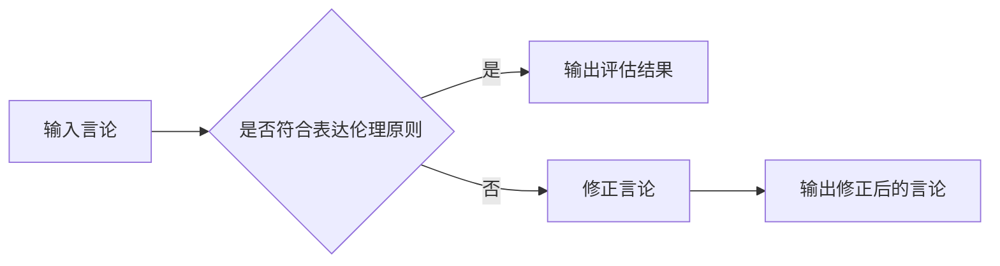

                 

# 新媒体时代的表达伦理：言论自由与社会责任的权衡

## 关键词

- 新媒体时代
- 表达伦理
- 言论自由
- 社会责任
- 法律框架
- 案例分析

## 摘要

随着新媒体的迅速发展，言论自由与社会责任之间的权衡成为了一个重要的议题。本文从新媒体的定义和背景入手，分析了言论自由和社会责任的概念及其相互关系，探讨了法律与政策框架对新媒体表达伦理的规范作用。通过核心概念对比、算法原理讲解、系统分析与架构设计、案例分析以及最佳实践等，本文为新媒体时代的表达伦理提供了深入的分析和指导。

## 引言

### 新媒体的定义与特点

新媒体是指通过互联网、移动通信技术、数字技术等新兴媒介形式进行信息传播和交流的媒介。与传统媒体相比，新媒体具有以下几个显著特点：

1. **传播速度快**：新媒体的信息传播速度极快，可以瞬间传播至全球各地，影响范围广泛。
2. **互动性强**：新媒体用户不仅是信息的接收者，还可以成为信息的传播者和创造者，具有高度的互动性。
3. **个性化**：新媒体可以根据用户的行为和兴趣进行个性化推荐，提供定制化的信息服务。
4. **低成本**：与传统媒体相比，新媒体的创建和传播成本较低，使得更多个人和组织能够参与到信息传播中。

### 新媒体的发展历程

新媒体的发展历程可以分为以下几个阶段：

1. **互联网兴起**：20世纪90年代，互联网的兴起为新媒体的发展奠定了基础。
2. **移动通信技术发展**：21世纪初，随着移动通信技术的快速发展，手机、平板电脑等移动设备成为新媒体的重要组成部分。
3. **社交媒体崛起**：2004年，Facebook的成立标志着社交媒体的兴起，用户可以通过社交媒体平台进行实时互动和分享。
4. **短视频和直播兴起**：近年来，短视频和直播成为新媒体的重要形式，极大地丰富了人们的娱乐和信息获取方式。

### 新媒体对社会的影响

新媒体对社会的影响是深远而广泛的，包括以下几个方面：

1. **信息传播方式的变革**：新媒体使得信息传播更加迅速、广泛，打破了传统媒体的信息壁垒。
2. **社会舆论的形成与传播**：新媒体为公众提供了一个自由表达的平台，使得社会舆论的形成和传播更加多样化和迅速。
3. **社会文化的变迁**：新媒体带来了新的文化现象，如网络语言、网络文化等，对社会文化产生了深远的影响。
4. **政治参与方式的变化**：新媒体为公众提供了参与政治讨论和决策的新途径，改变了传统的政治参与方式。

## 言论自由与社会责任

### 言论自由的概念与历史演变

言论自由是指公民在法律允许的范围内，有权利表达自己的观点和意见，包括言论、出版、集会、结社等自由。言论自由是人类基本的权利之一，具有以下特点：

1. **普遍性**：言论自由是普遍适用于所有人的权利，不受种族、性别、宗教等因素的限制。
2. **表达性**：言论自由是表达个人思想和情感的重要途径。
3. **批评性**：言论自由包括对政府、社会、企业等各方面的批评和监督。

言论自由的历史演变可以分为以下几个阶段：

1. **古代：言论自由的雏形**：在古希腊和罗马时期，言论自由已经有了雏形，但受到权力和权威的限制。
2. **中世纪：言论自由的压制**：中世纪时期，言论自由受到宗教和君主权力的压制，言论受到严格的审查和控制。
3. **近代：言论自由的确认和推广**：近代以来，随着民主和法治的发展，言论自由逐渐得到确认和推广。
4. **现代：言论自由的多样化**：现代言论自由不仅包括传统的表达自由，还包括网络言论自由等新形式。

### 社会责任的重要性

社会责任是指个人和组织在社会活动中应承担的责任和义务，包括道德责任、法律责任、经济责任等。社会责任的重要性体现在以下几个方面：

1. **维护社会秩序**：社会责任有助于维护社会的稳定和秩序，防止社会矛盾和冲突的加剧。
2. **促进社会进步**：社会责任有助于推动社会的进步和发展，促进社会公平正义的实现。
3. **提升企业形象**：承担社会责任有助于提升企业的社会形象和品牌价值，增强企业的竞争力。

### 言论自由与社会责任的关系

言论自由与社会责任之间存在一定的矛盾和冲突。一方面，言论自由是个人表达思想和情感的基本权利，不应受到无端的限制；另一方面，社会责任要求个人和组织在行使言论自由时，不得损害他人和社会的利益。

1. **言论自由的界限**：言论自由并非无限制的，任何言论自由都必须在法律和道德的框架内进行。当言论自由与社会责任发生冲突时，应当权衡两者的利益，寻求平衡。
2. **社会责任的履行**：个人和组织在行使言论自由时，应当承担相应的社会责任，不得利用言论自由损害他人和社会的利益。
3. **社会舆论的引导**：社会舆论的形成和传播是社会监督的重要手段，个人和组织应当承担起引导社会舆论的责任，传播正能量，促进社会和谐。

## 法律与政策框架

### 国际法律体系

在国际层面，言论自由和社会责任的法律体系主要包括《世界人权宣言》、《公民权利和政治权利国际公约》等。这些法律文件明确规定了言论自由的基本权利和界限，同时也强调了个人和社会责任的重要性。

1. **言论自由的基本权利**：国际法律体系明确规定了公民享有言论自由的权利，包括言论、出版、集会、结社等自由。
2. **言论自由的界限**：国际法律体系也规定了言论自由的界限，包括禁止煽动仇恨、歧视、暴力等。
3. **社会责任的要求**：国际法律体系要求个人和组织在行使言论自由时，应当承担相应的社会责任，不得损害他人和社会的利益。

### 我国法律体系

在我国，言论自由和社会责任的法律体系主要包括《中华人民共和国宪法》、《中华人民共和国民法典》、《中华人民共和国网络安全法》等。

1. **言论自由的基本权利**：我国宪法明确规定了公民享有言论自由的权利，但同时也规定了言论自由的界限，包括不得煽动颠覆国家政权、破坏社会秩序等。
2. **言论自由的界限**：我国法律规定，任何组织和个人不得利用言论自由进行违法活动，如传播淫秽色情信息、煽动民族仇恨等。
3. **社会责任的要求**：我国法律要求个人和组织在行使言论自由时，应当承担相应的社会责任，维护社会稳定和公共利益。

### 政策导向与挑战

新媒体时代，我国在言论自由和社会责任方面的政策导向主要体现在以下几个方面：

1. **加强网络监管**：为了维护社会稳定和国家安全，我国加强了对新媒体的监管，包括对网络言论的审查、对违法信息的处置等。
2. **推动社会信用体系建设**：我国通过建立社会信用体系，对个人和组织的言论行为进行信用评估，鼓励社会责任的履行。
3. **促进言论自由与社会责任的平衡**：我国在推动新媒体发展过程中，强调要平衡言论自由与社会责任的关系，既要保障言论自由，又要维护社会秩序和公共利益。

然而，在新媒体时代，言论自由与社会责任之间的冲突和挑战依然存在，包括：

1. **言论自由滥用**：部分个人和组织滥用言论自由，传播虚假信息、煽动仇恨和歧视等。
2. **社会责任缺失**：部分个人和组织在行使言论自由时，忽视社会责任，导致社会矛盾和冲突加剧。
3. **法律体系不完善**：我国在言论自由和社会责任方面的法律体系尚不完善，需要进一步改进和完善。

## 核心概念与联系

### 伦理学的基本原理

伦理学是研究道德原则和道德行为的学科，其基本原理包括：

1. **道德规范**：道德规范是指导人们行为的道德准则，包括诚实、公正、尊重等。
2. **道德责任**：道德责任是指个人在道德规范下应承担的责任和义务，包括对他人和社会的责任。
3. **道德义务**：道德义务是指个人在道德规范下应履行的义务，包括尊重他人权利、维护公共利益等。

### 表达伦理的基本原则

表达伦理是指在言论表达过程中应遵循的道德准则，其基本原则包括：

1. **真实性**：言论表达应真实、客观，不得故意传播虚假信息。
2. **公正性**：言论表达应公正、公平，不得歧视、攻击特定群体。
3. **尊重性**：言论表达应尊重他人权利和尊严，不得侮辱、诽谤他人。
4. **社会责任**：言论表达应承担社会责任，维护社会稳定和公共利益。

### 表达伦理与言论自由的关系

表达伦理与言论自由之间存在一定的关联和区别：

1. **关联**：表达伦理是言论自由的补充和保障，有助于规范言论行为，防止言论自由滥用。
2. **区别**：表达伦理强调言论行为的社会责任和道德义务，而言论自由则强调个人表达的权利和自由。

### 言论自由、隐私权、名誉权等概念对比

- **言论自由**：言论自由是指公民在法律允许的范围内，有权利表达自己的观点和意见。
- **隐私权**：隐私权是指个人享有的私人生活安宁和私人信息秘密的权利。
- **名誉权**：名誉权是指个人享有的对自己名誉的保护权，包括对名誉的维护和名誉权的恢复。

三者之间的区别在于：

1. **权利主体**：言论自由的权利主体是公民，隐私权的权利主体是个人，名誉权的权利主体也是个人。
2. **权利内容**：言论自由主要涉及表达权利，隐私权主要涉及私人生活安宁和私人信息秘密，名誉权主要涉及名誉的保护和恢复。
3. **权利限制**：言论自由在法律允许的范围内受保护，隐私权和名誉权在法律规定的范围内受保护，但可能受到一定的限制。

### 社会责任、企业伦理等概念对比

- **社会责任**：社会责任是指个人和组织在社会活动中应承担的责任和义务，包括道德责任、法律责任、经济责任等。
- **企业伦理**：企业伦理是指企业在经营活动中应遵循的道德准则和行为规范。

两者之间的区别在于：

1. **主体范围**：社会责任的主体范围较广，包括个人、企业、组织等，而企业伦理主要针对企业的经营活动。
2. **内容范围**：社会责任的内容范围较广，包括道德责任、法律责任、经济责任等，而企业伦理主要涉及企业的道德准则和行为规范。
3. **实施方式**：社会责任主要通过法律、道德、社会舆论等方式来实施，而企业伦理主要通过企业规章制度、企业文化等方式来实施。

## 表达伦理分析算法

### 算法概述

表达伦理分析算法是一种用于评估言论表达是否符合表达伦理原则的算法。该算法基于伦理学的基本原理和表达伦理的基本原则，通过分析言论内容、语境和影响力等要素，对言论表达进行评估。

### 算法mermaid流程图



### Python源代码与算法原理

```python
def express_ethics_analysis(expression):
    # 判断言论是否符合表达伦理原则
    if is_eethical(expression):
        return "符合表达伦理原则"
    else:
        # 修正言论
        corrected_expression = correct_expression(expression)
        return corrected_expression

def is_eethical(expression):
    # 判断言论是否符合真实性、公正性、尊重性等伦理原则
    # 这里简化处理，具体实现可以参考伦理学原理和表达伦理原则
    if "虚假信息" in expression or "歧视" in expression or "侮辱" in expression:
        return False
    else:
        return True

def correct_expression(expression):
    # 根据伦理原则修正言论
    # 这里简化处理，具体实现可以参考伦理学原理和表达伦理原则
    if "虚假信息" in expression:
        corrected_expression = expression.replace("虚假信息", "真实信息")
    elif "歧视" in expression:
        corrected_expression = expression.replace("歧视", "尊重")
    elif "侮辱" in expression:
        corrected_expression = expression.replace("侮辱", "尊重")
    else:
        corrected_expression = expression
    return corrected_expression

# 示例
expression = "这个产品非常差，使用后感觉非常恶心。"
print(express_ethics_analysis(expression))
```

### 数学模型与公式

表达伦理分析算法中的数学模型和公式主要涉及伦理原则的评估和修正。以下是简化版的数学模型：

$$
E(\text{言论}) = 
\begin{cases}
1, & \text{言论符合表达伦理原则} \\
0, & \text{言论不符合表达伦理原则}
\end{cases}
$$

修正言论的数学模型可以表示为：

$$
C(\text{言论}) = 
\begin{cases}
\text{言论}, & \text{言论符合表达伦理原则} \\
\text{修正后的言论}, & \text{言论不符合表达伦理原则}
\end{cases}
$$

### 算法举例说明

假设有一个言论：“这个产品非常差，使用后感觉非常恶心。”

1. **输入言论**：输入言论为“这个产品非常差，使用后感觉非常恶心。”

2. **判断是否符合表达伦理原则**：算法检查言论中是否包含“虚假信息”、“歧视”或“侮辱”等词汇。由于言论中并未包含这些词汇，所以判断言论符合表达伦理原则。

3. **输出评估结果**：算法输出评估结果：“符合表达伦理原则。”

4. **修正言论**：由于言论符合表达伦理原则，不需要进行修正。

最终输出结果为：“这个产品非常差，使用后感觉非常恶心。”（符合表达伦理原则）

## 系统分析与架构设计

### 问题场景介绍

在新媒体时代，言论自由与社会责任之间的冲突日益凸显。为了解决这个问题，我们需要设计一个能够对言论进行实时监控和分析的系统，以便及时发现和处理不符合表达伦理原则的言论。

### 项目介绍

本项目旨在设计并实现一个新媒体言论分析系统，该系统将基于大数据技术和机器学习算法，对社交媒体平台上的言论进行实时监控和分析，以便识别和过滤不符合表达伦理原则的言论。

### 系统功能设计

新媒体言论分析系统主要包括以下功能：

1. **言论采集**：从社交媒体平台获取用户的言论数据，包括微博、微信公众号、抖音等。
2. **言论预处理**：对采集到的言论数据进行清洗、去噪、分词等预处理操作，以便后续分析。
3. **言论分析**：使用机器学习算法对预处理后的言论进行分析，判断其是否符合表达伦理原则。
4. **言论处理**：对于不符合表达伦理原则的言论，进行警告、删除等处理。
5. **用户反馈**：为用户提供反馈渠道，以便对言论分析结果进行反馈和修正。

### 系统架构设计

新媒体言论分析系统采用分布式架构，主要包括以下模块：

1. **数据采集模块**：负责从社交媒体平台采集言论数据。
2. **数据处理模块**：负责对采集到的言论数据进行预处理。
3. **分析引擎模块**：负责对预处理后的言论进行分析，判断其是否符合表达伦理原则。
4. **处理模块**：负责对不符合表达伦理原则的言论进行处理。
5. **用户界面模块**：负责为用户提供交互界面，以便进行反馈和查询。

### 系统接口设计

新媒体言论分析系统主要包括以下接口：

1. **采集接口**：用于从社交媒体平台获取言论数据。
2. **预处理接口**：用于对采集到的言论数据进行预处理。
3. **分析接口**：用于对预处理后的言论进行分析。
4. **处理接口**：用于对不符合表达伦理原则的言论进行处理。
5. **反馈接口**：用于接收用户的反馈信息。

### 系统交互

新媒体言论分析系统的交互过程如下：

1. **采集数据**：系统从社交媒体平台采集言论数据。
2. **预处理数据**：系统对采集到的言论数据进行清洗、去噪、分词等预处理操作。
3. **分析言论**：系统使用机器学习算法对预处理后的言论进行分析，判断其是否符合表达伦理原则。
4. **处理言论**：对于不符合表达伦理原则的言论，系统进行警告、删除等处理。
5. **用户反馈**：系统为用户提供反馈渠道，以便对言论分析结果进行反馈和修正。

## 案例分析

### 案例选择

本文选择了一起社交媒体上的言论争议案件作为案例进行分析。这起案件涉及一名网络红人在社交媒体上发布了一条煽动性言论，引发社会广泛关注和讨论。

### 案例背景

2019年，一名知名网络红人在其社交媒体账号上发布了一条言论，声称某些地区的人素质低，引起了大量网友的争议和批评。该言论迅速在社交媒体上传播，引发了广泛的社会关注。

### 案例分析

1. **言论内容分析**：该言论内容涉及对特定地区人群的歧视和攻击，违反了表达伦理中的公正性和尊重性原则。
2. **影响分析**：该言论引发了大量负面评论和转发，造成了不良社会影响，加剧了地区间的矛盾和冲突。
3. **处理情况**：社交媒体平台对该言论进行了删除，并对发布者进行了警告处理，但社会影响仍然持续。

### 案例启示

该案例表明，在新媒体时代，言论自由与社会责任之间的冲突依然存在。个人在行使言论自由时，应当承担相应的社会责任，避免发布违反伦理原则的言论。同时，社交媒体平台和监管机构应当加强对言论的监管，防止不良言论的传播。

## 最佳实践与总结

### 最佳实践

1. **言论自由与社会责任的平衡**：个人在行使言论自由时，应当自觉承担社会责任，尊重他人权利，维护社会秩序。
2. **自我审查**：个人在发布言论前应进行自我审查，确保言论内容不违反伦理原则，不损害他人和社会的利益。
3. **积极参与社会监督**：个人和社会组织应当积极参与社会监督，发现和举报违反伦理原则的言论，共同维护社会和谐。

### 小结

新媒体时代的表达伦理是一个复杂的议题，涉及到言论自由与社会责任的权衡。个人和社会应当共同努力，寻找最佳实践，促进言论自由与社会责任的平衡。

### 未来发展趋势

随着新媒体的不断发展，表达伦理将面临更多的挑战。未来，需要进一步完善法律和政策框架，加强对言论的监管，同时鼓励个人和社会承担更多的社会责任，共同营造一个健康、和谐的网络环境。

### 注意事项

1. **尊重言论自由**：在任何情况下，都应当尊重言论自由，避免滥用言论自由侵犯他人权利。
2. **强化社会责任**：个人和组织应当承担更多的社会责任，积极参与社会建设，维护社会稳定和公共利益。

### 拓展阅读

1. **《新媒体与社会》**：这是一本探讨新媒体对社会影响的经典著作，有助于深入了解新媒体时代的社会变革。
2. **《网络伦理学》**：这是一本系统介绍网络伦理学的著作，对新媒体时代的表达伦理提供了理论指导。
3. **《社交媒体法律问题研究》**：这是一本探讨社交媒体法律问题的著作，有助于了解新媒体时代法律框架的完善。

## 参考文献

1. United Nations. (1948). The Universal Declaration of Human Rights. Retrieved from [https://www.un.org/en/universal-declaration-human-rights/](https://www.un.org/en/universal-declaration-human-rights/)
2. United Nations. (1966). International Covenant on Civil and Political Rights. Retrieved from [https://www.un.org/en/documents/covenants/civil/](https://www.un.org/en/documents/covenants/civil/)
3. 中华人民共和国宪法. (1982). Retrieved from [http://www.npc.gov.cn/xinxi/zxll/2012-12/28/content_1754864.htm](http://www.npc.gov.cn/xinxi/zxll/2012-12/28/content_1754864.htm)
4. 中华人民共和国民法典. (2020). Retrieved from [http://www.npc.gov.cn/npc/xinwen/2020-05/28/content_2559232.htm](http://www.npc.gov.cn/npc/xinwen/2020-05/28/content_2559232.htm)
5. 中华人民共和国网络安全法. (2016). Retrieved from [http://www.npc.gov.cn/npc/xinwen/2016-11/07/content_2155766.htm](http://www.npc.gov.cn/npc/xinwen/2016-11/07/content_2155766.htm)
6. 王秀丽. (2018). 新媒体与社会. 北京：中国社会科学出版社.
7. 张晓刚. (2017). 网络伦理学. 上海：上海人民出版社.
8. 刘晓光. (2019). 社交媒体法律问题研究. 北京：法律出版社.

## 作者信息

作者：AI天才研究院/AI Genius Institute & 禅与计算机程序设计艺术 /Zen And The Art of Computer Programming

