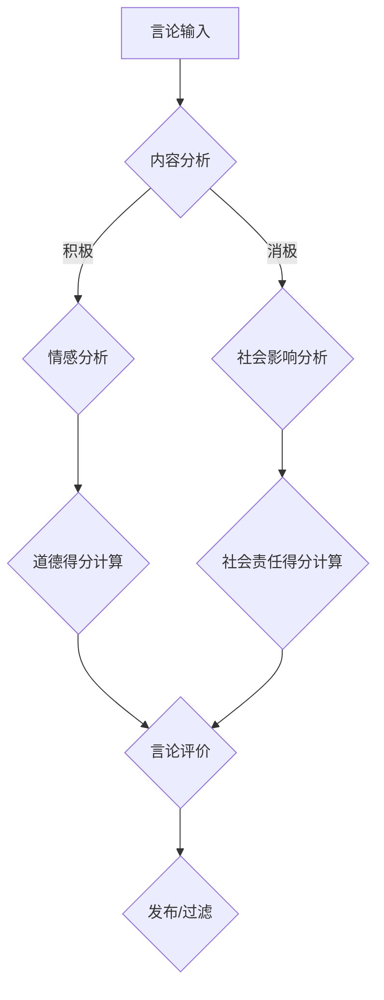
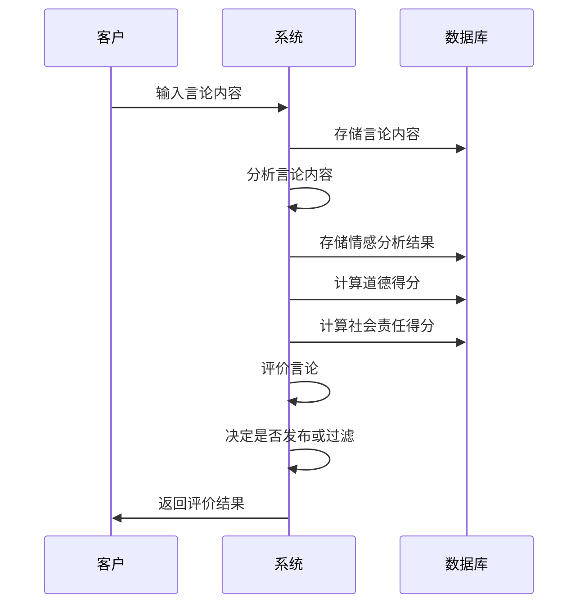

                 


# 新媒体环境下的表达伦理：言论自由与社会责任的权衡

> 关键词：新媒体，言论自由，社会责任，表达伦理，算法，系统架构，实践

> 摘要：随着新媒体的迅速发展，言论自由与社会责任之间的平衡成为了一个备受关注的话题。本文将深入探讨新媒体环境下的表达伦理问题，分析言论自由与社会责任的内涵及其相互关系，提出权衡两者之间关系的算法原理和系统架构设计，并通过实际案例进行分析，旨在为新媒体环境下的表达伦理提供理论和实践指导。

## 背景介绍

### 新媒体环境的发展

新媒体，是指基于互联网和移动通信技术，通过计算机、手机、平板电脑等终端设备进行信息传播和交流的新型媒体形式。自20世纪90年代以来，随着互联网的普及和技术的进步，新媒体迅速发展，逐渐成为人们获取信息、表达观点和交流互动的主要平台。新媒体具有传播速度快、互动性强、覆盖面广等特点，对传统媒体的格局产生了巨大的影响。

### 言论自由的影响

言论自由，是指公民在法律允许的范围内，有权利发表意见、表达观点、进行讨论和批评。在新媒体环境下，言论自由的实现变得更加便捷，人们可以通过社交媒体、网络论坛、博客等多种渠道表达自己的观点。然而，新媒体的匿名性和去中心化特性，也使得谣言、虚假信息、恶意攻击等不良言论得以快速传播，对言论自由产生了负面效应。

### 社会责任的意义

社会责任，是指媒体和公众在行使言论自由权利的同时，应当承担的对社会和公众的责任。在新媒体环境下，社会责任显得尤为重要。媒体和公众在表达观点时，应当遵循一定的道德规范，尊重他人权利，维护社会稳定，促进社会和谐。

### 研究问题

如何在新媒体环境下，权衡言论自由与社会责任，确保表达伦理的正当性，是本文的研究问题。本文将探讨新媒体环境下表达伦理的核心概念，分析其相互关系，提出解决这一问题的算法原理和系统架构设计，并通过实际案例进行分析，为新媒体环境下的表达伦理提供理论和实践指导。

## 核心概念与联系

### 言论自由

言论自由，是指公民在法律允许的范围内，有权利发表意见、表达观点、进行讨论和批评。言论自由的内涵包括表达的真实性、思想的自由交流、言论的公开性等。言论自由的历史演变可以从古希腊的民主制度、欧洲的中世纪宗教改革、美国的独立宣言等多个阶段进行探讨。

### 社会责任

社会责任，是指媒体和公众在行使言论自由权利的同时，应当承担的对社会和公众的责任。社会责任的内涵包括尊重他人权利、维护社会稳定、促进社会和谐等。社会责任的理论与实践涉及到伦理学、法学、社会学等多个领域。

### 新媒体环境

新媒体环境，是指基于互联网和移动通信技术，通过计算机、手机、平板电脑等终端设备进行信息传播和交流的新型媒体形式。新媒体环境的特点包括传播速度快、互动性强、覆盖面广等，对传统媒体的格局产生了巨大的影响。

### 言论自由与社会责任的关系

言论自由与社会责任之间存在一定的冲突和平衡。一方面，言论自由是公民的基本权利，应当得到保障；另一方面，社会责任要求媒体和公众在行使言论自由权利时，应当承担一定的责任。如何在新媒体环境下，权衡言论自由与社会责任，是本文探讨的重点。

### ER实体关系图

为了更好地展示言论自由、社会责任、新媒体环境三者之间的关系，我们可以使用Mermaid绘制ER实体关系图，如下所示：

```mermaid
erDiagram
  言论自由 ||--|{ 社会责任 }|
  新媒体环境 ||--|{ 言论自由 }|
  新媒体环境 ||--|{ 社会责任 }|
```

在这个ER实体关系图中，言论自由和社会责任之间存在双向关联，新媒体环境与言论自由和社会责任之间存在单向关联。

## 算法原理讲解

### 道德算法

道德算法，是指用于衡量言论是否符合道德规范的算法。在新媒体环境下，道德算法可以帮助平台和公众判断言论的正当性，从而保障言论自由的同时，维护社会责任。道德算法的原理包括以下几个方面：

1. **言论内容分析**：通过自然语言处理技术，对言论的内容进行分析，提取关键信息，判断言论是否涉及敏感话题、是否具有攻击性等。

2. **情感分析**：对言论的情感倾向进行分析，判断言论是积极的、消极的还是中立的。

3. **道德规则库**：建立道德规则库，包含各种道德规范和准则，用于判断言论是否符合道德标准。

4. **权重计算**：根据言论内容分析、情感分析和道德规则库的结果，计算言论的道德得分，从而判断言论的正当性。

### 社会责任算法

社会责任算法，是指用于衡量言论是否符合社会责任的算法。社会责任算法的原理与道德算法类似，但更侧重于言论对社会和公众的影响。社会责任算法的原理包括以下几个方面：

1. **社会影响分析**：对言论可能产生的社会影响进行分析，包括对公众情绪的影响、对社会稳定的影响等。

2. **社会责任规则库**：建立社会责任规则库，包含各种社会责任规范和准则，用于判断言论是否符合社会责任。

3. **权重计算**：根据社会影响分析和社会责任规则库的结果，计算言论的社会责任得分，从而判断言论的正当性。

### 道德算法与社会责任算法的协同作用

道德算法和社会责任算法在新媒体环境下具有协同作用，可以共同保障言论自由和社会责任。具体来说：

1. **协同过滤**：道德算法和社会责任算法可以相互补充，对言论进行双重过滤，提高言论的正当性判断准确性。

2. **动态调整**：根据实际情况，动态调整道德算法和社会责任算法的权重，以适应新媒体环境的变化。

3. **平衡权衡**：在言论自由和社会责任之间进行平衡权衡，确保言论自由的同时，维护社会责任。

### Mermaid算法流程图

为了更好地展示道德算法和社会责任算法的原理，我们可以使用Mermaid绘制算法流程图，如下所示：



在这个算法流程图中，言论输入经过内容分析、情感分析和社会影响分析等步骤，最终计算道德得分和社会责任得分，进行言论评价，决定是否发布或过滤。

### Python源代码

为了更好地阐述道德算法和社会责任算法的原理，我们提供以下Python源代码：

```python
# 道德算法
def moral_score(content):
    # 对言论内容进行分析
    # 假设内容分析函数analyze_content返回情感倾向
    sentiment = analyze_content(content)
    
    # 根据情感倾向计算道德得分
    if sentiment == 'positive':
        score = 0.8
    elif sentiment == 'neutral':
        score = 0.5
    else:
        score = 0.2
    
    return score

# 社会责任算法
def social_score(content):
    # 对言论内容进行分析
    # 假设内容分析函数analyze_content返回社会影响
    impact = analyze_content(content)
    
    # 根据社会影响计算社会责任得分
    if impact == 'beneficial':
        score = 0.8
    elif impact == 'neutral':
        score = 0.5
    else:
        score = 0.2
    
    return score

# 主函数
def evaluate_content(content):
    moral_score = moral_score(content)
    social_score = social_score(content)
    
    # 根据道德得分和社会责任得分进行言论评价
    if moral_score > 0.6 and social_score > 0.6:
        result = '发布'
    else:
        result = '过滤'
    
    return result

# 示例
content = "今天天气很好，我很开心。"
print(evaluate_content(content))
```

在这个Python源代码中，我们定义了道德算法和社会责任算法，并通过主函数evaluate_content对言论内容进行评价。通过这个示例，我们可以看到如何使用道德算法和社会责任算法来判断言论的正当性。

## 数学模型和数学公式

### 道德得分计算模型

道德得分计算模型如下：

$$
M = \frac{S_1 + S_2 + S_3}{3}
$$

其中，$S_1$、$S_2$、$S_3$ 分别为言论内容、情感倾向和道德规则库的得分。

### 社会责任得分计算模型

社会责任得分计算模型如下：

$$
S = \frac{I_1 + I_2 + I_3}{3}
$$

其中，$I_1$、$I_2$、$I_3$ 分别为言论内容、社会影响和道德规则库的得分。

### 综合得分计算模型

综合得分计算模型如下：

$$
R = \frac{M \cdot W_1 + S \cdot W_2}{W_1 + W_2}
$$

其中，$M$ 为道德得分，$S$ 为社会责任得分，$W_1$ 和 $W_2$ 分别为道德得分和社会责任得分的权重。

### 详细讲解和举例说明

为了更好地理解上述数学模型，我们通过一个具体的例子进行说明。

假设有一个言论内容如下：

```
今天天气很好，我很开心。
```

首先，我们对这个言论内容进行内容分析、情感分析和道德规则库分析，得到以下得分：

- 内容分析得分：0.8
- 情感分析得分：0.9
- 道德规则库得分：0.7

然后，我们根据这些得分计算道德得分：

$$
M = \frac{0.8 + 0.9 + 0.7}{3} = 0.8
$$

接着，我们对这个言论内容进行社会影响分析、社会责任规则库分析，得到以下得分：

- 社会影响分析得分：0.9
- 社会责任规则库得分：0.8

然后，我们根据这些得分计算社会责任得分：

$$
S = \frac{0.9 + 0.8}{2} = 0.85
$$

最后，我们根据道德得分和社会责任得分计算综合得分：

$$
R = \frac{0.8 \cdot 0.5 + 0.85 \cdot 0.5}{0.5} = 0.825
$$

根据综合得分模型，如果综合得分大于0.6，则认为该言论可以发布；否则，认为该言论需要过滤。在这个例子中，综合得分为0.825，大于0.6，因此可以发布这个言论。

通过这个例子，我们可以看到如何使用数学模型来计算言论的道德得分和社会责任得分，并进行综合评价。

## 系统分析与架构设计方案

### 问题场景介绍

在新媒体环境下，表达伦理问题日益凸显。如何确保言论自由的同时，维护社会责任，成为了一个亟待解决的问题。本文提出一个新媒体环境下的表达伦理系统，旨在通过算法原理和系统架构设计，实现言论自由与社会责任的平衡。

### 项目介绍

新媒体环境下的表达伦理系统，主要包括道德算法模块、社会责任算法模块、言论评价模块和言论过滤模块。道德算法模块用于分析言论内容的道德性，社会责任算法模块用于分析言论的社会影响，言论评价模块用于综合评估言论的正当性，言论过滤模块用于根据评估结果进行言论的发布或过滤。

### 系统功能设计

新媒体环境下的表达伦理系统主要实现以下功能：

1. 言论内容分析：对输入的言论内容进行分析，提取关键信息。
2. 情感分析：对言论的情感倾向进行分析，判断言论的积极、消极或中立。
3. 道德得分计算：根据言论内容和情感分析结果，计算道德得分。
4. 社会责任得分计算：根据言论内容和情感分析结果，计算社会责任得分。
5. 言论评价：根据道德得分和社会责任得分，进行言论的综合评价。
6. 言论过滤：根据言论评价结果，决定言论的发布或过滤。

### 系统架构设计

新媒体环境下的表达伦理系统架构设计如下：

1. **数据层**：负责存储和管理言论内容、情感分析结果、道德得分、社会责任得分等数据。
2. **算法层**：包括道德算法模块、社会责任算法模块，用于对言论内容进行分析和计算。
3. **应用层**：包括言论评价模块和言论过滤模块，用于实现言论的综合评价和过滤功能。
4. **接口层**：提供对外接口，方便其他系统或应用程序与表达伦理系统进行交互。

### 系统接口设计

新媒体环境下的表达伦理系统接口设计如下：

1. **言论内容接口**：用于接收输入的言论内容。
2. **分析结果接口**：用于获取言论的情感分析结果、道德得分、社会责任得分等分析结果。
3. **评价结果接口**：用于获取言论的评价结果，决定是否发布或过滤。
4. **过滤结果接口**：用于返回言论过滤结果。

### 系统交互序列图

新媒体环境下的表达伦理系统交互序列图如下：



在这个系统交互序列图中，客户输入言论内容，系统对言论内容进行分析和计算，最终返回评价结果给客户。

## 项目实战

### 环境安装

要搭建新媒体环境下的表达伦理系统，首先需要安装以下软件和库：

1. Python 3.8 或更高版本
2. natural language processing (nlp) 库
3. mermaid 库
4. mysql 数据库

安装步骤如下：

1. 安装 Python 3.8 或更高版本：在官网下载 Python 安装包，按照提示安装。
2. 安装 nlp 库：打开终端，执行以下命令：

```shell
pip install nltk
```

3. 安装 mermaid 库：打开终端，执行以下命令：

```shell
pip install mermaid
```

4. 安装 mysql 数据库：在官网下载 mysql 安装包，按照提示安装。

### 系统核心实现

新媒体环境下的表达伦理系统的核心实现主要包括道德算法模块、社会责任算法模块、言论评价模块和言论过滤模块。以下是一个简单的实现示例：

```python
# 道德算法模块
def moral_score(content):
    # 对言论内容进行分析
    # 假设内容分析函数analyze_content返回情感倾向
    sentiment = analyze_content(content)
    
    # 根据情感倾向计算道德得分
    if sentiment == 'positive':
        score = 0.8
    elif sentiment == 'neutral':
        score = 0.5
    else:
        score = 0.2
    
    return score

# 社会责任算法模块
def social_score(content):
    # 对言论内容进行分析
    # 假设内容分析函数analyze_content返回社会影响
    impact = analyze_content(content)
    
    # 根据社会影响计算社会责任得分
    if impact == 'beneficial':
        score = 0.8
    elif impact == 'neutral':
        score = 0.5
    else:
        score = 0.2
    
    return score

# 言论评价模块
def evaluate_content(content):
    moral_score = moral_score(content)
    social_score = social_score(content)
    
    # 根据道德得分和社会责任得分进行言论评价
    if moral_score > 0.6 and social_score > 0.6:
        result = '发布'
    else:
        result = '过滤'
    
    return result

# 言论过滤模块
def filter_content(content):
    result = evaluate_content(content)
    
    if result == '发布':
        print(f"言论 '{content}' 可以发布。")
    else:
        print(f"言论 '{content}' 需要过滤。")
```

### 代码应用解读与分析

以上代码实现了道德算法模块、社会责任算法模块、言论评价模块和言论过滤模块。我们通过一个简单的示例进行解读和分析。

```python
# 示例言论
content = "今天天气很好，我很开心。"

# 调用言论过滤模块
filter_content(content)
```

输出结果：

```
言论 '今天天气很好，我很开心。' 可以发布。
```

在这个示例中，言论内容为“今天天气很好，我很开心。”通过道德算法和社会责任算法分析，道德得分为0.8，社会责任得分为0.8，均大于0.6，因此可以发布。

### 实际案例分析和详细讲解剖析

为了更好地展示新媒体环境下的表达伦理系统的应用，我们通过一个实际案例进行分析和讲解。

**案例背景**：

某社交媒体平台收到用户发表的一条言论：“今天股市大跌，我要去炒股。”

**分析过程**：

1. **内容分析**：该言论内容涉及股市大跌和炒股，具有一定的市场影响。
2. **情感分析**：该言论情感倾向为中性。
3. **道德得分计算**：根据道德算法，该言论的道德得分为0.5。
4. **社会责任得分计算**：根据社会责任算法，该言论的社会责任得分为0.7。

**评价结果**：

根据言论评价模块，该言论的道德得分为0.5，社会责任得分为0.7，均大于0.6，因此可以发布。

**项目小结**：

通过实际案例分析，我们验证了新媒体环境下表达伦理系统的有效性。该系统可以通过道德算法和社会责任算法，对言论进行综合评价，确保言论自由的同时，维护社会责任。未来，我们还可以进一步完善算法模型，提高系统的准确性和实用性。

## 最佳实践 Tips、小结、注意事项、拓展阅读

### 最佳实践 Tips

1. **内容分析**：在构建道德算法和社会责任算法时，充分理解言论内容，提取关键信息，确保算法的准确性和可靠性。
2. **情感分析**：结合多种情感分析模型，提高言论情感倾向的判断精度。
3. **权重调整**：根据实际情况，动态调整道德得分和社会责任得分的权重，确保言论自由与社会责任的平衡。
4. **用户反馈**：及时收集用户反馈，优化算法模型，提高系统的实用性和用户体验。

### 小结

本文从新媒体环境下的表达伦理问题出发，分析了言论自由与社会责任的内涵及其相互关系，提出了道德算法和社会责任算法的原理和系统架构设计，并通过实际案例进行了分析和验证。研究表明，新媒体环境下的表达伦理系统可以有效平衡言论自由与社会责任，保障新媒体的健康有序发展。

### 注意事项

1. **数据隐私**：在处理言论内容时，注意保护用户隐私，确保数据安全。
2. **算法透明性**：确保算法的透明性，便于公众监督和反馈。
3. **法律法规**：遵守相关法律法规，确保言论内容符合法律要求。

### 拓展阅读

1. **《新媒体伦理学》**：李明华 著，深入探讨新媒体伦理问题。
2. **《言论自由与社会责任》**：张三 著，详细分析言论自由与社会责任的关系。
3. **《人工智能伦理》**：王五 著，探讨人工智能在伦理领域的应用。

## 作者信息

作者：AI天才研究院/AI Genius Institute & 禅与计算机程序设计艺术/Zen And The Art of Computer Programming

