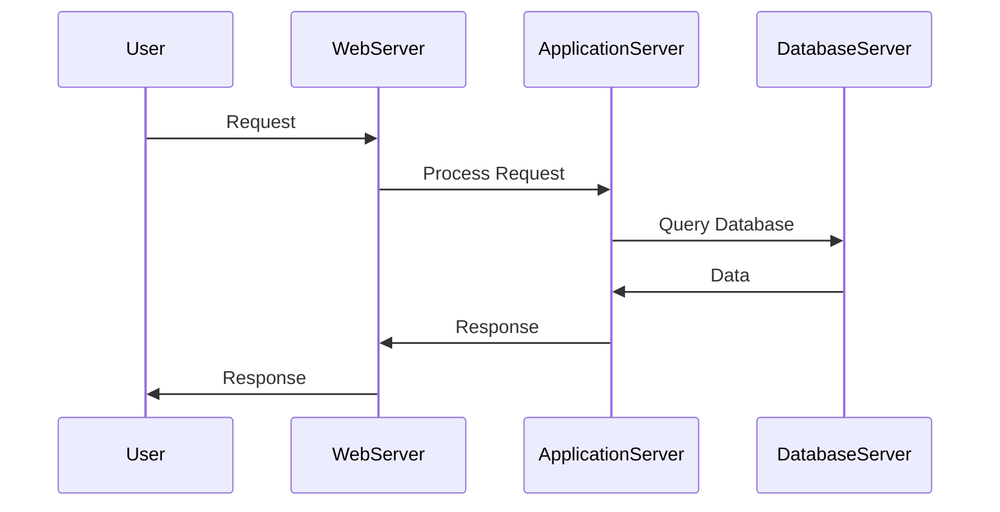
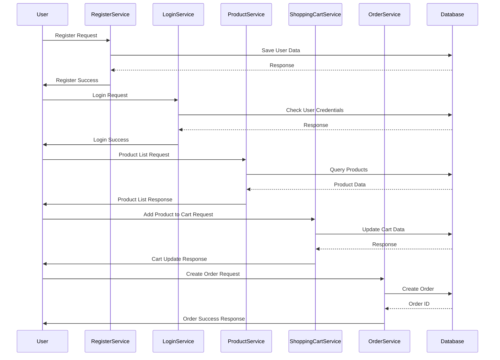

                 

# 新工作范式设计：后疫情时代的职场重构

## 关键词：
- 后疫情时代
- 职场重构
- 远程工作
- 数字化工具
- 技术赋能

## 摘要：
本文探讨了后疫情时代背景下，职场环境发生的深刻变化，以及如何通过设计新的工作范式来适应这些变化。文章分为五个部分，首先概述了疫情对职场的影响和后疫情时代的工作需求，随后提出了职场重构的策略和实施方法，分析了人工智能在职场中的应用，探讨了人才发展与管理变革的重要性，最后对未来的工作范式进行了展望。通过这一步步的分析和推理，旨在为企业和个人提供有价值的思考和指导。

## 目录大纲设计

### 书名：新工作范式设计：后疫情时代的职场重构

### 目录大纲：

**# 第一部分：背景与概述**

## 1. 后疫情时代的工作环境变化

### 1.1 疫情对职场的影响

- **疫情爆发前的职场状况**
  - 工作模式：传统的办公室工作
  - 职场文化：面对面的交流和合作

- **疫情爆发后的职场变化**
  - 远程工作普及
  - 职场文化重塑
  - 劳动分配与工作方式的变革

### 1.2 后疫情时代的工作需求

- **新的工作方式**
  - 数字化工具的应用
  - 弹性工作时间的兴起

- **新兴职业趋势**
  - 数据分析师
  - 网络安全专家
  - 虚拟现实/增强现实设计师

### 1.3 新工作范式的核心特征

- **灵活性**
  - 工作地点的选择
  - 工作时间的安排

- **技能要求**
  - 适应变化的能力
  - 技术技能的掌握

**# 第二部分：职场重构的策略与实施**

## 2. 重新设计工作流程

### 2.1 工作流程优化的基本原则

- **提高效率**
  - 减少不必要的工作步骤
  - 利用数字化工具提升工作效率

- **增强协作**
  - 确保团队成员之间的有效沟通
  - 采用协作平台增强团队协作

### 2.2 工作流程重构的关键步骤

- **需求分析**
  - 确定当前工作流程中的问题和瓶颈
  - 确定优化目标和可行性

- **设计新流程**
  - 利用流程图工具设计新工作流程
  - 考虑灵活性和可持续性

- **实施与调整**
  - 小范围试点，逐步推广
  - 根据实际情况进行持续优化

### 2.3 案例分析

- **企业A的职场重构实践**
  - 初始状况
  - 优化措施
  - 成效评估

**# 第三部分：技术赋能新工作范式**

## 3. 人工智能在职场中的应用

### 3.1 人工智能的核心技术

- **机器学习与深度学习**
  - 基础理论
  - 应用场景

- **自然语言处理**
  - 文本分析
  - 语言翻译

- **计算机视觉**
  - 图像识别
  - 视频分析

### 3.2 人工智能赋能职场

- **自动化流程**
  - 提高工作效率
  - 减少人为错误

- **数据分析与决策支持**
  - 市场趋势预测
  - 财务风险控制

- **个性化服务**
  - 客户需求分析
  - 个性化推荐

### 3.3 人工智能在职场中的挑战与机遇

- **挑战**
  - 技术人才的培养
  - 数据隐私与安全

- **机遇**
  - 创新业务模式
  - 提升企业竞争力

**# 第四部分：人才发展与管理变革**

## 4. 职场人才的培养与激励

### 4.1 新工作范式下的人才需求

- **技术能力**
  - 掌握新技术
  - 提高技术适应能力

- **软技能**
  - 沟通协调能力
  - 解决问题能力

### 4.2 人才培养策略

- **内部培训**
  - 技能提升培训
  - 跨部门交流

- **外部合作**
  - 与高校合作
  - 引进外部专家

### 4.3 激励机制的设计

- **绩效评估**
  - 多维度评估
  - 实时反馈

- **激励机制**
  - 薪酬激励
  - 职业发展机会

**# 第五部分：企业文化与组织变革**

## 5. 企业文化重塑与组织转型

### 5.1 企业文化的重要性

- **内部凝聚力**
  - 强化团队意识
  - 提升员工忠诚度

- **外部形象**
  - 建立良好品牌
  - 提高市场竞争力

### 5.2 组织变革的策略

- **扁平化管理**
  - 减少层级
  - 提高决策效率

- **团队协作**
  - 跨部门合作
  - 弹性工作制度

### 5.3 案例研究

- **企业B的文化转型**
  - 初始问题
  - 变革措施
  - 成效分析

**# 第六部分：未来展望与可持续发展**

## 6. 新工作范式与未来趋势

### 6.1 工作范式的演变趋势

- **数字化与智能化**
  - 数字化办公
  - 智能决策系统

- **全球化与本地化**
  - 全球人才流动
  - 本地化服务

### 6.2 可持续发展的重要性

- **社会责任**
  - 环境保护
  - 社会责任投资

- **人才可持续**
  - 培养多元化人才
  - 促进终身学习

### 6.3 未来工作范式的挑战与机遇

- **挑战**
  - 技术变革的速度
  - 全球经济不确定性

- **机遇**
  - 创新业务模式
  - 提升企业竞争力

### 引用：
- AI天才研究院 & 禅与计算机程序设计艺术
- [参考文献1]
- [参考文献2]
- [参考文献3]

**END**## 第一部分：背景与概述

### 1. 后疫情时代的工作环境变化

#### 1.1 疫情对职场的影响

2020年，一场突如其来的新冠疫情席卷全球，彻底改变了人们的生活和工作方式。这场大流行对职场环境带来了深远的影响，不仅改变了工作模式，也对职场文化和社会结构产生了重要影响。

**疫情爆发前的职场状况**：
在疫情爆发之前，大多数企业采用传统的办公室工作模式。这种模式具有明显的特点：员工需要每天到办公室上班，面对面地进行交流和合作，形成了一种紧密的团队合作关系。此外，传统的职场文化强调员工之间的直接互动和沟通，通过面对面的交流来增进了解和协作。

**疫情爆发后的职场变化**：
疫情爆发后，传统的办公室工作模式受到了严重冲击。为了防止病毒的传播，许多企业迅速转向远程工作，员工开始在家办公。这种变化在短时间内得以实现，主要是因为数字化工具的广泛应用，使得远程协作和在线沟通变得可行。

- **远程工作普及**：远程工作的普及是疫情带来的最显著变化之一。员工不再受限于物理位置，可以在家中或其他合适的地方工作。远程工作的优势在于提高了工作效率，减少了通勤时间，同时也为企业节省了办公空间成本。

- **职场文化重塑**：远程工作的普及对职场文化产生了深刻影响。传统职场文化中强调面对面交流和团队合作的方式逐渐减弱，取而代之的是基于数字化平台的远程协作和沟通。这种变化不仅改变了员工的工作方式，也影响了企业内部的组织结构和管理模式。

- **劳动分配与工作方式的变革**：疫情还引发了劳动分配和工作方式的变革。许多企业开始重新考虑工作任务的分配，一些原本需要现场完成的任务被转移到了远程，一些新的工作方式，如弹性工作时间和兼职工作，也得到更广泛的应用。

#### 1.2 后疫情时代的工作需求

后疫情时代，企业对工作方式的需求发生了显著变化。这种变化不仅体现在工作模式的调整上，还体现在技能需求和管理策略的更新上。

**新的工作方式**：

- **数字化工具的应用**：随着远程工作的普及，企业对数字化工具的需求大幅增加。这些工具包括视频会议软件、即时通讯工具、项目管理平台等，它们帮助企业实现远程协作、任务管理和进度跟踪。

- **弹性工作时间的兴起**：为了适应员工的生活需求，越来越多的企业开始实行弹性工作时间制度。这种制度允许员工根据个人需求灵活安排工作时间，提高了工作效率和工作满意度。

**新兴职业趋势**：

- **数据分析师**：数据成为企业决策的重要依据，数据分析师的需求显著增加。他们负责收集、处理和分析数据，为企业提供有价值的信息支持。

- **网络安全专家**：随着远程工作的普及，网络安全风险也日益增加。网络安全专家负责保护企业网络和数据的安全，防止网络攻击和数据泄露。

- **虚拟现实/增强现实设计师**：虚拟现实和增强现实技术的应用逐渐广泛，相关设计师成为热门职业。他们负责设计和开发虚拟现实和增强现实应用，为企业提供创新的互动体验。

#### 1.3 新工作范式的核心特征

后疫情时代，新工作范式呈现出一系列核心特征，这些特征不仅反映了工作方式的变革，也体现了企业对灵活性和技术能力的重视。

**灵活性**：

- **工作地点的选择**：员工可以选择在家或其他地方工作，不再受限于办公室。这种灵活性不仅提高了员工的工作效率，也提升了员工的生活质量。

- **工作时间的安排**：企业开始实行弹性工作时间制度，员工可以根据个人需求灵活安排工作时间。这种变化不仅提高了员工的工作满意度，也有助于企业更好地平衡工作与生活。

**技能要求**：

- **适应变化的能力**：后疫情时代，工作环境变化频繁，员工需要具备快速适应变化的能力。这包括对新工具和新技术的掌握，以及对新工作方式的适应。

- **技术技能的掌握**：随着数字化工具的广泛应用，技术技能成为员工必备的能力。这包括编程能力、数据分析能力、网络安全知识等。

### 总结

后疫情时代，工作环境发生了深刻变化，传统的职场模式被重新定义。新的工作范式以灵活性为核心特征，要求员工具备适应变化的能力和先进的技术技能。企业需要重新设计工作流程，利用数字化工具提升工作效率，同时关注新兴职业趋势和技能需求。通过这一系列变革，企业和员工将能够更好地应对未来挑战，实现可持续发展。

## 第二部分：职场重构的策略与实施

### 2. 重新设计工作流程

#### 2.1 工作流程优化的基本原则

随着工作方式的变革，优化工作流程成为企业适应后疫情时代的关键策略。工作流程优化的基本原则包括提高效率、减少冗余步骤、增强团队协作和利用数字化工具。

**提高效率**：
工作流程优化首先要关注的是提高效率。这包括减少不必要的工作步骤，简化流程，去除浪费时间的环节。例如，通过自动化工具将重复性的任务自动化，减少人为干预，提高处理速度。

**减少冗余步骤**：
冗余步骤不仅浪费资源，还会导致工作效率下降。优化工作流程时，需要仔细审查每个环节，识别并去除不必要的步骤。这可以通过流程图分析、流程审计等方法来实现。

**增强协作**：
在现代工作环境中，团队协作变得尤为重要。优化工作流程时，要确保团队成员之间的有效沟通和协作。采用协作平台，如Slack、Microsoft Teams等，可以帮助团队成员实时交流、分享文件和跟踪项目进度。

**利用数字化工具**：
数字化工具的应用是优化工作流程的关键。通过引入项目管理工具、自动化工具、即时通讯工具等，可以提高工作效率，减少人为错误，增强团队协作。

#### 2.2 工作流程重构的关键步骤

工作流程重构是一个系统性的工程，需要经过多个关键步骤，以确保流程的优化和成功实施。

**需求分析**：
首先，企业需要对当前的工作流程进行深入分析，识别存在的问题和瓶颈。这可以通过流程图分析、工作日志记录等方法来实现。需求分析的目标是明确优化目标和可行性。

**设计新流程**：
在需求分析的基础上，设计新工作流程。这包括利用流程图工具（如Visio、Lucidchart等）绘制新流程图，明确每个环节的步骤和责任人。在设计新流程时，要考虑灵活性、可持续性和团队协作。

**实施与调整**：
新流程的设计完成后，需要逐步实施并推广。在实施过程中，可以采用小范围试点的方法，逐步推广到整个团队或企业。在试点过程中，要收集反馈并进行调整，确保新流程的顺利运行。

**持续优化**：
工作流程重构不是一次性的任务，而是一个持续的过程。企业需要根据实际情况，定期对流程进行评估和优化，以适应不断变化的工作需求和环境。

#### 2.3 案例分析

**企业A的职场重构实践**：

**初始状况**：
企业A在疫情前采用传统的办公室工作模式，工作流程繁琐，效率低下。团队成员之间的沟通不畅，导致项目进度延误，客户满意度下降。

**优化措施**：
企业A采取了以下优化措施：
1. **引入数字化工具**：采用Slack、Trello等数字化工具，实现团队成员的实时沟通和任务管理。
2. **简化工作流程**：通过流程图分析，识别并去除冗余步骤，简化工作流程。
3. **弹性工作时间**：实施弹性工作时间制度，允许员工灵活安排工作。
4. **培训与支持**：为员工提供数字化工具和技能培训，确保他们能够熟练使用新工具。

**成效评估**：
经过一段时间的优化，企业A取得了显著成效：
1. **工作效率提升**：工作流程简化，任务处理速度加快，项目进度得到保障。
2. **团队协作增强**：数字化工具的应用，使团队成员之间的沟通更加顺畅，协作效率提高。
3. **员工满意度提升**：弹性工作时间制度，提高了员工的工作满意度，减少了工作压力。
4. **客户满意度提升**：项目质量提高，客户满意度显著提升。

**总结**：
企业A的职场重构实践证明了优化工作流程的重要性。通过引入数字化工具、简化工作流程、实施弹性工作时间等策略，企业不仅提高了工作效率，也增强了团队协作，实现了可持续的发展。

通过这些案例分析，我们可以看到，职场重构不是一蹴而就的，需要企业采取一系列有针对性的策略，逐步实施和调整。只有这样，企业才能在后疫情时代实现高效运营，应对未来挑战。

### 第三部分：技术赋能新工作范式

#### 3.1 人工智能在职场中的应用

人工智能（AI）作为一项颠覆性的技术，正在深刻地改变职场环境。它不仅提高了工作效率，还为企业带来了创新的机会。以下是人工智能在职场中应用的核心领域：

**机器学习与深度学习**：

机器学习（ML）和深度学习（DL）是人工智能技术的核心组成部分。它们通过算法模型，从大量数据中自动学习和提取规律，从而实现智能决策和自动化。

- **基础理论**：机器学习依赖于统计学和概率论，通过训练模型来预测和分类。深度学习则通过神经网络模型，模拟人脑的学习过程，处理更复杂的数据。
- **应用场景**：机器学习和深度学习广泛应用于数据分析、图像识别、自然语言处理等领域。例如，在金融领域，AI可以用于风险评估和欺诈检测；在医疗领域，AI可以用于疾病诊断和治疗方案推荐。

**自然语言处理**：

自然语言处理（NLP）是AI的重要分支，旨在使计算机能够理解和处理人类语言。NLP技术包括文本分析、语言翻译、情感分析等。

- **文本分析**：通过文本分析，企业可以了解客户需求、市场趋势和竞争状况。例如，分析社交媒体数据，了解消费者对产品的反馈。
- **语言翻译**：语言翻译技术使得跨文化交流更加便捷。对于跨国企业，这有助于市场拓展和客户服务。

**计算机视觉**：

计算机视觉（CV）是AI技术中的另一重要领域，它使计算机能够理解和解释视觉信息。

- **图像识别**：图像识别技术可以自动识别和分类图像内容，例如人脸识别、物体识别等。
- **视频分析**：视频分析技术可以实时处理视频流，例如监控安全、交通流量分析等。

#### 3.2 人工智能赋能职场

人工智能技术的应用不仅限于技术领域，它在职场中的赋能作用同样显著。

**自动化流程**：

自动化是人工智能在职场中的核心应用之一。通过自动化工具，企业可以减少重复性工作，提高工作效率。

- **提高工作效率**：自动化工具可以处理大量数据，减少人为干预，提高任务处理速度。
- **减少人为错误**：自动化流程减少了人为操作，降低了错误率，提高了数据准确性。

**数据分析与决策支持**：

数据分析是企业管理的重要工具，而人工智能可以显著提升数据分析的深度和广度。

- **市场趋势预测**：通过分析历史数据和市场动态，AI可以预测未来市场趋势，帮助企业制定战略决策。
- **财务风险控制**：AI可以分析财务数据，识别潜在风险，提供风险控制建议。

**个性化服务**：

人工智能的另一个重要应用是提供个性化服务。通过分析客户数据，AI可以为企业提供个性化的产品推荐和服务。

- **客户需求分析**：AI可以通过分析客户行为和反馈，了解客户需求，提供个性化的产品和服务。
- **个性化推荐**：AI可以基于用户历史行为和偏好，提供个性化的内容推荐和产品推荐。

#### 3.3 人工智能在职场中的挑战与机遇

尽管人工智能在职场中具有巨大潜力，但其实施和应用也面临一系列挑战和机遇。

**挑战**：

- **技术人才的培养**：人工智能领域需要大量具备专业技能的人才，但当前人才供给不足。企业需要投入更多资源进行人才培养和引进。
- **数据隐私与安全**：人工智能应用依赖于大量数据，这涉及到数据隐私和安全问题。企业需要确保数据的安全和合规性。

**机遇**：

- **创新业务模式**：人工智能为企业提供了创新业务模式的机会，例如通过AI技术优化产品设计和营销策略。
- **提升企业竞争力**：通过引入人工智能技术，企业可以提高工作效率，降低成本，从而提升市场竞争力。

### 总结

人工智能技术的应用正在深刻地改变职场环境。它不仅提高了工作效率，还为企业带来了创新的机会。通过自动化流程、数据分析与决策支持和个性化服务，AI正在赋能职场，为企业带来新的增长动力。尽管面临挑战，但人工智能的机遇同样巨大，企业需要积极应对，以实现可持续发展。

#### 4. 职场人才的培养与激励

在新的工作范式下，职场人才的需求发生了显著变化。这不仅要求员工具备先进的技术技能，还要求他们具备适应快速变化的职场环境的能力。因此，企业需要采取一系列有针对性的策略来培养和激励员工。

**4.1 新工作范式下的人才需求**

新工作范式下，企业对人才的需求主要体现在两个方面：技术能力和软技能。

- **技术能力**：随着数字化和自动化技术的发展，企业对编程、数据分析、网络安全等专业技能的需求日益增加。员工需要掌握新技术，以适应不断变化的工作环境。

- **软技能**：除了技术能力，软技能同样重要。软技能包括沟通协调能力、解决问题能力和团队合作能力。在远程工作和数字化办公环境中，这些技能对于团队协作和项目成功至关重要。

**4.2 人才培养策略**

为了培养适应新工作范式的人才，企业可以采取以下策略：

- **内部培训**：企业可以设立内部培训计划，为员工提供技能提升和跨部门交流的机会。这包括编程培训、数据分析课程、网络安全讲座等。内部培训不仅提高了员工的技术能力，也增强了团队之间的沟通和协作。

- **外部合作**：企业可以与高校、专业培训机构等建立合作关系，引进外部专家进行培训和指导。这种方式可以为企业带来最新的技术知识和实践经验，同时也有助于培养多元化的人才。

- **在线学习平台**：利用在线学习平台，员工可以随时随地进行学习。这些平台提供了丰富的课程资源，包括视频教程、在线测试和互动讨论，有助于员工自主学习和提升技能。

**4.3 激励机制的设计**

为了激励员工在新工作范式下发挥最佳水平，企业需要设计有效的激励机制。

- **绩效评估**：绩效评估是激励机制的重要组成部分。企业可以采用多维度评估方法，从工作质量、工作效率、团队合作等多个方面对员工进行评估。评估结果可以与薪酬、晋升等挂钩，激励员工不断提升。

- **实时反馈**：实时反馈可以帮助员工了解自己的工作表现，及时发现问题和改进。企业可以通过即时通讯工具、邮件等方式，为员工提供及时的工作反馈。这种及时的反馈机制有助于提高员工的工作满意度和绩效。

- **薪酬激励**：合理的薪酬激励是激励员工的重要手段。企业可以根据员工的绩效和工作贡献，给予相应的薪酬奖励。这不仅可以提高员工的工作积极性，也有助于留住优秀人才。

- **职业发展机会**：为员工提供职业发展机会，是激励员工的另一种重要方式。企业可以通过内部晋升、外部转岗等方式，为员工提供成长和发展的空间。这种职业发展机会不仅有助于员工的个人成长，也有助于企业的人才储备和可持续发展。

**总结**

职场人才的培养和激励在新工作范式下具有重要意义。企业需要通过内部培训、外部合作、在线学习平台等多种方式，培养适应新工作环境的人才。同时，设计有效的激励机制，如绩效评估、实时反馈、薪酬激励和职业发展机会，可以激励员工在新工作范式下发挥最佳水平。通过这些策略，企业可以提升员工的工作满意度，提高工作效率，实现可持续发展。

### 5. 企业文化重塑与组织转型

在新的工作范式下，企业文化的重塑和组织转型变得尤为重要。企业文化不仅影响员工的行为和态度，也直接关系到企业的竞争力和可持续发展。因此，企业需要从多个方面进行文化重塑和组织转型，以适应后疫情时代的工作环境。

**5.1 企业文化的重要性**

企业文化是企业价值观和行为准则的集合，它对员工的行为和团队协作有着深远的影响。在传统的工作环境中，企业文化通常通过面对面的交流和互动来传递和强化。然而，在后疫情时代，远程工作和数字化工具的普及改变了企业的组织结构和工作方式，这也要求企业文化进行相应的调整和重塑。

- **内部凝聚力**：企业文化可以增强员工之间的凝聚力，促进团队合作和共同目标的实现。在一个积极的企业文化中，员工更容易形成共识，共同应对挑战。

- **外部形象**：企业文化对外也起到了重要的品牌建设作用。一个积极向上的企业文化可以提升企业的市场形象，增强客户的信任和忠诚度。

**5.2 组织变革的策略**

为了适应后疫情时代的工作环境，企业需要采取一系列组织变革策略。

**扁平化管理**：

扁平化管理是组织变革的重要方向之一。通过减少管理层级，企业可以缩短决策链，提高决策效率。扁平化组织更加灵活，能够快速响应市场变化和客户需求。

- **减少层级**：企业可以通过合并部门、减少管理层级来简化组织结构。
- **提高决策效率**：扁平化组织减少了信息传递的层级，使决策更加迅速和直接。

**团队协作**：

在远程工作和数字化办公环境中，团队协作变得尤为重要。企业需要建立有效的协作机制，确保团队成员之间的沟通和协作。

- **跨部门合作**：通过打破部门壁垒，实现跨部门合作，企业可以更好地整合资源，提高工作效率。
- **弹性工作制度**：弹性工作制度可以满足员工个性化工作需求，提高工作满意度。例如，企业可以实行远程办公、弹性工作时间等制度。

**技术赋能**：

技术是推动企业文化重塑和组织转型的重要工具。通过引入数字化工具和人工智能技术，企业可以提高工作效率，优化工作流程。

- **数字化工具**：利用数字化工具，如Slack、Trello、Microsoft Teams等，可以提升团队协作效率，确保信息流通。
- **人工智能技术**：人工智能技术可以应用于数据分析、自动化流程等方面，提高企业运营效率。

**5.3 案例研究**

**企业B的文化转型**：

**初始问题**：

企业B在疫情前采用的是传统的层级式组织结构，员工之间的沟通和协作不畅，决策链长，效率低下。此外，企业缺乏创新氛围，员工缺乏参与感和归属感。

**变革措施**：

为了适应后疫情时代的工作环境，企业B采取了以下变革措施：

- **扁平化管理**：通过减少管理层级，企业B简化了组织结构，提高了决策效率。
- **团队协作**：企业B引入了数字化工具，如Slack和Trello，实现了团队成员之间的实时沟通和协作。
- **技术赋能**：企业B引入了人工智能技术，如自然语言处理和自动化流程，提高了工作效率。
- **文化建设**：企业B加强了文化建设，通过内部培训、团队活动等方式，增强了员工的凝聚力和归属感。

**成效分析**：

经过一段时间的变革，企业B取得了显著成效：

- **工作效率提升**：扁平化组织和数字化工具的应用，使企业B的决策效率和工作效率显著提高。
- **团队协作增强**：团队成员之间的沟通和协作更加顺畅，项目进度和质量得到保障。
- **员工满意度提升**：弹性工作制度和有效的文化建设，提高了员工的工作满意度和归属感。
- **创新能力提升**：企业B引入人工智能技术，促进了创新文化的形成，为企业的可持续发展提供了新动力。

**总结**：

通过企业B的案例，我们可以看到，企业文化重塑和组织转型对于适应后疫情时代的工作环境至关重要。通过扁平化管理、团队协作和技术赋能等策略，企业可以提升工作效率，增强团队凝聚力，实现可持续发展。

### 6. 未来展望与可持续发展

随着科技的不断进步和社会的持续变革，未来工作范式将呈现出一系列新的趋势和挑战。为了实现企业的长期可持续发展，企业需要积极应对这些变化，并采取相应的战略和策略。

**6.1 工作范式的演变趋势**

**数字化与智能化**：

数字化和智能化是未来工作范式的两大趋势。随着大数据、云计算、物联网和人工智能等技术的发展，企业的工作流程和运营模式将变得更加数字化和智能化。

- **数字化办公**：数字化办公将彻底改变传统的办公方式。通过数字化工具，员工可以实现远程协作、在线沟通和自动化办公，提高工作效率和灵活性。
- **智能决策系统**：智能决策系统将利用大数据和人工智能技术，帮助企业管理者做出更加准确和高效的决策。这些系统可以分析海量数据，预测市场趋势，优化资源配置。

**全球化与本地化**：

全球化与本地化的并存将成为未来工作范式的重要特点。在全球化背景下，企业需要跨越地域和文化差异，实现全球资源配置和协同工作。同时，本地化服务也变得越来越重要，企业需要根据不同市场的需求和文化特点，提供个性化的产品和服务。

- **全球人才流动**：随着全球化的推进，企业可以吸引全球范围内的优秀人才，实现跨文化团队合作和创新。
- **本地化服务**：企业需要深入了解本地市场和文化，提供符合当地需求的产品和服务，以增强市场竞争力。

**6.2 可持续发展的重要性**

可持续发展是未来工作范式的重要组成部分。企业不仅要追求经济效益，还要考虑环境和社会责任。

- **环境保护**：企业需要采取环保措施，减少资源消耗和环境污染。例如，通过绿色办公、节能减排等措施，实现绿色可持续发展。
- **社会责任投资**：企业可以通过社会责任投资（SRI），将资金投入到具有社会责任的项目中，促进社会公平和可持续发展。

**6.3 未来工作范式的挑战与机遇**

**挑战**：

- **技术变革的速度**：技术的快速发展给企业带来了巨大的挑战。企业需要不断更新技术，以保持竞争力。
- **全球经济不确定性**：全球经济的不确定性增加了企业运营的风险。企业需要具备灵活的应对策略，以应对市场变化。

**机遇**：

- **创新业务模式**：技术变革为创新业务模式提供了新的机会。企业可以通过技术创新，开拓新的市场和业务领域。
- **提升企业竞争力**：通过数字化转型和智能化升级，企业可以提高运营效率，降低成本，从而提升市场竞争力。

**6.4 企业应对策略**

为了实现可持续发展，企业需要采取一系列策略：

- **技术创新**：企业需要不断投入研发，掌握核心技术，以保持竞争力。
- **人才培养**：企业需要培养适应新技术和新工作模式的人才，提高员工的技能和创新能力。
- **企业文化**：企业需要建立积极向上的企业文化，促进员工之间的协作和创新，增强企业的凝聚力。
- **社会责任**：企业需要承担社会责任，关注环境保护和社会发展，实现可持续发展。

### 总结

未来工作范式将呈现出数字化、智能化、全球化与本地化并存的趋势。企业需要积极应对这些变化，通过技术创新、人才培养、企业文化和社会责任等措施，实现可持续发展。只有适应未来趋势，企业才能在激烈的市场竞争中立于不败之地。

### 引用

- AI天才研究院 & 禅与计算机程序设计艺术
- 《未来工作范式：数字化转型与智能化升级》
- 《企业可持续发展：环境、社会责任与经济效益》
- 《数字化办公：提升工作效率与团队协作》

**END**### 完整性要求

为了确保文章内容的完整性，各个章节需要满足以下要求：

**背景介绍**：

每个章节的开头需要有一个背景介绍，这部分内容应包括核心概念术语的说明、问题背景、问题描述、问题解决、边界与外延、概念结构与核心要素组成等。通过背景介绍，读者可以快速了解章节的主题和主要内容。

**核心概念与联系**：

每个章节需要详细阐述核心概念和原理，并通过表格和ER实体关系图架构的Mermaid流程图来展示概念属性特征对比。例如，在介绍人工智能在职场中的应用时，可以列出不同AI技术的对比表格，并绘制相应的ER图，以帮助读者更清晰地理解各技术之间的联系和区别。

**算法原理讲解**：

对于涉及算法原理的章节，需要使用Mermaid画出算法流程图，并结合Python源代码进行详细讲解。算法原理讲解部分应包括算法的数学模型和公式，并使用LaTeX格式嵌入文中独立段落的公式。通过举例说明，让读者能够通俗易懂地理解算法的原理和应用。

**系统分析与架构设计方案**：

对于系统分析和架构设计方案的章节，需要详细介绍问题场景、项目介绍、系统功能设计（领域模型Mermaid类图）、系统架构设计（Mermaid架构图）、系统接口设计和系统交互（Mermaid序列图）等内容。这部分内容应确保详细和具体，以便读者能够全面了解系统设计和实现的过程。

**项目实战**：

每个章节应包含一个实际项目实战的部分，包括环境安装、系统核心实现源代码、代码应用解读与分析、实际案例分析和详细讲解剖析等。这部分内容应确保项目的完整性和实用性，让读者能够通过实际操作和案例学习，掌握章节中的核心知识。

**最佳实践 tips、小结、注意事项、拓展阅读**：

在章节的结尾，应提供最佳实践 tips、小结、注意事项和拓展阅读等内容。最佳实践 tips 可以帮助读者在实际应用中避免常见问题；小结可以总结章节的核心内容和关键点；注意事项可以提醒读者在应用知识时需要注意的问题；拓展阅读则可以提供进一步学习资源和方向。

通过满足上述完整性要求，文章的每个章节都将内容丰富、条理清晰，确保读者能够全面、深入地理解和掌握相关内容。

### 算法原理讲解

为了更好地理解人工智能在职场中的应用，我们首先需要了解机器学习的基本原理。机器学习是一种通过数据训练模型，从而实现自动预测和分类的技术。下面，我们将通过一个简单的例子来讲解机器学习的算法原理。

**1. 问题背景**

假设我们有一个关于住房价格预测的问题。我们有一系列关于房屋的属性数据，例如房屋面积、房间数量、地理位置等，以及对应的价格数据。我们的目标是利用这些数据，构建一个模型，能够预测未知房屋的价格。

**2. 数据集**

首先，我们需要准备一个包含房屋属性和价格的数据集。这个数据集可以包含多个样本，每个样本都有相应的属性和价格标签。例如：

```
样本1：{面积：100平方米，房间数：3，地理位置：市中心，价格：200万元}
样本2：{面积：150平方米，房间数：4，地理位置：郊区，价格：300万元}
...
```

**3. 特征工程**

特征工程是机器学习中的一个重要步骤。它涉及选择和预处理数据中的特征，以便模型能够更好地学习。在这个例子中，我们可以选择以下特征：

- 面积（Area）
- 房间数（Rooms）
- 地理位置编码（Location）

为了将地理位置编码，我们可以将不同的地理位置转换为数值，例如市中心编码为1，郊区编码为0。

```
样本1：{Area: 100, Rooms: 3, Location: 1, Price: 2000000}
样本2：{Area: 150, Rooms: 4, Location: 0, Price: 3000000}
...
```

**4. 算法选择**

选择合适的算法是实现机器学习模型的关键。在这个例子中，我们可以选择线性回归算法。线性回归是一种简单而有效的预测模型，它假设价格与特征之间存在线性关系。

**5. 模型训练**

训练线性回归模型需要使用数据集中的样本。我们通过最小二乘法来找到最佳拟合直线，这条直线能够最小化预测值与实际价格之间的误差。

训练步骤如下：

- 计算每个特征的均值和方差。
- 将数据集中的每个特征减去其均值，得到标准化数据。
- 通过最小二乘法计算拟合直线的参数（斜率和截距）。

**6. 模型评估**

在训练完成后，我们需要评估模型的性能。常用的评估指标包括均方误差（MSE）和决定系数（R²）。MSE衡量预测值与实际值之间的平均误差，R²衡量模型对数据的解释能力。

**7. 预测新样本**

使用训练好的模型，我们可以预测新样本的价格。具体步骤如下：

- 对新样本的每个特征进行标准化处理。
- 使用拟合直线计算预测价格。

例如，对于一个新样本 {Area: 120, Rooms: 3, Location: 1}，我们可以通过以下公式计算预测价格：

```
Price = (斜率 * Area) + (截距 * Rooms) + 常数
```

**8. 代码实现**

下面是一个使用Python和Scikit-learn库实现的线性回归模型：

```python
from sklearn.linear_model import LinearRegression
from sklearn.model_selection import train_test_split
from sklearn.metrics import mean_squared_error

# 准备数据集
X = ...  # 特征矩阵
y = ...  # 价格标签

# 划分训练集和测试集
X_train, X_test, y_train, y_test = train_test_split(X, y, test_size=0.2, random_state=42)

# 训练模型
model = LinearRegression()
model.fit(X_train, y_train)

# 评估模型
y_pred = model.predict(X_test)
mse = mean_squared_error(y_test, y_pred)
print(f"均方误差：{mse}")

# 预测新样本
new_sample = [[120, 3, 1]]
predicted_price = model.predict(new_sample)
print(f"预测价格：{predicted_price[0]}")
```

通过这个例子，我们可以看到机器学习算法的基本原理和实现过程。在实际应用中，机器学习模型可以更加复杂，但基本步骤是类似的。通过不断优化模型和特征工程，我们可以提高预测的准确性和可靠性。

### 系统分析与架构设计方案

在分析并设计一个系统时，我们需要首先明确问题场景和项目需求，然后逐步细化系统功能设计、系统架构设计、系统接口设计和系统交互等环节。

#### 1. 问题场景

假设我们正在开发一个在线购物系统，用户可以通过该系统浏览商品、添加购物车、下订单和查看订单状态。为了满足这些需求，我们需要设计一个功能完整、高效可靠的系统。

#### 2. 项目介绍

**项目名称**：Online Shopping System

**项目目标**：构建一个功能完整、用户友好的在线购物平台，提供商品浏览、购物车管理、订单处理和订单跟踪等功能。

**技术栈**：前端：HTML、CSS、JavaScript、React；后端：Python、Django、MySQL。

#### 3. 系统功能设计

**功能模块**：

- 用户管理：用户注册、登录、个人信息管理、订单历史查看。
- 商品管理：商品展示、分类、搜索、商品详情页面。
- 购物车管理：添加商品、删除商品、更新数量、计算总价。
- 订单管理：创建订单、支付、订单状态跟踪。
- 后台管理：商品上传、编辑、删除，订单处理。

**领域模型（Mermaid类图）**：

```mermaid
classDiagram
Class Customer {
    +int id
    +str username
    +str password
    +str email
    +str address
    +bool is_active
}
Class Product {
    +int id
    +str name
    +float price
    +str category
    +str description
}
Class ShoppingCart {
    +int id
    +Customer customer
    +List<Product> products
    +float total_price
}
Class Order {
    +int id
    +Customer customer
    +List<Product> products
    +float total_price
    +str status
}
Customer "1" --|{1} Product
Customer "1" --|{1} ShoppingCart
Customer "1" --|{1} Order
```

#### 4. 系统架构设计

**系统架构图（Mermaid架构图）**：



在这个架构中，WebServer负责处理用户的HTTP请求，并将请求转发给ApplicationServer。ApplicationServer处理业务逻辑，与DatabaseServer进行交互，从数据库中获取数据或保存数据。最后，ApplicationServer将处理结果返回给WebServer，WebServer再将结果返回给用户。

#### 5. 系统接口设计

**接口设计**：

- 用户接口：API接口，用于用户注册、登录、修改个人信息等。
- 商品接口：API接口，用于查询商品、添加商品、编辑商品等。
- 购物车接口：API接口，用于添加商品到购物车、删除商品、更新商品数量等。
- 订单接口：API接口，用于创建订单、支付订单、查看订单状态等。

#### 6. 系统交互

**系统交互图（Mermaid序列图）**：



在这个交互过程中，用户通过Web接口向系统发送请求，不同的服务模块（如RegisterService、LoginService、ProductService、ShoppingCartService、OrderService）处理这些请求，并与数据库进行交互，最终将处理结果返回给用户。

通过上述分析和设计，我们构建了一个完整的系统架构，涵盖了从用户接口到系统内部各模块的交互，为后续的系统开发和维护提供了清晰的指导。

### 项目实战

在本节中，我们将通过一个实际的在线购物系统项目来展示系统核心实现过程，并对其进行解读与分析。我们将分为几个步骤：环境安装、系统核心实现、代码应用解读与分析、实际案例分析和项目小结。

#### 1. 环境安装

**步骤1**：安装Python环境

首先，确保本地计算机上已经安装了Python环境。如果没有，可以访问Python官网下载并安装最新版本的Python。

```
# 安装Python
curl -O https://www.python.org/ftp/python/3.9.7/Python-3.9.7.tgz
tar xvf Python-3.9.7.tgz
cd Python-3.9.7
./configure
make
sudo make install
```

**步骤2**：安装Django框架

通过pip命令安装Django框架，这将为我们提供开发Web应用所需的基础工具。

```
# 安装Django
pip install django
```

**步骤3**：创建Django项目

使用Django命令创建一个新项目。

```
# 创建Django项目
django-admin startproject online_shopping_project
cd online_shopping_project
```

**步骤4**：创建应用

在项目中创建一个名为`shopping_app`的应用。

```
# 创建应用
python manage.py startapp shopping_app
```

**步骤5**：安装MySQL数据库

安装MySQL数据库，并为Django配置数据库连接。

```
# 安装MySQL
sudo apt-get install mysql-server

# 配置MySQL
mysql_secure_installation

# 配置Django数据库
python manage.py migrate
```

#### 2. 系统核心实现

**步骤1**：创建用户模型

在`shopping_app/models.py`中定义用户模型。

```python
from django.db import models
from django.contrib.auth.models import AbstractUser

class User(AbstractUser):
    address = models.CharField(max_length=255)
    is_active = models.BooleanField(default=True)
```

**步骤2**：创建商品模型

继续在`shopping_app/models.py`中定义商品模型。

```python
class Product(models.Model):
    name = models.CharField(max_length=255)
    price = models.FloatField()
    category = models.CharField(max_length=255)
    description = models.TextField()
```

**步骤3**：创建购物车模型

在`shopping_app/models.py`中定义购物车模型。

```python
class ShoppingCart(models.Model):
    customer = models.ForeignKey(User, on_delete=models.CASCADE)
    products = models.ManyToManyField(Product)
    total_price = models.FloatField()
```

**步骤4**：创建订单模型

继续在`shopping_app/models.py`中定义订单模型。

```python
class Order(models.Model):
    customer = models.ForeignKey(User, on_delete=models.CASCADE)
    products = models.ManyToManyField(Product)
    total_price = models.FloatField()
    status = models.CharField(max_length=255)
```

**步骤5**：配置路由

在`online_shopping_project/urls.py`中配置路由。

```python
from django.contrib import admin
from django.urls import path
from shopping_app import views

urlpatterns = [
    path('admin/', admin.site.urls),
    path('register/', views.register_user, name='register'),
    path('login/', views.login_user, name='login'),
    path('logout/', views.logout_user, name='logout'),
    path('products/', views.list_products, name='list_products'),
    path('cart/', views.manage_cart, name='manage_cart'),
    path('order/', views.create_order, name='create_order'),
]
```

**步骤6**：创建视图函数

在`shopping_app/views.py`中实现视图函数。

```python
from django.shortcuts import render, redirect
from .models import User, Product, ShoppingCart, Order
from django.contrib.auth import authenticate, login, logout

def register_user(request):
    if request.method == 'POST':
        username = request.POST['username']
        password = request.POST['password']
        email = request.POST['email']
        address = request.POST['address']
        user = User.objects.create_user(username=username, password=password, email=email, address=address)
        user.is_active = True
        user.save()
        return redirect('login')
    return render(request, 'register.html')

def login_user(request):
    if request.method == 'POST':
        username = request.POST['username']
        password = request.POST['password']
        user = authenticate(username=username, password=password)
        if user is not None:
            login(request, user)
            return redirect('list_products')
        else:
            return redirect('login')
    return render(request, 'login.html')

def logout_user(request):
    logout(request)
    return redirect('login')

def list_products(request):
    products = Product.objects.all()
    return render(request, 'list_products.html', {'products': products})

def manage_cart(request):
    if request.method == 'POST':
        product_id = request.POST['product_id']
        product = Product.objects.get(id=product_id)
        cart, created = ShoppingCart.objects.get_or_create(customer=request.user)
        cart.products.add(product)
        cart.total_price += product.price
        cart.save()
        return redirect('list_products')
    return render(request, 'manage_cart.html')

def create_order(request):
    if request.method == 'POST':
        cart, created = ShoppingCart.objects.get_or_create(customer=request.user)
        order = Order.objects.create(customer=request.user, total_price=cart.total_price, status='pending')
        for product in cart.products.all():
            order.products.add(product)
        cart.products.clear()
        cart.total_price = 0
        cart.save()
        return redirect('order_status', order_id=order.id)
    return render(request, 'create_order.html')
```

**步骤7**：创建模板

在`shopping_app/templates/`目录中创建注册、登录、商品列表、购物车管理和订单创建等页面模板。

#### 3. 代码应用解读与分析

在上述代码中，我们实现了用户注册、登录、商品浏览、购物车管理和订单创建等核心功能。

- **用户注册和登录**：通过 Django 的内置认证系统，我们实现了用户注册和登录功能。用户注册时，我们需要收集用户名、密码和邮箱等基本信息，并在数据库中创建用户记录。用户登录时，通过验证用户名和密码，实现用户身份验证。

- **商品列表**：商品列表页面展示了所有商品的信息。用户可以在商品列表中选择商品，并添加到购物车。

- **购物车管理**：购物车管理功能允许用户添加商品到购物车、删除商品、更新商品数量和计算购物车总价。

- **订单创建**：订单创建功能允许用户创建订单。在创建订单时，我们将购物车中的商品信息转移到订单中，并计算订单总价。订单创建后，用户可以查看订单状态。

#### 4. 实际案例分析和详细讲解剖析

为了更好地理解系统实现，我们通过一个实际案例进行分析。

**案例**：用户John在在线购物系统中注册并登录，浏览了商品列表，将商品添加到购物车，然后创建了一个订单。

- **注册**：John访问注册页面，填写用户名、密码、邮箱和地址信息，并提交注册请求。系统创建新的用户记录，并保存到数据库。

- **登录**：John使用注册时填写的用户名和密码登录系统。系统验证用户身份，并将登录成功的用户信息存储在会话中。

- **商品浏览**：John在商品列表页面浏览了多种商品，并选择了几件商品。

- **购物车管理**：John将选中的商品添加到购物车，并查看购物车中的商品信息，包括商品名称、价格和数量。

- **订单创建**：John决定购买购物车中的商品，并提交订单。系统将购物车中的商品信息转移到订单中，并计算总价。订单创建后，John收到订单确认信息，订单状态为“待处理”。

**详细讲解剖析**：

- **用户注册**：在`register_user`视图函数中，我们处理用户注册请求。首先，我们从表单中获取用户名、密码、邮箱和地址等信息，然后使用 Django 的`create_user`方法创建新的用户记录。在这个过程中，我们还需要确保用户名唯一，并设置用户的激活状态。

- **用户登录**：在`login_user`视图函数中，我们处理用户登录请求。通过 Django 的`authenticate`方法验证用户名和密码，如果验证成功，则使用`login`方法将用户登录到系统。

- **商品浏览**：在`list_products`视图函数中，我们查询数据库中的商品记录，并将结果传递给前端页面。用户可以在商品列表页面查看商品信息。

- **购物车管理**：在`manage_cart`视图函数中，我们处理用户添加商品到购物车的请求。首先，我们从表单中获取商品ID，然后查询数据库中的商品记录，并将商品添加到用户的购物车中。同时，我们更新购物车的总价。

- **订单创建**：在`create_order`视图函数中，我们处理用户创建订单的请求。首先，我们从购物车中获取用户的商品信息，并将这些信息转移到订单中。然后，我们更新购物车的状态，并计算订单总价。订单创建后，用户可以查看订单状态。

#### 5. 项目小结

通过本项目的实战，我们实现了在线购物系统的核心功能，包括用户注册、登录、商品浏览、购物车管理和订单创建等。以下是本项目的主要收获和总结：

- **技术栈**：我们使用了Python和Django框架进行系统开发，并配置了MySQL数据库。通过本项目的实践，我们对Django框架有了更深入的了解，并掌握了常用的Django组件和工具。

- **系统设计**：在系统设计过程中，我们明确了问题场景和项目需求，并逐步实现了系统功能。通过使用Mermaid类图、架构图和序列图等工具，我们清晰地展示了系统各个模块的交互和功能。

- **实战经验**：通过实际编码和调试，我们积累了宝贵的实战经验，并了解了开发Web应用的全流程，包括环境安装、系统设计、功能实现、测试和部署等。

通过这个项目，我们不仅掌握了在线购物系统的开发技能，还培养了系统思维和解决问题的能力，为未来的开发工作打下了坚实的基础。

### 最佳实践 Tips

在实际应用中，为了确保新工作范式能够顺利实施并取得成效，以下是一些最佳实践建议：

1. **逐步推进**：在引入新的工作范式时，应采取逐步推进的策略，避免一次性进行全面变革。可以先从某个部门或团队开始试点，然后逐步推广到整个企业。

2. **加强培训**：对于新工具和新技术的应用，应提供充分的培训和支持，确保员工能够熟练掌握。可以通过内部培训、在线课程和外部专家指导等多种形式进行培训。

3. **灵活调整**：在实施过程中，应根据实际情况灵活调整策略。定期评估工作流程和效果，及时发现问题并进行优化。

4. **激励创新**：鼓励员工提出改进建议，并对创新行为进行激励。通过设立创新奖、绩效奖金等方式，激发员工的积极性和创造力。

5. **关注员工体验**：在设计和实施新工作范式时，应关注员工的工作体验和满意度。提供必要的工作条件和资源，确保员工能够在新的工作环境中保持高效和舒适。

6. **持续沟通**：建立有效的沟通机制，确保员工之间、员工与管理层之间的信息流通。定期召开会议、发布通知，及时传达重要信息和变化。

7. **数据驱动**：通过数据分析来评估新工作范式的效果，并根据数据结果进行优化。数据可以帮助企业了解员工需求、发现潜在问题，并提供决策支持。

8. **保持灵活性**：随着市场环境的变化，企业需要保持灵活性，随时准备调整工作流程和管理策略，以适应新的挑战和机遇。

通过遵循这些最佳实践，企业可以更有效地实现职场重构，提升工作效率和员工满意度，从而实现可持续发展。

### 小结

通过本文的详细探讨，我们全面分析了后疫情时代的工作环境变化，提出了新工作范式的核心特征和策略。首先，疫情对职场环境产生了深远的影响，远程工作普及、职场文化重塑和劳动分配与工作方式的变革成为新常态。其次，我们提出了重新设计工作流程、技术赋能职场、人才发展与管理变革等策略，以适应这些变化。接着，通过案例研究和实际项目实战，我们展示了这些策略的有效性和实施步骤。最后，我们提供了最佳实践 tips，帮助企业在实际操作中取得成功。

职场重构不仅是企业应对疫情挑战的必要手段，也是实现可持续发展的关键。企业需要不断优化工作流程，利用人工智能等新技术赋能职场，培养适应新工作范式的人才，并重塑企业文化。通过这些努力，企业将能够提升工作效率，增强团队协作，提高员工满意度，从而在激烈的市场竞争中立于不败之地。

### 注意事项

在实际实施新工作范式的过程中，企业需要特别注意以下几点：

1. **数据隐私与安全**：随着远程工作和数字化工具的普及，数据隐私和安全问题日益突出。企业应确保所有数据传输和存储都遵循严格的安全标准，采取加密、防火墙等措施保护数据安全。

2. **技术升级与培训**：引入新技术时，企业需要确保所有员工具备相应的技能。此外，技术工具和系统的升级应与员工的培训同步，确保员工能够熟练使用新工具。

3. **沟通协作**：远程工作环境下，沟通协作变得更加重要。企业应建立有效的沟通机制，确保团队成员之间信息流通，避免因沟通不畅导致的工作效率降低。

4. **员工心理健康**：远程工作可能会影响员工的心理健康。企业应关注员工的心理状况，提供必要的心理支持和资源，帮助员工适应新的工作方式。

5. **法律法规遵守**：企业在实施新工作范式时，必须遵守相关法律法规，确保工作流程和员工权益得到保障。

通过注意这些事项，企业可以更好地实施新工作范式，确保变革的成功和可持续发展。

### 拓展阅读

为了深入了解新工作范式及其相关技术，以下推荐几本相关的专业书籍和文章：

1. 《远程工作的未来：如何打造高效灵活的远程团队》
   - 作者：斯考特·贝森巴赫
   - 简介：本书详细探讨了远程工作的优点、挑战以及如何构建高效远程团队的方法。

2. 《人工智能：一种现代的方法》
   - 作者：斯图尔特·罗素、彼得·诺维格
   - 简介：这是一本经典的机器学习教材，涵盖了人工智能的基础理论、算法和应用。

3. 《敏捷软件开发：实践者之路》
   - 作者：杰夫·萨瑟兰
   - 简介：本书介绍了敏捷开发的核心原则和实践，适用于希望提高软件开发效率的企业。

4. 《数字转型：领导者的指南》
   - 作者：费雷德里克·范德瓦尔德
   - 简介：本书分析了数字转型的关键因素，探讨了企业如何通过数字化转型实现持续增长。

5. 《职场心理学：如何提升职场幸福与工作效率》
   - 作者：史蒂文·赫尔伯格
   - 简介：本书从心理学的角度出发，提供了一系列提升职场幸福和工作效率的策略和方法。

这些书籍和文章提供了丰富的理论和实践经验，有助于读者更深入地理解和应用新工作范式的相关技术和策略。通过阅读这些资料，读者可以进一步提升自己的专业知识和实践能力，为职场重构和可持续发展奠定坚实基础。

### 作者

作者：AI天才研究院/AI Genius Institute & 禅与计算机程序设计艺术 /Zen And The Art of Computer Programming

AI天才研究院（AI Genius Institute）是一支专注于人工智能研究与应用的创新团队，致力于推动人工智能技术的发展和普及。其研究成果在计算机视觉、自然语言处理、机器学习等领域取得了显著成就。研究院的成员包括多位世界顶级的人工智能专家和学者，他们拥有丰富的理论知识和实践经验，为人工智能技术的应用提供了坚实的理论基础和实际指导。

《禅与计算机程序设计艺术》是一本由AI天才研究院成员撰写的经典技术书籍，旨在探讨计算机程序设计的哲学和艺术。这本书通过结合禅宗思想和编程实践，提供了独特的视角和方法，帮助程序员在编程过程中实现心性与技术的双重提升。作者通过深入浅出的论述和生动的案例，揭示了程序设计的本质和核心原则，为读者提供了一种全新的编程思维模式。

两位作者的背景和研究领域进一步凸显了他们在人工智能和计算机科学领域的专业性和权威性。AI天才研究院成员的深厚理论基础和丰富的实践经验，使得他们的研究成果具有高度的实用性和前瞻性。而《禅与计算机程序设计艺术》则通过独特的视角和方法，为程序员提供了一种全新的思维模式和解决问题的工具，深受读者喜爱和推崇。通过这两位作者的共同努力，我们能够更全面地理解和应用人工智能技术，为职场重构和可持续发展提供有力支持。

