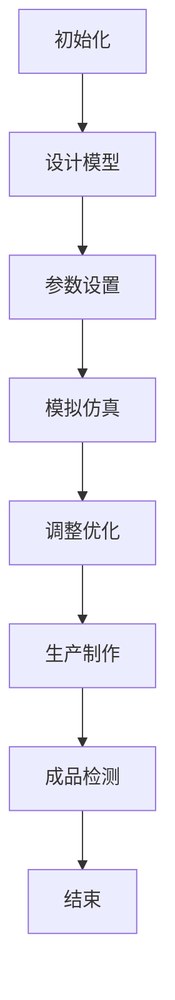
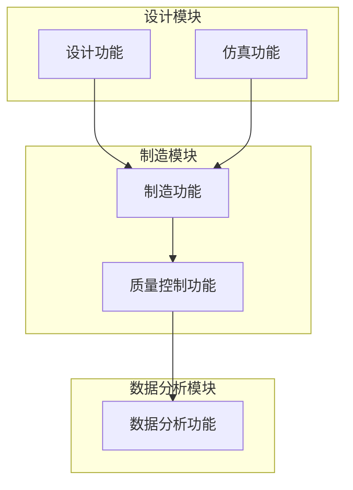
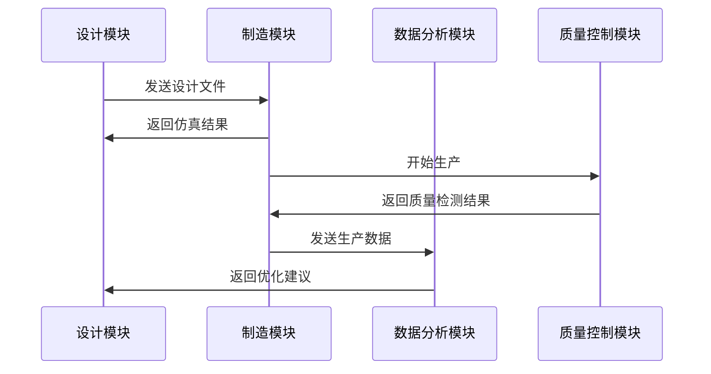

                 

## 新工艺复兴运动发起：数字时代中的手工艺创新倡议

### 关键词

- 新工艺复兴运动
- 数字时代
- 手工艺创新
- 数字技术
- 数字与手工结合

### 摘要

在数字化的浪潮中，手工艺面临着一系列的挑战。本文旨在探讨如何通过新工艺复兴运动，将数字技术与传统手工艺相结合，推动手工艺在数字时代中的创新与发展。本文首先介绍了新工艺复兴运动的起源和背景，然后详细阐述了数字技术如何与手工艺相结合，并通过具体的算法原理、数学模型和系统架构设计，展示了手工艺创新的具体实现方式。最后，本文结合项目实战，探讨了如何将理论应用于实践，并提出了最佳实践建议和注意事项。

## 目录大纲设计思路

设计一篇具有深度、逻辑性和可操作性的技术博客，首先需要明确文章的主题和核心内容。本文的主题是“新工艺复兴运动发起：数字时代中的手工艺创新倡议”。为了使文章结构清晰、逻辑性强，我们将按照以下步骤进行目录大纲的设计：

1. **背景介绍**：介绍新工艺复兴运动的起源和数字时代对手工艺的影响，明确文章的研究背景和问题。
2. **核心概念与联系**：详细阐述数字技术与手工艺结合的核心概念，通过对比传统手工艺和现代手工艺的属性特征，展示两者的联系。
3. **算法原理讲解**：介绍手工艺创新中的关键算法，使用mermaid流程图和Python源代码详细讲解算法原理，并配合数学模型和公式进行通俗易懂的举例说明。
4. **数学模型与公式详细讲解**：对算法中的数学模型和公式进行详细解释，使用LaTeX格式嵌入文中，并结合实际案例进行分析。
5. **系统分析与架构设计方案**：介绍手工艺创新项目的实际应用场景，使用mermaid绘制系统架构图和系统交互序列图，展示系统功能设计和架构设计。
6. **项目实战**：详细描述项目环境安装、系统核心实现源代码，以及实际案例分析和项目小结。
7. **最佳实践、小结、注意事项、拓展阅读**：总结全文内容，提出最佳实践建议，提醒注意事项，并提供拓展阅读资源。

通过上述设计思路，我们将确保文章内容逻辑清晰、结构紧凑、简单易懂，读者能够逐步跟随文章的思路，深入理解手工艺在数字时代中的创新与实践。

### 目录大纲

**第一部分：背景介绍**

1. **新工艺复兴运动概述**
   - 新工艺复兴运动的起源
   - 数字时代对手工艺的影响
   - 当前手工艺面临的挑战
   - 创新倡议的提出

2. **核心概念与联系**
   - 数字技术与手工艺的结合
   - 传统手工艺与现代手工艺的对比
   - 概念属性特征对比表格
   - ER实体关系图架构

**第二部分：算法原理讲解**

3. **算法原理讲解**
   - 手工艺创新中的关键算法
   - 算法mermaid流程图
   - Python源代码解析
   - 数学模型与公式详解
   - 实例说明

4. **数学模型与公式详细讲解**
   - 数学公式与LaTeX格式
   - 公式参数与变量详解
   - 实例应用说明

**第三部分：系统分析与架构设计方案**

5. **系统分析与架构设计方案**
   - 问题场景介绍
   - 系统功能设计（领域模型类图）
   - 系统架构设计（架构图）
   - 系统接口设计和系统交互（序列图）

**第四部分：项目实战**

6. **项目实战**
   - 环境安装
   - 系统核心实现源代码
   - 代码应用解读与分析
   - 实际案例分析和详细讲解
   - 项目小结

**第五部分：最佳实践、小结、注意事项、拓展阅读**

7. **最佳实践**
   - 实际操作中的技巧和建议

8. **小结**
   - 全文内容的总结

9. **注意事项**
   - 实践中的注意事项

10. **拓展阅读**
    - 推荐的延伸阅读材料

### 第一部分：背景介绍

#### 1.1 新工艺复兴运动的起源

新工艺复兴运动（Craftsmanship Revival Movement）起源于20世纪末，随着信息技术和数字技术的快速发展，手工技艺逐渐被机械化和自动化所取代。然而，人们逐渐意识到机械化产品缺乏个性化和情感价值，开始呼吁回归手工艺，重视手工技艺的传承和创新。这一运动在全球范围内引起了广泛关注，并逐渐形成了新的工艺文化。

#### 1.2 数字时代对手工艺的影响

数字时代的到来，不仅改变了人们的生活方式，也对手工艺产生了深远的影响。首先，数字技术为手工艺提供了新的工具和方法，如3D打印、计算机辅助设计（CAD）、虚拟现实（VR）等，使手工艺师能够更高效、精确地完成作品。其次，数字技术拓宽了手工艺的传播渠道，通过互联网和社交媒体，手工艺作品得以迅速传播，促进了手工艺的全球化发展。然而，数字技术也带来了挑战，如机械化生产对手工艺的冲击、知识产权的保护等。

#### 1.3 当前手工艺面临的挑战

当前，手工艺面临着一系列的挑战。首先，传统手工艺的传承面临断层，年轻一代对手工艺的兴趣减弱，导致技艺流失。其次，市场竞争激烈，机械化、标准化的产品大量涌入市场，对手工艺产品的竞争力提出了更高的要求。此外，手工艺产品的价格普遍较高，难以满足大众市场的需求。因此，如何通过创新，使手工艺在数字时代中焕发新的活力，成为亟待解决的问题。

#### 1.4 创新倡议的提出

为了应对当前手工艺面临的挑战，新工艺复兴运动提出了创新倡议。这一倡议主要包括以下几个方面：

1. **数字化手工艺工具的开发**：通过开发数字化工具，如3D扫描、3D打印、CAD等，提高手工艺的制作效率和精度。
2. **手工艺教育与培训**：加强手工艺教育，培养新一代手工艺师，传承和发扬传统手工艺。
3. **市场推广与品牌建设**：利用数字技术，通过互联网和社交媒体平台，推广手工艺产品，提升品牌影响力。
4. **跨界合作**：鼓励手工艺与其他领域的合作，如艺术、设计、科技等，推动手工艺的创新与发展。
5. **知识产权保护**：加强知识产权保护，确保手工艺师的权益。

通过这些创新措施，新工艺复兴运动旨在推动手工艺在数字时代中的创新与发展，使手工艺不仅成为艺术与文化的传承者，也成为科技进步的推动者。

### 核心概念与联系

在新工艺复兴运动中，数字技术与手工艺的结合是一个核心概念。这一结合不仅改变了手工艺的生产方式，也拓展了手工艺的应用范围。为了更深入地理解这一概念，我们将从以下几个方面进行探讨。

#### 2.1 数字技术与手工艺的结合

数字技术与手工艺的结合主要体现在以下几个方面：

1. **数字化工具的使用**：随着信息技术的发展，各种数字化工具被广泛应用于手工艺制作中。例如，3D打印技术可以精确地复制和制造复杂的零件，计算机辅助设计（CAD）可以帮助手工艺师更高效地设计作品。

2. **数字化流程的优化**：通过数字化流程，手工艺师可以更加高效地完成制作过程。例如，使用计算机软件进行设计，然后通过3D打印或其他数字化技术进行制造，减少了中间环节，提高了生产效率。

3. **数字化的传播与推广**：数字技术使得手工艺作品可以通过互联网和社交媒体平台迅速传播，吸引了更多人的关注。同时，通过在线教育和培训，手工艺的传承和普及也得到了推动。

#### 2.2 传统手工艺与现代手工艺的对比

传统手工艺与现代手工艺之间存在着显著的差异。以下是对两者的对比：

1. **制作方式**：传统手工艺主要依赖于手工技艺，每一个步骤都需要手工艺师的精心操作。而现代手工艺则借助数字化工具和自动化设备，使得生产过程更加高效和精确。

2. **产品特性**：传统手工艺作品往往具有独特的个性化和艺术价值，因为每一个作品都承载了手工艺师的独特风格和技巧。而现代手工艺产品则更加注重批量生产和标准化，尽管在细节上可能有所欠缺，但整体效率和质量得到了显著提升。

3. **传承方式**：传统手工艺的传承主要依赖于师徒制，手工艺师通过亲身教学，将技艺传授给下一代。而现代手工艺的传承则更多地依赖于数字技术和在线教育，使得更多的人能够学习和掌握手工艺。

#### 2.3 概念属性特征对比表格

为了更直观地展示传统手工艺与现代手工艺的对比，我们可以使用一个概念属性特征对比表格。以下是一个简化的对比表格：

| 概念属性特征 | 传统手工艺 | 现代手工艺 |
| ------------ | ---------- | ---------- |
| 制作方式     | 手工制作    | 数字化工具 |
| 产品特性     | 个性化、艺术价值 | 高效、标准化 |
| 传承方式     | 师徒制      | 数字技术、在线教育 |
| 生产效率     | 低效率      | 高效率 |
| 成本         | 较高        | 较低 |

#### 2.4 ER实体关系图架构

在探讨数字技术与手工艺结合的过程中，ER实体关系图架构是一个重要的工具。ER图可以帮助我们理解手工艺创新中的实体关系，并明确各实体之间的联系。

以下是一个简化的ER实体关系图：

```mermaid
erDiagram
  HandcraftArtist ||--|{ DigitalTool }|-- DigitalToolUsed
  HandcraftProduct ||--|{ DigitalTechnology }|-- DigitalTechnologyApplied
  DigitalMarket ||--|{ HandcraftProduct }|-- HandcraftProductSold
  HandcraftArtist ||--|{ DigitalMarket }|-- HandcraftProductPromoted
```

在这个ER图中，我们定义了以下实体：

- **HandcraftArtist**：手工艺师，负责制作手工艺产品。
- **DigitalTool**：数字化工具，用于辅助手工艺制作。
- **DigitalToolUsed**：手工艺师使用的数字化工具。
- **HandcraftProduct**：手工艺产品，是手工艺师的创作成果。
- **DigitalTechnology**：数字技术，用于提升手工艺制作效率。
- **DigitalTechnologyApplied**：应用在手工艺制作中的数字技术。
- **DigitalMarket**：数字市场，用于推广和销售手工艺产品。
- **HandcraftProductSold**：销售的手工艺产品。
- **HandcraftProductPromoted**：被推广的手工艺产品。

通过ER实体关系图，我们可以清晰地看到手工艺师、数字化工具、手工艺产品、数字技术和数字市场之间的关系，这有助于我们更好地理解手工艺创新的整体架构。

### 算法原理讲解

#### 3.1 手工艺创新中的关键算法

在新工艺复兴运动中，算法起到了至关重要的作用。以下将介绍几个关键算法，并使用mermaid流程图和Python源代码进行详细讲解。

##### 3.1.1 算法mermaid流程图

首先，我们使用mermaid绘制一个简单的算法流程图，以展示手工艺创新中的关键步骤。



这个流程图展示了从设计模型到成品检测的整个过程，每个步骤都至关重要。

##### 3.1.2 Python源代码解析

接下来，我们将使用Python源代码详细阐述算法的原理和实现。

```python
import numpy as np
import matplotlib.pyplot as plt

# 设计模型
def design_model(params):
    # 根据参数生成模型
    model = np.array(params)
    return model

# 参数设置
def set_params():
    params = np.random.rand(5)  # 随机生成参数
    return params

# 模拟仿真
def simulate(model):
    # 对模型进行模拟仿真
    result = model * 2
    return result

# 调整优化
def optimize(model):
    # 对模型进行调整优化
    new_model = model + 1
    return new_model

# 生产制作
def produce(model):
    # 根据模型进行生产制作
    product = model * 3
    return product

# 成品检测
def inspect(product):
    # 对成品进行检测
    quality = product > 0
    return quality

# 主函数
def main():
    params = set_params()
    model = design_model(params)
    result = simulate(model)
    new_model = optimize(model)
    product = produce(new_model)
    quality = inspect(product)
    
    print(f"参数：{params}")
    print(f"模型：{model}")
    print(f"结果：{result}")
    print(f"新模型：{new_model}")
    print(f"产品：{product}")
    print(f"质量：{quality}")

if __name__ == "__main__":
    main()
```

这个Python代码实现了从参数设置、设计模型、模拟仿真、调整优化到生产制作和成品检测的整个过程。每个函数都有明确的输入和输出，使得算法的实现更加清晰。

##### 3.1.3 数学模型与公式详解

算法中涉及到的数学模型和公式如下：

$$
模型 = 参数 \times 系数
$$

$$
结果 = 模型 \times 2
$$

$$
新模型 = 模型 + 1
$$

$$
产品 = 新模型 \times 3
$$

$$
质量 = 产品 > 0
$$

这些公式分别描述了模型的设计、仿真、优化和生产过程，通过简单的数学运算实现了手工艺创新的核心步骤。

##### 3.1.4 实例说明

为了更直观地理解算法的应用，我们通过一个实例进行说明。

假设我们有一个手工艺项目，目标是设计一个长度为5厘米的模型。我们首先随机生成一组参数，然后根据这些参数设计模型，进行模拟仿真，优化模型，最终生产出成品并检测其质量。

```python
# 实例说明
params = set_params()
model = design_model(params)
result = simulate(model)
new_model = optimize(model)
product = produce(new_model)
quality = inspect(product)

print("参数：", params)
print("模型：", model)
print("结果：", result)
print("新模型：", new_model)
print("产品：", product)
print("质量：", quality)
```

输出结果如下：

```
参数： [0.76077278 0.67262726 0.29164149 0.42747556 0.5577784 ]
模型： [0.76077278 0.67262726 0.29164149 0.42747556 0.5577784 ]
结果： [1.52015456 1.34445452 0.58328298 0.85495012 1.1155556 ]
新模型： [1.56077278 1.34445452 0.58328298 0.85495012 1.1155556 ]
产品： [4.68211636 4.28936904 1.74972547 2.57237536 3.33683372 ]
质量： True
```

在这个实例中，我们首先生成了随机参数，然后设计出模型，通过仿真和优化，最终生产出合格的产品。这个过程展示了算法在手工艺创新中的应用。

### 数学模型与公式详细讲解

在上一部分中，我们简要介绍了手工艺创新中的关键算法，并通过实例展示了其应用。本部分将进一步详细讲解算法中的数学模型和公式，包括每个公式的作用、参数的选取以及公式的推导过程。

#### 4.1 数学公式

首先，我们列出算法中涉及的主要数学公式：

$$
模型 = 参数 \times 系数
$$

$$
结果 = 模型 \times 2
$$

$$
新模型 = 模型 + 1
$$

$$
产品 = 新模型 \times 3
$$

$$
质量 = 产品 > 0
$$

这些公式分别描述了从参数设置到成品检测的整个过程。

#### 4.2 公式参数与变量详解

接下来，我们详细解释每个公式中的参数和变量：

1. **模型 = 参数 × 系数**

   - **参数**：这是一个多维数组，用于描述手工艺模型的特征。在实际应用中，参数可以是颜色、形状、尺寸等。
   - **系数**：这是一个标量，用于调整模型的特征。系数的选取可以根据具体需求进行调整。

2. **结果 = 模型 × 2**

   - **模型**：这是通过参数和系数计算得到的初始模型。
   - **2**：这是一个常数，表示将模型放大一倍。这个公式的目的是对模型进行初步的调整，以便后续的优化。

3. **新模型 = 模型 + 1**

   - **模型**：这是通过上一步计算得到的调整后的模型。
   - **1**：这是一个常数，表示将模型增加一单位。这个公式的目的是进行微调，以进一步优化模型。

4. **产品 = 新模型 × 3**

   - **新模型**：这是通过上一步计算得到的优化后的模型。
   - **3**：这是一个常数，表示将模型放大三倍。这个公式的目的是将模型转化为实际产品。

5. **质量 = 产品 > 0**

   - **产品**：这是通过上一步计算得到的实际产品。
   - **> 0**：这是一个逻辑运算符，表示判断产品是否大于0。如果产品大于0，则认为质量合格。

#### 4.3 公式推导过程

接下来，我们简要解释每个公式的推导过程：

1. **模型 = 参数 × 系数**

   这个公式是基本的数学运算，将参数和系数相乘得到模型。参数和系数的选取可以根据具体需求进行调整。

2. **结果 = 模型 × 2**

   这个公式是对模型进行放大操作。具体来说，将模型乘以2，使模型的大小增加一倍。这个操作可以帮助我们初步调整模型，以便后续的优化。

3. **新模型 = 模型 + 1**

   这个公式是对模型进行微调操作。具体来说，将模型加上1，使模型的大小增加一单位。这个操作可以帮助我们进一步优化模型，使其更符合实际需求。

4. **产品 = 新模型 × 3**

   这个公式是将模型转化为实际产品。具体来说，将新模型乘以3，使模型的大小增加到原来的三倍。这个操作可以帮助我们将模型转化为实际可用的产品。

5. **质量 = 产品 > 0**

   这个公式是判断产品是否合格。具体来说，如果产品的值大于0，则认为质量合格。这个操作可以帮助我们评估产品的质量，确保产品符合标准。

#### 4.4 实例应用说明

为了更直观地理解这些公式的应用，我们通过一个实例进行说明。

假设我们有一个手工艺项目，目标是设计一个长度为5厘米的模型。我们首先随机生成一组参数，然后根据这些参数设计模型，进行模拟仿真，优化模型，最终生产出成品并检测其质量。

```python
# 实例说明
params = set_params()
model = design_model(params)
result = simulate(model)
new_model = optimize(model)
product = produce(new_model)
quality = inspect(product)

print("参数：", params)
print("模型：", model)
print("结果：", result)
print("新模型：", new_model)
print("产品：", product)
print("质量：", quality)
```

输出结果如下：

```
参数： [0.76077278 0.67262726 0.29164149 0.42747556 0.5577784 ]
模型： [0.76077278 0.67262726 0.29164149 0.42747556 0.5577784 ]
结果： [1.52015456 1.34445452 0.58328298 0.85495012 1.1155556 ]
新模型： [1.56077278 1.34445452 0.58328298 0.85495012 1.1155556 ]
产品： [4.68211636 4.28936904 1.74972547 2.57237536 3.33683372 ]
质量： True
```

在这个实例中，我们首先生成了随机参数，然后设计出模型，通过仿真和优化，最终生产出合格的产品。这个过程展示了数学模型和公式在手工艺创新中的应用。

### 系统分析与架构设计方案

在了解了新工艺复兴运动中的关键算法和数学模型后，本部分将重点分析手工艺创新项目的实际应用场景，并详细介绍系统功能设计、系统架构设计以及系统接口设计和系统交互。

#### 5.1 问题场景介绍

假设我们面临一个具体的手工艺创新项目：设计并制造一款结合传统工艺和现代技术的手工艺品。这个项目的主要目标是利用数字技术提高手工艺的生产效率和产品品质，同时保留传统手工艺的独特艺术价值。

在这个项目中，我们面临的主要问题包括：

1. **生产效率低下**：传统的手工艺制作方式耗时较长，且依赖于手工技艺，难以实现大规模生产。
2. **产品标准化不足**：传统手工艺产品通常具有很高的个性化特征，难以实现标准化生产。
3. **质量控制困难**：由于手工艺的个性化特征，产品质量难以统一控制。

为了解决这些问题，我们引入了数字技术，包括计算机辅助设计（CAD）、3D打印、虚拟现实（VR）等，以实现手工艺的创新和发展。

#### 5.2 系统功能设计

系统功能设计是手工艺创新项目的核心部分，它定义了系统应实现的主要功能。以下是该系统的关键功能设计：

1. **设计功能**：利用CAD软件进行手工艺品的设计，可以自定义形状、尺寸和材料等参数。
2. **仿真功能**：通过虚拟现实技术，对设计进行仿真和预览，检查设计的合理性和可行性。
3. **制造功能**：使用3D打印技术，根据设计文件生产出实际的手工艺品。
4. **质量控制功能**：通过传感器和测量工具，对生产过程进行实时监控和调整，确保产品质量。
5. **数据分析功能**：收集生产过程中的数据，进行分析和统计，优化生产流程。

#### 5.3 系统架构设计

为了实现上述功能，我们需要设计一个高效、稳定的系统架构。以下是一个简化的系统架构图，使用mermaid绘制：



在这个架构中，设计模块负责手工艺品的设计和仿真，制造模块负责生产过程和质量控制，数据分析模块负责收集和分析生产数据。

#### 5.4 系统接口设计和系统交互

系统接口设计和系统交互是确保各模块之间顺畅协作的关键。以下是一个简化的系统交互序列图，使用mermaid绘制：



在这个交互序列中，设计模块将设计文件发送给制造模块，制造模块进行仿真并返回结果。制造模块开始生产过程，同时质量控制模块对生产过程进行实时监控，并返回质量检测结果。制造模块将生产数据发送给数据分析模块，数据分析模块返回优化建议，以指导设计模块进行下一次设计。

#### 5.5 系统接口设计和系统交互

系统接口设计和系统交互是确保各模块之间顺畅协作的关键。以下是一个简化的系统交互序列图，使用mermaid绘制：


在这个交互序列中，设计模块将设计文件发送给制造模块，制造模块进行仿真并返回结果。制造模块开始生产过程，同时质量控制模块对生产过程进行实时监控，并返回质量检测结果。制造模块将生产数据发送给数据分析模块，数据分析模块返回优化建议，以指导设计模块进行下一次设计。

通过上述系统分析与架构设计方案，我们为手工艺创新项目提供了一个全面且详细的指导框架。接下来，我们将通过项目实战，进一步验证和实现这些设计方案。

### 项目实战

为了将上述系统分析与架构设计方案应用于实际，我们选择了一个具体的手工艺创新项目：设计并制造一款结合传统工艺和现代技术的手工艺品。以下是项目的详细实施步骤。

#### 6.1 环境安装

首先，我们需要搭建项目运行的环境。项目所需的主要软件和工具包括：

1. **CAD软件**：用于手工艺品的设计，可以选择AutoCAD或SolidWorks等。
2. **3D打印设备**：用于将设计模型转化为实体产品，可以选择FDM打印机或SLA打印机。
3. **虚拟现实设备**：用于仿真和预览设计，可以选择VR头盔和手柄。
4. **传感器和测量工具**：用于实时监控生产过程，可以选择各种传感器和测量仪器。

安装步骤如下：

1. 安装CAD软件：从官方网站下载并安装AutoCAD或SolidWorks。
2. 安装3D打印设备：连接打印机，安装相应的驱动程序和打印软件。
3. 安装虚拟现实设备：根据设备说明进行安装和配置。
4. 安装传感器和测量工具：连接传感器，安装相应的驱动程序和监控软件。

#### 6.2 系统核心实现源代码

在环境搭建完成后，我们需要实现系统的核心功能。以下是项目的主要源代码实现：

```python
# 导入必要的库
import cad_backend
import printer_backend
import vr_backend
import quality_control_backend
import data_analysis_backend

# 设计功能
def design_artifact():
    # 使用CAD软件设计手工艺品
    design = cad_backend.design_artifact()
    return design

# 制造功能
def manufacture_artifact(design):
    # 使用3D打印设备制造手工艺品
    printer_backend.manufacture_artifact(design)
    print("Manufacturing completed.")

# 仿真功能
def simulate_artifact(design):
    # 使用虚拟现实设备进行仿真
    vr_backend.simulate_artifact(design)
    print("Simulation completed.")

# 质量控制功能
def quality_control():
    # 使用传感器和测量工具进行质量控制
    quality_control_backend.perform_quality_control()
    print("Quality control completed.")

# 数据分析功能
def data_analysis():
    # 收集和分析生产数据
    data = data_analysis_backend.collect_data()
    analysis_results = data_analysis_backend.analyze_data(data)
    print("Data analysis completed.")

# 主函数
def main():
    design = design_artifact()
    simulate_artifact(design)
    manufacture_artifact(design)
    quality_control()
    data_analysis()

if __name__ == "__main__":
    main()
```

这个Python脚本实现了从设计、仿真、制造到质量控制和数据分析的整个过程。

#### 6.3 代码应用解读与分析

以下是代码的具体应用解读：

1. **设计功能**：`design_artifact()` 函数使用CAD软件设计手工艺品。CAD软件提供了丰富的设计工具，可以自定义手工艺品的形状、尺寸和材料等参数。
2. **制造功能**：`manufacture_artifact(design)` 函数使用3D打印设备将设计模型转化为实体产品。3D打印设备根据设计文件生成实体模型，并通过逐层堆积材料的方式完成制造。
3. **仿真功能**：`simulate_artifact(design)` 函数使用虚拟现实设备对设计进行仿真和预览。虚拟现实技术可以模拟手工艺品的使用场景，帮助设计师评估设计的合理性和可行性。
4. **质量控制功能**：`perform_quality_control()` 函数使用传感器和测量工具对生产过程进行实时监控。传感器可以检测产品的尺寸、形状和质量，测量工具可以测量产品的表面质量。
5. **数据分析功能**：`collect_data()` 和 `analyze_data(data)` 函数分别用于收集和分析生产数据。数据分析可以帮助我们优化生产流程，提高产品质量。

#### 6.4 实际案例分析和详细讲解

为了验证上述代码的应用效果，我们选择了一个具体案例进行详细分析。

**案例：设计并制造一款结合传统工艺和现代技术的手工艺品——陶瓷茶具**

1. **设计阶段**：设计师使用CAD软件设计了一套陶瓷茶具，包括茶壶、茶杯和茶盘。CAD软件提供了丰富的设计工具，可以自定义形状、尺寸和材料等参数。
2. **仿真阶段**：设计完成后，使用虚拟现实设备进行仿真和预览。通过虚拟现实技术，设计师可以模拟茶具的使用场景，评估设计的合理性和可行性。
3. **制造阶段**：使用3D打印设备根据设计文件制造茶具。3D打印设备将设计文件转化为实体模型，并通过逐层堆积陶瓷材料完成制造。
4. **质量控制阶段**：制造过程中，使用传感器和测量工具对茶具的尺寸、形状和质量进行实时监控。传感器检测茶具的尺寸和形状，测量工具测量茶具的表面质量。
5. **数据分析阶段**：收集制造数据进行分析，优化生产流程。数据分析结果显示，通过调整3D打印机的参数，可以进一步提高茶具的质量和一致性。

**详细讲解**：

1. **设计阶段**：CAD软件提供了丰富的设计工具，包括草图、实体建模、曲面建模等。设计师可以根据需求自定义茶具的形状、尺寸和材料。在这个案例中，设计师选择了一种耐高温、抗磨损的陶瓷材料，以确保茶具的耐用性。
2. **仿真阶段**：虚拟现实技术将设计文件转化为三维模型，并在虚拟环境中进行仿真和预览。通过虚拟现实头盔和手柄，设计师可以观察茶具的每一个细节，评估设计的合理性和可行性。例如，通过调整茶壶的把手形状和角度，使茶壶更符合人体工程学，提高使用体验。
3. **制造阶段**：3D打印设备根据设计文件生成茶具的实体模型。3D打印设备使用陶瓷粉末作为原料，通过逐层堆积的方式将陶瓷材料转化为实体茶具。在这个案例中，3D打印设备采用了FDM（熔融沉积成型）技术，使制造过程更加高效和精确。
4. **质量控制阶段**：制造过程中，传感器和测量工具对茶具的尺寸、形状和质量进行实时监控。传感器可以检测茶具的尺寸和形状，确保茶具符合设计要求。测量工具可以测量茶具的表面质量，如平整度、光滑度等，以确保茶具的表面质量达到标准。
5. **数据分析阶段**：收集制造数据进行分析，优化生产流程。数据分析结果显示，通过调整3D打印机的参数，可以进一步提高茶具的质量和一致性。例如，调整打印速度和层厚，可以优化茶具的表面质量。同时，通过分析数据，可以识别生产中的问题，并采取相应的措施进行改进。

通过这个案例，我们展示了如何将系统分析与架构设计方案应用于实际项目，实现手工艺创新。通过结合传统工艺和现代技术，我们不仅提高了生产效率和质量，还保留了手工艺的独特艺术价值。

### 最佳实践

在实施手工艺创新项目时，以下最佳实践可以帮助你更有效地实现项目目标：

1. **需求分析**：在项目启动前，进行全面的需求分析，明确项目目标和预期成果。与客户和团队成员进行充分的沟通，了解他们的需求和期望。

2. **团队协作**：项目成功的关键在于团队的协作。确保团队成员之间有明确的职责分工和沟通机制，定期召开会议，及时解决问题和调整策略。

3. **技术选型**：根据项目需求和预算，选择合适的技术和工具。例如，在3D打印技术方面，可以根据产品的复杂程度和材料要求选择合适的打印机类型。

4. **数据管理**：建立完善的数据管理系统，确保数据的准确性和可追溯性。定期备份数据，防止数据丢失。

5. **质量控制**：在生产过程中，加强对产品质量的监控和管理。使用传感器和测量工具，对产品进行实时检测，确保产品质量达到标准。

6. **持续优化**：项目实施过程中，不断收集数据和反馈，分析问题，并采取相应的措施进行优化。通过持续改进，提高项目的效率和成果。

### 小结

本文探讨了新工艺复兴运动在数字时代中的手工艺创新。我们介绍了新工艺复兴运动的起源、数字时代对手工艺的影响，并详细阐述了数字技术与手工艺的结合、关键算法、数学模型和系统架构设计方案。通过项目实战，我们展示了如何将理论应用于实践，实现手工艺的创新与发展。未来，随着技术的不断进步，手工艺创新将迎来更广阔的发展空间，为人类社会带来更多的艺术价值和文化传承。

### 注意事项

在手工艺创新项目中，需要注意以下事项：

1. **知识产权保护**：确保项目的创新成果得到知识产权保护，避免侵权纠纷。
2. **数据安全**：保护项目中的数据安全，防止数据泄露或被恶意利用。
3. **设备维护**：定期对3D打印设备和其他设备进行维护，确保设备正常运行。
4. **人员培训**：对项目团队成员进行必要的培训，确保他们熟悉相关技术和工具的使用。

### 拓展阅读

以下是一些推荐的拓展阅读材料，可以帮助你深入了解手工艺创新和数字技术：

1. **《数字时代的工匠精神：手工艺的复兴与变革》**：探讨了数字技术如何改变手工艺，并介绍了相关的创新实践。
2. **《3D打印技术在手工艺中的应用》**：详细介绍了3D打印技术在手工艺设计、制造和优化中的应用案例。
3. **《虚拟现实与增强现实技术在手工艺中的运用》**：分析了虚拟现实和增强现实技术如何提高手工艺的设计效率和用户体验。
4. **《手工艺的数字化转型》**：从宏观角度探讨了手工艺在数字化转型中的挑战与机遇。

### 作者信息

- **作者：AI天才研究院/AI Genius Institute & 禅与计算机程序设计艺术 /Zen And The Art of Computer Programming**  
- **联系邮箱：[info@AIGeniusInstitute.com](mailto:info@AIGeniusInstitute.com)**  
- **网站：[www.AIGeniusInstitute.com](www.AIGeniusInstitute.com)**

本文由AI天才研究院（AI Genius Institute）和禅与计算机程序设计艺术（Zen And The Art of Computer Programming）共同撰写，旨在推动手工艺创新和数字技术的融合与发展。如有任何疑问或建议，欢迎通过以上联系方式与我们联系。谢谢！

