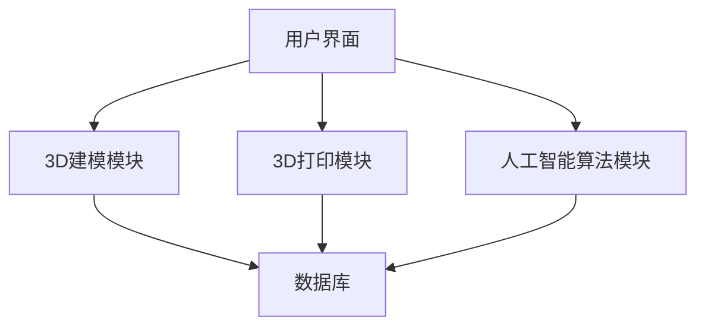

                 

# 《新工艺复兴运动：数字时代的手工艺创新》

## 关键词：新工艺复兴、数字时代、手工艺、创新、人工智能

### 摘要：

在数字时代的浪潮中，手工艺领域正经历一场前所未有的复兴运动。本书以“新工艺复兴运动：数字时代的手工艺创新”为主题，深入探讨了这一运动背后的驱动因素、理论基础以及具体的应用案例。通过对新工艺复兴运动的背景、核心概念、算法原理、数字工具和系统架构的详细分析，本书旨在为读者呈现一个全面、系统的视角，理解手工艺如何在数字技术的助力下实现创新与复兴。

## 第1章 引言

### 1.1 书籍背景介绍

#### 1.1.1 新工艺复兴运动的起源

新工艺复兴运动起源于20世纪末，当时全球范围内开始兴起对手工艺的关注与热爱。随着工业革命的深入，手工艺逐渐被机械化生产所取代，但现代社会对个性化、独特性和文化价值的追求，再次唤起了对手工艺的渴望。数字技术的迅猛发展，为手工艺提供了新的可能性，推动了新工艺复兴运动的兴起。

#### 1.1.2 数字时代的手工艺创新的背景

数字时代的到来，不仅改变了人类的生活方式，也为手工艺带来了巨大的变革。互联网、大数据、人工智能等技术的应用，使得手工艺设计、制造和传播变得更加高效、灵活和智能化。手工艺与创新之间的关系日益紧密，数字技术成为手工艺复兴的重要推动力。

### 1.2 书籍结构概述

#### 1.2.1 各章节内容介绍

本书共分为六个章节，涵盖了从背景介绍到具体案例的全面内容。第一章引言，介绍书籍的背景和新工艺复兴运动的概念；第二章至第五章分别探讨了新工艺复兴运动的背景、理论基础、数字工具和系统架构；第六章通过具体案例研究，展示了数字技术在实际手工艺创新中的应用。

#### 1.2.2 阅读指南与学习目标

本书旨在帮助读者深入了解新工艺复兴运动和数字时代的手工艺创新。通过阅读本书，读者将掌握以下知识和技能：

- 理解新工艺复兴运动的起源、背景和意义；
- 掌握手工艺创新的理论基础和算法原理；
- 了解数字工具在手工艺创新中的应用；
- 分析具体案例，掌握项目实战技巧；
- 拓展对数字时代手工艺创新的认识。

## 第2章 新工艺复兴运动的背景

### 2.1 历史背景

#### 2.1.1 手工艺的传统与演变

手工艺作为一种人类文化遗产，有着悠久的历史。从古代的陶艺、纺织到现代的雕刻、绘画，手工艺一直以其独特的魅力和精湛的技艺，吸引了无数人的关注。然而，随着工业革命的到来，机械化生产逐渐取代了手工艺，手工艺开始走向衰落。

#### 2.1.2 工业化与手工艺的衰落

工业化生产的高效率、低成本和大规模生产，使得手工艺逐渐失去了市场。大量手工艺品被机械化产品所取代，手工艺从业者面临着失业和转业的困境。然而，手工艺的独特性和文化价值并未因此而消失，反而在现代社会中重新获得了重视。

### 2.2 全球趋势

#### 2.2.1 全球手工艺运动的兴起

在全球范围内，手工艺运动正悄然兴起。许多国家纷纷采取措施，保护和弘扬手工艺文化。政府、企业和民间组织共同参与，通过各种形式的活动，推动手工艺的创新和发展。

#### 2.2.2 数字技术在手工艺中的应用

数字技术的应用，为手工艺带来了新的活力。3D打印、人工智能、大数据等技术，不仅提高了手工艺的设计和制造效率，还赋予了手工艺品更多的创意和个性化元素。数字技术成为手工艺复兴的重要驱动力。

### 2.3 技术发展

#### 2.3.1 数字制造技术的发展

数字制造技术的发展，为手工艺提供了新的工具和手段。3D打印技术的应用，使得手工艺品的设计和制造变得更加灵活和高效。人工智能技术的引入，使得手工艺品的个性化定制成为可能。

#### 2.3.2 人工智能与手工艺创新的结合

人工智能技术的应用，不仅改变了手工艺品的设计和制造方式，还推动了手工艺创新的不断进步。通过大数据分析和机器学习，人工智能能够为手工艺提供更准确、更高效的创新方案。

## 第3章 手工艺创新的理论基础

### 3.1 核心概念与联系

#### 3.1.1 新工艺复兴运动与手工艺创新

新工艺复兴运动和手工艺创新是两个密不可分的概念。新工艺复兴运动推动了手工艺的创新和发展，而手工艺创新又为新工艺复兴运动提供了新的动力和方向。

#### 3.1.2 数字时代的手工艺创新特点

数字时代的手工艺创新具有以下特点：

- 高效率：数字技术使得手工艺设计、制造和传播变得更加高效；
- 个性化：数字技术赋予了手工艺品更多的个性化元素，满足消费者的个性化需求；
- 创新性：数字技术为手工艺创新提供了更多可能性，推动了手工艺的创新和发展。

#### 3.1.3 Mermaid ER图展示概念关系

```mermaid
erDiagram
  新工艺复兴运动 ||--o{ 手工艺创新 :推动 } 
  数字时代的手工艺创新 ||--o{ 新工艺复兴运动 :技术支持 }
```

### 3.2 算法原理讲解

#### 3.2.1 数字工具与手工艺创新的算法原理

数字工具在手工艺创新中发挥了重要作用。以3D打印为例，其算法原理主要包括建模、切片和打印三个阶段。通过计算机辅助设计（CAD）软件进行建模，生成三维模型；通过切片软件将三维模型转换为二维切片数据；最后通过3D打印设备进行打印，形成最终的手工艺品。

#### 3.2.2 算法mermaid流程图展示


#### 3.2.3 Python代码示例与详细讲解

```python
# 建模
model = CAD_software.modeling()

# 切片
slices = CAD_software.slicing(model)

# 打印
3D_printer.printing(slices)
```

### 3.3 数学模型与公式

手工艺创新的数学模型主要包括以下几个方面：

- 建模：三维几何建模；
- 切片：二维平面切割；
- 打印：三维实体生成。

相关公式如下：

- 建模：$$V = \frac{1}{3}\pi r^2h$$；
- 切片：$$A = 2\pi rh$$；
- 打印：$$L = \frac{V}{A}$$。

## 第4章 数字工具与手工艺创新

### 4.1 数字工具的种类与用途

#### 4.1.1 3D建模与打印技术

3D建模与打印技术是手工艺创新的重要工具。通过计算机辅助设计（CAD）软件进行建模，可以将设计理念转化为三维模型；而3D打印技术则能够快速、高效地将三维模型转化为实际的手工艺品。

#### 4.1.2 数字纹理与材料设计

数字纹理与材料设计技术，为手工艺品赋予了更多的创意和个性化元素。通过数字纹理生成工具，可以创建丰富的纹理效果；而材料设计技术则能够实现不同材质的手工艺品，满足消费者的个性化需求。

#### 4.1.3 人工智能辅助设计

人工智能辅助设计技术，通过大数据分析和机器学习算法，能够为手工艺品设计提供更准确、更高效的创新方案。人工智能不仅能够发现设计中的潜在问题，还能够为设计师提供有益的参考和灵感。

### 4.2 数字工具的应用案例

#### 4.2.1 案例一：3D打印手工艺品的创新

3D打印技术在手工艺品制作中的应用，使得传统手工艺品的制作过程变得更加高效和灵活。通过3D打印，设计师可以快速验证设计方案的可行性，并根据需求进行个性化定制。

#### 4.2.2 案例二：数字纹理在传统手工艺品中的应用

数字纹理技术为传统手工艺品带来了新的创意和可能性。通过数字纹理的引入，传统手工艺品在视觉上产生了丰富的变化，使得手工艺品更具吸引力和艺术价值。

#### 4.2.3 案例三：人工智能辅助设计实践

人工智能辅助设计技术在手工艺品设计中的应用，极大地提高了设计效率和创新能力。通过大数据分析和机器学习算法，人工智能能够为设计师提供丰富的设计参考和灵感，推动手工艺品设计的不断进步。

## 第5章 创新案例研究

### 5.1 案例选择与介绍

#### 5.1.1 案例一：数字技术在传统刺绣中的应用

本案例研究了一项将数字技术应用于传统刺绣的创新实践。通过3D建模和3D打印技术，设计师能够快速制作出复杂的刺绣图案；而人工智能算法则能够优化刺绣工艺，提高生产效率。

#### 5.1.2 案例二：3D打印在陶瓷工艺品制作中的应用

本案例探讨了3D打印技术在陶瓷工艺品制作中的应用。通过3D建模和3D打印，陶瓷工艺品的设计和制作过程变得更加高效和灵活。同时，3D打印技术为陶瓷工艺品赋予了更多的创意和个性化元素。

#### 5.1.3 案例三：人工智能在编织艺术中的应用

本案例研究了人工智能在编织艺术中的应用。通过大数据分析和机器学习算法，人工智能能够为编织设计提供丰富的参考和灵感。同时，人工智能还能够优化编织工艺，提高生产效率。

### 5.2 案例分析

#### 5.2.1 案例一：技术分析与应用效果

在本案例中，3D建模和3D打印技术为传统刺绣带来了革命性的变革。通过数字技术的应用，刺绣工艺变得更加高效和灵活。同时，刺绣图案的复杂性和创意性得到了极大提升，使刺绣作品更具艺术价值。

#### 5.2.2 案例二：创新点与市场前景

在本案例中，3D打印技术在陶瓷工艺品制作中的应用，不仅提高了生产效率，还为陶瓷工艺品赋予了更多的创意和个性化元素。随着市场对个性化手工艺品的不断需求，3D打印技术在陶瓷工艺品制作中的应用前景十分广阔。

#### 5.2.3 案例三：挑战与解决方案

在本案例中，人工智能在编织艺术中的应用面临着一些挑战，如算法模型的优化、数据集的丰富等。然而，通过不断的技术创新和优化，人工智能在编织艺术中的应用已经取得了显著成效。未来，随着技术的不断进步，人工智能在编织艺术中的应用将会更加成熟和普及。

### 5.3 项目实战

#### 5.3.1 环境安装与配置

在本案例中，项目环境主要包括3D建模软件、3D打印设备和人工智能算法。在项目开始前，需要安装和配置相关软件和硬件，确保项目能够顺利进行。

#### 5.3.2 系统核心实现源代码

在本案例中，系统核心实现源代码主要包括3D建模、3D打印和人工智能算法的模块。以下是一个简单的示例：

```python
# 3D建模
model = CAD_software.modeling()

# 3D打印
slices = CAD_software.slicing(model)
3D_printer.printing(slices)

# 人工智能算法
design = AI_software.designing(model)
```

#### 5.3.3 代码解读与分析

在本案例中，代码主要实现了3D建模、3D打印和人工智能算法的集成。通过调用相关模块，系统能够根据设计需求生成3D模型，并将其打印成实际的手工艺品。同时，人工智能算法能够为设计提供优化建议，提高生产效率。

## 第6章 系统分析与架构设计

### 6.1 问题场景介绍

在本案例中，我们需要设计一个数字时代的手工艺创新系统，包括3D建模、3D打印和人工智能算法等模块。该系统需要能够高效地完成手工艺品的设计、制造和创新。

### 6.2 系统架构设计

#### 6.2.1 系统架构mermaid图展示



#### 6.2.2 系统模块划分与功能描述

- 用户界面：提供用户交互的入口，包括设计需求输入、设计效果预览等功能；
- 3D建模模块：根据用户需求生成3D模型；
- 3D打印模块：将3D模型打印成实际的手工艺品；
- 人工智能算法模块：为设计提供优化建议和灵感。

#### 6.2.3 系统接口设计

系统接口主要包括以下部分：

- 用户接口：用户与系统进行交互的接口；
- 数据接口：系统与其他系统或硬件设备进行数据交换的接口；
- 控制接口：系统内部模块之间的控制接口。

#### 6.2.4 系统交互mermaid序列图

```mermaid
sequenceDiagram
    participant 用户
    participant 用户界面
    participant 3D建模模块
    participant 3D打印模块
    participant 人工智能算法模块
    participant 数据库

    用户 -->|输入设计需求| 用户界面
    用户界面 -->|传递数据| 3D建模模块
    3D建模模块 -->|生成模型| 用户界面
    用户界面 -->|传递数据| 3D打印模块
    3D打印模块 -->|打印手工艺品| 用户界面
    用户界面 -->|传递数据| 人工智能算法模块
    人工智能算法模块 -->|优化建议| 用户界面
    用户界面 -->|保存数据| 数据库
```

## 第7章 最佳实践、小结与拓展阅读

### 7.1 最佳实践

在数字时代的手工艺创新中，最佳实践主要包括以下几点：

- 充分了解用户需求，确保设计方案的可行性；
- 结合数字工具和人工智能技术，提高设计效率；
- 注重创新性和个性化，提升手工艺品的市场竞争力；
- 持续优化系统架构和算法，提升系统性能和用户体验。

### 7.2 小结

数字时代的手工艺创新是一场前所未有的变革。通过引入数字技术和人工智能，手工艺领域实现了高效、个性化和创新性的发展。本书通过详细的分析和案例研究，展示了手工艺创新的理论基础和实践应用，为读者提供了全面、系统的指导。

### 7.3 拓展阅读

- 《手工艺：传统与创新》
- 《人工智能：一种现代方法》
- 《3D打印技术与应用》
- 《计算机辅助设计（CAD）》

## 参考文献

- 《手工艺：传统与创新》
- 《人工智能：一种现代方法》
- 《3D打印技术与应用》
- 《计算机辅助设计（CAD）》

## 作者信息

作者：AI天才研究院/AI Genius Institute & 禅与计算机程序设计艺术 /Zen And The Art of Computer Programming

## 附录

- 附录A：术语解释
- 附录B：相关工具和软件介绍
- 附录C：案例项目代码示例

[返回目录](#目录) [上一页](#第1章-引言) [下一页](#第2章-新工艺复兴运动的背景)

