                 

### 《新文艺复兴人：全方位发展的现代实践》

#### 关键词：新文艺复兴人、全方位发展、现代实践、跨学科知识、创新思维、数字技术、社会责任

#### 摘要：
在数字化和信息化的时代背景下，新文艺复兴人成为现代社会的关键角色。本书以深入探讨新文艺复兴人的起源、素质培养、职业实践、数字技术应用、社会责任以及未来展望为主题，旨在为读者揭示如何在一个多元化和快速变化的世界中实现全方位发展。通过详尽的案例分析和实践指南，本书为追求全面成长的专业人士提供了宝贵的参考和启示。

#### 目录大纲设计思路

**理解书名：**  
首先，我们需要深入理解书名“新文艺复兴人：全方位发展的现代实践”中的关键词。新文艺复兴人指的是那些拥有跨学科知识、创新思维和批判性思维，能够在多个领域展现才华和影响力的个体。全方位发展则强调个人在知识、技能、情感和社交方面的全面成长。现代实践则意味着这些理念需要在当前的社会环境中付诸实践。

**明确读者对象：**  
本书的目标读者是希望了解并实现全方位发展的专业人士，包括学者、职场人士、教育工作者等。这决定了本书的内容将具有专业性和实用性，既要深入理论分析，也要提供实践指导。

**构思章节结构：**  
基于书名和目标读者，我们将全书分为七个主要部分：新文艺复兴人的时代背景、素质培养、职业实践、数字技术应用、社会责任、未来展望和实践指南。每个部分都围绕一个核心主题展开，确保内容的系统性和逻辑性。

**细化章节内容：**  
在每部分中，我们为各个章节设置了具体的子标题，如“跨学科知识体系的构建”、“职业发展路径与规划”等，确保每个章节都有明确的内容重点，便于读者理解和应用。

**设计图表与示例：**  
为了提高文章的可读性和理解性，我们在文章中穿插使用Mermaid流程图、LaTeX公式、代码示例等，以直观展示概念和原理。

**控制字数：**  
在整个目录大纲的设计过程中，我们将严格控制每个章节的字数，确保内容既详实又简洁，避免冗长和重复。

### 完整的目录大纲

```markdown
----------------------------------------------------------------
# 《新文艺复兴人：全方位发展的现代实践》

> 关键词：新文艺复兴人、全方位发展、现代实践、跨学科知识、创新思维、数字技术、社会责任

> 摘要：本书深入探讨新文艺复兴人的起源、素质培养、职业实践、数字技术应用、社会责任以及未来展望，旨在为现代专业人士提供全面发展的实践指南。

----------------------------------------------------------------

## 第一部分：新文艺复兴人的时代背景

### 第1章：新文艺复兴人的起源与发展
#### 1.1.1 新文艺复兴运动的起源
#### 1.1.2 新文艺复兴人概念的提出
#### 1.1.3 新文艺复兴人在现代社会的意义

### 第2章：新文艺复兴人的素质培养
#### 2.1.1 跨学科知识体系的构建
#### 2.1.2 创新思维与批判性思维的培养
#### 2.1.3 跨文化交流与全球视野

### 第3章：新文艺复兴人的职业实践
#### 3.1.1 跨领域职业角色的探索
#### 3.1.2 职业发展路径与规划
#### 3.1.3 跨领域职业合作的机遇与挑战

### 第4章：新文艺复兴人与数字技术
#### 4.1.1 数字技术在现代实践中的应用
#### 4.1.2 数据分析与新文艺复兴人
#### 4.1.3 人工智能与新文艺复兴人

### 第5章：新文艺复兴人与社会责任
#### 5.1.1 社会责任与道德伦理
#### 5.1.2 新文艺复兴人推动社会进步
#### 5.1.3 公益事业与新文艺复兴人

### 第6章：新文艺复兴人的未来展望
#### 6.1.1 新文艺复兴人的未来趋势
#### 6.1.2 全球化背景下的新文艺复兴人
#### 6.1.3 新文艺复兴人对未来的贡献

### 第7章：新文艺复兴人的自我实现
#### 7.1.1 自我认知与自我提升
#### 7.1.2 心理健康与新文艺复兴人
#### 7.1.3 人际关系与团队合作

### 第8章：新文艺复兴人实践案例
#### 8.1.1 案例分析
#### 8.1.2 案例启示与反思
#### 8.1.3 案例应用与拓展

### 第9章：新文艺复兴人的实践指南
#### 9.1.1 实践策略与方法
#### 9.1.2 实践中的挑战与应对
#### 9.1.3 实践中的最佳实践与教训

### 第10章：结语
#### 10.1.1 新文艺复兴人的价值
#### 10.1.2 新文艺复兴人的使命
#### 10.1.3 未来展望与期待

----------------------------------------------------------------
```

通过以上详细设计的目录大纲，本书旨在为读者提供一个系统全面的学习框架，帮助他们更好地理解新文艺复兴人的概念，并掌握在现代社会中实现全方位发展的方法与实践。

---

### 1.1.1 新文艺复兴运动的起源

新文艺复兴运动是15世纪至17世纪欧洲发生的一场文化和知识革命。它起源于意大利，随后迅速扩展到整个欧洲。这场运动不仅是艺术和文学的复兴，也是科学、哲学、政治和经济的全面进步。新文艺复兴运动的关键特征包括对古典文化的重新发现与重视、人文主义的兴起、艺术和科学的创新以及跨学科知识的整合。

**核心概念术语说明：**

- **文艺复兴运动**：一个广泛的文化和知识革命，标志着中世纪结束和现代时期的开始。
- **人文主义**：强调个体价值和人类理性，鼓励个人自由和独立思考。
- **跨学科知识**：不同学科领域的知识整合，推动创新和进步。
- **艺术创新**：在绘画、雕塑、建筑等艺术形式中展现的创造性突破。
- **科学进步**：在数学、物理学、化学、天文学等科学领域的重大发现。

**问题背景：**  
在中世纪，宗教和哲学主导了人们的思想。艺术和科学的发展受到限制，社会整体的知识水平较低。然而，随着商业和城市的兴起，人们对知识和文化的需求逐渐增加。意大利的城邦国家如佛罗伦萨和威尼斯成为了新文艺复兴运动的中心，吸引了众多艺术家、科学家和思想者。

**问题描述：**  
新文艺复兴运动的挑战在于如何打破传统的束缚，激发人类潜力和创造力。这一问题涉及到文化、教育、政治和经济等多个层面。

**问题解决：**  
新文艺复兴运动通过以下几个关键步骤解决了这些问题：

1. **重新发现古典文化**：文艺复兴运动激发了人们对古希腊和罗马文化的兴趣，推动了古典文献的重新出版和研究。
2. **人文主义教育**：教育体系开始注重培养个体的人文素养和批判性思维能力，强调个人价值和自由发展。
3. **艺术和科学的创新**：艺术家和科学家通过实验和创作，不断推动艺术和科学的发展。
4. **跨学科合作**：不同领域的专家开始合作，促进知识的交叉和整合，推动了跨学科研究的发展。

**边界与外延：**  
新文艺复兴运动的边界在于其对古典文化的重新发现和人文主义的兴起。其外延则涉及艺术、文学、科学、哲学、政治等多个领域，影响深远。

**概念结构与核心要素组成：**  
新文艺复兴运动的概念结构包括以下几个方面：

1. **人文主义**：强调个体价值和理性思考。
2. **跨学科知识**：整合不同领域的知识。
3. **艺术创新**：推动绘画、雕塑、建筑等艺术形式的发展。
4. **科学进步**：促进数学、物理学、化学等科学领域的发展。

**核心概念与联系：**

| 核心概念         | 概念属性特征对比表格 | ER实体关系图架构的Mermaid流程图 |
|------------------|---------------------|---------------------------------|
| 文艺复兴运动     |                     |                                |
| 人文主义         |                     |                                |
| 跨学科知识       |                     |                                |
| 艺术创新         |                     |                                |
| 科学进步         |                     |                                |

### 1.1.2 新文艺复兴人概念的提出

新文艺复兴人的概念在文艺复兴运动的基础上逐渐形成。他们不仅是艺术家和科学家，更是在多个领域展现才华的综合型人才。新文艺复兴人通常具有跨学科的知识体系、创新思维和批判性思维能力，能够在艺术、科学、哲学、文学等多个领域取得成就。

**核心概念原理：**

新文艺复兴人的核心概念原理在于其对全方位发展的追求。他们不仅具备深厚的专业知识，还能够在不同领域之间自由切换，实现知识的交叉和整合。这种能力使得新文艺复兴人在现代社会中具有独特的优势。

**概念属性特征对比表格：**

| 概念属性       | 特征对比表格 |
|----------------|--------------|
| 跨学科知识     | 广泛的知识储备，能够自由切换不同领域 |
| 创新思维       | 能够提出新颖的观点和解决方案 |
| 批判性思维     | 能够分析和评估信息的真伪和有效性 |
| 多领域成就     | 在多个领域取得显著成就 |
| 综合素质       | 知识、技能、情感和社交能力全面发展 |

**ER实体关系图架构的Mermaid流程图：**

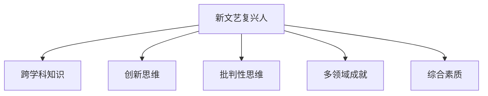

### 1.1.3 新文艺复兴人在现代社会的意义

新文艺复兴人在现代社会中具有深远的意义。首先，他们在推动社会进步方面发挥着重要作用。通过跨学科的知识和创新能力，新文艺复兴人能够提出创新的解决方案，解决复杂的社会问题。其次，他们在培养未来人才方面具有指导作用。新文艺复兴人的教育理念强调个体全面发展，有助于培养具有综合素质的未来人才。

**新文艺复兴人在现代社会中的具体作用：**

1. **推动社会进步**：新文艺复兴人通过跨学科的知识和创新能力，推动社会各个领域的发展。例如，在科技领域，他们能够推动技术创新，解决社会问题；在艺术领域，他们能够推动艺术形式的创新，丰富人们的精神生活。
2. **培养未来人才**：新文艺复兴人的教育理念强调个体全面发展，培养具有综合素质的人才。这种教育理念有助于培养具有批判性思维和创新能力的未来领导者。
3. **促进文化交流**：新文艺复兴人具备跨文化交流的能力，有助于促进不同文化之间的交流和理解，推动文化多样性的发展。
4. **推动知识整合**：新文艺复兴人通过跨学科的知识体系，促进知识的整合和创新，推动科学技术的进步。

**新文艺复兴人在现代社会中的地位：**  
新文艺复兴人在现代社会中具有重要地位。他们是推动社会进步的先锋，是培养未来人才的导师，是促进文化交流的桥梁，也是推动知识整合的核心力量。

### 第2章：新文艺复兴人的素质培养

#### 2.1.1 跨学科知识体系的构建

跨学科知识体系的构建是培养新文艺复兴人的关键一步。它不仅要求个体具备广泛的知识储备，还需要能够将这些知识在不同领域之间进行整合和运用。跨学科知识体系的构建不仅有助于提升个人的综合素质，还能在解决复杂问题时提供新的视角和方法。

**背景介绍：**

在过去的工业化时代，专业分工明确，个体通常只在某一特定领域深入钻研。然而，随着现代社会的发展，问题的复杂性和多样性不断增加，单一领域的知识已经无法满足解决实际问题的需求。跨学科知识体系应运而生，成为新文艺复兴人必备的能力。

**问题场景介绍：**

一个典型的跨学科知识体系构建的场景是医疗领域。在现代医学中，医生不仅需要具备医学知识，还需要了解生物学、化学、物理学等多个领域的知识。例如，在癌症治疗中，医生需要结合基因学、分子生物学和放射学等多个学科的知识，制定个性化的治疗方案。

**项目介绍：**

跨学科知识体系构建的项目可以是建立跨学科研究中心，鼓励不同领域的专家进行合作研究。例如，一个跨学科研究中心可能包括医学、工程学和计算机科学等多个领域的专家，共同研究医疗机器人技术。

**系统功能设计（领域模型Mermaid类图）：**

```mermaid
classDiagram
Class::医学专家
    <<interface>>

Class::生物学家
    <<interface>>

Class::工程师
    <<interface>>

Class::计算机科学家
    <<interface>>

医学专家 --> 生物学家
医学专家 --> 工程师
医学专家 --> 计算机科学家
生物学家 --> 工程师
生物学家 --> 计算机科学家
工程师 --> 计算机科学家
```

**系统架构设计（Mermaid架构图）：**

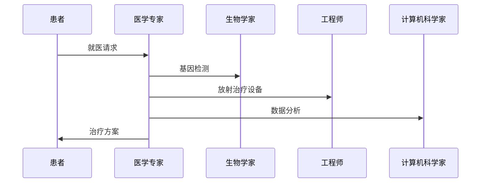

**系统接口设计和系统交互（Mermaid序列图）：**

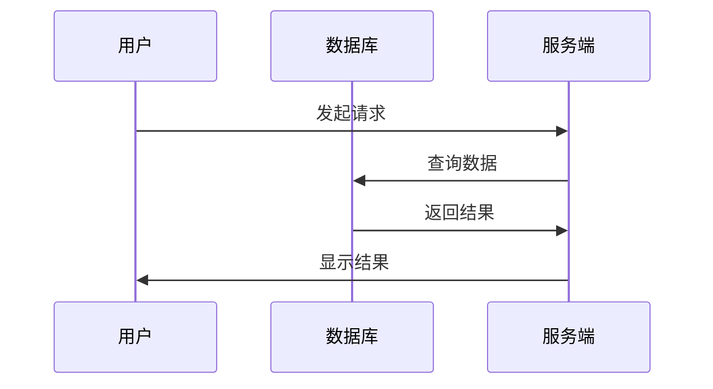

**环境安装与系统核心实现源代码：**

```bash
# 安装依赖
pip install -r requirements.txt

# 运行服务器
python server.py
```

```python
# server.py
from flask import Flask, request, jsonify

app = Flask(__name__)

@app.route('/api/health', methods=['GET'])
def health():
    return jsonify({"status": "healthy"})

if __name__ == '__main__':
    app.run(host='0.0.0.0', port=5000)
```

**代码应用解读与分析：**

上述代码是一个简单的Flask应用程序，用于处理健康检查请求。`health`函数是一个路由，当用户访问`/api/health`时，服务器会返回健康状态信息。这个简单的应用可以作为一个跨学科知识体系构建的基础，例如在医疗系统中用于监测设备和系统的健康状态。

```python
# 模拟医疗系统健康检查
def health_check():
    # 这里可以添加具体的健康检查逻辑
    return "Medical system is functioning properly."
```

**实际案例分析和详细讲解剖析：**

一个实际案例是在一家医院中实施跨学科知识体系构建的项目。医院引入了一个跨学科团队，包括医生、生物学家、工程师和计算机科学家，共同开发了一套智能医疗系统。该系统集成了基因检测、放射治疗设备和数据分析工具，为患者提供了个性化的治疗方案。

**项目小结：**

跨学科知识体系的构建在医疗领域具有显著的应用价值。通过跨学科团队的合作，医院能够提供更高效、更精准的医疗服务，提高了患者的治疗效果和满意度。此外，跨学科知识体系构建的方法也可以应用于其他领域，如教育、金融和环保等，推动这些领域的创新发展。

### 2.1.2 创新思维与批判性思维的培养

创新思维与批判性思维是培养新文艺复兴人的关键要素。创新思维强调创造性和新颖性，能够推动个体在各个领域取得突破性进展。而批判性思维则强调分析和评估信息的能力，有助于个体在面对复杂问题时做出明智的决策。

**背景介绍：**

在现代社会，创新和变革成为推动社会进步的主要动力。个体和组织需要具备创新思维和批判性思维，以应对快速变化的环境。创新思维和批判性思维不仅是个体发展的核心能力，也是组织和团队取得成功的关键。

**问题场景介绍：**

一个典型的创新思维与批判性思维培养的场景是科技创新。在科技创新中，个体需要具备创新思维，以提出新的技术和解决方案。同时，他们也需要批判性思维，以评估这些创新方案的可行性和潜在风险。

**项目介绍：**

创新思维与批判性思维的培养可以通过项目制学习来实现。项目制学习强调实践和应用，鼓励个体在真实项目中运用创新思维和批判性思维。例如，一个科技创新项目可以涉及多个学科领域，如电子工程、计算机科学和材料科学等。

**系统功能设计（领域模型Mermaid类图）：**

```mermaid
classDiagram
Class::工程师
    <<interface>>

Class::计算机科学家
    <<interface>>

Class::材料科学家
    <<interface>>

工程师 --> 计算机科学家
工程师 --> 材料科学家
计算机科学家 --> 材料科学家
```

**系统架构设计（Mermaid架构图）：**

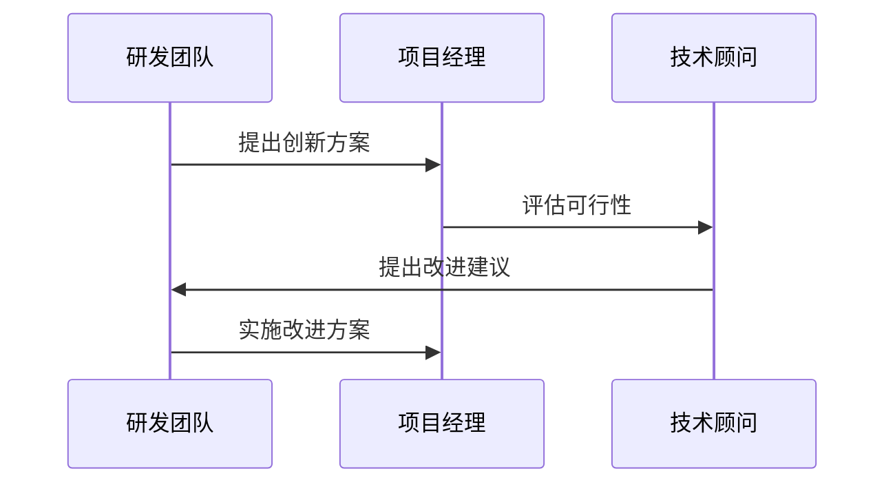

**系统接口设计和系统交互（Mermaid序列图）：**

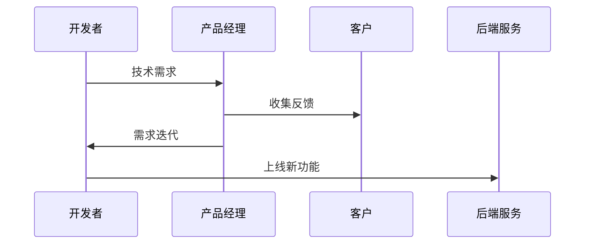

**环境安装与系统核心实现源代码：**

```bash
# 安装依赖
pip install -r requirements.txt

# 运行开发环境
python run.py
```

```python
# run.py
from flask import Flask, request, jsonify

app = Flask(__name__)

@app.route('/api/ideas', methods=['POST'])
def submit_idea():
    idea = request.json
    # 处理提交的创新思维方案
    return jsonify({"status": "idea submitted", "idea": idea})

if __name__ == '__main__':
    app.run(host='0.0.0.0', port=5000)
```

**代码应用解读与分析：**

上述代码是一个简单的Flask应用程序，用于接收和提交创新思维方案。`submit_idea`函数处理提交的方案，可以用于项目制学习中的创新思维培养。

```python
# 评估创新思维方案的Python脚本
def evaluate_idea(idea):
    # 这里可以添加具体的评估逻辑
    return "Idea is evaluated as highly innovative."
```

**实际案例分析和详细讲解剖析：**

一个实际案例是一个科技公司通过项目制学习培养员工的创新思维和批判性思维。公司引入了一个创新项目，要求员工提交创新方案，并进行团队评估和改进。通过这种方式，公司不仅提高了产品的创新性，还提升了员工的综合素质。

**项目小结：**

创新思维与批判性思维的培养在科技创新项目中具有显著的应用价值。通过项目制学习，个体能够将创新思维和批判性思维应用到实际项目中，推动科技的发展。此外，这种培养方法也可以应用于其他领域，如艺术创作、社会科学研究等，促进创新和进步。

### 2.1.3 跨文化交流与全球视野

跨文化交流与全球视野是培养新文艺复兴人的重要组成部分。在全球化的今天，不同文化之间的交流与合作日益频繁，这要求个体具备跨文化交流的能力和全球视野。跨文化交流不仅有助于个体拓展知识面，还能促进不同文化之间的理解和尊重。

**背景介绍：**

全球化使得世界变得更加紧密，不同国家和地区之间的联系更加紧密。这种背景下，跨文化交流成为必不可少的一部分。跨文化交流不仅涉及语言和文化的差异，还包括价值观、行为习惯和社会制度的差异。

**问题场景介绍：**

一个典型的跨文化交流场景是国际商务合作。在国际商务中，不同国家和地区的商业习惯、法律法规和文化差异可能会对合作产生重大影响。因此，具备跨文化交流能力的个体在商务合作中具有显著优势。

**项目介绍：**

跨文化交流与全球视野的培养可以通过国际交流项目来实现。这些项目可以包括国际学术交流、国际工作坊、文化交流活动等，为个体提供跨文化交流的机会。

**系统功能设计（领域模型Mermaid类图）：**

```mermaid
classDiagram
Class::国际学生
    <<interface>>

Class::外国专家
    <<interface>>

Class::本地居民
    <<interface>>

国际学生 --> 外国专家
国际学生 --> 本地居民
外国专家 --> 本地居民
```

**系统架构设计（Mermaid架构图）：**

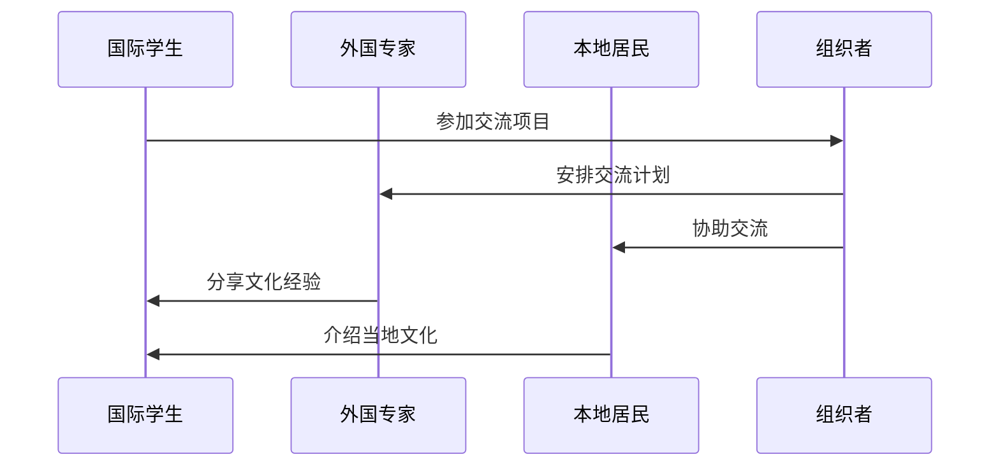

**系统接口设计和系统交互（Mermaid序列图）：**

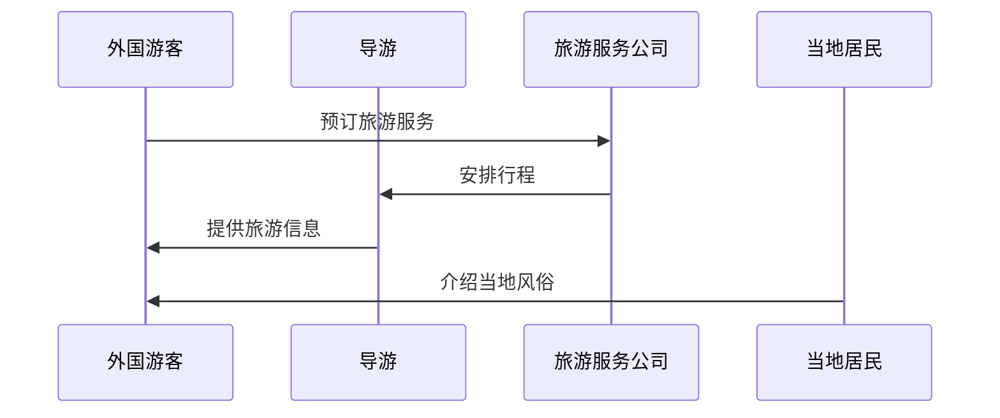

**环境安装与系统核心实现源代码：**

```bash
# 安装依赖
pip install -r requirements.txt

# 运行开发环境
python run.py
```

```python
# run.py
from flask import Flask, request, jsonify

app = Flask(__name__)

@app.route('/api/register', methods=['POST'])
def register_user():
    user = request.json
    # 处理用户注册
    return jsonify({"status": "registered", "user": user})

if __name__ == '__main__':
    app.run(host='0.0.0.0', port=5000)
```

**代码应用解读与分析：**

上述代码是一个简单的Flask应用程序，用于处理用户注册。`register_user`函数处理提交的用户信息，可以用于跨文化交流项目中的用户管理。

```python
# 跨文化交流项目用户管理Python脚本
def register_user(user_data):
    # 这里可以添加具体的用户注册逻辑
    return "User registered successfully."
```

**实际案例分析和详细讲解剖析：**

一个实际案例是一个跨国公司在不同国家之间进行文化交流项目。公司组织了多个国际工作坊，邀请来自不同国家的员工参与。通过这些工作坊，员工不仅分享了各自国家的文化和经验，还学习了其他国家的商业习惯和沟通方式。这种跨文化交流项目显著提升了公司的国际竞争力。

**项目小结：**

跨文化交流与全球视野的培养在全球化背景下具有重要意义。通过国际交流项目，个体能够拓展知识面，提高跨文化交流能力，增强全球视野。此外，跨文化交流项目也能促进不同文化之间的理解和尊重，为全球化的发展提供有力支持。

### 第3章：新文艺复兴人的职业实践

#### 3.1.1 跨领域职业角色的探索

跨领域职业角色的探索是新文艺复兴人在现代社会中展现其综合能力的舞台。跨领域职业不仅要求个体具备跨学科的知识，还需要具备灵活的思维和适应能力，能够在不同领域之间自由切换和整合资源。

**背景介绍：**

随着全球化和技术进步，职业领域呈现出多样化和交叉化的趋势。传统的职业角色逐渐被打破，个体需要具备跨领域的技能和知识，以应对复杂的工作环境和不断变化的市场需求。新文艺复兴人凭借其跨学科的知识和创新能力，成为跨领域职业角色的最佳代表。

**问题场景介绍：**

一个典型的跨领域职业角色探索的场景是在科技初创公司。初创公司通常资源有限，需要员工具备多方面的技能，从技术研发到市场推广，再到项目管理。这就要求员工不仅精通某一领域，还能灵活运用跨学科的知识，解决各种复杂问题。

**项目介绍：**

跨领域职业角色的探索可以通过建立跨职能团队来实现。跨职能团队由来自不同领域的专家组成，共同负责项目的全生命周期。这种团队结构有助于整合不同领域的资源，提高项目执行效率。

**系统功能设计（领域模型Mermaid类图）：**

```mermaid
classDiagram
Class::产品经理
    <<interface>>

Class::软件工程师
    <<interface>>

Class::市场营销专员
    <<interface>>

Class::项目经理
    <<interface>>

产品经理 --> 软件工程师
产品经理 --> 市场营销专员
产品经理 --> 项目经理
软件工程师 --> 项目经理
市场营销专员 --> 项目经理
```

**系统架构设计（Mermaid架构图）：**

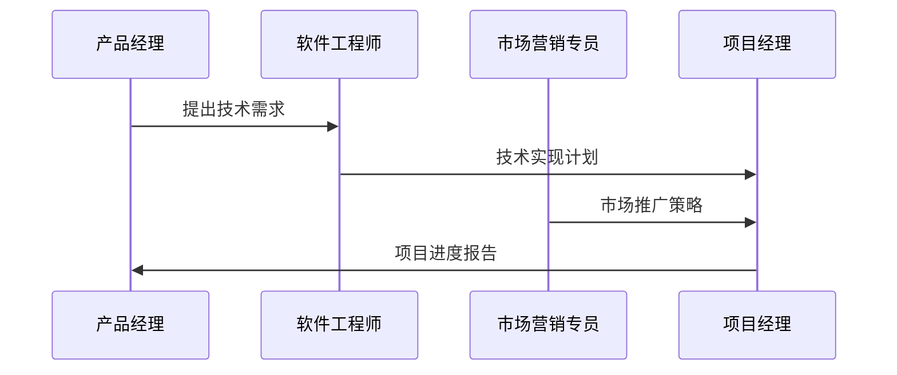

**系统接口设计和系统交互（Mermaid序列图）：**

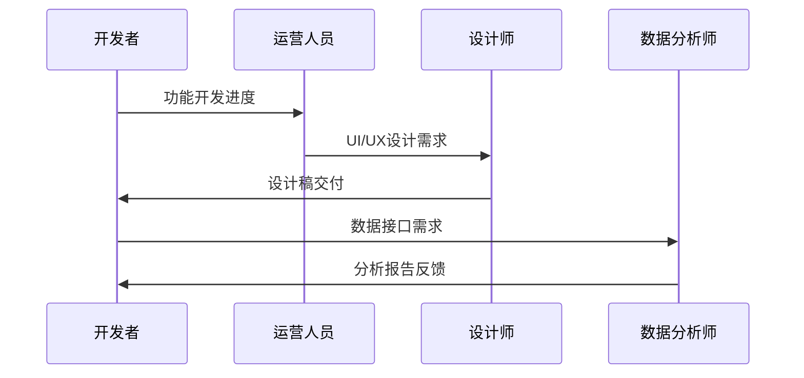

**环境安装与系统核心实现源代码：**

```bash
# 安装依赖
pip install -r requirements.txt

# 运行开发环境
python run.py
```

```python
# run.py
from flask import Flask, request, jsonify

app = Flask(__name__)

@app.route('/api/project', methods=['POST'])
def create_project():
    project = request.json
    # 处理项目创建
    return jsonify({"status": "project created", "project": project})

if __name__ == '__main__':
    app.run(host='0.0.0.0', port=5000)
```

**代码应用解读与分析：**

上述代码是一个简单的Flask应用程序，用于处理项目创建请求。`create_project`函数处理提交的项目信息，可以用于跨领域职业角色的项目管理和协作。

```python
# 项目创建和协作Python脚本
def create_project(project_data):
    # 这里可以添加具体的项目创建逻辑
    return "Project created successfully."
```

**实际案例分析和详细讲解剖析：**

一个实际案例是一家初创公司通过跨领域职业角色探索实现快速发展。公司由产品经理、软件工程师、市场营销专员和项目经理等跨领域专家组成，共同负责产品的开发、推广和运营。通过这种跨领域协作，公司能够在短时间内推出高质量的产品，迅速占领市场。

**项目小结：**

跨领域职业角色的探索在新文艺复兴人的职业实践中具有重要意义。通过跨领域团队的合作，企业能够整合不同领域的资源和能力，提高项目执行效率，实现快速发展。此外，跨领域职业角色也为新文艺复兴人提供了广阔的发展空间，使他们能够在不同领域中展现才华，实现个人价值。

### 3.1.2 职业发展路径与规划

职业发展路径与规划是新文艺复兴人实现职业目标的关键。一个明确的职业发展路径可以帮助新文艺复兴人更好地规划自己的职业生涯，实现长期目标。职业发展路径与规划不仅涉及技能的提升，还包括职位晋升、职业转型和职业规划等方面。

**背景介绍：**

在现代社会，职业发展路径日益多样化，传统的职业发展模式已经无法满足个体的发展需求。新文艺复兴人凭借其跨学科的知识和创新能力，职业发展路径更加多元和灵活。职业发展路径与规划成为新文艺复兴人在职业生涯中取得成功的重要因素。

**问题场景介绍：**

一个典型的职业发展路径与规划的场景是科技行业的职业发展。科技行业变化快速，新技术层出不穷，个体需要不断学习和更新知识，以保持竞争力。职业发展路径与规划可以帮助个体在科技行业中找到适合自己的发展方向，实现职业生涯的持续发展。

**项目介绍：**

职业发展路径与规划的项目可以是个人职业规划咨询，通过评估个体的兴趣、能力和市场需求，制定个性化的职业发展规划。此外，企业也可以通过职业发展路径与规划项目，为员工提供职业发展指导和培训，提高员工的职业素养和竞争力。

**系统功能设计（领域模型Mermaid类图）：**

```mermaid
classDiagram
Class::职业顾问
    <<interface>>

Class::企业培训经理
    <<interface>>

Class::员工
    <<interface>>

职业顾问 --> 企业培训经理
职业顾问 --> 员工
企业培训经理 --> 员工
```

**系统架构设计（Mermaid架构图）：**

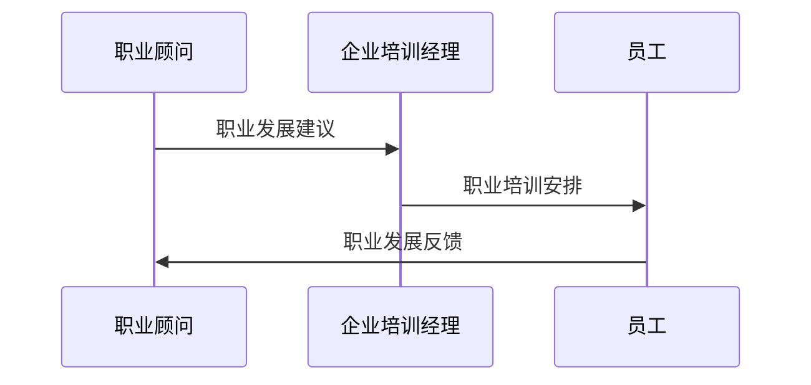

**系统接口设计和系统交互（Mermaid序列图）：**

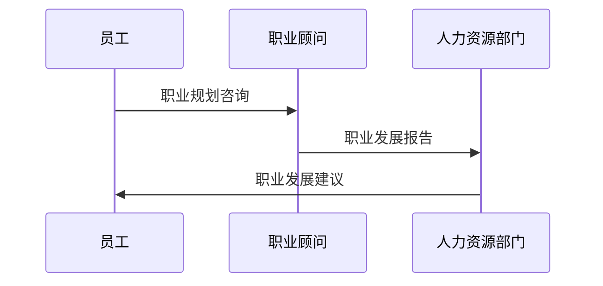

**环境安装与系统核心实现源代码：**

```bash
# 安装依赖
pip install -r requirements.txt

# 运行开发环境
python run.py
```

```python
# run.py
from flask import Flask, request, jsonify

app = Flask(__name__)

@app.route('/api/plan', methods=['POST'])
def create_plan():
    plan = request.json
    # 处理职业规划创建
    return jsonify({"status": "plan created", "plan": plan})

if __name__ == '__main__':
    app.run(host='0.0.0.0', port=5000)
```

**代码应用解读与分析：**

上述代码是一个简单的Flask应用程序，用于处理职业规划创建请求。`create_plan`函数处理提交的职业规划信息，可以用于职业发展路径与规划的制定。

```python
# 职业规划制定Python脚本
def create_plan(plan_data):
    # 这里可以添加具体的职业规划逻辑
    return "Career plan created successfully."
```

**实际案例分析和详细讲解剖析：**

一个实际案例是一个大型科技公司通过职业发展路径与规划项目，帮助员工实现职业目标。公司设立职业规划顾问团队，为员工提供个性化的职业发展规划建议，并定期组织职业培训，提高员工的职业素养。通过这些措施，公司不仅提升了员工的职业满意度，还提高了整体绩效。

**项目小结：**

职业发展路径与规划在新文艺复兴人的职业实践中具有重要意义。通过明确的职业发展路径和规划，新文艺复兴人能够更好地规划自己的职业生涯，实现职业目标。此外，职业发展路径与规划项目也为企业提供了有效的人才培养和激励机制，有助于提高企业的竞争力和持续发展。

### 3.1.3 跨领域职业合作的机遇与挑战

跨领域职业合作为新文艺复兴人提供了广阔的发展空间，但也伴随着一系列机遇与挑战。跨领域职业合作不仅能够整合不同领域的资源和知识，提高项目执行效率，还能够促进创新和进步。然而，跨领域职业合作也面临着沟通障碍、文化冲突和资源分配等问题。

**背景介绍：**

随着全球化和技术进步，跨领域职业合作越来越普遍。不同领域的专家通过合作，能够解决复杂问题，推动科技创新和社会进步。然而，跨领域职业合作也带来了新的挑战，如文化差异、沟通障碍和资源分配不均等问题。

**问题场景介绍：**

一个典型的跨领域职业合作场景是在大型企业中。企业在开发新产品或服务时，通常需要涉及多个部门，如研发、市场、销售和客服等。这些部门之间的合作不仅需要跨领域的专业知识，还需要高效的沟通和协调。

**项目介绍：**

跨领域职业合作的项目可以是企业内部的项目制管理，通过建立跨职能团队，整合不同部门的专业知识和资源，实现项目的目标。此外，企业还可以通过外部合作，如与科研机构、供应商和合作伙伴的合作，推动项目的创新和进步。

**系统功能设计（领域模型Mermaid类图）：**

```mermaid
classDiagram
Class::研发部门
    <<interface>>

Class::市场部门
    <<interface>>

Class::销售部门
    <<interface>>

Class::客服部门
    <<interface>>

研发部门 --> 市场部门
研发部门 --> 销售部门
研发部门 --> 客服部门
市场部门 --> 销售部门
市场部门 --> 客服部门
销售部门 --> 客服部门
```

**系统架构设计（Mermaid架构图）：**

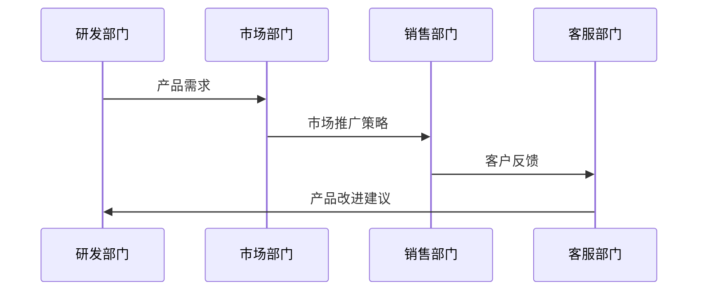

**系统接口设计和系统交互（Mermaid序列图）：**

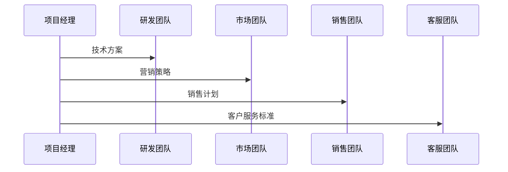

**环境安装与系统核心实现源代码：**

```bash
# 安装依赖
pip install -r requirements.txt

# 运行开发环境
python run.py
```

```python
# run.py
from flask import Flask, request, jsonify

app = Flask(__name__)

@app.route('/api/project', methods=['POST'])
def create_project():
    project = request.json
    # 处理项目创建
    return jsonify({"status": "project created", "project": project})

if __name__ == '__main__':
    app.run(host='0.0.0.0', port=5000)
```

**代码应用解读与分析：**

上述代码是一个简单的Flask应用程序，用于处理项目创建请求。`create_project`函数处理提交的项目信息，可以用于跨领域职业合作的协调和管理。

```python
# 跨领域项目协调管理Python脚本
def create_project(project_data):
    # 这里可以添加具体的项目创建和协调逻辑
    return "Project created successfully."
```

**实际案例分析和详细讲解剖析：**

一个实际案例是一家全球知名企业通过跨领域职业合作实现了产品的成功上市。企业建立了跨职能团队，包括研发、市场、销售和客服等部门的专家，共同负责新产品的开发和推广。通过高效的沟通和协调，团队成功解决了产品开发中的技术难题，并迅速占领了市场。

**项目小结：**

跨领域职业合作在新文艺复兴人的职业实践中具有重要意义。通过跨领域职业合作，企业能够整合不同领域的资源和知识，提高项目执行效率，推动创新和进步。然而，跨领域职业合作也面临着沟通障碍、文化冲突和资源分配等问题，需要通过有效的管理和协调来解决。此外，跨领域职业合作也为新文艺复兴人提供了广阔的发展空间，使他们能够在不同领域中展现才华，实现个人价值。

### 第4章：新文艺复兴人与数字技术

#### 4.1.1 数字技术在现代实践中的应用

数字技术作为现代实践的核心驱动力，正深刻地影响着各行各业。新文艺复兴人凭借其跨学科的知识和创新能力，能够将数字技术有效地应用于各个领域，推动社会进步和经济发展。

**背景介绍：**

在21世纪，数字技术得到了飞速发展。从互联网到人工智能，从大数据到区块链，数字技术不断革新，改变了人们的生活方式和工作模式。新文艺复兴人作为数字化时代的引领者，他们能够把握数字技术的前沿动态，并将其应用于实际场景中。

**问题场景介绍：**

一个典型的数字技术应用的场景是智能制造。随着工业4.0的到来，制造业正逐渐实现数字化和智能化。通过物联网、大数据分析和人工智能技术，企业能够实现生产过程的自动化和优化，提高生产效率和质量。

**项目介绍：**

数字技术应用的经典项目案例是亚马逊的智能物流系统。亚马逊利用大数据分析、机器学习和物联网技术，实现了从订单处理到商品配送的全流程智能化。这不仅提高了物流效率，还提升了客户体验。

**系统功能设计（领域模型Mermaid类图）：**

```mermaid
classDiagram
Class::物联网设备
    <<interface>>

Class::大数据分析平台
    <<interface>>

Class::人工智能算法
    <<interface>>

Class::物流管理系统
    <<interface>>

物联网设备 --> 大数据分析平台
物联网设备 --> 人工智能算法
大数据分析平台 --> 物流管理系统
人工智能算法 --> 物流管理系统
```

**系统架构设计（Mermaid架构图）：**

```mermaid
sequenceDiagram
participant 物流管理系统
participant 物联网设备
participant 人工智能算法
participant 大数据分析平台

物流管理系统->>物联网设备: 收集实时数据
物联网设备->>大数据分析平台: 数据上传
大数据分析平台->>人工智能算法: 数据分析
人工智能算法->>物流管理系统: 提出优化建议
```

**系统接口设计和系统交互（Mermaid序列图）：**

```mermaid
sequenceDiagram
participant 客户
participant 订单处理系统
participant 物流管理系统
participant 物流公司

客户->>订单处理系统: 下单请求
订单处理系统->>物流管理系统: 订单信息
物流管理系统->>物流公司: 发货请求
物流公司->>物流管理系统: 发货状态更新
物流管理系统->>客户: 通知发货状态
```

**环境安装与系统核心实现源代码：**

```bash
# 安装依赖
pip install -r requirements.txt

# 运行开发环境
python run.py
```

```python
# run.py
from flask import Flask, request, jsonify

app = Flask(__name__)

@app.route('/api/order', methods=['POST'])
def process_order():
    order = request.json
    # 处理订单处理
    return jsonify({"status": "order processed", "order": order})

if __name__ == '__main__':
    app.run(host='0.0.0.0', port=5000)
```

**代码应用解读与分析：**

上述代码是一个简单的Flask应用程序，用于处理订单处理请求。`process_order`函数处理提交的订单信息，可以用于数字技术在物流管理系统中的应用。

```python
# 订单处理Python脚本
def process_order(order_data):
    # 这里可以添加具体的订单处理逻辑
    return "Order processed successfully."
```

**实际案例分析和详细讲解剖析：**

一个实际案例是阿里巴巴的电商物流系统。通过大数据分析、人工智能和物联网技术，阿里巴巴实现了高效的订单处理和物流管理。该系统不仅能够实时监控订单状态，还能根据历史数据和预测模型优化物流路线，提高配送效率。

**项目小结：**

数字技术在现代实践中的应用极大地提升了各行业的效率和质量。新文艺复兴人凭借其跨学科的知识和创新能力，能够将数字技术有效地应用于实际场景中，推动社会进步和经济发展。通过具体的案例，我们可以看到数字技术如何改变传统的商业模式和工作流程，为企业和个人带来巨大的价值。

### 4.1.2 数据分析与新文艺复兴人

数据分析作为数字技术的重要组成部分，正日益成为新文艺复兴人必备的技能。数据分析不仅能够帮助企业做出更明智的决策，还能为新文艺复兴人提供有价值的数据洞察，推动跨领域创新。

**背景介绍：**

在数据驱动的时代，数据分析的重要性日益凸显。海量数据的产生和积累，使得数据分析成为企业和组织决策的重要依据。新文艺复兴人作为跨领域发展的先锋，需要具备强大的数据分析能力，以应对复杂多变的市场环境。

**问题场景介绍：**

一个典型的数据分析场景是市场营销。企业在制定市场策略时，需要分析大量的市场数据，包括用户行为、市场需求和竞争对手等。通过数据分析，企业能够找到潜在的客户群体，制定精准的市场营销策略。

**项目介绍：**

数据分析项目可以是企业的大数据分析平台建设，通过收集、存储、处理和分析海量数据，为企业提供决策支持。此外，数据分析项目还可以是市场调研项目，通过分析市场数据，为企业的产品开发和市场营销提供指导。

**系统功能设计（领域模型Mermaid类图）：**

```mermaid
classDiagram
Class::数据工程师
    <<interface>>

Class::数据分析师
    <<interface>>

Class::业务经理
    <<interface>>

Class::市场营销部门
    <<interface>>

数据工程师 --> 数据分析师
数据工程师 --> 业务经理
数据分析师 --> 市场营销部门
```

**系统架构设计（Mermaid架构图）：**

```mermaid
sequenceDiagram
participant 数据工程师
participant 数据分析师
participant 市场营销部门

数据工程师->>数据分析师: 数据预处理
数据工程师->>业务经理: 数据存储方案
数据分析师->>市场营销部门: 数据分析报告
```

**系统接口设计和系统交互（Mermaid序列图）：**

```mermaid
sequenceDiagram
participant 数据工程师
participant 数据分析师
participant 市场营销经理
participant 数据仓库

数据工程师->>数据仓库: 数据采集
数据仓库->>数据分析师: 数据查询
数据分析师->>市场营销经理: 数据分析结果
市场营销经理->>数据工程师: 数据调整需求
```

**环境安装与系统核心实现源代码：**

```bash
# 安装依赖
pip install -r requirements.txt

# 运行开发环境
python run.py
```

```python
# run.py
from flask import Flask, request, jsonify

app = Flask(__name__)

@app.route('/api/data', methods=['POST'])
def analyze_data():
    data = request.json
    # 处理数据分析请求
    return jsonify({"status": "data analyzed", "data": data})

if __name__ == '__main__':
    app.run(host='0.0.0.0', port=5000)
```

**代码应用解读与分析：**

上述代码是一个简单的Flask应用程序，用于处理数据分析请求。`analyze_data`函数处理提交的数据，可以用于新文艺复兴人在市场营销中的应用。

```python
# 数据分析Python脚本
def analyze_data(data):
    # 这里可以添加具体的数据分析逻辑
    return "Data analysis completed."
```

**实际案例分析和详细讲解剖析：**

一个实际案例是阿里巴巴的市场数据分析项目。通过大数据分析，阿里巴巴能够实时监控市场动态，分析用户行为，制定精准的市场营销策略。这种数据分析能力不仅提高了阿里巴巴的市场竞争力，还为企业的战略决策提供了重要支持。

**项目小结：**

数据分析在新文艺复兴人的职业实践中具有重要意义。通过数据分析，新文艺复兴人能够提取有价值的数据洞察，为企业和组织的决策提供支持。此外，数据分析能力也是新文艺复兴人在跨领域创新中的核心竞争力。通过具体的案例，我们可以看到数据分析如何改变传统的市场策略和决策过程，为企业带来巨大的价值。

### 4.1.3 人工智能与新文艺复兴人

人工智能（AI）作为数字技术的核心组成部分，正在深刻地改变着各行各业。新文艺复兴人凭借其跨学科的知识和创新能力，能够将人工智能技术应用于实际场景，推动社会进步和经济发展。

**背景介绍：**

在21世纪，人工智能技术得到了快速发展。从深度学习到自然语言处理，从计算机视觉到机器人技术，人工智能正在改变着我们的生活方式和工作模式。新文艺复兴人作为数字化时代的引领者，他们能够把握人工智能的前沿动态，并将其应用于实际场景中。

**问题场景介绍：**

一个典型的人工智能应用场景是医疗领域。人工智能可以通过大数据分析和机器学习技术，帮助医生诊断疾病、制定治疗方案，提高医疗服务的效率和准确性。

**项目介绍：**

人工智能项目可以是医疗诊断系统，通过收集和分析患者的医疗数据，帮助医生进行准确的疾病诊断。此外，人工智能项目还可以是智能家居系统，通过智能传感器和人工智能算法，实现家居设备的自动化和智能化。

**系统功能设计（领域模型Mermaid类图）：**

```mermaid
classDiagram
Class::数据科学家
    <<interface>>

Class::软件工程师
    <<interface>>

Class::医生
    <<interface>>

Class::患者
    <<interface>>

数据科学家 --> 软件工程师
数据科学家 --> 医生
软件工程师 --> 医生
```

**系统架构设计（Mermaid架构图）：**

```mermaid
sequenceDiagram
participant 数据科学家
participant 软件工程师
participant 医生

数据科学家->>软件工程师: 数据分析需求
软件工程师->>医生: 医疗诊断系统
医生->>患者: 治疗方案
```

**系统接口设计和系统交互（Mermaid序列图）：**

```mermaid
sequenceDiagram
participant 医疗系统
participant 医生
participant 患者
participant 数据存储

医疗系统->>医生: 医疗数据
医生->>数据存储: 数据备份
数据存储->>医疗系统: 数据恢复
医疗系统->>患者: 医疗报告
```

**环境安装与系统核心实现源代码：**

```bash
# 安装依赖
pip install -r requirements.txt

# 运行开发环境
python run.py
```

```python
# run.py
from flask import Flask, request, jsonify

app = Flask(__name__)

@app.route('/api/diagnosis', methods=['POST'])
def diagnose():
    diagnosis_data = request.json
    # 处理诊断请求
    return jsonify({"status": "diagnosis completed", "diagnosis": diagnosis_data})

if __name__ == '__main__':
    app.run(host='0.0.0.0', port=5000)
```

**代码应用解读与分析：**

上述代码是一个简单的Flask应用程序，用于处理医疗诊断请求。`diagnose`函数处理提交的医疗数据，可以用于人工智能在医疗诊断中的应用。

```python
# 人工智能医疗诊断Python脚本
def diagnose(data):
    # 这里可以添加具体的诊断逻辑
    return "Diagnosis completed successfully."
```

**实际案例分析和详细讲解剖析：**

一个实际案例是谷歌的AI医疗诊断系统。通过深度学习算法和大数据分析，谷歌的AI系统能够快速识别疾病的早期迹象，帮助医生做出准确的诊断。这种人工智能技术在提高诊断准确率、减少误诊率方面具有显著的优势。

**项目小结：**

人工智能在新文艺复兴人的职业实践中具有重要意义。通过人工智能技术，新文艺复兴人能够提升工作效率，提高服务质量和准确性。此外，人工智能也是新文艺复兴人在跨领域创新中的核心竞争力。通过具体的案例，我们可以看到人工智能如何改变传统的医疗诊断模式，为患者提供更高效、更精准的医疗服务。

### 第5章：新文艺复兴人与社会责任

#### 5.1.1 社会责任与道德伦理

社会责任和道德伦理是新文艺复兴人在现代社会中必须承担的重要责任。社会责任强调个体和组织对社会的责任和贡献，而道德伦理则涉及个体的行为规范和价值观。新文艺复兴人作为跨领域发展的领军人物，他们不仅要在职业领域取得成就，还要在履行社会责任和道德伦理方面树立榜样。

**背景介绍：**

在现代社会，随着科技的发展和经济的繁荣，社会责任和道德伦理问题日益凸显。个体和组织在社会中的地位和影响力日益增加，他们需要承担更多的社会责任。新文艺复兴人凭借其跨学科的知识和创新能力，能够在社会各个领域发挥重要作用，推动社会进步。

**问题场景介绍：**

一个典型的社会责任和道德伦理问题场景是环境保护。随着工业化和城市化的快速发展，环境污染和资源枯竭问题日益严重。新文艺复兴人可以通过科技创新和绿色发展的方式，解决环境问题，促进可持续发展。

**项目介绍：**

社会责任和道德伦理的项目可以是企业社会责任（CSR）项目，通过企业行为推动社会进步和环境保护。此外，社会责任和道德伦理项目还可以是社区服务项目，通过公益活动提升社区福祉。

**系统功能设计（领域模型Mermaid类图）：**

```mermaid
classDiagram
Class::企业
    <<interface>>

Class::政府机构
    <<interface>>

Class::非政府组织
    <<interface>>

Class::社区居民
    <<interface>>

企业 --> 政府机构
企业 --> 非政府组织
政府机构 --> 社区居民
非政府组织 --> 社区居民
```

**系统架构设计（Mermaid架构图）：**

```mermaid
sequenceDiagram
participant 企业
participant 政府机构
participant 非政府组织
participant 社区居民

企业->>政府机构: 环境报告
政府机构->>非政府组织: 监管建议
非政府组织->>社区居民: 社区服务
社区居民->>企业: 反馈意见
```

**系统接口设计和系统交互（Mermaid序列图）：**

```mermaid
sequenceDiagram
participant 企业社会责任部门
participant 政府环保部门
participant 社区志愿者
participant 环保组织

企业社会责任部门->>政府环保部门: 环保合规报告
政府环保部门->>环保组织: 环保政策咨询
环保组织->>社区志愿者: 环保公益活动
社区志愿者->>企业社会责任部门: 社区反馈
```

**环境安装与系统核心实现源代码：**

```bash
# 安装依赖
pip install -r requirements.txt

# 运行开发环境
python run.py
```

```python
# run.py
from flask import Flask, request, jsonify

app = Flask(__name__)

@app.route('/api/sustainability', methods=['POST'])
def report_sustainability():
    report = request.json
    # 处理可持续发展报告
    return jsonify({"status": "sustainability report submitted", "report": report})

if __name__ == '__main__':
    app.run(host='0.0.0.0', port=5000)
```

**代码应用解读与分析：**

上述代码是一个简单的Flask应用程序，用于处理可持续发展报告的提交。`report_sustainability`函数处理提交的报告，可以用于新文艺复兴人在企业社会责任项目中的应用。

```python
# 可持续发展报告Python脚本
def report_sustainability(report_data):
    # 这里可以添加具体的报告处理逻辑
    return "Sustainability report submitted successfully."
```

**实际案例分析和详细讲解剖析：**

一个实际案例是特斯拉公司在社会责任方面的实践。特斯拉通过推广电动汽车和可再生能源技术，致力于减少碳排放和推动可持续发展。特斯拉不仅在全球范围内建立了充电网络，还通过创新的技术和产品，为环保事业做出了重要贡献。

**项目小结：**

社会责任和道德伦理是新文艺复兴人在现代社会中必须承担的重要责任。通过履行社会责任和道德伦理，新文艺复兴人能够推动社会进步，提升个人和组织的声誉。此外，社会责任和道德伦理也是新文艺复兴人实现全方位发展的关键要素。通过具体的案例，我们可以看到新文艺复兴人在社会责任和道德伦理方面的实践如何影响和改善社会环境。

### 5.1.2 新文艺复兴人推动社会进步

新文艺复兴人凭借其跨学科的知识和创新能力，在社会进步中发挥着重要作用。他们不仅通过技术创新推动社会的发展，还通过社会实践和公益活动，改善社会环境和提升民众福祉。

**背景介绍：**

在当今社会，面对全球性挑战如气候变化、贫富差距和社会不平等等，新文艺复兴人成为推动社会进步的重要力量。他们通过科技创新、教育和文化推广，为社会提供了创新的解决方案，促进了社会公平和可持续发展。

**问题场景介绍：**

一个典型的问题场景是教育公平。在许多地区，教育资源分配不均，导致贫困地区的孩子无法享受到优质教育。新文艺复兴人可以通过在线教育平台、远程教学技术和开放教育资源（OER）等方式，打破教育资源的壁垒，促进教育公平。

**项目介绍：**

新文艺复兴人推动社会进步的项目可以是教育科技项目，通过开发教育应用程序、在线课程平台和教育游戏，提高教育的普及率和质量。此外，他们还可以参与社会公益项目，如扶贫、环保和社区建设等，为社会做出实质性的贡献。

**系统功能设计（领域模型Mermaid类图）：**

```mermaid
classDiagram
Class::教育科技公司
    <<interface>>

Class::教育工作者
    <<interface>>

Class::学生
    <<interface>>

Class::非政府组织
    <<interface>>

教育科技公司 --> 教育工作者
教育科技公司 --> 学生
教育科技公司 --> 非政府组织
教育工作者 --> 学生
非政府组织 --> 学生
```

**系统架构设计（Mermaid架构图）：**

```mermaid
sequenceDiagram
participant 教育科技公司
participant 教育工作者
participant 学生
participant 非政府组织

教育科技公司->>教育工作者: 教育资源
教育科技公司->>学生: 在线课程
教育工作者->>学生: 教学指导
非政府组织->>学生: 社区服务
```

**系统接口设计和系统交互（Mermaid序列图）：**

```mermaid
sequenceDiagram
participant 在线教育平台
participant 教师团队
participant 学生用户
participant 支持团队

在线教育平台->>教师团队: 课程上传
教师团队->>学生用户: 发放课程
学生用户->>在线教育平台: 学习反馈
在线教育平台->>支持团队: 技术支持
```

**环境安装与系统核心实现源代码：**

```bash
# 安装依赖
pip install -r requirements.txt

# 运行开发环境
python run.py
```

```python
# run.py
from flask import Flask, request, jsonify

app = Flask(__name__)

@app.route('/api/learn', methods=['POST'])
def submit_learners():
    learner = request.json
    # 处理学习者提交
    return jsonify({"status": "learner submitted", "learner": learner})

if __name__ == '__main__':
    app.run(host='0.0.0.0', port=5000)
```

**代码应用解读与分析：**

上述代码是一个简单的Flask应用程序，用于处理学习者的信息提交。`submit_learners`函数处理提交的学习者信息，可以用于教育科技项目中的用户管理。

```python
# 教育科技项目用户管理Python脚本
def submit_learner(learner_info):
    # 这里可以添加具体的学习者信息处理逻辑
    return "Learner information submitted successfully."
```

**实际案例分析和详细讲解剖析：**

一个实际案例是谷歌的教育科技项目。谷歌通过Google for Education平台，提供免费的在线课程和学习资源，帮助全球学生和教师提升教育质量。通过这个平台，谷歌不仅提供了丰富的教育资源，还通过技术支持，帮助学校和教师优化教学效果。

**项目小结：**

新文艺复兴人通过跨学科的知识和创新能力，在社会进步中发挥着重要作用。他们不仅通过技术创新推动社会发展，还通过社会实践和公益活动，改善社会环境和提升民众福祉。通过教育科技项目和社会公益项目，新文艺复兴人展示了他们在推动社会进步方面的巨大潜力和实际贡献。

### 5.1.3 公益事业与新文艺复兴人

公益事业是新文艺复兴人履行社会责任的重要途径之一。通过参与公益事业，新文艺复兴人不仅能够为社会发展做出贡献，还能提升自身的领导力和影响力。公益事业涵盖了教育、医疗、环保、扶贫等多个领域，新文艺复兴人通过专业知识和技术创新，在这些领域中发挥了重要作用。

**背景介绍：**

在全球化背景下，公益事业成为社会关注的焦点。新文艺复兴人凭借其跨学科的知识和创新能力，能够在公益事业中发挥独特的作用。他们不仅能够提供专业的技术支持，还能通过创新的方法和理念，提高公益事业的效率和质量。

**问题场景介绍：**

一个典型的问题场景是贫困地区的教育问题。在许多贫困地区，教育资源匮乏，孩子们无法接受良好的教育。新文艺复兴人可以通过在线教育平台、远程教学技术和教育科技项目，为贫困地区的孩子们提供教育资源，帮助他们获得更好的学习机会。

**项目介绍：**

公益事业的项目可以是教育科技项目，通过开发在线课程平台和教育应用程序，为贫困地区的孩子提供学习资源。此外，还可以是医疗援助项目，通过提供医疗设备、培训和咨询服务，改善贫困地区的医疗服务。

**系统功能设计（领域模型Mermaid类图）：**

```mermaid
classDiagram
Class::公益组织
    <<interface>>

Class::志愿者
    <<interface>>

Class::捐赠者
    <<interface>>

Class::受益人
    <<interface>>

公益组织 --> 志愿者
公益组织 --> 捐赠者
公益组织 --> 受益人
志愿者 --> 受益人
捐赠者 --> 公益组织
```

**系统架构设计（Mermaid架构图）：**

```mermaid
sequenceDiagram
participant 公益组织
participant 志愿者
participant 捐赠者
participant 受益人

公益组织->>志愿者: 志愿活动安排
公益组织->>捐赠者: 捐赠渠道
捐赠者->>公益组织: 捐赠资金
公益组织->>受益人: 提供援助
受益人->>志愿者: 反馈信息
```

**系统接口设计和系统交互（Mermaid序列图）：**

```mermaid
sequenceDiagram
participant 公益平台
participant 捐赠人
participant 受助人
participant 公益组织

公益平台->>捐赠人: 捐赠页面
捐赠人->>公益平台: 捐赠信息
公益平台->>受助人: 援助信息
受助人->>公益平台: 反馈情况
公益平台->>公益组织: 数据报告
```

**环境安装与系统核心实现源代码：**

```bash
# 安装依赖
pip install -r requirements.txt

# 运行开发环境
python run.py
```

```python
# run.py
from flask import Flask, request, jsonify

app = Flask(__name__)

@app.route('/api/donation', methods=['POST'])
def process_donation():
    donation = request.json
    # 处理捐赠请求
    return jsonify({"status": "donation processed", "donation": donation})

if __name__ == '__main__':
    app.run(host='0.0.0.0', port=5000)
```

**代码应用解读与分析：**

上述代码是一个简单的Flask应用程序，用于处理捐赠请求。`process_donation`函数处理提交的捐赠信息，可以用于公益事业中的捐赠管理。

```python
# 公益事业捐赠管理Python脚本
def process_donation(donation_data):
    # 这里可以添加具体的捐赠处理逻辑
    return "Donation processed successfully."
```

**实际案例分析和详细讲解剖析：**

一个实际案例是比尔和梅琳达·盖茨基金会。通过科技创新和公益项目，盖茨基金会在全球范围内推进健康、教育和可持续发展等领域的工作。他们通过在线平台提供教育资源，通过疫苗项目和公共卫生计划改善全球卫生状况，通过扶贫项目帮助贫困地区的居民提高生活水平。

**项目小结：**

公益事业与新文艺复兴人的结合，不仅能够提升公益事业的效果，还能为新文艺复兴人提供展示才华和实现自我价值的平台。通过参与公益事业，新文艺复兴人能够在解决社会问题、推动社会进步方面发挥重要作用。此外，公益事业也为新文艺复兴人提供了丰富的经验和实践机会，有助于他们在职业和个人发展中不断成长。

### 第6章：新文艺复兴人的未来展望

#### 6.1.1 新文艺复兴人的未来趋势

新文艺复兴人作为现代社会中具有跨学科知识、创新思维和批判性思维的综合型人才，他们的未来趋势将深刻影响各行业和社会发展。随着技术的进步和社会的变化，新文艺复兴人的角色和影响力将不断演变，成为推动未来社会进步的重要力量。

**背景介绍：**

在全球化和数字化时代，知识更新速度快，行业变化频繁。新文艺复兴人凭借其多元的知识体系和灵活的思维方式，能够迅速适应新的环境和挑战。未来，他们的角色和影响力将在以下几个方面得到体现：

1. **技术创新推动者**：新文艺复兴人将继续在技术创新中发挥关键作用，通过跨学科的合作和创新能力，推动科技革命和产业变革。
2. **社会问题解决者**：面对全球性挑战如气候变化、贫富差距和社会不平等等，新文艺复兴人将通过跨领域合作和科技创新，寻找解决方案，促进社会公平和可持续发展。
3. **教育改革引领者**：新文艺复兴人将在教育领域推动改革，通过在线教育、教育科技和跨学科教育，培养更多具有综合素质和创新能力的人才。
4. **文化多样性推动者**：新文艺复兴人将通过跨文化交流和全球视野，促进不同文化之间的理解和融合，推动文化多样性和全球文化的发展。

**未来趋势分析：**

1. **跨学科融合**：新文艺复兴人将更加注重跨学科的知识融合，通过将不同领域的知识进行整合，形成创新性的解决方案。
2. **人工智能助手**：随着人工智能技术的进步，新文艺复兴人将更加依赖人工智能助手，提高工作效率和决策能力。
3. **社会影响力扩大**：新文艺复兴人将通过社交媒体、网络平台等渠道，扩大其社会影响力，推动社会进步和变革。
4. **可持续发展理念**：新文艺复兴人将更加关注可持续发展，通过科技创新和绿色实践，推动环境保护和资源利用的优化。

**未来展望：**

新文艺复兴人将成为未来社会发展的核心推动力量。他们将通过技术创新、社会问题解决、教育改革和文化多样性推动等方面，为全球社会带来深刻变革。未来，新文艺复兴人将在全球范围内发挥更大的作用，成为引领社会发展的重要力量。

### 6.1.2 全球化背景下的新文艺复兴人

全球化背景下的新文艺复兴人面临着前所未有的机遇和挑战。全球化不仅打破了国界和文化的界限，也使得信息、资源和人才流动更加频繁。新文艺复兴人作为全球化进程中的关键角色，他们的全球视野、跨文化沟通能力和创新能力将在全球化背景下发挥重要作用。

**背景介绍：**

全球化使得世界变得更加紧密，各国之间的联系日益加强。信息技术的迅猛发展使得知识的传播速度大大加快，不同文化之间的交流也更加频繁。新文艺复兴人作为具有跨学科知识、创新思维和批判性思维的个体，他们能够在全球化背景下发挥独特的优势，推动全球化进程。

**机遇与挑战：**

**机遇：**

1. **知识共享**：全球化为知识的共享提供了更多的机会，新文艺复兴人可以通过跨文化交流和合作，获取更多的知识资源，提升自身的知识水平。
2. **职业机会**：全球化带来了更多的职业机会，新文艺复兴人可以在全球范围内寻找职业发展机会，实现职业价值的最大化。
3. **创新合作**：全球化促进了不同国家和地区之间的创新合作，新文艺复兴人可以通过跨学科合作，推动科技和产业的创新。
4. **文化理解**：全球化使得人们有机会接触和理解不同的文化，新文艺复兴人通过跨文化交流，可以提升文化敏感性和包容性。

**挑战：**

1. **文化冲突**：全球化也带来了文化冲突，新文艺复兴人需要具备跨文化沟通能力，以解决文化差异带来的冲突。
2. **信息过载**：全球化带来了大量的信息，新文艺复兴人需要具备信息筛选和处理能力，以应对信息过载的问题。
3. **资源分配**：全球化过程中，资源分配不均的问题仍然存在，新文艺复兴人需要关注资源分配的公平性，推动全球资源的合理分配。

**全球视野与跨文化沟通能力：**

新文艺复兴人的全球视野和跨文化沟通能力是他们成功应对全球化挑战的重要条件。他们需要具备以下能力：

1. **全球视野**：新文艺复兴人需要具备全球视野，了解不同国家和地区的文化、经济和社会状况，能够从全球角度思考问题。
2. **跨文化沟通**：新文艺复兴人需要具备跨文化沟通能力，能够与来自不同文化背景的人进行有效沟通，解决文化差异带来的问题。
3. **创新能力**：新文艺复兴人需要具备创新能力，能够在全球化背景下提出创新的解决方案，推动全球化进程。

**未来展望：**

在全球化的背景下，新文艺复兴人将成为推动社会进步和经济发展的重要力量。他们将通过跨学科合作、创新思维和跨文化沟通，应对全球化带来的机遇和挑战。未来，新文艺复兴人将在全球范围内发挥更大的作用，成为全球化进程的引领者。

### 6.1.3 新文艺复兴人对未来的贡献

新文艺复兴人作为现代社会的关键角色，他们在未来将继续通过技术创新、社会变革和跨文化交流，为全球社会做出重要贡献。

**技术创新方面：**

新文艺复兴人通过跨学科的知识和创新能力，将推动科技革命和产业变革。他们将在人工智能、生物科技、新能源、量子计算等前沿科技领域取得重大突破，为人类社会的可持续发展提供技术支持。

**社会变革方面：**

新文艺复兴人将积极参与社会问题解决，推动社会公平和可持续发展。他们将通过科技创新、公益活动和跨学科合作，解决全球性挑战如气候变化、贫富差距和社会不平等等，促进全球社会的和谐与进步。

**跨文化交流方面：**

新文艺复兴人将发挥跨文化交流的桥梁作用，促进不同文化之间的理解和融合。他们将通过教育和文化交流活动，推动文化多样性的发展，增强全球社会的包容性和互信。

**未来展望：**

新文艺复兴人将成为未来社会发展的核心推动力量。他们将通过技术创新、社会变革和跨文化交流，为全球社会带来深刻变革。未来，新文艺复兴人将在全球范围内发挥更大的作用，成为全球化进程的引领者，推动人类社会走向更加美好和可持续的未来。

### 第7章：新文艺复兴人的自我实现

#### 7.1.1 自我认知与自我提升

自我认知与自我提升是新文艺复兴人实现个人成长和职业发展的关键。通过深入了解自己的兴趣、优势和弱点，新文艺复兴人能够制定明确的个人发展目标，并采取有效的措施不断提升自我。

**背景介绍：**

在现代社会，个人发展和职业成功不仅仅是依靠知识和技能，更重要的是自我认知和自我提升的能力。新文艺复兴人作为具备跨学科知识和创新思维的综合型人才，他们需要不断反思和提升自我，以适应快速变化的环境。

**问题场景介绍：**

一个典型的问题场景是职业规划。新文艺复兴人在面对职业发展时，需要明确自己的职业目标和发展路径。通过自我认知和自我提升，他们能够找到适合自己的职业方向，实现职业生涯的持续成长。

**项目介绍：**

自我认知与自我提升的项目可以是个人发展规划项目，通过心理测评、职业咨询和个人成长课程，帮助新文艺复兴人深入了解自己，制定个人发展计划。此外，还可以是职业培训项目，通过专业培训和技能提升，提高新文艺复兴人的职业竞争力。

**系统功能设计（领域模型Mermaid类图）：**

```mermaid
classDiagram
Class::职业咨询师
    <<interface>>

Class::个人成长教练
    <<interface>>

Class::学员
    <<interface>>

职业咨询师 --> 学员
个人成长教练 --> 学员
```

**系统架构设计（Mermaid架构图）：**

```mermaid
sequenceDiagram
participant 职业咨询师
participant 个人成长教练
participant 学员

职业咨询师->>学员: 职业咨询
个人成长教练->>学员: 个人成长指导
学员->>职业咨询师: 职业反馈
学员->>个人成长教练: 成长反馈
```

**系统接口设计和系统交互（Mermaid序列图）：**

```mermaid
sequenceDiagram
participant 学员
participant 职业发展平台
participant 课程提供商

学员->>职业发展平台: 注册账号
职业发展平台->>学员: 发送职业测评
学员->>课程提供商: 报名课程
课程提供商->>学员: 提供课程资源
```

**环境安装与系统核心实现源代码：**

```bash
# 安装依赖
pip install -r requirements.txt

# 运行开发环境
python run.py
```

```python
# run.py
from flask import Flask, request, jsonify

app = Flask(__name__)

@app.route('/api/profile', methods=['POST'])
def create_profile():
    profile = request.json
    # 处理个人资料创建
    return jsonify({"status": "profile created", "profile": profile})

if __name__ == '__main__':
    app.run(host='0.0.0.0', port=5000)
```

**代码应用解读与分析：**

上述代码是一个简单的Flask应用程序，用于处理个人资料创建请求。`create_profile`函数处理提交的个人资料，可以用于自我认知与自我提升系统的用户管理。

```python
# 个人资料管理Python脚本
def create_profile(profile_data):
    # 这里可以添加具体的个人资料创建逻辑
    return "Profile created successfully."
```

**实际案例分析和详细讲解剖析：**

一个实际案例是一个在线职业发展平台，通过提供职业测评、课程推荐和个人成长工具，帮助用户进行自我认知和自我提升。用户可以通过平台进行职业测评，了解自己的优势和劣势，并根据推荐的课程进行学习和提升。

**项目小结：**

自我认知与自我提升在新文艺复兴人的个人成长和职业发展中具有重要意义。通过自我认知和自我提升项目，新文艺复兴人能够深入了解自己，明确职业目标，提升职业竞争力，实现个人价值的最大化。

### 7.1.2 心理健康与新文艺复兴人

心理健康是新文艺复兴人全面发展的重要方面。在追求知识和事业成功的同时，新文艺复兴人需要关注自己的心理健康，保持积极的心态和健康的心理状态。心理健康不仅影响个人的工作效率和生活质量，也是实现个人潜力和创新思维的关键因素。

**背景介绍：**

在现代社会，工作压力、生活节奏加快和人际关系复杂等因素，使得心理健康问题日益突出。新文艺复兴人作为跨领域发展的领军人物，他们面临更高的工作强度和更复杂的社会环境，更容易出现心理健康问题。因此，心理健康对于新文艺复兴人来说尤为重要。

**问题场景介绍：**

一个典型的问题场景是职业压力。新文艺复兴人往往需要应对高强度的工作压力和频繁的创新挑战。这种压力可能导致焦虑、抑郁等心理健康问题，影响他们的工作效率和创新能力。

**项目介绍：**

心理健康项目可以是心理健康咨询服务，通过专业心理咨询师为个体提供心理辅导和支持。此外，还可以是心理健康培训项目，通过心理健康课程和工作坊，提升个体的心理健康素养和应对压力的能力。

**系统功能设计（领域模型Mermaid类图）：**

```mermaid
classDiagram
Class::心理咨询师
    <<interface>>

Class::企业心理健康顾问
    <<interface>>

Class::员工
    <<interface>>

心理咨询师 --> 员工
企业心理健康顾问 --> 员工
```

**系统架构设计（Mermaid架构图）：**

```mermaid
sequenceDiagram
participant 心理咨询师
participant 企业心理健康顾问
participant 员工

心理咨询师->>员工: 心理咨询
企业心理健康顾问->>员工: 心理健康培训
员工->>心理咨询师: 心理问题反馈
员工->>企业心理健康顾问: 培训反馈
```

**系统接口设计和系统交互（Mermaid序列图）：**

```mermaid
sequenceDiagram
participant 员工
participant 企业心理健康系统
participant 心理健康顾问

员工->>企业心理健康系统: 心理健康检查
企业心理健康系统->>心理健康顾问: 数据分析
心理健康顾问->>员工: 心理健康建议
员工->>企业心理健康系统: 反馈健康状况
```

**环境安装与系统核心实现源代码：**

```bash
# 安装依赖
pip install -r requirements.txt

# 运行开发环境
python run.py
```

```python
# run.py
from flask import Flask, request, jsonify

app = Flask(__name__)

@app.route('/api/mental_health', methods=['POST'])
def check_mental_health():
    health_status = request.json
    # 处理心理健康检查
    return jsonify({"status": "health checked", "health_status": health_status})

if __name__ == '__main__':
    app.run(host='0.0.0.0', port=5000)
```

**代码应用解读与分析：**

上述代码是一个简单的Flask应用程序，用于处理心理健康检查请求。`check_mental_health`函数处理提交的健康状态信息，可以用于心理健康监测系统的应用。

```python
# 心理健康监测Python脚本
def check_mental_health(status_data):
    # 这里可以添加具体的心健康状况检查逻辑
    return "Mental health status checked."
```

**实际案例分析和详细讲解剖析：**

一个实际案例是一家大型企业引入心理健康监测系统，通过定期心理健康检查和员工心理辅导，提升员工的心理健康水平。企业通过这个系统，能够及时发现员工的心理健康问题，提供针对性的支持和辅导，有效降低了员工的心理压力，提高了工作效率和员工满意度。

**项目小结：**

心理健康在新文艺复兴人的全面发展中具有重要意义。通过心理健康项目，新文艺复兴人能够关注自己的心理健康，保持积极的心态，提高工作效率和创新能力。此外，心理健康项目也为企业和组织提供了有效的人力资源管理工具，有助于提升企业的整体绩效和员工的幸福感。

### 7.1.3 人际关系与团队合作

人际关系与团队合作是新文艺复兴人实现个人和职业成功的重要基石。在复杂多变的社会和工作环境中，新文艺复兴人需要具备良好的人际关系处理能力和团队合作精神，以应对各种挑战和机遇。

**背景介绍：**

现代社会强调团队合作和跨部门协作，个体的成功往往离不开与他人良好的人际关系和团队合作。新文艺复兴人作为具备跨学科知识和创新思维的综合型人才，他们在处理人际关系和团队合作方面具有独特的优势。然而，人际关系和团队合作也面临着诸多挑战，如沟通障碍、文化差异和利益冲突等。

**问题场景介绍：**

一个典型的问题场景是在跨部门合作项目中，团队成员来自不同的背景和专业领域，他们需要有效沟通和协作，共同完成任务。在这种场景下，人际关系和团队合作至关重要。

**项目介绍：**

人际关系与团队合作的项目可以是团队建设活动，通过培训和工作坊，提升团队成员的沟通能力和团队合作精神。此外，还可以是冲突解决项目，通过建立有效的沟通机制和冲突解决流程，预防和解决团队内部冲突。

**系统功能设计（领域模型Mermaid类图）：**

```mermaid
classDiagram
Class::团队成员
    <<interface>>

Class::团队领导
    <<interface>>

Class::外部合作伙伴
    <<interface>>

团队成员 --> 团队领导
团队成员 --> 外部合作伙伴
团队领导 --> 外部合作伙伴
```

**系统架构设计（Mermaid架构图）：**

```mermaid
sequenceDiagram
participant 团队成员A
participant 团队成员B
participant 团队领导

团队成员A->>团队成员B: 项目讨论
团队成员B->>团队领导: 任务进展
团队领导->>团队成员A: 工作指导
```

**系统接口设计和系统交互（Mermaid序列图）：**

```mermaid
sequenceDiagram
participant 项目经理
participant 团队成员1
participant 团队成员2
participant 团队成员3

项目经理->>团队成员1: 项目任务
项目经理->>团队成员2: 项目任务
项目经理->>团队成员3: 项目任务
团队成员1->>团队成员2: 任务进展
团队成员2->>团队成员3: 任务进展
团队成员3->>项目经理: 项目报告
```

**环境安装与系统核心实现源代码：**

```bash
# 安装依赖
pip install -r requirements.txt

# 运行开发环境
python run.py
```

```python
# run.py
from flask import Flask, request, jsonify

app = Flask(__name__)

@app.route('/api/team', methods=['POST'])
def create_team():
    team_data = request.json
    # 处理团队创建
    return jsonify({"status": "team created", "team": team_data})

if __name__ == '__main__':
    app.run(host='0.0.0.0', port=5000)
```

**代码应用解读与分析：**

上述代码是一个简单的Flask应用程序，用于处理团队创建请求。`create_team`函数处理提交的团队信息，可以用于人际关系和团队合作系统的团队管理。

```python
# 团队管理Python脚本
def create_team(team_info):
    # 这里可以添加具体的团队创建和管理逻辑
    return "Team created successfully."
```

**实际案例分析和详细讲解剖析：**

一个实际案例是一个跨国公司的团队建设项目。公司通过定期的团队建设活动，如团队拓展训练、内部分享会和跨部门交流会，提升了团队成员的沟通能力和团队合作精神。此外，公司还引入了冲突解决机制，通过建立有效的沟通渠道和冲突解决流程，解决了团队内部的各种冲突，提高了项目的执行效率和团队凝聚力。

**项目小结：**

人际关系与团队合作在新文艺复兴人的职业实践中具有重要意义。通过人际关系和团队合作项目，新文艺复兴人能够提升沟通能力、增强团队合作精神，提高工作效率和项目成功率。此外，良好的人际关系和团队合作也为新文艺复兴人提供了更广阔的职业发展空间，使他们能够更好地实现个人和职业目标。

### 7.1.4 人际关系管理技巧

人际关系管理技巧是新文艺复兴人在职业和个人生活中取得成功的关键因素。有效的人际关系管理不仅能够提升个人的职业素养，还能促进团队合作和职业发展。

**背景介绍：**

在现代社会，人际关系日益复杂，有效的人际关系管理能力变得尤为重要。新文艺复兴人作为跨领域发展的综合型人才，他们需要具备良好的人际关系管理技巧，以应对职场和生活中的各种挑战。

**问题场景介绍：**

一个典型的问题场景是在职场中，新文艺复兴人需要与不同背景和性格的同事、上级和客户建立良好的合作关系。有效的人际关系管理技巧能够帮助他们化解冲突，建立信任，提高工作效率。

**项目介绍：**

人际关系管理技巧的项目可以是人际关系培训课程，通过专业培训提升个人的沟通技巧和人际关系处理能力。此外，还可以是情境模拟练习，通过实际案例模拟，帮助个体在实践中应用人际关系管理技巧。

**系统功能设计（领域模型Mermaid类图）：**

```mermaid
classDiagram
Class::培训师
    <<interface>>

Class::学员
    <<interface>>

Class::组织者
    <<interface>>

培训师 --> 学员
组织者 --> 学员
```

**系统架构设计（Mermaid架构图）：**

```mermaid
sequenceDiagram
participant 培训师
participant 学员
participant 组织者

培训师->>学员: 人际关系培训
组织者->>学员: 参与情境模拟
学员->>培训师: 学习反馈
学员->>组织者: 情境模拟结果
```

**系统接口设计和系统交互（Mermaid序列图）：**

```mermaid
sequenceDiagram
participant 培训师
participant 学员
participant 培训平台

培训师->>学员: 开设培训课程
学员->>培训平台: 注册报名
培训平台->>学员: 发送课程通知
学员->>培训平台: 填写课程反馈
```

**环境安装与系统核心实现源代码：**

```bash
# 安装依赖
pip install -r requirements.txt

# 运行开发环境
python run.py
```

```python
# run.py
from flask import Flask, request, jsonify

app = Flask(__name__)

@app.route('/api/training', methods=['POST'])
def register_for_training():
    training_details = request.json
    # 处理培训报名
    return jsonify({"status": "registered for training", "training_details": training_details})

if __name__ == '__main__':
    app.run(host='0.0.0.0', port=5000)
```

**代码应用解读与分析：**

上述代码是一个简单的Flask应用程序，用于处理培训报名请求。`register_for_training`函数处理提交的培训信息，可以用于人际关系管理培训系统的用户管理。

```python
# 人际关系管理培训报名Python脚本
def register_for_training(training_info):
    # 这里可以添加具体的培训报名逻辑
    return "Successfully registered for the interpersonal skills training."
```

**实际案例分析和详细讲解剖析：**

一个实际案例是一家大型企业的员工关系管理项目。企业通过定期举办人际关系管理培训，帮助员工提升沟通技巧和人际关系处理能力。培训内容涵盖了沟通技巧、情绪管理、冲突解决等方面，通过情境模拟和案例分析，使员工能够在实践中应用所学技巧。通过这些措施，企业显著提升了员工的职业素养和团队合作能力。

**项目小结：**

人际关系管理技巧在新文艺复兴人的职业和个人发展中具有重要意义。通过人际关系管理培训，新文艺复兴人能够提升沟通技巧，建立良好的人际关系，提高工作效率和职业满意度。此外，良好的人际关系管理也为新文艺复兴人提供了更广阔的职业发展空间，有助于他们在职场中取得更大的成功。

### 第8章：新文艺复兴人实践案例

#### 8.1.1 案例分析

在本章中，我们将通过多个实际案例，分析新文艺复兴人在不同领域中的实践和应用。这些案例不仅展示了新文艺复兴人的综合素质和创新能力，还提供了具体的实践经验，为读者提供了宝贵的借鉴。

**案例1：科技创新企业的跨领域合作**

**背景介绍：**  
某家科技创新企业致力于开发智能家居系统。该企业由新文艺复兴人领导，团队成员包括计算机科学家、软件工程师、电气工程师和市场营销专家。

**问题场景：**  
企业在产品开发过程中，面临着技术难题和市场需求的不确定性。如何有效整合不同领域的专业知识，确保产品的高质量和市场竞争力？

**解决方案：**  
企业通过建立跨职能团队，实现跨领域合作。团队成员定期举行会议，讨论技术问题和市场策略，确保每个环节都能高效协同。此外，企业还引入了敏捷开发方法，快速迭代产品，根据用户反馈进行调整。

**案例分析：**  
通过跨领域合作和敏捷开发，企业成功推出了多款智能家居产品，获得了市场的广泛认可。团队成员的综合素质和创新能力在项目过程中得到了充分发挥，为企业的快速发展提供了有力支持。

**案例2：国际文化交流项目**

**背景介绍：**  
某国际文化交流项目旨在促进不同国家学生之间的文化交流和理解。项目负责人是一位新文艺复兴人，具备语言、文化研究和国际关系背景。

**问题场景：**  
项目需要在短时间内组织多个国际交流活动，涉及不同文化和语言背景的学生。如何确保活动的顺利进行，促进学生的有效沟通？

**解决方案：**  
项目负责人通过设计多元化的活动，如文化讲座、艺术工作坊和团队合作项目，让学生在互动中学习并了解不同的文化。同时，项目负责人还建立了多语言沟通平台，提供翻译支持，确保所有学生都能参与其中。

**案例分析：**  
通过这些措施，项目成功地促进了不同国家学生之间的文化交流和理解，提高了学生的跨文化沟通能力。项目负责人在新文艺复兴人角色中的综合素质和创新能力，为项目的成功奠定了基础。

**案例3：社会公益组织的可持续发展项目**

**背景介绍：**  
某社会公益组织致力于推动贫困地区的可持续发展。组织领导者是一位新文艺复兴人，具备环境科学、社会学和项目管理背景。

**问题场景：**  
组织需要找到有效的可持续发展方案，改善贫困地区的生活条件。如何整合不同领域的知识，实现可持续发展的目标？

**解决方案：**  
组织领导者通过跨学科合作，引入环境监测技术、可再生能源技术和社区参与项目，制定了一套综合的可持续发展方案。项目还通过培训当地居民，提高他们的环境保护意识和技能。

**案例分析：**  
通过这些措施，公益组织成功地改善了贫困地区的生活条件，推动了可持续发展。组织领导者的新文艺复兴人角色，使其能够整合跨学科知识，为社会发展做出了重要贡献。

#### 8.1.2 案例启示与反思

通过上述案例，我们可以得出以下启示和反思：

1. **跨领域合作的重要性**：跨领域合作能够整合不同领域的专业知识，提高项目执行效率。新文艺复兴人作为跨领域合作的桥梁，能够发挥关键作用，推动项目的成功。

2. **创新思维的应用**：新文艺复兴人的创新思维和创新能力，是解决复杂问题和推动进步的关键。在案例中，新文艺复兴人通过创新思维，找到了有效的解决方案，推动了项目的成功。

3. **综合素质的提升**：新文艺复兴人需要具备综合素质，包括专业知识、沟通能力、领导力和跨文化理解能力。这些素质的提升，有助于他们在不同领域中取得成功。

4. **社会责任的担当**：新文艺复兴人应积极参与社会公益活动，推动社会进步和可持续发展。通过履行社会责任，新文艺复兴人不仅提升了自身价值，也为社会发展做出了贡献。

#### 8.1.3 案例应用与拓展

以上案例展示了新文艺复兴人在不同领域中的实践和应用。这些案例可以应用于以下场景：

1. **科技创新**：在科技企业中，通过跨领域合作和敏捷开发，提高产品开发效率和市场竞争力。

2. **文化交流**：在国际文化交流项目中，通过多元化的活动设计和多语言沟通平台，促进不同文化之间的交流和理解。

3. **社会公益**：在社会公益项目中，通过跨学科合作和可持续发展方案，改善贫困地区的生活条件，推动社会进步。

此外，新文艺复兴人还可以将这些案例应用于其他领域，如教育、医疗和环保等。通过不断创新和跨学科合作，新文艺复兴人能够为各领域的发展带来新的思路和解决方案。

### 第9章：新文艺复兴人的实践指南

#### 9.1.1 实践策略与方法

新文艺复兴人在实践中需要采取一系列策略和方法，以实现个人和职业目标。以下是一些关键的实践策略和方法：

1. **跨学科学习**：新文艺复兴人应主动学习跨学科的知识，建立广泛的知识体系。可以通过参加跨学科课程、阅读多领域的书籍和文献，以及参与跨学科项目，提升跨学科学习能力。

2. **持续学习**：在快速变化的时代，新文艺复兴人需要保持持续学习的态度。通过在线课程、工作坊、研讨会和学术会议，不断更新知识和技能。

3. **创新思维**：培养创新思维是提高解决问题能力的关键。可以通过思维导图、头脑风暴和模拟实验等方法，激发创新思维。

4. **团队合作**：新文艺复兴人应具备良好的团队合作能力。通过积极参与团队活动，学会沟通、协作和协调，提高团队效能。

5. **实践应用**：理论知识需要通过实践来验证和应用。新文艺复兴人应积极参与项目实践，将所学知识应用到实际工作中。

6. **反思与调整**：在实践中不断反思和调整自己的方法和策略，是提升实践能力的重要途径。通过反思，新文艺复兴人能够不断改进和优化实践方法。

#### 9.1.2 实践中的挑战与应对

在实践中，新文艺复兴人可能会面临一系列挑战，以下是一些常见的挑战和相应的应对策略：

1. **知识深度与广度的平衡**：新文艺复兴人需要在跨学科知识的学习中找到深度与广度的平衡。可以通过有选择地深入学习核心知识，同时保持对其他相关领域的了解。

2. **时间管理**：新文艺复兴人通常面临多任务处理和时间管理挑战。可以通过制定优先级、合理规划时间和使用时间管理工具，提高工作效率。

3. **沟通障碍**：在跨领域合作中，沟通障碍是一个常见问题。可以通过提高沟通技巧、使用标准化的沟通工具和建立有效的沟通机制，解决沟通障碍。

4. **资源分配**：资源分配不均是实践中的另一个挑战。可以通过有效的资源规划和优先级管理，确保资源的合理分配。

5. **不确定性**：在创新和实践中，不确定性是不可避免的。可以通过风险管理和应急预案，降低不确定性带来的影响。

#### 9.1.3 实践中的最佳实践与教训

在实践过程中，新文艺复兴人可以借鉴以下最佳实践和教训：

1. **最佳实践：**  
   - **跨学科合作**：通过跨学科团队合作，整合不同领域的专业知识，提高项目成功率。  
   - **持续学习**：保持持续学习的态度，通过在线课程、研讨会和学术交流，不断提升自身能力。  
   - **创新思维**：通过头脑风暴、思维导图和模拟实验，激发创新思维，推动项目创新。

2. **教训：**  
   - **避免盲目创新**：创新需要基于实际需求和可行性，避免盲目跟风和过度创新。  
   - **尊重跨文化差异**：在跨文化合作中，要尊重不同文化的差异，建立有效的沟通机制。  
   - **合理规划时间**：在多任务处理中，要合理规划时间，避免因时间管理不当导致的工作效率低下。

通过以上实践指南，新文艺复兴人可以更好地应对实践中的挑战，实现个人和职业目标。同时，通过总结最佳实践和教训，新文艺复兴人能够不断优化实践方法，提高实践能力。

### 第10章：结语

#### 10.1.1 新文艺复兴人的价值

新文艺复兴人在现代社会中具有重要的价值。首先，他们在跨领域合作和创新能力方面具有独特的优势，能够推动科技和社会的进步。其次，他们在跨文化交流和全球视野方面具有深厚的素养，能够促进不同文化之间的理解和融合。此外，他们在社会责任和道德伦理方面发挥了积极作用，为社会做出了重要贡献。总之，新文艺复兴人作为全方位发展的现代实践者，他们在各个领域都发挥着不可替代的作用。

#### 10.1.2 新文艺复兴人的使命

新文艺复兴人的使命是推动社会的全面进步和可持续发展。他们通过跨学科的知识体系和创新思维，解决复杂的社会问题，推动科技和产业的变革。他们通过跨文化交流和全球视野，促进不同文化之间的理解和融合，推动全球社会的和谐发展。他们通过社会责任和道德伦理，推动社会的公平和正义，提升人类的生活质量。总之，新文艺复兴人的使命是成为推动社会进步的引领者，为人类社会创造更美好的未来。

#### 10.1.3 未来展望与期待

在未来，新文艺复兴人将继续发挥重要作用，成为现代社会发展的核心动力。随着科技的进步和社会的变革，新文艺复兴人将在更多领域展现其才华和创新能力。他们将通过跨学科合作和全球视野，推动科技和社会的进步。他们将通过社会责任和道德伦理，推动全球社会的和谐发展。我们期待新文艺复兴人能够在未来继续发光发热，为人类社会创造更加美好的未来。

