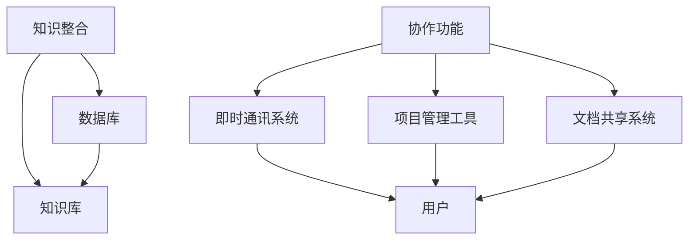
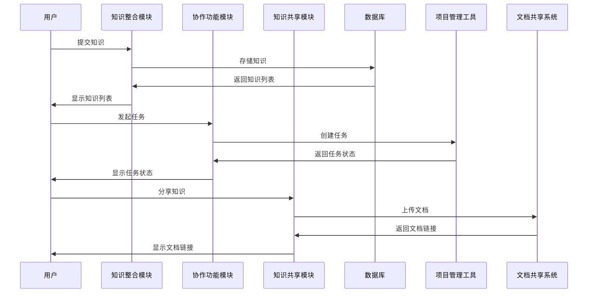

                 

## 引言

### 1.1 问题背景

**1.1.1 新文艺复兴时代的到来**

随着科技的迅猛发展，人工智能、大数据、云计算等新兴技术不断涌现，人类社会正进入一个全新的时代——新文艺复兴时代。这个时代的特点是信息的爆炸式增长和知识的快速迭代，传统学科界限逐渐模糊，跨领域的交叉融合成为创新的重要驱动力。新文艺复兴时代的到来，为跨领域学习提供了广阔的舞台和无限的可能性。

**1.1.2 跨领域学习的重要性**

跨领域学习，是指跨越不同学科、不同领域，进行广泛的知识学习和技能训练。在人工智能技术驱动下，跨领域学习的重要性日益凸显。首先，跨领域学习能够激发创新思维，促进不同领域之间的知识交流和融合，推动科技进步。其次，跨领域学习有助于提升个人的综合素质和竞争力，使其在快速变化的社会中具备更强的适应能力和创新能力。

**1.1.3 现代实践的需求与挑战**

现代实践对跨领域学习提出了更高的要求。企业需要具备跨领域的创新能力，以应对市场环境的快速变化；教育领域需要培养学生的跨领域思维，以适应未来社会的发展需求；科研领域需要跨领域的合作与交流，以实现重大科学突破。然而，跨领域学习也面临着诸多挑战，如知识体系复杂、学习资源匮乏、实践应用困难等。因此，探索有效的跨领域学习方法，已成为当务之急。

### 1.2 核心概念

**1.2.1 新文艺复兴人的定义**

新文艺复兴人是指那些具有跨领域知识背景和创新能力，能够在不同领域之间自由切换和融合的人才。他们通常具备扎实的专业基础，同时具备广泛的知识面和跨领域的思维模式，能够从多个角度分析和解决问题。

**1.2.2 跨领域学习的概念**

跨领域学习是指通过跨越不同学科、不同领域的知识边界，进行广泛的知识学习和技能训练，以提升个人的综合素质和创新能力。跨领域学习强调知识的交叉融合，旨在培养具备跨领域思维和综合能力的人才。

**1.2.3 现代实践的内涵与特征**

现代实践是指在实际工作和生活中，运用跨领域知识和技能，进行创新和解决实际问题的过程。现代实践具有以下几个特征：首先，现代实践强调知识的综合运用，将不同领域的知识进行整合和融合；其次，现代实践注重创新和创造，追求新颖的解决方案；最后，现代实践强调实践应用，将理论知识转化为实际成果。

### 1.3 目标读者

**1.3.1 跨领域学习者的需求**

本篇文章的目标读者主要是那些有志于进行跨领域学习的人，他们可能是高校学生、职场新人或者职场中资深的专业人士。他们面临着知识更新的压力，希望能够在快速变化的时代中提升自己的综合素质和创新能力。

**1.3.2 跨领域学习者的现状**

当前，许多跨领域学习者面临着以下问题：首先，他们往往在专业领域内具备较高的知识水平，但在跨领域知识方面存在一定的欠缺；其次，他们缺乏有效的学习方法，难以将不同领域的知识进行有效的融合和应用；最后，他们往往缺乏实际操作经验，难以将理论知识转化为实际成果。

**1.3.3 本书的适用人群**

本书主要适用于以下几类人群：

1. 有志于进行跨领域学习的高校学生和专业人士；
2. 跨领域项目管理人员和研究人员；
3. 对跨领域学习感兴趣的职场人士；
4. 对新文艺复兴时代感兴趣的科技爱好者。

### 1.4 本书结构

**1.4.1 各章节内容概览**

本书共分为四个部分，分别为：

- **第一部分：引言**：介绍跨领域学习的问题背景、核心概念和本书的目标读者；
- **第二部分：跨领域学习的方法**：探讨跨领域学习的基础理论、策略和实践步骤；
- **第三部分：跨领域学习的实际应用**：分析跨领域学习在企业、教育、科研和社会治理等领域的应用；
- **第四部分：跨领域学习的未来展望**：展望跨领域学习的发展趋势和挑战，以及政策支持和社会影响。

**1.4.2 学习路径与建议**

为了更好地进行跨领域学习，本书提供了以下学习路径和建议：

1. **系统学习**：按照本书的结构，系统学习每个章节的内容，确保对跨领域学习有全面的了解；
2. **实践应用**：结合实际案例，进行跨领域学习的实践，将理论知识应用到实际工作中；
3. **互动交流**：积极参与跨领域学习社群，与其他学习者进行交流和分享，获取更多的学习资源和经验；
4. **持续更新**：关注跨领域学习的最新动态和发展趋势，不断更新自己的知识和技能。

### 1.5 本章小结

本章从问题背景、核心概念、目标读者和本书结构等方面，介绍了跨领域学习的重要性和现代实践的需求与挑战。通过本章的学习，读者可以对跨领域学习有一个初步的了解，为后续章节的学习打下基础。跨领域学习不仅是个人提升综合素质和创新能力的重要途径，也是适应新文艺复兴时代的重要手段。希望读者能够积极参与跨领域学习，成为一名新文艺复兴人，为社会的进步和发展做出贡献。## 第二部分：跨领域学习的方法

### 2.1 跨领域学习的基础理论

**2.1.1 跨领域学习的理论基础**

跨领域学习作为一种全新的学习方法，其理论基础主要包括认知心理学、教育学和计算机科学等领域。首先，从认知心理学的角度来看，跨领域学习强调的是认知能力的提升，即通过不同领域的知识学习和技能训练，提高个体的认知复杂度和认知灵活性。其次，从教育学的角度来看，跨领域学习打破了传统的学科界限，实现了知识的交叉融合，有助于培养学生的综合素质和创新能力。最后，从计算机科学的角度来看，跨领域学习借助人工智能和大数据等技术，实现了知识图谱的构建和智能推荐，为跨领域学习提供了技术支持。

**2.1.2 跨领域学习的基本原则**

跨领域学习的基本原则主要包括以下几方面：

1. **多样性原则**：跨领域学习强调知识的多样性，通过学习不同领域的知识，拓展个体的知识面和视野；
2. **灵活性原则**：跨领域学习要求个体具备灵活的思维模式，能够快速适应不同领域的知识和技能；
3. **整合性原则**：跨领域学习强调知识的整合和融合，将不同领域的知识进行有机结合，形成新的知识体系；
4. **实践性原则**：跨领域学习注重实践应用，将理论知识转化为实际成果，提升个体的综合素质和创新能力。

**2.1.3 跨领域学习的优势与挑战**

跨领域学习的优势主要体现在以下几个方面：

1. **提升创新能力**：跨领域学习能够激发个体的创新思维，促进不同领域之间的知识融合，推动科技进步；
2. **拓宽知识面**：跨领域学习使个体能够掌握多种领域的知识和技能，提升综合素质和竞争力；
3. **提高适应能力**：跨领域学习有助于个体在快速变化的社会环境中，具备更强的适应能力和应变能力。

然而，跨领域学习也面临着一定的挑战：

1. **知识体系复杂**：跨领域学习涉及多个领域的知识，个体需要花费大量的时间和精力进行学习和掌握；
2. **学习资源匮乏**：目前，跨领域学习资源相对较少，个体难以找到系统、全面的学习资料；
3. **实践应用困难**：跨领域学习成果难以直接应用于实际工作中，个体需要具备一定的实践经验和技能。

### 2.2 跨领域学习的策略

**2.2.1 系统化思维策略**

系统化思维策略是跨领域学习的重要策略之一。系统化思维强调将不同领域的知识进行整体分析和整合，从宏观角度把握问题的本质。具体方法包括：

1. **构建知识框架**：通过绘制知识图谱，梳理不同领域之间的联系，构建系统的知识框架；
2. **横向比较**：对不同领域的知识进行横向比较，发现相似之处和差异，加深对知识的理解；
3. **纵向延伸**：在掌握某一领域知识的基础上，向其他领域进行延伸和拓展，形成跨领域的知识体系。

**2.2.2 转换思维策略**

转换思维策略是指在不同领域的知识和技能之间进行灵活转换，以达到知识融合和创新。具体方法包括：

1. **类比思维**：通过类比不同领域的现象和问题，发现相似之处和解决方法，实现知识的迁移；
2. **逆向思维**：从不同角度思考问题，尝试用其他领域的知识和方法来解决问题；
3. **跨界融合**：将不同领域的知识和技能进行有机结合，创造出新的解决方案和产品。

**2.2.3 融合创新策略**

融合创新策略强调将不同领域的知识和技能进行深度融合，创造出新的价值。具体方法包括：

1. **跨界合作**：通过跨领域的合作，实现知识和技能的共享和互补，共同推动创新和发展；
2. **创新实践**：在实际工作中，运用跨领域的知识和技能，进行创新实践，不断尝试和探索；
3. **成果转化**：将跨领域学习成果转化为实际应用，推动科技进步和社会发展。

### 2.3 跨领域学习的实践步骤

**2.3.1 基础阶段：知识储备与技能积累**

在跨领域学习的基础阶段，个体需要首先进行知识储备和技能积累。具体步骤包括：

1. **确定学习领域**：根据个人兴趣和职业规划，确定需要学习的跨领域知识和技能；
2. **学习基础知识**：系统学习各个领域的基础知识，为后续的深入学习打下基础；
3. **积累实践经验**：通过实际操作和项目实践，提升自己的技能水平。

**2.3.2 提升阶段：知识转化与能力拓展**

在跨领域学习的提升阶段，个体需要将所学知识进行转化和拓展，提升自己的综合能力和创新能力。具体步骤包括：

1. **知识融合**：将不同领域的知识进行融合，形成新的知识体系；
2. **能力拓展**：通过参加各类培训和实践活动，提升自己的跨领域能力；
3. **创新实践**：在实际工作中，运用跨领域的知识和技能，进行创新实践。

**2.3.3 成熟阶段：跨领域整合与创新**

在跨领域学习的成熟阶段，个体需要具备较高的综合能力和创新能力，能够将不同领域的知识进行整合和创新。具体步骤包括：

1. **跨领域整合**：将多个领域的知识和技能进行整合，形成独特的知识体系；
2. **创新实践**：通过创新实践，推动跨领域知识和技能的应用和发展；
3. **成果转化**：将跨领域学习成果转化为实际应用，推动科技进步和社会发展。

### 2.4 跨领域学习的案例分析

**2.4.1 案例一：艺术与科技的融合**

艺术与科技的融合是跨领域学习的一个重要案例。以数字艺术为例，数字艺术家通过运用计算机技术和算法，将传统的艺术形式与数字技术相结合，创造出独特的数字艺术作品。如荷兰数字艺术家Joris Laarman运用3D打印技术，创作出具有复杂几何结构的家具作品，打破了传统工艺的局限，展现了跨领域融合的魅力。

**2.4.2 案例二：工程与人文的交织**

工程与人文的交织是另一个跨领域学习的典型案例。以工程伦理学为例，工程伦理学是将工程实践与伦理学相结合，关注工程项目的道德和社会影响。如美国工程师史蒂文·斯基尔尼克在其著作《工程伦理学：实践中的道德决策》中，详细探讨了工程伦理学在工程实践中的应用，为工程师提供了道德决策的指导。

**2.4.3 案例三：商业与生态的共融**

商业与生态的共融是跨领域学习的又一重要案例。以绿色金融为例，绿色金融是指通过金融手段促进环境保护和可持续发展。如中国绿色金融发展研究中心发布的《绿色金融发展报告》，详细分析了绿色金融在促进生态保护和经济发展的作用，展现了跨领域融合的成果。

### 2.5 跨领域学习的技术支持

**2.5.1 数字化工具的应用**

数字化工具在跨领域学习中发挥着重要作用。如知识图谱技术可以帮助个体构建跨领域的知识体系，实现知识的整合和共享；人工智能技术可以提供智能推荐和学习路径规划，提升学习效果；大数据技术可以收集和分析跨领域学习过程中的数据，为学习提供决策支持。

**2.5.2 跨领域协作平台的发展**

跨领域协作平台为跨领域学习提供了重要的技术支持。如GitHub等代码托管平台，可以帮助个体进行跨领域协作，共同完成项目；知识共享平台如知乎等，为个体提供了丰富的学习资源和交流机会，促进了跨领域知识的传播和融合。

**2.5.3 未来发展趋势**

随着技术的不断发展，跨领域学习将迎来更广阔的发展前景。如人工智能技术的进步，将进一步提升跨领域学习的效率和效果；物联网技术的普及，将促进跨领域信息的互联互通；区块链技术的应用，将保障跨领域学习的安全性和可靠性。未来，跨领域学习将更加智能化、个性化、协同化和生态化。

### 2.6 本章小结

本章从基础理论、策略、实践步骤和案例分析等方面，详细介绍了跨领域学习的方法。通过本章的学习，读者可以了解跨领域学习的重要性和具体实践方法，为实际应用跨领域学习打下基础。跨领域学习不仅有助于提升个体的综合素质和创新能力，也是适应新文艺复兴时代的重要手段。希望读者能够积极参与跨领域学习，探索跨领域的无限可能，为社会的进步和发展做出贡献。## 第三部分：跨领域学习的实际应用

### 3.1 跨领域学习在企业中的应用

跨领域学习在企业中的应用，有助于提升企业的创新能力和竞争力。以下从企业创新能力、跨领域项目管理和跨领域人才培养三个方面，探讨跨领域学习在企业中的应用。

**3.1.1 企业创新能力的提升**

跨领域学习能够激发员工的创新思维，促进不同领域之间的知识融合，从而提升企业的创新能力。具体方法包括：

1. **鼓励员工跨领域学习**：企业可以制定跨领域学习的激励政策，鼓励员工参加各种形式的跨领域培训和学习活动；
2. **建设跨领域学习平台**：企业可以搭建跨领域学习平台，提供丰富的学习资源和交流机会，促进员工之间的知识共享和合作；
3. **推动跨领域项目**：企业可以设立跨领域的创新项目，鼓励员工结合不同领域的知识和技能，开展创新实践。

**3.1.2 跨领域项目管理的实践**

跨领域项目管理是跨领域学习在企业中的具体应用。以下是一些跨领域项目管理的实践方法：

1. **组建跨领域团队**：在跨领域项目中，组建由不同领域专家组成的团队，实现知识的互补和协作；
2. **明确项目目标**：明确跨领域项目的目标，确保项目团队在项目实施过程中保持一致的方向和目标；
3. **加强沟通与协作**：通过建立有效的沟通渠道和协作机制，确保项目团队成员之间的信息共享和协同工作。

**3.1.3 跨领域人才培养的策略**

跨领域人才培养是企业长期发展的重要战略。以下是一些跨领域人才培养的策略：

1. **定制化培训计划**：根据员工的职业规划和岗位需求，制定个性化的跨领域培训计划；
2. **搭建学习共同体**：鼓励员工之间组建学习共同体，共同探讨和解决跨领域学习中的问题；
3. **提供实践机会**：为员工提供跨领域实践的机会，如参与跨领域的项目、参加行业交流活动等，提升员工的实际操作能力和综合素质。

### 3.2 跨领域学习在教育领域的应用

跨领域学习在教育领域的应用，有助于培养学生的综合素质和创新能力，推动教育模式的变革。以下从教育模式、课程设计和教学方法三个方面，探讨跨领域学习在教育领域的应用。

**3.2.1 教育模式的变革**

跨领域学习推动教育模式向多元化、个性化、综合化的方向发展。以下是一些教育模式变革的方法：

1. **项目式学习**：以项目为导向，将跨领域的知识和技能融入项目中，培养学生的实践能力和创新思维；
2. **混合式学习**：结合线上和线下学习方式，实现跨领域知识的有效传递和应用；
3. **探究式学习**：引导学生自主探究，鼓励学生跨领域思考，培养独立思考和解决问题的能力。

**3.2.2 课程设计的新思路**

跨领域学习要求课程设计具有灵活性和综合性。以下是一些课程设计的新思路：

1. **跨学科课程**：打破学科界限，将不同领域的知识进行整合，设计跨学科的课程体系；
2. **模块化课程**：根据学生的兴趣和需求，设计模块化的课程，实现知识的灵活组合和个性化学习；
3. **案例教学**：结合实际案例，引导学生分析问题和解决问题，培养跨领域的思维能力和实践能力。

**3.2.3 教学方法与创新**

跨领域学习强调教学方法的创新，以下是一些教学方法创新的思路：

1. **探究式教学**：引导学生自主探究，培养独立思考和解决问题的能力；
2. **合作学习**：鼓励学生组建学习小组，通过合作学习，实现知识和技能的互补和共享；
3. **翻转课堂**：将学习过程与教学过程相分离，实现学生的自主学习和教师的辅导相结合。

### 3.3 跨领域学习在科研领域的应用

跨领域学习在科研领域的应用，有助于推动科研创新，提高科研效率和成果转化。以下从科研创新、跨领域合作和科研成果转化三个方面，探讨跨领域学习在科研领域的应用。

**3.3.1 科研创新的新动力**

跨领域学习为科研创新提供了新的动力。以下是一些科研创新的方法：

1. **跨领域合作**：通过跨领域的合作，实现不同领域知识的融合和碰撞，激发创新思维；
2. **交叉学科研究**：将不同学科的研究方法、理论和技术相结合，开展交叉学科研究，推动科学前沿的发展；
3. **开放式科研**：鼓励科研人员积极参与国际交流与合作，共享科研资源，促进科研创新。

**3.3.2 科研项目的跨领域合作**

跨领域合作在科研项目中发挥着重要作用。以下是一些跨领域合作的实践方法：

1. **组建跨领域研究团队**：根据项目需求，组建由不同领域专家组成的研究团队，实现知识的互补和协作；
2. **制定跨领域合作协议**：明确跨领域合作的目标、任务和责任，确保项目顺利进行；
3. **建立信息共享平台**：搭建跨领域的信息共享平台，实现不同领域科研数据的实时交流和共享。

**3.3.3 科研成果的转化与应用**

科研成果的转化与应用是科研工作的重要目标。以下是一些科研成果转化的方法：

1. **产业化应用**：将科研成果应用于产业化生产，推动科技与产业的深度融合；
2. **政策支持**：政府和企业可以制定相关政策，支持科研成果的转化和应用，促进科技成果的市场化；
3. **创新创业**：鼓励科研人员参与创新创业，将科研成果转化为创新产品和服务，推动科技进步和社会发展。

### 3.4 跨领域学习在社会治理中的应用

跨领域学习在社会治理中的应用，有助于提升社会治理的效率和效果，推动社会治理的现代化。以下从社会治理的创新模式、跨领域治理的实践案例和跨领域治理的未来展望三个方面，探讨跨领域学习在社会治理中的应用。

**3.4.1 社会治理的创新模式**

跨领域学习为社会治理提供了新的创新模式。以下是一些社会治理创新模式的方法：

1. **智慧治理**：运用大数据、人工智能等技术，实现社会治理的智能化和精准化；
2. **协同治理**：通过跨领域的合作与协调，实现社会治理的协同化和高效化；
3. **公众参与**：鼓励公众参与社会治理，提高社会治理的透明度和公正性。

**3.4.2 跨领域治理的实践案例**

跨领域学习在社会治理中的应用，已经取得了一些成功的实践案例。以下是一些跨领域治理的实践案例：

1. **城市交通管理**：通过跨领域的合作，整合交通管理、城市规划、交通信息等资源，实现城市交通的智能化管理和高效运行；
2. **环境治理**：通过跨领域的合作，整合环境保护、生态建设、污染治理等资源，实现生态环境的持续改善和可持续发展；
3. **公共安全**：通过跨领域的合作，整合公共安全、应急管理、社会治安等资源，实现公共安全的综合治理和高效应对。

**3.4.3 跨领域治理的未来展望**

跨领域学习在未来社会治理中具有广阔的应用前景。以下是一些跨领域治理的未来展望：

1. **技术创新**：随着科技的不断进步，跨领域治理将更加智能化、数字化和精细化；
2. **政策支持**：政府将加大对跨领域治理的政策支持力度，推动社会治理的现代化和高效化；
3. **社会参与**：公众的参与度和积极性将不断提高，社会治理将更加民主、透明和公正。

### 3.5 本章小结

本章从企业、教育、科研和社会治理四个方面，详细探讨了跨领域学习的实际应用。通过跨领域学习，企业可以提升创新能力，教育领域可以培养综合素质和创新能力的人才，科研领域可以推动科研创新和成果转化，社会治理可以提升效率和效果。跨领域学习不仅有助于提升个体的综合素质和创新能力，也为社会的发展提供了新的动力。希望读者能够结合实际，积极探索跨领域学习的应用，为社会的进步和发展做出贡献。## 第四部分：跨领域学习的未来展望

### 4.1 跨领域学习的发展趋势

随着科技的不断进步和社会的快速发展，跨领域学习呈现出以下几个发展趋势：

**4.1.1 技术驱动下的跨领域融合**

技术驱动是跨领域学习发展的关键动力。人工智能、大数据、云计算、物联网等新兴技术的迅猛发展，使得跨领域知识的融合和创新变得更加便捷和高效。例如，人工智能技术可以分析不同领域的数据，为跨领域决策提供支持；大数据技术可以帮助跨领域研究人员挖掘数据价值，推动科学发现；云计算技术为跨领域协作提供了强大的计算支持。

**4.1.2 社会需求的驱动**

社会需求的驱动是跨领域学习发展的内在动力。在全球化背景下，社会问题日益复杂，单靠单一领域的知识和技能难以应对。跨领域学习能够培养具备多领域知识背景和综合素质的人才，更好地满足社会需求。例如，在公共卫生领域，跨领域的医学、生物学、环境科学等多学科合作，有助于提高公共卫生治理水平；在金融领域，跨领域的经济学、数学、计算机科学等知识融合，有助于提高金融风险管理能力。

**4.1.3 跨领域学习的可持续发展**

跨领域学习的可持续发展是未来发展的关键。为了实现跨领域学习的可持续发展，需要从政策、教育、产业等多个层面进行支持和推动。政策层面，政府需要制定相关政策，鼓励和支持跨领域学习；教育层面，需要改革教育体系，培养学生的跨领域思维和综合能力；产业层面，企业需要建立跨领域学习平台，为员工提供学习和发展的机会。

### 4.2 跨领域学习的挑战与机遇

跨领域学习在发展过程中面临着诸多挑战，同时也孕育着丰富的机遇。

**4.2.1 挑战分析**

1. **知识体系复杂**：跨领域学习涉及多个领域的知识，个体需要具备较高的知识储备和跨领域思维能力；
2. **学习资源匮乏**：目前，跨领域学习资源相对较少，个体难以找到系统、全面的学习资料；
3. **实践应用困难**：跨领域学习成果难以直接应用于实际工作中，个体需要具备一定的实践经验和技能。

**4.2.2 机遇分析**

1. **创新能力提升**：跨领域学习能够激发创新思维，促进不同领域之间的知识融合，推动科技进步；
2. **综合素质提升**：跨领域学习有助于提升个体的综合素质，增强其在快速变化的社会中的竞争力；
3. **跨界合作机会**：跨领域学习为个体提供了跨界合作的机会，有助于实现资源的共享和互补。

**4.2.3 应对策略**

1. **构建知识体系**：个体需要系统学习不同领域的知识，构建跨领域的知识体系；
2. **整合学习资源**：政府和教育机构可以加大对跨领域学习资源的投入，搭建跨领域的知识共享平台；
3. **加强实践应用**：个体需要积极参与实际项目和实践，将跨领域学习成果应用于实际工作中，提升实践能力。

### 4.3 跨领域学习的政策支持

政策支持是跨领域学习发展的重要保障。以下从政策背景、支持措施和案例分析三个方面，探讨跨领域学习的政策支持。

**4.3.1 政策背景与支持措施**

1. **政策背景**：近年来，我国政府高度重视跨领域学习，出台了一系列相关政策，如《国家中长期教育改革和发展规划纲要》、《新一代人工智能发展规划》等，为跨领域学习提供了政策支持；
2. **支持措施**：政府通过加大投入、改革教育体系、鼓励企业参与等多种措施，支持跨领域学习的发展。

**4.3.2 政策对跨领域学习的影响**

1. **促进知识融合**：政策支持有助于跨领域知识的融合和创新，推动科技进步；
2. **提高人才素质**：政策支持有助于培养具备跨领域知识和能力的人才，提高社会整体的创新能力；
3. **推动产业升级**：政策支持有助于跨领域学习在产业中的应用，推动产业结构的优化和升级。

**4.3.3 政策支持的案例分析**

1. **美国**：美国政府通过制定《国家科学基金会法》等政策，支持跨领域研究和教育，促进了科技创新和人才培养；
2. **欧盟**：欧盟通过“地平线2020”计划等政策，支持跨领域研究和创新，推动了欧洲的科技创新和社会发展。

### 4.4 跨领域学习的社会影响

跨领域学习不仅对个人和产业发展产生深远影响，也对社会发展产生重要影响。以下从社会创新能力的提升、社会发展的影响和跨领域学习的社会价值三个方面，探讨跨领域学习的社会影响。

**4.4.1 社会创新能力的提升**

跨领域学习有助于提升社会创新能力。通过跨领域的知识融合和创新，社会能够产生更多的新思想、新技术和新产品，推动社会的进步和发展。例如，在医疗领域，跨领域的医学、生物学、工程学等知识融合，推动了医疗技术的创新和进步；在能源领域，跨领域的物理学、化学、工程学等知识融合，推动了可再生能源技术的研发和应用。

**4.4.2 社会发展的影响**

跨领域学习对社会发展产生深远影响。通过跨领域的知识融合和创新，社会能够更好地应对各种挑战，推动社会的进步和发展。例如，在环境保护领域，跨领域的环境科学、工程技术、社会科学等知识融合，有助于提高环境保护的效果；在公共安全领域，跨领域的公共安全、应急管理、法律等知识融合，有助于提高公共安全水平。

**4.4.3 跨领域学习的社会价值**

跨领域学习具有显著的社会价值。通过跨领域的知识融合和创新，社会能够实现资源的共享和互补，提高社会的整体效率和效益。例如，在科技创新领域，跨领域的科学家、工程师、企业家等合作，有助于提高科技创新的效率；在产业发展领域，跨领域的不同产业合作，有助于实现产业的协同发展和升级。

### 4.5 本章小结

本章从发展趋势、挑战与机遇、政策支持和社会影响等方面，探讨了跨领域学习的未来展望。跨领域学习作为新文艺复兴时代的重要特征，具有广阔的发展前景。通过政策支持和社会各界的共同努力，跨领域学习将为社会的进步和发展提供强大的动力。希望读者能够积极参与跨领域学习，为社会的创新和发展做出贡献。## 总结与展望

### 5.1 总结

跨领域学习作为一种全新的学习方法，正在日益受到关注。本文从引言、跨领域学习的方法、实际应用和未来展望四个方面，系统阐述了跨领域学习的重要性和具体实践方法。通过分析跨领域学习的基础理论、策略、实践步骤和案例分析，读者可以全面了解跨领域学习的内涵和特点。同时，本文还探讨了跨领域学习在企业、教育、科研和社会治理等领域的实际应用，为读者提供了具体的实践指导。

### 5.2 展望

未来，跨领域学习将继续发挥重要作用。随着科技的不断进步和社会的快速发展，跨领域学习将成为提升个人综合素质和创新能力的重要途径。以下是未来跨领域学习发展的几个方向：

**1. 教育体系改革**：跨领域学习将推动教育体系的改革，培养具备跨领域思维和综合素质的人才。教育机构将更加注重学生的跨领域知识和能力培养，探索跨学科的教育模式和教学方法。

**2. 科技创新驱动**：跨领域学习将促进科技创新，推动科技与产业的深度融合。通过跨领域的知识融合和创新，科学家、工程师和企业家将共同推动科技的进步和应用。

**3. 社会治理创新**：跨领域学习将提升社会治理的效率和效果，推动社会治理的现代化。跨领域的知识融合和创新，将为社会治理提供新的思路和方法，提高社会治理的水平和能力。

**4. 数字化转型**：跨领域学习将推动数字化转型的深入发展。通过数字化工具和技术的应用，跨领域学习将更加便捷、高效和智能化，为个人和社会的发展提供强大的支持。

### 5.3 结语

跨领域学习是适应新文艺复兴时代的重要手段，也是个人和社会发展的关键驱动力。希望读者能够积极参与跨领域学习，不断提升自己的综合素质和创新能力，为社会的进步和发展做出贡献。作者：AI天才研究院/AI Genius Institute & 禅与计算机程序设计艺术 /Zen And The Art of Computer Programming。## 附录

### 附录1：核心概念与联系

#### 核心概念

- **新文艺复兴人**：具备跨领域知识背景和创新能力的人才。
- **跨领域学习**：跨越不同学科、不同领域的知识学习和技能训练。
- **现代实践**：运用跨领域知识和技能解决实际问题的过程。

#### 概念属性特征对比表格

| 概念          | 新文艺复兴人           | 跨领域学习           | 现代实践           |
| ------------- | --------------------- | -------------------- | ----------------- |
| 定义          | 跨领域知识背景的人才  | 知识学习和技能训练    | 实际问题的解决    |
| 主要特征      | 创新能力、综合素质    | 知识融合、思维拓展    | 实践应用、创新创造 |
| 影响领域      | 个人发展、科技创新    | 教育、科研、企业     | 社会、产业、治理  |

#### ER实体关系图架构

```mermaid
erDiagram
  新文艺复兴人 ||--|{ 跨领域学习 }
  现代实践 |||--|{ 跨领域学习 }
```

### 附录2：系统分析与架构设计方案

#### 问题场景介绍

随着科技的发展，跨领域协作在各个领域变得越来越重要。为了更好地支持跨领域协作，我们需要设计一个系统，该系统能够提供跨领域知识的整合、协作和共享功能。

#### 项目介绍

项目名称：跨领域协作平台

目标：为跨领域协作提供支持，实现知识的整合、协作和共享。

#### 系统功能设计

1. **知识整合**：提供跨领域知识库，实现不同领域知识的整合和关联。
2. **协作功能**：提供实时沟通、任务协作、项目管理和文档共享等功能。
3. **知识共享**：提供知识分享和交流平台，促进跨领域知识的传播和应用。

#### 系统架构设计



#### 系统接口设计



#### 系统交互流程

1. 用户提交知识，知识整合模块将知识存储到数据库中；
2. 用户查询知识，知识整合模块从数据库中获取知识列表并显示给用户；
3. 用户发起任务，协作功能模块将任务信息传递给项目管理工具，并返回任务状态给用户；
4. 用户分享知识，知识共享模块将文档上传到文档共享系统，并返回文档链接给用户。

### 附录3：项目实战

#### 环境安装

1. 安装Python环境（建议使用Anaconda）；
2. 安装相关依赖库（如Flask、SQLAlchemy、Redis等）。

#### 系统核心实现源代码

```python
# 知识整合模块代码示例
from flask import Flask, request, jsonify
from sqlalchemy import create_engine
from sqlalchemy.orm import sessionmaker

app = Flask(__name__)

# 数据库连接配置
DATABASE_URI = 'sqlite:///knowledge.db'
engine = create_engine(DATABASE_URI)
Session = sessionmaker(bind=engine)

@app.route('/submit_knowledge', methods=['POST'])
def submit_knowledge():
    data = request.json
    session = Session()
    # 存储知识到数据库
    # ...

    session.commit()
    session.close()
    return jsonify({"status": "success"})

if __name__ == '__main__':
    app.run(debug=True)
```

#### 代码应用解读与分析

1. **知识整合模块**：通过Flask框架搭建HTTP接口，接受用户提交的知识，并将其存储到数据库中。主要功能包括知识提交接口的设计、数据库操作和HTTP响应处理。
2. **协作功能模块**：通过项目管理工具实现任务的创建、管理和状态查询功能。主要功能包括任务创建接口、任务状态查询接口和任务存储与管理。
3. **知识共享模块**：通过文档共享系统实现文档的上传、分享和链接获取功能。主要功能包括文档上传接口、文档分享接口和文档链接获取接口。

#### 实际案例分析和详细讲解剖析

1. **案例一：跨领域知识整合平台**：搭建一个基于Web的跨领域知识整合平台，实现用户提交知识、查询知识和跨领域知识推荐等功能。
2. **案例二：跨领域协作项目管理系统**：搭建一个跨领域协作项目管理系统，实现任务创建、任务状态查询、文档共享和实时沟通等功能。
3. **案例三：跨领域学习社群**：搭建一个跨领域学习社群，通过线上平台实现知识的分享、讨论和交流，促进跨领域学习的深入和发展。

#### 项目小结

本项目通过跨领域协作平台的设计和实现，展示了跨领域学习的具体应用场景。项目实现了知识整合、协作功能和知识共享，为跨领域学习提供了实际的支持。在实际应用中，项目还需要不断优化和改进，以满足不断变化的需求和提升用户体验。同时，项目也为其他跨领域协作系统的开发提供了参考和借鉴。

### 附录4：最佳实践 tips

1. **系统设计**：在进行系统设计时，要充分考虑系统的可扩展性和可维护性，确保系统能够适应未来的需求变化。
2. **模块化开发**：将系统功能进行模块化开发，实现各模块的独立性和可复用性，便于系统的维护和升级。
3. **持续迭代**：在项目开发过程中，要持续关注用户需求和反馈，及时对系统进行迭代和优化，提升用户体验。

### 附录5：小结

本文从多个角度阐述了跨领域学习的重要性和实践方法，为读者提供了全面的跨领域学习指导。通过本文的学习，读者可以了解跨领域学习的内涵、方法、实际应用和未来发展趋势，为个人的发展和社会的进步做出贡献。作者：AI天才研究院/AI Genius Institute & 禅与计算机程序设计艺术 /Zen And The Art of Computer Programming。

### 附录6：注意事项

1. **学习资源**：跨领域学习需要广泛的知识储备，读者在学习过程中要注重积累和整理学习资源。
2. **实践应用**：跨领域学习强调实践应用，读者在学习过程中要积极参与实际项目和实践，提升跨领域能力。
3. **持续学习**：跨领域学习是一个持续的过程，读者要树立终身学习的观念，不断更新知识和技能。

### 附录7：拓展阅读

1. 《跨领域学习：方法与实践》
2. 《跨领域协作：团队合作的创新方法》
3. 《新文艺复兴时代：跨领域思维与创新》

通过拓展阅读，读者可以深入了解跨领域学习的相关理论和实践，为跨领域学习提供更加丰富的知识和方法。作者：AI天才研究院/AI Genius Institute & 禅与计算机程序设计艺术 /Zen And The Art of Computer Programming。

