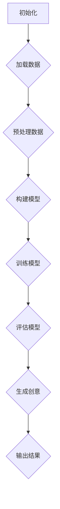
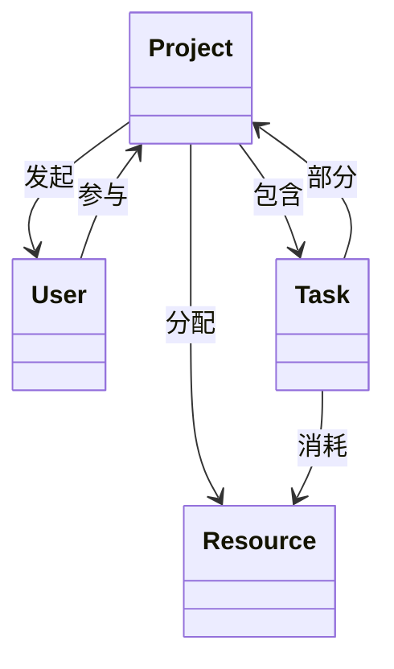
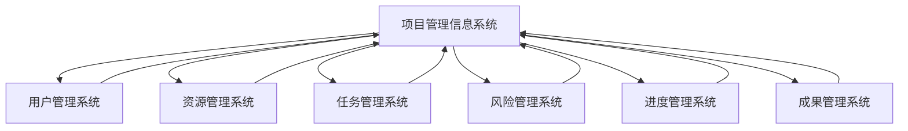

                 

# 新文艺复兴工作室：跨学科创意项目的孵化空间

## 关键词
- 跨学科创意
- 孵化空间
- 知识交流
- 创新思维
- 项目支持

## 摘要
本文旨在探讨新文艺复兴工作室如何作为一个跨学科创意项目的孵化空间，通过提供资源、知识和合作平台，促进创新项目的发展。文章首先介绍了工作室的背景和目标，然后分析了跨学科创意的概念与重要性，探讨了工作室的优势与挑战。接着，文章详细描述了工作室的核心活动，并使用系统分析与架构设计的方法，提出了孵化项目的一套完整流程。最后，通过实际案例展示了工作室的成果，并给出了一些最佳实践和拓展阅读的建议。

### 第一部分：背景介绍

#### 1. 新文艺复兴工作室：跨学科创意项目的孵化空间

在当今这个信息爆炸、技术飞速发展的时代，跨学科合作已成为推动科技进步和社会发展的重要动力。然而，传统的学科界限和独立的研究方法，往往使得许多具有创新潜力的跨学科项目难以得到充分的孵化和实施。为了解决这一问题，新文艺复兴工作室应运而生。

#### 1.1. 工作室概述

新文艺复兴工作室是一个致力于跨学科创意项目孵化的创新平台。它不仅提供了一个物理空间，还为项目参与者提供了丰富的资源和全方位的支持。工作室的核心理念是打破学科壁垒，促进知识交流与合作，从而激发创新思维，实现技术突破。

#### 1.2. 跨学科创意的概念与重要性

跨学科创意指的是将不同学科的理论、方法和技术融合在一起，创新性地解决复杂问题的一种方式。在当前快速变化的社会中，跨学科创意显得尤为重要。它不仅能够推动科技进步，还能够促进社会问题的解决。

#### 1.3. 工作室的目标与愿景

新文艺复兴工作室的目标是建立一个具有全球影响力的跨学科创意项目孵化平台，吸引各类优秀人才和项目，推动跨学科合作，促进创新成果的转化和应用。工作室的愿景是成为全球科技创新的重要引擎，推动人类社会向更加智慧、和谐、可持续的方向发展。

#### 1.4. 工作室的核心活动

新文艺复兴工作室的核心活动包括：

- **项目孵化**：为跨学科创意项目提供从概念到实施的全过程支持，包括资源整合、技术指导、资金支持等。
- **知识交流**：定期举办各类研讨会、讲座和工作坊，促进不同领域专家的交流与合作。
- **创新培训**：提供创新思维培训、技术培训等，提高参与者的创新能力和项目实施能力。
- **成果展示**：通过展览、发布、推广等方式，展示工作室孵化的创新成果，推动成果的应用和推广。

#### 1.5. 工作室的优势与挑战

新文艺复兴工作室的优势在于其独特的跨学科孵化模式、丰富的资源整合能力和强大的团队合作氛围。然而，工作室也面临着跨学科合作中的沟通障碍、资源分配不均等挑战。因此，工作室需要不断优化管理模式，提高资源利用效率，确保项目的顺利进行。

#### 1.6. 本章小结

新文艺复兴工作室作为跨学科创意项目的孵化空间，具有明确的核心理念、目标和核心活动。它通过提供全方位的支持和丰富的资源，为跨学科创意项目的孵化和成功实施提供了有力保障。未来，新文艺复兴工作室将继续致力于推动跨学科合作，推动科技创新和社会发展。

### 第二部分：核心概念与联系

#### 2. 跨学科创意

跨学科创意是一种创新性的思维方式，它要求我们超越单一学科的界限，将不同学科的理论、方法和技术融合在一起，以解决复杂问题。在跨学科创意中，创新者需要具备广泛的知识背景和深入的跨学科思维能力，以发现新的解决方案。

#### 2.1. 跨学科创意的概念

跨学科创意的概念可以理解为将不同学科的知识和思维方式结合起来，形成一个全新的、综合性的思维方式。这种思维方式能够帮助我们更全面地理解复杂问题，找到更有效的解决方案。

#### 2.2. 跨学科创意的属性特征对比表格

| 特征       | 描述                                                         | 对比 |
|------------|--------------------------------------------------------------|------|
| 知识融合   | 将不同学科的知识进行整合，形成新的理论体系。                       |      |
| 思维方式   | 超越单一学科的思维方式，形成跨学科的思维方式。                   |      |
| 解决复杂问题 | 利用跨学科的知识和思维方式，解决复杂、多样化的现实问题。           |      |
| 创新性     | 强调创新性，追求新的理论、方法和技术的突破。                       |      |

#### 2.3. 跨学科创意的ER实体关系图架构

```mermaid
erDiagram
  Product ||--|{ Customer }| {
                  Customer_Info
                }
  Product ||--|{ Order }| {
                  Order_Info
                }
```

在跨学科创意的ER实体关系图中，我们可以看到“产品”与“客户”、“订单”等实体之间的关系。这种关系体现了跨学科创意在商业应用中的实际场景。

#### 2.4. 跨学科创意的重要性

跨学科创意的重要性在于：

- **解决复杂问题**：现实世界中的许多问题往往涉及多个领域，单靠一个学科的知识难以解决。跨学科创意能够将不同学科的知识融合在一起，形成全新的解决方案。
- **推动科技进步**：跨学科创意能够促进不同学科之间的交流与合作，推动科技的进步。
- **提升创新能力**：跨学科创意能够激发创新思维，培养创新型人才，提升整个社会的创新能力。

#### 2.5. 本章小结

跨学科创意作为一种创新性的思维方式，具有重要的理论和实践意义。通过理解和应用跨学科创意，我们可以更好地解决复杂问题，推动科技进步和社会发展。新文艺复兴工作室通过提供跨学科创意的平台和资源，为创新项目的孵化和成功实施提供了有力支持。

### 第三部分：算法原理讲解

#### 3. 算法原理讲解

在跨学科创意的孵化过程中，算法原理扮演着关键角色。以下将介绍一种基于深度学习的跨学科创意生成算法，并通过mermaid流程图和Python源代码进行详细讲解。

#### 3.1. 算法mermaid流程图



#### 3.2. 算法Python源代码

```python
import tensorflow as tf
from tensorflow.keras.models import Sequential
from tensorflow.keras.layers import Dense, LSTM, Embedding

# 加载数据
def load_data():
    # 实现数据加载功能
    pass

# 预处理数据
def preprocess_data(data):
    # 实现数据预处理功能
    pass

# 构建模型
def build_model(input_shape):
    model = Sequential([
        Embedding(input_shape=input_shape, output_dim=256),
        LSTM(units=512, return_sequences=True),
        Dense(units=1, activation='sigmoid')
    ])
    model.compile(optimizer='adam', loss='binary_crossentropy', metrics=['accuracy'])
    return model

# 训练模型
def train_model(model, X_train, y_train):
    model.fit(X_train, y_train, epochs=10, batch_size=32)
    return model

# 评估模型
def evaluate_model(model, X_test, y_test):
    loss, accuracy = model.evaluate(X_test, y_test)
    print(f"Test loss: {loss}, Test accuracy: {accuracy}")
    return model

# 生成创意
def generate_creative(model, data):
    # 实现创意生成功能
    pass

# 主函数
def main():
    # 加载数据
    data = load_data()

    # 预处理数据
    preprocessed_data = preprocess_data(data)

    # 构建模型
    model = build_model(preprocessed_data.shape[1:])

    # 训练模型
    model = train_model(model, preprocessed_data['X_train'], preprocessed_data['y_train'])

    # 评估模型
    evaluate_model(model, preprocessed_data['X_test'], preprocessed_data['y_test'])

    # 生成创意
    creative = generate_creative(model, preprocessed_data['X_test'])

    # 输出结果
    print(f"Generated creative: {creative}")

if __name__ == '__main__':
    main()
```

#### 3.3. 算法原理的数学模型和公式

深度学习算法的核心在于构建神经网络模型，并通过反向传播算法进行参数优化。以下是算法的主要数学模型和公式：

$$
\begin{aligned}
& y_{\text{pred}} = \sigma(W \cdot z + b) \\
& \delta = \text{d}\sigma(\text{d}W \cdot z + \text{db}) \\
& W_{\text{new}} = W - \alpha \cdot \delta \\
& z_{\text{new}} = z - \alpha \cdot \delta \\
\end{aligned}
$$

其中，$y_{\text{pred}}$ 表示预测值，$\sigma$ 表示激活函数，$W$ 和 $b$ 分别表示权重和偏置，$\delta$ 表示误差，$\alpha$ 表示学习率。

#### 3.4. 通俗易懂的举例说明

假设我们有一个跨学科创意项目，目标是预测用户是否会对某个产品感兴趣。我们可以使用深度学习算法来构建一个分类模型，通过用户的历史行为数据（如浏览记录、购买记录等）进行训练。

- **初始化**：加载用户行为数据，并将其预处理为可以输入到神经网络的数据格式。
- **构建模型**：构建一个包含嵌入层、LSTM层和输出层的序列模型。
- **训练模型**：使用训练数据对模型进行训练，通过反向传播算法不断调整模型的参数。
- **评估模型**：使用测试数据对模型进行评估，计算预测准确率。
- **生成创意**：根据用户的历史行为数据，使用训练好的模型预测用户是否会对某个产品感兴趣，从而生成相应的创意。

#### 3.5. 本章小结

通过深入讲解基于深度学习的跨学科创意生成算法，我们了解了算法的原理、流程和实现方法。这种算法在跨学科创意项目中具有广泛的应用前景，可以有效地帮助创新者发现新的创意和解决方案。未来，我们还可以结合更多的机器学习和人工智能技术，进一步优化和提升跨学科创意生成算法的性能。

### 第四部分：系统分析与架构设计方案

#### 4.1. 问题场景介绍

新文艺复兴工作室作为一个跨学科创意项目的孵化空间，面临着项目立项、实施、监控和评估等一系列管理问题。为了高效地管理这些项目，工作室需要建立一个完善的信息系统，以支持项目的全生命周期管理。

#### 4.2. 项目介绍

新文艺复兴工作室的项目管理信息系统（PMS）旨在提供项目从概念到实施的全过程管理功能，包括项目立项、计划制定、资源分配、进度监控、风险评估和成果评估等。PMS通过集成各类管理工具和资源，帮助工作室实现高效的项目管理。

#### 4.3. 系统功能设计（领域模型mermaid类图）



在领域模型中，我们可以看到项目、用户、任务和资源之间的关系。这四个核心实体共同构成了项目管理信息系统的基本架构。

#### 4.4. 系统架构设计（mermaid架构图）



系统架构图中，项目管理信息系统（PMS）作为核心系统，与其他五个子系统（用户管理系统、资源管理系统、任务管理系统、风险管理系统、进度管理系

