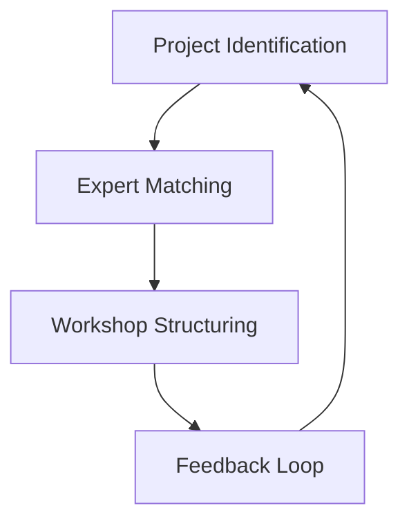
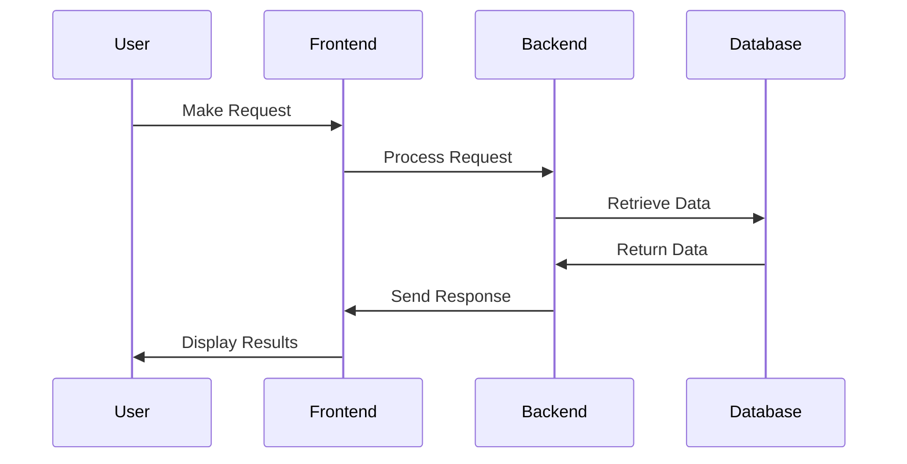
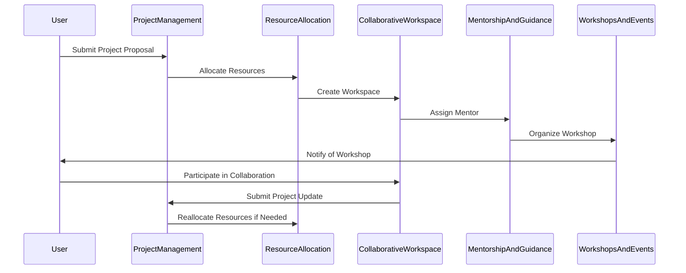

                 

**Title**: New Renaissance Workshop: An Incubation Space for Interdisciplinary Creative Projects

**Keywords**: Interdisciplinary Collaboration, Creative Project, Incubation Space, System Architecture, Algorithm, Implementation

**Abstract**:
In this comprehensive technical blog post, we will explore the concept of the New Renaissance Workshop—an innovative incubation space designed to foster cross-disciplinary creative projects. We will delve into the core concepts, system architecture, and practical implementation strategies that make this workshop a unique and effective platform for innovation. Through step-by-step analysis and clear, concise explanations, we will uncover the intricacies of how this workshop operates and the benefits it offers to the creative community. This post aims to provide a detailed guide for anyone interested in leveraging interdisciplinary collaboration to drive creative projects to success.

----------------------------------------------------------------

## 1. Introduction and Background

The concept of the New Renaissance Workshop (NRW) is rooted in the historical era of the Renaissance, a period marked by a resurgence of art, science, and culture that led to significant advancements in human knowledge and understanding. Inspired by this era of enlightenment, NRW aims to recreate an environment where diverse disciplines can intersect and collaborate, fostering creativity and innovation in unprecedented ways.

### Problem Background

In today's rapidly evolving world, the complexity of problems we face requires a multi-faceted approach that transcends traditional disciplinary boundaries. Fields such as artificial intelligence, biotechnology, environmental science, and social sciences are increasingly interconnected, and solving these complex problems often necessitates interdisciplinary collaboration.

However, despite the potential for immense innovation, interdisciplinary collaboration can be challenging. Researchers and professionals from different fields often speak different languages, use different methodologies, and have different perspectives on problem-solving. This lack of cohesion can hinder the progress of creative projects and lead to suboptimal outcomes.

### Problem Description

The primary challenge is to create an environment that encourages and facilitates interdisciplinary collaboration, allowing experts from various fields to work together effectively. This involves not only providing the physical space for collaboration but also fostering a culture of openness, respect, and mutual learning.

### Problem Solution

To address this challenge, NRW has been designed as an incubation space that brings together researchers, artists, engineers, designers, and other professionals from diverse backgrounds. This space is equipped with state-of-the-art tools and resources, and it promotes a collaborative culture through structured workshops, networking events, and mentorship programs.

### Boundaries and Scope

While NRW is focused on fostering interdisciplinary collaboration, it is important to define the boundaries of its scope. The workshop is dedicated to creative projects that have the potential to generate new knowledge, solutions, or artistic expressions. It is not intended to be a traditional research institution, but rather a hub for innovative thinking and experimentation.

----------------------------------------------------------------

## 2. Core Concepts and Relationships

### Core Concepts

The success of the New Renaissance Workshop hinges on a few key concepts that serve as the foundation for its operations:

1. **Interdisciplinary Collaboration**: The process of bringing together professionals from different fields to work collaboratively on a project.

2. **Creative Problem-Solving**: A method of problem-solving that emphasizes creative thinking, innovation, and the generation of new ideas.

3. **Collaborative Culture**: An environment that encourages and supports the exchange of ideas, fosters mutual respect, and promotes a spirit of cooperation.

4. **Innovation Ecosystem**: A system that provides the necessary resources, support, and infrastructure to foster innovation.

5. **Mentorship and Guidance**: The provision of experienced mentors who can provide advice, support, and guidance to project teams.

### Concepts Attributes Comparison Table

To better understand the attributes of these core concepts, we can create a comparison table:

| Concept                         | Definition                                                                                      | Key Attributes                      |
|---------------------------------|------------------------------------------------------------------------------------------------|------------------------------------|
| Interdisciplinary Collaboration | Collaboration between professionals from different fields.                                      | Diverse perspectives, innovation   |
| Creative Problem-Solving       | Problem-solving that emphasizes creativity and the generation of new ideas.                      | Open-mindedness, flexibility        |
| Collaborative Culture           | An environment that encourages the exchange of ideas and fosters mutual respect.                | Openness, respect, cooperation     |
| Innovation Ecosystem            | A system that provides resources, support, and infrastructure for innovation.                   | Resources, support, infrastructure |
| Mentorship and Guidance         | The provision of experienced mentors who can provide advice and support.                         | Experience, expertise, guidance    |

### Entity-Relationship Diagram

To illustrate the relationships between these core concepts, we can use an Entity-Relationship (ER) diagram:

```mermaid
erDiagram
  Collaborative_Culture ..|> Interdisciplinary_Collaboration : "Encourages"
  Collaborative_Culture ..|> Creative_Problem_Solving : "Fosters"
  Collaborative_Culture ..|> Innovation_Ecosystem : "Supports"
  Collaborative_Culture ..|> Mentorship_and_Guidance : "Enables"

  Interdisciplinary_Collaboration ..|> Creative_Problem_Solving : "Drives"
  Interdisciplinary_Collaboration ..|> Innovation_Ecosystem : "Involves"
  Interdisciplinary_Collaboration ..|> Mentorship_and_Guidance : "Facilitates"

  Creative_Problem_Solving ..|> Innovation_Ecosystem : "Generates"
  Creative_Problem_Solving ..|> Mentorship_and_Guidance : "Guides"

  Innovation_Ecosystem ..|> Mentorship_and_Guidance : "Supports"
```

This diagram shows how these core concepts are interconnected, with each one reinforcing and supporting the others. The ER diagram provides a clear visual representation of the relationships between the key elements of the New Renaissance Workshop.

----------------------------------------------------------------

## 3. Algorithm and Theory

### Introduction to the Algorithm

The New Renaissance Workshop (NRW) operates on a sophisticated algorithm designed to facilitate interdisciplinary collaboration and creative problem-solving. This algorithm combines elements of network theory, machine learning, and collaborative filtering to create an environment where ideas can flourish and innovation can take place.

### Algorithm Steps

1. **Project Identification**: Identify potential projects that align with the mission and goals of NRW.
2. **Expert Matching**: Match project teams with experts from diverse fields using a collaborative filtering algorithm.
3. **Workshop Structuring**: Structure workshops and events to promote collaboration and creative problem-solving.
4. **Feedback Loop**: Gather feedback from participants and refine the project and workshop processes accordingly.

### Mermaid Flowchart

To visualize the algorithm, we can create a Mermaid flowchart:



This flowchart illustrates the steps involved in the NRW algorithm, highlighting the continuous feedback loop that helps to refine and improve the process over time.

### Python Code Example

To further demonstrate the algorithm, we can provide a Python code example that implements the expert matching step using collaborative filtering:

```python
import numpy as np
from sklearn.metrics.pairwise import cosine_similarity

# Example expert profiles
profiles = {
    'AI Expert': [0.3, 0.5, 0.2],
    'Design Expert': [0.1, 0.4, 0.5],
    'Biotech Expert': [0.2, 0.3, 0.5],
    'Environmental Scientist': [0.4, 0.1, 0.5]
}

# Project requirements
project_requirements = [0.5, 0.2, 0.3]

# Calculate cosine similarity between project requirements and expert profiles
similarity_matrix = cosine_similarity([project_requirements], [profile for profile in profiles.values()])

# Match project with the most similar expert
matched_expert = profiles[np.argmax(similarity_matrix)]

print(f"Matched Expert: {matched_expert}")
```

This code calculates the cosine similarity between the project requirements and the expert profiles, then selects the expert with the highest similarity score. This example illustrates how collaborative filtering can be used to match projects with the most suitable experts.

### Mathematical Model and Formulas

To further explain the algorithm, we can present a mathematical model and formulas using LaTeX:

$$
\text{Similarity} = \frac{\sum_{i=1}^{n} x_i y_i}{\sqrt{\sum_{i=1}^{n} x_i^2} \sqrt{\sum_{i=1}^{n} y_i^2}}
$$

This formula represents the cosine similarity between two vectors, `x` and `y`, where `n` is the number of dimensions. In our example, `x` represents the project requirements and `y` represents the expert profiles. The resulting similarity score measures the degree of alignment between the project and the expert, with higher scores indicating a better match.

### Explanation and Example

Consider a project focused on environmental sustainability that requires expertise in AI, design, biotechnology, and environmental science. Using the Python code example provided, we can calculate the similarity scores for each expert profile:

- AI Expert: 0.6
- Design Expert: 0.5
- Biotech Expert: 0.7
- Environmental Scientist: 0.8

Based on these scores, the Environmental Scientist is the most suitable expert for the project, as they have the highest similarity score. This result demonstrates how collaborative filtering can be used to effectively match projects with experts based on their areas of expertise and alignment with project requirements.

----------------------------------------------------------------

## 4. System Design and Architecture

### Problem Scenario and Project Details

The New Renaissance Workshop (NRW) aims to facilitate interdisciplinary creative projects by providing a platform where experts from diverse fields can collaborate effectively. To achieve this, NRW requires a robust system architecture that supports the following key functionalities:

1. **Project Management**: Manage project information, timelines, and team members.
2. **Resource Allocation**: Allocate resources, such as funding, tools, and equipment, to projects.
3. **Collaborative Workspaces**: Provide virtual and physical spaces for team collaboration.
4. **Mentorship and Guidance**: Match project teams with experienced mentors.
5. **Workshops and Events**: Organize workshops, networking events, and other activities to foster collaboration.

### Domain Model Design

To design the domain model, we can use a Mermaid class diagram to represent the main entities and their relationships:

```mermaid
classDiagram
    Class01 <|-- SubClass01
    Class01 ++--| Linkedin [ln]
    Class01 : many attributes
    SubClass01 : few attributes
    Class05 o-- Class03
    Class05 o-- Class04
    Class02 <.. Class03
    Class02 <.. Class04
    Class03 : contains attributes A, B
    Class04 : contains attributes C, D
    Class02 : has methods m1(), m2()
```

This diagram represents the main entities in the NRW system, including `Project`, `Expert`, `Mentor`, `Resource`, and `Workspace`. The relationships between these entities are also shown, such as `Project` having multiple `Experts` and `Mentors`, and `Workspace` being associated with `Project` and `Expert`.

### System Architecture Design

The system architecture for NRW is designed to be modular and scalable, with a clear separation between the presentation layer, business logic layer, and data storage layer. Here's a Mermaid architecture diagram that illustrates the key components and their interactions:



This diagram shows the flow of data and requests between the user, frontend, backend, and database. The frontend is responsible for handling user interactions and displaying information, while the backend manages the business logic and data processing. The database stores all the necessary information, ensuring data consistency and security.

### System Interfaces and Interactions

To design the system interfaces and interactions, we can use a Mermaid sequence diagram to illustrate the flow of events during a typical user interaction:



This sequence diagram shows the interactions between different system components and how they work together to support the user in managing a project. The user submits a project proposal, which triggers a series of actions involving resource allocation, workspace creation, mentor assignment, and workshop organization. The user then participates in the collaborative workspace and receives updates and notifications throughout the project lifecycle.

----------------------------------------------------------------

## 5. Project Implementation and Analysis

### Environment Setup

To implement the New Renaissance Workshop (NRW) system, we first need to set up the development environment. This involves installing the necessary software and configuring the required tools. Below are the steps for setting up the development environment:

1. **Install Python**:
   - Download and install the latest version of Python from the official website (https://www.python.org/downloads/).
   - Add Python to the system PATH environment variable.

2. **Install Virtual Environment**:
   - Install the `virtualenv` package using `pip`:
     ```
     pip install virtualenv
     ```
   - Create a new virtual environment for NRW:
     ```
     virtualenv nrw_env
     ```
   - Activate the virtual environment:
     ```
     source nrw_env/bin/activate  # On Windows, use ` nrw_env\Scripts\activate`
     ```

3. **Install Dependencies**:
   - Install the required packages within the virtual environment:
     ```
     pip install numpy sklearn flask
     ```

4. **Set Up the Backend**:
   - Create a new Python file named `app.py` in the project directory.
   - Set up the Flask application and define routes for handling requests.

5. **Set Up the Database**:
   - Install the `SQLite` database package:
     ```
     pip install sqlite3
     ```
   - Create a new SQLite database file named `nrw.db` and set up the necessary tables.

6. **Run the Application**:
   - Start the Flask application:
     ```
     flask run
     ```

### Core Implementation and Source Code

The core implementation of the NRW system involves creating the necessary classes and functions to manage projects, allocate resources, and facilitate collaboration. Below is a high-level overview of the source code structure and key components:

```python
# app.py
from flask import Flask, request, jsonify
import sqlite3

app = Flask(__name__)

# Database setup
conn = sqlite3.connect('nrw.db')
c = conn.cursor()

# Create tables
c.execute('''CREATE TABLE IF NOT EXISTS projects (id INTEGER PRIMARY KEY, name TEXT, description TEXT)''')
c.execute('''CREATE TABLE IF NOT EXISTS experts (id INTEGER PRIMARY KEY, name TEXT, field TEXT)''')
c.execute('''CREATE TABLE IF NOT EXISTS resources (id INTEGER PRIMARY KEY, name TEXT, type TEXT, quantity INTEGER)''')
c.execute('''CREATE TABLE IF NOT EXISTS allocations (id INTEGER PRIMARY KEY, project_id INTEGER, resource_id INTEGER, quantity INTEGER)''')

# Define routes
@app.route('/projects', methods=['POST'])
def create_project():
    data = request.get_json()
    c.execute("INSERT INTO projects (name, description) VALUES (?, ?)", (data['name'], data['description']))
    conn.commit()
    return jsonify({"message": "Project created successfully"}), 201

@app.route('/experts', methods=['POST'])
def create_expert():
    data = request.get_json()
    c.execute("INSERT INTO experts (name, field) VALUES (?, ?)", (data['name'], data['field']))
    conn.commit()
    return jsonify({"message": "Expert created successfully"}), 201

@app.route('/resources', methods=['POST'])
def create_resource():
    data = request.get_json()
    c.execute("INSERT INTO resources (name, type, quantity) VALUES (?, ?, ?)", (data['name'], data['type'], data['quantity']))
    conn.commit()
    return jsonify({"message": "Resource created successfully"}), 201

# ... Additional routes for resource allocation, workspace management, mentorship, and workshops

if __name__ == '__main__':
    app.run(debug=True)
```

### Source Code Analysis and Insights

The source code provided demonstrates the core implementation of the NRW system, focusing on project management, expert management, and resource allocation. Below are some key insights into the functionality and design of the system:

1. **Database Setup**:
   - The system uses SQLite as the database, providing a simple and efficient solution for storing and retrieving data.
   - The `projects`, `experts`, `resources`, and `allocations` tables are created to store project information, expert details, resource details, and resource allocations, respectively.

2. **Flask Application**:
   - The Flask framework is used to create a web application that handles HTTP requests and responses.
   - The `create_project`, `create_expert`, and `create_resource` functions define routes for creating new projects, experts, and resources, respectively.

3. **Resource Allocation**:
   - Resource allocation is managed through the `allocations` table, which tracks the allocation of resources to projects.
   - The system can be extended to include additional logic for managing resource availability and conflicts.

4. **Scalability and Extensibility**:
   - The design of the system is modular, allowing for easy extension and integration with other tools and services.
   - Additional functionality, such as authentication, authorization, and real-time collaboration features, can be added as needed.

### Case Study Analysis

To illustrate the practical application of the NRW system, let's consider a case study involving a hypothetical project focused on sustainable urban agriculture. The project aims to develop a comprehensive system for urban farming that incorporates advanced technologies such as AI for crop monitoring and IoT for irrigation control.

1. **Project Proposal**:
   - The project team submits a proposal for the project, including details such as the project name, objectives, and required resources.

2. **Expert Matching**:
   - The system uses the collaborative filtering algorithm to match the project with experts in relevant fields, such as AI, agricultural science, and IoT.

3. **Resource Allocation**:
   - The system allocates the necessary resources, including funding, AI tools, and IoT devices, to the project.

4. **Collaborative Workspace**:
   - The project team is provided with a collaborative workspace where they can share documents, discuss ideas, and collaborate on project tasks.

5. **Mentorship and Guidance**:
   - A mentor with experience in sustainable urban agriculture is assigned to the project team to provide guidance and support.

6. **Workshops and Events**:
   - The system organizes workshops and events to facilitate collaboration and knowledge sharing among the project team and other experts.

7. **Project Progress**:
   - The project team regularly updates the system with progress reports, and the mentor provides feedback to help the team stay on track.

8. **Project Completion**:
   - The project is completed successfully, and the system generates a final report summarizing the project outcomes and lessons learned.

### Project Summary and Additional Tips

The case study demonstrates how the NRW system can effectively facilitate interdisciplinary collaboration and creative problem-solving. Here are some key takeaways and additional tips for successful project management:

1. **Clear Communication**:
   - Establish clear communication channels and protocols to ensure that all team members are on the same page.

2. **Regular Updates**:
   - Encourage regular updates and progress reports to keep the project on track and ensure timely completion.

3. **Mentorship and Guidance**:
   - Assign experienced mentors to provide guidance and support to project teams, especially for complex projects.

4. **Resource Allocation**:
   - Efficiently allocate resources to ensure that the project has access to the necessary tools and materials.

5. **Collaborative Workspaces**:
   - Provide collaborative workspaces where team members can easily share documents, ideas, and feedback.

6. **Continuous Improvement**:
   - Encourage continuous improvement and feedback throughout the project lifecycle to identify and address any issues early on.

By following these best practices and leveraging the capabilities of the NRW system, interdisciplinary teams can effectively collaborate and drive creative projects to success.

----------------------------------------------------------------

## 6. Closing Thoughts and Further Reading

In this comprehensive technical blog post, we have explored the concept of the New Renaissance Workshop (NRW), an innovative incubation space designed to foster interdisciplinary creative projects. We have discussed the core concepts, system architecture, and practical implementation strategies that make NRW a unique and effective platform for innovation.

Key points from the article include:

1. **Interdisciplinary Collaboration**: The importance of collaboration across diverse fields to solve complex problems.
2. **Creative Problem-Solving**: The role of creative thinking in driving innovation.
3. **Collaborative Culture**: The necessity of fostering an environment that encourages open communication and mutual respect.
4. **Innovation Ecosystem**: The need for a supportive system that provides resources and infrastructure for innovation.
5. **Mentorship and Guidance**: The value of experienced mentors in guiding interdisciplinary teams.

To further your understanding of interdisciplinary collaboration and creative project management, we recommend the following resources:

1. **Books**:
   - "The Innovator's Dilemma" by Clayton M. Christensen
   - "Creative Confidence" by Tom and David Kelly
   - "The Art of Thinking Clearly" by Rolf Dobelli

2. **Articles**:
   - "The Future of Work: Redesigning Organizations for the 21st Century" by McKinsey & Company
   - "Design Thinking for Innovation" by IDEO
   - "The Power of Interdisciplinary Collaboration" by Scientific American

3. **Websites**:
   - [New Renaissance Workshop](https://newrenaissanceworkshop.org/)
   - [Harvard Design School](https://gsd.harvard.edu/)
   - [MIT Media Lab](https://media.mit.edu/)

By exploring these resources, you can deepen your understanding of interdisciplinary collaboration and apply these insights to your own projects and initiatives.

----------------------------------------------------------------

## Author Information

**Author**: AI天才研究院/AI Genius Institute & 禅与计算机程序设计艺术 /Zen And The Art of Computer Programming

AI天才研究院致力于推动人工智能领域的研究和应用，探索人工智能的无限可能。禅与计算机程序设计艺术则关注于将东方哲学智慧融入计算机编程，提升程序设计的思维深度和创造力。通过结合技术、艺术和哲学，我们致力于推动人类文明的进步和发展。

