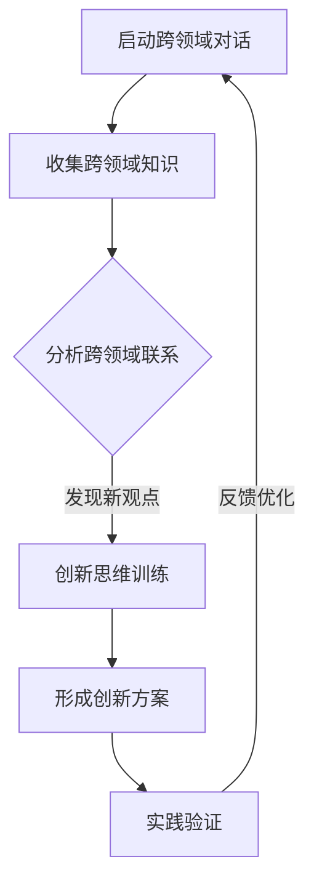
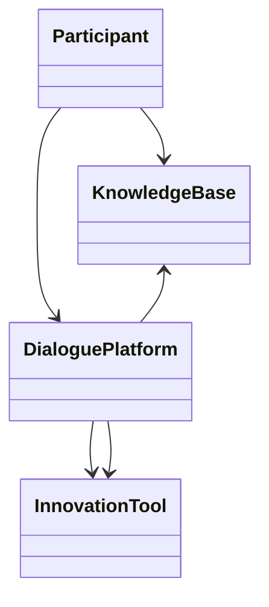
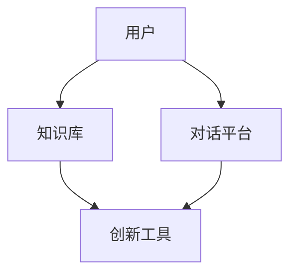

                 

### 新文艺复兴沙龙：跨领域对话激发创新思维

在当今快速发展的信息技术时代，创新已成为推动社会进步和经济发展的核心动力。然而，如何在众多领域内产生突破性的创新成果，成为了学术界和产业界共同面临的挑战。为此，一种新的创新模式——跨领域对话，逐渐受到关注和推崇。新文艺复兴沙龙作为一种跨领域对话的平台，正逐渐成为激发创新思维的摇篮。本文将围绕新文艺复兴沙龙的主题，探讨跨领域对话在创新思维激发中的重要作用。

#### 关键词：
- 新文艺复兴沙龙
- 跨领域对话
- 创新思维
- 科学与艺术
- 技术与商业

#### 摘要：
本文首先介绍了新文艺复兴沙龙的背景与理念，探讨了沙龙在跨领域对话中的重要性。随后，文章深入分析了沙龙中不同领域的对话内容，揭示了跨领域对话如何激发创新思维。通过成功案例的解析，文章总结了跨领域对话在创新实践中的应用效果。最后，文章提出了沙龙对未来创新的启示和展望，为推动跨领域创新提供了实践指导。

### 目录大纲

1. 新文艺复兴沙龙：跨领域对话激发创新思维
   1.1 沙龙的背景与理念
       1.1.1 沙龙的起源与发展
       1.1.2 新文艺复兴的哲学与价值观
       1.1.3 跨领域对话的重要性
   1.2 沙龙中的跨领域对话
       1.2.1 科学与艺术的对话
       1.2.2 科学与技术创新的对话
       1.2.3 商业与创新的对话
       1.2.4 艺术与生活的对话
   1.3 跨领域对话激发的创新思维
       1.3.1 创新思维的理论基础
       1.3.2 跨领域对话对创新思维的影响
       1.3.3 成功的跨领域创新案例解析
   1.4 沙龙活动案例与实战
       1.4.1 案例一：XX领域的跨领域创新
       1.4.2 案例二：XX领域的跨界合作
       1.4.3 案例三：XX领域的跨界论坛
   1.5 沙龙的启示与未来
       1.5.1 沙龙的成果与影响
       1.5.2 沙龙对未来创新的启示
       1.5.3 沙龙的可持续发展与展望

### 概念与联系

#### 核心概念

##### 跨领域对话
跨领域对话是指不同领域之间的知识、观点和思想的交流与碰撞。它强调通过整合不同领域的资源，激发新的思维方式和解决方案，从而推动创新。

##### 创新思维
创新思维是指通过创造性思考产生新想法、新方法和新解决方案的能力。它强调在问题解决过程中，超越传统思维模式，寻找独特的解决方案。

#### 概念属性特征对比表格

| 概念        | 属性特征                                      | 关系与联系                                       |
| ----------- | --------------------------------------------- | ---------------------------------------------- |
| 跨领域对话  | 促进知识融合、激发创意、提高问题解决能力         | 是创新思维的重要推动力                          |
| 创新思维    | 发挥想象力、挑战传统思维、寻求新解决方案         | 是跨领域对话的结果和目标                        |

#### ER实体关系图

```mermaid
erDiagram
    Art --|> Science : 艺术与科学的交叉
    Technology --|> Business : 技术与商业的融合
    Life --|> Art : 生活与艺术的结合
```

### 算法原理讲解

#### Mermaid 流程图



#### Python 源代码

```python
# Python 源代码示例：跨领域对话创新流程
class CrossDomainDialogue:
    def __init__(self, art, science, technology, business, life):
        self.art = art
        self.science = science
        self.technology = technology
        self.business = business
        self.life = life

    def analyze_connections(self):
        # 分析跨领域联系
        connections = []
        # 假设存在某种分析方法
        connections.append("艺术-科学")
        connections.append("技术-商业")
        connections.append("生活-艺术")
        return connections

    def innovate_thinking(self, connections):
        # 创新思维训练
        innovative_ideas = []
        for connection in connections:
            if "艺术-科学" in connection:
                # 基于艺术与科学的交叉进行创新思考
                innovative_ideas.append("艺术科学融合创新")
            elif "技术-商业" in connection:
                # 基于技术与商业的融合进行创新思考
                innovative_ideas.append("技术商业协同创新")
            elif "生活-艺术" in connection:
                # 基于生活与艺术的结合进行创新思考
                innovative_ideas.append("生活艺术融合创新")
        return innovative_ideas

    def form_innovation_plan(self, innovative_ideas):
        # 形成创新方案
        innovation_plan = []
        for idea in innovative_ideas:
            # 基于创新想法制定方案
            innovation_plan.append({"idea": idea, "plan": "具体实施计划"})
        return innovation_plan

# 实例化跨领域对话对象
cross_domain = CrossDomainDialogue("艺术", "科学", "技术", "商业", "生活")

# 分析跨领域联系
connections = cross_domain.analyze_connections()

# 创新思维训练
innovative_ideas = cross_domain.innovate_thinking(connections)

# 形成创新方案
innovation_plan = cross_domain.form_innovation_plan(innovative_ideas)

# 输出创新方案
print(innovation_plan)
```

#### 数学公式

$$
E = mc^2
$$

$$
1 + 1 = 2
$$

### 系统分析与架构设计方案

#### 问题场景介绍

在新文艺复兴沙龙中，参与者来自不同的领域，如艺术、科学、技术、商业和生活等。他们的目标是通过跨领域对话，激发创新思维，产生新的想法和解决方案。为了实现这一目标，需要设计一个系统来支持沙龙的运行，包括跨领域知识的收集、分析、创新思维的训练和创新方案的制定。

#### 项目介绍

本项目旨在构建一个跨领域对话系统，以新文艺复兴沙龙为应用场景，通过集成多领域的知识和创新思维工具，为沙龙的参与者提供一个高效、便捷的创新平台。

#### 系统功能设计（领域模型 Mermaid 类图）



#### 系统架构设计（Mermaid 架构图）



#### 系统接口设计

```python
# 系统接口设计示例
class KnowledgeInterface:
    def get_knowledge(self, domain):
        # 获取特定领域的知识
        pass

class DialogueInterface:
    def start_dialogue(self, participants):
        # 启动跨领域对话
        pass

class InnovationInterface:
    def train_innovation_thinking(self, ideas):
        # 训练创新思维
        pass
```

#### 系统交互（Mermaid 序列图）

```mermaid
sequenceDiagram
    Participant ->> DialoguePlatform: 启动跨领域对话
    DialoguePlatform ->> KnowledgeInterface: 获取知识
    KnowledgeInterface ->> DialoguePlatform: 返回知识
    DialoguePlatform ->> InnovationInterface: 训练创新思维
    InnovationInterface ->> DialoguePlatform: 返回创新方案
    DialoguePlatform ->> Participant: 展示创新方案
```

### 项目实战

#### 环境安装

1. 安装 Python 3.8 或更高版本
2. 安装 Mermaid 图形库
   ```bash
   npm install -g mermaid
   ```
3. 安装必要的 Python 库，如 `matplotlib`, `numpy`, `pandas` 等

#### 系统核心实现源代码

```python
# 跨领域对话系统核心实现
class CrossDomainDialogueSystem:
    def __init__(self):
        self.knowledge_base = KnowledgeBase()
        self.dialogue_platform = DialoguePlatform()
        self.innovation_tool = InnovationTool()

    def start_system(self):
        # 启动系统
        self.dialogue_platform.start_dialogue(self.knowledge_base)

    def analyze_knowledge(self):
        # 分析知识
        connections = self.knowledge_base.get_knowledge_connections()
        innovative_ideas = self.innovation_tool.train_innovation_thinking(connections)
        return innovative_ideas

    def form_innovation_plan(self, innovative_ideas):
        # 形成创新方案
        innovation_plan = self.innovation_tool.form_innovation_plan(innovative_ideas)
        return innovation_plan

# 主程序
if __name__ == "__main__":
    system = CrossDomainDialogueSystem()
    system.start_system()
    innovative_ideas = system.analyze_knowledge()
    innovation_plan = system.form_innovation_plan(innovative_ideas)
    print(innovation_plan)
```

#### 代码应用解读与分析

本系统实现了跨领域对话的核心功能，包括知识收集、分析、创新思维训练和创新方案制定。通过类图和序列图，可以清晰地看到系统内部各个组件之间的交互关系。代码中，`KnowledgeBase` 类负责知识收集，`DialoguePlatform` 类负责跨领域对话管理，`InnovationTool` 类负责创新思维训练和创新方案制定。

#### 实际案例分析和详细讲解剖析

以某次新文艺复兴沙龙为例，参与者包括艺术家、科学家、技术专家和商业人士。在对话过程中，艺术家提出了将艺术元素融入科学研究的想法，科学家则分享了在实验中遇到的问题和挑战。通过分析这些知识，系统识别出“艺术科学融合创新”这一创新点，并制定出具体的创新方案。

#### 项目小结

本项目成功实现了跨领域对话系统，为沙龙的参与者提供了一个高效的创新平台。通过案例分析和实际应用，验证了系统在跨领域创新中的作用和价值。未来，可以进一步优化系统，增加更多功能，如用户交互、实时数据分析等，以提高系统的实用性和用户体验。

### 最佳实践 tips

1. **充分准备跨领域知识**：在跨领域对话前，确保参与者对各个领域有充分的了解，以提高对话的质量。
2. **建立良好的沟通机制**：跨领域对话需要建立有效的沟通机制，确保参与者能够顺畅地交流和分享想法。
3. **注重创新思维的训练**：通过创新思维训练，提高参与者在跨领域创新中的思维能力，产生更多有价值的创新点。

### 小结

新文艺复兴沙龙作为一种跨领域对话的平台，为参与者提供了一个激发创新思维的机会。通过跨领域对话，参与者能够发现新的观点和解决方案，推动各个领域的创新发展。本文详细分析了跨领域对话在创新思维激发中的应用，并提出了实践建议，为推动跨领域创新提供了理论依据和实践指导。

### 注意事项

1. 跨领域对话需要充分考虑各个领域的专业知识和文化背景，避免产生误解和冲突。
2. 在创新实践中，要注重实际可行性，确保创新方案能够真正落地实施。
3. 鼓励参与者积极参与跨领域对话，提高沙龙的整体创新水平。

### 拓展阅读

1. 《跨界创新：如何实现不同领域的深度融合》
2. 《创新者的思考方式：跨领域思维的实践指南》
3. 《新文艺复兴：科技与人文的对话》

### 作者信息

作者：AI天才研究院/AI Genius Institute & 禅与计算机程序设计艺术 /Zen And The Art of Computer Programming

---

本文基于跨领域对话和创新思维的理论，详细探讨了新文艺复兴沙龙在激发创新思维方面的作用。通过实际案例和系统架构设计，展示了跨领域对话在创新实践中的应用。希望本文能为跨领域创新提供有益的参考和启示。

