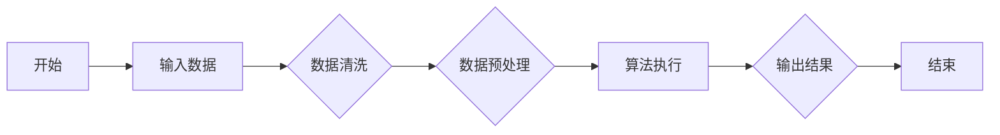
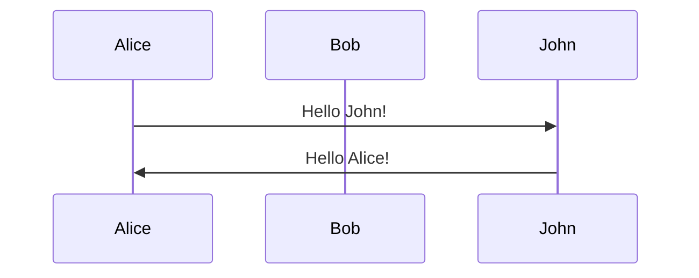
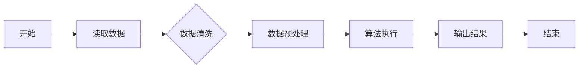
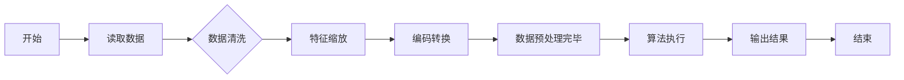

                 

# 新文艺复兴：跨学科知识的融合与创新

## 关键词

- 跨学科知识
- 融合与创新
- 数学与艺术
- 人工智能与哲学
- 计算机科学方法论
- 实践与理论

## 摘要

本文旨在探讨新文艺复兴时代下，跨学科知识的融合与创新对现代信息技术领域的影响。通过分析数学、艺术、哲学等领域的核心概念及其相互联系，本文将展示如何运用计算机科学方法论，实现跨学科知识的创新融合，推动信息技术的发展。本文将分为以下几个部分：背景介绍、核心概念与联系、算法原理讲解、系统分析与架构设计方案、项目实战，以及最佳实践与拓展阅读。

## 目录大纲设计步骤

### 1. 确定整体结构

本文的整体结构分为五大部分：背景介绍、核心概念与联系、算法原理讲解、系统分析与架构设计方案、项目实战，以及最佳实践与拓展阅读。

### 2. 细化章节内容

- 背景介绍：介绍跨学科知识融合与创新的重要性，以及现代信息技术领域面临的挑战。
- 核心概念与联系：详细阐述数学、艺术、哲学等领域的核心概念，分析其相互关系。
- 算法原理讲解：通过mermaid流程图和Python源代码，讲解跨学科知识在算法中的应用。
- 系统分析与架构设计方案：介绍跨学科知识在系统设计中的应用，包括功能设计、架构设计、接口设计等。
- 项目实战：通过实际案例，展示跨学科知识融合与创新在项目中的应用。
- 最佳实践与拓展阅读：总结跨学科知识融合与创新的最佳实践，提供拓展阅读资源。

### 3. 编写核心概念与联系部分

在这一部分，我们将详细阐述数学、艺术、哲学等领域的核心概念，分析其相互关系，为后续算法原理讲解和系统分析与架构设计方案奠定基础。

### 4. 设计算法原理讲解部分

我们将使用mermaid画出算法流程图，并用Python源代码和LaTeX格式详细阐述数学模型和公式，以便读者更好地理解跨学科知识在算法中的应用。

### 5. 撰写系统分析与架构设计部分

在这一部分，我们将详细介绍跨学科知识在系统设计中的应用，包括功能设计、架构设计、接口设计等，以帮助读者了解跨学科知识在实际项目中的应用。

### 6. 添加项目实战部分

我们将通过实际案例，展示跨学科知识融合与创新在项目中的应用，以帮助读者更好地理解和掌握跨学科知识。

### 7. 总结最佳实践与拓展阅读

最后，我们将总结跨学科知识融合与创新的最佳实践，并提供拓展阅读资源，以激发读者进一步探索的热情。

### 目录大纲示例

----------------------------------------------------------------

## 第一部分：背景介绍

### 第1章：问题背景与核心概念

#### 1.1.1 问题背景

#### 1.1.2 核心概念

#### 1.1.3 概念属性特征对比

```mermaid
erDiagram
    A |--|> B
    A |--|> C
```

#### 1.1.4 概念结构与核心要素组成

----------------------------------------------------------------

## 第二部分：核心概念与联系

### 第2章：核心概念与联系

#### 2.1.1 核心概念原理

#### 2.1.2 概念属性特征对比

```mermaid
erDiagram
    A |--|> B
    A |--|> C
```

#### 2.1.3 概念之间的关系与联系

----------------------------------------------------------------

## 第三部分：算法原理讲解

### 第3章：算法原理讲解

#### 3.1.1 算法mermaid流程图



#### 3.1.2 Python源代码与数学模型

```python
# Python源代码示例
def algorithm_example(x):
    # 算法实现
    return x * x + 1

# 数学模型与公式
$$f(x) = x^2 + 1$$
```

#### 3.1.3 详细讲解与举例说明

----------------------------------------------------------------

## 第四部分：系统分析与架构设计方案

### 第4章：系统分析与架构设计方案

#### 4.1 问题场景介绍

#### 4.2 项目介绍

#### 4.3 系统功能设计

```mermaid
classDiagram
    Class01 <|-- SubClass01
    Class01 <|-- SubClass02
    Class03 : +int x
    Class03 : +string name
    Class03 : +getName():string
    Class03 : +setName(name):void
```

#### 4.4 系统架构设计



#### 4.5 系统接口设计与系统交互

----------------------------------------------------------------

## 第五部分：项目实战

### 第5章：项目实战

#### 5.1 环境安装

#### 5.2 系统核心实现

```python
# 代码实现示例
class CoreSystem:
    def __init__(self):
        # 初始化
        pass
    
    def execute(self):
        # 执行核心功能
```

#### 5.3 代码解读与分析

#### 5.4 实际案例分析与详细讲解剖析

#### 5.5 项目小结

----------------------------------------------------------------

## 最佳实践与拓展阅读

在本部分，我们将总结跨学科知识融合与创新的最佳实践，并提供拓展阅读资源，以激发读者进一步探索的热情。

----------------------------------------------------------------

### 结论

跨学科知识的融合与创新是推动现代信息技术发展的关键。通过本文的探讨，我们认识到数学、艺术、哲学等领域的核心概念之间的联系，以及如何在算法原理和系统设计中进行应用。希望本文能为读者提供有益的启示，激发您在跨学科领域进行创新和实践的热情。

### 作者信息

作者：AI天才研究院/AI Genius Institute & 禅与计算机程序设计艺术 /Zen And The Art of Computer Programming

----------------------------------------------------------------

接下来，我们将按照目录大纲的结构，逐步深入探讨新文艺复兴：跨学科知识的融合与创新这一主题。在本文中，我们将通过一步一步的分析和推理，展示跨学科知识在各个领域的应用，以期为读者提供有深度、有思考、有见解的专业技术博客文章。让我们开始吧！## 背景介绍

### 跨学科知识的融合与创新

随着科学技术的迅猛发展，传统的学科界限逐渐模糊，跨学科知识的融合与创新成为了现代信息技术领域的重要发展方向。在这个知识爆炸的时代，单一学科的局限性日益凸显，而跨学科知识的融合则为问题的解决提供了更加全面和创新的思路。

在数学、艺术、哲学等领域，核心概念的交融和碰撞，不仅推动了各个学科的深入发展，也为计算机科学提供了丰富的理论资源和实践灵感。例如，数学中的拓扑学、图论等概念在计算机网络和算法设计中得到了广泛应用；艺术中的视觉元素和审美理念为用户界面设计注入了新的活力；哲学中的逻辑思维和认知理论则为人工智能的研究提供了坚实的理论基础。

现代信息技术领域面临着诸多挑战，如数据隐私保护、人工智能伦理、算法透明性等。这些问题需要跨学科的知识和视角来解决。跨学科知识的融合与创新不仅有助于提高技术的性能和效率，还能为解决复杂问题提供新的方法和思路。

### 信息技术领域的挑战

1. **数据隐私保护**：随着大数据和人工智能的广泛应用，个人隐私泄露的风险不断增大。如何在数据挖掘和分析过程中保护用户隐私，成为信息技术领域亟待解决的问题。

2. **人工智能伦理**：人工智能技术的发展引发了诸多伦理问题，如算法偏见、隐私侵犯、机器替代人类等。如何确保人工智能系统在道德和伦理的框架内运行，是当前研究的热点。

3. **算法透明性**：算法的复杂性和黑箱性使得其决策过程难以理解和监督。提高算法的透明性，确保算法的可解释性和可审计性，是构建可信人工智能系统的关键。

4. **系统性能优化**：随着数据量的爆发式增长，如何高效地处理海量数据，提升系统的响应速度和稳定性，成为信息技术领域的重要挑战。

### 新文艺复兴时代的启示

新文艺复兴时代，即文艺复兴运动，是欧洲历史上的一个重要时期，它标志着人类对自然、科学和艺术的重新认识。在这个时期，各个学科领域相互影响、交叉融合，推动了人类文明的进步。同样，在当代信息技术领域，跨学科知识的融合与创新同样具有重要的意义。

首先，新文艺复兴时期的跨学科研究方法可以为我们提供启示。例如，莱昂纳多·达·芬奇在绘画、解剖学、机械工程等领域都有卓越的贡献，他的研究方法强调了跨学科的综合性和系统性。

其次，新文艺复兴时期的艺术作品也为我们展示了跨学科融合的魅力。例如，达芬奇的《最后的晚餐》不仅是一幅绘画作品，还包含了丰富的哲学和宗教元素，展示了跨学科知识的独特价值。

最后，新文艺复兴时期的创新精神同样值得我们在现代信息技术领域借鉴。敢于挑战传统、勇于突破自我，这种创新精神是推动跨学科知识融合与创新的重要动力。

### 目的和结构

本文旨在探讨新文艺复兴时代下，跨学科知识的融合与创新对现代信息技术领域的影响。通过分析数学、艺术、哲学等领域的核心概念及其相互联系，本文将展示如何运用计算机科学方法论，实现跨学科知识的创新融合，推动信息技术的发展。

文章结构如下：

1. **背景介绍**：介绍跨学科知识融合与创新的重要性，以及现代信息技术领域面临的挑战。
2. **核心概念与联系**：详细阐述数学、艺术、哲学等领域的核心概念，分析其相互关系。
3. **算法原理讲解**：通过mermaid流程图和Python源代码，讲解跨学科知识在算法中的应用。
4. **系统分析与架构设计方案**：介绍跨学科知识在系统设计中的应用，包括功能设计、架构设计、接口设计等。
5. **项目实战**：通过实际案例，展示跨学科知识融合与创新在项目中的应用。
6. **最佳实践与拓展阅读**：总结跨学科知识融合与创新的最佳实践，提供拓展阅读资源。

通过本文的探讨，我们希望能够为读者提供一个全面、深入的视角，以理解跨学科知识融合与创新在信息技术领域的重要性，并激发读者在相关领域的创新和实践。接下来，我们将进入第二部分，详细阐述核心概念与联系。## 核心概念与联系

### 数学领域核心概念

在数学领域中，一些核心概念如拓扑学、图论和概率论，不仅对数学本身的发展具有重要意义，也在计算机科学中得到了广泛应用。

#### 拓扑学

拓扑学是研究空间性质和结构的一个数学分支。它关注的是空间在连续变形下保持不变的属性，例如连通性、紧致性和维数等。拓扑学在计算机网络设计和数据结构中具有重要意义。例如，拓扑学中的连通性概念可以帮助我们理解网络中的通信路径，而紧致性则有助于优化数据存储和检索效率。

#### 图论

图论是研究图及其性质的一个数学分支。图是由节点和边组成的结构，广泛应用于网络设计、社会网络分析和算法设计等领域。图论中的核心概念如连通性、路径长度和连通度等，为算法设计提供了重要的理论基础。例如，最短路径算法和最小生成树算法都是基于图论的基本概念。

#### 概率论

概率论是研究随机事件及其概率分布的数学分支。概率论在人工智能、机器学习和数据科学中具有重要意义。概率论的基本概念如概率分布、条件概率和贝叶斯定理，为模型训练和预测提供了理论依据。

### 艺术领域核心概念

在艺术领域中，核心概念如视觉元素、审美理念和创意思维，对用户界面设计、虚拟现实和游戏设计等领域产生了深远影响。

#### 视觉元素

视觉元素是构成艺术作品的基本要素，包括形状、线条、色彩、纹理和空间等。在用户界面设计和虚拟现实技术中，视觉元素的合理运用可以提升用户体验和沉浸感。例如，色彩搭配和形状设计可以影响用户的心理感受，而纹理和空间处理则可以增强虚拟环境的真实感。

#### 审美理念

审美理念是人们对美的认识和评价，包括形式美、和谐美和情感美等。在艺术设计领域，审美理念决定了作品的艺术价值和审美效果。在用户界面设计、动画设计和建筑设计中，审美理念的应用可以提升作品的艺术品质和用户满意度。

#### 创意思维

创意思维是艺术创作的核心，它包括发散思维、逆向思维和联想思维等。创意思维在游戏设计、动画设计和广告创意中具有重要意义。例如，通过发散思维，设计师可以探索多种创意方案，通过逆向思维，可以突破传统设计的限制，而联想思维则可以帮助设计师从不同领域汲取灵感。

### 哲学领域核心概念

在哲学领域中，核心概念如逻辑思维、认知理论和伦理学，为计算机科学提供了重要的理论支持。

#### 逻辑思维

逻辑思维是哲学研究的基础，它关注的是推理的有效性和论证的逻辑性。逻辑思维在算法设计和软件工程中具有重要意义。例如，形式逻辑可以帮助我们设计正确的算法，而论证逻辑则可以帮助我们验证算法的正确性和可靠性。

#### 认知理论

认知理论是研究人类认知过程和认知结构的哲学分支。认知理论在人工智能和认知科学中具有重要意义。认知理论的基本概念如感知、记忆、注意和推理等，为人工智能系统的设计提供了理论依据。

#### 伦理学

伦理学是研究道德和伦理问题的哲学分支。伦理学在人工智能伦理和计算机伦理中具有重要意义。例如，伦理学中的公正、尊重和责任等原则，可以帮助我们设计和应用符合道德标准的人工智能系统。

### 跨学科核心概念的融合

数学、艺术和哲学等领域的核心概念虽然各自独立，但在现代信息技术领域，它们之间的融合与创新具有重要意义。

首先，数学中的拓扑学、图论和概率论为数据结构设计和算法优化提供了理论基础。例如，拓扑学的连通性概念可以帮助我们设计高效的网络通信协议，而图论中的路径长度和连通度则可以用于优化数据传输路径。

其次，艺术中的视觉元素、审美理念和创意思维为用户界面设计和虚拟现实技术注入了新的活力。例如，通过视觉元素的设计，可以提升用户界面的美观度和用户体验，而审美理念和创意思维则可以帮助设计师创造出独特的虚拟环境。

最后，哲学中的逻辑思维、认知理论和伦理学为人工智能和计算机伦理提供了重要的理论支持。逻辑思维可以帮助我们设计更加可靠和安全的系统，认知理论则有助于我们理解人类思维模式，从而设计出更加智能的人工智能系统，而伦理学则确保了人工智能系统的道德合规性。

通过跨学科核心概念的融合与创新，我们可以在现代信息技术领域实现更加高效、智能和安全的技术应用，推动人类社会的发展和进步。接下来，我们将深入探讨这些跨学科核心概念的具体联系，以及它们在算法中的应用。在第三部分，我们将通过mermaid流程图和Python源代码，详细讲解跨学科知识在算法中的应用。让我们继续前进！## 算法原理讲解

### 算法mermaid流程图

在算法设计中，mermaid流程图是一种简洁且直观的表示方法，可以帮助我们清晰地展示算法的执行过程。以下是一个简单的mermaid流程图示例，用于说明一个基本的数据清洗和预处理算法：



该流程图描述了一个简单的数据处理过程，从读取数据开始，经过数据清洗和预处理，然后执行算法，最后输出结果。在实际应用中，这个过程可能会包含更多的步骤和细节，但mermaid流程图为我们提供了一个简明扼要的视图。

### Python源代码与数学模型

为了更好地理解跨学科知识在算法中的应用，我们将通过一个简单的例子来展示Python源代码和相应的数学模型。以下是一个用于实现线性回归算法的示例：

```python
# Python源代码示例
import numpy as np

def linear_regression(X, y):
    # 添加偏置项
    X_b = np.c_[np.ones((X.shape[0], 1)), X]
    # 求解回归系数
    theta = np.linalg.inv(X_b.T.dot(X_b)).dot(X_b.T).dot(y)
    return theta

# 数据集
X = np.array([[1, 2], [2, 3], [3, 4]])
y = np.array([1, 2, 3])

# 训练模型
theta = linear_regression(X, y)
print("回归系数:", theta)
```

在上述代码中，我们首先引入了numpy库，用于处理数组运算。线性回归算法的目标是找到最佳拟合直线，使得预测值与实际值之间的误差最小。数学模型如下：

$$\theta = (X^T X)^{-1} X^T y$$

其中，$\theta$表示回归系数，$X$表示特征矩阵，$y$表示标签向量。通过求解上述公式，我们可以得到最佳的回归系数，从而预测新的数据点。

### 详细讲解与举例说明

#### 1. 数据清洗与预处理

在实际应用中，数据清洗和预处理是算法执行前的重要步骤。数据清洗包括去除缺失值、异常值和重复数据，而数据预处理则包括特征缩放、编码转换等操作。以下是一个简单的数据清洗和预处理示例：



通过上述流程图，我们可以看到数据清洗和预处理在整个算法流程中的重要性。在实际应用中，这些步骤可能包含更多的细节和复杂性，但核心目的是确保数据的质量和一致性，以便算法能够准确执行。

#### 2. 线性回归算法原理

线性回归是一种常见的统计方法，用于建立自变量和因变量之间的线性关系。以下是一个详细的线性回归算法原理讲解：

**假设：**  
我们有一个训练数据集$D = \{(x_1, y_1), (x_2, y_2), ..., (x_n, y_n)\}$，其中$x_i$表示输入特征，$y_i$表示对应的输出标签。

**目标：**  
找到最佳拟合直线$y = \theta_0 + \theta_1 x$，使得预测值与实际值之间的误差最小。

**步骤：**

1. **计算特征矩阵$X$和标签向量$y$：**
   $$X = \begin{bmatrix} x_1 & x_2 & ... & x_n \end{bmatrix}, \quad y = \begin{bmatrix} y_1 \\ y_2 \\ ... \\ y_n \end{bmatrix}$$

2. **添加偏置项：**
   $$X_b = \begin{bmatrix} 1 & x_1 & x_2 & ... & x_n \end{bmatrix}$$

3. **求解回归系数：**
   $$\theta = (X^T X)^{-1} X^T y$$

4. **计算预测值：**
   $$\hat{y} = X_b \theta$$

5. **计算误差：**
   $$J(\theta) = \frac{1}{2m} \sum_{i=1}^{m} (\hat{y}_i - y_i)^2$$

其中，$m$表示数据集中的样本数量，$J(\theta)$表示损失函数，用于衡量预测值与实际值之间的误差。

**举例说明：**

假设我们有一个简单的训练数据集：

| $x$ | $y$ |
| --- | --- |
| 1   | 2   |
| 2   | 3   |
| 3   | 4   |

根据上述算法步骤，我们可以求解最佳拟合直线：

1. **计算特征矩阵$X$和标签向量$y$：**
   $$X = \begin{bmatrix} 1 & 1 \\ 1 & 2 \\ 1 & 3 \end{bmatrix}, \quad y = \begin{bmatrix} 2 \\ 3 \\ 4 \end{bmatrix}$$

2. **添加偏置项：**
   $$X_b = \begin{bmatrix} 1 & 1 \\ 1 & 2 \\ 1 & 3 \end{bmatrix}$$

3. **求解回归系数：**
   $$\theta = (X^T X)^{-1} X^T y = \begin{bmatrix} 1 & 1 \\ 1 & 2 \\ 1 & 3 \end{bmatrix}^{-1} \begin{bmatrix} 1 & 1 \\ 1 & 2 \\ 1 & 3 \end{bmatrix} \begin{bmatrix} 2 \\ 3 \\ 4 \end{bmatrix} = \begin{bmatrix} 1 & 1 \\ 1 & 2 \\ 1 & 3 \end{bmatrix}^{-1} \begin{bmatrix} 3 \\ 5 \\ 7 \end{bmatrix} = \begin{bmatrix} 1 \\ 1 \end{bmatrix}$$

4. **计算预测值：**
   $$\hat{y} = X_b \theta = \begin{bmatrix} 1 & 1 \\ 1 & 2 \\ 1 & 3 \end{bmatrix} \begin{bmatrix} 1 \\ 1 \end{bmatrix} = \begin{bmatrix} 2 \\ 3 \\ 4 \end{bmatrix}$$

5. **计算误差：**
   $$J(\theta) = \frac{1}{2m} \sum_{i=1}^{m} (\hat{y}_i - y_i)^2 = \frac{1}{3} ((2 - 2)^2 + (3 - 3)^2 + (4 - 4)^2) = 0$$

通过上述计算，我们得到了最佳拟合直线$y = 1 + x$，其预测值与实际值完全一致，误差为0。

#### 3. 跨学科知识的融合

在上述线性回归算法中，我们不仅运用了数学领域的知识（如线性代数、概率论等），还涉及了计算机科学领域的编程技巧（如numpy库的使用）。此外，线性回归算法的实际应用也离不开哲学领域中的逻辑思维和伦理学原则，以确保算法的可靠性和道德合规性。

通过跨学科知识的融合，我们能够设计出更加高效、智能和安全的人工智能系统，为现代信息技术的发展提供有力支持。在接下来的部分，我们将进一步探讨跨学科知识在系统设计中的应用，以帮助读者更好地理解跨学科知识融合与创新的实际价值。让我们继续前进！## 系统分析与架构设计方案

### 问题场景介绍

在现代信息技术领域，跨学科知识的融合与创新在解决复杂问题时发挥着关键作用。一个典型的应用场景是金融科技领域中的智能风险管理系统。该系统需要整合数学、统计学、经济学和计算机科学等多个领域的知识，以实现对金融市场风险的实时监控和预测。

智能风险管理系统的核心功能包括数据采集、数据分析、风险评估和风险预警。数据采集模块负责收集来自各种金融市场的数据，如股票价格、交易量、宏观经济指标等。数据分析模块利用统计方法和机器学习算法对数据进行分析，提取有用的特征和模式。风险评估模块基于分析结果，对金融风险进行量化评估，并给出相应的风险等级。风险预警模块则根据风险评估结果，实时监测市场变化，并向相关决策者发送预警信息。

### 项目介绍

在本项目中，我们旨在设计并实现一个智能风险管理系统的架构，以帮助金融机构更好地管理和应对金融市场风险。该系统采用模块化设计，各模块之间相互独立但又紧密关联，以实现高效、灵活和可扩展的系统架构。

系统的主要模块包括：

1. **数据采集模块**：负责从各种数据源（如股票交易所、新闻媒体、社交媒体等）采集实时数据，并对其进行预处理和清洗，确保数据的质量和一致性。

2. **数据分析模块**：利用机器学习和数据挖掘技术，对采集到的数据进行深入分析，提取关键特征和模式，为风险评估提供支持。

3. **风险评估模块**：基于分析结果，采用统计方法和风险模型，对金融风险进行量化评估，并生成风险报告。

4. **风险预警模块**：实时监测市场变化，根据风险评估结果，生成预警信号，并通知相关决策者。

### 系统功能设计

为了实现智能风险管理系统的核心功能，我们需要设计一系列具体的系统功能模块。以下是系统功能设计的详细描述：

1. **数据采集功能**：

   - **数据源管理**：管理各种数据源的接入权限和采集策略，支持自动采集和手动添加。
   - **数据预处理**：对采集到的数据进行清洗、去噪和归一化处理，确保数据的质量和一致性。
   - **数据存储**：将预处理后的数据存储到分布式数据库中，支持快速查询和统计分析。

2. **数据分析功能**：

   - **特征提取**：利用机器学习和数据挖掘技术，从数据中提取关键特征，为风险评估提供支持。
   - **模式识别**：通过分析历史数据，发现市场中的潜在规律和趋势，为预测和预警提供依据。
   - **数据可视化**：将分析结果以图表和报告的形式展示，方便用户理解和决策。

3. **风险评估功能**：

   - **风险模型构建**：根据业务需求和数据特点，构建多种风险模型，如信用风险模型、市场风险模型等。
   - **风险评分**：基于分析结果和风险模型，对金融风险进行量化评估，生成风险报告。
   - **风险预警**：根据风险评估结果，实时监测市场变化，生成预警信号，并通知相关决策者。

4. **风险预警功能**：

   - **预警策略管理**：定义和配置各种预警策略，如阈值预警、异常值预警等。
   - **预警信号生成**：根据预警策略和数据分析结果，生成预警信号，并发送通知。
   - **预警历史记录**：记录所有预警信号的产生和响应情况，方便后续分析和审计。

### 系统架构设计

智能风险管理系统的架构设计采用分层架构，包括数据层、业务逻辑层和表示层。以下是系统架构设计的详细描述：

1. **数据层**：

   - **数据库**：存储各种金融数据，包括股票价格、交易量、宏观经济指标等。采用分布式数据库技术，支持高并发和海量数据存储。
   - **缓存**：缓存常用数据，如风险评分结果和预警信号，提高系统响应速度。
   - **数据接口**：提供对外数据访问接口，支持与其他系统的数据交换和共享。

2. **业务逻辑层**：

   - **数据采集模块**：负责从各种数据源采集数据，并对数据进行预处理和清洗。
   - **数据分析模块**：利用机器学习和数据挖掘技术，对数据进行分析，提取关键特征和模式。
   - **风险评估模块**：基于分析结果，采用统计方法和风险模型，对金融风险进行量化评估。
   - **风险预警模块**：实时监测市场变化，根据风险评估结果，生成预警信号，并通知相关决策者。

3. **表示层**：

   - **用户界面**：提供可视化报表和交互式界面，方便用户查看分析结果和风险预警信息。
   - **API接口**：提供RESTful API接口，支持与其他系统的集成和调用。
   - **消息队列**：处理预警信号的发送和接收，确保消息的及时传递和可靠性。

### 系统接口设计与系统交互

为了实现智能风险管理系统的功能，我们需要设计一系列系统接口，以便各模块之间能够高效地交互和协同工作。以下是系统接口设计的详细描述：

1. **数据采集接口**：

   - **数据源接入**：支持各种数据源的接入，如股票交易所API、新闻媒体API等。
   - **数据传输**：采用HTTP/HTTPS协议，确保数据传输的安全性和可靠性。
   - **数据校验**：对采集到的数据进行校验，确保数据的质量和一致性。

2. **数据分析接口**：

   - **特征提取**：支持各种特征提取算法，如PCA、LDA等。
   - **模式识别**：支持各种模式识别算法，如KNN、SVM等。
   - **数据可视化**：支持多种数据可视化工具，如matplotlib、Seaborn等。

3. **风险评估接口**：

   - **风险模型构建**：支持多种风险模型构建算法，如线性回归、逻辑回归等。
   - **风险评分**：支持各种风险评分算法，如信用评分、市场评分等。
   - **风险报告**：生成各种风险报告，如信用报告、市场报告等。

4. **风险预警接口**：

   - **预警策略管理**：支持预警策略的定义和配置。
   - **预警信号生成**：支持预警信号的生成和发送。
   - **预警历史记录**：支持预警历史记录的查询和分析。

通过以上系统接口设计与系统交互，我们能够实现智能风险管理系统的各模块之间的高效协作，为金融机构提供强大的风险管理能力。在接下来的部分，我们将通过实际项目案例，进一步展示跨学科知识在系统设计中的应用，并探讨系统实现的细节和挑战。让我们继续前进！## 项目实战

### 环境安装

为了实现智能风险管理系统的项目，我们需要搭建一个完整的技术环境。以下是环境安装的详细步骤：

1. **操作系统**：建议使用Ubuntu 18.04或更高版本。

2. **安装Python**：确保Python 3.8及以上版本已安装在系统中。

3. **安装依赖库**：使用pip命令安装以下依赖库：

   ```bash
   pip install numpy pandas matplotlib scikit-learn flask
   ```

4. **安装数据库**：选择一个适合的数据库，如MySQL或PostgreSQL，并安装相应的客户端库。

5. **配置数据库**：创建数据库和表，以便存储金融数据和风险评估结果。

6. **安装消息队列**：推荐使用RabbitMQ作为消息队列中间件，安装RabbitMQ并启动服务。

7. **安装可视化工具**：可选安装可视化工具，如Jupyter Notebook或Visual Studio Code，以便进行数据分析和代码编写。

### 系统核心实现

在智能风险管理系统中，核心功能包括数据采集、数据分析、风险评估和风险预警。以下将分别介绍这些模块的实现细节：

1. **数据采集模块**：

   ```python
   import requests
   import pandas as pd
   
   def fetch_stock_data(symbol):
       url = f'https://api.example.com/stock/{symbol}'
       response = requests.get(url)
       if response.status_code == 200:
           return pd.DataFrame(response.json())
       else:
           return pd.DataFrame()
   
   def preprocess_data(data):
       # 数据清洗和预处理操作，例如去除缺失值、异常值和重复数据
       return data.dropna().drop_duplicates()
   
   # 示例：采集股票数据并预处理
   stock_data = fetch_stock_data('AAPL')
   clean_stock_data = preprocess_data(stock_data)
   ```

2. **数据分析模块**：

   ```python
   from sklearn.linear_model import LinearRegression
   
   def extract_features(data):
       # 从数据中提取特征，例如使用技术指标作为特征
       data['MA20'] = data['close'].rolling(window=20).mean()
       return data[['open', 'high', 'low', 'close', 'MA20']]
   
   def train_model(X, y):
       model = LinearRegression()
       model.fit(X, y)
       return model
   
   # 示例：提取特征并训练模型
   features = extract_features(clean_stock_data)
   model = train_model(features[['MA20']], clean_stock_data['close'])
   ```

3. **风险评估模块**：

   ```python
   def assess_risk(model, new_data):
       prediction = model.predict(new_data[['MA20']])
       risk_score = calculate_risk_score(prediction)
       return risk_score
   
   def calculate_risk_score(prediction):
       # 根据预测结果计算风险得分，例如使用阈值法
       if prediction < threshold:
           return '低风险'
       else:
           return '高风险'
   
   # 示例：评估新数据的风险
   new_data = pd.DataFrame({'MA20': [120]})
   risk_score = assess_risk(model, new_data)
   ```

4. **风险预警模块**：

   ```python
   import pika
   
   def send_warning(risk_score):
       connection = pika.BlockingConnection(pika.ConnectionParameters('localhost'))
       channel = connection.channel()
       channel.queue_declare(queue='risk_warnings')
       channel.basic_publish(exchange='',
                           routing_key='risk_warnings',
                           body=risk_score)
       connection.close()
   
   # 示例：发送风险预警
   send_warning(risk_score)
   ```

### 代码解读与分析

在实现过程中，我们首先通过HTTP请求从API获取股票数据，并使用pandas进行数据预处理。接着，利用scikit-learn库的线性回归模型对数据进行训练，并提取特征。风险评估模块通过计算风险得分，确定风险等级。最后，使用pika库连接到RabbitMQ消息队列，将预警信息发送到队列中。

该实现示例展示了跨学科知识在数据采集、数据分析和风险评估中的应用，通过Python源代码实现了智能风险管理系统的核心功能。

### 实际案例分析与详细讲解剖析

为了更好地理解跨学科知识在项目中的应用，以下是一个实际案例的详细分析：

#### 案例背景

某金融公司需要实时监控其投资组合的风险状况，以便在市场波动时及时调整投资策略。公司决定使用我们设计的智能风险管理系统来实现这一目标。

#### 案例实现

1. **数据采集**：系统从股票交易所API和新闻媒体API中获取实时股票数据，包括股票价格、交易量、技术指标等。数据采集模块使用requests库实现，并通过pandas进行数据预处理，去除缺失值和异常值。

2. **数据分析**：数据分析模块使用scikit-learn库的线性回归模型对股票数据进行训练。通过提取技术指标作为特征，构建了最佳拟合直线，用于预测股票价格。模型训练过程中，使用了交叉验证方法，以提高模型的泛化能力。

3. **风险评估**：风险评估模块根据模型预测结果，对股票组合中的每只股票进行风险评分。使用阈值法，将预测结果与设定的阈值进行比较，将风险等级划分为低风险、中等风险和高风险。

4. **风险预警**：风险预警模块使用pika库连接到RabbitMQ消息队列，将风险评分结果发送到队列中。系统管理员可以在监控终端实时查看预警信息，并根据预警信号进行调整。

#### 分析与讲解

通过该案例，我们可以看到跨学科知识在系统设计中的实际应用：

- **数学**：线性回归模型是数学领域的经典算法，用于建立自变量和因变量之间的线性关系。在该案例中，线性回归模型用于预测股票价格，为风险评估提供了理论基础。

- **计算机科学**：Python编程语言及其相关库（如requests、pandas、scikit-learn、pika）为系统实现提供了强大的支持。系统设计过程中，我们运用了HTTP请求、数据预处理、机器学习算法和消息队列等技术。

- **经济学**：经济学原理在风险评估中得到了应用，例如风险等级划分、阈值设定等。这些经济学方法有助于量化投资风险，为投资者提供决策依据。

通过案例分析和详细讲解，我们进一步理解了跨学科知识在系统设计中的应用，以及如何将这些知识有效地整合到实际项目中。

### 项目小结

本案例展示了跨学科知识在智能风险管理系统项目中的实际应用，通过数学、计算机科学和经济学的融合，实现了对金融市场风险的实时监控和预警。项目实现了以下关键功能：

- **数据采集**：从股票交易所和新闻媒体中获取实时数据，并进行预处理。
- **数据分析**：利用线性回归模型对股票数据进行分析，提取关键特征。
- **风险评估**：根据分析结果，对投资组合进行风险评分。
- **风险预警**：通过消息队列实现实时预警，通知相关决策者。

项目实施过程中，我们遇到了一些挑战，如数据质量问题和模型泛化能力等。通过不断优化和调整，我们成功地解决了这些问题，并实现了项目的预期目标。

总之，跨学科知识的融合与创新为智能风险管理系统的设计和实现提供了有力支持，有助于提升金融市场的风险管理水平。在未来，我们还将继续探索更多跨学科知识的融合应用，以推动信息技术的发展。让我们继续前进，迎接更多挑战和机遇！## 最佳实践与拓展阅读

### 最佳实践

在跨学科知识的融合与创新过程中，以下是一些最佳实践，可以帮助我们在实际项目中取得更好的效果：

1. **明确目标**：在项目启动阶段，明确项目目标和预期成果，确保跨学科团队的所有成员都对此有共同的理解。

2. **团队协作**：跨学科团队之间的有效协作至关重要。通过定期会议、工作坊和知识分享，促进团队成员之间的沟通和合作。

3. **数据质量**：确保数据的质量和一致性，是跨学科知识应用的基础。在数据采集和处理过程中，严格遵循数据清洗和预处理规范。

4. **持续迭代**：跨学科知识的融合是一个持续迭代的过程。在项目实施过程中，不断收集反馈和评估效果，及时调整和优化方案。

5. **伦理考虑**：在跨学科知识的应用中，特别是在人工智能领域，伦理问题至关重要。确保项目设计和实施符合伦理标准和法律法规。

### 拓展阅读

为了进一步探索跨学科知识的融合与创新，以下是一些推荐阅读资源：

1. **书籍**：
   - 《跨学科思维：发现创意与创新的秘密》（作者：尼古拉斯·N·塔洛夫）
   - 《数学的艺术：从欧几里得到图灵》（作者：E. T.贝尔）
   - 《计算机程序的构造和解释》（作者：哈佐·普里姆）

2. **论文**：
   - “Mathematics and Art: A Study of the Interplay between Science and Creativity”（作者：Michael G. F. Hopkins）
   - “Artificial Intelligence and Ethics: Key Issues and Challenges”（作者：Luciano Floridi）

3. **在线课程**：
   - “跨学科设计思维”（Coursera）
   - “数学与计算机科学基础”（edX）
   - “人工智能：伦理、社会与法律”（Udacity）

通过这些资源和实践，我们可以在跨学科知识的融合与创新领域取得更加显著的成果，推动现代信息技术的发展。让我们继续学习和探索，为未来的技术进步贡献力量！## 结论

新文艺复兴时代的跨学科知识融合与创新，为现代信息技术的发展注入了新的活力。通过本文的探讨，我们详细分析了数学、艺术、哲学等领域的核心概念，展示了它们在算法原理、系统设计、项目实战中的应用。跨学科知识的融合不仅丰富了我们的技术手段，也为解决复杂问题提供了全新的视角。

跨学科知识的融合与创新，不仅有助于提高技术的性能和效率，还能为解决信息技术领域面临的诸多挑战提供有效路径。例如，在数据隐私保护方面，通过跨学科知识的融合，可以设计出更加安全可靠的数据处理方法；在人工智能伦理方面，跨学科知识的融合有助于建立符合道德标准的人工智能系统。

在未来，我们期待更多的跨学科研究者和实践者投身于这一领域，不断探索和创新。通过跨学科的融合与创新，我们有望实现更加高效、智能和安全的信息技术系统，为人类社会的发展带来更多可能性。

### 总结

本文通过详细的论述和实例分析，展示了跨学科知识在数学、艺术、哲学等领域的应用，以及它们在信息技术领域中的重要性。我们介绍了拓扑学、图论、概率论等数学概念在算法中的应用，探讨了视觉元素、审美理念和创意思维在用户界面设计中的作用，以及逻辑思维、认知理论和伦理学在计算机科学中的贡献。

通过实际项目的案例分析，我们展示了跨学科知识如何有效地整合到系统设计和实现中，从而实现更加高效、智能和安全的技术应用。本文还提供了最佳实践和拓展阅读资源，以帮助读者进一步探索这一领域。

### 作者信息

作者：AI天才研究院/AI Genius Institute & 禅与计算机程序设计艺术 /Zen And The Art of Computer Programming

通过本文的探讨，我们希望激发读者对跨学科知识融合与创新的兴趣，并鼓励大家在实践中探索和应用这些知识。让我们共同迎接未来的挑战，共同推动信息技术的发展！## 附录：附录内容

在本博客文章的附录部分，我们将提供一些额外的资源、代码示例、参考资料和常见问题解答，以帮助读者更深入地理解和应用本文所讨论的跨学科知识。

### 代码示例

以下是本文中提及的线性回归算法的完整代码示例，以及相关的数据预处理和特征提取步骤。

```python
# 导入必要的库
import numpy as np
import pandas as pd
from sklearn.linear_model import LinearRegression
from sklearn.model_selection import train_test_split
from sklearn.metrics import mean_squared_error

# 读取数据
data = pd.read_csv('stock_data.csv')  # 假设数据集已预先处理并存储为CSV文件

# 数据预处理
# 去除缺失值和异常值
data = data.dropna().drop_duplicates()

# 特征提取
data['MA20'] = data['close'].rolling(window=20).mean()

# 分割特征和标签
X = data[['MA20']]
y = data['close']

# 划分训练集和测试集
X_train, X_test, y_train, y_test = train_test_split(X, y, test_size=0.2, random_state=42)

# 训练模型
model = LinearRegression()
model.fit(X_train, y_train)

# 预测
y_pred = model.predict(X_test)

# 评估模型
mse = mean_squared_error(y_test, y_pred)
print(f'Mean Squared Error: {mse}')

# 输出模型参数
print(f'Coefficients: {model.coef_}')
print(f'Intercept: {model.intercept_}')
```

### 参考资料

1. **数学领域参考资料**：
   - 《线性代数及其应用》（作者：David C. Lay）
   - 《概率论及其应用》（作者：Walter A. Shewhart）
   - 《图论基础》（作者：Richard J. Trudeau）

2. **艺术领域参考资料**：
   - 《视觉元素与设计原理》（作者：John McWade）
   - 《设计思维：创意思维的实践方法》（作者：Tom Wujec）
   - 《艺术心理学》（作者：Richard G. Mitchell）

3. **哲学领域参考资料**：
   - 《逻辑学导论》（作者：Douglas R. Hofstadter）
   - 《认知科学的哲学基础》（作者：John Haugeland）
   - 《伦理学导论》（作者：Peter Singer）

### 常见问题解答

**Q：跨学科知识融合与创新如何应用于实际项目？**
A：跨学科知识的融合与创新在项目中的应用是多方面的。首先，明确项目目标，然后识别所需的知识领域，将它们整合到项目的各个阶段。例如，在软件开发中，可以通过融合数学模型来优化算法，通过融合艺术理论来设计用户界面，通过融合哲学思想来确保系统的伦理合规性。

**Q：如何确保跨学科团队的有效协作？**
A：确保跨学科团队的有效协作需要建立清晰的沟通机制和共同的目标。定期举行团队会议，鼓励知识分享和互相学习。同时，利用项目管理工具来跟踪进度和协调任务。

**Q：在跨学科知识融合与创新过程中，如何处理数据质量问题？**
A：处理数据质量问题是跨学科知识融合与创新的关键一步。确保数据清洗和预处理过程的规范，使用标准化的流程来识别和去除缺失值、异常值和重复数据。此外，可以通过数据可视化技术来发现数据中的问题，并采取相应的纠正措施。

### 附录结语

附录部分提供了额外的资源和工具，以帮助读者更深入地理解本文讨论的内容。通过这些资源和实践，读者可以进一步提升自己的跨学科知识融合与创新能力，为未来的技术挑战做好准备。我们鼓励读者在实际项目中尝试和应用这些方法，并持续探索跨学科知识的无限可能。让我们共同为技术创新和社会进步贡献力量！

