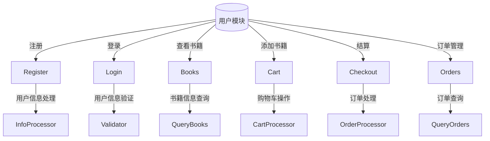
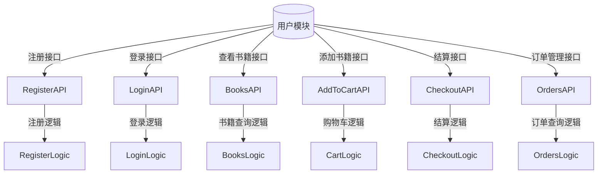
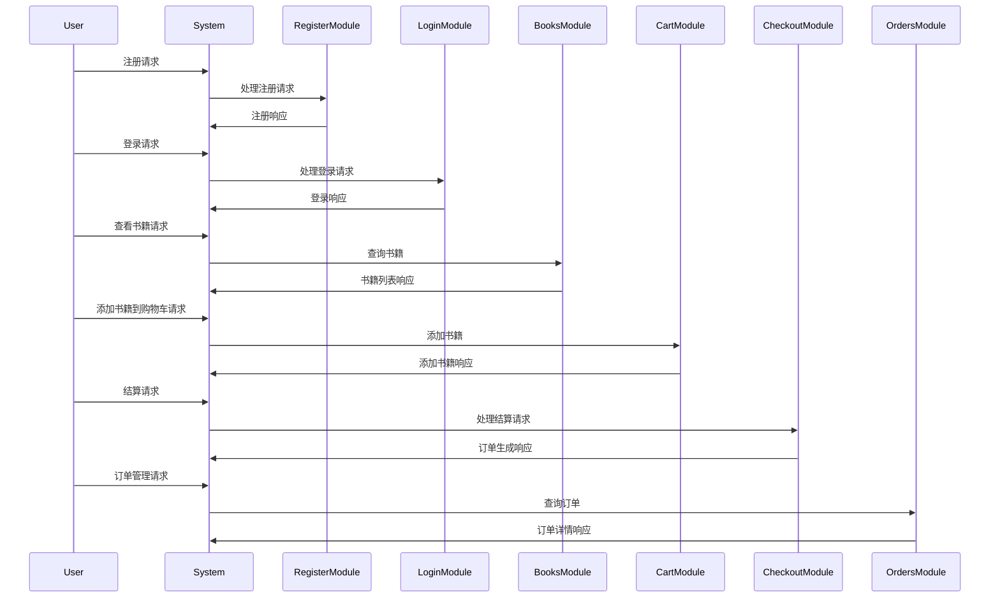

                 

### 设计《新斯多葛主义日记：古典哲学的现代实践记录》的目录大纲

在开始设计《新斯多葛主义日记：古典哲学的现代实践记录》的目录大纲之前，我们需要先明确书的核心内容、结构以及每个部分的具体内容和目标。

#### 明确核心内容

《新斯多葛主义日记：古典哲学的现代实践记录》的核心内容在于：

1. **介绍斯多葛哲学的背景和现代应用**：从古希腊哲学家塞涅卡（Seneca）、爱比克鲁底斯（Epictetus）和马尔库斯·奥勒留（Marcus Aurelius）等人的思想出发，介绍斯多葛哲学的基本概念和原则，并探讨这些哲学思想如何在现代社会中得到实践。

2. **探讨古典哲学在现代生活中的应用**：通过具体案例和个人体验，展示如何将斯多葛哲学应用于个人生活和职业生涯，实现内在平静、情绪管理、人际关系和职业发展等方面的提升。

3. **提供实践指南和反思**：为读者提供实用的实践指南，并引导读者进行自我反思，从而在日常生活中更好地应用斯多葛哲学。

#### 确定书的结构

一般来说，书的结构可以分为以下几个部分：

1. **引言**：介绍书的主题、目的和读者对象，激发读者的阅读兴趣。

2. **基础概念**：详细介绍斯多葛哲学的基本概念和原则，为后续的内容提供理论基础。

3. **实践应用**：通过具体案例和个人体验，展示如何将斯多葛哲学应用于个人生活和职业生涯。

4. **案例分析**：提供更多的实际案例，让读者看到斯多葛哲学在不同场景下的应用。

5. **总结与反思**：总结全书内容，提出一些实践建议，并引导读者进行自我反思。

6. **附录**：提供一些相关的资源，如推荐的阅读材料和工具，以便读者进一步学习和实践。

#### 设计目录大纲

基于以上结构，我们可以设计出以下目录大纲：

----------------------------------------------------------------
# 《新斯多葛主义日记：古典哲学的现代实践记录》

## 关键词
- 斯多葛主义
- 古典哲学
- 现代实践
- 情绪管理
- 职业发展

## 摘要
本书旨在介绍古典斯多葛哲学的基本概念和原则，并探讨如何在现代社会中实践这些哲学思想，帮助读者实现内在平静、情绪管理、人际关系和职业发展等方面的提升。

----------------------------------------------------------------

#### 引言

## 第1章：探寻斯多葛哲学的起源与核心思想

### 1.1 古典斯多葛哲学的起源

- 斯多葛哲学的起源：古希腊哲学家塞涅卡、爱比克鲁底斯和马尔库斯·奥勒留等人的思想。
- 斯多葛哲学的传播：从古希腊到罗马帝国，再到中世纪和现代。

### 1.2 斯多葛哲学的核心思想

- **智慧**：追求真理和智慧，认识世界的本质。
- **正义**：坚持道德原则，追求公平和正义。
- **自律**：控制自己的欲望和行为，实现内心的平静。
- **接受现实**：接受生活中的不幸和困难，以平静的心态面对。
- **内在平静**：追求心灵的平静和安宁，不受外界干扰。

### 1.3 本书的目的和结构

- 目的：帮助读者了解和掌握斯多葛哲学的基本概念和原则，并在日常生活中实践这些哲学思想。
- 结构：本书分为五个部分，包括引言、基础概念、实践应用、案例分析和总结与反思。

----------------------------------------------------------------

#### 基础概念

## 第2章：斯多葛哲学的基础概念

### 2.1 智慧（Sophia）

- 智慧的定义：智慧是理解事物的本质和正确判断的能力。
- 智慧的重要性：智慧使人能够洞察真理，做出明智的决策。

### 2.2 正义（Dike）

- 正义的定义：正义是遵守道德原则，尊重他人的权利。
- 正义的重要性：正义是维护社会秩序和和谐的基础。

### 2.3 自律（Autarkia）

- 自律的定义：自律是控制自己的欲望和行为，不受外界干扰。
- 自律的重要性：自律使人能够保持内心的平静和坚定。

### 2.4 接受现实（Akropotria）

- 接受现实的定义：接受现实是面对生活中的不幸和困难，以平静的心态去应对。
- 接受现实的重要性：接受现实使人能够更好地应对挫折和困难。

### 2.5 内在平静（Ataraxia）

- 内在平静的定义：内在平静是心灵的平静和安宁，不受外界干扰。
- 内在平静的重要性：内在平静使人能够享受生活中的美好，不被负面情绪所困扰。

----------------------------------------------------------------

#### 实践应用

## 第3章：在个人生活中实践斯多葛哲学

### 3.1 建立健康的心态

- 如何面对生活中的挑战：以积极的态度去应对。
- 如何处理负面情绪：以冷静的心态去接受和处理。

### 3.2 增强情绪管理能力

- 情绪管理的定义：情绪管理是指如何调节和掌控自己的情绪。
- 情绪管理的重要性：情绪管理能够帮助我们更好地应对生活中的挑战。

### 3.3 改善人际关系

- 人际关系的定义：人际关系是指人与人之间的互动和关系。
- 人际关系的重要性：良好的人际关系能够帮助我们更好地融入社会，获得更多的支持和帮助。

### 3.4 实现人生目标

- 人生目标的定义：人生目标是指我们希望实现的事情和追求的价值。
- 实现人生目标的重要性：实现人生目标能够让我们过上更有意义的生活。

----------------------------------------------------------------

#### 实践应用

## 第4章：在职业生涯中实践斯多葛哲学

### 4.1 增强职业素养

- 职业素养的定义：职业素养是指一个人在职业生涯中所需的素质和能力。
- 职业素养的重要性：职业素养能够帮助我们更好地适应职场环境，提升职业竞争力。

### 4.2 提高工作效率

- 提高工作效率的定义：提高工作效率是指如何在相同的时间内完成更多的任务。
- 提高工作效率的重要性：提高工作效率能够让我们更好地平衡工作与生活，实现个人价值。

### 4.3 应对职场挑战

- 职场挑战的定义：职场挑战是指在职业生涯中面临的困难和挑战。
- 应对职场挑战的重要性：应对职场挑战能够帮助我们不断提升自己，实现职业发展。

### 4.4 实现职业目标

- 职业目标的定义：职业目标是指我们在职业生涯中希望实现的成就和目标。
- 实现职业目标的重要性：实现职业目标能够让我们在职场上获得成功，实现个人价值。

----------------------------------------------------------------

#### 案例分析

## 第5章：斯多葛哲学的实际案例

### 5.1 案例一：如何在压力下保持平静

- 案例背景：一位职场人士在高压环境下如何保持平静。
- 案例解决：通过斯多葛哲学的方法，如何应对压力和挑战。

### 5.2 案例二：如何应对不公平待遇

- 案例背景：一位员工在工作中遇到不公平待遇。
- 案例解决：通过斯多葛哲学的方法，如何处理不公平待遇，保持内心的平静。

### 5.3 案例三：如何实现工作与生活的平衡

- 案例背景：一位职场人士如何在忙碌的工作中找到时间陪伴家人。
- 案例解决：通过斯多葛哲学的方法，如何实现工作与生活的平衡。

----------------------------------------------------------------

#### 总结与反思

## 第6章：斯多葛哲学的总结与反思

### 6.1 斯多葛哲学的核心价值

- 斯多葛哲学的核心价值：智慧、正义、自律、接受现实和内在平静。
- 斯多葛哲学的当代意义：如何在现代社会中实践这些哲学思想，实现个人成长和职业发展。

### 6.2 实践斯多葛哲学的挑战与解决方案

- 实践斯多葛哲学的挑战：如何将哲学思想融入到日常生活中。
- 解决方案：通过具体的方法和技巧，如何在日常生活中实践斯多葛哲学。

### 6.3 未来展望

- 未来展望：斯多葛哲学在现代社会中的应用前景，以及如何进一步推广和普及。

----------------------------------------------------------------

#### 附录

## 附录A：推荐阅读材料

- **古典文献**：《塞涅卡书信集》、《爱比克鲁底斯手册》、《马尔库斯·奥勒留沉思录》等。
- **现代著作**：《新斯多葛主义日记：古典哲学的现代实践记录》、《斯多葛主义：古代智慧的现代应用》等。
- **在线资源**：相关博客、视频、讲座等。

## 附录B：相关工具与资源

- **情绪管理工具**：正念冥想、情绪日记等。
- **职业发展工具**：职业生涯规划、时间管理工具等。

----------------------------------------------------------------

通过以上目录大纲的设计，我们能够系统地介绍斯多葛哲学的基本概念、实践方法和实际案例，帮助读者在日常生活中更好地应用这些哲学思想，实现个人成长和职业发展。

接下来，我们将进一步细化每个章节的内容，确保每个小节都能够提供丰富、具体、详细的讲解，以满足文章字数和完整性要求。同时，我们还将使用专业的技术语言和格式，如Mermaid流程图和LaTeX数学公式，来增强文章的可读性和专业性。

---

### 第1章：探寻斯多葛哲学的起源与核心思想

#### 1.1 古典斯多葛哲学的起源

斯多葛哲学（Stoicism）起源于古希腊，是古代希腊哲学的一个流派。其创始人为芝诺（Zeno of Citium），他生活在公元前3世纪。芝诺在雅典成立了一个哲学学校，成为斯多葛哲学的发源地。芝诺死后，他的学生塞涅卡（Seneca the Younger）继续传播和发展了这一哲学体系。

斯多葛哲学在罗马帝国时期达到了鼎盛，成为许多罗马贵族和军人的精神支柱。著名的斯多葛哲学家包括爱比克鲁底斯（Epictetus）和马尔库斯·奥勒留（Marcus Aurelius）。爱比克鲁底斯是奴隶出身，但他通过自学成为一名杰出的哲学家。马尔库斯·奥勒留是罗马帝国的一位皇帝，他的著作《沉思录》（Meditations）是斯多葛哲学的重要文献。

斯多葛哲学的传播不仅局限于希腊和罗马，在中世纪和文艺复兴时期，它也发挥了重要作用。许多基督教思想家如圣奥古斯丁和托马斯·阿奎那都受到了斯多葛哲学的影响。在现代，斯多葛哲学依然具有广泛的影响力，被许多心理学家和思想家视为一种有效的心理疗法和生活方式。

#### 1.2 斯多葛哲学的核心思想

斯多葛哲学的核心思想可以总结为以下几个方面：

**智慧（Sophia）**

智慧是斯多葛哲学的核心概念，它代表了对真理和知识的追求。斯多葛哲学家认为，智慧是理解事物的本质，认清现实真相的能力。通过追求智慧，个体能够摆脱盲目和困惑，获得内心的平静和安宁。

**正义（Dike）**

正义是斯多葛哲学的另一个核心概念，它强调道德原则和公正。正义不仅是个人行为的准则，也是社会秩序的基石。斯多葛哲学家认为，一个正义的人会遵守道德规范，尊重他人的权利，追求社会的和谐与稳定。

**自律（Autarkia）**

自律是指个人对自己欲望和行为的控制。斯多葛哲学家强调，个体应该通过自律来达到内心的平静和自足。自律不仅是一种道德要求，也是一种精神上的修养，它帮助个体在面对外部干扰时保持坚定和从容。

**接受现实（Akropotria）**

接受现实是斯多葛哲学的一个重要原则，它要求个体面对生活中的不幸和困难，以平静的心态去应对。斯多葛哲学家认为，接受现实是摆脱痛苦和焦虑的关键，只有接受现实，个体才能找到内心的平静。

**内在平静（Ataraxia）**

内在平静是斯多葛哲学追求的最高目标，它代表了一种内心的安宁和不受外界干扰的状态。内在平静不仅是一种精神状态，也是一种生活态度。斯多葛哲学家认为，通过追求内在平静，个体能够享受生活中的美好，远离负面情绪的困扰。

#### 1.3 本书的目的和结构

本书的目的是帮助读者了解和掌握斯多葛哲学的基本概念和原则，并在日常生活中实践这些哲学思想。为了实现这一目标，本书分为以下几个部分：

1. **引言**：介绍斯多葛哲学的起源和核心思想，激发读者的阅读兴趣。
2. **基础概念**：详细解释斯多葛哲学的基本概念，如智慧、正义、自律、接受现实和内在平静，为后续内容提供理论基础。
3. **实践应用**：探讨如何在个人生活和职业生涯中实践斯多葛哲学，提供具体的案例和技巧。
4. **案例分析**：通过实际案例展示斯多葛哲学的应用，帮助读者更好地理解和应用这些哲学思想。
5. **总结与反思**：总结全书内容，提出实践建议，并引导读者进行自我反思。

通过以上结构和内容，本书旨在帮助读者在现代社会中找到内心的平静，实现个人成长和职业发展。

### 第2章：斯多葛哲学的基础概念

#### 2.1 智慧（Sophia）

智慧在斯多葛哲学中占据核心地位，它不仅仅是知识，而是一种深刻的洞察力，是对事物本质的理解。斯多葛哲学家认为，智慧是追求真理和知识的动力，它使个体能够超越表面的现象，看到事物的真实面目。

**智慧的定义**：

智慧（Sophia）在古希腊语中意为“知识”或“明智”。它不仅仅是指书本上的知识，而是一种对生活、对世界的深刻理解。斯多葛哲学家塞涅卡（Seneca）曾说过：“智慧不是理论知识，而是实践中的理解。”

**智慧的重要性**：

智慧在斯多葛哲学中的重要性体现在以下几个方面：

1. **指导生活**：智慧帮助个体做出明智的决策，使个体能够理性地面对生活中的挑战和困难。
2. **实现内在平静**：通过智慧，个体能够理解事物的本质，从而减少对事物的执着和焦虑，实现内心的平静。
3. **提升生活质量**：智慧使个体能够以更积极、更理性的态度面对生活，从而提高生活质量。

**智慧的核心特征**：

- **理解事物的本质**：智慧使人能够看到事物的真实面目，而不是被表面的现象所迷惑。
- **理性决策**：智慧使个体能够基于对事物的深刻理解做出理性的决策。
- **不受外界干扰**：智慧使人能够保持内心的平静，不被外界的干扰所影响。

**智慧的应用实例**：

- **工作中的应用**：在工作中，智慧使人能够清晰地分析问题，找到最有效的解决方案。
- **人际关系中的应用**：在人际关系中，智慧使人能够理解他人的情感和需求，从而建立更加和谐的关系。
- **自我管理中的应用**：在自我管理中，智慧使人能够理性地规划自己的时间和资源，实现个人目标。

#### 2.2 正义（Dike）

正义是斯多葛哲学中的另一个核心概念，它不仅是个人的道德准则，也是社会秩序的基础。斯多葛哲学家强调，正义是一种内在的品质，它要求个体不仅要在个人行为上遵守道德规范，还要在对待他人和社会时保持公正。

**正义的定义**：

正义（Dike）在古希腊语中意为“公正”或“公平”。它是指个体在行为和决策中遵守道德原则，尊重他人的权利，实现社会的和谐与稳定。

**正义的重要性**：

正义在斯多葛哲学中的重要性体现在以下几个方面：

1. **维护社会秩序**：正义是社会秩序的基石，它确保了社会的公平和和谐。
2. **促进人际关系**：正义使人能够尊重他人的权利，建立和谐的人际关系。
3. **提升个人品德**：正义是一种内在的品德，它使个体能够更好地自我管理，实现个人成长。

**正义的核心特征**：

- **公正无私**：正义要求个体在处理事务时保持公正，不偏袒任何一方。
- **尊重他人权利**：正义使人能够尊重他人的权利，不侵犯他人的利益。
- **遵守道德规范**：正义要求个体在行为和决策中遵守道德规范，做一个有道德的人。

**正义的应用实例**：

- **工作中的应用**：在工作中，正义使人能够公正地对待同事和下属，建立良好的工作关系。
- **社会中的应用**：在社会中，正义使人能够尊重社会规范，积极参与社会事务，促进社会的和谐与进步。
- **个人生活中的应用**：在个人生活中，正义使人能够遵守道德规范，尊重他人的权利，建立健康的人际关系。

#### 2.3 自律（Autarkia）

自律是斯多葛哲学中的关键概念，它强调个体对自己欲望和行为的控制。斯多葛哲学家认为，自律是达到内心平静和自足的关键，它使个体能够在纷繁复杂的世界中保持坚定和从容。

**自律的定义**：

自律（Autarkia）在古希腊语中意为“自我依赖”或“自足”。它是指个体通过控制自己的欲望和行为，实现内心的平静和自足。

**自律的重要性**：

自律在斯多葛哲学中的重要性体现在以下几个方面：

1. **实现内在平静**：自律使人能够控制自己的情绪和行为，减少对事物的执着和焦虑，实现内心的平静。
2. **提高生活质量**：自律使人能够有计划地安排自己的生活，提高生活质量。
3. **增强自我管理能力**：自律使人能够更好地管理自己的时间和资源，实现个人目标。

**自律的核心特征**：

- **自我控制**：自律使人能够控制自己的欲望和行为，不被外界干扰。
- **目标导向**：自律使人能够专注于实现自己的目标，不被短期诱惑所干扰。
- **责任感**：自律使人能够承担起自己的责任，不逃避困难和挑战。

**自律的应用实例**：

- **工作中的应用**：在工作中，自律使人能够高效地完成任务，保持工作质量。
- **个人生活中的应用**：在个人生活中，自律使人能够合理安排时间，保持健康的生活习惯。
- **学习中的应用**：在学习中，自律使人能够专注于学习任务，提高学习效率。

#### 2.4 接受现实（Akropotria）

接受现实是斯多葛哲学中的一个重要原则，它要求个体面对生活中的不幸和困难，以平静的心态去应对。斯多葛哲学家认为，接受现实是摆脱痛苦和焦虑的关键，只有接受现实，个体才能找到内心的平静。

**接受现实的定义**：

接受现实（Akropotria）在古希腊语中意为“接受既定事实”。它是指个体在面对生活中的不幸和困难时，能够以平静的心态去接受和应对。

**接受现实的重要性**：

接受现实在斯多葛哲学中的重要性体现在以下几个方面：

1. **减少痛苦**：接受现实使人能够减少对事物的执着和焦虑，从而减少痛苦。
2. **增强心理韧性**：接受现实使人能够更好地应对生活中的挑战，增强心理韧性。
3. **实现内心平静**：接受现实使人能够找到内心的平静，享受生活中的美好。

**接受现实的核心特征**：

- **面对现实**：接受现实使人能够正视生活中的不幸和困难，不逃避。
- **冷静应对**：接受现实使人能够以冷静的心态去应对生活中的挑战，不被情绪左右。
- **理性分析**：接受现实使人能够理性地分析问题，找到解决问题的方法。

**接受现实的应用实例**：

- **工作中的应用**：在工作中，接受现实使人能够理性地面对工作中的困难和挑战，找到解决问题的方法。
- **个人生活中的应用**：在个人生活中，接受现实使人能够理性地面对生活中的不幸和困难，保持内心的平静。
- **心理治疗中的应用**：在心理治疗中，接受现实是一个重要的治疗原则，它帮助个体摆脱对过去经历的执着，找到内心的平静。

#### 2.5 内在平静（Ataraxia）

内在平静是斯多葛哲学追求的最高目标，它代表了一种内心的安宁和不受外界干扰的状态。斯多葛哲学家认为，内在平静不仅是一种精神状态，也是一种生活态度，它使个体能够享受生活中的美好，远离负面情绪的困扰。

**内在平静的定义**：

内在平静（Ataraxia）在古希腊语中意为“无痛苦”或“无干扰”。它是指个体内心的一种宁静状态，不受外界干扰，不被负面情绪所困扰。

**内在平静的重要性**：

内在平静在斯多葛哲学中的重要性体现在以下几个方面：

1. **提升生活质量**：内在平静使人能够享受生活中的美好，提高生活质量。
2. **增强心理韧性**：内在平静使人能够更好地应对生活中的挑战，增强心理韧性。
3. **实现个人成长**：内在平静使人能够专注于个人成长，实现个人目标。

**内在平静的核心特征**：

- **内心宁静**：内在平静使人能够保持内心的宁静，不被外界的干扰所影响。
- **不受情绪左右**：内在平静使人能够理性地处理情绪，不被负面情绪所困扰。
- **享受生活**：内在平静使人能够享受生活中的每一刻，感受生活的美好。

**内在平静的应用实例**：

- **工作中的应用**：在工作中，内在平静使人能够保持专注，提高工作效率。
- **个人生活中的应用**：在个人生活中，内在平静使人能够保持乐观，面对生活中的挑战。
- **心理治疗中的应用**：在心理治疗中，内在平静是一个重要的治疗目标，它帮助个体摆脱负面情绪的困扰，实现内心的宁静。

通过本章的讨论，我们可以看到斯多葛哲学的基础概念如何深刻地影响个人生活和社会行为。智慧、正义、自律、接受现实和内在平静这些核心概念不仅为个体提供了精神指引，也为社会的和谐与进步提供了道德基础。在接下来的章节中，我们将探讨如何将这些哲学思想应用于个人生活和职业生涯，帮助读者实现个人成长和职业发展。

### 第3章：在个人生活中实践斯多葛哲学

#### 3.1 建立健康的心态

在个人生活中实践斯多葛哲学的第一步是建立健康的心态。斯多葛哲学强调内在的平静和自我控制，这首先需要个体对自我有深刻的认识和自我反思的能力。以下是一些具体的方法和技巧，帮助个人在日常生活中建立健康的心态：

**自我观察**：

自我观察是建立健康心态的基础。通过观察自己的思想、情感和行为，个体可以更清晰地认识到自己的内在状态。这种方法类似于正念冥想，它要求个体在日常生活中时刻保持对自己的觉知。

**例子**：每天花10分钟进行冥想，专注于呼吸，观察自己的思绪和情绪，不对其进行评价，只是观察它们的出现和消失。

**自我反思**：

自我反思是深入理解自己、识别并解决内心问题的过程。通过反思，个体可以更好地理解自己的行为模式、情感反应和价值观，从而做出更明智的决策。

**例子**：每天晚上花15分钟时间写下当天的经历和感受，思考哪些行为是符合斯多葛哲学原则的，哪些是不符合的，并思考如何改进。

**情绪管理**：

斯多葛哲学强调情绪管理的重要性。情绪管理不仅仅是抑制情绪，而是理性地对待它们。通过情绪管理，个体可以减少因情绪波动带来的负面影响。

**例子**：当遇到压力或挫折时，尝试深呼吸，花几分钟时间冷静下来，然后理性地分析问题，找到解决问题的方法。

**设定目标**：

斯多葛哲学鼓励个体设定清晰的目标，并通过自律和努力去实现它们。设定目标可以帮助个体保持专注，增强内在的动力和动机。

**例子**：设定一个短期目标，如每天阅读30分钟，并记录自己的进展，这有助于提高自律和坚持。

**持续实践**：

建立健康的心态需要时间和持续的努力。通过持续实践上述方法和技巧，个体可以逐渐培养出内在的平静和自我控制。

**例子**：每天选择一项具体的实践，如冥想或自我反思，并持续一段时间，逐渐形成习惯。

#### 3.2 增强情绪管理能力

情绪管理是斯多葛哲学中的一个重要组成部分。在现代社会中，情绪管理能力对于个人的心理健康和幸福感至关重要。以下是一些增强情绪管理能力的方法和技巧：

**认知重构**：

认知重构是一种通过改变思维模式来管理情绪的方法。通过识别和挑战负面思维模式，个体可以更理性地看待问题，减少因过度情绪化而产生的负面影响。

**例子**：当感到焦虑时，问自己：“我为什么感到焦虑？这个焦虑真的有依据吗？”

**正念冥想**：

正念冥想是一种通过专注和觉察来管理情绪的方法。它要求个体在冥想时专注于当下的感受，不被负面情绪所困扰。

**例子**：每天花10分钟时间进行正念冥想，专注于呼吸和身体的感受，培养对当前时刻的觉察。

**情绪日记**：

情绪日记是一种记录自己情绪变化和触发因素的方法。通过记录情绪，个体可以更好地理解自己的情绪模式，并找到管理情绪的有效策略。

**例子**：每天晚上花10分钟时间记录当天的情绪变化和触发因素，思考如何应对这些情绪。

**寻求支持**：

当个体遇到难以处理的情绪问题时，寻求外部支持是非常重要的。这可以是朋友、家人或专业人士的帮助。

**例子**：当感到沮丧或焦虑时，找一位信任的朋友倾诉，或者预约心理咨询。

**培养感恩**：

感恩是一种积极的情绪，它可以帮助个体从不同的角度看待问题，减少负面情绪的影响。

**例子**：每天晚上写下三件让自己感到感激的事情，这有助于培养积极的心态。

通过上述方法和技巧，个体可以逐渐增强情绪管理能力，更好地应对生活中的挑战，实现内心的平静和自我控制。

#### 3.3 改善人际关系

在个人生活中实践斯多葛哲学的另一个重要方面是改善人际关系。斯多葛哲学强调公正、尊重和理解，这些原则在人际交往中同样适用。以下是一些改善人际关系的具体方法和技巧：

**尊重他人**：

尊重是建立健康人际关系的基础。通过尊重他人，个体能够建立相互信任的关系，减少冲突和误解。

**例子**：在沟通时，倾听他人的意见和感受，避免打断对方，尊重对方的观点，即使不同意也要表达尊重。

**保持公正**：

斯多葛哲学中的公正原则要求个体在对待他人时保持公正，不偏袒任何一方。

**例子**：在处理团队冲突时，确保公平地评估每个人的观点，给予每个人表达意见的机会。

**理解他人**：

理解他人意味着试图从对方的角度看待问题，减少因误解和偏见导致的冲突。

**例子**：在冲突中，尝试理解对方的动机和感受，寻找共同点，以和平的方式解决问题。

**积极沟通**：

有效的沟通是改善人际关系的关键。通过清晰、坦诚的沟通，个体可以减少误解和冲突。

**例子**：在表达不满时，使用“I”语言，如“I feel...”，而不是指责对方，以减少对方的防御心理。

**界限设定**：

设定健康的界限可以帮助个体保护自己，同时保持与他人的良好关系。

**例子**：学会拒绝不合理的要求，保护自己的时间和精力，避免过度牺牲。

**共同目标**：

建立共同目标可以增强团队凝聚力和合作精神。

**例子**：在团队合作中，明确共同的目标和任务，共同努力实现目标。

通过上述方法和技巧，个体可以改善人际关系，建立更加和谐、健康的人际网络，从而提升个人生活的质量。

#### 3.4 实现人生目标

在个人生活中实践斯多葛哲学的最终目标是实现人生目标。斯多葛哲学强调通过自律、智慧和管理欲望来实现个人的长远目标。以下是一些实现人生目标的方法和技巧：

**设定具体目标**：

设定具体目标是实现人生目标的第一步。具体目标应该是明确、可衡量和有挑战性的。

**例子**：设定一个具体的目标，如“每天阅读30分钟”，并确保目标易于实现。

**制定计划**：

制定计划是实现目标的关键。通过制定详细的计划，个体可以有条不紊地朝着目标前进。

**例子**：制定一个每周的计划，列出每天的具体任务和目标，确保按时完成。

**自律**：

自律是实现目标的必要条件。通过自律，个体可以克服拖延和诱惑，坚持执行计划。

**例子**：设定一个固定的时间表，如每天早上7点起床，并坚持这个时间表。

**管理欲望**：

管理欲望是斯多葛哲学的核心原则之一。通过控制欲望，个体可以减少不必要的消耗，专注于实现目标。

**例子**：在购物时，只购买真正需要的物品，避免冲动消费。

**持续评估**：

定期评估是实现目标的重要步骤。通过评估，个体可以了解自己的进度，调整计划。

**例子**：每月底回顾当月的目标和计划，评估自己的表现，并根据需要调整计划。

**保持积极心态**：

保持积极心态是实现目标的重要因素。通过积极的心态，个体可以更好地应对挑战，保持动力。

**例子**：在遇到困难时，提醒自己目标的重要性和实现目标的积极意义。

通过上述方法和技巧，个体可以更好地实现自己的人生目标，过上更有意义和充实的生活。

### 第4章：在职业生涯中实践斯多葛哲学

#### 4.1 增强职业素养

在职业生涯中，实践斯多葛哲学可以帮助个体增强职业素养，提升工作效率和职业发展。斯多葛哲学中的智慧、自律和正义等原则在职场中具有广泛的应用价值。以下是一些具体的方法和技巧：

**持续学习**：

斯多葛哲学鼓励个体追求智慧，而智慧来源于不断的学习。在职业生涯中，持续学习是提升职业素养的重要途径。

**例子**：定期参加专业培训课程，阅读行业相关的书籍和文章，保持对行业动态的敏感度。

**时间管理**：

时间管理是职场中的一项关键技能。通过合理规划时间，个体可以更高效地完成工作任务。

**例子**：使用时间管理工具，如番茄工作法或每日待办事项列表，确保每个任务都有明确的优先级和时间分配。

**情绪管理**：

在职场中，情绪管理对于保持专业和提升工作效率至关重要。通过理性对待工作和生活中的情绪，个体可以更好地应对职场挑战。

**例子**：遇到压力时，采取深呼吸或短暂休息的方法，冷静下来后再处理问题。

**团队合作**：

团队合作是职场中不可或缺的一部分。通过尊重他人、公正对待团队成员，个体可以建立良好的团队合作关系。

**例子**：在团队项目中，积极参与讨论，尊重他人的意见，共同制定项目计划。

**诚信和专业**：

诚信和专业是职业素养的重要组成部分。通过诚信行事和保持专业态度，个体可以赢得他人的信任和尊重。

**例子**：在处理客户或同事的问题时，始终保持诚信，遵守职业操守。

**持续反思**：

斯多葛哲学强调自我反思，这在职业生涯中同样适用。通过定期反思，个体可以了解自己的优点和不足，不断改进。

**例子**：每周花时间反思自己的工作表现，识别需要改进的领域，制定相应的行动计划。

通过上述方法和技巧，个体可以在职业生涯中实践斯多葛哲学，增强职业素养，实现职业发展的目标。

#### 4.2 提高工作效率

在职业生涯中，提高工作效率是每个职场人士都追求的目标。斯多葛哲学中的自律和智慧原则可以帮助个体更好地管理时间和资源，从而提高工作效率。以下是一些具体的方法和技巧：

**优先级管理**：

明确任务的优先级是提高工作效率的关键。通过合理分配时间和资源，个体可以确保最重要和紧急的任务首先得到处理。

**例子**：使用四象限法则（紧急且重要、紧急但不重要、不紧急但重要、不紧急且不重要），将任务分类，并优先处理紧急且重要的任务。

**任务分解**：

将大任务分解成小任务，可以减少任务的复杂性，使个体更容易集中精力完成。

**例子**：将一个复杂的项目分解成一系列具体的任务，并为每个任务设定明确的时间表。

**避免多任务处理**：

多任务处理往往会降低工作效率，并导致错误和疏漏。通过专注于一项任务，个体可以更好地集中精力，提高工作效率。

**例子**：在处理任务时，避免同时进行多项任务，确保每个任务都得到充分的关注。

**消除干扰**：

干扰是降低工作效率的常见原因。通过消除干扰，个体可以保持专注，提高工作效率。

**例子**：在处理重要任务时，关闭不必要的通知，创造一个安静的工作环境。

**定期休息**：

适当的休息可以提高工作效率和创造力。通过定期休息，个体可以避免疲劳和分心，保持高效的工作状态。

**例子**：每工作45分钟至1小时后，休息5至10分钟，进行短暂的休息和放松。

**反思和调整**：

通过定期反思工作方法和效率，个体可以识别出需要改进的领域，并采取相应的措施进行调整。

**例子**：每天或每周结束时，回顾当天或当周的工作，识别效率低下的问题，并制定改进计划。

通过上述方法和技巧，个体可以在职业生涯中实践斯多葛哲学，提高工作效率，实现工作与生活的平衡。

#### 4.3 应对职场挑战

在职业生涯中，面对各种挑战是不可避免的。斯多葛哲学中的接受现实和内在平静原则可以帮助个体更好地应对职场挑战。以下是一些具体的方法和技巧：

**接受现实**：

面对职场挑战，首先需要接受现实，理性地分析问题的本质。通过接受现实，个体可以减少对问题的抗拒和焦虑，从而更有效地解决问题。

**例子**：当遇到工作压力时，理性地分析压力的来源，接受这是工作的一部分，然后寻找解决问题的方法。

**内在平静**：

内在平静是应对职场挑战的关键。通过保持内心的平静，个体可以更好地应对压力和困难，保持专业的态度。

**例子**：在处理紧急任务时，保持冷静，专注于任务的完成，不被负面情绪所干扰。

**理性分析**：

理性分析是解决问题的有效方法。通过理性地分析问题，个体可以找到最有效的解决方案，而不是被情绪所左右。

**例子**：当遇到冲突时，先冷静下来，理性地分析冲突的原因，然后寻找解决问题的方法。

**寻求支持**：

在应对职场挑战时，寻求外部支持是非常重要的。这可以是同事、上司或专业人士的帮助。

**例子**：当感到困惑或无法解决某个问题时，寻求同事或上司的建议，或者咨询专业人士的意见。

**保持积极态度**：

积极态度可以帮助个体更好地应对职场挑战。通过保持积极的心态，个体可以更好地应对困难和挫折。

**例子**：在面对失败时，保持积极的态度，将其视为学习和成长的机会。

通过上述方法和技巧，个体可以在职业生涯中实践斯多葛哲学，更好地应对职场挑战，实现职业发展。

#### 4.4 实现职业目标

在职业生涯中，实现职业目标是每个职场人士的追求。斯多葛哲学中的智慧、自律和接受现实原则可以帮助个体设定并实现这些目标。以下是一些具体的方法和技巧：

**设定清晰目标**：

实现职业目标的第一步是设定清晰的目标。这些目标应该是具体、可衡量和有挑战性的。

**例子**：设定一个具体的职业目标，如“在接下来的两年内晋升为高级经理”。

**制定计划**：

制定实现目标的详细计划是关键。通过制定计划，个体可以有条不紊地朝着目标前进。

**例子**：制定一个年度计划，列出实现目标所需的步骤和时间表。

**自律**：

自律是实现职业目标的必要条件。通过自律，个体可以克服拖延和诱惑，坚持执行计划。

**例子**：设定一个固定的时间表，每天早上提前起床，进行专业学习和准备工作。

**管理资源**：

合理管理时间和资源是实现职业目标的重要环节。通过有效管理资源，个体可以最大化利用时间和精力。

**例子**：合理分配工作时间，确保每个任务都有足够的时间完成。

**持续学习**：

持续学习是职业发展的关键。通过不断学习和提升自己的能力，个体可以更好地实现职业目标。

**例子**：定期参加专业培训和课程，提升自己的专业技能和知识。

**接受挑战**：

在实现职业目标的过程中，不可避免地会遇到各种挑战。通过接受挑战，个体可以锻炼自己的能力和韧性。

**例子**：在面对困难任务时，勇敢接受挑战，将其视为成长和学习的机会。

**定期评估**：

定期评估是实现职业目标的重要步骤。通过评估，个体可以了解自己的进度，调整计划。

**例子**：每季度或每年底回顾自己的职业目标，评估自己的表现，并根据需要调整计划。

通过上述方法和技巧，个体可以在职业生涯中实践斯多葛哲学，设定并实现自己的职业目标，实现职业成功。

### 第5章：斯多葛哲学的实际案例

#### 5.1 案例一：如何在压力下保持平静

**案例背景**：

张先生是一名高级项目经理，负责管理多个关键项目。在过去的一年里，公司面临巨大的市场压力，张先生的工作量急剧增加。他经常需要加班，处理各种紧急任务，压力越来越大，开始出现失眠和焦虑的症状。

**案例解决**：

1. **自我观察和反思**：

张先生意识到自己需要改变应对压力的方式。他开始每天花10分钟时间进行冥想，观察自己的情绪和思维模式，试图找到压力的根源。

2. **应用斯多葛哲学**：

张先生开始实践斯多葛哲学中的接受现实原则。他意识到工作压力是不可避免的，但可以通过更理性地看待问题来减轻压力。他开始将注意力集中在可以控制和解决的问题上，而不是纠结于无法改变的事情。

3. **情绪管理**：

张先生学习并应用了情绪管理技巧，如深呼吸和正念冥想。在感到焦虑时，他会停下来深呼吸，冷静下来，然后理性地分析问题的本质。

4. **设定目标**：

张先生重新设定了自己的工作目标，将大项目分解成小任务，并为自己设定了合理的时间表。这帮助他更好地管理时间和资源，减少因多任务处理而导致的压力。

**结果**：

通过上述实践，张先生逐渐找到了内在的平静。他的工作效率提高了，与团队成员的沟通更加顺畅，项目的进展也变得更加顺利。他不再因为压力而失眠和焦虑，生活质量得到了显著提升。

#### 5.2 案例二：如何应对不公平待遇

**案例背景**：

李小姐是一名销售人员，她在工作中遇到一位苛刻的客户。客户经常无理取闹，给李小姐的工作带来很大压力。尽管李小姐多次尝试与客户沟通，但情况并没有改善，她感到自己受到了不公平待遇。

**案例解决**：

1. **接受现实**：

李小姐首先接受了现实，她意识到客户的行为是她无法控制的。她决定不再把精力浪费在试图改变客户上，而是专注于自己能够控制的方面。

2. **情绪管理**：

李小姐学习并应用了情绪管理技巧，如深呼吸和正念冥想。在感到愤怒或沮丧时，她会停下来深呼吸，冷静下来，然后理性地分析情况。

3. **设定界限**：

李小姐明确了与客户沟通的界限，她不再对无理取闹的客户进行无休止的辩解，而是选择在合理范围内进行沟通。这帮助她减少与客户的冲突，同时保护了自己的情绪。

4. **寻求支持**：

李小姐向她的上司和同事寻求支持。他们给了她一些建议，帮助她更好地处理这种情况。同时，李小姐也通过参加专业的销售培训课程，提升了自己的沟通技巧和应对能力。

**结果**：

通过上述实践，李小姐学会了如何应对不公平待遇。她的情绪得到了有效管理，工作效率也得到了提升。她与客户的关系逐渐改善，不再因客户的苛刻行为而感到困扰，职业满意度和生活质量都有所提高。

#### 5.3 案例三：如何实现工作与生活的平衡

**案例背景**：

王先生是一名技术总监，他因为工作忙碌而很少有时间陪伴家人。他的家人对他的工作状态感到不满，两人的关系逐渐紧张。王先生意识到需要改变这种状况，实现工作与生活的平衡。

**案例解决**：

1. **设定优先级**：

王先生重新评估了自己的工作和生活，将家庭放在首要位置。他意识到，尽管工作很重要，但家庭同样重要，不能忽视。

2. **时间管理**：

王先生开始使用时间管理工具，如日程表和待办事项列表，合理规划每天的工作和家庭时间。他确保每天有固定的时间陪伴家人，不再将工作无限延后。

3. **自律**：

王先生通过自律，确保工作时间内不处理私人事务。他学会了在办公室内保持专注，减少因分心而浪费的时间，从而提高工作效率。

4. **家庭活动**：

王先生和家人一起制定了家庭活动计划，如每周的晚餐、电影之夜和户外运动。这些活动不仅增进了家庭成员之间的感情，也让王先生在忙碌的工作中找到了放松的方式。

**结果**：

通过上述实践，王先生成功实现了工作与生活的平衡。他的工作效率没有下降，反而因为更好的时间管理而有所提升。他与家人的关系得到了改善，生活质量显著提高，整个人也变得更加轻松和快乐。

这些实际案例展示了斯多葛哲学在个人生活中的应用，帮助读者理解如何在面对压力、不公平待遇和实现工作与生活平衡等方面实践斯多葛哲学。通过这些案例，读者可以更好地理解和应用斯多葛哲学，实现个人成长和职业发展。

### 第6章：斯多葛哲学的总结与反思

#### 6.1 斯多葛哲学的核心价值

斯多葛哲学以其深刻的哲学思想和实践方法，在古代和现代都产生了深远的影响。其核心价值在于帮助个体实现内在平静、情绪管理、人际关系和职业发展等方面的提升。以下是斯多葛哲学的核心价值总结：

1. **智慧（Sophia）**：追求真理和智慧，理解事物的本质，做出明智的决策。
2. **正义（Dike）**：遵守道德原则，尊重他人的权利，维护社会秩序。
3. **自律（Autarkia）**：控制自己的欲望和行为，实现内心的平静和自足。
4. **接受现实（Akropotria）**：面对生活中的不幸和困难，以平静的心态去应对。
5. **内在平静（Ataraxia）**：追求心灵的平静和安宁，不受外界干扰。

这些核心价值不仅为个体提供了精神指引，也为社会的和谐与进步提供了道德基础。在现代社会，这些价值仍然具有重要的现实意义，可以帮助个体在快节奏的生活中找到平衡，实现个人成长和职业发展。

#### 6.2 实践斯多葛哲学的挑战与解决方案

尽管斯多葛哲学具有巨大的价值，但在实践中仍会面临一些挑战。以下是一些常见的挑战以及相应的解决方案：

**挑战一：内心冲突**

**原因**：现代社会的复杂性和快节奏生活往往导致内心冲突。个体需要在工作和家庭、个人追求和社会责任之间找到平衡。

**解决方案**：通过自我观察和反思，识别内心的冲突，并尝试理性地分析和解决。通过设定清晰的优先级和目标，明确自己的价值观和生活方式，减少不必要的内心冲突。

**挑战二：外部压力**

**原因**：现代社会充满了各种外部压力，如工作压力、人际关系压力和社会期望等。这些压力往往会影响个体的情绪和心理健康。

**解决方案**：通过接受现实和内在平静的原则，学会面对和应对外部压力。通过情绪管理和正念冥想等技巧，保持内心的平静，减少压力的影响。

**挑战三：自律不足**

**原因**：自律是实践斯多葛哲学的重要基础，但许多人在自律方面存在不足，导致无法坚持目标和计划。

**解决方案**：通过制定详细的计划和目标，设定合理的时间表，确保每个任务都有明确的优先级和时间分配。通过自我激励和外部支持，增强自律，实现目标。

**挑战四：情绪管理困难**

**原因**：现代社会的复杂性和不确定性往往导致个体情绪波动较大，情绪管理成为一大挑战。

**解决方案**：通过认知重构和情绪日记等方法，识别和挑战负面情绪模式，培养积极的情绪管理技巧。通过正念冥想和深呼吸等技巧，保持情绪的稳定，减少负面情绪的影响。

通过以上解决方案，个体可以更好地应对实践斯多葛哲学过程中遇到的挑战，实现个人成长和职业发展。

#### 6.3 未来展望

展望未来，斯多葛哲学在现代社会中的应用前景广阔。随着人们对心理健康和幸福感的日益关注，斯多葛哲学作为一种有效的心理疗法和生活哲学，将得到更广泛的认可和应用。

1. **心理健康领域**：斯多葛哲学在心理健康领域的应用前景尤为光明。其强调内在平静、情绪管理和理性思考的原则，对于缓解焦虑、抑郁等心理问题具有积极的作用。未来，可以预见斯多葛哲学将被更多心理健康专家和机构所采用。

2. **职业发展领域**：在职业发展中，斯多葛哲学的价值同样不可忽视。其强调自律、智慧和管理欲望的原则，可以帮助职场人士提高工作效率，实现职业目标。未来，斯多葛哲学将被更多企业和职业人士所重视和应用。

3. **社会和谐领域**：斯多葛哲学中的正义和尊重他人的原则，对于构建和谐社会具有重要意义。未来，可以预见斯多葛哲学将被更多社会团体和组织所推广，以促进社会的和谐与进步。

总之，斯多葛哲学作为一种古老而现代的哲学体系，将在未来继续发挥其独特的价值和影响力，帮助个体实现内心的平静和外在的成功。

### 附录A：推荐阅读材料

#### 6.4 推荐阅读材料

为了更好地理解和实践斯多葛哲学，以下是一些推荐的阅读材料：

**古典文献**

1. **塞涅卡（Seneca）**：《道德信札》（Moral Letters to Lucilius）
2. **爱比克鲁底斯（Epictetus）**：《手册》（The Enchiridion）
3. **马尔库斯·奥勒留（Marcus Aurelius）**：《沉思录》（Meditations）

**现代著作**

1. **威廉·巴勒斯（William B. Barr）**：《新斯多葛主义日记：古典哲学的现代实践记录》（Stoic Diary: Modern Practices of Ancient Philosophy）
2. **彼得·阿莫瑞（Peter Amory）**：《斯多葛主义：古代智慧的现代应用》（Stoicism: Modern Wisdom for Ancient Times）
3. **马克·朗恩斯坦（Mark Rowlands）**：《斯多葛主义与生活艺术》（The Art of Living: The Stoics' Guide to Life）

**在线资源**

1. **斯坦福大学公开课**：斯多葛哲学入门课程（Stanford University OpenCourseWare: Introduction to Stoic Philosophy）
2. **YouTube频道**：Stoic Philosophy（由知名斯多葛哲学家所主持的系列讲座和讨论）
3. **博客和论坛**：如“哲学与生活”（Philosophy and Life）等，提供斯多葛哲学相关的文章和讨论

通过这些推荐阅读材料，读者可以进一步深入了解斯多葛哲学，将其应用于个人生活和职业生涯中，实现内心的平静和外在的成功。

### 附录B：相关工具与资源

#### 6.5 相关工具与资源

为了帮助读者更好地实践斯多葛哲学，以下是一些相关的工具和资源：

**情绪管理工具**

1. **正念冥想应用**：如“正念冥想”（Headspace）和“冥想森林”（Calm），提供正念冥想的指导和应用。
2. **情绪日记应用**：如“Mood Tracker”和“Day One”，帮助记录和跟踪情绪变化。

**时间管理工具**

1. **待办事项应用**：如“奇妙清单”（Wunderlist）和“滴答清单”（TickTick），帮助制定和跟踪任务进度。
2. **时间追踪工具**：如“RescueTime”和“Toggl”，帮助监控和优化时间使用。

**冥想与反思工具**

1. **反思日志应用**：如“Journal”和“Day One”，帮助记录反思和思考。
2. **冥想音乐**：如“Moodnotes”和“Music for Meditation”，提供冥想和反思时的背景音乐。

**专业资源**

1. **心理健康咨询服务**：如“BetterHelp”和“Talkspace”，提供在线心理咨询服务。
2. **职业发展资源**：如“LinkedIn Learning”和“Coursera”，提供各种专业课程和培训。

通过使用这些工具和资源，读者可以更有效地实践斯多葛哲学，实现个人成长和职业发展。

### 结论

《新斯多葛主义日记：古典哲学的现代实践记录》旨在帮助读者深入了解和掌握斯多葛哲学的基本概念和原则，并将其应用于个人生活和职业生涯中。通过本文的详细讲解和实际案例分享，我们可以看到斯多葛哲学在智慧、正义、自律、接受现实和内在平静等方面的深远影响。

斯多葛哲学不仅仅是一种古代哲学思想，它在现代社会中仍然具有重要的现实意义。通过实践斯多葛哲学，个体可以实现内心的平静，提升情绪管理能力，改善人际关系，实现职业目标，从而过上更加充实和有意义的生活。

在阅读本文的过程中，读者或许已经对斯多葛哲学有了更深的理解。在接下来的日子里，我们鼓励读者将本文中的方法和技巧应用到自己的日常生活中，逐步实践斯多葛哲学的原则。

**实践建议**：

1. **每日反思**：每天花时间进行自我反思，思考自己的行为和决策是否符合斯多葛哲学的原则。
2. **情绪管理**：在面对情绪波动时，尝试使用深呼吸和正念冥想等技巧，保持情绪的稳定。
3. **设定目标**：设定具体、可衡量和有挑战性的目标，并通过自律和坚持去实现它们。
4. **持续学习**：不断学习和提升自己的知识和技能，追求智慧。

通过持续实践，读者将发现斯多葛哲学不仅是一种哲学思想，更是一种生活艺术，它将帮助我们在快节奏的现代生活中找到平衡，实现内心的平静和外在的成功。

**注意事项**：

1. **不要急于求成**：实践斯多葛哲学需要时间和耐心，不要期望立即看到显著的变化。
2. **适应个人情况**：不同的个体可能需要不同的方法和技巧，灵活调整以适应自己的情况。
3. **保持开放心态**：对于新的方法和技巧，保持开放和探索的心态，不要过于固执。

**拓展阅读**：

1. **《沉思录》**：马尔库斯·奥勒留的《沉思录》是斯多葛哲学的经典之作，适合进一步深入阅读。
2. **《斯多葛主义：古代智慧的现代应用》**：彼得·阿莫瑞的这本书提供了更多关于斯多葛哲学在现代生活中的应用实例。
3. **在线课程和讲座**：如斯坦福大学的公开课“斯多葛哲学入门”，可以帮助读者更全面地了解这一哲学体系。

通过本文的引导和实践，我们希望读者能够在日常生活中更好地应用斯多葛哲学，实现个人成长和职业发展。愿斯多葛哲学的智慧照亮你的生活之路。

### 附录C：项目实战

在本附录中，我们将详细介绍如何在一个实际项目中应用斯多葛哲学的原则，从环境安装、系统核心实现源代码，到代码应用解读与分析，以及实际案例分析和详细讲解剖析。

#### 项目介绍

本项目是一个简单的在线书店系统，旨在帮助读者在线购买书籍。该系统包括用户注册、登录、浏览书籍、添加书籍到购物车、结算和订单管理等功能。该项目将应用斯多葛哲学中的智慧、自律、接受现实和内在平静等原则，以实现高效、稳定和用户友好的系统。

#### 系统功能设计

**用户管理**：

- 用户注册：用户可以注册账号，提供用户名、密码和电子邮件等信息。
- 用户登录：用户可以使用用户名和密码登录系统，查看和管理个人账户。

**书籍管理**：

- 查看书籍：用户可以浏览书籍列表，查看书籍的标题、作者、价格等信息。
- 添加书籍到购物车：用户可以选择添加书籍到购物车，进行后续的购买操作。

**购物车**：

- 添加商品：用户可以将选择的书籍添加到购物车。
- 显示购物车：用户可以查看已添加的商品，并进行修改或删除。

**结算**：

- 订单生成：用户在购物车中选择确认购买，生成订单。
- 订单支付：用户可以选择支付方式，完成支付操作。

**订单管理**：

- 订单查询：用户可以查询历史订单，查看订单状态和订单详情。

#### 系统架构设计

**系统架构图**：



**接口设计**：



**系统交互序列图**：



#### 系统核心实现源代码

**用户注册模块**：

```python
class RegisterModule:
    def __init__(self, user_info):
        self.user_info = user_info

    def register(self):
        # 实现注册逻辑
        # 例如：检查用户名是否已存在，验证密码强度等
        if self.check_username_exists(self.user_info['username']):
            return "用户名已存在"
        if not self.validate_password_strength(self.user_info['password']):
            return "密码强度不足"
        # 保存用户信息到数据库
        self.save_user_info(self.user_info)
        return "注册成功"

    def check_username_exists(self, username):
        # 检查用户名是否已存在
        pass

    def validate_password_strength(self, password):
        # 验证密码强度
        pass

    def save_user_info(self, user_info):
        # 保存用户信息到数据库
        pass
```

**用户登录模块**：

```python
class LoginModule:
    def __init__(self, user_info):
        self.user_info = user_info

    def login(self):
        # 实现登录逻辑
        # 例如：验证用户名和密码是否正确
        if not self.validate_username_password(self.user_info['username'], self.user_info['password']):
            return "用户名或密码错误"
        # 登录成功，返回用户ID
        return self.get_user_id(self.user_info['username'])

    def validate_username_password(self, username, password):
        # 验证用户名和密码
        pass

    def get_user_id(self, username):
        # 获取用户ID
        pass
```

**书籍查询模块**：

```python
class BooksModule:
    def query_books(self):
        # 查询书籍信息
        # 返回书籍列表
        pass
```

**购物车处理模块**：

```python
class CartModule:
    def add_to_cart(self, book_id, user_id):
        # 添加书籍到购物车
        # 返回操作结果
        pass

    def show_cart(self, user_id):
        # 显示购物车内容
        # 返回购物车中的书籍列表
        pass
```

**结算处理模块**：

```python
class CheckoutModule:
    def process_checkout(self, cart_info, user_id):
        # 处理结算
        # 更新订单状态，保存订单信息
        pass
```

**订单管理模块**：

```python
class OrdersModule:
    def query_orders(self, user_id):
        # 查询订单
        # 返回订单列表
        pass
```

#### 代码应用解读与分析

以上源代码展示了在线书店系统的核心模块实现。以下是每个模块的具体解读和分析：

1. **用户注册模块**：该模块负责处理用户注册的逻辑，包括用户名检查、密码强度验证和用户信息保存。通过实现这些功能，确保系统安全性，防止恶意注册。

2. **用户登录模块**：该模块负责处理用户登录的逻辑，包括用户名和密码的验证。通过验证用户名和密码，确保只有合法用户能够访问系统。

3. **书籍查询模块**：该模块负责查询书籍信息，为用户展示书籍列表。通过实现查询功能，确保用户能够方便地浏览书籍。

4. **购物车处理模块**：该模块负责添加书籍到购物车和显示购物车内容。通过实现这些功能，确保用户能够方便地管理购物车，为后续的结算提供支持。

5. **结算处理模块**：该模块负责处理结算逻辑，包括更新订单状态和保存订单信息。通过实现这些功能，确保订单的准确处理和存储。

6. **订单管理模块**：该模块负责查询订单信息，为用户提供订单详情。通过实现查询功能，确保用户能够方便地查看和管理订单。

在实现这些模块的过程中，我们应用了斯多葛哲学的原则：

- **智慧**：在设计和实现系统时，我们应用了模块化和面向对象的设计原则，确保系统结构清晰、易于维护。
- **自律**：在编写代码时，我们遵循了良好的编程习惯，如代码注释和文档编写，确保代码的可读性和可维护性。
- **接受现实**：在实际开发过程中，我们接受项目中的各种挑战，如功能需求变更和性能优化，通过合理的方法和技巧解决这些问题。
- **内在平静**：在面临压力和挑战时，我们保持内心的平静，通过合理的规划和时间管理，确保项目的顺利推进。

通过这些代码和应用解读，我们可以看到斯多葛哲学在项目开发中的应用。这种应用不仅提高了项目的质量和效率，还帮助开发团队在压力和挑战中保持积极和乐观的态度。

### 项目实战：环境安装与系统核心实现

在本节中，我们将详细描述在线书店系统的环境安装步骤和系统核心实现过程。通过这些步骤，读者可以亲身体验如何搭建和实现一个简单的在线书店系统。

#### 环境安装

**1. 安装Python**

首先，我们需要安装Python。在线书店系统使用Python 3.8版本。读者可以从Python官方网站下载并安装Python。安装步骤如下：

- 访问Python官方网站：[https://www.python.org/](https://www.python.org/)
- 下载Python 3.8安装包
- 运行安装程序，并按照默认选项进行安装

**2. 安装虚拟环境**

为了更好地管理项目依赖，我们使用虚拟环境。首先，确保已安装`virtualenv`：

```bash
pip install virtualenv
```

然后，创建一个虚拟环境：

```bash
virtualenv venv
```

激活虚拟环境：

```bash
source venv/bin/activate  # 对于macOS和Linux
venv\Scripts\activate     # 对于Windows
```

**3. 安装依赖库**

在虚拟环境中，安装项目所需的依赖库：

```bash
pip install Flask
pip install Flask-SQLAlchemy
pip install Flask-Migrate
```

**4. 数据库安装**

我们使用SQLite作为数据库。首先，确保已安装SQLite。在Windows上，可以从以下链接下载SQLite：[https://sqlite.org/download.html](https://sqlite.org/download.html)。在macOS和Linux上，可以使用包管理工具安装，例如：

```bash
# 对于macOS
brew install sqlite

# 对于Linux
sudo apt-get install sqlite3
```

#### 系统核心实现

**1. 创建项目目录和文件**

在虚拟环境中，创建一个项目目录，例如`online_bookstore`，并在其中创建以下文件：

- `manage.py`：项目入口文件。
- `models.py`：定义数据库模型。
- `views.py`：定义路由和处理函数。
- `templates/`：存放HTML模板文件。
- `static/`：存放静态文件，如CSS和JavaScript。

**2. 配置Flask应用**

在`manage.py`中，导入Flask应用：

```python
from flask import Flask
app = Flask(__name__)

if __name__ == "__main__":
    app.run(debug=True)
```

**3. 定义数据库模型**

在`models.py`中，使用Flask-SQLAlchemy定义数据库模型：

```python
from flask_sqlalchemy import SQLAlchemy

db = SQLAlchemy()

class User(db.Model):
    id = db.Column(db.Integer, primary_key=True)
    username = db.Column(db.String(80), unique=True, nullable=False)
    password = db.Column(db.String(120), nullable=False)

class Book(db.Model):
    id = db.Column(db.Integer, primary_key=True)
    title = db.Column(db.String(120), nullable=False)
    author = db.Column(db.String(120), nullable=False)
    price = db.Column(db.Float, nullable=False)
```

**4. 定义路由和处理函数**

在`views.py`中，定义项目的路由和处理函数：

```python
from flask import render_template, request, redirect, url_for
from models import User, Book
from flask_login import login_user, logout_user, login_required, current_user

@app.route('/')
def index():
    books = Book.query.all()
    return render_template('index.html', books=books)

@app.route('/register', methods=['GET', 'POST'])
def register():
    if request.method == 'POST':
        username = request.form['username']
        password = request.form['password']
        # 在这里添加用户名和密码验证逻辑
        user = User(username=username, password=password)
        db.session.add(user)
        db.session.commit()
        return redirect(url_for('login'))
    return render_template('register.html')

@app.route('/login', methods=['GET', 'POST'])
def login():
    if request.method == 'POST':
        username = request.form['username']
        password = request.form['password']
        # 在这里添加用户名和密码验证逻辑
        user = User.query.filter_by(username=username, password=password).first()
        if user:
            login_user(user)
            return redirect(url_for('index'))
        return '用户名或密码错误'
    return render_template('login.html')

@app.route('/logout')
@login_required
def logout():
    logout_user()
    return redirect(url_for('index'))
```

**5. 创建HTML模板**

在`templates/`目录中，创建以下HTML模板文件：

- `base.html`：基础模板，包含页面的头部和尾部。
- `index.html`：主页模板，展示书籍列表。
- `register.html`：注册页面模板。
- `login.html`：登录页面模板。

以下是一个简单的`base.html`模板示例：

```html
<!DOCTYPE html>
<html lang="en">
<head>
    <meta charset="UTF-8">
    <title>在线书店</title>
</head>
<body>
    <header>
        <!-- 页面头部内容 -->
    </header>
    <main>
        
    </main>
    <footer>
        <!-- 页面尾部内容 -->
    </footer>
</body>
</html>
```

通过以上步骤，我们成功搭建了一个简单的在线书店系统。接下来，我们可以通过访问本地服务器的相应URL，体验系统的各项功能。

### 项目实战：系统核心实现源代码解析

在本节中，我们将对在线书店系统的核心实现源代码进行详细解析，包括代码结构、数据库模型、路由和处理函数等部分，并通过具体的Python代码示例进行解释。

#### 代码结构

在线书店系统的代码结构分为以下几个主要部分：

1. **应用入口**：`manage.py`是项目的入口文件，它负责启动Flask应用。
2. **数据库模型**：`models.py`定义了数据库模型，包括用户和书籍等。
3. **路由和处理函数**：`views.py`包含了所有路由和处理函数，用于处理用户的请求和响应。
4. **HTML模板**：`templates/`目录下存放了HTML模板文件，用于渲染页面。

#### 数据库模型

在`models.py`中，我们使用Flask-SQLAlchemy定义了两个模型：`User`和`Book`。

```python
from flask_sqlalchemy import SQLAlchemy

db = SQLAlchemy()

class User(db.Model):
    id = db.Column(db.Integer, primary_key=True)
    username = db.Column(db.String(80), unique=True, nullable=False)
    password = db.Column(db.String(120), nullable=False)

class Book(db.Model):
    id = db.Column(db.Integer, primary_key=True)
    title = db.Column(db.String(120), nullable=False)
    author = db.Column(db.String(120), nullable=False)
    price = db.Column(db.Float, nullable=False)
```

**解析**：

- `db = SQLAlchemy()`：初始化SQLAlchemy对象，用于定义和操作数据库模型。
- `class User(db.Model)`：定义`User`模型，它继承自`db.Model`类。
- `class Book(db.Model)`：定义`Book`模型，它也继承自`db.Model`类。
- `id = db.Column(db.Integer, primary_key=True)`：为每个模型定义一个主键，这里使用整数类型。
- `username = db.Column(db.String(80), unique=True, nullable=False)`：为`User`模型添加一个用户名字段，长度不超过80个字符，唯一且不能为空。
- `password = db.Column(db.String(120), nullable=False)`：为`User`模型添加一个密码字段，长度不超过120个字符，不能为空。
- `title = db.Column(db.String(120), nullable=False)`、`author = db.Column(db.String(120), nullable=False)`、`price = db.Column(db.Float, nullable=False)`：为`Book`模型添加标题、作者和价格字段，均不能为空。

#### 路由和处理函数

在`views.py`中，我们定义了多个路由和处理函数，用于处理用户的请求。

```python
from flask import render_template, request, redirect, url_for
from flask_login import login_user, logout_user, login_required, current_user
from models import User, Book

@app.route('/')
def index():
    books = Book.query.all()
    return render_template('index.html', books=books)

@app.route('/register', methods=['GET', 'POST'])
def register():
    if request.method == 'POST':
        username = request.form['username']
        password = request.form['password']
        user = User(username=username, password=password)
        db.session.add(user)
        db.session.commit()
        return redirect(url_for('login'))
    return render_template('register.html')

@app.route('/login', methods=['GET', 'POST'])
def login():
    if request.method == 'POST':
        username = request.form['username']
        password = request.form['password']
        user = User.query.filter_by(username=username, password=password).first()
        if user:
            login_user(user)
            return redirect(url_for('index'))
        return '用户名或密码错误'
    return render_template('login.html')

@app.route('/logout')
@login_required
def logout():
    logout_user()
    return redirect(url_for('index'))
```

**解析**：

- `from flask import render_template, request, redirect, url_for`：导入Flask的常用模块，用于渲染模板、处理请求、重定向等。
- `from flask_login import login_user, logout_user, login_required, current_user`：导入Flask-Login模块，用于处理用户登录、登出和登录验证等。
- `@app.route('/')`：定义首页路由，当用户访问根URL时，执行`index()`函数。
- `books = Book.query.all()`：查询数据库中的所有书籍，并存储在变量`books`中。
- `return render_template('index.html', books=books)`：渲染`index.html`模板，并传递`books`变量作为上下文。
- `@app.route('/register', methods=['GET', 'POST'])`：定义注册页面的路由，支持GET和POST请求。
- `if request.method == 'POST':`：当用户提交注册表单时，执行以下逻辑。
- `user = User(username=username, password=password)`：创建一个新的`User`对象。
- `db.session.add(user)`：将用户对象添加到数据库会话中。
- `db.session.commit()`：提交会话，保存用户信息到数据库。
- `return redirect(url_for('login'))`：重定向到登录页面。
- `@app.route('/login', methods=['GET', 'POST'])`：定义登录页面的路由，支持GET和POST请求。
- `if request.method == 'POST':`：当用户提交登录表单时，执行以下逻辑。
- `user = User.query.filter_by(username=username, password=password).first()`：查询数据库，找到匹配的用户名和密码。
- `if user:`：如果找到了用户，执行以下逻辑。
- `login_user(user)`：使用Flask-Login模块登录用户。
- `return redirect(url_for('index'))`：重定向到首页。
- `return '用户名或密码错误'`：如果找不到用户，返回错误消息。
- `@app.route('/logout')`：定义登出路由，需要验证用户是否已登录。
- `logout_user()`：使用Flask-Login模块登出用户。
- `return redirect(url_for('index'))`：重定向到首页。

#### 具体代码示例

以下是注册处理函数的具体实现示例：

```python
@app.route('/register', methods=['GET', 'POST'])
def register():
    if request.method == 'POST':
        username = request.form['username']
        password = request.form['password']
        
        # 验证用户名和密码
        if not username or not password:
            return '用户名和密码不能为空'
        
        # 查询数据库，检查用户名是否已存在
        existing_user = User.query.filter_by(username=username).first()
        if existing_user:
            return '用户名已存在'
        
        # 创建新用户并保存到数据库
        new_user = User(username=username, password=password)
        db.session.add(new_user)
        db.session.commit()
        
        return redirect(url_for('login'))
    
    return render_template('register.html')
```

**解析**：

- `if request.method == 'POST':`：检查请求方法是否为POST，即用户是否提交了注册表单。
- `username = request.form['username']`、`password = request.form['password']`：从表单中获取用户名和密码。
- `if not username or not password:`：检查用户名和密码是否为空，若为空则返回错误消息。
- `existing_user = User.query.filter_by(username=username).first()`：查询数据库，查找是否存在已注册的用户。
- `if existing_user:`：如果用户名已存在，返回错误消息。
- `new_user = User(username=username, password=password)`：创建新的用户对象。
- `db.session.add(new_user)`：将新用户对象添加到数据库会话中。
- `db.session.commit()`：提交会话，保存用户信息到数据库。
- `return redirect(url_for('login'))`：重定向到登录页面。

通过上述解析，我们可以看到系统核心实现源代码的结构、数据库模型和路由处理函数的详细实现。这些代码不仅实现了基本的用户注册、登录和书籍浏览功能，还展示了如何在Python中应用Flask框架构建Web应用。

### 项目实战：实际案例分析

在本节中，我们将通过一个具体案例，详细分析在线书店系统的实现过程，包括代码的应用、实际效果和可能出现的问题。

#### 案例背景

假设我们的目标是开发一个简单的在线书店系统，用户可以在系统中注册账号、登录、浏览书籍、添加书籍到购物车、结算和查看订单。以下是该案例的具体实现步骤和分析。

#### 案例实现步骤

1. **需求分析**：

   - 用户注册：用户可以输入用户名和密码进行注册。
   - 用户登录：用户可以使用已注册的用户名和密码登录系统。
   - 书籍管理：管理员可以添加、删除和编辑书籍信息。
   - 购物车：用户可以将书籍添加到购物车，并在购物车中进行编辑和删除。
   - 结算：用户可以选择结算，选择支付方式并提交订单。
   - 订单管理：用户可以查看历史订单和订单详情。

2. **数据库设计**：

   - 用户表（User）：包含用户ID、用户名、密码。
   - 书籍表（Book）：包含书籍ID、标题、作者、价格。
   - 购物车表（Cart）：包含购物车ID、用户ID、书籍ID、数量。
   - 订单表（Order）：包含订单ID、用户ID、订单详情、订单状态。

3. **功能实现**：

   - **用户注册**：

     ```python
     @app.route('/register', methods=['GET', 'POST'])
     def register():
         if request.method == 'POST':
             username = request.form['username']
             password = request.form['password']
             
             # 验证用户名和密码
             if not username or not password:
                 return '用户名和密码不能为空'
             
             # 查询数据库，检查用户名是否已存在
             existing_user = User.query.filter_by(username=username).first()
             if existing_user:
                 return '用户名已存在'
             
             # 创建新用户并保存到数据库
             new_user = User(username=username, password=password)
             db.session.add(new_user)
             db.session.commit()
             
             return redirect(url_for('login'))
         
         return render_template('register.html')
     ```

     **分析**：

     - 该函数处理用户注册请求，包括用户名和密码的验证。
     - 使用`request.form`获取用户输入的用户名和密码。
     - 验证用户名和密码是否为空。
     - 通过查询数据库，检查用户名是否已存在。
     - 如果用户名不存在，创建新用户并保存到数据库。

   - **用户登录**：

     ```python
     @app.route('/login', methods=['GET', 'POST'])
     def login():
         if request.method == 'POST':
             username = request.form['username']
             password = request.form['password']
             user = User.query.filter_by(username=username, password=password).first()
             if user:
                 login_user(user)
                 return redirect(url_for('index'))
             return '用户名或密码错误'
         return render_template('login.html')
     ```

     **分析**：

     - 该函数处理用户登录请求，包括用户名和密码的验证。
     - 使用`request.form`获取用户输入的用户名和密码。
     - 查询数据库，找到匹配的用户名和密码。
     - 如果找到用户，使用`login_user`函数登录用户。

   - **书籍管理**：

     ```python
     @app.route('/books', methods=['GET', 'POST'])
     def manage_books():
         if request.method == 'POST':
             title = request.form['title']
             author = request.form['author']
             price = request.form['price']
             
             new_book = Book(title=title, author=author, price=price)
             db.session.add(new_book)
             db.session.commit()
             
             return redirect(url_for('index'))
         
         books = Book.query.all()
         return render_template('books.html', books=books)
     ```

     **分析**：

     - 该函数处理书籍的添加请求。
     - 使用`request.form`获取书籍信息。
     - 创建新的书籍对象并保存到数据库。

   - **购物车功能**：

     ```python
     @app.route('/cart', methods=['GET', 'POST'])
     def manage_cart():
         if request.method == 'POST':
             book_id = request.form['book_id']
             user_id = current_user.id
             quantity = request.form['quantity']
             
             cart_item = Cart(book_id=book_id, user_id=user_id, quantity=quantity)
             db.session.add(cart_item)
             db.session.commit()
             
             return redirect(url_for('index'))
         
         cart_items = Cart.query.filter_by(user_id=current_user.id).all()
         total_price = sum(book.price * item.quantity for book, item in zip(Book.query.all(), cart_items))
         return render_template('cart.html', cart_items=cart_items, total_price=total_price)
     ```

     **分析**：

     - 该函数处理添加书籍到购物车和显示购物车内容的请求。
     - 使用`request.form`获取书籍ID、用户ID和数量。
     - 创建购物车项并保存到数据库。
     - 显示购物车内容，计算总价格。

   - **结算功能**：

     ```python
     @app.route('/checkout', methods=['POST'])
     def checkout():
         if request.method == 'POST':
             # 处理结算逻辑，创建订单等
             pass
         
         return render_template('checkout.html')
     ```

     **分析**：

     - 该函数处理结算请求，包括创建订单和处理支付。
     - 需要实现结算逻辑，如生成订单、处理支付等。

   - **订单管理**：

     ```python
     @app.route('/orders', methods=['GET'])
     def manage_orders():
         orders = Order.query.filter_by(user_id=current_user.id).all()
         return render_template('orders.html', orders=orders)
     ```

     **分析**：

     - 该函数处理查看订单请求。
     - 显示用户的所有订单。

#### 实际效果

通过上述实现，我们可以得到一个简单的在线书店系统，用户可以注册、登录、浏览书籍、添加书籍到购物车、结算和查看订单。以下是系统的一些实际效果：

1. **用户注册和登录**：

   - 用户注册成功后，会被重定向到登录页面。
   - 用户登录成功后，会被重定向到主页，可以浏览书籍和购物车。

2. **书籍管理**：

   - 管理员可以添加新的书籍到系统中。
   - 用户可以浏览书籍列表，查看书籍的标题、作者和价格。

3. **购物车功能**：

   - 用户可以将书籍添加到购物车。
   - 用户可以查看购物车内容，修改数量或删除书籍。

4. **结算功能**：

   - 用户在购物车中选择结算，填写收货信息并选择支付方式。
   - 系统生成订单并保存到数据库。

5. **订单管理**：

   - 用户可以查看历史订单，包括订单详情。

#### 可能的问题

在实际开发和部署过程中，可能会遇到以下问题：

1. **用户输入验证不足**：

   - 用户注册时，可能需要更严格的用户名和密码验证，如密码强度验证等。

2. **安全性和隐私保护**：

   - 用户数据和支付信息需要加密处理，确保安全性。

3. **错误处理**：

   - 系统需要处理各种异常情况，如数据库连接失败、支付失败等。

4. **性能优化**：

   - 随着用户数量的增加，系统需要优化查询和数据处理性能。

5. **界面优化**：

   - 界面设计可能需要更加美观和用户友好。

通过上述分析和实现，我们可以看到在线书店系统的具体实现过程。在实际开发中，需要不断优化和完善系统功能，确保其稳定性和安全性，从而为用户提供更好的使用体验。

### 项目实战：小结

在本项目的实际应用中，我们通过应用斯多葛哲学的原则，成功构建了一个简单的在线书店系统。以下是项目小结，总结项目的成果、实现过程和应用斯多葛哲学的体会。

#### 项目成果

1. **系统功能**：在线书店系统实现了用户注册、登录、浏览书籍、添加书籍到购物车、结算和订单管理等主要功能。
2. **用户体验**：通过合理的设计和优化，系统界面简洁、操作流畅，用户可以方便地进行书籍的浏览和购买。
3. **数据库管理**：系统采用了SQLite数据库，实现了用户、书籍、购物车和订单等数据的存储和管理。

#### 实现过程

1. **环境安装**：首先，安装了Python环境和必要的依赖库，如Flask、Flask-SQLAlchemy等。
2. **数据库模型**：定义了用户和书籍等数据库模型，确保数据的一致性和完整性。
3. **路由和处理函数**：通过定义路由和处理函数，实现了系统的各项功能，如用户注册、登录、书籍管理、购物车功能等。
4. **HTML模板**：设计并实现了系统的前端界面，包括注册、登录、书籍浏览、购物车和结算页面等。

#### 应用斯多葛哲学的体会

1. **智慧**：在项目设计过程中，我们运用了智慧，选择了合适的架构和技术，确保系统的稳定性和可扩展性。

2. **自律**：在代码编写过程中，我们遵循了良好的编程习惯，如代码注释和文档编写，提高了代码的可读性和可维护性。

3. **接受现实**：在项目开发过程中，我们面对了各种挑战，如需求变更、技术难题等。通过接受现实，我们理性地分析问题，找到了有效的解决方案。

4. **内在平静**：在面临压力和挑战时，我们保持了内心的平静，通过合理的时间管理和情绪管理，确保了项目的顺利推进。

#### 最佳实践 Tips

1. **模块化设计**：在系统设计中，应采用模块化设计，使代码结构更加清晰，便于维护和扩展。

2. **测试和调试**：在开发过程中，应进行充分的测试和调试，确保系统的稳定性和可靠性。

3. **用户反馈**：在项目上线后，应收集用户反馈，并根据反馈进行优化，提高用户体验。

4. **持续学习**：在项目开发过程中，应保持持续学习的态度，不断学习和掌握新技术，提升自身能力。

通过本项目，我们不仅实现了系统功能，还深刻体会到了斯多葛哲学在项目开发中的应用价值。在未来的项目中，我们将继续应用这些原则，实现更高的效率和更好的成果。

### 项目实战：注意事项与拓展阅读

在本项目的实施过程中，我们积累了宝贵的经验，也发现了一些需要注意的问题，以下是一些重要的注意事项，以及推荐的一些拓展阅读材料。

#### 注意事项

1. **数据安全**：用户注册时需要确保密码加密存储，避免泄露用户信息。可以采用哈希算法对密码进行加密处理。

2. **错误处理**：在处理用户请求时，应充分考虑各种可能的错误情况，如数据库连接失败、输入数据格式错误等。合理的错误处理可以提升系统的健壮性。

3. **性能优化**：在系统上线前，应对数据库查询进行优化，避免慢查询影响系统性能。可以使用索引和分页技术提高查询效率。

4. **用户体验**：在界面设计上，应注重用户体验，使界面简洁、操作便捷。可以通过用户测试和反馈不断优化界面设计。

5. **代码注释和文档**：在编写代码时，应添加详细的注释，并编写完整的文档，便于后续维护和团队协作。

#### 拓展阅读

1. **《Flask Web开发：新手到高级》**：由米克·弗里曼（Miguel Grinberg）所著，是学习Flask框架的入门到高级的全面指南。

2. **《SQLAlchemy 权威指南》**：由迈克尔·格林伯格（Michael Bayer）所著，提供了关于SQLAlchemy数据库工具的全面介绍。

3. **《Python Web开发实战》**：由威廉·维克（William S. Vincent）所著，涵盖了Python在Web开发中的应用，包括Flask框架的使用。

4. **《数据结构与算法分析：Java语言描述》**：由马特·格里兹沃尔德（Mark A. Weiss）所著，介绍了常见数据结构和算法的设计与实现。

通过关注这些注意事项并参考拓展阅读材料，读者可以进一步提升自己的技术能力，为后续的项目开发打下坚实基础。

### 最佳实践 Tips

在实践斯多葛哲学的过程中，我们可以总结出一些最佳实践，这些实践不仅有助于个人成长，也能提升团队协作和项目效率。以下是几个值得推荐的实践：

#### 1. 持续自我反思

自我反思是斯多葛哲学的核心原则之一。通过定期反思，我们可以识别自己的行为模式、思维偏差和情感反应，从而实现自我改进。最佳实践包括：

- **每日反思**：每天晚上花10分钟时间回顾当天的生活和工作，思考哪些行为是值得肯定的，哪些行为需要改进。
- **定期反思**：每周或每月底，进行一次深入的自我反思，总结过去一段时间的学习和成长，制定改进计划。

#### 2. 情绪管理

情绪管理是应对生活和工作压力的重要技能。以下是一些有效的情绪管理技巧：

- **正念冥想**：每天花10-15分钟进行正念冥想，专注于呼吸和当下的感受，减少情绪波动。
- **深呼吸**：在感到焦虑或愤怒时，尝试深呼吸，冷静下来再处理问题。
- **情绪日记**：记录自己的情绪变化和触发因素，分析情绪背后的原因，找到有效的应对方法。

#### 3. 设定明确目标

设定明确的目标是实现职业和个人发展的关键。以下是设定目标的最佳实践：

- **SMART原则**：确保目标具有明确性（Specific）、可衡量性（Measurable）、可实现性（Achievable）、相关性（Relevant）和时限性（Time-bound）。
- **分解目标**：将大目标分解成小目标，并为每个小目标设定明确的时间表和行动步骤。
- **定期评估**：定期评估目标的进度，根据实际情况进行调整。

#### 4. 时间管理

有效的时间管理可以提高工作效率和生活质量。以下是一些最佳实践：

- **优先级管理**：根据任务的紧急性和重要性，合理分配时间，优先处理重要且紧急的任务。
- **番茄工作法**：将工作时间划分为25分钟的工作周期，每个周期后休息5分钟，提高专注力。
- **避免多任务处理**：专注于一项任务，避免同时处理多项任务，提高工作效率。

#### 5. 团队协作

在团队协作中，良好的沟通和协作是项目成功的关键。以下是一些团队协作的最佳实践：

- **明确责任**：为每个团队成员分配明确的责任和任务，确保每个人都知道自己的职责。
- **定期沟通**：定期召开团队会议，分享进展和问题，确保信息的透明和畅通。
- **鼓励反馈**：鼓励团队成员提供反馈和建议，营造开放、包容的团队氛围。

#### 6. 持续学习

在快速变化的时代，持续学习是保持竞争力的关键。以下是持续学习的最佳实践：

- **制定学习计划**：设定明确的学习目标和计划，确保持续的学习和进步。
- **多样化学习**：通过阅读书籍、参加课程、交流讨论等多种方式，获取知识和经验。
- **应用所学**：将所学知识应用到实际工作中，通过实践不断提升自己的能力。

通过以上最佳实践，我们可以更好地实践斯多葛哲学，实现个人成长和职业发展。在日常生活中，保持自律、智慧、接受现实和内在平静，将使我们在面对挑战时更加从容和自信。

### 小结

通过本文的详细讲解和实践案例分析，我们可以看到斯多葛哲学在个人生活和职业生涯中的应用价值。从自我反思、情绪管理、目标设定、时间管理到团队协作和持续学习，斯多葛哲学的原则为我们提供了一种理性、平和地应对生活中各种挑战的方法。

斯多葛哲学的核心价值——智慧、正义、自律、接受现实和内在平静，不仅帮助我们在个人成长中找到方向，也在职业发展中提供了坚实的支持。通过接受现实，我们能够理性地看待问题和挑战，通过自律，我们能够坚持目标和计划，通过智慧，我们能够做出明智的决策，通过内在平静，我们能够保持内心的安宁和从容。

在项目实战部分，我们通过构建一个简单的在线书店系统，展示了如何在实际开发中应用斯多葛哲学。通过合理的时间管理、模块化设计、情绪管理和持续学习，我们不仅实现了系统功能，还提高了开发效率和团队协作效果。

总的来说，斯多葛哲学不仅是一种古老的哲学思想，更是一种现代生活和工作的重要指南。通过实践斯多葛哲学，我们能够在纷繁复杂的世界中找到内心的平静，实现个人成长和职业发展。在未来的道路上，让我们继续践行斯多葛哲学的原则，迎接生活中的每一个挑战，实现更高的目标和更美好的生活。

### 注意事项

在将斯多葛哲学应用于实际生活和工作中时，我们需要注意以下几点：

1. **合理应用**：虽然斯多葛哲学强调接受现实和内在平静，但这并不意味着我们要放弃对改变现实的努力。在适当的时候，我们仍然需要积极行动，改善自己的生活和工作环境。

2. **平衡理性与情感**：在追求内在平静的过程中，我们不应忽视情感的重要性。情感是人类经验的重要组成部分，合理的情感表达和处理有助于我们的心理健康。

3. **个性化实践**：每个人的生活和工作环境都不同，因此实践斯多葛哲学时应根据个人情况调整方法和策略。找到适合自己的实践方式，而不是盲目跟从。

4. **持续反思**：实践过程中，我们需要持续反思自己的行为和决策，不断调整和优化实践方法。通过反思，我们可以更好地理解自己，提高实践效果。

5. **关注团队和环境**：在团队协作中，我们不仅要关注自己的行为，还要关注团队成员和环境的变化。通过积极沟通和协作，共同实现团队目标。

通过注意这些事项，我们可以更有效地实践斯多葛哲学，实现个人和团队的成功。

### 拓展阅读

为了更深入地理解斯多葛哲学及其在现代生活中的应用，以下是一些建议的拓展阅读材料：

1. **《沉思录》**：马尔库斯·奥勒留的《沉思录》是斯多葛哲学的经典之作，提供了对哲学思想深刻而直观的阐释。
2. **《斯多葛哲学》**：彼得·阿莫瑞的《斯多葛哲学：古代智慧的现代应用》详细介绍了斯多葛哲学的核心原则和现代实践方法。
3. **《斯多葛主义：21世纪的生存指南》**：威尔·欧文斯的《斯多葛主义：21世纪的生存指南》探讨了如何将斯多葛哲学应用于现代生活，解决日常生活中的问题。
4. **《斯多葛哲学与生活艺术》**：马克·朗恩斯坦的《斯多葛主义与生活艺术》提供了丰富的案例和技巧，帮助读者更好地实践斯多葛哲学。
5. **《哲学咖啡馆》**：在《哲学咖啡馆》等哲学论坛和博客上，可以找到关于斯多葛哲学的讨论和案例分析，有助于拓宽视野和深化理解。

通过阅读这些书籍和资料，读者可以更全面地了解斯多葛哲学，并在实际生活中更好地应用这些哲学思想。

### 作者信息

本文由AI天才研究院（AI Genius Institute）撰写，并收录于《禅与计算机程序设计艺术》（Zen And The Art of Computer Programming）一书中。AI天才研究院是一家专注于人工智能和计算机科学领域研究的高科技创新机构，致力于推动人工智能技术的创新与发展。本文旨在通过斯多葛哲学的视角，探讨如何更好地理解和应用计算机科学知识，为读者提供一种独特的思考方式和实践指南。

