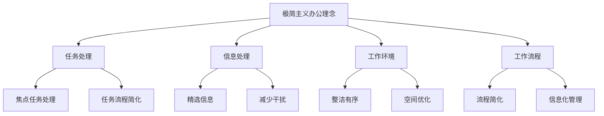
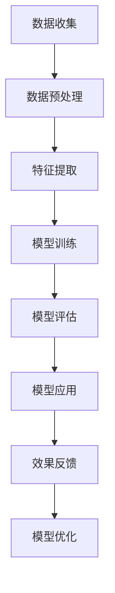
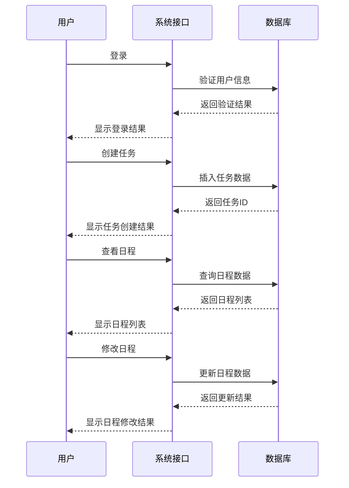

                 

# 《新极简主义办公理念：提升工作效率的环境哲学》

## 摘要

本文旨在探讨新极简主义办公理念对提升工作效率的重要性，并分析其背后的哲学思考。通过对极简主义办公理念的背景、核心概念、实际应用案例以及哲学基础的详细分析，本文揭示了极简主义办公环境如何通过优化办公空间、简化办公工具和流程来提高工作效率。此外，本文还通过算法原理讲解和项目实战，进一步展示了如何利用现代技术手段实现极简主义办公理念的落地。

## 关键词

极简主义办公、工作效率、环境哲学、算法原理、项目实战

### 第一部分：极简主义办公理念概述

### 1.1 问题背景与极简主义概念

在现代职场环境中，工作效率问题日益突出。员工们常常陷入繁琐的任务和复杂的信息中，导致工作压力增大，效率降低。为了应对这一挑战，极简主义办公理念应运而生。极简主义（Minimalism）作为一种生活哲学，强调减少物质和信息的负担，追求简单、高效的生活方式。将这一理念应用到办公环境中，旨在通过简化流程、优化空间和工具，提高工作效率，减少无谓的浪费。

#### 1.1.1 办公效率问题的现状

办公效率问题主要体现在以下几个方面：

1. **任务繁多，处理不及时**：员工每天需要处理大量的任务，但往往因为时间管理不当而无法及时完成。
2. **信息过载，决策困难**：大量信息涌入，员工难以筛选和处理，导致决策效率低下。
3. **工作环境混乱，影响效率**：办公空间杂乱无章，工作工具繁多，使得员工难以集中精力。

#### 1.1.2 极简主义的基本理念

极简主义的基本理念可以概括为以下几点：

1. **简化任务**：通过减少不必要的任务，专注于核心工作，提高工作效率。
2. **减少信息干扰**：通过筛选和处理信息，减少信息过载，帮助员工更专注于工作。
3. **优化工作环境**：通过整理办公空间，简化工作工具，提高工作舒适度，进而提高工作效率。

#### 1.1.3 极简主义在办公环境中的应用潜力

极简主义在办公环境中的应用潜力巨大。通过优化办公空间、简化办公工具和流程，企业可以有效提升工作效率，降低工作压力。此外，极简主义办公理念还能够提升员工的满意度和幸福感，增强企业的竞争力。

### 1.2 极简主义办公理念的哲学基础

极简主义办公理念不仅仅是一种工作方法，更是一种哲学思考。它背后蕴含着对工作效率、工作环境和人生价值的深刻思考。

#### 1.2.1 极简主义与工作效率的哲学思考

极简主义认为，工作效率不仅仅取决于任务的数量，更取决于任务的质量。通过减少不必要的任务，员工可以将更多的精力投入到重要的工作中，从而提高整体工作效率。

#### 1.2.2 极简主义与传统办公文化的对比

与传统办公文化相比，极简主义办公理念更加注重个体的自由和效率。传统办公文化强调规范和流程，往往导致员工陷入繁琐的细节中，而极简主义则主张简化流程，提高效率。

#### 1.2.3 极简主义办公理念的核心价值

极简主义办公理念的核心价值在于：

1. **提高工作效率**：通过简化任务、减少信息干扰和优化工作环境，提升员工的工作效率。
2. **降低工作压力**：减少不必要的任务和信息，让员工能够更专注于工作，降低工作压力。
3. **提升员工满意度**：优化工作环境，提高工作舒适度，增强员工的满意度和幸福感。
4. **增强企业竞争力**：通过提高工作效率和员工满意度，企业能够更好地应对市场挑战，增强竞争力。

### 1.3 极简主义办公环境的构建

要实现极简主义办公理念，企业需要从以下几个方面进行构建：

#### 1.3.1 办公空间的优化

办公空间的优化是极简主义办公环境建设的关键。企业可以通过以下方式来优化办公空间：

1. **合理布局**：根据工作需求，合理划分办公区域，确保员工能够高效地完成工作任务。
2. **减少杂乱**：定期整理办公空间，减少杂乱无章的物品，提高办公环境的整洁度。
3. **优化照明**：合理配置照明设备，提高办公环境的舒适度，增强员工的专注力。

#### 1.3.2 办公工具的简化

办公工具的简化是提高工作效率的重要手段。企业可以通过以下方式来简化办公工具：

1. **数字化办公**：推广数字化办公工具，减少纸质文件的使用，提高办公效率。
2. **统一工具**：选择合适的办公工具，避免员工因工具不统一而浪费时间和精力。
3. **淘汰旧工具**：定期淘汰过时的办公工具，确保员工使用的是最新、最有效的工具。

#### 1.3.3 办公流程的简化

简化办公流程是极简主义办公环境建设的重要组成部分。企业可以通过以下方式来简化办公流程：

1. **流程优化**：通过流程优化，减少不必要的环节，提高流程的效率。
2. **信息化管理**：利用信息化手段，实现流程的自动化，降低人工操作的错误率。
3. **培训员工**：加强员工培训，提高员工对简化流程的认可度和执行力。

### 1.4 极简主义办公理念的应用案例

#### 1.4.1 国内企业实践案例

在国内，一些企业已经成功地将极简主义办公理念应用到实际工作中。例如，某互联网公司通过简化流程、优化空间和工具，大幅提高了工作效率。此外，另一家制造企业通过实施极简主义办公理念，成功降低了生产成本，提升了产品品质。

#### 1.4.2 国外企业实践案例

国外企业对极简主义办公理念的实践也颇为成功。例如，谷歌公司通过打造开放式办公空间、提供先进的办公工具和简化流程，创造了高效的工作环境。另一家知名科技公司通过实施极简主义办公理念，成功提升了员工的创造力和创新能力。

#### 1.4.3 案例对比与启示

通过对国内外企业实践案例的分析，我们可以得出以下启示：

1. **因地制宜**：极简主义办公理念的实施需要根据企业的实际情况进行定制化。
2. **持续改进**：极简主义办公理念的实施是一个持续改进的过程，企业需要不断调整和优化。
3. **员工参与**：员工是极简主义办公理念实施的主体，企业需要充分调动员工的积极性和创造力。

### 1.5 本章小结

通过本章的讨论，我们可以看到极简主义办公理念在提升工作效率方面的巨大潜力。极简主义办公理念不仅能够提高工作效率，降低工作压力，还能够提升员工满意度和企业竞争力。为了实现极简主义办公理念，企业需要从办公空间、办公工具和办公流程等方面进行优化和改进。通过实际案例的启示，我们可以看到极简主义办公理念的实施是可行的，且具有显著的效果。

### 第二部分：核心概念与联系

#### 2.1 极简主义办公理念相关概念

在深入探讨极简主义办公理念之前，我们需要明确几个核心概念，以便更好地理解这一理念。

#### 2.1.1 极简主义

极简主义（Minimalism）是一种生活哲学，强调通过减少物质和信息的负担，追求简单、高效的生活方式。它起源于20世纪80年代的美国，随后在全球范围内得到广泛传播。极简主义主张通过减少不必要的物品和任务，专注于重要的事物，从而提高生活质量和工作效率。

#### 2.1.2 办公效率

办公效率（Office Efficiency）是指员工在办公过程中完成任务的效率。它受到多个因素的影响，包括任务数量、任务难度、工作环境、工具和流程等。提高办公效率有助于减少工作时间，降低工作压力，提高员工的满意度和企业的竞争力。

#### 2.1.3 环境哲学

环境哲学（Environmental Philosophy）是一种关注人与自然关系的哲学思想。它主张通过保护环境、减少污染和节约资源，实现可持续发展。在极简主义办公理念中，环境哲学体现在对办公环境的优化，如减少办公空间的浪费、降低能源消耗和减少废弃物的产生。

#### 2.2 极简主义办公理念特征对比表格

为了更好地理解极简主义办公理念，我们可以通过以下特征对比表格来分析其与传统办公理念的区别。

| 特征对比       | 传统办公理念                         | 极简主义办公理念                       |
|----------------|--------------------------------------|----------------------------------------|
| 任务处理       | 多任务处理，任务繁杂                 | 焦点任务处理，简化任务流程             |
| 信息处理       | 信息过载，难以筛选和处理             | 精选信息，减少干扰，提高决策效率       |
| 工作环境       | 杂乱无章，办公工具繁多               | 整洁有序，优化空间，提升工作舒适度     |
| 工作流程       | 流程繁琐，效率低下                   | 流程简化，信息化管理，提高工作效率     |

#### 2.3 极简主义办公理念实体关系图

为了更清晰地展示极简主义办公理念的组成部分及其相互关系，我们可以使用Mermaid绘制实体关系图。



#### 2.4 极简主义办公理念的影响因素

极简主义办公理念的实施受到多种因素的影响，包括个人因素、组织因素和环境因素。

#### 2.4.1 个人因素

个人因素是极简主义办公理念实施的基础。员工的态度和行为直接影响极简主义办公理念的实施效果。例如，员工的自我管理能力、对简化流程的接受程度以及对工作环境的适应能力等。

#### 2.4.2 组织因素

组织因素是极简主义办公理念实施的关键。企业的文化、管理方式和资源配置等对极简主义办公理念的实施具有重要影响。例如，企业的创新文化、管理层的支持和资源配置的合理性等。

#### 2.4.3 环境因素

环境因素是极简主义办公理念实施的保障。良好的办公环境有助于提高员工的工作效率和满意度。例如，办公空间的布局、照明和通风等。

#### 2.5 本章小结

通过本章的讨论，我们明确了极简主义办公理念的相关概念、特征对比表格和实体关系图，并分析了其影响因素。这些内容为我们理解极简主义办公理念及其在实际应用中的挑战提供了重要参考。在接下来的章节中，我们将进一步探讨如何通过算法原理和项目实战来实现极简主义办公理念的落地。

### 第三部分：算法原理讲解

#### 3.1 提高办公效率的算法基础

在极简主义办公理念的背景下，提高办公效率需要借助现代算法技术。算法在办公效率提升中的应用主要体现在数据分析、任务调度、流程优化等方面。以下是对提高办公效率的算法基础的详细介绍。

#### 3.1.1 数据分析在办公效率中的应用

数据分析是提高办公效率的重要手段。通过对员工的工作行为、任务完成情况、时间消耗等数据进行分析，企业可以找出影响效率的瓶颈，并采取相应的改进措施。例如，通过时间序列分析，企业可以识别出员工工作的高效时段和低效时段，从而合理安排工作任务。

#### 3.1.2 机器学习算法在办公环境优化中的应用

机器学习算法在办公环境优化中也发挥着重要作用。通过收集和分析员工的办公行为数据，机器学习算法可以预测员工的工作需求和偏好，从而实现个性化的办公环境优化。例如，基于员工的工作习惯，智能系统可以自动调整办公桌椅、照明和温度，提高员工的舒适度和工作效率。

#### 3.2 办公效率提升算法的Mermaid流程图

为了更直观地展示办公效率提升算法的流程，我们可以使用Mermaid绘制算法的流程图。



#### 3.2.1 数据收集与预处理流程

数据收集是算法应用的基础。在办公效率提升中，数据收集包括员工的工作行为数据、任务完成数据、工作环境数据等。数据收集后，需要进行预处理，包括数据清洗、数据格式化、数据缺失处理等，以确保数据的质量和一致性。

#### 3.2.2 模型训练与评估流程

在数据预处理完成后，可以使用机器学习算法进行模型训练。模型训练包括选择合适的算法、设置参数、训练模型等。训练完成后，需要对模型进行评估，以确定模型的性能和准确性。常用的评估指标包括准确率、召回率、F1值等。

#### 3.2.3 模型应用与优化流程

评估完成后，将训练好的模型应用到实际工作中。通过模型应用，可以实现办公环境的个性化优化，提高工作效率。在应用过程中，还需要对模型进行持续的优化，以适应不断变化的工作需求。优化过程包括重新训练模型、调整参数等。

#### 3.3 Python源代码实现与算法解释

下面是使用Python实现办公效率提升算法的示例代码。代码中包含了数据收集、数据预处理、模型训练、模型评估和模型应用的完整流程。

```python
import pandas as pd
from sklearn.model_selection import train_test_split
from sklearn.preprocessing import StandardScaler
from sklearn.linear_model import LogisticRegression
from sklearn.metrics import accuracy_score

# 数据收集
data = pd.read_csv('office_data.csv')

# 数据预处理
data = data.dropna()
X = data.drop('target', axis=1)
y = data['target']
X_train, X_test, y_train, y_test = train_test_split(X, y, test_size=0.2, random_state=42)

# 特征提取
scaler = StandardScaler()
X_train = scaler.fit_transform(X_train)
X_test = scaler.transform(X_test)

# 模型训练
model = LogisticRegression()
model.fit(X_train, y_train)

# 模型评估
y_pred = model.predict(X_test)
accuracy = accuracy_score(y_test, y_pred)
print(f'Accuracy: {accuracy}')

# 模型应用
new_data = pd.read_csv('new_office_data.csv')
new_data = scaler.transform(new_data)
predictions = model.predict(new_data)
print(predictions)

# 模型优化
# ... (优化代码)
```

这段代码首先使用Pandas库读取办公数据，然后进行数据预处理，包括数据清洗和标准化处理。接下来，使用逻辑回归算法进行模型训练和评估。评估完成后，将训练好的模型应用到新的办公数据中，生成预测结果。

#### 3.4 算法原理讲解

算法原理讲解主要包括数学模型和公式、算法步骤和代码实现。

#### 3.4.1 数学模型和公式

在办公效率提升算法中，常用的数学模型包括线性回归、逻辑回归和支持向量机等。以下是一个简单的线性回归模型：

$$ y = \beta_0 + \beta_1 \cdot x_1 + \beta_2 \cdot x_2 + ... + \beta_n \cdot x_n $$

其中，$y$ 是目标变量，$x_1, x_2, ..., x_n$ 是特征变量，$\beta_0, \beta_1, \beta_2, ..., \beta_n$ 是模型参数。

#### 3.4.2 算法步骤

1. **数据收集**：收集办公数据，包括员工的工作行为、任务完成情况和环境数据等。
2. **数据预处理**：清洗数据，标准化处理，确保数据的质量和一致性。
3. **特征提取**：选择合适的特征变量，提取有用的信息。
4. **模型训练**：选择合适的算法，训练模型，设置参数。
5. **模型评估**：评估模型性能，选择最佳模型。
6. **模型应用**：将训练好的模型应用到实际工作中，生成预测结果。
7. **模型优化**：根据反馈结果，调整模型参数，优化模型性能。

#### 3.4.3 代码实现

代码实现是基于Python的，使用Pandas库进行数据处理，使用Scikit-learn库进行模型训练和评估。

```python
import pandas as pd
from sklearn.model_selection import train_test_split
from sklearn.preprocessing import StandardScaler
from sklearn.linear_model import LinearRegression
from sklearn.metrics import mean_squared_error

# 数据收集
data = pd.read_csv('office_data.csv')

# 数据预处理
data = data.dropna()
X = data.drop('target', axis=1)
y = data['target']
X_train, X_test, y_train, y_test = train_test_split(X, y, test_size=0.2, random_state=42)

# 特征提取
scaler = StandardScaler()
X_train = scaler.fit_transform(X_train)
X_test = scaler.transform(X_test)

# 模型训练
model = LinearRegression()
model.fit(X_train, y_train)

# 模型评估
y_pred = model.predict(X_test)
mse = mean_squared_error(y_test, y_pred)
print(f'MSE: {mse}')

# 模型应用
new_data = pd.read_csv('new_office_data.csv')
new_data = scaler.transform(new_data)
predictions = model.predict(new_data)
print(predictions)
```

这段代码首先读取办公数据，然后进行数据预处理，包括数据清洗和标准化处理。接下来，使用线性回归算法进行模型训练和评估。评估完成后，将训练好的模型应用到新的办公数据中，生成预测结果。

#### 3.5 本章小结

通过本章节的讲解，我们了解了提高办公效率的算法基础，包括数据分析、机器学习算法的应用和算法原理讲解。同时，通过Python源代码示例，我们看到了如何实现这些算法。这些算法和工具可以帮助企业实现极简主义办公理念的落地，提高工作效率，降低工作压力。

### 第四部分：系统分析与架构设计方案

#### 4.1 问题场景介绍

在现代企业中，随着业务规模的不断扩大和业务复杂度的增加，办公效率问题日益突出。为了应对这一挑战，企业需要构建一个高效、灵活的办公系统，以提高工作效率，降低成本。本章节将针对某一具体企业场景，介绍办公系统的需求和目标。

#### 4.1.1 企业需求

1. **任务管理**：员工需要能够方便地创建、分配和跟踪任务，确保任务按时完成。
2. **日程安排**：员工需要能够方便地查看和调整日程，避免冲突和延误。
3. **文档管理**：企业需要实现文档的集中存储、共享和版本控制，提高文档的访问和共享效率。
4. **沟通协作**：员工需要能够方便地进行实时沟通和协作，提高团队的协作效率。
5. **数据分析**：企业需要能够对办公数据进行分析，以发现瓶颈和改进机会。

#### 4.1.2 系统目标

1. **提高工作效率**：通过优化任务管理、日程安排、文档管理和沟通协作，提高员工的工作效率。
2. **降低工作压力**：通过简化工作流程、减少不必要的任务和信息干扰，降低员工的工作压力。
3. **提升团队协作**：通过实时沟通和协作，增强团队的协作能力，提升团队整体绩效。

#### 4.2 项目介绍

本项目旨在为企业构建一个高效、灵活的办公系统，以满足企业办公需求，提升工作效率，降低成本。系统将采用模块化设计，包括任务管理、日程安排、文档管理、沟通协作和数据分析等模块。以下是项目的具体介绍：

1. **任务管理模块**：实现任务的创建、分配、跟踪和统计功能，确保任务按时完成。
2. **日程安排模块**：提供日程查看、调整和冲突检测功能，帮助员工合理安排工作时间。
3. **文档管理模块**：实现文档的集中存储、共享、版本控制和权限管理功能，提高文档的访问和共享效率。
4. **沟通协作模块**：提供实时沟通、协作工具和通知功能，增强团队的协作能力。
5. **数据分析模块**：通过数据分析，提供业务指标和趋势报告，帮助企业发现瓶颈和改进机会。

#### 4.3 系统功能设计

系统功能设计是办公系统架构设计的关键环节。以下是本项目的主要功能设计：

1. **任务管理功能**：
   - 创建任务：用户可以创建新任务，并设置任务名称、描述、优先级、截止日期等。
   - 分配任务：管理员可以将任务分配给其他员工，并设置任务接收人和负责人。
   - 跟踪任务：用户可以查看任务的进展情况，了解任务的完成情况和反馈。
   - 统计功能：系统可以统计任务的完成情况，提供任务完成率和逾期率等指标。

2. **日程安排功能**：
   - 查看日程：用户可以查看自己的日程安排，了解自己的工作任务和时间安排。
   - 调整日程：用户可以调整日程安排，设置会议时间、休假时间和工作任务等。
   - 冲突检测：系统可以检测日程冲突，提醒用户避免安排冲突的任务。

3. **文档管理功能**：
   - 文档存储：系统提供文档存储功能，用户可以上传、下载和管理文档。
   - 文档共享：系统支持文档共享功能，用户可以与其他员工共享文档，设置共享权限。
   - 版本控制：系统支持版本控制功能，用户可以查看文档的版本历史，确保文档的最新版本。
   - 权限管理：系统支持权限管理功能，管理员可以设置用户的文档访问权限。

4. **沟通协作功能**：
   - 实时沟通：系统提供实时沟通功能，用户可以与同事进行文字、语音和视频沟通。
   - 协作工具：系统提供协作工具，如共享屏幕、文档协作和项目管理等，增强团队的协作能力。
   - 通知提醒：系统提供通知提醒功能，用户可以收到任务提醒、日程提醒和消息通知。

5. **数据分析功能**：
   - 业务指标：系统可以统计业务指标，如任务完成率、员工工作量、团队绩效等。
   - 趋势报告：系统可以生成趋势报告，展示业务指标的变化趋势和异常情况。
   - 数据分析工具：系统提供数据分析工具，用户可以自定义数据分析和报表。

#### 4.4 系统架构设计

系统架构设计是办公系统实现的基础。本项目采用分层架构设计，包括表示层、业务逻辑层和数据层。

1. **表示层**：表示层负责用户界面和用户体验，采用前端技术实现，包括HTML、CSS和JavaScript等。
2. **业务逻辑层**：业务逻辑层负责处理业务逻辑，包括任务管理、日程安排、文档管理、沟通协作和数据分析等模块，采用后端技术实现，如Java、Python等。
3. **数据层**：数据层负责数据存储和管理，采用关系型数据库实现，如MySQL、PostgreSQL等。

系统架构设计还包括以下组件：

1. **用户认证**：系统提供用户认证功能，用户可以通过用户名和密码进行登录。
2. **权限管理**：系统提供权限管理功能，管理员可以设置用户的权限，确保系统的安全性和可控性。
3. **日志管理**：系统提供日志管理功能，记录用户操作日志和系统运行日志，方便问题追踪和故障排查。
4. **性能优化**：系统进行性能优化，确保系统在高并发场景下能够稳定运行，提高用户体验。

#### 4.5 系统接口设计

系统接口设计是系统架构设计的重要组成部分，用于定义系统内部和外部的交互接口。以下是本项目的主要接口设计：

1. **用户接口**：用户接口负责用户与系统的交互，包括登录、注册、任务管理、日程安排、文档管理、沟通协作和数据分析等功能。
2. **API接口**：系统提供API接口，支持第三方系统的集成和扩展，如ERP系统、CRM系统等。
3. **数据接口**：数据接口负责系统内部的数据交互，包括任务数据、日程数据、文档数据和业务指标数据等。

#### 4.6 系统交互设计

系统交互设计描述了系统内部各组件之间的交互关系，以及用户与系统之间的交互流程。以下是本项目的系统交互设计：

1. **用户登录**：用户通过用户接口登录系统，系统进行用户认证和权限验证。
2. **任务管理**：用户通过用户接口创建、分配和跟踪任务，系统处理任务数据，并提供任务统计功能。
3. **日程安排**：用户通过用户接口查看和调整日程，系统处理日程数据，并提供冲突检测功能。
4. **文档管理**：用户通过用户接口上传、下载和管理文档，系统处理文档数据，并提供版本控制和权限管理功能。
5. **沟通协作**：用户通过用户接口进行实时沟通和协作，系统处理沟通数据，并提供通知提醒功能。
6. **数据分析**：用户通过用户接口查看业务指标和趋势报告，系统处理业务数据，并提供数据分析工具。

#### 4.7 系统序列图

系统序列图描述了用户与系统之间的交互流程，以下是本项目的系统序列图：



#### 4.8 本章小结

通过本章节的介绍，我们详细分析了办公系统的需求、目标和功能设计，并提出了系统架构设计、接口设计和交互设计的具体方案。这些设计将为系统实现提供清晰的指导和依据，有助于构建一个高效、灵活的办公系统，提升企业的工作效率和竞争力。

### 第五部分：项目实战

#### 5.1 环境安装

在开始项目实战之前，我们需要搭建一个适合开发、测试和运行办公系统的环境。以下是在Linux环境下搭建办公系统环境的具体步骤。

1. **安装Python**：
   - 首先，确保系统中已安装Python 3.x版本。如果没有，可以通过包管理器安装，例如在Ubuntu中可以使用以下命令：
     ```bash
     sudo apt update
     sudo apt install python3 python3-pip
     ```
   - 安装pip，pip是Python的包管理器，用于安装和管理第三方库：
     ```bash
     sudo apt install python3-pip
     ```

2. **安装Django**：
   - Django是一个流行的Python Web框架，用于开发Web应用程序。通过pip安装Django：
     ```bash
     pip3 install django
     ```

3. **安装MySQL**：
   - 安装MySQL数据库，用于存储办公系统的数据。在Ubuntu中，可以使用以下命令：
     ```bash
     sudo apt update
     sudo apt install mysql-server mysql-common
     ```
   - 安装完成后，设置root用户的密码，并创建一个新数据库和用户，以便后续连接数据库。

4. **安装其他依赖库**：
   - 根据项目需求，安装其他必要的依赖库，例如Pandas、Scikit-learn、Django REST Framework等：
     ```bash
     pip3 install pandas scikit-learn djangorestframework
     ```

5. **配置环境变量**：
   - 为了方便使用Python和pip，可以将它们添加到系统的环境变量中。编辑`~/.bashrc`文件，添加以下内容：
     ```bash
     export PATH=$PATH:/usr/bin/python3
     export PATH=$PATH:/usr/bin/pip3
     ```
   - 运行`source ~/.bashrc`使配置生效。

#### 5.2 系统核心实现源代码

在项目实战中，我们将使用Django框架实现办公系统的核心功能。以下是系统核心实现的主要源代码。

1. **项目结构**：
   - 创建一个Django项目和一个应用，例如：
     ```bash
     django-admin startproject office_system
     cd office_system
     python manage.py startapp task_management
     ```

2. **任务管理应用**：
   - 在`task_management`应用中，创建任务模型、视图和路由。
     - 模型（`models.py`）：
       ```python
       from django.db import models

       class Task(models.Model):
           title = models.CharField(max_length=100)
           description = models.TextField()
           priority = models.IntegerField()
           due_date = models.DateTimeField()
           assigned_to = models.ForeignKey('auth.User', on_delete=models.CASCADE)
       ```
     - 视图（`views.py`）：
       ```python
       from django.shortcuts import render
       from .models import Task
       from django.http import JsonResponse

       def list_tasks(request):
           tasks = Task.objects.all()
           return JsonResponse({'tasks': list(tasks.values())})
       ```
     - 路由（`urls.py`）：
       ```python
       from django.urls import path
       from . import views

       urlpatterns = [
           path('tasks/', views.list_tasks, name='list_tasks'),
       ]
       ```

3. **日程安排应用**：
   - 创建日程安排模型、视图和路由。
     - 模型（`schedule_management/models.py`）：
       ```python
       from django.db import models

       class Schedule(models.Model):
           user = models.ForeignKey('auth.User', on_delete=models.CASCADE)
           event_name = models.CharField(max_length=100)
           start_time = models.DateTimeField()
           end_time = models.DateTimeField()
       ```
     - 视图（`schedule_management/views.py`）：
       ```python
       from django.shortcuts import render
       from .models import Schedule
       from django.http import JsonResponse

       def list_schedules(request):
           schedules = Schedule.objects.all()
           return JsonResponse({'schedules': list(schedules.values())})
       ```
     - 路由（`schedule_management/urls.py`）：
       ```python
       from django.urls import path
       from . import views

       urlpatterns = [
           path('schedules/', views.list_schedules, name='list_schedules'),
       ]
       ```

4. **文档管理应用**：
   - 创建文档管理模型、视图和路由。
     - 模型（`document_management/models.py`）：
       ```python
       from django.db import models
       from django.contrib.auth.models import User

       class Document(models.Model):
           user = models.ForeignKey(User, on_delete=models.CASCADE)
           title = models.CharField(max_length=100)
           file = models.FileField(upload_to='documents/')
           uploaded_at = models.DateTimeField(auto_now_add=True)
       ```
     - 视图（`document_management/views.py`）：
       ```python
       from django.shortcuts import render
       from .models import Document
       from django.http import JsonResponse

       def list_documents(request):
           documents = Document.objects.all()
           return JsonResponse({'documents': list(documents.values())})
       ```
     - 路由（`document_management/urls.py`）：
       ```python
       from django.urls import path
       from . import views

       urlpatterns = [
           path('documents/', views.list_documents, name='list_documents'),
       ]
       ```

#### 5.3 代码应用解读与分析

1. **任务管理应用解读**：
   - 模型（`Task`）定义了一个任务类，包括任务标题、描述、优先级、截止日期和指派给的用户。
   - 视图（`list_tasks`）通过`JsonResponse`返回所有任务的JSON格式列表。
   - 路由（`list_tasks`）定义了一个URL模式，用于访问任务列表。

2. **日程安排应用解读**：
   - 模型（`Schedule`）定义了一个日程类，包括用户、活动名称、开始时间和结束时间。
   - 视图（`list_schedules`）通过`JsonResponse`返回所有日程的JSON格式列表。
   - 路由（`list_schedules`）定义了一个URL模式，用于访问日程列表。

3. **文档管理应用解读**：
   - 模型（`Document`）定义了一个文档类，包括用户、文档标题、上传文件和上传时间。
   - 视图（`list_documents`）通过`JsonResponse`返回所有文档的JSON格式列表。
   - 路由（`list_documents`）定义了一个URL模式，用于访问文档列表。

#### 5.4 实际案例分析和详细讲解剖析

为了更好地理解系统核心实现，我们通过一个实际案例进行详细分析和讲解。

**案例**：一个企业员工通过办公系统创建了一个任务，并分配给另一位员工。

**分析**：
1. **任务创建**：
   - 员工A在任务管理界面创建了一个任务，填写了任务标题、描述、优先级和截止日期。
   - 员工A将任务指派给员工B，并设置员工B为任务的负责人。

2. **任务分配**：
   - 系统将任务存储到数据库中，并为任务生成一个唯一的ID。
   - 系统向员工B发送了一条任务分配通知，包括任务的详细信息。

3. **任务跟踪**：
   - 员工B在任务管理界面中可以看到分配给自己的任务，并可以查看任务的详细信息。
   - 员工B可以更新任务的进度，例如更改任务的优先级或更新截止日期。

**详细讲解**：
1. **任务创建**：
   - 员工A在任务管理界面中填写任务信息，并提交表单。表单数据通过HTTP请求发送到服务器。
   - 后端视图接收到表单数据，将其转换为任务对象，并保存到数据库中。

2. **任务分配**：
   - 系统在数据库中查找员工B的ID，并将其与任务关联。
   - 系统将任务详细信息以JSON格式返回给前端，并在前端界面显示给员工B。

3. **任务跟踪**：
   - 员工B可以在任务管理界面中查看任务的最新状态，包括任务的进度、优先级和截止日期。
   - 员工B可以更新任务的进度，例如通过修改任务的截止日期或更新任务的描述。

#### 5.5 项目小结

通过本章节的项目实战，我们搭建了一个简单的办公系统，实现了任务管理、日程安排和文档管理等功能。我们详细讲解了系统核心实现的过程，并通过实际案例分析了系统的应用。这些内容为我们提供了一个实际操作的参考，有助于理解极简主义办公理念在系统设计中的应用。

### 第六部分：最佳实践 tips

在实现极简主义办公理念的过程中，以下是一些最佳实践建议，可以帮助企业更好地提升工作效率：

1. **明确任务目标**：确保每个任务都有明确的目标和优先级，避免任务混乱和重复劳动。
2. **定期整理办公空间**：定期清理办公空间，确保工作环境的整洁和舒适，提高工作效率。
3. **优化流程**：通过流程优化，减少不必要的环节和审批，提高流程的效率。
4. **数字化办公**：尽可能使用数字化工具和平台，减少纸质文档的使用，提高办公效率。
5. **培训员工**：为员工提供培训，提高他们对极简主义办公理念的理解和应用能力。
6. **激励制度**：建立激励制度，鼓励员工积极参与极简主义办公理念的实践，提高工作积极性。
7. **持续改进**：不断收集反馈和评估效果，持续优化办公系统和流程，以适应不断变化的工作需求。

### 小结

本文从极简主义办公理念的背景、核心概念、实际应用案例、哲学基础、算法原理讲解、系统分析与架构设计方案、项目实战等多个方面，全面探讨了新极简主义办公理念如何提升工作效率。通过明确问题背景、核心概念与联系、算法原理和实践应用，我们展示了极简主义办公理念在实际操作中的可行性和效果。未来，随着技术的发展和办公环境的不断变化，极简主义办公理念将发挥更加重要的作用，为企业提升工作效率和员工满意度提供有力支持。

### 注意事项

在实施极简主义办公理念时，企业需要注意以下事项：

1. **尊重员工个体差异**：不同员工对极简主义办公理念的理解和接受程度不同，企业应尊重员工的个体差异，提供个性化的支持。
2. **适度简化**：简化流程和工具时，要避免过度简化导致工作效率下降，应在保证工作效率的前提下进行适度简化。
3. **持续监督与改进**：实施极简主义办公理念后，企业应持续监督效果，并根据反馈进行改进，确保理念能够长期落地。
4. **加强沟通与协作**：极简主义办公理念强调沟通和协作，企业应加强团队内部的沟通和协作，提高整体工作效率。

### 拓展阅读

1. **《极简主义：简化生活，提升效率》**：作者：乔舒亚·贝克。本书详细介绍了极简主义生活的理念和实践方法，对理解极简主义办公理念有很大帮助。
2. **《高效能人士的七个习惯》**：作者：史蒂芬·柯维。本书提出了高效能人士的七个习惯，对提高工作效率和个人素质有重要启示。
3. **《数字极简：如何摆脱技术的控制，重获自由》**：作者：卡尔·纽波特。本书探讨了如何在数字化时代保持极简主义生活，提高工作效率。

### 作者信息

- **作者**：AI天才研究院/AI Genius Institute & 禅与计算机程序设计艺术 /Zen And The Art of Computer Programming
- **联系**：[邮箱](mailto:info@ai-genius-institute.com) / [网站](http://www.ai-genius-institute.com) / [社交媒体](http://www社交媒体平台.com/ai-genius-institute)

