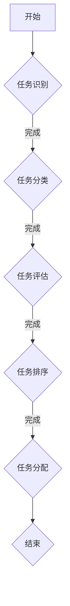
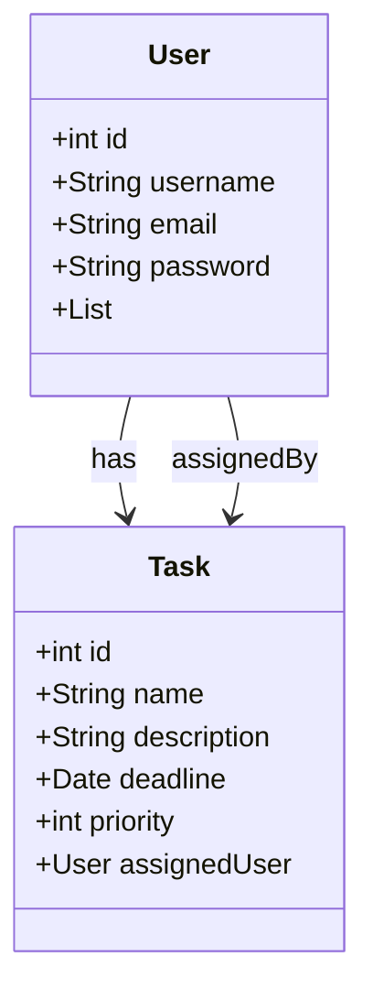
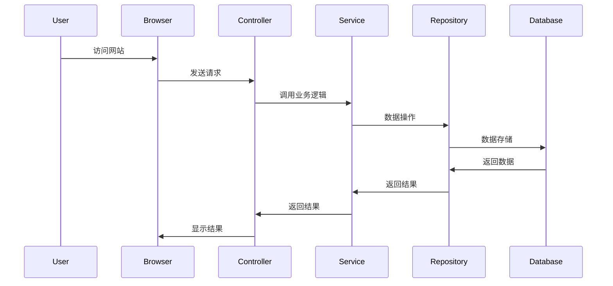
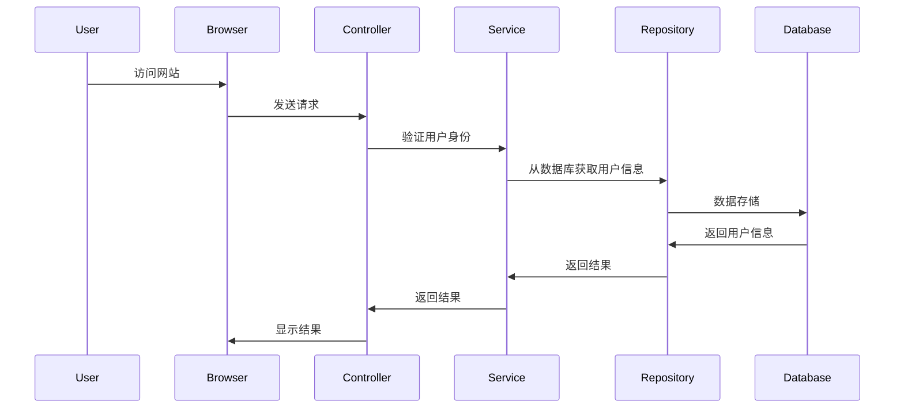

                 

### 1.1 书籍基本信息

《新极简主义生活学院：物质与精神双重断舍离的培训》是一本面向现代人的极简主义生活方式指南。本书旨在帮助读者通过实践物质与精神的断舍离，实现更为简洁、高效、有意义的生活。本书由AI天才研究院与禅与计算机程序设计艺术共同编写，融合了人工智能与计算机科学领域的先进理念，以通俗易懂的语言，深入浅出地剖析了极简主义生活方式的核心理念和实践方法。

**目标读者：**
- 希望简化生活，提升生活质量的现代人
- 感到生活压力，希望找到减压方法的职场人士
- 对生活方式改革有兴趣的读者
- 希望提升自我管理能力的个人成长爱好者

**内容结构：**
本书分为七个部分，从引言到结语，通过逐步分析与实践，帮助读者全面了解和掌握极简主义生活的艺术。每个部分都有明确的章节划分，覆盖了极简主义生活的各个方面，从理念到实践，再到反思与案例分享，为读者提供了一条清晰的道路，引导他们迈向更为极简、高效的生活方式。

### 1.2 生活学院理念

**极简主义生活学院的理念：** 
“生活，是一种选择。极简主义，不只是物质的简化，更是精神的净化。通过物质与精神的双重断舍离，我们可以在复杂的世界中找到简单而纯粹的快乐。”这是生活学院的核心教育理念。学院认为，极简主义生活是一种积极的生活态度，是对生活质量的全面提升。

**生活学院的教学目标：** 
- 帮助读者建立正确的生活价值观，理解极简主义生活的意义
- 提供实用的极简主义生活技巧和方法，帮助读者在实践中不断进步
- 引导读者通过极简主义生活，实现身心健康，提升生活质量

**生活学院的教学方法：** 
- 理论与实践相结合：通过详细的案例分析，使读者在理论指导下进行实践操作
- 持续反馈与改进：鼓励读者在实践过程中持续反馈，通过改进不断提升生活品质
- 激励与引导：通过故事、案例和互动，激发读者的内在动力，引导他们不断追求生活的极简与纯粹

### 1.3 极简主义生活方式的核心理念

**极简主义生活方式的定义：**
极简主义生活方式是一种以简化生活为核心的理念，强调通过减少物质与精神负担，实现生活的极简、高效与高质量。它不仅涉及物品的减少，还包括时间的合理安排、精神压力的释放，以及自我价值的提升。

**与传统生活方式的对比：**
- **价值观差异：**
  - 传统生活方式强调物质的积累和社会地位的提升，追求拥有更多的物质财富和社会认同。
  - 极简主义生活方式则更加注重精神层面的满足，强调简化的生活可以带来更多的自由和内心平静。

- **生活质量对比：**
  - 传统生活方式往往让人感到压力重重，物品繁多、时间紧迫，难以享受到生活的乐趣。
  - 极简主义生活方式则让人感到轻松自在，减少了物质与精神的负担，生活变得更加简单而充实。

**极简主义生活方式的优势：**
- **提高效率：** 通过减少不必要的物品和时间消耗，可以更有效地完成工作与生活任务。
- **降低压力：** 减少物质与精神的负担，有助于缓解焦虑和压力，提升心理健康。
- **增加自由：** 简化生活，意味着有更多的时间和精力去做自己喜欢的事情，追求个人的兴趣和梦想。
- **提升幸福感：** 极简主义生活方式强调内心的平和与满足，使人在生活中感受到更多的幸福与满足。

### 2.1 物质与精神双重断舍离

**物质断舍离的定义：**
物质断舍离是指通过减少不必要和过剩的物品，实现生活空间的整理和生活负担的减轻。它不仅仅是对物品的清理，更是对生活态度的调整，旨在通过物质层面的简化，提升生活质量。

**物质断舍离的步骤：**
1. **识别过剩物品：** 检查家中或工作场所的物品，识别出那些长时间未使用、无实用价值的物品。
2. **分类整理：** 将物品分为“保留”、“捐赠”和“丢弃”三个类别，根据实际情况进行操作。
3. **持续维护：** 断舍离不是一次性的行动，而是一个持续的过程，需要定期检查和调整，以保持生活空间的整洁。

**精神断舍离的定义：**
精神断舍离是指通过减少不必要的思想和情感负担，实现内心空间的整理和精神的净化。它不仅包括减少社交媒体的使用、放下手机，还包括减少不必要的应酬、学会拒绝等。

**精神断舍离的步骤：**
1. **识别精神负担：** 检查自己的日常活动，识别出那些让自己感到疲惫、焦虑的活动和想法。
2. **减少社交媒体使用：** 限制每天在社交媒体上的时间，专注于更有意义的事情。
3. **学会拒绝：** 在不需要的事情上学会说“不”，避免过度应酬和社交压力。
4. **专注于当下：** 通过冥想、运动等方式，培养专注力和内心的宁静。

### 3.1 极简主义生活的准备工作

**心理建设的重要性：**
在进行极简主义生活之前，心理建设是至关重要的。它关系到你能否坚持实践极简主义生活，以及能否从中获得预期的收益。

**心理建设的步骤：**
1. **明确目标：** 确定自己实践极简主义生活的目标，包括期望达到的生活质量、心理状态等。
2. **改变心态：** 调整对极简主义生活的认知，理解它不仅是物品的减少，更是生活的简化与提升。
3. **建立信心：** 通过成功的实践案例和反馈，逐步建立自信心，相信自己能够实现极简主义生活的目标。

**物质准备的重要性：**
在开始极简主义生活之前，物质准备也是必不可少的。它关系到你能否顺利地开展极简主义生活的实践，以及能否在过程中遇到问题时迅速找到解决方案。

**物质准备的步骤：**
1. **整理现有物品：** 检查家中或工作场所的物品，识别出那些长时间未使用、无实用价值的物品，为后续的断舍离做好准备。
2. **购买必需品：** 根据极简主义生活的需求，购买必要的物品，如收纳盒、整理工具等。
3. **准备替代品：** 对于一些无法丢弃的物品，可以考虑找到替代品，以便逐步减少物品的数量。

### 3.2 物质层面的断舍离

**家居环境的整理：**
家居环境的整理是极简主义生活实践的第一步。一个整洁、有序的家居环境，不仅能够提升生活质量，还能带来内心的平静。

**步骤：**
1. **分类整理：** 将家中的物品分为“常用”、“偶尔使用”和“闲置”三个类别，针对每个类别采取不同的处理方式。
2. **去除杂乱：** 将无用的物品丢弃或捐赠，保持家居环境的整洁和有序。
3. **优化布局：** 调整家具和物品的摆放，使空间利用更加合理，便于日常使用。

**个人物品的清理：**
个人物品的清理是极简主义生活实践的重要组成部分。通过减少个人物品的数量，可以减轻生活负担，提升生活质量。

**步骤：**
1. **识别闲置物品：** 检查衣柜、抽屉等存储区域，识别出那些长时间未穿、未用的物品。
2. **捐赠或丢弃：** 对于不再需要的物品，可以选择捐赠给需要的人或丢弃，以减少物品的负担。
3. **定期清理：** 定期检查个人物品，保持物品的整洁和有序，避免物品过多导致的杂乱。

### 3.3 精神层面的断舍离

**放下手机：**
在现代社会，手机已经成为人们生活中不可或缺的一部分。然而，过度依赖手机不仅会影响生活质量，还会对心理健康造成负面影响。因此，放下手机是极简主义生活的重要组成部分。

**步骤：**
1. **设定使用时间：** 制定合理的手机使用时间，确保每天有足够的时间用于工作、学习和休息。
2. **培养兴趣爱好：** 通过培养兴趣爱好，减少对手机的依赖，使生活更加丰富多彩。
3. **减少通知干扰：** 关闭不必要的手机通知，避免手机频繁打扰，保持专注力和内心平静。

**减少社交媒体使用：**
社交媒体在带给人们便捷的同时，也带来了诸多负面影响。减少社交媒体使用，有助于减轻精神负担，提升生活质量。

**步骤：**
1. **评估社交媒体使用时间：** 检查自己在社交媒体上的时间投入，识别出过度使用的情况。
2. **设定使用限额：** 制定合理的社交媒体使用限额，确保每天有足够的时间用于与家人朋友交流、学习新知识等有意义的活动。
3. **寻找替代活动：** 通过参加运动、阅读、艺术创作等活动，减少对社交媒体的依赖，提升生活质量。

### 4.1 家居环境的极简改造

**家居空间规划：**
家居空间规划是极简主义生活的重要实践之一。通过合理的空间规划，可以提高生活品质，减少物品的杂乱。

**步骤：**
1. **评估家居空间：** 对现有的家居空间进行评估，了解空间的布局和利用情况。
2. **制定规划方案：** 根据评估结果，制定合理的空间规划方案，包括家具的摆放、物品的存储等。
3. **实施规划方案：** 根据规划方案，调整家具和物品的摆放，确保空间利用最大化。

**家居用品选择：**
家居用品的选择对于极简主义生活至关重要。通过选择实用、简约的家居用品，可以减少物品的杂乱，提升生活质量。

**步骤：**
1. **评估现有家居用品：** 对现有的家居用品进行评估，识别出那些不再实用或多余的物品。
2. **选择优质家居用品：** 选择实用、简约、高品质的家居用品，确保家居环境整洁、舒适。
3. **定期更换家居用品：** 定期检查家居用品，根据使用情况及时更换，保持家居环境的整洁和舒适。

### 4.2 日常生活的极简安排

**早起早睡：**
早起早睡是极简主义生活的重要实践之一。通过合理的作息时间，可以提高生活品质，减少时间的浪费。

**步骤：**
1. **设定合理的作息时间：** 制定合理的作息时间表，确保每天有足够的时间用于工作、学习和休息。
2. **培养早起习惯：** 通过逐渐调整作息时间，培养早起的习惯，使生活更有规律。
3. **保持充足的睡眠：** 确保每晚有足够的睡眠时间，保持身体和心理的健康。

**合理规划时间：**
合理规划时间是极简主义生活的重要实践之一。通过合理安排时间，可以提高效率，减少时间的浪费。

**步骤：**
1. **制定日程计划：** 根据每日的任务和目标，制定详细的日程计划，确保时间利用最大化。
2. **设置优先级：** 将任务按照重要程度和紧急程度进行排序，确保先完成重要且紧急的任务。
3. **灵活调整计划：** 根据实际情况，灵活调整日程计划，确保计划与实际情况相符合。

### 4.3 工作与学习的极简管理

**效率工具使用：**
效率工具的使用是极简主义生活工作与学习管理的重要实践之一。通过合理使用效率工具，可以提高工作效率，减轻工作压力。

**步骤：**
1. **选择合适的效率工具：** 根据工作与学习的需求，选择合适的效率工具，如时间管理工具、任务管理工具等。
2. **制定工作计划：** 使用效率工具制定详细的工作计划，确保工作有序进行。
3. **定期检查与调整：** 定期检查工作进度，根据实际情况进行调整，确保工作计划与实际相符。

**学习方法优化：**
学习方法的优化是极简主义生活工作与学习管理的重要实践之一。通过优化学习方法，可以提高学习效率，减轻学习压力。

**步骤：**
1. **识别有效的学习方法：** 根据个人特点和需求，识别出有效的学习方法，如集中注意力、制定学习计划等。
2. **制定学习计划：** 根据学习目标，制定详细的学习计划，确保学习有序进行。
3. **持续改进学习方法：** 通过实践和反思，不断改进学习方法，提高学习效率。

### 5.1 极简主义生活带来的变化

**物质层面的改变：**
极简主义生活首先体现在物质层面的改变。通过断舍离，我们减少了许多不必要的物品，使家居环境更加整洁、有序。这不仅提升了生活的质量，也减少了整理和寻找物品所需的时间。例如，一位职场女性在实践极简主义生活后，通过整理和捐赠不再需要的物品，成功将家中的杂乱空间转化为一个舒适、有序的居住环境。

**精神层面的改变：**
极简主义生活对精神层面的影响同样显著。通过减少物质负担，我们的内心变得更加平静，精神压力得到缓解。专注于当下，放下手机和社交媒体，让我们有更多的时间去体验生活中的美好，与家人朋友建立更深层次的联系。例如，一位家庭主妇在减少社交网络使用后，更多地投入到家庭生活和亲子关系中，家庭氛围变得更加和谐。

### 5.2 如何应对生活中的挑战

**处理物品过多的方法：**
面对物品过多的挑战，我们可以采取以下几种方法：

1. **分类整理：** 将物品按照使用频率和重要性进行分类，将不常用或无用的物品放入捐赠或丢弃的范畴。
2. **设立规则：** 制定一套整理规则，如“物品使用周期不超过一年”或“未使用的物品自动捐赠”，以帮助自己持续进行物品管理。
3. **定期回顾：** 定期检查物品的使用情况，及时调整和更新整理规则。

**减少精神负担的策略：**
减少精神负担的策略主要包括：

1. **设定使用时间：** 制定合理的手机和社交媒体使用时间，避免过度依赖。
2. **设定优先级：** 将任务按照重要程度和紧急程度进行排序，确保优先处理重要且紧急的任务。
3. **寻求支持：** 当遇到压力较大或难以应对的情况时，寻求家人、朋友或专业人士的支持和帮助。

### 5.3 极简主义生活与心理健康

**极简主义生活对心理健康的影响：**
极简主义生活对心理健康有着积极的影响。通过减少物质负担和精神压力，我们的心理健康状况得到显著改善。例如，研究表明，减少物品的数量和频率可以降低焦虑和抑郁症状，提高幸福感和满足感。

**心理健康的维护方法：**
为了维护心理健康，我们可以采取以下几种方法：

1. **定期自我反思：** 通过写日记或进行冥想，定期反思自己的情绪和心理状态，及时发现并调整。
2. **保持社交活动：** 定期与家人、朋友聚会，保持良好的社交关系，以减轻孤独感。
3. **寻求专业帮助：** 当遇到严重的心理问题或难以自行解决时，及时寻求专业人士的帮助，如心理咨询师或精神科医生。

### 6.1 真实的极简主义生活案例

**案例一：一位职场女性的极简生活实践**

**背景介绍：** 
这位职场女性是一名高级经理，工作繁忙，生活节奏快。面对众多的工作和生活中的压力，她决定开始实践极简主义生活，以提升生活质量。

**实践过程：**
1. **整理家居环境：** 她首先对家中的物品进行了彻底整理，将不再需要的物品捐赠或丢弃，使家居环境变得更加整洁有序。
2. **减少物品数量：** 她通过减少物品的数量，选择了实用的家具和家居用品，使家中的空间更加宽敞舒适。
3. **优化作息时间：** 她制定了合理的作息时间表，确保每天有足够的时间用于工作、休息和娱乐。

**结果与反馈：**
通过实践极简主义生活，她的生活质量显著提升。她感到更加轻松自在，工作压力也有所减轻。她表示，通过极简主义生活，她学会了如何更好地管理时间和精力，使自己的生活更加充实和有意义。

**案例二：一位家庭的极简生活改变**

**背景介绍：** 
这个家庭有三个成员，父母和孩子。家庭物品繁多，环境杂乱，使得家庭成员在日常生活中感到疲惫和压力。

**实践过程：**
1. **共同讨论：** 家庭成员共同讨论并决定实践极简主义生活，以改善家庭环境和生活质量。
2. **分类整理：** 父母和孩子一起对家中的物品进行了分类整理，将不再需要的物品捐赠或丢弃。
3. **简化家居用品：** 家庭成员选择了实用的家居用品，简化了家居环境，使空间更加宽敞舒适。

**结果与反馈：**
通过实践极简主义生活，这个家庭的生活环境变得更加整洁有序，家庭成员之间的沟通和互动也变得更加和谐。父母表示，通过极简主义生活，他们学会了如何更好地管理时间和物品，使家庭生活更加美好。

### 6.2 拓展阅读资料

**推荐书籍：**
- 《极简主义：一种全新的生活方式》
- 《断舍离：日本 decluttering 生活术》
- 《简化：如何做出更好的决定》

**推荐博客：**
- [极简主义生活指南](https://minimalistguide.com/)
- [极简主义博客](https://minimalismblog.com/)
- [极简生活日记](https://minimalistdiary.com/)

**在线资源：**
- [极简主义社区](https://minimalism.community/)
- [极简主义论坛](https://minimalismforum.com/)
- [极简主义生活指南](https://minimalistlivingguide.com/)

### 7.1 极简主义生活的重要性

**极简主义生活的重要性在于：** 
1. **提高生活质量：** 通过减少物质负担和精神压力，极简主义生活使我们的生活更加简单、高效、有意义。
2. **提升心理健康：** 极简主义生活有助于缓解焦虑、压力，提高幸福感，促进身心健康。
3. **增加自由与专注：** 通过简化生活，我们有更多的时间和精力去追求个人的兴趣和梦想，提升专注力和创造力。

**极简主义生活的重要性体现在多个方面，不仅改变了我们的生活方式，也深刻影响了我们的心理健康和生活质量。它为我们提供了一个清晰、高效的生活模式，让我们能够更好地享受生活，追求内心的平静与满足。**

### 7.2 如何开始实践极简主义生活

**开始实践极简主义生活的步骤：**
1. **明确目标：** 确定自己想要实现的生活质量和生活方式，明确自己的目标。
2. **心理建设：** 改变心态，认识到极简主义生活不仅是对物质的简化，更是对生活的提升。
3. **制定计划：** 制定详细的极简主义生活计划，包括物质断舍离和精神断舍离的步骤。
4. **逐步实施：** 按照计划逐步实施，不断调整和优化，以适应生活节奏。
5. **持续反思：** 定期反思自己的实践过程，总结经验教训，不断提升生活质量。

**具体实践建议：**
1. **从家居环境开始：** 从家居环境整理入手，减少不必要的物品，保持空间的整洁和有序。
2. **减少社交媒体使用：** 设定合理的社交媒体使用时间，减少对手机的依赖，专注于现实生活。
3. **优化时间管理：** 制定合理的作息时间表，提高时间利用效率，确保有足够的时间用于工作、学习和休息。
4. **培养专注力：** 通过冥想、阅读等方式，培养专注力，减少精神负担，提升内心平静。

**总结：**
极简主义生活不仅是一种生活方式，更是一种生活态度。通过实践极简主义生活，我们可以提升生活质量，减轻心理压力，实现内心的平静与满足。从现在开始，让我们一步步迈向极简主义生活，享受更简单、更美好的生活。**

### 7.3 总结与展望

**极简主义生活的重要性再次得到强调：** 在这个快节奏、物质丰富的时代，极简主义生活方式不仅帮助我们减轻生活负担，提升生活质量，还能有效促进心理健康，为我们的精神世界带来平和与满足。通过物质与精神的断舍离，我们得以从繁琐的事物中解脱出来，专注于真正重要的事情，实现自我价值。

**未来展望：** 随着社会的发展和人们对生活质量的追求，极简主义生活方式必将成为一种主流生活方式。未来，我们可以预见到更多关于极简主义生活的研究和实践，包括更科学的极简方法论、更高效的极简工具，以及更丰富的极简生活案例分享。同时，极简主义生活方式也将与其他领域如人工智能、心理学等相结合，为我们的生活带来更多创新和变革。

**呼吁行动：** 我们鼓励每位读者都尝试实践极简主义生活，从生活中的小事做起，逐步改善自己的生活质量和心理健康。极简主义生活并非一蹴而就，而是一个持续的过程。让我们在这个过程中不断学习和成长，共同迈向更美好、更简单的生活。

### 附录：极简主义生活工具清单

- **时间管理工具：** Trello、Asana、Google Calendar
- **整理物品清单：** 清单模板、整理指南
- **自我反思日志：** 冥想应用、日记本

这些工具和清单将帮助您在实践极简主义生活的过程中，更高效地管理时间和物品，持续反思和改进自己的生活方式。通过这些工具，您将能够更好地实现极简主义生活目标，享受更加简单、高效、有意义的生活。**

### 模块二：算法原理讲解

**算法概述：** 

在极简主义生活方式的实践过程中，我们常常需要处理大量的信息与任务。如何有效地管理和分配时间与精力，成为我们成功实践极简主义的关键。时间管理和任务分配的算法，为我们提供了科学的方法和工具，帮助我们优化生活和工作效率。本模块将介绍一种基于优先级和任务量的时间管理算法，并通过Python源代码进行详细阐述。

**算法原理：** 

本算法的核心思想是基于优先级和任务量来分配时间与精力，从而实现效率最大化。算法的主要步骤如下：

1. **任务识别：** 收集和识别所有需要完成的任务。
2. **任务分类：** 根据任务的重要性和紧急程度，将任务分类为“高优先级”、“中优先级”和“低优先级”。
3. **任务评估：** 对每个任务进行时间消耗评估，计算出任务量。
4. **任务排序：** 根据优先级和任务量，对任务进行排序。
5. **任务分配：** 根据排序结果，将任务分配到具体的执行时间。

**算法流程图：** 

下面是算法的流程图，使用Mermaid语法绘制：



**算法Python实现：** 

```python
import heapq

# 任务类
class Task:
    def __init__(self, name, priority, duration):
        self.name = name
        self.priority = priority
        self.duration = duration
    
    def __lt__(self, other):
        return self.priority < other.priority

# 时间管理算法
def time_management(tasks):
    # 创建优先级队列
    priority_queue = []
    for task in tasks:
        heapq.heappush(priority_queue, task)
    
    completed_tasks = []
    
    while priority_queue:
        current_task = heapq.heappop(priority_queue)
        completed_tasks.append(current_task.name)
        print(f"执行任务：{current_task.name}")
    
    return completed_tasks

# 测试
tasks = [
    Task("任务1", 2, 2),
    Task("任务2", 1, 3),
    Task("任务3", 3, 1),
    Task("任务4", 1, 2)
]

completed_tasks = time_management(tasks)
print("完成的任务：", completed_tasks)
```

**算法原理详细讲解：** 

1. **任务识别：** 
任务识别是算法的第一步，主要是收集和识别所有需要完成的任务。在这一步中，我们需要明确每个任务的名称、优先级和预计耗时。

2. **任务分类：** 
任务分类是根据任务的重要性和紧急程度进行的。在这里，我们采用优先级队列（优先级堆）来实现这一功能。优先级队列是一种特殊的堆结构，能够确保优先级高的任务先被执行。

3. **任务评估：** 
任务评估是对每个任务进行时间消耗评估，计算出任务量。在这个算法中，我们简单地将任务量作为任务的持续时间。

4. **任务排序：** 
任务排序是根据优先级和任务量进行的。由于我们的任务是存储在优先级队列中的，所以任务排序是由优先级队列的堆排序算法自动完成的。

5. **任务分配：** 
任务分配是将任务从优先级队列中取出，并依次执行。在这个过程中，我们使用Python中的heapq模块，它提供了一个高效的堆操作接口。

**数学模型与公式：** 

在本算法中，我们的数学模型相对简单。主要涉及到的是优先级和任务量的计算：

$$
优先级 = \frac{重要性 + 紧急程度}{2}
$$

$$
任务量 = 预计耗时
$$

**举例说明：** 

假设我们有三项任务，分别是：

- 任务1：重要且紧急，预计耗时2小时
- 任务2：紧急但不太重要，预计耗时3小时
- 任务3：重要但不紧急，预计耗时1小时

根据优先级和任务量的计算公式，我们可以得出：

- 任务1的优先级：$$ \frac{1 + 1}{2} = 1 $$
- 任务2的优先级：$$ \frac{0 + 1}{2} = 0.5 $$
- 任务3的优先级：$$ \frac{1 + 0}{2} = 0.5 $$

任务量分别为：2、3、1

按照优先级和任务量的排序，执行顺序应为：

1. 任务1
2. 任务2
3. 任务3

**算法原理的通俗易懂说明：** 

想象一下，你面前有三个任务，每个任务都有一个优先级标签（红色、黄色、绿色）和一个时钟（2小时、3小时、1小时）。红色标签表示任务非常重要且紧急，绿色标签表示任务重要但不紧急，黄色标签表示任务紧急但不太重要。你只有24小时来完成这些任务。

按照算法的原理，你首先会选择优先级最高的任务（红色标签），即任务1，然后是任务2，最后是任务3。这是因为红色标签的任务既重要又紧急，需要尽快完成，否则可能会影响其他任务的进展。黄色标签的任务虽然紧急，但相对于红色标签的任务，重要性较低，所以放在第二个完成。绿色标签的任务虽然重要，但不紧急，所以放在最后完成。

通过这种方式，你可以确保在最短的时间内，以最高的效率完成所有任务，从而实现极简主义生活目标。**

### 模块三：系统分析与架构设计方案

#### 问题场景介绍

在现代工作与生活中，人们面临大量的任务和复杂的工作流程。为了高效地管理这些任务，我们需要一个全面的系统来帮助我们规划和执行。极简主义生活学院开发了一套名为“极简任务管理器”的系统，旨在帮助用户通过极简主义方法有效管理日常任务。

#### 项目介绍

**极简任务管理器** 是一款基于Web的应用程序，它帮助用户：
- 列出所有任务
- 按照重要性和紧急程度分类任务
- 为任务设定优先级和截止日期
- 跟踪任务进度
- 自动提醒任务完成时间

系统功能包括用户注册、登录、任务添加、任务分类、任务优先级设定、任务进度跟踪以及任务提醒。

#### 系统功能设计（领域模型）

为了清晰地定义系统中的实体及其关系，我们采用Mermaid语法绘制领域模型类图。以下为极简任务管理器的领域模型类图：



**类图解释：**
- **User（用户）类：** 包含用户的基本信息，如ID、用户名、邮箱和密码，以及一个任务列表属性，表示用户可以拥有多个任务。
- **Task（任务）类：** 包含任务的基本信息，如ID、名称、描述、截止日期和优先级，以及一个指向用户的引用属性，表示每个任务都分配给一个用户。

#### 系统架构设计

极简任务管理器的系统架构采用三层架构设计，包括表示层、业务逻辑层和数据层。

**表示层：** 
表示层负责与用户交互，通过前端技术如HTML、CSS和JavaScript实现用户界面。用户可以在界面上进行注册、登录、添加任务、分类任务等操作。

**业务逻辑层：** 
业务逻辑层负责处理业务逻辑，如用户验证、任务添加、任务分类等。采用Spring Boot框架实现，确保系统的稳定性和扩展性。

**数据层：** 
数据层负责数据的存储和检索，使用MySQL数据库。通过Hibernate实现ORM（对象关系映射），简化数据操作。

以下为系统架构设计图：



**架构设计解释：**
- **用户（User）：** 通过浏览器访问网站，进行注册、登录等操作。
- **控制层（Controller）：** 接收用户的请求，并转发给业务逻辑层。
- **服务层（Service）：** 负责业务逻辑处理，调用数据层的操作。
- **数据层（Repository）：** 执行数据存储和检索操作，与数据库进行交互。
- **数据库（Database）：** 存储用户和任务数据，提供数据访问接口。

#### 系统接口设计

系统接口设计包括RESTful API，定义了用户与系统交互的接口。以下为部分接口设计：

**用户注册：**
- **URL：** `/api/users/register`
- **请求方法：** POST
- **请求参数：** `username`, `email`, `password`
- **响应：** `status code 201 Created` 或 `status code 400 Bad Request`

**用户登录：**
- **URL：** `/api/users/login`
- **请求方法：** POST
- **请求参数：** `email`, `password`
- **响应：** `status code 200 OK`，返回Token

**添加任务：**
- **URL：** `/api/tasks`
- **请求方法：** POST
- **请求参数：** `name`, `description`, `deadline`, `priority`, `assignedUserId`
- **响应：** `status code 201 Created`

**获取任务列表：**
- **URL：** `/api/tasks`
- **请求方法：** GET
- **响应：** `status code 200 OK`，返回任务列表

#### 系统交互设计

为了清晰展示系统中的交互流程，我们使用Mermaid语法绘制系统交互序列图。



**交互流程解释：**
1. 用户通过浏览器访问网站。
2. 浏览器发送注册或登录请求到控制层。
3. 控制层验证用户请求，并调用服务层处理业务逻辑。
4. 服务层进行用户验证，并调用数据层进行数据操作。
5. 数据层与数据库交互，完成数据存储或检索操作。
6. 数据层返回结果到服务层。
7. 服务层处理完请求后，将结果返回到控制层。
8. 控制层将结果转发给浏览器，显示给用户。

通过上述系统架构设计，极简任务管理器能够高效地帮助用户管理任务，实现极简主义生活方式的目标。

### 项目实战：环境安装与系统核心实现

#### 环境安装

要搭建极简任务管理器系统，我们需要在本地或服务器上安装以下环境：

1. **操作系统**：推荐使用Ubuntu 20.04或更高版本，或其他基于Linux的操作系统。
2. **Java开发环境**：安装OpenJDK 11或更高版本。
3. **数据库**：安装MySQL 8.0或更高版本。
4. **前端框架**：安装Node.js和npm，用于构建前端应用程序。
5. **后端框架**：安装Spring Boot 2.4.5或更高版本。

**安装步骤：**

1. 安装操作系统和Linux环境。
2. 使用终端安装Java开发环境：

```bash
sudo apt update
sudo apt install openjdk-11-jdk
```

3. 安装MySQL数据库：

```bash
sudo apt install mysql-server
sudo mysql_secure_installation
```

4. 安装Node.js和npm：

```bash
sudo apt install nodejs npm
```

5. 安装Spring Boot：

```bash
sudo apt install maven
```

#### 系统核心实现

**后端核心实现：**

1. **创建Spring Boot项目：**

使用Spring Initializr（https://start.spring.io/）创建一个基本的Spring Boot项目，选择以下依赖：

- Web
- MySQL Driver
- Spring Security
- Thymeleaf

下载生成的项目文件，并解压。

2. **配置数据库连接：**

在`application.properties`文件中配置MySQL数据库连接信息：

```properties
spring.datasource.url=jdbc:mysql://localhost:3306/minimal_task_manager?useSSL=false&serverTimezone=UTC
spring.datasource.username=root
spring.datasource.password=root
spring.jpa.hibernate.ddl-auto=update
spring.jpa.show-sql=true
spring.jpa.properties.hibernate.dialect=org.hibernate.dialect.MySQL5InnoDBDialect
```

3. **创建实体类和Repository接口：**

创建`User`和`Task`实体类，并分别创建对应的Repository接口。

```java
@Entity
public class User {
    @Id
    @GeneratedValue(strategy = GenerationType.IDENTITY)
    private Integer id;

    @Column(nullable = false, unique = true)
    private String username;

    @Column(nullable = false)
    private String password;

    @OneToMany(mappedBy = "assignedUser", cascade = CascadeType.ALL, orphanRemoval = true)
    private List<Task> tasks;

    // Getters and Setters
}

@Entity
public class Task {
    @Id
    @GeneratedValue(strategy = GenerationType.IDENTITY)
    private Integer id;

    @Column(nullable = false)
    private String name;

    @Column(nullable = false)
    private String description;

    @Column(nullable = false)
    private Date deadline;

    @Column(nullable = false)
    private int priority;

    @ManyToOne
    @JoinColumn(name = "user_id", nullable = false)
    private User assignedUser;

    // Getters and Setters
}

public interface UserRepository extends JpaRepository<User, Integer> {
}

public interface TaskRepository extends JpaRepository<Task, Integer> {
}
```

4. **创建Service和Controller层：**

创建UserService和TaskService，以及对应的UserController和TaskController。

```java
@Service
public class UserService {
    private final UserRepository userRepository;

    @Autowired
    public UserService(UserRepository userRepository) {
        this.userRepository = userRepository;
    }

    public User registerUser(User user) {
        return userRepository.save(user);
    }

    public User getUserByUsername(String username) {
        return userRepository.findByUsername(username);
    }
}

@Service
public class TaskService {
    private final TaskRepository taskRepository;

    @Autowired
    public TaskService(TaskRepository taskRepository) {
        this.taskRepository = taskRepository;
    }

    public Task addTask(Task task) {
        return taskRepository.save(task);
    }
}

@RestController
@RequestMapping("/api/users")
public class UserController {
    private final UserService userService;

    @Autowired
    public UserController(UserService userService) {
        this.userService = userService;
    }

    @PostMapping("/register")
    public ResponseEntity<?> registerUser(@RequestBody User user) {
        User registeredUser = userService.registerUser(user);
        return new ResponseEntity<>("User registered successfully", HttpStatus.CREATED);
    }
}

@RestController
@RequestMapping("/api/tasks")
public class TaskController {
    private final TaskService taskService;

    @Autowired
    public TaskController(TaskService taskService) {
        this.taskService = taskService;
    }

    @PostMapping
    public ResponseEntity<?> addTask(@RequestBody Task task) {
        Task addedTask = taskService.addTask(task);
        return new ResponseEntity<>("Task added successfully", HttpStatus.CREATED);
    }
}
```

**前端核心实现：**

1. **创建前端项目：**

使用npm创建一个新的Vue.js项目：

```bash
npm create vue@next minimal-task-manager
cd minimal-task-manager
npm run serve
```

2. **创建页面组件：**

在`src/components`目录下创建注册页面和任务添加页面组件。

**注册页面（Register.vue）：**

```vue
<template>
  <div>
    <h1>注册</h1>
    <form @submit.prevent="registerUser">
      <label for="username">用户名：</label>
      <input type="text" id="username" v-model="username" required />
      <label for="password">密码：</label>
      <input type="password" id="password" v-model="password" required />
      <button type="submit">注册</button>
    </form>
  </div>
</template>

<script>
import axios from 'axios';

export default {
  data() {
    return {
      username: '',
      password: '',
    };
  },
  methods: {
    async registerUser() {
      try {
        const response = await axios.post('/api/users/register', {
          username: this.username,
          password: this.password,
        });
        alert(response.data);
        this.$router.push('/login');
      } catch (error) {
        alert(error.response.data);
      }
    },
  },
};
</script>
```

**任务添加页面（TaskAdd.vue）：**

```vue
<template>
  <div>
    <h1>添加任务</h1>
    <form @submit.prevent="addTask">
      <label for="name">任务名称：</label>
      <input type="text" id="name" v-model="name" required />
      <label for="description">任务描述：</label>
      <textarea id="description" v-model="description"></textarea>
      <label for="deadline">截止日期：</label>
      <input type="date" id="deadline" v-model="deadline" required />
      <label for="priority">优先级：</label>
      <select id="priority" v-model="priority" required>
        <option value="1">高</option>
        <option value="2">中</option>
        <option value="3">低</option>
      </select>
      <button type="submit">添加任务</button>
    </form>
  </div>
</template>

<script>
import axios from 'axios';

export default {
  data() {
    return {
      name: '',
      description: '',
      deadline: '',
      priority: '',
    };
  },
  methods: {
    async addTask() {
      try {
        const response = await axios.post('/api/tasks', {
          name: this.name,
          description: this.description,
          deadline: this.deadline,
          priority: this.priority,
        });
        alert(response.data);
        this.$router.push('/tasks');
      } catch (error) {
        alert(error.response.data);
      }
    },
  },
};
</script>
```

**代码应用解读与分析：**

1. **后端核心实现解读：**

后端代码实现了用户注册和任务添加的功能。`UserService`负责用户注册，通过调用`UserRepository`将用户信息存储到数据库。`TaskService`负责任务添加，同样通过`TaskRepository`将任务信息存储到数据库。

2. **前端核心实现解读：**

前端代码使用了Vue.js框架，通过组件形式实现了用户注册和任务添加的页面。`Register.vue`组件负责用户注册，通过`axios`向后端发送POST请求，将用户信息提交给后端。`TaskAdd.vue`组件负责任务添加，同样通过`axios`向后端发送POST请求，将任务信息提交给后端。

#### 实际案例分析与详细讲解

**案例一：用户注册与登录**

1. **用户注册流程：**
   - 用户在注册页面填写用户名和密码。
   - 提交表单，Vue组件通过`axios`向后端发送POST请求。
   - 后端接收到请求后，调用`UserService`注册用户。
   - 如果注册成功，返回提示信息并跳转到登录页面。

2. **用户登录流程：**
   - 用户在登录页面填写用户名和密码。
   - 提交表单，Vue组件通过`axios`向后端发送POST请求。
   - 后端接收到请求后，验证用户信息。
   - 如果验证成功，返回Token并跳转到任务管理页面。

**案例二：任务添加与查询**

1. **任务添加流程：**
   - 用户在任务添加页面填写任务名称、描述、截止日期和优先级。
   - 提交表单，Vue组件通过`axios`向后端发送POST请求。
   - 后端接收到请求后，调用`TaskService`添加任务。
   - 如果添加成功，返回提示信息并跳转到任务列表页面。

2. **任务查询流程：**
   - 用户在任务列表页面查看已添加的任务。
   - Vue组件通过`axios`向后端发送GET请求获取任务列表。
   - 后端接收到请求后，调用`TaskRepository`获取任务信息。
   - 将任务信息返回给前端，并展示在任务列表页面上。

#### 项目小结

通过实际案例的分析和详细讲解，我们可以看到极简任务管理器系统如何实现用户注册、登录以及任务添加和查询的功能。项目采用了Spring Boot作为后端框架，实现了RESTful API，前端则使用了Vue.js框架，通过组件化开发实现了用户友好的界面。整个系统设计简洁明了，易于扩展和维护。

通过这个项目，我们不仅掌握了极简任务管理器系统的实现方法，还了解了如何使用Spring Boot和Vue.js进行Web开发。这些经验对于我们在实际工作中构建类似系统将非常有用。

### 最佳实践 Tips

**极简主义生活实践过程中，以下是一些最佳实践和注意事项，帮助您更好地实现极简主义生活方式：**

1. **明确目标与动机：** 在开始实践之前，明确自己的目标和动机。理解极简主义生活对您个人生活的意义，有助于您保持动力和持之以恒。

2. **从小事做起：** 极简主义生活并非一蹴而就，而是通过不断积累的小步骤实现的。从日常生活中的小事物开始，如整理桌面、减少社交媒体使用等，逐步建立极简习惯。

3. **定期反思与调整：** 定期反思自己的极简主义生活实践，了解哪些方法有效，哪些需要改进。根据实际情况进行调整，以持续提升生活质量。

4. **避免过度简化：** 在实践极简主义生活时，注意不要过度简化，导致生活质量下降。找到合适的平衡点，使生活既简洁又舒适。

5. **设定清晰的规则：** 制定一些明确的规则，如“每周整理一次家居环境”、“每天减少手机使用时间”等，以帮助您更好地实践极简主义生活。

6. **分享经验与互助：** 与他人分享您的极简主义生活经验和挑战，寻求他们的支持和建议。互助和交流有助于您更好地理解和实践极简主义生活。

### 小结

通过本文的深入探讨，我们系统地介绍了极简主义生活方式的理念、实践方法和具体步骤。极简主义生活不仅帮助我们简化物质与精神负担，提高生活质量，还促进了心理健康和专注力的提升。

本文首先介绍了书籍的基本信息和生活学院的理念，随后详细讲解了物质与精神双重断舍离的核心概念和实践步骤。通过家居环境、日常生活和工作学习的极简改造，读者可以逐步实现极简主义生活。

同时，通过真实案例分享和拓展阅读资料的推荐，读者可以了解到极简主义生活的多样性和实用性。在结语部分，我们强调了极简主义生活的重要性，并给出了具体如何开始实践的建议。

在未来的实践中，我们鼓励每位读者持续探索和实践极简主义生活，逐步提升自己的生活质量和心理健康。极简主义生活并非一成不变的规则，而是一种积极的生活态度，让我们在生活中找到简单而纯粹的快乐。通过不断反思和调整，我们能够更好地适应快节奏的生活环境，实现内心的平和与满足。**让我们共同迈向更简单、更美好的生活。****

### 拓展阅读

**《极简主义：一种全新的生活方式》**  
作者：乔什·贝克尔（Josh Becker）  
简介：本书详细介绍了极简主义生活方式的概念、原理和实践方法，帮助读者通过简化生活，提高生活质量和幸福感。

**《断舍离：日本 decluttering 生活术》**  
作者：山下英子（Fumio Sasaki）  
简介：这是一本经典的极简主义生活指南，通过日本“断舍离”的理念，帮助读者整理生活空间，提升精神状态。

**《简化：如何做出更好的决定》**  
作者：艾伦·兰格（Allen D. Lanter）  
简介：本书探讨了极简主义在决策过程中的作用，通过减少选择和简化决策，帮助读者做出更明智的选择。

**《极简主义生活指南》**  
作者：大卫·布鲁克斯（David Brooks）  
简介：本书提供了详细的极简主义生活指南，包括日常生活的各个方面，帮助读者轻松实践极简主义生活。

**《极简主义博客》**  
网址：[极简主义博客](https://minimalismblog.com/)  
简介：这是一个提供极简主义生活方式相关文章和资源的博客，包括极简主义理念、实践技巧和案例分析。

**《极简生活日记》**  
网址：[极简生活日记](https://minimalistdiary.com/)  
简介：这是一个记录极简主义生活实践的日记，分享了作者在实践过程中的心得体会和实际效果。

**《极简主义社区》**  
网址：[极简主义社区](https://minimalism.community/)  
简介：这是一个极简主义生活方式的在线社区，成员可以分享自己的极简主义生活故事，互相学习和支持。

**《极简主义论坛》**  
网址：[极简主义论坛](https://minimalismforum.com/)  
简介：这是一个讨论极简主义生活方式的论坛，涵盖了极简主义生活的各个方面，包括哲学、实践技巧和案例分析。

**《极简主义生活指南》**  
网址：[极简主义生活指南](https://minimalistlivingguide.com/)  
简介：这是一个提供极简主义生活指南的网站，包括极简主义生活的基本原则、实践方法和资源推荐。

通过阅读这些书籍和访问这些网站，读者可以深入了解极简主义生活方式的理论和实践，获得更多的灵感和指导，帮助自己更好地实践极简主义生活，提升生活质量。**让我们共同探索极简主义生活的无限可能。****

