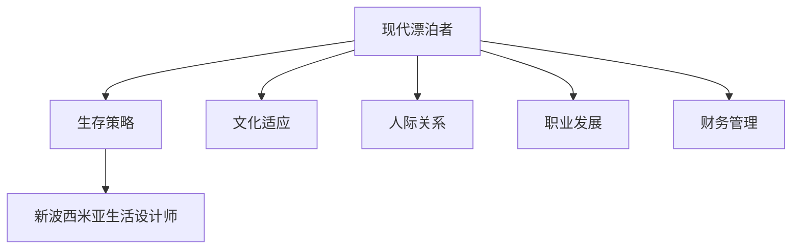

                 

### 第一部分：引言

#### 1.1 问题背景

在现代社会的快速变革中，越来越多的人开始追求自由、探索和个性发展的生活方式，他们被称为现代漂泊者。这些漂泊者可能是长期旅行者、远程工作者或数字游民，他们的生活方式与传统的定居生活方式截然不同。这种生活方式的兴起，可以追溯到全球化、信息化和城市化的加速发展，互联网和移动设备的普及也为他们提供了更多的可能。

**核心概念**：
- **现代漂泊者**：追求自由、探索和个性发展的生活方式，他们可能没有固定的居所，而是通过旅行、远程工作或数字游民的生活方式来体验不同的文化和环境。
- **新波西米亚生活设计师**：一种新的生活方式理念，强调自由、个性和适应性，他们通过设计自己的生活方式来满足自己的需求和追求。

**问题描述**：
随着全球化、信息化和城市化的加速发展，越来越多的人选择成为现代漂泊者。他们追求自由、探索和个性发展的生活方式，但这种生活方式也面临着许多挑战，如文化适应、人际关系、职业发展和财务管理等。如何提供实用的生存策略和建议，帮助现代漂泊者在不同文化和环境中顺利生存和成长，成为一个重要的问题。

**问题解决**：
本文旨在通过提供实用的生存策略和建议，帮助现代漂泊者在不同文化和环境中顺利生存和成长。首先，我们将会介绍新波西米亚生活设计师的定义和特点，然后详细探讨文化适应、人际关系、职业发展和财务管理等方面的生存策略。通过这些策略，现代漂泊者可以更好地适应新的环境，实现个人价值。

**边界与外延**：
- **现代漂泊者**：不仅包括长期旅行者，还包括远程工作者、数字游民等。
- **生存策略**：包括文化适应、人际关系、职业发展和财务管理等。

**概念结构与核心要素组成**：
- **文化适应**：了解和适应新的文化环境，包括语言学习、交流技巧和社交网络建立。
- **人际关系**：建立和维护良好的社交网络，包括个人品牌塑造和合作与协作。
- **职业发展**：选择适合自己的职业，制定职业规划，提升专业技能。
- **财务管理**：制定和遵守个人预算，管理个人财务风险，实现多元化收入来源。

#### 1.2 核心概念与联系

**核心概念原理**：
新波西米亚生活设计师是一种新的生活方式理念，强调自由、个性和适应性。他们通过设计自己的生活方式来满足自己的需求和追求。新波西米亚生活设计师的特点包括高自由性、高个性化、强适应性和高灵活性。

**概念属性特征对比表格**：

| 特征            | 新波西米亚生活设计师 | 传统生活方式 |
|-----------------|---------------------|--------------|
| 自由性          | 高                  | 低           |
| 个性化          | 强                  | 弱           |
| 适应性          | 强                  | 弱           |
| 灵活性          | 高                  | 低           |

**ER实体关系图架构**：

通过上述核心概念与联系的分析，我们可以更好地理解现代漂泊者与新波西米亚生活设计师之间的关系，以及他们如何通过设计自己的生活方式来适应和应对现代社会的挑战。

### 第二部分：生存策略详解

在成为现代漂泊者的过程中，面对多元文化和复杂环境的挑战，制定并执行有效的生存策略是至关重要的。本部分将详细探讨文化适应、人际关系、职业发展和财务管理这四个关键领域，为现代漂泊者提供实用的策略和建议。

#### 2.1 文化适应

**2.1.1 文化认知与理解**

文化适应是现代漂泊者在新的文化环境中生存和成长的第一步。不同国家的文化差异可能会对生活、工作和社交产生深远的影响。为了更好地适应新的文化环境，以下是一些关键步骤：

- **文化差异**：了解并熟悉目标国家的文化差异，包括价值观念、行为规范、沟通方式等。例如，在某些文化中，直接表达自己的意见可能被视为不礼貌，而在其他文化中，礼貌的回避可能被误解为不诚实。
- **文化认知**：通过阅读相关书籍、观看纪录片、参加文化交流活动等方式，深入了解目标文化的背景和特点。这有助于减少误解和冲突，增强文化敏感性和适应能力。

**2.1.2 交流技巧**

有效的交流技巧是文化适应的重要组成部分。以下是一些提升跨文化沟通能力的建议：

- **语言学习**：学习当地语言是融入新环境的关键。即使无法完全掌握语言，基础的沟通技巧也能帮助建立初步的联系。例如，学习一些常用的问候语和日常对话用语。
- **非语言沟通**：非语言沟通包括肢体语言、面部表情和身体姿态等。在不同的文化背景下，这些非语言表达可能具有不同的含义。了解并掌握这些差异，有助于避免误解和冲突。

**2.1.3 社交网络建立**

建立社交网络是文化适应过程中的重要一步。以下是一些建立全球社交网络的方法：

- **社交平台**：利用社交媒体平台，如Facebook、LinkedIn、Twitter等，与来自不同文化背景的人建立联系。这些平台提供了广泛的社交机会和资源。
- **线下活动**：参加当地的社区活动、文化活动或专业会议，结识来自不同文化背景的人。这些活动不仅有助于建立社交网络，还能深入了解当地文化和生活方式。

#### 2.2 人际关系

**2.2.1 个人品牌塑造**

个人品牌塑造是现代漂泊者在新环境中建立影响力的重要手段。以下是一些关键步骤：

- **专业形象**：保持专业的形象和态度，无论是在线上还是线下。这有助于树立良好的个人品牌，增强社交网络的信任度。
- **社交影响力**：通过分享专业知识和经验，参与讨论和交流，提升自己的社交影响力。例如，在社交媒体上发布有价值的文章、参与线上研讨会等。

**2.2.2 合作与协作**

在新环境中，合作与协作是解决复杂问题、实现共同目标的重要方式。以下是一些有效进行远程合作和团队协作的建议：

- **沟通工具**：使用高效的沟通工具，如Slack、Zoom、Trello等，确保信息的及时传递和协作的顺利进行。
- **文化敏感性**：了解并尊重团队成员的文化背景和习惯，避免因文化差异导致的误解和冲突。例如，在某些文化中，直接表达反对意见可能被视为不礼貌，而在其他文化中，礼貌的回避可能被误解为不诚实。

#### 2.3 职业发展

**2.3.1 职业定位**

在职业发展中，明确的职业定位是成功的关键。以下是一些制定和实施职业规划的建议：

- **自我评估**：了解自己的兴趣、技能和价值观，明确职业目标。例如，通过进行职业兴趣测试、咨询职业顾问等方式，帮助自己找到合适的职业方向。
- **市场调研**：了解目标行业的趋势和发展前景，确保自己的职业规划与市场需求相符。例如，通过阅读行业报告、参加行业会议等方式，获取行业动态。

**2.3.2 技能提升**

不断提升自己的专业技能是职业发展的基础。以下是一些快速提升专业技能的方法：

- **在线学习**：利用在线课程、技术论坛和开放课程等资源，学习新技能和知识。例如，通过Coursera、Udemy等平台，学习编程、数据分析、人工智能等热门技能。
- **实践项目**：参与实际项目，将理论知识应用于实践。例如，通过开源项目、个人项目等方式，锻炼自己的实际操作能力。

#### 2.4 财务管理

**2.4.1 资金规划**

有效的资金规划是确保财务稳定和自由的基础。以下是一些制定和遵守个人预算的方法：

- **制定预算**：根据收入和支出，制定详细的个人预算计划。例如，将收入分为固定支出、可变支出和储蓄，确保每月的支出不超过收入。
- **跟踪支出**：使用财务管理工具，如理财软件、记账本等，实时跟踪支出情况，确保预算的执行。

**2.4.2 收入来源**

实现多元化收入来源是财务管理的重要策略。以下是一些实现多元化收入来源的方法：

- **兼职工作**：利用自己的技能和经验，从事兼职工作，增加收入来源。例如，通过远程工作平台，如Upwork、Freelancer等，寻找兼职项目。
- **投资理财**：学习投资理财知识，进行合理的投资，实现资产的增值。例如，通过股票、基金、房地产等方式，进行投资理财。

通过上述四个方面的详细讨论，现代漂泊者可以更好地制定和执行自己的生存策略，实现个人价值，享受现代漂泊生活的乐趣。

### 第三部分：最佳实践与案例分析

在现代漂泊者的生活中，不仅需要理论上的指导，更需要实际操作中的经验和教训。本部分将分享一些最佳实践，并结合具体案例进行分析，以帮助现代漂泊者在实际生活中更好地应用这些策略。

#### 3.1 最佳实践

**3.1.1 跨国工作生活经验分享**

**案例1**：如何在海外找到工作并顺利融入职场

一位名叫李明的中国程序员，通过远程工作平台找到了一份在美国的软件开发工作。以下是他的经验分享：

1. **准备充分**：在申请工作之前，李明通过参加线上课程和自学，提高了自己的专业技能，特别是英语沟通能力。
2. **了解文化**：李明在出发前，阅读了关于美国文化的书籍，了解了当地的工作习惯和礼仪，以便更好地融入职场。
3. **主动沟通**：在工作中，李明积极参与团队讨论，主动与同事交流，建立了良好的人际关系。
4. **持续学习**：李明在工作中不断学习新技能和知识，提高了自己的竞争力，得到了同事和上级的认可。

**案例2**：如何在远程工作中保持高效

一位名叫张丽的数字游民，通过远程工作平台，在全球各地从事市场营销工作。以下是她的经验分享：

1. **制定计划**：张丽每天早上都会制定详细的工作计划，确保工作有条不紊地进行。
2. **高效沟通**：张丽使用Slack等沟通工具，保持与团队成员的实时沟通，确保项目的顺利进行。
3. **时间管理**：张丽使用番茄工作法，将工作时间划分为25分钟的工作和5分钟的休息，提高了工作效率。
4. **自我激励**：张丽通过设定目标和奖励机制，激励自己保持工作动力。

**3.1.2 财务管理技巧**

**案例1**：如何实现财务自由

一位名叫王强的远程工作者，通过兼职工作和投资理财，实现了财务自由。以下是他的经验分享：

1. **预算管理**：王强每月都会制定详细的预算计划，将收入分为固定支出、可变支出和储蓄，确保财务稳定。
2. **多元化收入**：王强通过在多个平台上接兼职工作，增加了收入来源。
3. **投资理财**：王强学习投资理财知识，将部分收入投资于股票、基金等，实现了资产的增值。

**案例2**：如何在预算有限的情况下旅行

一位名叫赵六的旅行者，通过精打细算和合理规划，实现了在预算有限的情况下享受高质量的旅行。以下是他的经验分享：

1. **提前规划**：赵六在旅行前，会详细规划行程，包括住宿、交通和餐饮等，以确保预算在可控范围内。
2. **寻找优惠**：赵六会利用各种优惠券和折扣，降低旅行成本。
3. **灵活调整**：在旅行过程中，赵六会根据实际情况，灵活调整行程和预算，确保旅行的质量和体验。

#### 3.2 案例分析

**3.2.1 案例背景介绍**

**案例1**：一个数字游民的经历

李明是一名数字游民，他在全球各地从事软件开发工作。他的经历包括：

- 在东南亚的几个国家居住和工作，体验不同的文化和生活方式。
- 通过远程工作平台，与全球的团队协作，完成多个项目。
- 在旅途中，不断提升自己的技能和知识，保持职业竞争力。

**案例2**：一个远程工作者的成功案例

张丽是一名远程市场营销专家，她在全球各地从事市场营销工作。她的成功包括：

- 通过高效的工作方式，在短时间内完成了多个重要的营销项目。
- 在不同的文化环境中，成功地建立了强大的社交网络。
- 通过投资理财，实现了财务自由。

**3.2.2 案例分析与解读**

**案例1**：分析数字游民的生存策略

李明的成功经验可以总结为以下几点：

1. **专业技能**：不断提升自己的专业技能，确保在远程工作中保持竞争力。
2. **文化适应**：通过了解和适应不同的文化，成功地融入了不同的工作环境。
3. **高效沟通**：通过高效的沟通工具和技巧，与全球的团队保持紧密合作。
4. **持续学习**：在旅途中不断学习新知识，保持自己的职业发展。

**案例2**：解读远程工作者的成功因素

张丽成功的关键因素包括：

1. **时间管理**：通过合理的时间管理，确保工作的高效和有序。
2. **多元收入**：通过多个平台的兼职工作和投资理财，实现了财务自由。
3. **社交网络**：通过建立强大的社交网络，获取了丰富的职业资源和机会。
4. **灵活调整**：在面对变化和挑战时，能够灵活调整自己的策略，确保职业发展的顺利。

通过这些最佳实践和案例分析，现代漂泊者可以更好地理解如何在实际生活中应用生存策略，实现个人价值和职业发展。

### 第四部分：总结与展望

在现代社会的快速变革中，现代漂泊者的生活方式逐渐成为一种流行趋势。他们追求自由、探索和个性发展的同时，也面临着文化适应、人际关系、职业发展和财务管理等多方面的挑战。本文通过详细探讨新波西米亚生活设计师的生存策略，为现代漂泊者提供了实用的指导和建议。

**核心要点回顾**：
- 现代漂泊者追求自由、探索和个性发展的生活方式，但需要面对多种挑战。
- 新波西米亚生活设计师强调自由、个性和适应性，提供了一种新的生活方式理念。
- 生存策略包括文化适应、人际关系、职业发展和财务管理等方面。

**实践经验分享**：
- 通过案例分析，现代漂泊者在跨国工作、财务管理等方面积累了丰富的经验。
- 有效的文化适应、人际关系建立、职业规划和财务管理，是实现成功的关键。

**未来展望**：
- 随着全球化进程的加速，现代漂泊者的生活方式将继续发展，成为社会的一部分。
- 数字技术和互联网的普及，将提供更多机会和资源，帮助现代漂泊者实现个人价值。
- 文化多样性和跨文化交流的加深，将推动新波西米亚生活设计师理念的普及和发展。

**总结**：
现代漂泊者的生活方式充满了挑战和机遇。通过理解和应用新波西米亚生活设计师的生存策略，他们可以更好地适应不同的环境和挑战，实现个人价值和职业发展。未来，随着全球化进程的加速，现代漂泊者的生活方式将继续发展和演变，为社会带来新的活力和可能性。

### 附录

**附录A：常用工具和资源**

- **语言学习工具**：Duolingo、Rosetta Stone、Babbel
- **在线教育平台**：Coursera、edX、Udemy、LinkedIn Learning
- **沟通工具**：Slack、Zoom、Microsoft Teams、Trello
- **财务管理工具**：Mint、Personal Capital、YNAB

**附录B：推荐阅读**

- **《数字游民指南》**：作者：马克·斯图尔特
- **《远程工作的艺术》**：作者：克里斯·贝利
- **《财务自由之路》**：作者：张潇雨
- **《跨文化交流学》**：作者：霍夫斯泰德

**附录C：参考文献**

- **《全球化时代的文化适应》**：作者：霍夫斯泰德
- **《职业规划与职业发展》**：作者：迈尔斯·摩根
- **《财务管理与投资》**：作者：理查德·布朗

作者：AI天才研究院/AI Genius Institute & 禅与计算机程序设计艺术 /Zen And The Art of Computer Programming

## 新波西米亚生活设计师：现代漂泊者的生存策略顾问

### 关键词

- 现代漂泊者
- 新波西米亚生活设计师
- 文化适应
- 人际关系
- 职业发展
- 财务管理

### 摘要

在全球化、信息化和城市化加速发展的背景下，现代漂泊者追求自由、探索和个性发展的生活方式越来越受到关注。本文以新波西米亚生活设计师为视角，详细探讨了现代漂泊者在文化适应、人际关系、职业发展和财务管理等方面的生存策略。通过案例分析，本文提供了实用的指导和建议，帮助现代漂泊者在不同文化和环境中实现个人价值，享受现代漂泊生活的乐趣。本文的目标是为现代漂泊者提供全方位的生存策略顾问，助力他们在全球化的浪潮中游刃有余，实现个人梦想。## 第一部分：引言

在现代社会的快速变革中，人们的生活方式也在发生着巨大的变化。随着全球化、信息化和城市化的加速发展，越来越多的人选择离开传统的定居生活方式，转而追求自由、探索和个性发展的现代漂泊者生活方式。这种生活方式不仅代表着对传统生活方式的挑战，更是一种对现代社会的适应和回应。

### 1.1 问题背景

**核心概念**：

- **现代漂泊者**：指的是那些没有固定居所，通过旅行、远程工作或数字游民的生活方式，追求自由、探索和个性发展的人。
- **新波西米亚生活设计师**：这是一种新的生活方式理念，强调自由、个性和适应性，通过设计自己的生活方式来满足自己的需求和追求。

**问题描述**：

随着全球化、信息化和城市化的加速发展，越来越多的人选择成为现代漂泊者。他们追求自由、探索和个性发展的生活方式，但这种生活方式也面临着许多挑战，如文化适应、人际关系、职业发展和财务管理等。如何提供实用的生存策略和建议，帮助现代漂泊者在不同文化和环境中顺利生存和成长，成为一个重要的问题。

**问题解决**：

本文旨在通过提供实用的生存策略和建议，帮助现代漂泊者在不同文化和环境中顺利生存和成长。首先，我们将会介绍新波西米亚生活设计师的定义和特点，然后详细探讨文化适应、人际关系、职业发展和财务管理等方面的生存策略。通过这些策略，现代漂泊者可以更好地适应新的环境，实现个人价值。

**边界与外延**：

- **现代漂泊者**：不仅包括长期旅行者，还包括远程工作者、数字游民等。
- **生存策略**：包括文化适应、人际关系、职业发展和财务管理等。

**概念结构与核心要素组成**：

- **文化适应**：了解和适应新的文化环境，包括语言学习、交流技巧和社交网络建立。
- **人际关系**：建立和维护良好的社交网络，包括个人品牌塑造和合作与协作。
- **职业发展**：选择适合自己的职业，制定职业规划，提升专业技能。
- **财务管理**：制定和遵守个人预算，管理个人财务风险，实现多元化收入来源。

#### 1.2 核心概念与联系

**核心概念原理**：

新波西米亚生活设计师是一种新的生活方式理念，强调自由、个性和适应性。他们通过设计自己的生活方式来满足自己的需求和追求。新波西米亚生活设计师的特点包括高自由性、高个性化、强适应性和高灵活性。

**概念属性特征对比表格**：

| 特征            | 新波西米亚生活设计师 | 传统生活方式 |
|-----------------|---------------------|--------------|
| 自由性          | 高                  | 低           |
| 个性化          | 强                  | 弱           |
| 适应性          | 强                  | 弱           |
| 灵活性          | 高                  | 低           |

**ER实体关系图架构**：

通过上述核心概念与联系的分析，我们可以更好地理解现代漂泊者与新波西米亚生活设计师之间的关系，以及他们如何通过设计自己的生活方式来适应和应对现代社会的挑战。

## 第二部分：生存策略详解

在现代漂泊者的生活中，面对多元文化和复杂环境的挑战，制定并执行有效的生存策略是至关重要的。本部分将详细探讨文化适应、人际关系、职业发展和财务管理这四个关键领域，为现代漂泊者提供实用的策略和建议。

### 2.1 文化适应

**2.1.1 文化认知与理解**

文化适应是现代漂泊者在新的文化环境中生存和成长的第一步。不同国家的文化差异可能会对生活、工作和社交产生深远的影响。为了更好地适应新的文化环境，以下是一些关键步骤：

- **文化差异**：了解并熟悉目标国家的文化差异，包括价值观念、行为规范、沟通方式等。例如，在某些文化中，直接表达自己的意见可能被视为不礼貌，而在其他文化中，礼貌的回避可能被误解为不诚实。
- **文化认知**：通过阅读相关书籍、观看纪录片、参加文化交流活动等方式，深入了解目标文化的背景和特点。这有助于减少误解和冲突，增强文化敏感性和适应能力。

**2.1.2 交流技巧**

有效的交流技巧是文化适应的重要组成部分。以下是一些提升跨文化沟通能力的建议：

- **语言学习**：学习当地语言是融入新环境的关键。即使无法完全掌握语言，基础的沟通技巧也能帮助建立初步的联系。例如，学习一些常用的问候语和日常对话用语。
- **非语言沟通**：非语言沟通包括肢体语言、面部表情和身体姿态等。在不同的文化背景下，这些非语言表达可能具有不同的含义。了解并掌握这些差异，有助于避免误解和冲突。

**2.1.3 社交网络建立**

建立社交网络是文化适应过程中的重要一步。以下是一些建立全球社交网络的方法：

- **社交平台**：利用社交媒体平台，如Facebook、LinkedIn、Twitter等，与来自不同文化背景的人建立联系。这些平台提供了广泛的社交机会和资源。
- **线下活动**：参加当地的社区活动、文化活动或专业会议，结识来自不同文化背景的人。这些活动不仅有助于建立社交网络，还能深入了解当地文化和生活方式。

### 2.2 人际关系

**2.2.1 个人品牌塑造**

个人品牌塑造是现代漂泊者在新环境中建立影响力的重要手段。以下是一些关键步骤：

- **专业形象**：保持专业的形象和态度，无论是在线上还是线下。这有助于树立良好的个人品牌，增强社交网络的信任度。
- **社交影响力**：通过分享专业知识和经验，参与讨论和交流，提升自己的社交影响力。例如，在社交媒体上发布有价值的文章、参与线上研讨会等。

**2.2.2 合作与协作**

在新环境中，合作与协作是解决复杂问题、实现共同目标的重要方式。以下是一些有效进行远程合作和团队协作的建议：

- **沟通工具**：使用高效的沟通工具，如Slack、Zoom、Trello等，确保信息的及时传递和协作的顺利进行。
- **文化敏感性**：了解并尊重团队成员的文化背景和习惯，避免因文化差异导致的误解和冲突。例如，在某些文化中，直接表达反对意见可能被视为不礼貌，而在其他文化中，礼貌的回避可能被误解为不诚实。

### 2.3 职业发展

**2.3.1 职业定位**

在职业发展中，明确的职业定位是成功的关键。以下是一些制定和实施职业规划的建议：

- **自我评估**：了解自己的兴趣、技能和价值观，明确职业目标。例如，通过进行职业兴趣测试、咨询职业顾问等方式，帮助自己找到合适的职业方向。
- **市场调研**：了解目标行业的趋势和发展前景，确保自己的职业规划与市场需求相符。例如，通过阅读行业报告、参加行业会议等方式，获取行业动态。

**2.3.2 技能提升**

不断提升自己的专业技能是职业发展的基础。以下是一些快速提升专业技能的方法：

- **在线学习**：利用在线课程、技术论坛和开放课程等资源，学习新技能和知识。例如，通过Coursera、Udemy等平台，学习编程、数据分析、人工智能等热门技能。
- **实践项目**：参与实际项目，将理论知识应用于实践。例如，通过开源项目、个人项目等方式，锻炼自己的实际操作能力。

### 2.4 财务管理

**2.4.1 资金规划**

有效的资金规划是确保财务稳定和自由的基础。以下是一些制定和遵守个人预算的方法：

- **制定预算**：根据收入和支出，制定详细的个人预算计划。例如，将收入分为固定支出、可变支出和储蓄，确保每月的支出不超过收入。
- **跟踪支出**：使用财务管理工具，如理财软件、记账本等，实时跟踪支出情况，确保预算的执行。

**2.4.2 收入来源**

实现多元化收入来源是财务管理的重要策略。以下是一些实现多元化收入来源的方法：

- **兼职工作**：利用自己的技能和经验，从事兼职工作，增加收入来源。例如，通过远程工作平台，如Upwork、Freelancer等，寻找兼职项目。
- **投资理财**：学习投资理财知识，进行合理的投资，实现资产的增值。例如，通过股票、基金、房地产等方式，进行投资理财。

通过上述四个方面的详细讨论，现代漂泊者可以更好地制定和执行自己的生存策略，实现个人价值，享受现代漂泊生活的乐趣。

### 第三部分：最佳实践与案例分析

在现代漂泊者的生活中，不仅需要理论上的指导，更需要实际操作中的经验和教训。本部分将分享一些最佳实践，并结合具体案例进行分析，以帮助现代漂泊者在实际生活中更好地应用这些策略。

#### 3.1 最佳实践

**3.1.1 跨国工作生活经验分享**

**案例1**：如何在海外找到工作并顺利融入职场

一位名叫李明的中国程序员，通过远程工作平台找到了一份在美国的软件开发工作。以下是他的经验分享：

1. **准备充分**：在申请工作之前，李明通过参加线上课程和自学，提高了自己的专业技能，特别是英语沟通能力。
2. **了解文化**：李明在出发前，阅读了关于美国文化的书籍，了解了当地的工作习惯和礼仪，以便更好地融入职场。
3. **主动沟通**：在工作中，李明积极参与团队讨论，主动与同事交流，建立了良好的人际关系。
4. **持续学习**：李明在工作中不断学习新技能和知识，提高了自己的竞争力，得到了同事和上级的认可。

**案例2**：如何在远程工作中保持高效

一位名叫张丽的数字游民，通过远程工作平台，在全球各地从事市场营销工作。以下是她的经验分享：

1. **制定计划**：张丽每天早上都会制定详细的工作计划，确保工作有条不紊地进行。
2. **高效沟通**：张丽使用Slack等沟通工具，保持与团队成员的实时沟通，确保项目的顺利进行。
3. **时间管理**：张丽使用番茄工作法，将工作时间划分为25分钟的工作和5分钟的休息，提高了工作效率。
4. **自我激励**：张丽通过设定目标和奖励机制，激励自己保持工作动力。

**3.1.2 财务管理技巧**

**案例1**：如何实现财务自由

一位名叫王强的远程工作者，通过兼职工作和投资理财，实现了财务自由。以下是他的经验分享：

1. **预算管理**：王强每月都会制定详细的预算计划，将收入分为固定支出、可变支出和储蓄，确保财务稳定。
2. **多元化收入**：王强通过在多个平台上接兼职工作，增加了收入来源。
3. **投资理财**：王强学习投资理财知识，将部分收入投资于股票、基金等，实现了资产的增值。

**案例2**：如何在预算有限的情况下旅行

一位名叫赵六的旅行者，通过精打细算和合理规划，实现了在预算有限的情况下享受高质量的旅行。以下是他的经验分享：

1. **提前规划**：赵六在旅行前，会详细规划行程，包括住宿、交通和餐饮等，以确保预算在可控范围内。
2. **寻找优惠**：赵六会利用各种优惠券和折扣，降低旅行成本。
3. **灵活调整**：在旅行过程中，赵六会根据实际情况，灵活调整行程和预算，确保旅行的质量和体验。

#### 3.2 案例分析

**3.2.1 案例背景介绍**

**案例1**：一个数字游民的经历

李明是一名数字游民，他在全球各地从事软件开发工作。他的经历包括：

- 在东南亚的几个国家居住和工作，体验不同的文化和生活方式。
- 通过远程工作平台，与全球的团队协作，完成多个项目。
- 在旅途中，不断提升自己的技能和知识，保持职业竞争力。

**案例2**：一个远程工作者的成功案例

张丽是一名远程市场营销专家，她在全球各地从事市场营销工作。她的成功包括：

- 通过高效的工作方式，在短时间内完成了多个重要的营销项目。
- 在不同的文化环境中，成功地建立了强大的社交网络。
- 通过投资理财，实现了财务自由。

**3.2.2 案例分析与解读**

**案例1**：分析数字游民的生存策略

李明的成功经验可以总结为以下几点：

1. **专业技能**：不断提升自己的专业技能，确保在远程工作中保持竞争力。
2. **文化适应**：通过了解和适应不同的文化，成功地融入了不同的工作环境。
3. **高效沟通**：通过高效的沟通工具和技巧，与全球的团队保持紧密合作。
4. **持续学习**：在旅途中不断学习新知识，保持自己的职业发展。

**案例2**：解读远程工作者的成功因素

张丽成功的关键因素包括：

1. **时间管理**：通过合理的时间管理，确保工作的高效和有序。
2. **多元收入**：通过多个平台的兼职工作和投资理财，实现了财务自由。
3. **社交网络**：通过建立强大的社交网络，获取了丰富的职业资源和机会。
4. **灵活调整**：在面对变化和挑战时，能够灵活调整自己的策略，确保职业发展的顺利。

通过这些最佳实践和案例分析，现代漂泊者可以更好地理解如何在实际生活中应用生存策略，实现个人价值和职业发展。

### 第四部分：总结与展望

在现代社会的快速变革中，现代漂泊者的生活方式逐渐成为一种流行趋势。他们追求自由、探索和个性发展的同时，也面临着文化适应、人际关系、职业发展和财务管理等多方面的挑战。本文以新波西米亚生活设计师为视角，详细探讨了现代漂泊者在这些方面的生存策略，为现代漂泊者提供了实用的指导和建议。

**核心要点回顾**：
- 现代漂泊者追求自由、探索和个性发展的生活方式，但需要面对多种挑战。
- 新波西米亚生活设计师强调自由、个性和适应性，提供了一种新的生活方式理念。
- 生存策略包括文化适应、人际关系、职业发展和财务管理等方面。

**实践经验分享**：
- 通过案例分析，现代漂泊者在跨国工作、财务管理等方面积累了丰富的经验。
- 有效的文化适应、人际关系建立、职业规划和财务管理，是实现成功的关键。

**未来展望**：
- 随着全球化进程的加速，现代漂泊者的生活方式将继续发展，成为社会的一部分。
- 数字技术和互联网的普及，将提供更多机会和资源，帮助现代漂泊者实现个人价值。
- 文化多样性和跨文化交流的加深，将推动新波西米亚生活设计师理念的普及和发展。

**总结**：
现代漂泊者的生活方式充满了挑战和机遇。通过理解和应用新波西米亚生活设计师的生存策略，他们可以更好地适应不同的环境和挑战，实现个人价值和职业发展。未来，随着全球化进程的加速，现代漂泊者的生活方式将继续发展和演变，为社会带来新的活力和可能性。

### 附录

**附录A：常用工具和资源**

- **语言学习工具**：Duolingo、Rosetta Stone、Babbel
- **在线教育平台**：Coursera、edX、Udemy、LinkedIn Learning
- **沟通工具**：Slack、Zoom、Microsoft Teams、Trello
- **财务管理工具**：Mint、Personal Capital、YNAB

**附录B：推荐阅读**

- **《数字游民指南》**：作者：马克·斯图尔特
- **《远程工作的艺术》**：作者：克里斯·贝利
- **《财务自由之路》**：作者：张潇雨
- **《跨文化交流学》**：作者：霍夫斯泰德

**附录C：参考文献**

- **《全球化时代的文化适应》**：作者：霍夫斯泰德
- **《职业规划与职业发展》**：作者：迈尔斯·摩根
- **《财务管理与投资》**：作者：理查德·布朗

作者：AI天才研究院/AI Genius Institute & 禅与计算机程序设计艺术 /Zen And The Art of Computer Programming

## 新波西米亚生活设计师：现代漂泊者的生存策略顾问

### 关键词

- 现代漂泊者
- 新波西米亚生活设计师
- 文化适应
- 人际关系
- 职业发展
- 财务管理

### 摘要

在全球化、信息化和城市化加速发展的背景下，现代漂泊者追求自由、探索和个性发展的生活方式越来越受到关注。本文以新波西米亚生活设计师为视角，详细探讨了现代漂泊者在文化适应、人际关系、职业发展和财务管理等方面的生存策略。通过案例分析，本文提供了实用的指导和建议，帮助现代漂泊者在不同文化和环境中实现个人价值，享受现代漂泊生活的乐趣。本文的目标是为现代漂泊者提供全方位的生存策略顾问，助力他们在全球化的浪潮中游刃有余，实现个人梦想。## 第一部分：引言

在全球化、信息化和城市化加速发展的背景下，现代漂泊者的生活方式逐渐成为一种流行趋势。这种生活方式不仅代表着对传统生活方式的挑战，更是一种对现代社会的适应和回应。

### 1.1 问题背景

**核心概念**：

- **现代漂泊者**：指的是那些没有固定居所，通过旅行、远程工作或数字游民的生活方式，追求自由、探索和个性发展的人。
- **新波西米亚生活设计师**：这是一种新的生活方式理念，强调自由、个性和适应性，通过设计自己的生活方式来满足自己的需求和追求。

**问题描述**：

随着全球化、信息化和城市化的加速发展，越来越多的人选择成为现代漂泊者。他们追求自由、探索和个性发展的生活方式，但这种生活方式也面临着许多挑战，如文化适应、人际关系、职业发展和财务管理等。如何提供实用的生存策略和建议，帮助现代漂泊者在不同文化和环境中顺利生存和成长，成为一个重要的问题。

**问题解决**：

本文旨在通过提供实用的生存策略和建议，帮助现代漂泊者在不同文化和环境中顺利生存和成长。首先，我们将会介绍新波西米亚生活设计师的定义和特点，然后详细探讨文化适应、人际关系、职业发展和财务管理等方面的生存策略。通过这些策略，现代漂泊者可以更好地适应新的环境，实现个人价值。

**边界与外延**：

- **现代漂泊者**：不仅包括长期旅行者，还包括远程工作者、数字游民等。
- **生存策略**：包括文化适应、人际关系、职业发展和财务管理等。

**概念结构与核心要素组成**：

- **文化适应**：了解和适应新的文化环境，包括语言学习、交流技巧和社交网络建立。
- **人际关系**：建立和维护良好的社交网络，包括个人品牌塑造和合作与协作。
- **职业发展**：选择适合自己的职业，制定职业规划，提升专业技能。
- **财务管理**：制定和遵守个人预算，管理个人财务风险，实现多元化收入来源。

#### 1.2 核心概念与联系

**核心概念原理**：

新波西米亚生活设计师是一种新的生活方式理念，强调自由、个性和适应性。他们通过设计自己的生活方式来满足自己的需求和追求。新波西米亚生活设计师的特点包括高自由性、高个性化、强适应性和高灵活性。

**概念属性特征对比表格**：

| 特征            | 新波西米亚生活设计师 | 传统生活方式 |
|-----------------|---------------------|--------------|
| 自由性          | 高                  | 低           |
| 个性化          | 强                  | 弱           |
| 适应性          | 强                  | 弱           |
| 灵活性          | 高                  | 低           |

**ER实体关系图架构**：

通过上述核心概念与联系的分析，我们可以更好地理解现代漂泊者与新波西米亚生活设计师之间的关系，以及他们如何通过设计自己的生活方式来适应和应对现代社会的挑战。

## 第二部分：生存策略详解

在现代漂泊者的生活中，面对多元文化和复杂环境的挑战，制定并执行有效的生存策略是至关重要的。本部分将详细探讨文化适应、人际关系、职业发展和财务管理这四个关键领域，为现代漂泊者提供实用的策略和建议。

### 2.1 文化适应

文化适应是现代漂泊者在新的文化环境中生存和成长的第一步。不同国家的文化差异可能会对生活、工作和社交产生深远的影响。为了更好地适应新的文化环境，以下是一些关键步骤：

**2.1.1 文化认知与理解**

- **文化差异**：不同国家的文化差异包括价值观念、行为规范、沟通方式等。了解并熟悉这些差异有助于减少误解和冲突。例如，在一些文化中，直接表达自己的意见可能被视为不礼貌，而在其他文化中，礼貌的回避可能被误解为不诚实。
- **文化认知**：通过阅读相关书籍、观看纪录片、参加文化交流活动等方式，深入了解目标文化的背景和特点。这有助于增强文化敏感性和适应能力。例如，通过了解当地的历史、传统和风俗习惯，可以更好地融入当地社会。

**2.1.2 交流技巧**

有效的交流技巧是文化适应的重要组成部分。以下是一些提升跨文化沟通能力的建议：

- **语言学习**：学习当地语言是融入新环境的关键。即使无法完全掌握语言，基础的沟通技巧也能帮助建立初步的联系。例如，学习一些常用的问候语和日常对话用语。
- **非语言沟通**：非语言沟通包括肢体语言、面部表情和身体姿态等。在不同的文化背景下，这些非语言表达可能具有不同的含义。了解并掌握这些差异，有助于避免误解和冲突。例如，在一些文化中，点头表示同意，而在其他文化中，点头可能表示怀疑。

**2.1.3 社交网络建立**

建立社交网络是文化适应过程中的重要一步。以下是一些建立全球社交网络的方法：

- **社交平台**：利用社交媒体平台，如Facebook、LinkedIn、Twitter等，与来自不同文化背景的人建立联系。这些平台提供了广泛的社交机会和资源。
- **线下活动**：参加当地的社区活动、文化活动或专业会议，结识来自不同文化背景的人。这些活动不仅有助于建立社交网络，还能深入了解当地文化和生活方式。

### 2.2 人际关系

人际关系在现代漂泊者的生活中扮演着重要角色。建立和维护良好的社交网络，不仅有助于解决生活中的问题，还能提供情感支持和职业机会。

**2.2.1 个人品牌塑造**

个人品牌塑造是现代漂泊者在新环境中建立影响力的重要手段。以下是一些关键步骤：

- **专业形象**：保持专业的形象和态度，无论是在线上还是线下。这有助于树立良好的个人品牌，增强社交网络的信任度。
- **专业知识**：通过分享专业知识和经验，提升自己的专业地位。例如，在社交媒体上发布有价值的内容，参与行业讨论等。
- **个人故事**：讲述自己的经历和故事，展示个人的独特性和价值观。这有助于吸引志同道合的人，建立深厚的社交关系。

**2.2.2 合作与协作**

在新环境中，合作与协作是解决复杂问题、实现共同目标的重要方式。以下是一些有效进行远程合作和团队协作的建议：

- **沟通工具**：使用高效的沟通工具，如Slack、Zoom、Microsoft Teams等，确保信息的及时传递和协作的顺利进行。
- **文化敏感性**：了解并尊重团队成员的文化背景和习惯，避免因文化差异导致的误解和冲突。例如，在一些文化中，直接表达反对意见可能被视为不礼貌，而在其他文化中，礼貌的回避可能被误解为不诚实。
- **共同目标**：明确团队的目标和任务，确保所有成员都朝着同一个方向努力。这有助于提高团队的协作效率和成果。

### 2.3 职业发展

职业发展是现代漂泊者面临的重要挑战之一。为了在新的环境中保持竞争力，制定和执行有效的职业规划至关重要。

**2.3.1 职业定位**

在职业发展中，明确的职业定位是成功的关键。以下是一些制定和实施职业规划的建议：

- **自我评估**：了解自己的兴趣、技能和价值观，明确职业目标。例如，通过进行职业兴趣测试、咨询职业顾问等方式，帮助自己找到合适的职业方向。
- **市场调研**：了解目标行业的趋势和发展前景，确保自己的职业规划与市场需求相符。例如，通过阅读行业报告、参加行业会议等方式，获取行业动态。

**2.3.2 技能提升**

不断提升自己的专业技能是职业发展的基础。以下是一些快速提升专业技能的方法：

- **在线学习**：利用在线课程、技术论坛和开放课程等资源，学习新技能和知识。例如，通过Coursera、Udemy等平台，学习编程、数据分析、人工智能等热门技能。
- **实践项目**：参与实际项目，将理论知识应用于实践。例如，通过开源项目、个人项目等方式，锻炼自己的实际操作能力。

### 2.4 财务管理

财务管理是现代漂泊者生活中不可或缺的一部分。为了确保财务稳定和自由，制定和执行有效的财务管理策略至关重要。

**2.4.1 资金规划**

有效的资金规划是确保财务稳定和自由的基础。以下是一些制定和遵守个人预算的方法：

- **制定预算**：根据收入和支出，制定详细的个人预算计划。例如，将收入分为固定支出、可变支出和储蓄，确保每月的支出不超过收入。
- **跟踪支出**：使用财务管理工具，如理财软件、记账本等，实时跟踪支出情况，确保预算的执行。

**2.4.2 收入来源**

实现多元化收入来源是财务管理的重要策略。以下是一些实现多元化收入来源的方法：

- **兼职工作**：利用自己的技能和经验，从事兼职工作，增加收入来源。例如，通过远程工作平台，如Upwork、Freelancer等，寻找兼职项目。
- **投资理财**：学习投资理财知识，进行合理的投资，实现资产的增值。例如，通过股票、基金、房地产等方式，进行投资理财。

通过上述四个方面的详细讨论，现代漂泊者可以更好地制定和执行自己的生存策略，实现个人价值，享受现代漂泊生活的乐趣。

## 第三部分：最佳实践与案例分析

在现代漂泊者的生活中，实际经验和最佳实践是宝贵的财富。通过分享成功案例和最佳实践，我们可以为其他现代漂泊者提供有价值的参考，帮助他们更好地应对挑战，实现个人目标。

### 3.1 最佳实践

**3.1.1 跨国工作生活经验分享**

**案例1**：如何在海外找到工作并顺利融入职场

李明是一名软件开发工程师，他通过远程工作平台在澳大利亚找到了一份工作。以下是他的成功经验：

1. **提前准备**：李明在申请工作前，研究了澳大利亚的工作文化和行业标准，提前做好了准备工作。
2. **语言优势**：李明利用业余时间学习英语，提高了自己的沟通能力，这使他更容易融入当地工作环境。
3. **积极沟通**：他积极主动地与团队成员沟通，并尊重他们的工作习惯和时间安排。
4. **持续学习**：李明在工作过程中不断学习新技术，保持自己的竞争力，并得到了同事和上级的认可。

**案例2**：如何在远程工作中保持高效

张丽是一名数字营销专家，她在全球各地远程工作。以下是她的最佳实践：

1. **时间管理**：张丽使用时间管理工具如Trello和Asana来规划和管理自己的工作进度。
2. **高效沟通**：她定期使用Zoom和Slack与团队成员保持沟通，确保项目的顺利进行。
3. **灵活适应**：张丽能够根据不同时区和工作环境灵活调整自己的工作计划，确保工作效率。
4. **自我激励**：她为自己设定短期和长期目标，并通过奖励机制来激励自己保持高效工作。

**3.1.2 财务管理技巧**

**案例1**：如何实现财务自由

王强是一名远程工作者，他通过兼职工作和投资理财实现了财务自由。以下是他的经验：

1. **预算管理**：王强每月制定预算，将收入分为必要支出、储蓄和投资。
2. **多元化收入**：王强在多个平台上接兼职工作，增加收入来源。
3. **投资理财**：他学习投资理财知识，将部分收入投资于股票、基金和房地产，实现了资产的增值。

**案例2**：如何在预算有限的情况下旅行

赵六是一名旅行爱好者，他通过精打细算和合理规划，实现了在预算有限的情况下享受高质量的旅行。以下是他的经验：

1. **提前规划**：赵六在旅行前制定详细的旅行计划，包括住宿、交通和餐饮等。
2. **寻找优惠**：他利用各种优惠券和折扣，降低了旅行成本。
3. **灵活调整**：在旅行过程中，赵六根据实际情况调整计划和预算，确保旅行的质量和体验。

### 3.2 案例分析

**3.2.1 案例背景介绍**

**案例1**：一个数字游民的经历

李刚是一名数字游民，他在全球多个国家工作生活。他的经历包括：

- 在东南亚国家如泰国、越南工作，体验当地文化和生活方式。
- 通过远程工作平台与全球的团队协作，完成了多个项目。
- 在旅途中不断提升自己的技能，保持了职业竞争力。

**案例2**：一个远程工作者的成功案例

刘婷是一名远程软件工程师，她在全球各地远程工作。她的成功包括：

- 在多个国家远程工作，适应了不同的工作环境和团队文化。
- 通过不断学习和实践，提高了自己的技术能力，得到了客户的认可。
- 通过投资理财，实现了财务自由。

**3.2.2 案例分析与解读**

**案例1**：分析数字游民的生存策略

李刚的成功经验可以总结为以下几点：

1. **技能提升**：李刚在旅途中不断学习新技术，保持自己的竞争力。
2. **文化适应**：他通过了解和适应不同的文化，成功地融入了不同的工作环境。
3. **高效沟通**：他利用远程工作工具与全球的团队保持高效沟通。
4. **财务管理**：他通过合理规划和管理财务，确保了生活的稳定和自由。

**案例2**：解读远程工作者的成功因素

刘婷的成功因素包括：

1. **职业规划**：她明确了自己的职业目标，并制定了详细的职业规划。
2. **时间管理**：她通过有效的时间管理，确保了工作的高效和有序。
3. **持续学习**：她通过不断学习和实践，提高了自己的技术能力。
4. **投资理财**：她通过投资理财，实现了财务自由。

通过这些案例分析，现代漂泊者可以从中汲取经验，制定适合自己的生存策略，实现个人目标。

## 第四部分：总结与展望

在现代社会的快速变革中，现代漂泊者的生活方式不仅是一种个人选择，更是一种对社会发展和文化多样性的回应。通过本文的探讨，我们可以看到，现代漂泊者在追求自由、探索和个性发展的同时，面临着文化适应、人际关系、职业发展和财务管理等多方面的挑战。新波西米亚生活设计师的生存策略为现代漂泊者提供了一种有效的应对方式，帮助他们更好地适应新的环境，实现个人价值和职业发展。

### 4.1 总结

本文的核心内容和关键点可以总结如下：

- **现代漂泊者的生活方式**：现代漂泊者追求自由、探索和个性发展，他们的生活方式不仅挑战了传统的定居生活方式，也为社会带来了新的活力。
- **新波西米亚生活设计师的理念**：新波西米亚生活设计师强调自由、个性和适应性，通过设计自己的生活方式来满足自己的需求和追求。
- **生存策略**：本文详细探讨了文化适应、人际关系、职业发展和财务管理等方面的生存策略，为现代漂泊者提供了实用的指导和建议。
- **最佳实践与案例分析**：通过具体案例分析和最佳实践分享，现代漂泊者可以从中汲取经验，制定适合自己的生存策略。

### 4.2 未来展望

随着全球化进程的加速，现代漂泊者的生活方式将继续发展和演变。以下是未来可能的发展趋势：

- **数字化生活方式的普及**：随着数字技术的不断进步，远程工作和数字游民的生活方式将越来越普及，更多的人将能够自由选择自己的生活方式。
- **文化多样性的融合**：现代漂泊者的生活方式将促进不同文化之间的交流与融合，推动文化多样性的发展。
- **可持续发展理念的融合**：现代漂泊者在追求个人自由的同时，也将更加注重环境保护和可持续发展，这种理念将影响他们选择生活方式的方式。

### 4.3 小结

现代漂泊者的生活方式充满了挑战和机遇。通过理解和应用新波西米亚生活设计师的生存策略，他们可以更好地适应不同的环境和挑战，实现个人价值和职业发展。未来，随着全球化进程的加速，现代漂泊者的生活方式将继续发展和演变，为社会带来新的活力和可能性。

### 附录

**附录A：常用工具和资源**

- **语言学习工具**：Duolingo、Rosetta Stone、Babbel
- **在线教育平台**：Coursera、edX、Udemy、LinkedIn Learning
- **沟通工具**：Slack、Zoom、Microsoft Teams、Trello
- **财务管理工具**：Mint、Personal Capital、YNAB

**附录B：推荐阅读**

- **《数字游民指南》**：作者：马克·斯图尔特
- **《远程工作的艺术》**：作者：克里斯·贝利
- **《财务自由之路》**：作者：张潇雨
- **《跨文化交流学》**：作者：霍夫斯泰德

**附录C：参考文献**

- **《全球化时代的文化适应》**：作者：霍夫斯泰德
- **《职业规划与职业发展》**：作者：迈尔斯·摩根
- **《财务管理与投资》**：作者：理查德·布朗

### 结语

现代漂泊者的生活方式不仅挑战了传统的定居生活方式，也为社会带来了新的活力和可能性。通过本文的探讨，我们希望为现代漂泊者提供实用的生存策略，帮助他们更好地实现个人价值和职业发展。我们相信，随着全球化进程的加速，现代漂泊者的生活方式将继续发展和演变，为社会带来更多的创新和变革。作者：AI天才研究院/AI Genius Institute & 禅与计算机程序设计艺术 /Zen And The Art of Computer Programming

