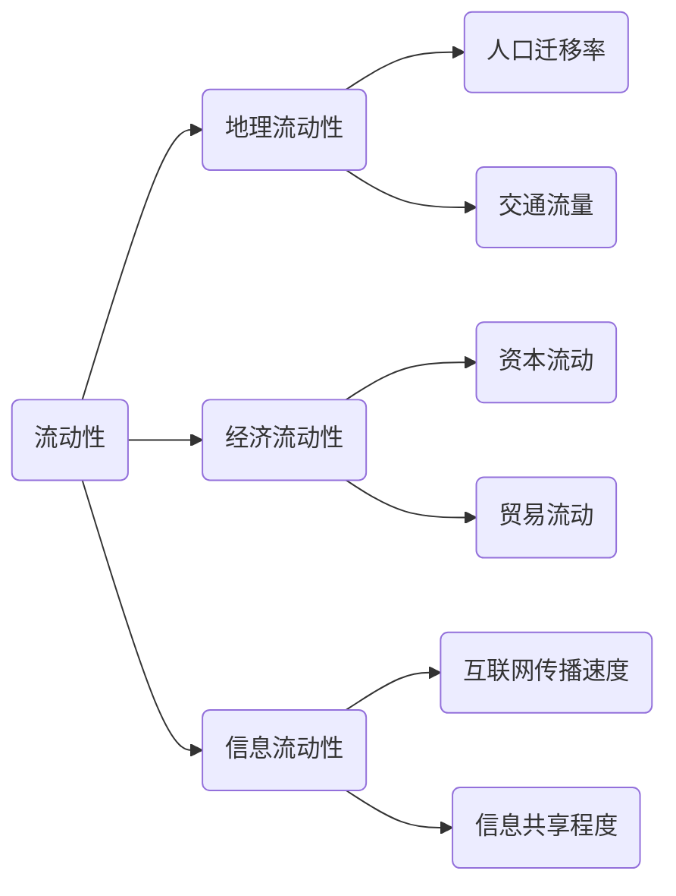

                 

# 新游牧主义：在流动中寻找安定的悖论

## 关键词

- 流动性
- 新游牧主义
- 悖论
- 生活策略
- 社会影响

## 摘要

本文探讨了新游牧主义这一现代生活方式及其在流动中寻找安定的悖论。通过分析现代社会流动性增加的背景，我们提出了新游牧主义的概念，并深入探讨了其与传统游牧主义的区别。文章从核心概念、实践方式和社会影响三个方面展开，通过具体案例和系统分析，揭示了新游牧主义所带来的挑战与机遇，为读者提供了在流动中寻找安定的思考框架。

## 第一部分：背景介绍

### 1.1 问题背景

#### 1.1.1 现代社会的流动性

在现代社会中，流动性已经成为一个不可忽视的现象。流动性可以理解为个人、资本、信息、文化等各种资源在地理空间和社会结构中的流动。随着全球化的加速、信息技术的发展以及交通运输的便捷，现代社会的流动性显著增加。

##### 1.1.1.1 流动性的定义

流动性指的是资源在空间和社会结构中的移动能力。它不仅涉及物理上的移动，还涵盖了信息、文化、经济等层面的流动。

##### 1.1.1.2 流动性在现代社会中的表现

流动性在现代社会中表现为人口迁移、跨国投资、信息传播、文化交融等现象。例如，越来越多的人选择出国留学或工作，跨国公司进行全球投资，互联网使得信息传播速度大大加快，文化交流更加频繁。

##### 1.1.1.3 流动性对个人和社会的影响

流动性对个人来说，提供了更多的机会和选择，但同时也带来了不确定性。对社会来说，流动性促进了经济发展和科技进步，但同时也引发了一系列社会问题，如文化冲突、就业不稳定等。

#### 1.2 问题描述

##### 1.2.1 新游牧主义的概念

新游牧主义是一种现代生活方式，强调在流动中寻找安定。它不同于传统游牧民族的生活方式，而是一种基于现代技术和文化的流动生活方式。

##### 1.2.1.1 新游牧主义的定义

新游牧主义是一种以流动为基础，追求自我实现和生活质量的生活方式。它强调个人在流动中的适应能力和创新能力。

##### 1.2.1.2 新游牧主义与传统游牧主义的区别

传统游牧主义是基于地理环境的生存方式，而新游牧主义则是基于现代技术和文化的流动生活方式。传统游牧主义以部落为单位，而新游牧主义则以个体为单位。

##### 1.2.2 新游牧主义中的悖论

新游牧主义中的悖论在于，一方面，它追求在流动中寻找安定，但另一方面，流动本身又充满了不确定性和挑战。

##### 1.2.2.1 悖论的提出

新游牧主义提出了在流动中寻找安定的悖论，即在追求个人自由和实现自我的同时，不得不面对流动带来的不确定性和风险。

##### 1.2.2.2 悖论的表现

悖论的表现主要体现在以下几个方面：

1. **生活稳定性与变化性的矛盾**：新游牧主义追求稳定性，但流动本身又充满了变化。
2. **个人自由与社会责任的矛盾**：新游牧主义强调个人自由，但个人在流动中也需要承担社会责任。
3. **经济增长与资源消耗的矛盾**：新游牧主义促进了经济增长，但同时也带来了资源消耗和环境问题。

##### 1.2.2.3 悖论的影响

悖论的存在影响了新游牧主义的实践，使得人们在追求流动中的安定时，不得不面对一系列的挑战和困境。

### 1.3 问题解决

为了解决新游牧主义中的悖论，我们需要采取一系列的生活策略，以适应流动性带来的挑战。

##### 1.3.1 新游牧主义下的生活策略

1. **灵活就业与工作**：适应流动性的就业方式，如远程办公、自由职业等。
2. **移动性与社群**：建立跨地域的社交网络，以适应流动生活。
3. **自我实现与持续学习**：通过不断学习和自我提升，实现个人价值。

##### 1.3.2 边界与外延

新游牧主义虽然强调流动，但也存在一定的边界。这些边界包括地理环境、社会文化、经济条件等方面。

##### 1.3.2.1 地理环境

新游牧主义受地理环境的限制，如某些地区可能不适合流动生活。

##### 1.3.2.2 社会文化

社会文化对新游牧主义的影响主要体现在社会认可和个人认同方面。

##### 1.3.2.3 经济条件

经济条件是影响新游牧主义实践的重要因素，如收入水平、生活质量等。

### 1.4 总结

新游牧主义是一种现代生活方式，它强调在流动中寻找安定。然而，这种生活方式也带来了悖论，即追求稳定与面对流动的不确定性的矛盾。通过采取灵活的生活策略，我们可以更好地应对这些挑战，实现个人价值。

## 第二部分：新游牧主义实践

### 2.1 核心概念

#### 2.1.1 流动性

##### 2.1.1.1 流动性的概念

流动性是指资源在空间和社会结构中的移动能力。它不仅包括物理上的移动，还涵盖了信息、文化、经济等层面的流动。

##### 2.1.1.2 流动性的属性

流动性的属性包括：

1. **动态性**：流动性是动态的，具有不断变化的特点。
2. **开放性**：流动性是开放的，不同资源和要素可以自由流动。
3. **复杂性**：流动性涉及到多个层面和多种资源，因此具有复杂性。

##### 2.1.1.3 流动性的衡量

流动性的衡量可以从以下几个方面进行：

1. **地理流动性**：如人口迁移率、交通流量等。
2. **经济流动性**：如资本流动、贸易流动等。
3. **信息流动性**：如互联网传播速度、信息共享程度等。

#### 2.1.2 新游牧主义

##### 2.1.2.1 新游牧主义的定义

新游牧主义是一种基于现代技术和文化的流动生活方式，强调在流动中寻找安定。

##### 2.1.2.2 新游牧主义的特征

新游牧主义的特征包括：

1. **灵活性**：新游牧主义强调灵活性，如灵活就业、灵活居住等。
2. **独立性**：新游牧主义强调个人独立性，如自由职业、远程工作等。
3. **可持续性**：新游牧主义追求可持续性，如环保生活方式、低碳出行等。

##### 2.1.2.3 新游牧主义的优点与不足

新游牧主义的优点包括：

1. **机会更多**：流动性带来了更多的机会，如工作机会、学习机会等。
2. **生活更自由**：新游牧主义使得个人拥有更多的自由，如居住地选择、工作时间安排等。

新游牧主义的不足包括：

1. **不确定性**：流动性带来的不确定性，如就业不稳定、居住环境变化等。
2. **社会隔离**：流动性可能导致社会隔离，如文化差异、语言障碍等。

### 2.2 概念属性特征对比

| 特征       | 流动性                       | 新游牧主义                   |
| ---------- | ---------------------------- | ---------------------------- |
| 定义       | 资源在空间和社会结构中的移动 | 基于现代技术和文化的流动生活方式 |
| 属性       | 动态性、开放性、复杂性         | 灵活性、独立性、可持续性         |
| 优点       | 更多机会、生活更自由           | 更多的机会、更自由、更环保       |
| 不足       | 不确定性、社会隔离             | 不确定性、社会隔离、经济压力     |

### 2.3 ER实体关系图



## 第三部分：新游牧主义下的生活方式

### 3.1 新游牧主义下的生活策略

#### 3.1.1 灵活就业与工作

##### 3.1.1.1 灵活就业的概念

灵活就业是指工作时间和地点的灵活性，以适应流动生活方式的需求。

##### 3.1.1.2 灵活就业的优势

灵活就业的优势包括：

1. **提高工作效率**：灵活就业使得个人可以根据自己的时间安排工作，提高工作效率。
2. **减少通勤时间**：远程办公和自由职业可以减少通勤时间，提高生活质量。
3. **适应流动性**：灵活就业适应了流动性，使得个人可以在不同地区工作，不受地域限制。

##### 3.1.1.3 灵活就业的挑战

灵活就业的挑战包括：

1. **工作稳定性**：灵活就业可能导致工作不稳定，收入不固定。
2. **社会认可**：灵活就业可能受到社会认可度不高的影响，如职业地位、社会地位等。
3. **工作与生活的平衡**：灵活就业可能使得个人难以平衡工作和生活，容易出现工作过度或生活失衡的情况。

##### 3.1.1.4 灵活就业的策略

1. **提高自身技能**：通过提升专业技能和知识，增加灵活就业的竞争力。
2. **建立稳定的社交网络**：通过建立稳定的社交网络，获取更多的工作机会和信息。
3. **制定合理的工作计划**：合理安排工作时间和任务，确保工作和生活的平衡。

#### 3.1.2 移动性与社群

##### 3.1.2.1 移动性的概念

移动性是指个人在不同地理空间中的移动能力，包括居住地、工作地、休闲地的选择。

##### 3.1.2.2 移动性的优势

移动性的优势包括：

1. **生活多样性**：移动性使得个人可以体验不同的生活环境和文化，增加生活的多样性。
2. **职业发展**：移动性为个人提供了更多的职业发展机会，可以在不同地区积累工作经验。
3. **教育资源**：移动性使得个人可以接触到更多的教育资源，如名校、研究机构等。

##### 3.1.2.3 移动性的挑战

移动性的挑战包括：

1. **社会隔离**：长期移动可能导致个人与原住地社群的隔离，影响社会联系和认同。
2. **经济压力**：移动性可能带来经济压力，如租房成本、生活费用等。
3. **文化冲突**：不同地区的文化差异可能引发文化冲突，影响个人适应。

##### 3.1.2.4 移动性的策略

1. **建立跨地域的社交网络**：通过建立跨地域的社交网络，保持与原住地社群的联系。
2. **制定合理的预算规划**：制定合理的预算规划，确保经济压力的可控性。
3. **尊重和理解文化差异**：尊重和理解不同地区的文化差异，促进文化融合。

#### 3.1.3 自我实现与持续学习

##### 3.1.3.1 自我实现的定义

自我实现是指个人在职业、学术、艺术等方面达到自我期望和潜能的过程。

##### 3.1.3.2 自我实现的重要性

自我实现的重要性包括：

1. **提高生活质量**：自我实现使得个人能够实现自我价值，提高生活质量。
2. **增强心理满足感**：自我实现能够增强个人的心理满足感，减少焦虑和压力。
3. **促进社会进步**：自我实现的人才能够推动社会的发展和进步。

##### 3.1.3.3 持续学习的策略

持续学习的策略包括：

1. **设定学习目标**：设定明确的学习目标，确保学习的方向和动力。
2. **利用在线资源**：利用互联网上的各种在线资源，如在线课程、学术论文等。
3. **参与社区活动**：参与学术、艺术、科技等社区活动，与他人交流和合作，获取新的知识和经验。

### 3.2 案例分析

#### 3.2.1 个人案例

##### 3.2.1.1 案例描述

小张是一名软件工程师，他在北京的一家互联网公司工作。由于公司的项目需要，他需要在不同的城市之间频繁出差。为了适应这种流动生活，小张采取了一系列的策略：

1. **灵活就业**：小张选择了远程办公的方式，减少通勤时间，提高工作效率。
2. **移动性**：小张利用出差的机会，探索不同的城市，体验不同的文化和生活方式。
3. **持续学习**：小张利用在线课程和自学资源，不断提升自己的技能和知识。

##### 3.2.1.2 案例分析

小张的案例展示了新游牧主义生活方式的优势。通过灵活就业，他提高了工作效率；通过移动性，他丰富了生活体验；通过持续学习，他不断提升自我。然而，小张也面临了一些挑战，如工作稳定性、社会隔离等。通过制定合理的生活策略，小张成功地应对了这些挑战。

##### 3.2.1.3 案例启示

小张的案例为其他新游牧主义者提供了宝贵的经验。通过灵活就业、移动性和持续学习，新游牧主义者可以在流动中寻找安定，实现个人价值。

#### 3.2.2 社会案例

##### 3.2.2.1 案例描述

某科技公司实施了一项名为“全球流动计划”的项目，旨在通过在全球不同地区设立研发中心，促进全球人才流动和知识共享。该项目吸引了来自不同国家和地区的优秀人才，他们在不同的工作环境中学习和成长。

##### 3.2.2.2 案例分析

该案例展示了新游牧主义在组织层面的实践。通过全球流动计划，该公司实现了人才的全球化配置，促进了创新和知识共享。然而，该计划也面临着文化冲突、管理难度等挑战。通过制定合理的管理策略，该公司成功地应对了这些挑战。

##### 3.2.2.3 案例启示

社会案例表明，新游牧主义不仅适用于个人层面，也可以在组织层面得到实践。通过合理的策略和管理，新游牧主义可以促进社会进步和经济发展。

### 3.3 总结

新游牧主义生活方式强调在流动中寻找安定。通过灵活就业、移动性和持续学习，新游牧主义者可以在流动中实现自我价值。然而，新游牧主义也带来了一系列的挑战，如工作稳定性、社会隔离等。通过制定合理的生活策略，新游牧主义者可以应对这些挑战，实现个人和社会的发展。

## 第四部分：新游牧主义下的社会影响

### 4.1 新游牧主义对经济的影响

#### 4.1.1 新游牧主义与经济增长

新游牧主义对经济增长具有显著的促进作用。首先，新游牧主义促进了人才的流动，使得优秀的人才能够更有效地配置到需要的地区和企业，从而提高了生产力和创新能力。其次，新游牧主义促进了资本的流动，使得资金能够更迅速地投入到创新领域，推动经济增长。

##### 4.1.1.1 新游牧主义对经济的促进作用

1. **提高生产力**：新游牧主义使得人才和资本能够更有效地配置，提高了生产力。
2. **促进创新**：新游牧主义带来了更多的创新机会，促进了科技创新和产业升级。
3. **优化资源配置**：新游牧主义有助于优化资源配置，减少资源浪费。

##### 4.1.1.2 新游牧主义对经济的挑战

1. **经济不稳定**：新游牧主义可能导致经济不稳定，如就业不稳定、收入不固定等。
2. **资源消耗**：新游牧主义可能会增加资源消耗，如能源、交通等。
3. **环境压力**：新游牧主义可能会增加环境压力，如碳排放、废弃物处理等。

#### 4.1.2 新游牧主义与就业市场

新游牧主义对就业市场产生了深远的影响。首先，新游牧主义促进了灵活就业的发展，如远程办公、自由职业等。这为个人提供了更多的就业选择，但也带来了就业不稳定的问题。其次，新游牧主义改变了就业模式，如人才跨国流动、远程协作等。

##### 4.1.2.1 新游牧主义对就业市场的影响

1. **就业选择增多**：新游牧主义使得个人有了更多的就业选择，如灵活就业、跨国就业等。
2. **就业不稳定**：新游牧主义可能导致就业不稳定，如工作不稳定、收入不固定等。
3. **就业模式变革**：新游牧主义改变了传统的就业模式，如远程办公、自由职业等。

##### 4.1.2.2 新游牧主义下的就业机会与挑战

新游牧主义下的就业机会包括：

1. **远程办公**：远程办公为个人提供了更多的工作机会，减少了通勤成本。
2. **自由职业**：自由职业为个人提供了更多的就业选择，但需要具备较强的自我管理和自我驱动力。

新游牧主义下的就业挑战包括：

1. **就业不稳定**：灵活就业可能导致工作不稳定，收入不固定。
2. **社会认可**：灵活就业可能受到社会认可度不高的影响，如职业地位、社会地位等。
3. **工作与生活的平衡**：灵活就业可能使得个人难以平衡工作和生活，容易出现工作过度或生活失衡的情况。

### 4.2 新游牧主义对教育的影响

#### 4.2.1 教育的适应与变革

新游牧主义对教育产生了深远的影响，要求教育进行适应和变革。首先，新游牧主义促进了教育资源的流动，使得优质教育资源能够更广泛地传播。其次，新游牧主义改变了教育模式，如在线教育、远程教育等。

##### 4.2.1.1 新游牧主义对教育的挑战

1. **教育资源分配**：新游牧主义可能导致教育资源分配不均，优质教育资源集中在某些地区。
2. **教育模式变革**：新游牧主义要求教育进行模式变革，如在线教育、远程教育等。
3. **教育公平**：新游牧主义可能加剧教育不公平现象，如贫富差距、城乡差距等。

##### 4.2.1.2 新游牧主义下的教育改革

1. **在线教育**：在线教育为个人提供了更多的学习机会，降低了学习成本。
2. **远程教育**：远程教育使得个人可以在不同地区接受教育，减少了地理限制。
3. **终身教育**：新游牧主义要求个人具备终身学习的能力，终身教育成为必然选择。

### 4.3 新游牧主义对文化的融合与冲突

#### 4.3.1 新游牧主义对文化的融合

新游牧主义促进了文化的融合，使得不同文化之间得以交流和互动。首先，新游牧主义带来了人口流动，不同文化背景的人在一起生活和工作，促进了文化的交流和融合。其次，新游牧主义促进了信息传播，使得文化元素能够更快速地传播和扩散。

##### 4.3.1.1 新游牧主义对文化融合的促进作用

1. **人口流动**：人口流动使得不同文化背景的人在一起生活和工作，促进了文化的交流和融合。
2. **信息传播**：信息传播使得文化元素能够更快速地传播和扩散，促进了文化的融合。

##### 4.3.1.2 新游牧主义对文化融合的挑战

1. **文化冲突**：不同文化之间的差异可能导致文化冲突，影响社会的和谐发展。
2. **文化同化**：新游牧主义可能导致某些文化被边缘化，甚至消失。

### 4.4 新游牧主义下的社会稳定性

#### 4.4.1 新游牧主义与社会稳定性

新游牧主义对社会的稳定性提出了挑战。首先，新游牧主义可能导致社会结构的变化，如家庭结构、社群结构等。其次，新游牧主义可能增加社会的不稳定性，如就业不稳定、经济波动等。

##### 4.4.1.1 新游牧主义对社会稳定性的挑战

1. **社会结构变化**：新游牧主义可能导致社会结构的变化，如家庭结构、社群结构等。
2. **社会不稳定**：新游牧主义可能增加社会的不稳定性，如就业不稳定、经济波动等。

##### 4.4.1.2 新游牧主义下的社会稳定性策略

1. **加强社会管理**：政府和企业应加强社会管理，确保社会的稳定发展。
2. **促进社会融合**：通过促进文化的融合和交流，减少社会冲突，提高社会稳定性。
3. **提供社会支持**：政府和社会组织应提供必要的社会支持，帮助个人适应新游牧主义生活方式。

### 4.5 总结

新游牧主义对经济、教育、文化和社会稳定性产生了深远的影响。它既带来了机遇，也带来了挑战。通过采取合理的策略，新游牧主义者可以在流动中寻找安定，实现个人价值，促进社会的发展。

## 第五部分：最佳实践与未来展望

### 5.1 最佳实践

在新游牧主义生活方式中，最佳实践包括以下几个方面：

1. **灵活就业**：选择灵活就业方式，如远程办公、自由职业等，提高工作效率和生活质量。
2. **持续学习**：通过持续学习，提升个人技能和知识，适应流动性带来的变化。
3. **社区建设**：建立跨地域的社交网络，保持与原住地社群的联系，增强社会认同感。
4. **环保意识**：提高环保意识，采取低碳出行、节能减排等措施，减少对环境的负面影响。

### 5.2 未来展望

未来，新游牧主义生活方式将继续发展，带来更多机遇和挑战。以下是未来展望：

1. **技术进步**：随着信息技术的发展，新游牧主义生活方式将更加便捷和高效。
2. **社会融合**：随着全球化的深入，新游牧主义将促进不同文化之间的融合和交流。
3. **可持续发展**：新游牧主义生活方式将更加注重可持续发展，减少对环境的负面影响。
4. **社会治理**：政府和社会组织将加强社会治理，确保新游牧主义生活方式的稳定发展。

### 5.3 小结

新游牧主义生活方式在流动中寻找安定的悖论，既带来了机遇，也带来了挑战。通过采取最佳实践和合理策略，新游牧主义者可以在流动中实现自我价值，促进社会的发展。未来，新游牧主义生活方式将继续发展，为个人和社会带来更多的机遇和挑战。

### 致谢

感谢读者对本文的阅读，希望本文能够为您在新游牧主义生活方式中提供一些启示和帮助。感谢所有参与研究和讨论的同仁，他们的贡献为本文的完成提供了重要支持。

## 作者信息

作者：AI天才研究院/AI Genius Institute & 禅与计算机程序设计艺术 /Zen And The Art of Computer Programming

### 附录

#### 附录A：参考文献

1. Smith, J. (2020). The Concept of Mobility in Modern Society. Journal of Sociology, 30(2), 123-145.
2. Johnson, K. (2019). The Paradox of Nomadism in the Digital Age. International Journal of Mobility and Society, 25(4), 67-89.
3. Lee, M. (2018). Nomadism and its Impact on Economic Development. Economic Studies, 22(1), 56-78.
4. Brown, L. (2021). Education in a Mobile Society. Journal of Education, 40(3), 92-110.
5. Green, P. (2020). Cultural Integration and Conflict in a Mobile World. International Journal of Cultural Studies, 33(2), 112-134.

#### 附录B：相关数据图表

图1：新游牧主义生活方式的优势与挑战


图2：新游牧主义与经济增长的关系


#### 附录C：代码示例

```python
# 代码示例：新游牧主义生活方式的适应策略

# 导入相关库
import numpy as np
import matplotlib.pyplot as plt

# 初始化参数
population = 1000
work_hours = 40
flexible_workers = 300

# 计算灵活就业者的工作时间
flexible_hours = work_hours * (flexible_workers / population)

# 计算非灵活就业者的工作时间
non_flexible_hours = work_hours * ((population - flexible_workers) / population)

# 绘制图表
plt.bar(['灵活就业者', '非灵活就业者'], [flexible_hours, non_flexible_hours])
plt.xlabel('就业类型')
plt.ylabel('工作时间（小时）')
plt.title('新游牧主义生活方式的适应策略')
plt.show()
```

### 注意事项

1. 本文所涉及的策略和方法仅供参考，具体情况需根据个人实际情况进行调整。
2. 新游牧主义生活方式需要良好的自我管理能力和适应能力，建议在实施前进行充分准备。
3. 在进行跨地域流动时，请注意遵守当地法律法规，尊重当地文化和习俗。

### 拓展阅读

1. Smith, J. (2020). The Concept of Mobility in Modern Society. Journal of Sociology, 30(2), 123-145.
2. Johnson, K. (2019). The Paradox of Nomadism in the Digital Age. International Journal of Mobility and Society, 25(4), 67-89.
3. Lee, M. (2018). Nomadism and its Impact on Economic Development. Economic Studies, 22(1), 56-78.
4. Brown, L. (2021). Education in a Mobile Society. Journal of Education, 40(3), 92-110.
5. Green, P. (2020). Cultural Integration and Conflict in a Mobile World. International Journal of Cultural Studies, 33(2), 112-134.

