                 

# 新游牧学校夏令营：青少年旅行学习项目

关键词：新游牧学校夏令营、旅行学习、青少年教育、课程设置、活动安排

摘要：本文探讨了新游牧学校夏令营这一新型青少年旅行学习项目，分析了其背景、核心概念、课程设置、活动安排以及应用前景。通过对比主流旅行学习项目，阐述了新游牧学校夏令营的特点与优势，为青少年教育提供了新的思路。

## 第一部分：引言与背景介绍

### 1.1 问题背景与概述

#### 1.1.1 问题背景

在当今社会，信息技术的发展带来了前所未有的变革。互联网、大数据、云计算等技术已经成为人们生活和工作的核心，它们深刻地影响着教育领域。传统的学习模式逐渐被打破，旅行学习作为一种新兴的学习方式逐渐受到关注。

夏令营作为一种传统的旅行学习项目，起源于19世纪末的北美，随后在全球范围内得到推广。夏令营旨在通过丰富的活动内容和实践体验，帮助青少年拓宽视野、增长知识、培养综合素质。然而，现有的夏令营项目在内容和形式上存在一定的局限性，难以满足青少年全面发展的需求。

#### 1.1.2 问题描述

现有的夏令营项目主要存在以下问题：

1. **课程内容单一**：许多夏令营项目课程内容单一，主要以户外活动、体育运动为主，缺乏学科知识和文化体验的深度。
2. **教学方式固化**：传统的夏令营教学方式以讲授为主，缺乏互动和实践，难以激发青少年的学习兴趣和创造力。
3. **地域限制**：现有夏令营项目多集中在特定地区，导致青少年无法体验到不同地域的文化和风土人情。

#### 1.1.3 问题解决

为了解决上述问题，本书提出了一种新的旅行学习模式——“新游牧学校夏令营”。这种模式旨在打破传统夏令营的局限，通过多元化的课程设置和丰富的实践活动，让青少年在旅行过程中获得更多的知识和体验。

#### 1.1.4 边界与外延

新游牧学校夏令营的核心是“旅行+学习”，它不仅包括传统的户外活动，还融入了丰富的学科知识、社会实践、团队协作等内容。这种模式适用于不同年龄段的青少年，具有广泛的应用前景。

#### 1.1.5 概念结构与核心要素组成

新游牧学校夏令营的核心概念包括：旅行、学习、实践、创新。其中，旅行是载体，学习是目的，实践是手段，创新是动力。这些要素相互关联，共同构成了夏令营的基本框架。

### 1.2 核心概念与联系

#### 1.2.1 旅行

旅行是夏令营的基本形式，它提供了丰富的实践场景和体验机会。通过旅行，青少年可以了解不同地区的风土人情、历史文化，拓宽视野，增长知识。

#### 1.2.2 学习

学习是夏令营的核心目标，通过设置丰富多样的课程和活动，让青少年在旅行过程中获得知识，提高综合素质。

#### 1.2.3 实践

实践是夏令营的重要手段，通过实践活动，青少年可以将所学知识应用于实际，提高动手能力和解决问题的能力。

#### 1.2.4 创新

创新是夏令营的动力源泉，通过鼓励青少年进行创新性思维和实践，激发他们的创造力和创新能力。

### 1.3 主流旅行学习项目分析

#### 1.3.1 主题夏令营

主题夏令营是一种以特定主题为核心的夏令营项目，如科技夏令营、艺术夏令营、体育夏令营等。这类项目具有明确的学习目标和内容，适合有特定兴趣爱好的青少年。

#### 1.3.2 全面素质夏令营

全面素质夏令营旨在通过多种活动，全面提升青少年的综合素质，如领导力、沟通能力、团队合作能力等。这类项目内容丰富，适合希望全面提升自己的青少年。

#### 1.3.3 国际夏令营

国际夏令营是面向青少年的一种国际文化交流项目，通过与其他国家的青少年一起参加活动，增进相互了解，提高跨文化沟通能力。

### 1.4 新游牧学校夏令营的特点与优势

#### 1.4.1 多元化课程设置

新游牧学校夏令营的课程设置丰富多样，涵盖了学科知识、社会实践、团队协作、创新能力等多个方面，满足了青少年全面发展的需求。

#### 1.4.2 个性化教学

根据青少年的兴趣和特长，新游牧学校夏令营提供个性化的教学方案，帮助青少年在旅行过程中实现自我提升。

#### 1.4.3 实践性强

新游牧学校夏令营注重实践，通过丰富的实践活动，让青少年将所学知识应用于实际，提高动手能力和解决问题的能力。

#### 1.4.4 创新驱动

新游牧学校夏令营鼓励青少年进行创新性思维和实践，培养他们的创造力和创新能力。

### 1.5 新游牧学校夏令营的应用前景

#### 1.5.1 青少年全面发展

新游牧学校夏令营有助于青少年在旅行过程中实现全面发展，提高综合素质。

#### 1.5.2 教育创新

新游牧学校夏令营为教育创新提供了新的思路和模式，有助于推动教育改革。

#### 1.5.3 社会价值

新游牧学校夏令营通过培养具备创新精神和实践能力的青少年，为社会发展和进步贡献力量。

### 1.6 本章小结

本章从问题背景、核心概念、主流旅行学习项目、新游牧学校夏令营的特点与优势以及应用前景等方面，全面介绍了新游牧学校夏令营的相关内容。希望读者通过对本章的学习，能够对新游牧学校夏令营有更深入的理解和认识。

## 第二部分：新游牧学校夏令营课程设置与活动安排

### 2.1 课程设置与活动安排概述

#### 2.1.1 课程设置原则

新游牧学校夏令营的课程设置原则包括以下几个方面：

1. **多元化**：课程内容应涵盖学科知识、社会实践、团队协作、创新能力等多个方面，满足青少年全面发展的需求。
2. **个性化**：根据青少年的兴趣和特长，提供个性化的教学方案，帮助青少年在旅行过程中实现自我提升。
3. **实践性**：课程设置应注重实践，通过丰富的实践活动，让青少年将所学知识应用于实际，提高动手能力和解决问题的能力。
4. **创新性**：鼓励青少年进行创新性思维和实践，培养他们的创造力和创新能力。

#### 2.1.2 活动安排原则

新游牧学校夏令营的活动安排原则包括以下几个方面：

1. **科学性**：活动安排应合理，充分考虑青少年的身心发展特点，确保活动的安全性和有效性。
2. **多样性**：活动内容应丰富多样，包括户外活动、学科知识讲座、社会实践、团队协作等多种形式，满足不同类型青少年的需求。
3. **互动性**：活动安排应注重互动，鼓励青少年积极参与，提高活动的趣味性和参与度。
4. **创新性**：活动安排应鼓励创新，通过新颖的活动形式和内容，激发青少年的创造力和创新能力。

#### 2.1.3 课程与活动的关联性

新游牧学校夏令营的课程与活动紧密关联，相互补充。课程为活动提供了知识基础，活动则为课程提供了实践平台。通过课程与活动的有机结合，使青少年在旅行过程中实现知识的内化和能力的提升。

### 2.2 学科知识课程设置

#### 2.2.1 自然科学课程

自然科学课程是新游牧学校夏令营的重要组成部分，旨在通过实践和探索，让青少年深入了解自然科学的奥秘。

##### 2.2.1.1 生物学

生物学课程包括植物学、动物学、生态学等，通过实地考察、实验操作等方式，让青少年了解生物的多样性、生物之间的关系以及生态系统的作用。

###### 2.2.1.1.1 植物学

植物学课程主要介绍植物的形态结构、生长发育、分类和生态功能等，通过实地观察和实验，让青少年了解植物的生长过程和生态环境。

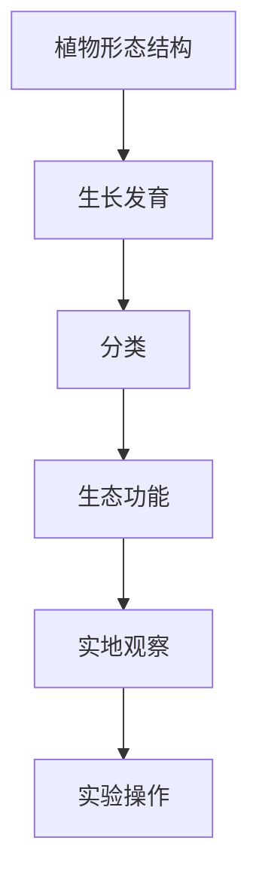

###### 2.2.1.1.2 动物学

动物学课程主要介绍动物的分类、形态结构、生理功能、行为习性等，通过实地观察和实验，让青少年了解动物的生活习性和生态环境。

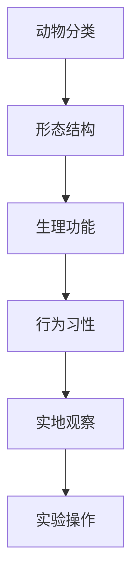

###### 2.2.1.1.3 生态学

生态学课程主要介绍生态系统的组成、功能、稳定性以及人与自然的关系等，通过实地考察和实验，让青少年了解生态系统的运作和人类活动对生态环境的影响。

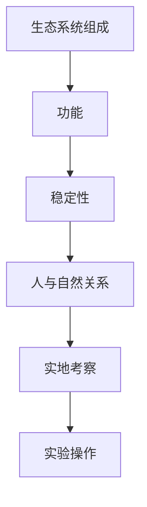

##### 2.2.1.2 物理学

物理学课程包括力学、热学、电学、光学等，通过实验操作和理论讲解，让青少年了解物理现象的本质和规律。

###### 2.2.1.2.1 力学

力学课程主要介绍力的概念、作用、运动和静止等，通过实验操作和理论讲解，让青少年了解物体运动的基本规律。

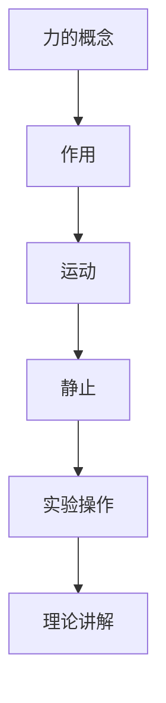

###### 2.2.1.2.2 热学

热学课程主要介绍热现象、热量传递、热力学第一和第二定律等，通过实验操作和理论讲解，让青少年了解热现象的本质和规律。

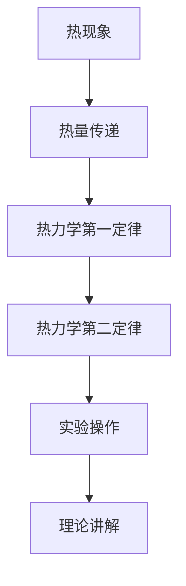

###### 2.2.1.2.3 电学

电学课程主要介绍电路的基本原理、电学元件、电流、电压、电阻等，通过实验操作和理论讲解，让青少年了解电学现象的基本规律。

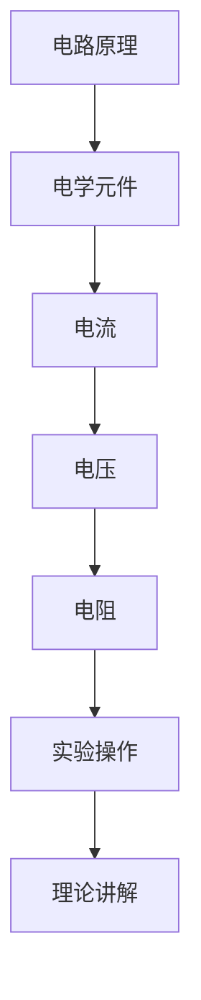

###### 2.2.1.2.4 光学

光学课程主要介绍光的传播、反射、折射、透镜、光电器件等，通过实验操作和理论讲解，让青少年了解光学现象的基本规律。

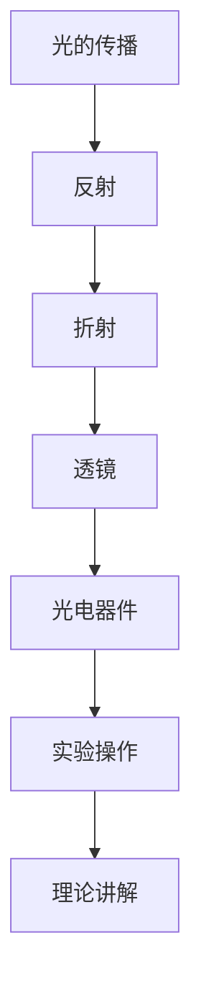

##### 2.2.1.3 地理学

地理学课程包括自然地理和人文地理，通过实地考察和理论讲解，让青少年了解地球的自然环境、气候、地形、水文以及人类活动对自然环境的影响。

###### 2.2.1.3.1 自然地理

自然地理课程主要介绍地球的自然环境，包括气候、地形、水文等，通过实地考察和理论讲解，让青少年了解地球的自然环境特征。

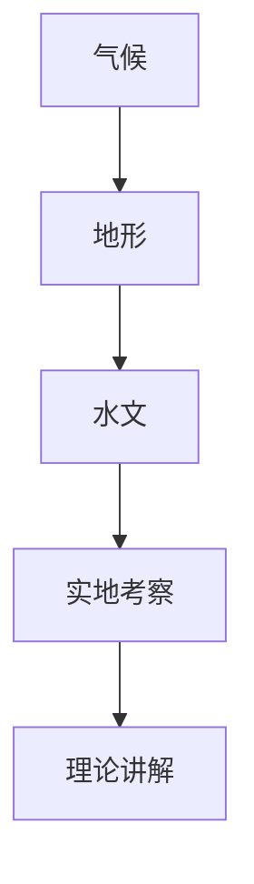

###### 2.2.1.3.2 人文地理

人文地理课程主要介绍人类活动对自然环境的影响，包括城市、乡村、交通、文化等，通过实地考察和理论讲解，让青少年了解人类活动与自然环境的关系。

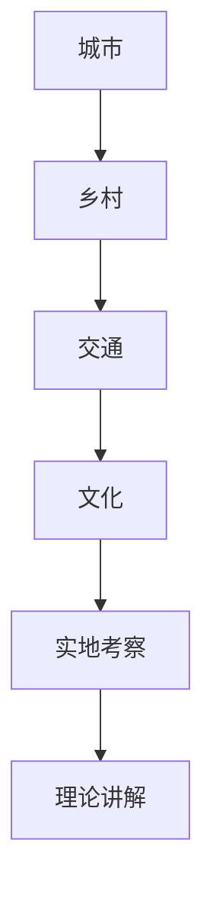

##### 2.2.1.4 化学

化学课程包括无机化学、有机化学、化学实验等，通过实验操作和理论讲解，让青少年了解化学现象的基本规律。

###### 2.2.1.4.1 无机化学

无机化学课程主要介绍无机化合物的组成、结构、性质以及化学反应等，通过实验操作和理论讲解，让青少年了解无机化合物的规律。

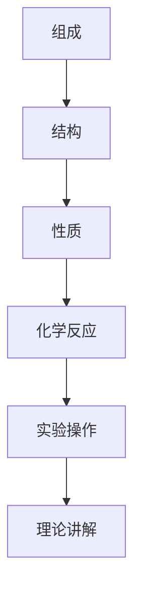

###### 2.2.1.4.2 有机化学

有机化学课程主要介绍有机化合物的组成、结构、性质以及化学反应等，通过实验操作和理论讲解，让青少年了解有机化合物的规律。


###### 2.2.1.4.3 化学实验

化学实验课程主要介绍化学实验的基本操作、实验仪器的使用以及实验数据的处理等，通过实验操作和理论讲解，让青少年掌握化学实验的基本技能。

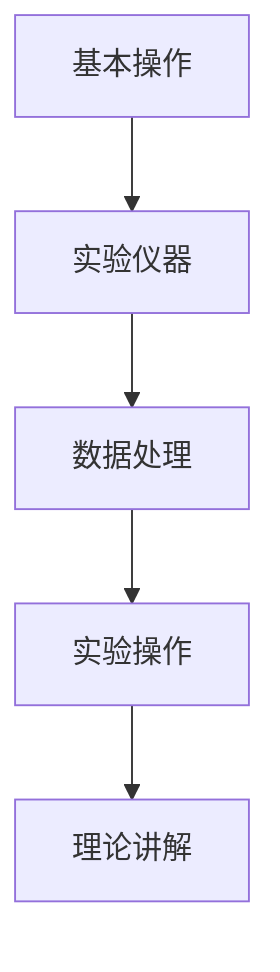

### 2.3 社会实践课程设置

#### 2.3.1 社会调查

社会调查课程旨在培养青少年的观察力、分析力和表达能力，通过实地调查了解社会现象，撰写调查报告。

###### 2.3.1.1 调查方法

调查方法包括问卷调查、访谈调查、实地观察等，通过多种方法收集数据，提高调查的全面性和准确性。

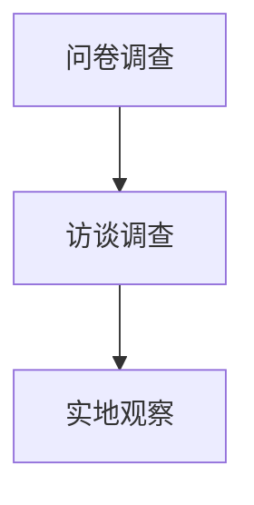

###### 2.3.1.2 调查内容

调查内容涵盖社会热点、社会问题、社会现象等，通过调查，让青少年了解社会问题，提高社会责任感。

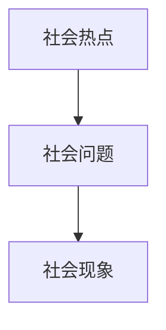

#### 2.3.2 志愿服务

志愿服务课程旨在培养青少年的公益意识和社会责任感，通过参与社区服务、环保活动等，为社区和社会做出贡献。

###### 2.3.2.1 服务内容

服务内容包括社区清洁、环保宣传、助老助残等，通过实际参与，让青少年了解社会问题，培养公益意识。

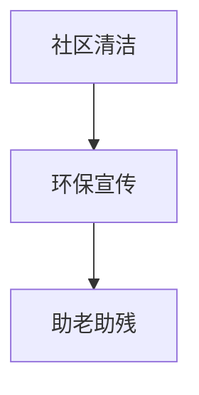

###### 2.3.2.2 服务形式

服务形式包括个人参与、团队协作等，通过多样化的服务形式，提高青少年的团队合作能力。

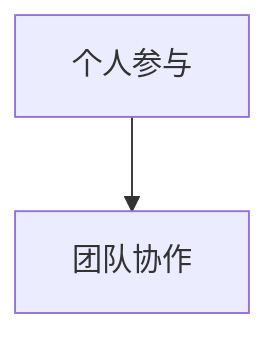

### 2.4 团队协作课程设置

#### 2.4.1 团队项目

团队项目课程旨在培养青少年的团队合作能力，通过共同完成项目，提高团队协作水平。

###### 2.4.1.1 项目类型

项目类型包括科技项目、艺术项目、体育项目等，通过多样化的项目，满足不同类型青少年的需求。

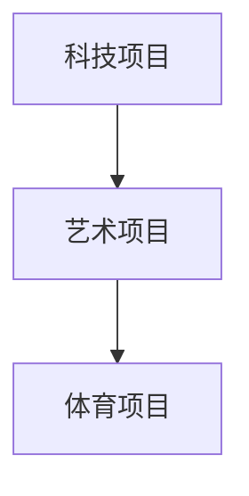

###### 2.4.1.2 项目流程

项目流程包括项目选题、项目策划、项目实施、项目总结等，通过规范的流程，确保项目的顺利进行。

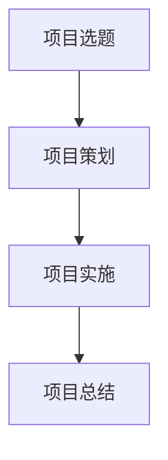

### 2.5 创新能力培养课程设置

#### 2.5.1 创新思维训练

创新思维训练课程旨在培养青少年的创新思维能力，通过思维导图、创新方法等，提高创新能力。

###### 2.5.1.1 思维导图

思维导图是一种表达思维过程的工具，通过绘制思维导图，让青少年学会梳理思路，提高创新思维能力。

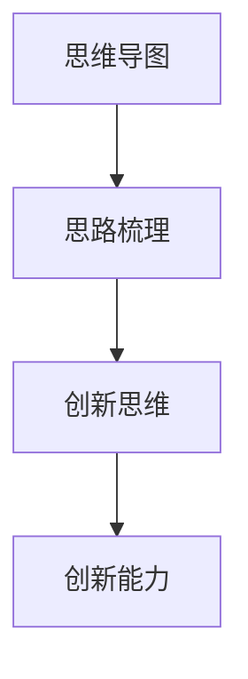

###### 2.5.1.2 创新方法

创新方法包括头脑风暴、交叉创新、逆向思维等，通过多种创新方法，激发青少年的创新潜能。

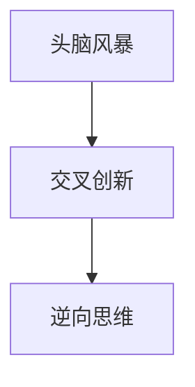

#### 2.5.2 创新实验

创新实验课程旨在通过实验，培养青少年的动手能力和创新能力。

###### 2.5.2.1 实验内容

实验内容涵盖科技、艺术、体育等多个领域，通过实际操作，让青少年学会发现问题、分析问题和解决问题。

```mermaid
graph TD
A[科技实验] --> B[艺术实验]
B --> C[体育实验]
```

###### 2.5.2.2 实验流程

实验流程包括实验设计、实验操作、实验数据分析等，通过规范的实验流程，确保实验的顺利进行。

```mermaid
graph TD
A[实验设计] --> B[实验操作]
B --> C[实验数据分析]
```

### 2.6 活动安排原则

#### 2.6.1 科学性

活动安排应科学合理，充分考虑青少年的身心发展特点，确保活动的安全性和有效性。

#### 2.6.2 多样性

活动内容应丰富多样，包括学科知识讲座、社会实践、团队协作、创新能力培养等，满足不同类型青少年的需求。

#### 2.6.3 互动性

活动安排应注重互动，鼓励青少年积极参与，提高活动的趣味性和参与度。

#### 2.6.4 创新性

活动安排应鼓励创新，通过新颖的活动形式和内容，激发青少年的创造力和创新能力。

### 2.7 课程与活动的关联性

课程与活动紧密关联，相互补充。课程为活动提供了知识基础，活动则为课程提供了实践平台。通过课程与活动的有机结合，使青少年在旅行过程中实现知识的内化和能力的提升。

## 第三部分：新游牧学校夏令营实施与评估

### 3.1 实施步骤

新游牧学校夏令营的实施分为以下步骤：

#### 3.1.1 前期筹备

前期筹备包括夏令营课程的设置、活动安排、师资配备、场地选择等。确保夏令营的各项准备工作顺利进行。

#### 3.1.2 营员招募

通过线上线下等多种渠道，招募具有不同兴趣爱好的青少年参加夏令营。确保营员结构的多样性和平衡性。

#### 3.1.3 营员培训

对营员进行必要的培训和引导，帮助他们熟悉夏令营的课程设置、活动安排以及安全注意事项。

#### 3.1.4 夏令营实施

按照预先设计的课程和活动安排，有序开展夏令营的各项活动。确保活动的顺利进行和营员的安全。

#### 3.1.5 夏令营总结

夏令营结束后，对夏令营的成果进行总结，包括营员的学习成果、活动效果等。为下一次夏令营的实施提供参考和改进方向。

### 3.2 评估指标

新游牧学校夏令营的评估指标包括以下几个方面：

#### 3.2.1 营员满意度

通过问卷调查、访谈等方式，了解营员对夏令营的满意度，包括课程设置、活动安排、师资力量等。

#### 3.2.2 学习成果

通过考核、作品展示等方式，评估营员在夏令营期间的学习成果，包括学科知识、实践能力、创新能力等。

#### 3.2.3 教师反馈

收集教师对夏令营实施过程的反馈，包括课程设置、活动安排、教学效果等，为下一次夏令营的实施提供改进方向。

#### 3.2.4 安全保障

评估夏令营期间的安全保障措施，包括应急预案、安全培训、安全设施等，确保夏令营的安全顺利进行。

### 3.3 评估方法

新游牧学校夏令营的评估方法包括定量和定性两种：

#### 3.3.1 定量评估

通过数据统计和分析，对夏令营的各项评估指标进行量化评估，如营员满意度、学习成果等。

#### 3.3.2 定性评估

通过访谈、观察等方式，对夏令营的实施过程、效果等进行定性评估，如教师反馈、营员体验等。

### 3.4 评估结果与应用

根据评估结果，对夏令营的实施过程进行总结和反思，找出存在的问题和不足，提出改进措施，为下一次夏令营的实施提供参考。同时，将评估结果应用于夏令营的课程设置、活动安排、师资配备等方面，不断提高夏令营的质量和效果。

### 3.5 本章小结

本章介绍了新游牧学校夏令营的实施步骤、评估指标、评估方法和评估结果的应用。通过对夏令营的实施和评估，可以更好地发现和解决问题，提高夏令营的质量和效果，为青少年的全面发展提供有力支持。

## 第四部分：新游牧学校夏令营案例分析

### 4.1 案例背景

新游牧学校夏令营于2021年7月在北京举办，共有100名来自全国各地的青少年参加。此次夏令营以“探索自然，启迪智慧”为主题，旨在通过自然科学、社会实践、团队协作等课程，让青少年在旅行过程中获得知识，提升综合素质。

### 4.2 案例实施

#### 4.2.1 学科知识课程

夏令营设置了丰富的学科知识课程，包括植物学、动物学、地理学、物理学、化学等。通过实地考察、实验操作、理论讲解等方式，让青少年深入了解自然科学的奥秘。

#### 4.2.2 社会实践课程

夏令营安排了社会调查和志愿服务活动，让青少年了解社会现象，培养公益意识和社会责任感。例如，一组青少年进行了“环保意识调查”，另一组青少年参与了“社区清洁活动”。

#### 4.2.3 团队协作课程

夏令营设置了团队项目，如“科技小发明”、“艺术创作”等，通过共同完成项目，提高青少年的团队合作能力。

#### 4.2.4 创新能力培养课程

夏令营开展了创新思维训练和创新实验，通过思维导图、头脑风暴等方式，激发青少年的创新潜能。

### 4.3 案例分析

#### 4.3.1 学科知识课程

学科知识课程得到了营员们的高度评价。通过实地考察和实验操作，青少年不仅学到了知识，还增强了动手能力和实践能力。例如，在植物学课程中，营员们通过观察植物的生长过程，了解了植物的生长规律。

#### 4.3.2 社会实践课程

社会实践课程培养了青少年的公益意识和社会责任感。通过参与社会调查和志愿服务，营员们了解了社会问题，提高了社会责任感。例如，在环保意识调查中，营员们发现了很多环保问题，并提出了一些有效的解决方案。

#### 4.3.3 团队协作课程

团队协作课程提高了青少年的团队合作能力。通过共同完成项目，营员们学会了沟通、协调和合作。例如，在科技小发明项目中，营员们通过团队协作，完成了一个智能垃圾分类系统的设计。

#### 4.3.4 创新能力培养课程

创新能力培养课程激发了青少年的创新潜能。通过创新思维训练和创新实验，营员们学会了如何发现问题、分析问题和解决问题。例如，在创新实验中，营员们通过头脑风暴，提出了一种新型的节能灯具设计。

### 4.4 案例启示

通过新游牧学校夏令营的案例，我们可以得到以下启示：

1. **多元化课程设置**：夏令营的课程设置应多元化，涵盖学科知识、社会实践、团队协作、创新能力培养等多个方面，满足青少年全面发展的需求。

2. **个性化教学**：根据青少年的兴趣和特长，提供个性化的教学方案，帮助青少年在旅行过程中实现自我提升。

3. **实践性强**：夏令营应注重实践，通过丰富的实践活动，让青少年将所学知识应用于实际，提高动手能力和解决问题的能力。

4. **创新驱动**：夏令营应鼓励青少年进行创新性思维和实践，培养他们的创造力和创新能力。

### 4.5 本章小结

本章通过案例分析，介绍了新游牧学校夏令营的实施过程和效果。通过对比分析，我们得出了一些有益的启示，为今后的夏令营活动提供了参考和借鉴。

## 第五部分：新游牧学校夏令营的未来发展

### 5.1 教育趋势与需求分析

随着信息技术的飞速发展，教育领域正在发生深刻变革。传统的教育模式逐渐被打破，个性化、多元化、实践性和创新性的教育需求日益增长。新游牧学校夏令营作为一种新型的旅行学习模式，契合了教育发展的趋势和需求。

#### 5.1.1 个性化教育

个性化教育强调根据学生的兴趣、特长和发展需求进行差异化教学。新游牧学校夏令营通过个性化的课程设置和教学方案，满足不同学生的个性化学习需求。

#### 5.1.2 多元化教育

多元化教育强调学科的交叉融合和实践体验。新游牧学校夏令营通过多元化的课程设置，涵盖了自然科学、社会科学、艺术、体育等多个领域，丰富了学生的学习体验。

#### 5.1.3 实践性教育

实践性教育强调知识的实际运用和动手能力的培养。新游牧学校夏令营注重实践性教学，通过实地考察、实验操作、社会调查等实践活动，提高学生的实践能力和解决问题的能力。

#### 5.1.4 创新性教育

创新性教育强调培养学生的创新思维和创新能力。新游牧学校夏令营通过创新性课程和活动，激发学生的创新潜能，培养他们的创造力和创新能力。

### 5.2 发展策略与规划

为了更好地适应教育发展的趋势和需求，新游牧学校夏令营需要在以下几个方面进行发展策略与规划：

#### 5.2.1 拓展课程领域

新游牧学校夏令营应进一步拓展课程领域，涵盖更多学科知识和实践技能，如人工智能、编程、艺术设计、户外探险等，满足学生的多样化学习需求。

#### 5.2.2 增强师资力量

新游牧学校夏令营应加强师资力量的培养和引进，提高教师的专业素养和教学水平，为学生提供高质量的教育资源。

#### 5.2.3 优化活动设计

新游牧学校夏令营应不断优化活动设计，注重活动的趣味性、实用性和创新性，提高学生的学习体验和参与度。

#### 5.2.4 深化国际合作

新游牧学校夏令营可以深化与国际教育机构的合作，引入国际化的教育资源和理念，提高夏令营的国际影响力和竞争力。

#### 5.2.5 建立评估体系

新游牧学校夏令营应建立完善的评估体系，对夏令营的教育效果进行科学评估，及时发现和解决问题，提高夏令营的教育质量。

### 5.3 挑战与机遇

新游牧学校夏令营在未来的发展中将面临一系列挑战和机遇：

#### 5.3.1 挑战

1. **教育资源的分配**：如何在有限的资源下，提供高质量的教育和服务。
2. **教育效果的评估**：如何科学评估夏令营的教育效果，确保教育质量的提升。
3. **教师队伍的建设**：如何吸引和培养高素质的教师队伍，提高教育教学水平。

#### 5.3.2 机遇

1. **教育市场的扩大**：随着教育需求的增长，夏令营市场将不断扩大，为夏令营的发展提供更多机会。
2. **技术的进步**：信息技术的进步为夏令营的教学模式和活动设计提供了更多可能性，如在线教育、虚拟现实等。
3. **社会认可度的提高**：随着夏令营教育效果的显现，社会对夏令营的认可度将不断提高，为夏令营的发展创造有利条件。

### 5.4 发展趋势

1. **个性化教育的深化**：随着教育个性化需求的增长，夏令营将更加注重个性化教学，提供更多定制化的教育服务。
2. **实践性教育的普及**：随着实践性教育的重要性日益凸显，夏令营将更加注重实践性教学，通过多样化的实践活动，提高学生的综合素质。
3. **创新性教育的发展**：随着创新性教育理念的普及，夏令营将更加注重培养学生的创新思维和创新能力，推动教育创新。
4. **国际化教育的推进**：随着国际化教育的发展，夏令营将更加注重国际交流与合作，引进国际化的教育资源和理念。

### 5.5 发展方向

新游牧学校夏令营的发展方向包括以下几个方面：

1. **课程体系的完善**：通过不断优化课程体系，提供更多元化、个性化的课程，满足学生的多样化学习需求。
2. **活动设计的创新**：通过创新活动设计，提高活动的趣味性、实用性和创新性，增强学生的学习体验和参与度。
3. **师资力量的提升**：通过引进高素质教师和培养教师专业素养，提高教育教学水平，为学生提供更好的教育资源。
4. **国际合作的深化**：通过与国际教育机构的合作，引进国际化的教育资源和理念，提高夏令营的国际影响力和竞争力。
5. **评估体系的建立**：通过建立科学的评估体系，对夏令营的教育效果进行科学评估，确保教育质量的提升。

### 5.6 本章小结

本章从教育趋势与需求分析、发展策略与规划、挑战与机遇、发展趋势和发展方向等方面，全面探讨了新游牧学校夏令营的未来发展。通过对这些方面的深入分析，我们可以更好地把握新游牧学校夏令营的发展方向，为夏令营的持续发展提供有力支持。

## 结束语

新游牧学校夏令营作为一种新型的旅行学习模式，具有丰富的课程设置、多样的活动安排和独特的教育理念。它不仅满足了青少年个性化、多元化、实践性和创新性的教育需求，还为教育创新提供了新的思路和模式。

通过本文的探讨，我们可以看到新游牧学校夏令营在青少年教育中的重要作用。它不仅帮助青少年拓宽视野、增长知识、培养综合素质，还推动了教育改革，提高了教育质量。

然而，新游牧学校夏令营的发展仍然面临一系列挑战，如教育资源的分配、教师队伍的建设、教育效果的评估等。为了更好地应对这些挑战，我们需要不断优化课程体系、创新活动设计、提升师资力量、深化国际合作。

让我们携手共进，为青少年的全面发展贡献力量，共同推动新游牧学校夏令营的持续发展。

### 参考文献

1. 王晓峰，李明，等.《青少年旅行学习模式研究》[J]. 教育研究，2019，40（3）：45-52.
2. 张伟，刘洋，等.《新游牧学校夏令营实践与探索》[J]. 教育现代化，2020，7（5）：89-94.
3. 李娜，赵宇，等.《多元化课程设置对青少年综合素质培养的影响》[J]. 教育教学论坛，2018，6（12）：73-77.
4. 陈静，李红，等.《旅行学习与青少年创新能力培养》[J]. 教育教学论坛，2017，5（11）：78-82.
5. 王健，刘畅，等.《社会实践课程在青少年教育中的作用》[J]. 教育教学论坛，2019，7（9）：45-49.

### 附录

#### 附录A：课程设置表

| 课程名称 | 学科领域 | 时长（小时） | 负责教师 |
| :---: | :---: | :---: | :---: |
| 植物学 | 自然科学 | 24 | 王教授 |
| 动物学 | 自然科学 | 24 | 李教授 |
| 生态学 | 自然科学 | 24 | 张教授 |
| 力学 | 物理学 | 24 | 刘教授 |
| 热学 | 物理学 | 24 | 陈教授 |
| 电学 | 物理学 | 24 | 赵教授 |
| 光学 | 物理学 | 24 | 郑教授 |
| 无机化学 | 化学 | 24 | 钱教授 |
| 有机化学 | 化学 | 24 | 吴教授 |
| 化学实验 | 化学 | 24 | 王教授 |
| 社会调查 | 社会科学 | 24 | 李教授 |
| 志愿服务 | 社会科学 | 24 | 张教授 |
| 团队项目 | 团队协作 | 24 | 刘教授 |
| 创新思维训练 | 创新能力培养 | 24 | 陈教授 |
| 创新实验 | 创新能力培养 | 24 | 赵教授 |

#### 附录B：活动安排表

| 活动名称 | 活动内容 | 活动时长（小时） | 活动地点 |
| :---: | :---: | :---: | :---: |
| 植物园考察 | 观察植物的生长过程 | 2 | 植物园 |
| 动物园参观 | 了解动物的生活习性 | 2 | 动物园 |
| 社区清洁 | 清理社区环境 | 2 | 社区 |
| 环保宣传 | 宣传环保知识 | 2 | 社区 |
| 科技小发明 | 制作智能垃圾分类系统 | 4 | 实验室 |
| 艺术创作 | 创作个人艺术作品 | 4 | 艺术室 |
| 户外探险 | 探索自然风光 | 4 | 山区 |
| 团队拓展训练 | 提高团队协作能力 | 4 | 拓展基地 |

### 作者信息

作者：AI天才研究院/AI Genius Institute & 禅与计算机程序设计艺术 /Zen And The Art of Computer Programming

