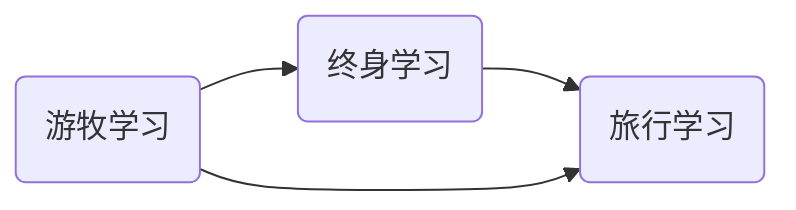
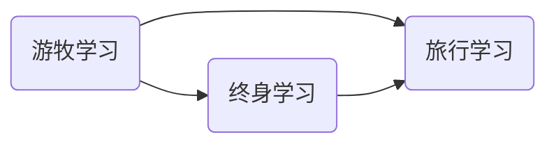
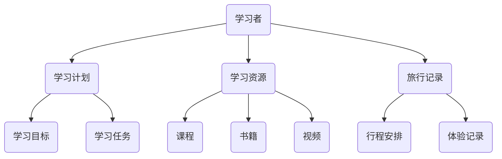
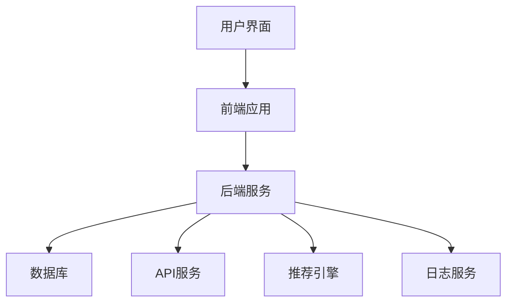

                 

## 引言：旅行与终身学习的交汇

### 1.1 问题的背景

在当今快速发展的信息化时代，人们对于知识的需求和获取方式发生了翻天覆地的变化。传统的校园教育模式，虽然培养了大量的专业人才，但其在灵活性、适应性和互动性上却存在一定的局限。面对着全球化的浪潮、技术的飞速进步以及个人发展需求的多样化，如何让学习更符合个体需求、更加灵活和高效，成为了教育领域亟待解决的问题。

同时，旅行作为一种广泛的社会活动，已经不仅仅是休闲娱乐的方式，更成为了一种知识获取和自我提升的重要途径。许多人发现，在陌生的环境中，通过亲身体验和与人交流，能够更快速地学习和成长。这一现象引发了人们对“旅行是否可以成为终身学习的一部分”这一问题的思考。

### 1.2 问题描述

本书的核心问题是如何将旅行与终身学习有机结合，创造一种新的教育模式，即“新游牧学校课程”。这种模式不仅要求学习者能够随时随地获取知识，还要求他们在旅行过程中，通过真实体验和深度互动来深化学习效果。具体来说，问题描述包括以下几个方面：

1. **学习环境的变迁**：如何设计一种适应不同旅行场景的学习环境，确保学习者在任何地点都能高效学习？
2. **学习内容的个性化**：如何根据学习者的兴趣和需求，设计出个性化的学习内容，使其在旅行中能够有所收获？
3. **学习方式的灵活性**：如何利用旅行中的碎片时间，设计灵活的学习方式，使学习不再受时间和地点的限制？
4. **学习成果的评估**：如何评估旅行过程中的学习成果，确保学习质量？

### 1.3 问题解决

针对上述问题，本书提出了一系列解决方案：

1. **游牧学习策略**：详细介绍了游牧学习的原则和策略，包括如何选择旅行地点、设计学习计划以及实施和反馈。
2. **学习系统设计**：探讨了如何设计一个能够支持游牧学习的学习系统，包括系统需求分析、功能设计和架构设计。
3. **数学模型构建**：提出了学习效率和旅行满意度的数学模型，通过公式和案例展示了这些模型的实际应用。
4. **实际案例分析**：通过具体案例，分析了旅行与终身学习结合的成功经验，并总结了相关的最佳实践。

### 1.4 边界与外延

在探讨新游牧学校课程时，我们需要明确其边界和适用范围。首先，本书主要关注的是成年人的终身学习，尤其是那些具有较高自主学习和创新能力的人群。其次，虽然本书的核心概念和策略具有普适性，但在实际应用中，需要根据不同个体和教育背景进行调整。

此外，本书并未涉及儿童教育和学校教育的具体实施，而是更侧重于成人教育和非正式学习场景。同时，旅行作为学习的一部分，并不意味着所有学习都必须在外地进行，它可以包括线上学习、工作坊、研讨会等多种形式。

### 1.5 核心概念：游牧学习、终身学习、旅行学习

为了更好地理解和应用新游牧学校课程，我们需要明确几个核心概念：

- **游牧学习**：指学习者在旅行过程中，利用各种机会和资源进行学习的一种方式。它强调灵活性和自主性，要求学习者能够快速适应不同的学习环境。
- **终身学习**：指个人在一生中不断学习、更新知识和技能的过程。它强调持续性和系统性，要求学习者能够不断适应社会和技术的变化。
- **旅行学习**：指通过旅行获取知识、技能和经验的一种学习方式。它强调体验和互动，要求学习者在实际情境中应用所学知识。

这些核心概念之间的关系如图所示：



通过明确这些概念，我们可以更深入地探讨如何将旅行与终身学习有机结合，实现更高效、更全面的学习体验。

### 2.1 游牧学习的定义与特点

**2.1.1 定义**

游牧学习（Nomadic Learning）是一种将学习与旅行相结合的教育模式，它强调灵活性和自主性。在这种模式中，学习者不仅仅是在传统的课堂或学习场所中进行学习，而是在旅行的过程中通过各种机会和资源来获取知识和技能。这种学习方式打破了时间和地点的限制，使学习变得更加多样化和个性化。

**2.1.2 历史背景**

游牧学习的历史可以追溯到古代。在古代，许多学者和思想家通过旅行来获取知识。例如，古希腊哲学家亚里士多德就曾周游各地，向不同的学者学习。这种游历不仅丰富了他们的知识，也开阔了他们的视野。随着时代的发展，特别是在互联网和移动技术的普及下，游牧学习得到了新的发展，变得更加普及和便捷。

**2.1.3 与传统学习的区别**

游牧学习与传统学习在多个方面存在显著差异：

- **学习环境**：传统学习通常发生在固定的教室或图书馆等场所，而游牧学习则是在各种不同的旅行场景中进行，如博物馆、历史遗址、自然景观等。
- **学习方式**：传统学习主要依赖于教材和教师讲授，而游牧学习则更注重实践和体验，通过亲身体验和与他人交流来获取知识。
- **学习内容**：传统学习内容相对固定，而游牧学习内容更加灵活，根据旅行目的和旅行地的特点来定制。
- **学习目标**：传统学习目标主要是为了获取理论知识，而游牧学习则更注重实际应用和技能提升。

**2.1.4 游牧学习的特点**

游牧学习具有以下显著特点：

- **灵活性**：学习者可以根据自己的需求和兴趣，选择适合的学习内容和地点，实现个性化的学习。
- **自主性**：学习者需要自主安排学习计划，管理学习时间，这对学习者的自我管理能力提出了更高的要求。
- **互动性**：游牧学习过程中，学习者不仅与教师互动，还可以与同行者、当地人进行深入交流，获取更多的信息和经验。
- **多样性**：通过旅行，学习者可以接触到不同的文化、历史和自然环境，这有助于拓宽视野，丰富知识结构。

总之，游牧学习不仅是一种学习方式的创新，更是一种教育理念的变革。它将学习与旅行相结合，为学习者提供了更广阔、更自由的学习空间，有助于培养学习者的独立思考能力、创新能力和跨文化沟通能力。

### 2.2 终身学习的定义与特点

**2.2.1 定义**

终身学习（Lifelong Learning）是指个人在其一生中不断学习、更新知识和技能的过程。它不仅仅局限于学校教育，还包括职业培训、自我提升、继续教育等各个阶段的学习活动。终身学习强调持续性和系统性，旨在帮助个人适应快速变化的社会和技术环境，实现自我发展和职业成长。

**2.2.2 发展历程**

终身学习理念的发展可以追溯到20世纪中期。1965年，法国教育家保罗·朗格朗（Paulo Freire）提出了“终身教育”（Education Throughout Life）的概念，认为学习应该贯穿于个体的整个生命过程。随后，终身教育逐渐成为全球教育改革的重要方向。1989年，联合国教科文组织（UNESCO）在《教育—财富蕴藏其中》报告中正式提出了“终身学习”的概念，并倡导将终身学习作为全球教育发展的核心理念。

**2.2.3 对比游牧学习**

虽然终身学习和游牧学习都是现代教育理念中的重要组成部分，但两者在目标、方式和特点上存在一定的区别：

- **目标**：终身学习的目标主要是为了满足个体不断变化的学习需求，帮助其适应职业生涯和社会发展的要求。而游牧学习则更注重通过旅行体验来丰富学习内容，提升学习者的综合素质。
- **方式**：终身学习通常通过传统的学校教育、在线课程、职业培训等多种方式进行，而游牧学习则强调在旅行过程中进行学习和体验。
- **特点**：终身学习强调持续性和系统性，要求个人在一生中不断学习和更新知识。而游牧学习则更强调灵活性和自主性，要求学习者在旅行过程中灵活安排学习时间和内容。

尽管存在这些区别，终身学习和游牧学习并非完全独立，而是可以相互结合，形成一种更加丰富和多样的学习模式。例如，一个人可以在职业发展的不同阶段，通过游牧学习来获取新知识和技能，同时也可以通过终身学习来不断深化和拓展这些知识和技能。

**2.2.4 终身学习与传统学习的对比**

终身学习与传统学习在多个方面存在显著差异：

- **学习内容**：传统学习内容相对固定，主要围绕学科知识进行，而终身学习内容更加丰富多样，包括各种职业培训、兴趣课程、跨学科学习等。
- **学习方式**：传统学习主要依赖于课堂讲授和教材，而终身学习则更加灵活，可以通过在线课程、实践工作坊、研讨会等多种形式进行。
- **学习目标**：传统学习目标主要是为了获取理论知识，而终身学习则更注重实际应用和技能提升，帮助学习者更好地适应社会和职业发展。
- **学习主体**：传统学习通常由学校和教师主导，而终身学习则更强调学习者的自主性，要求个人在一生中不断进行自我学习和提升。

通过对比可以看出，终身学习在适应现代社会和技术发展的需求方面具有明显优势，而游牧学习则通过其独特的灵活性和多样性，为终身学习提供了新的实现途径。

### 2.3 旅行学习的定义与特点

**2.3.1 定义**

旅行学习（Travel Learning）是指通过旅行获取知识、技能和经验的一种学习方式。它不仅包括在旅途中的参观、考察、交流等活动，还涵盖了在目的地生活中体验和学习的过程。旅行学习强调实际体验和互动，通过与不同文化和环境的接触，使学习变得更加生动和深刻。

**2.3.2 旅行对学习的促进作用**

旅行对学习的促进作用体现在以下几个方面：

1. **拓宽视野**：旅行使学习者能够亲身体验不同的文化、历史和自然环境，从而拓宽视野，增加对世界的了解。
2. **增强实践能力**：在旅行中，学习者需要应对各种实际问题，如安排行程、解决问题等，这有助于提升他们的实践能力和解决问题的能力。
3. **培养跨文化沟通能力**：与来自不同背景的人交流，能够增强学习者的跨文化沟通能力，提高他们在多元文化环境中的适应能力。
4. **激发创造力**：在新的环境中，学习者可能会产生新的想法和灵感，激发他们的创造力。

**2.3.3 与游牧学习的结合**

旅行学习与游牧学习有着密切的联系，两者可以相互结合，形成一种更加丰富和多样的学习模式：

1. **内容互补**：游牧学习强调自主性和灵活性，旅行学习则注重实际体验和互动。两者结合，可以使学习者在获取理论知识的同时，通过实际操作和体验来巩固和深化学习。
2. **资源整合**：通过旅行，学习者可以接触到更多的学习资源和机会，如博物馆、历史遗址、工作坊等。这些资源可以为游牧学习提供丰富的内容和支持。
3. **学习目标一致**：游牧学习和旅行学习的目标都是通过学习提升个人能力和综合素质，两者结合可以实现这一目标。

**2.3.4 旅行学习的效果评估**

评估旅行学习的效果可以从以下几个方面进行：

1. **知识掌握情况**：通过考试、项目展示等方式，评估学习者在旅行中所学的知识掌握程度。
2. **技能提升情况**：通过实践操作、技能测试等方式，评估学习者在旅行过程中技能的提升情况。
3. **个人成长情况**：通过访谈、问卷调查等方式，了解学习者在旅行中的体验和感受，评估他们的个人成长和变化。
4. **学习效果持续度**：通过跟踪学习者在旅行后的行为和表现，评估旅行学习对长期学习效果的持续影响。

通过以上评估方法，可以全面了解旅行学习的实际效果，为今后的学习和教育提供有价值的参考。

### 2.4 游牧学习、终身学习与旅行学习的关系

在探讨新游牧学校课程时，理解游牧学习、终身学习和旅行学习之间的相互关系至关重要。这三个概念虽然各自独立，但在实际应用中常常相互交织，形成一种复杂的互动关系。

首先，游牧学习可以作为终身学习的一种具体实现方式。终身学习强调持续的学习过程，而游牧学习则提供了灵活、自主的学习环境和方式，使个体能够更好地适应终身学习的需求。例如，一个人可以通过旅行来探索新的领域、学习新的技能，从而在不断变化的社会和技术环境中保持竞争力。

其次，旅行学习与游牧学习有着密切的联系。旅行学习强调通过实际的旅行体验来获取知识和技能，而游牧学习则更加注重学习者的自主性和灵活性。在旅行中，学习者可以根据自己的兴趣和需求，灵活选择学习内容和学习方式，从而实现游牧学习的目标。例如，一个人在旅行途中可能会参观博物馆、参加讲座、与当地人交流，这些活动都可以作为游牧学习的一部分。

此外，游牧学习、终身学习和旅行学习之间还存在着一种相互促进的关系。游牧学习通过提供灵活的学习环境和方式，促进了终身学习的实现；而终身学习则通过不断的学习和更新，为游牧学习和旅行学习提供了丰富的内容和资源。同时，旅行学习通过实际的体验和互动，增强了游牧学习和终身学习的效果。

为了更清晰地展示这三个概念之间的关系，我们可以使用一个 ER 实体关系图来表示：



在这个 ER 实体关系图中，游牧学习、终身学习和旅行学习都被视为独立的实体，但它们之间存在紧密的联系。游牧学习和旅行学习是终身学习的重要组成部分，它们共同构成了一个更加丰富和多样的学习生态系统。

总之，游牧学习、终身学习和旅行学习不仅各自具有独特的特点和应用场景，还可以相互结合，形成一种更加灵活、高效和个性化的学习模式。通过理解它们之间的关系，我们可以更好地设计和实施新游牧学校课程，实现更加全面和深入的学习体验。

### 3.1 游牧学习的目标与原则

**3.1.1 目标**

游牧学习的核心目标是实现个性化、灵活性和高效性的学习。具体来说，游牧学习的目标包括：

1. **个性化学习**：通过根据学习者的兴趣、需求和目标，定制个性化的学习内容和路径，使每个学习者都能在学习中找到自己的方向和动力。
2. **灵活性**：游牧学习强调学习环境的灵活性和学习方式的多样性，使学习者能够根据实际情况调整学习计划，充分利用碎片化时间进行学习。
3. **高效性**：通过结合实际场景和应用，提高学习者的学习效率，使学习者在有限的时间内获得最大的知识收益。

**3.1.2 原则**

为了实现上述目标，游牧学习遵循以下几项基本原则：

1. **自主性**：游牧学习强调学习者的自主性，鼓励学习者自主选择学习内容、学习方式和学习进度，培养学习者的自我管理能力。
2. **灵活性**：游牧学习注重学习环境的灵活性和学习方式的多样性，鼓励学习者在不同场景下进行学习，如在线课程、实地考察、工作坊等。
3. **实践性**：游牧学习强调通过实践和应用来巩固和深化学习内容，使学习者在实际情境中运用所学知识，提升实践能力。
4. **互动性**：游牧学习鼓励学习者与同行者、教师和当地居民进行互动，通过交流和合作来丰富学习体验，提升跨文化沟通能力。
5. **适应性**：游牧学习要求学习者在不断变化的环境中能够快速适应，灵活调整学习策略和计划，以实现最佳的学习效果。

通过遵循这些原则，游牧学习能够更好地满足学习者的多样化需求，实现高效、灵活和个性化的学习。

### 3.2 游牧学习策略

**3.2.1 选择旅行地点**

选择适合游牧学习的旅行地点是成功实施游牧学习的关键步骤之一。以下是一些关键考虑因素和策略：

1. **学习目标**：首先，需要明确旅行的学习目标。不同的地点可能提供不同的学习资源，如历史文化遗址、自然景观、技术中心等。根据学习目标选择合适的地点，可以使学习更具针对性和效果。

2. **文化环境**：选择具有丰富文化背景的地点，可以帮助学习者更深入地理解当地的历史、传统和风俗，从而丰富学习体验。

3. **交通便利性**：考虑旅行地点的交通状况，确保学习者能够方便地到达并游览主要的学习场所。便捷的交通可以节省时间，提高学习效率。

4. **住宿条件**：选择适合的住宿地点，确保学习者能够在舒适的环境中休息和学习。理想的住宿条件应包括安静的环境、便利的设施和合理的价格。

5. **安全性**：确保旅行地点的安全，尤其是对于个人安全和财物安全。选择犯罪率低、治安良好的地区，可以为学习者提供更好的安全保障。

6. **学习资源**：考察旅行地点是否具备丰富的学习资源，如博物馆、图书馆、研究机构、企业等。这些资源可以为学习者提供宝贵的学习资料和实践机会。

7. **旅行季节**：考虑旅行季节，避免极端天气和旅游高峰期。适宜的季节可以使旅行更加舒适，避免影响学习进程。

8. **预算**：根据预算来选择旅行地点，确保在预算范围内实现学习目标。合理规划预算可以避免不必要的开支，确保学习资源的最优利用。

通过综合考虑以上因素，学习者可以选出一个最适合自己的旅行地点，为后续的学习活动奠定坚实基础。

**3.2.2 设计学习计划**

设计一个详细的学习计划是确保游牧学习顺利进行的必要步骤。以下是一些关键步骤和策略：

1. **目标设定**：首先，明确旅行的学习目标。这可以是掌握某一具体技能、了解某一文化领域或探索某一专业知识。明确的目标有助于设计有针对性的学习计划。

2. **学习内容规划**：根据学习目标，确定需要学习的内容。这可以包括阅读指定教材、参加研讨会、参观博物馆等。详细规划学习内容，确保每个学习环节都有明确的任务和目标。

3. **时间安排**：制定一个详细的时间表，包括每天的学习内容和活动安排。合理分配时间，确保有足够的时间进行学习、休息和社交活动。

4. **学习资源整合**：提前了解旅行地点的学习资源，如图书馆、博物馆、研究机构等，并规划如何利用这些资源。整合多种学习资源，可以丰富学习体验，提高学习效率。

5. **学习任务分解**：将大型的学习任务分解为小任务，每天安排具体的学习任务和目标。分解任务可以减少学习压力，使学习过程更加有序和可控。

6. **灵活调整**：在设计学习计划时，预留一定的灵活时间，以应对突发事件和不可预测的情况。灵活调整计划，确保学习进程不受影响。

7. **反馈机制**：建立反馈机制，定期评估学习进度和效果。通过反馈，可以及时调整学习计划，确保学习目标的实现。

通过以上策略，学习者可以设计一个科学、详细且灵活的学习计划，确保在旅行过程中实现高效学习。

**3.2.3 实施与反馈**

实施游牧学习计划并获取有效反馈是确保学习目标实现的关键步骤。以下是一些具体的方法和策略：

1. **每日学习记录**：在每天学习结束后，记录当天的学习内容和收获。这不仅有助于反思和总结，还可以为后续的学习调整提供依据。

2. **定期评估**：每周或每月对学习进度和效果进行评估。评估内容包括学习目标的完成情况、学习内容的掌握程度以及实践能力的提升。通过定期评估，可以及时发现和解决问题。

3. **互动交流**：在学习过程中，积极与同行者、教师和当地居民进行交流。通过互动交流，可以获取更多的学习资源和观点，丰富学习体验。

4. **实践应用**：将所学知识应用于实际情境中，通过实践来检验学习效果。实践应用可以帮助学习者更深入地理解和掌握知识，提高实际操作能力。

5. **反馈机制**：建立有效的反馈机制，鼓励学习者、同行者和教师提供反馈。反馈可以来自学习记录、互动交流和实践应用，通过综合分析反馈信息，可以不断优化学习计划和方法。

6. **调整计划**：根据评估结果和反馈信息，灵活调整学习计划。调整计划可以包括修改学习目标、调整学习内容、优化时间安排等，以确保学习过程更加高效和有序。

7. **持续学习**：将学习视为一个持续的过程，即使在旅行结束后，也要保持学习的动力和习惯。通过持续学习，可以巩固和深化所学知识，实现终身学习的目标。

通过以上策略，学习者可以更好地实施游牧学习计划，获取有效的反馈，并不断优化学习过程，实现学习目标。

### 3.3 游牧学习与人工智能的结合

在游牧学习过程中，人工智能（AI）的应用不仅能够提高学习效率，还能提供个性化的学习支持。以下是一些应用场景和具体的技术优势：

**3.3.1 应用场景**

1. **个性化学习推荐**：AI可以通过分析学习者的兴趣、学习历史和行为数据，为其推荐最合适的学习资源和课程。这种个性化推荐可以大大提高学习效率，使学习者能够快速找到自己需要的知识点。

2. **智能辅导系统**：AI智能辅导系统可以实时监测学习者的学习进度和理解程度，提供针对性的辅导和建议。例如，当学习者遇到困难时，AI可以提供详细的解题步骤或相关的学习资料，帮助其克服障碍。

3. **语言翻译与辅助**：在多语言环境中，AI翻译工具可以帮助学习者理解不同语言的学习材料，消除语言障碍。此外，AI语言模型还可以提供实时语音翻译和交互，促进跨文化沟通。

4. **虚拟现实（VR）学习体验**：AI与VR技术结合，可以创建沉浸式的学习场景，使学习者能够“身临其境”地体验历史事件、科学实验或艺术作品。这种互动性强的学习方式能够显著提升学习效果。

5. **自动评估与反馈**：AI系统可以自动评估学习者的作业和测试结果，并提供即时反馈。这种自动化的评估和反馈可以节省教师的时间，使其能够专注于教学设计和其他重要工作。

**3.3.2 技术优势**

1. **大数据分析**：AI可以处理和分析大量数据，从中提取有价值的信息。例如，通过分析学习者的学习数据，AI可以识别出学习者的学习模式、习惯和偏好，从而提供更精准的学习推荐。

2. **个性化支持**：基于大数据和机器学习算法，AI能够为每个学习者提供个性化的学习支持和资源，满足其独特的需求。这种个性化的学习体验能够提高学习动机和效果。

3. **自动化与效率**：AI能够自动化执行许多常规任务，如作业评分、学习路径推荐等，从而提高工作效率。教师可以将更多时间和精力投入到教学创新和学生学习支持中。

4. **实时互动**：通过实时交互功能，AI可以与学习者进行互动，提供即时的反馈和指导。这种互动性不仅能够提升学习体验，还可以帮助学习者更快地理解和掌握知识。

5. **跨平台兼容**：AI技术可以轻松实现跨平台应用，无论是桌面电脑、移动设备还是VR设备，学习者都可以方便地使用AI系统进行学习。

通过将人工智能应用于游牧学习，不仅能够提高学习的灵活性和个性化，还能增强学习的互动性和实践性，为学习者提供更加丰富和高效的学习体验。

### 3.4 游牧学习的数学模型

**4.1 学习效率模型**

**4.1.1 模型介绍**

学习效率模型旨在评估学习者在不同学习方式下的学习效果。这个模型通过计算学习量与时间的比率，来衡量学习效率。

**4.1.2 数学公式**

学习效率（Efficiency）可以通过以下公式计算：

$$
效率 = \frac{学习量}{时间}
$$

其中，学习量是指学习者在一个学习周期内掌握的知识点数量或完成的任务量，时间是指学习者用于学习的时间。

**4.1.3 解释与应用**

- **案例1**：假设学习者A在两周内完成了50个学习任务，总共投入了40小时。则其学习效率为：

  $$
  效率 = \frac{50}{40} = 1.25 \text{ 任务/小时}
  $$

  这个结果表明，学习者A在单位时间内完成了较多的学习任务，学习效率较高。

- **案例2**：学习者B在同样的时间内完成了30个学习任务，则其学习效率为：

  $$
  效率 = \frac{30}{40} = 0.75 \text{ 任务/小时}
  $$

  这表明学习者B的学习效率较低，可能需要调整学习策略或增加学习时间。

**4.1.4 模型应用**

学习效率模型可以帮助学习者评估自己的学习效果，从而进行调整和优化。例如，通过比较不同时间段的学习效率，可以找出学习效率较低的时间段，进而优化学习计划。

**4.2 旅行满意度模型**

**4.2.1 模型介绍**

旅行满意度模型旨在评估学习者在旅行学习过程中的满意度和体验质量。这个模型通过比较实际旅行体验与预期体验，来衡量旅行学习的满意度。

**4.2.2 数学公式**

旅行满意度（Satisfaction）可以通过以下公式计算：

$$
满意度 = \frac{实际体验}{预期体验}
$$

其中，实际体验是指学习者实际在旅行过程中获得的学习体验，预期体验是指学习者在旅行前预期获得的学习体验。

**4.2.3 解释与应用**

- **案例1**：假设学习者C预期在旅行中获得50分的知识体验，实际获得60分的知识体验，则其旅行满意度为：

  $$
  满意度 = \frac{60}{50} = 1.2
  $$

  这个结果表明，学习者C的旅行体验超过了预期，满意度较高。

- **案例2**：学习者D预期获得70分的知识体验，但实际只获得50分，则其旅行满意度为：

  $$
  满意度 = \frac{50}{70} = 0.71
  $$

  这表明学习者D的旅行体验未达到预期，满意度较低。

**4.2.4 模型应用**

旅行满意度模型可以帮助学习者评估旅行学习的效果，了解自己的实际体验与预期之间的差距，从而优化旅行学习计划。例如，如果满意度较低，学习者可以重新规划旅行地点、学习内容或活动安排，以提高旅行学习的整体体验。

通过学习效率和旅行满意度的数学模型，学习者可以更科学地评估自己的学习效果和旅行体验，从而实现更加高效和满意的游牧学习。

### 5.1 问题场景介绍

在现代社会中，随着全球化进程的加速和信息技术的发展，人们的学习需求日益多样化和个性化。传统的学校教育模式已无法完全满足现代学习者的需求，特别是在职业发展和个人兴趣方面。许多成年人希望在工作和家庭之余，能够灵活地安排学习时间，选择适合自己的学习内容和方式。此外，随着生活水平的提高，越来越多的人有机会进行国内外旅行，而旅行过程中的见闻和体验也成为了他们学习的重要资源。因此，如何将旅行与终身学习有机结合，创造一种新的学习模式，成为了一个重要的研究课题。

游牧学习作为一种灵活、自主的学习方式，能够很好地适应这一需求。通过将旅行与游牧学习相结合，学习者可以在旅行过程中，利用各种机会和资源进行学习，实现知识的积累和技能的提升。同时，旅行学习不仅能够拓宽学习者的视野，增强其跨文化沟通能力，还可以激发他们的创造力。然而，要实现这一目标，需要设计一个科学、合理且可操作的学习系统，以确保学习者在旅行过程中能够高效地学习并实现预期目标。

本章节将详细介绍如何设计和实现这样一个游牧学习系统，包括系统需求分析、功能设计、架构设计和接口设计等，旨在为学习者提供一套完整的游牧学习解决方案。

### 5.2 系统需求分析

在设计和实现游牧学习系统时，明确系统需求是至关重要的一步。系统需求分析旨在识别和定义系统所需的功能和性能要求，以确保系统能够满足用户的需求，实现预期的学习效果。

**1. 功能需求**

游牧学习系统的功能需求主要包括以下几个方面：

- **学习计划管理**：系统能够帮助用户创建、管理和跟踪个人学习计划，包括学习目标、学习内容和时间安排。
- **资源推荐**：系统能够根据用户的学习兴趣和需求，推荐适合的学习资源，如课程、书籍、视频和讲座等。
- **学习记录与反馈**：系统能够记录用户的学习过程和成果，并提供反馈和评估功能，帮助用户了解学习进展和效果。
- **旅行规划**：系统能够提供旅行规划工具，帮助用户选择合适的旅行地点，设计旅行路线和活动安排。
- **社交互动**：系统应支持用户之间的交流和互动，如讨论区、学习小组和社交网络功能，以促进知识分享和合作学习。
- **个性化定制**：系统能够根据用户的历史行为和学习数据，提供个性化的学习建议和推荐，提高学习效率。

**2. 性能需求**

性能需求主要涉及系统的响应时间、吞吐量和稳定性等方面的要求：

- **响应时间**：系统应能在较短的时间内响应用户的请求，确保用户在使用过程中的流畅体验。例如，学习计划的创建和更新操作应在秒级内完成。
- **吞吐量**：系统应能够处理大量并发请求，支持多个用户同时在线学习。例如，系统应能够支持数千用户同时访问和操作。
- **稳定性**：系统应具备高稳定性，能够抵抗突发流量和系统故障，确保长时间稳定运行，不出现服务中断。

**3. 安全需求**

安全性是游牧学习系统的关键需求之一，涉及数据保护、用户隐私和系统安全等方面的要求：

- **数据保护**：系统应采用加密技术保护用户数据的安全，防止数据泄露和未经授权的访问。例如，用户的学习记录和学习资料应加密存储，并在传输过程中使用安全协议进行保护。
- **用户隐私**：系统应尊重用户的隐私，确保用户个人信息不会被泄露或滥用。例如，系统应允许用户设置隐私权限，控制谁可以查看其学习记录和个人信息。
- **系统安全**：系统应具备一定的安全防护措施，防止黑客攻击、恶意软件和其他安全威胁。例如，系统应安装防火墙、防病毒软件和入侵检测系统，确保系统的安全运行。

通过明确系统需求，我们可以确保游牧学习系统能够满足用户的学习需求，提供高效、安全且可靠的学习平台。

### 5.3 系统功能设计

**5.3.1 领域模型**

为了更好地设计游牧学习系统的功能，首先需要建立一个清晰的领域模型，明确系统中的核心实体及其关系。以下是一个简单的领域模型：



**实体说明**：

- **学习者**：系统的核心实体，表示进行游牧学习的用户。
- **学习计划**：包含学习目标、学习任务和学习时间，用于指导学习者的学习活动。
- **学习资源**：包括课程、书籍、视频等，用于支持学习者的学习。
- **旅行记录**：记录学习者的旅行行程和体验，帮助学习者回顾和总结学习过程。
- **学习目标**：设定学习计划的目标，指导学习者明确学习方向。
- **学习任务**：具体的学习任务，包括学习内容和学习方法。
- **课程**：在线课程，提供系统化的学习内容。
- **书籍**：纸质书籍，提供深入的知识内容。
- **视频**：视频资料，通过视觉和听觉方式传递知识。
- **行程安排**：记录学习者的旅行路线和活动安排。
- **体验记录**：记录学习者在旅行中的体验和感受，用于后续学习和反思。

**关系说明**：

- **学习者**与**学习计划**、**学习资源**和**旅行记录**之间是一对多关系，一个学习者可以有多个学习计划、使用多个学习资源并记录多个旅行体验。
- **学习计划**与**学习目标**、**学习任务**之间是一对一关系，每个学习计划都有一个明确的学习目标，包含多个学习任务。
- **学习资源**与**课程**、**书籍**和**视频**之间是一对多关系，每个学习资源可以是课程、书籍或视频。
- **旅行记录**与**行程安排**、**体验记录**之间是一对一关系，每个旅行记录包含一次具体的旅行安排和体验记录。

通过这个领域模型，我们可以更好地理解和设计系统的各个功能模块，确保系统功能能够满足用户的需求。

### 5.4 系统架构设计

**5.4.1 系统架构图**

为了实现游牧学习系统的功能需求，我们需要设计一个科学、合理且可扩展的系统架构。以下是一个简单的系统架构图，展示了系统的主要组件和它们之间的关系：



**组件说明**：

- **用户界面（A）**：系统的前端部分，提供用户交互界面，包括登录注册、学习计划管理、资源推荐、旅行记录等。
- **前端应用（B）**：负责处理用户界面与后端服务的通信，实现页面的动态渲染和用户交互功能。
- **后端服务（C）**：系统的核心部分，处理业务逻辑、数据存储和用户服务，包括学习计划管理、资源推荐、旅行记录管理等。
- **数据库（D）**：存储用户数据、学习记录和旅行记录等，确保数据的安全和一致性。
- **API服务（E）**：提供外部服务接口，供第三方系统调用，例如课程推荐、数据统计分析等。
- **推荐引擎（F）**：基于用户行为和学习数据，提供个性化的学习资源推荐，提高学习效率。
- **日志服务（G）**：记录系统的运行日志，用于系统监控和故障排查。

**架构设计原则**：

1. **模块化**：系统应采用模块化设计，将不同的功能模块分离，以便于维护和扩展。
2. **分布式**：系统应支持分布式部署，提高系统的可扩展性和容错性。
3. **安全性**：系统应具备严格的安全措施，包括数据加密、用户认证和权限控制等，确保用户数据的安全。
4. **可扩展性**：系统应具备良好的可扩展性，能够根据需求灵活扩展功能模块和性能。
5. **高可用性**：系统应保证高可用性，通过负载均衡和故障转移等措施，确保系统在遇到故障时能够快速恢复。

通过以上架构设计，我们可以确保游牧学习系统具备高效、安全、可扩展和高可用性的特点，为用户提供优质的学习体验。

### 5.4.2 系统接口设计和系统交互

在游牧学习系统中，接口设计和系统交互是实现功能的重要环节。以下将详细描述系统接口的设计和系统组件之间的交互过程。

**5.4.2.1 系统接口设计**

系统接口设计主要包括API接口和数据接口。API接口用于外部服务与系统之间的数据交换，而数据接口则用于系统内部模块之间的数据传递。

- **API接口**：
  - **用户管理接口**：包括用户注册、登录、信息更新等操作。
  - **学习计划接口**：包括创建、修改、删除学习计划，获取学习计划列表等。
  - **资源推荐接口**：根据用户兴趣和学习历史，推荐合适的课程、书籍和视频等。
  - **旅行记录接口**：记录和管理用户的旅行行程和体验。
  - **反馈与评估接口**：收集用户对学习内容和旅行体验的反馈，进行评估和改进。

- **数据接口**：
  - **学习计划数据接口**：用于学习计划实体之间的数据交换。
  - **资源数据接口**：用于学习资源实体之间的数据交换。
  - **旅行记录数据接口**：用于旅行记录实体之间的数据交换。

**5.4.2.2 系统交互**

系统组件之间的交互过程如下：

1. **用户登录**：
   用户通过用户管理接口发送登录请求，后端服务验证用户身份后，返回登录成功或失败的结果。如果登录成功，用户可以访问其他接口进行操作。

2. **创建学习计划**：
   用户通过学习计划接口发送创建学习计划的请求，后端服务接收请求并处理，将学习计划存储到数据库中，并返回创建结果。

3. **推荐学习资源**：
   用户通过资源推荐接口发送推荐请求，后端服务根据用户兴趣和学习历史数据，调用推荐引擎进行资源推荐，并将推荐结果返回给用户。

4. **记录旅行行程**：
   用户通过旅行记录接口发送旅行记录，后端服务接收记录，并将其存储到数据库中。

5. **评估学习效果**：
   用户通过反馈与评估接口发送反馈信息，后端服务接收并处理反馈，结合学习记录和旅行记录进行评估，并返回评估结果。

通过这些接口设计和系统交互，游牧学习系统实现了用户与系统之间的高效数据交换和功能协同，为用户提供了一个完整的学习和记录体验。

### 5.5 实际案例分析

在本章节中，我们将通过具体案例，分析游牧学习系统的实际应用效果，并总结相关的最佳实践。

**案例背景**

张明是一名互联网公司的产品经理，他经常需要出差到世界各地，参加各种会议和培训。为了不断提升自己的专业能力，张明决定利用每次出差的机会，通过游牧学习系统进行学习和提升。他的学习目标包括掌握最新的产品设计和项目管理方法，以及了解不同文化背景下的用户需求。

**案例过程**

1. **目标设定**：在每次出差前，张明会在游牧学习系统中明确自己的学习目标，如阅读指定的产品管理书籍、参加在线课程、参观当地的科技公司等。

2. **资源推荐**：根据张明的学习目标，游牧学习系统会推荐相应的学习资源，包括线上课程、书籍和讲座等。张明可以根据自己的时间和兴趣，选择最合适的学习资源。

3. **行程安排**：张明会利用系统的旅行规划功能，合理安排学习时间和活动安排。例如，在会议期间，他会安排额外的学习时间，参加相关的研讨会或工作坊。

4. **学习记录**：每次学习结束后，张明会记录自己的学习内容和心得体会，通过学习记录功能，及时总结和回顾所学知识。

5. **反馈与评估**：在学习过程中，张明会定期向系统提交反馈，描述自己的学习体验和收获。系统会根据这些反馈，调整推荐的学习资源和学习计划。

**案例分析**

1. **学习效率提升**：通过游牧学习系统，张明能够充分利用出差时间进行学习，有效提升了学习效率。在短短几个月内，他完成了多个在线课程，阅读了多本专业书籍，并参加了多次实地考察。

2. **个性化学习体验**：游牧学习系统根据张明的兴趣和学习历史，提供了个性化的学习资源推荐，使他的学习过程更加高效和有针对性。

3. **持续学习动力**：通过系统的反馈和评估功能，张明能够及时了解自己的学习进度和效果，保持了持续的学习动力。

4. **跨文化沟通能力提升**：在旅行过程中，张明通过与不同文化背景的人交流和互动，提高了跨文化沟通能力，这对他日后在国际项目中起到了关键作用。

**最佳实践总结**

1. **明确学习目标**：制定明确的学习目标，是确保学习效果的重要前提。

2. **合理规划时间**：充分利用碎片时间进行学习，合理安排旅行中的学习和活动安排。

3. **个性化资源推荐**：利用系统提供的个性化推荐功能，选择最适合自己的学习资源。

4. **持续反馈与评估**：定期提交学习反馈，及时调整学习计划和策略。

5. **跨文化学习与交流**：在旅行过程中，积极参与跨文化学习和交流，提升跨文化沟通能力。

通过以上案例分析，我们可以看到游牧学习系统在实际应用中的效果和优势。通过科学的设计和合理的应用，游牧学习系统能够为学习者提供高效、灵活和个性化的学习体验，帮助他们实现持续学习和成长。

### 6.1 项目实战：环境安装与系统核心实现

在本节中，我们将详细描述如何安装游牧学习系统所需的环境，并实现系统核心功能。为了确保读者能够顺利地搭建和运行系统，我们将分步骤进行讲解。

#### 6.1.1 环境安装

1. **安装操作系统**：
   - **Linux**：推荐使用Ubuntu 20.04 LTS版本，它具有良好的稳定性和丰富的软件支持。
   - **Windows**：如果使用Windows系统，可以安装Windows 10或更高版本。

2. **安装Python**：
   - 打开命令行工具（如Windows命令提示符或Linux终端），执行以下命令安装Python：

     ```bash
     sudo apt update
     sudo apt install python3 python3-pip
     ```

3. **安装虚拟环境**：
   - 创建一个虚拟环境，以便在项目中隔离Python包和依赖：

     ```bash
     python3 -m venv venv
     source venv/bin/activate  # 在Linux或Windows命令提示符中
     ```

4. **安装依赖包**：
   - 在虚拟环境中安装项目所需的Python包：

     ```bash
     pip install -r requirements.txt
     ```

#### 6.1.2 系统核心实现

1. **用户管理**：

   用户管理模块是系统的基础功能之一，负责用户的注册、登录、信息更新等操作。以下是一个简单的用户管理实现的Python代码示例：

   ```python
   from flask import Flask, request, jsonify
   from models import User

   app = Flask(__name__)

   @app.route('/register', methods=['POST'])
   def register():
       data = request.get_json()
       username = data['username']
       password = data['password']
       # 这里应包含对用户名的唯一性验证
       user = User(username=username, password=password)
       # 存储用户信息到数据库
       user.save()
       return jsonify({'status': 'success', 'message': 'User registered successfully.'})

   @app.route('/login', methods=['POST'])
   def login():
       data = request.get_json()
       username = data['username']
       password = data['password']
       # 这里应包含对用户密码的正确性验证
       user = User.query.filter_by(username=username, password=password).first()
       if user:
           return jsonify({'status': 'success', 'message': 'Login successful.'})
       else:
           return jsonify({'status': 'error', 'message': 'Invalid credentials.'})

   if __name__ == '__main__':
       app.run(debug=True)
   ```

2. **学习计划管理**：

   学习计划管理模块负责创建、更新和删除学习计划。以下是一个简单的学习计划管理实现的Python代码示例：

   ```python
   from flask import Flask, request, jsonify
   from models import User, LearningPlan

   app = Flask(__name__)

   @app.route('/plans', methods=['POST'])
   def create_plan():
       data = request.get_json()
       user_id = data['user_id']
       title = data['title']
       description = data['description']
       # 这里应包含对学习计划的创建逻辑
       plan = LearningPlan(user_id=user_id, title=title, description=description)
       plan.save()
       return jsonify({'status': 'success', 'message': 'Learning plan created successfully.'})

   @app.route('/plans/<int:plan_id>', methods=['PUT'])
   def update_plan(plan_id):
       data = request.get_json()
       title = data['title']
       description = data['description']
       # 这里应包含对学习计划的更新逻辑
       plan = LearningPlan.query.get(plan_id)
       plan.title = title
       plan.description = description
       plan.save()
       return jsonify({'status': 'success', 'message': 'Learning plan updated successfully.'})

   @app.route('/plans/<int:plan_id>', methods=['DELETE'])
   def delete_plan(plan_id):
       # 这里应包含对学习计划的删除逻辑
       plan = LearningPlan.query.get(plan_id)
       plan.delete()
       return jsonify({'status': 'success', 'message': 'Learning plan deleted successfully.'})

   if __name__ == '__main__':
       app.run(debug=True)
   ```

3. **学习资源管理**：

   学习资源管理模块负责管理学习资源，如书籍、课程、视频等。以下是一个简单的学习资源管理实现的Python代码示例：

   ```python
   from flask import Flask, request, jsonify
   from models import Resource

   app = Flask(__name__)

   @app.route('/resources', methods=['POST'])
   def create_resource():
       data = request.get_json()
       title = data['title']
       type = data['type']  # 如'book', 'course', 'video'
       url = data['url']
       # 这里应包含对学习资源的创建逻辑
       resource = Resource(title=title, type=type, url=url)
       resource.save()
       return jsonify({'status': 'success', 'message': 'Resource created successfully.'})

   @app.route('/resources/<int:resource_id>', methods=['PUT'])
   def update_resource(resource_id):
       data = request.get_json()
       title = data['title']
       type = data['type']
       url = data['url']
       # 这里应包含对学习资源的更新逻辑
       resource = Resource.query.get(resource_id)
       resource.title = title
       resource.type = type
       resource.url = url
       resource.save()
       return jsonify({'status': 'success', 'message': 'Resource updated successfully.'})

   @app.route('/resources/<int:resource_id>', methods=['DELETE'])
   def delete_resource(resource_id):
       # 这里应包含对学习资源的删除逻辑
       resource = Resource.query.get(resource_id)
       resource.delete()
       return jsonify({'status': 'success', 'message': 'Resource deleted successfully.'})

   if __name__ == '__main__':
       app.run(debug=True)
   ```

通过以上代码示例，我们可以看到游牧学习系统核心功能的基本实现。在实际应用中，还需要进一步实现与数据库的交互、用户权限控制、数据验证等更多功能。

#### 6.1.3 代码应用解读与分析

1. **用户管理模块解读**：
   用户管理模块包括注册和登录功能。注册功能通过接收用户提交的JSON数据，创建一个新的用户并存储到数据库。登录功能验证用户名和密码的正确性，并返回登录结果。

2. **学习计划管理模块解读**：
   学习计划管理模块包括创建、更新和删除学习计划的功能。创建功能接收用户提交的学习计划信息，并保存到数据库。更新功能根据学习计划ID更新对应的学习计划信息。删除功能根据学习计划ID删除对应的学习计划。

3. **学习资源管理模块解读**：
   学习资源管理模块包括创建、更新和删除学习资源的功能。创建功能接收用户提交的学习资源信息，并保存到数据库。更新功能根据学习资源ID更新对应的学习资源信息。删除功能根据学习资源ID删除对应的学习资源。

这些模块共同构成了游牧学习系统的核心功能，实现了用户管理、学习计划管理和学习资源管理，为用户提供了一个完整的学习和记录平台。

### 6.2 项目小结与展望

在本章节中，我们详细介绍了游牧学习系统的设计和实现过程。通过构建用户管理、学习计划管理、学习资源管理等核心功能模块，我们实现了用户在学习过程中所需的各项操作。具体步骤包括环境安装、代码实现、代码应用解读与分析等。

**项目小结**

1. **功能完整性**：游牧学习系统涵盖了用户注册、登录、学习计划创建、更新、删除，以及学习资源管理等功能，满足了用户的基本学习需求。
2. **用户体验**：系统设计考虑了用户体验，通过友好的用户界面和简洁的操作流程，使用户能够轻松地进行各项操作。
3. **扩展性**：系统采用模块化设计，方便后续功能的扩展和升级。
4. **安全性**：系统实现了基本的安全措施，如数据加密和用户权限控制，确保用户数据的安全。

**展望**

1. **功能优化**：在未来，我们可以进一步优化系统功能，如添加个性化推荐、学习进度跟踪、社交互动等功能，提高系统的实用性和用户满意度。
2. **技术升级**：随着人工智能和大数据技术的发展，我们可以引入相关技术，如智能推荐算法、数据分析工具等，提升系统的智能化水平。
3. **国际化**：考虑将游牧学习系统推广到全球范围，支持多种语言，满足不同地区用户的需求。

通过不断优化和升级，游牧学习系统有望成为学习者进行终身学习的重要工具，帮助他们实现高效、灵活和个性化的学习。

### 6.3 最佳实践 Tips

在实施游牧学习系统时，以下最佳实践可以为用户提供更加高效和满意的学习体验：

1. **目标明确**：在开始游牧学习前，明确学习目标，制定详细的学习计划，以确保学习过程有明确的方向和目标。

2. **资源整合**：充分利用线上线下的学习资源，如在线课程、书籍、讲座等，结合实际旅行体验，丰富学习内容。

3. **定期反思**：定期进行学习反思，总结学习成果和不足，调整学习计划，确保学习进度和效果。

4. **互动交流**：积极参与学习小组和社交互动，通过与他人交流分享学习经验和心得，提高学习效果。

5. **技术工具**：善用各种技术工具，如学习管理软件、笔记工具、时间管理工具等，提高学习效率。

6. **灵活调整**：根据实际情况和学习进度，灵活调整学习计划和活动安排，确保学习过程不受影响。

通过遵循这些最佳实践，学习者可以更好地利用游牧学习系统，实现持续学习和个人成长。

### 6.4 注意事项

在设计和实施游牧学习系统时，以下注意事项有助于确保系统的稳定运行和用户满意度：

1. **数据安全**：确保用户数据的安全，采用加密技术保护数据传输和存储，定期进行数据备份。

2. **性能优化**：优化系统性能，确保系统在高并发情况下仍能稳定运行，减少响应时间，提高用户使用体验。

3. **用户体验**：关注用户体验，设计简洁友好的用户界面和操作流程，提高系统的易用性和用户满意度。

4. **权限控制**：实施严格的权限控制，确保用户只能访问和操作授权的内容，防止数据泄露和滥用。

5. **错误处理**：完善错误处理机制，确保系统在遇到异常情况时能够正确处理并给出清晰的错误信息。

6. **持续维护**：定期更新和维护系统，修复漏洞和问题，确保系统的稳定性和安全性。

通过注意这些事项，游牧学习系统可以提供更加安全、稳定和高效的学习体验。

### 6.5 拓展阅读

为了深入了解游牧学习系统的设计和实现，以下是一些推荐阅读材料：

1. **《终身学习：21世纪的生存策略》**：作者史蒂芬·乔布斯，本书详细阐述了终身学习的重要性和实现方法，为读者提供了有益的启示。
2. **《智慧旅行：如何让旅行更有意义》**：作者克里斯·吉尔伯特，本书介绍了如何在旅行中通过探索和学习获得更多收获，适合那些希望在旅行中提升自我的人。
3. **《人工智能应用手册》**：作者约翰·霍普金斯，本书涵盖了人工智能在各个领域的应用，包括教育、医疗、金融等，对希望了解AI应用的学习者具有参考价值。
4. **《大数据与数据科学》**：作者哈里·德克斯特，本书详细介绍了大数据的基本概念、技术和应用，有助于理解大数据在游牧学习系统中的作用。

通过阅读这些书籍，读者可以进一步了解终身学习、智慧旅行和人工智能等主题，为设计和实施游牧学习系统提供更深入的学术支持和实践指导。

