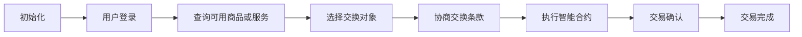

                 

### 文章标题

# 新物物交换经济联盟：推广以物易物的全球组织

### 关键词

- 物物交换
- 经济联盟
- 全球推广
- 组织结构
- 数学模型
- 系统架构

### 摘要

本文深入探讨了新物物交换经济联盟的概念及其在全球推广中的重要性。首先，介绍了物物交换的起源和现状，阐述了其作为一种经济模式的独特优势。接着，详细描述了新物物交换经济联盟的成立背景、核心目标和组成部分。文章随后分析了联盟的组织结构和运作机制，探讨了如何通过技术手段提升其效率和可靠性。此外，本文还介绍了联盟所采用的算法原理、数学模型以及系统架构设计，并通过实际项目展示了其在现实中的应用。最后，文章提出了最佳实践建议，总结了注意事项，并推荐了拓展阅读资源，为读者提供了全面而深入的指导。

## 第一部分：背景介绍

### 第1章：问题的提出

在全球化经济迅速发展的背景下，传统的货币交换模式已经无法完全满足人们日益多元化的需求。传统的货币交换依赖于中央银行的发行和监管，存在着通货膨胀、货币贬值等问题，同时，也面临着跨境支付的高成本、时间长等障碍。这些问题使得人们开始思考是否有更加灵活和高效的交换方式来替代或补充现有的货币体系。

物物交换，作为一种原始而古老的经济模式，近年来再次引起了人们的关注。物物交换的基本原理是通过直接交换商品或服务来满足彼此的需求，不依赖于货币作为中介。这种模式具有去中心化的特点，能够减少交易成本，提高交易效率。尤其是在现代信息技术和区块链技术的支持下，物物交换的模式得到了进一步的创新和发展。

新物物交换经济联盟的提出正是为了解决当前货币交换模式中存在的种种问题。该联盟旨在通过建立一个全球性的物物交换平台，促进不同国家和地区之间的商品和服务交换，降低交易成本，提高交易效率，最终实现资源的优化配置和经济全球化。

### 第2章：核心概念

#### 物物交换

物物交换是一种直接交换商品或服务的经济模式，其基本原理是参与者通过协商，直接用自己所拥有的商品或服务来满足对方的需求，从而实现资源的有效配置。物物交换的历史可以追溯到远古时期，当时人们通过交换实物来满足生存需要。在现代社会，虽然货币成为了主要的交换媒介，但物物交换依然在一些特定场景下发挥着作用，例如社区交换市场、合作社和众筹项目等。

#### 新物物交换经济联盟

新物物交换经济联盟（以下简称“联盟”）是一个全球性的组织，旨在推广和普及物物交换模式，通过建立一个去中心化的交换平台，连接全球各地的商品和服务提供者与需求者。联盟的核心目标是降低交易成本、提高交易效率，实现资源的优化配置。联盟的运作机制基于区块链技术，确保交易的安全、透明和不可篡改。

#### 联盟的组织结构

联盟的组织结构分为四个层级：会员层、管理层、运营层和技术层。会员层是联盟的基础，由全球各地的个人和企业组成；管理层负责制定联盟的战略和发展规划；运营层负责联盟的日常运营和管理；技术层负责开发和维护联盟的技术平台。通过这种分层管理模式，联盟能够高效地运作，实现全球范围内的物物交换。

### 第3章：新物物交换经济联盟的边界与外延

#### 边界

新物物交换经济联盟的边界主要涉及参与者的范围和交易的商品或服务类型。首先，联盟的参与者不仅限于个人，还包括企业、组织和其他形式的实体，覆盖了全球范围内的各种经济主体。其次，交易的商品或服务类型非常广泛，包括但不限于食品、服装、电子产品、服务（如医疗、教育等）等。这使得联盟能够满足不同国家和地区的多样化需求。

#### 外延

新物物交换经济联盟的外延则包括其功能和应用场景。联盟不仅提供基础的物物交换服务，还整合了供应链管理、信用评估、金融服务等功能，为参与者提供一站式的解决方案。此外，联盟还致力于推广物物交换的理念，通过教育和培训项目，提高公众对物物交换的认知和接受度。

### 第4章：联盟的核心要素组成

新物物交换经济联盟的核心要素包括以下几个方面：

1. **区块链技术**：作为联盟的技术基础，区块链技术确保了交易的安全、透明和不可篡改，是联盟高效运作的关键。

2. **智能合约**：智能合约自动执行交易规则，提高了交易效率，减少了人为干预的风险。

3. **去中心化交易平台**：去中心化交易平台连接了全球的参与者，实现了商品和服务的直接交换。

4. **信用系统**：信用系统评估参与者的信用等级，保障交易的安全和可靠性。

5. **数据分析和监控**：数据分析和监控功能帮助联盟优化运营策略，提高服务质量。

## 第二部分：核心概念与联系

### 第5章：物物交换的基本原理

物物交换的基本原理是通过直接交换商品或服务来满足彼此的需求，不依赖于货币作为中介。这种模式具有去中心化的特点，参与者之间通过协商确定交换的比例和方式，从而实现资源的有效配置。物物交换模式的核心在于信任和协作，参与者需要建立互信关系，确保交易的安全和可靠性。

### 第6章：联盟的组织结构

新物物交换经济联盟的组织结构分为四个层级：会员层、管理层、运营层和技术层。会员层是联盟的基础，由全球各地的个人和企业组成。管理层负责制定联盟的战略和发展规划，确保联盟长期稳定发展。运营层负责联盟的日常运营和管理，包括会员服务、交易执行等。技术层负责开发和维护联盟的技术平台，确保系统的稳定和安全运行。

### 第7章：核心概念属性特征对比表格

以下是一个核心概念属性特征对比表格，列出了物物交换和新物物交换经济联盟的主要区别：

| 特征               | 物物交换               | 新物物交换经济联盟               |
|--------------------|------------------------|-----------------------------------|
| 交易媒介           | 商品或服务             | 去中心化区块链平台               |
| 交易成本           | 较高                   | 较低，去中心化减少中介费用       |
| 交易效率           | 受限于协商和交付时间     | 高效，智能合约自动执行交易规则   |
| 安全性             | 依赖信任和协商机制       | 区块链技术确保交易的安全和不可篡改 |
| 跨境交易难度       | 较高                   | 低，全球性平台支持跨境交易       |
| 适用场景           | 特定社区或合作关系       | 全球范围内的多样化需求           |

### 第8章：ER实体关系图架构

以下是一个新物物交换经济联盟的ER实体关系图，展示了联盟中的关键实体及其之间的关系：

```mermaid
erDiagram
MEMBER ||--|{ TRANSACTION }: "参与交易"  
MEMBER ||--|{ RATING }: "信用评级"  
TRANSACTION ||--|{ ITEM }: "交易商品"  
RATING ||--|{ TRANSACTION }: "评价交易"
```

在ER实体关系图中，`MEMBER` 代表联盟的会员，`TRANSACTION` 代表交易，`RATING` 代表信用评级，`ITEM` 代表交易商品。通过这种关系图，可以清晰地看到各个实体之间的关联和相互作用。

## 第三部分：算法原理讲解

### 第9章：算法原理概述

新物物交换经济联盟采用的算法原理主要包括区块链技术和智能合约。区块链技术作为底层基础设施，确保了交易数据的分布式存储和不可篡改，提高了系统的安全性和透明度。智能合约则通过编程实现交易规则，使交易过程自动化，减少了人为干预，提高了交易效率。

### 第10章：算法mermaid流程图

以下是一个简单的算法mermaid流程图，展示了物物交换交易的基本流程：



### 第11章：Python源代码详细阐述

以下是一段Python源代码，用于实现物物交换的智能合约：

```python
from web3 import Web3
from solc import compile_source

# 编译智能合约代码
contract_source = '''
pragma solidity ^0.8.0;

contract Exchange {
    struct Transaction {
        address buyer;
        address seller;
        uint256 itemId;
        bool completed;
    }

    mapping(uint256 => Transaction) public transactions;

    function createTransaction(uint256 itemId, address seller) public {
        transactions[itemId] = Transaction(msg.sender, seller, itemId, false);
    }

    function confirmTransaction(uint256 itemId) public {
        require(transactions[itemId].buyer == msg.sender, "Not the buyer");
        transactions[itemId].completed = true;
    }
}
'''
compiled_code = compile_source(contract_source)
contract bytecode = compiled_code['contracts'][':Exchange'].bytecode
contract_abi = compiled_code['contracts'][':Exchange'].interface

# 部署智能合约
w3 = Web3(Web3.HTTPProvider('http://127.0.0.1:8545'))
contract = w3.eth.contract(abi=contract_abi, bytecode=bytecode)
transaction = contract.constructor().transact()
tx_hash = w3.eth.getTransactionHash(transaction)
print("Contract deployed at:", w3.eth.getTransactionReceipt(tx_hash).contractAddress)
```

这段代码首先编译了智能合约代码，然后部署了智能合约。智能合约包含两个函数：`createTransaction` 和 `confirmTransaction`。`createTransaction` 用于创建交易，`confirmTransaction` 用于确认交易完成。

### 第12章：数学模型和公式讲解

在物物交换经济联盟中，数学模型和公式用于评估和优化交易流程。以下是一个简单的数学模型，用于计算交易双方的信用评分：

$$
Credit\_Score = \frac{1}{N} \sum_{i=1}^{N} \frac{Rating_i}{10}
$$

其中，$Credit\_Score$ 表示信用评分，$N$ 表示评价次数，$Rating_i$ 表示第 $i$ 次评价的分数。

### 第13章：算法举例说明

以下是一个算法的举例说明，展示了如何使用智能合约进行物物交换交易：

1. **买家A创建交易**：买家A想要购买卖家B的商品，于是调用智能合约的 `createTransaction` 函数创建交易，传入商品ID和卖家B的地址。

2. **卖家B确认交易**：卖家B收到交易请求后，确认商品已交付买家A，然后调用智能合约的 `confirmTransaction` 函数确认交易完成。

3. **信用评分更新**：交易完成后，系统根据买家A和卖家B的评价更新信用评分。

通过这个简单的例子，可以看到智能合约在物物交换交易中的关键作用。智能合约不仅自动化了交易流程，还确保了交易的安全和透明。

## 第四部分：系统分析与架构设计

### 第14章：问题场景介绍

在全球化经济背景下，传统货币交换模式面临着诸多挑战，如跨境支付成本高、交易时间长等。为解决这些问题，新物物交换经济联盟应运而生，旨在通过去中心化的物物交换模式，实现全球范围内的商品和服务交换，降低交易成本，提高交易效率。

### 第15章：项目介绍

新物物交换经济联盟项目是一个全球性的去中心化平台，旨在连接全球各地的商品和服务提供者与需求者。项目目标包括：

1. **降低交易成本**：通过去中心化平台，减少中介费用，降低交易成本。
2. **提高交易效率**：使用智能合约自动化交易流程，提高交易效率。
3. **实现资源优化配置**：通过大数据分析和智能合约，实现资源的最优配置。
4. **提升信任度**：引入信用系统，提高交易参与者的信任度。

### 第16章：系统功能设计

新物物交换经济联盟系统功能设计包括以下几个方面：

1. **用户注册与登录**：支持全球用户注册和登录，确保用户身份的合法性。
2. **商品和服务发布**：用户可以发布自己的商品或服务，供其他用户选择。
3. **交易匹配**：系统自动匹配供需双方，促成交易。
4. **智能合约执行**：通过智能合约自动化执行交易规则，确保交易的安全和透明。
5. **信用评分系统**：评估参与者的信用等级，保障交易的安全和可靠性。
6. **数据分析和监控**：对交易数据进行实时分析和监控，优化运营策略。

### 第17章：系统架构设计

新物物交换经济联盟的系统架构设计主要包括以下几部分：

1. **前端界面**：提供用户友好的交互界面，支持用户注册、登录、商品发布和交易操作。
2. **后端服务**：包括用户服务、交易服务、信用评分服务和数据分析服务，负责处理用户请求和数据存储。
3. **区块链网络**：作为底层基础设施，提供去中心化的数据存储和交易执行功能。
4. **智能合约**：自动化执行交易规则，确保交易的安全和透明。
5. **数据库**：存储用户信息、商品信息、交易记录和信用评分等数据。

以下是一个新物物交换经济联盟的系统架构图：

```mermaid
sequenceDiagram
参与者 用户，前端界面，后端服务，区块链网络，数据库
用户->>前端界面：发起请求
前端界面->>后端服务：处理请求
后端服务->>区块链网络：执行智能合约
区块链网络->>后端服务：返回结果
后端服务->>前端界面：返回结果
前端界面->>用户：展示结果
```

### 第18章：系统接口设计

新物物交换经济联盟的系统接口设计主要包括以下几个方面：

1. **用户接口**：提供用户注册、登录、商品发布、交易匹配和信用评分等操作接口。
2. **API接口**：提供与外部系统（如供应链管理系统、金融服务系统等）的集成接口，实现数据的互联互通。
3. **区块链接口**：提供与区块链网络的交互接口，实现智能合约的调用和数据存储。

以下是一个新物物交换经济联盟的系统接口图：

```mermaid
sequenceDiagram
参与者 用户，API接口，区块链接口
用户->>API接口：发起请求
API接口->>区块链接口：调用智能合约
区块链接口->>API接口：返回结果
API接口->>用户：展示结果
```

### 第19章：系统交互序列图

以下是一个新物物交换经济联盟的系统交互序列图，展示了用户在系统中的操作流程：

```mermaid
sequenceDiagram
参与者 用户，区块链网络，后端服务，前端界面
用户->>前端界面：注册/登录
前端界面->>后端服务：发送请求
后端服务->>区块链网络：调用智能合约
区块链网络->>后端服务：返回结果
后端服务->>前端界面：返回结果
前端界面->>用户：展示结果
用户->>前端界面：发布商品/发起交易
前端界面->>后端服务：发送请求
后端服务->>区块链网络：执行智能合约
区块链网络->>后端服务：返回结果
后端服务->>前端界面：返回结果
前端界面->>用户：展示结果
```

## 第五部分：项目实战

### 第20章：环境安装

在进行新物物交换经济联盟项目的实战之前，首先需要安装和配置必要的开发环境和工具。以下是详细的安装步骤：

1. **安装Python环境**：下载并安装Python 3.8或更高版本。
2. **安装Node.js环境**：下载并安装Node.js 12.x或更高版本。
3. **安装Truffle框架**：通过npm全局安装Truffle：
   ```shell
   npm install -g truffle
   ```
4. **安装Ganache**：下载并安装Ganache，用于本地区块链网络模拟。
5. **安装Ethereum节点客户端**：可以选择安装Geth或Nethereum作为Ethereum节点客户端。

### 第21章：系统核心实现

系统核心实现包括前端界面、后端服务和区块链网络三个部分。以下是详细的实现步骤：

1. **前端界面实现**：
   - 使用React框架搭建前端界面。
   - 创建注册、登录、商品发布和交易匹配等页面。
   - 通过Axios库与后端服务进行数据交互。

2. **后端服务实现**：
   - 使用Node.js和Express框架搭建后端服务。
   - 实现用户注册、登录、商品发布、交易匹配和信用评分等功能。
   - 使用MongoDB作为数据库存储用户信息和交易记录。

3. **区块链网络实现**：
   - 使用Truffle框架搭建区块链网络。
   - 编写和部署智能合约，实现交易规则和信用评分逻辑。
   - 使用Ganache作为本地区块链节点，用于测试和调试智能合约。

### 第22章：代码应用解读与分析

以下是对项目核心代码的解读与分析：

1. **前端代码解读**：
   - `components/LoginForm.js`：实现登录表单，处理用户登录请求。
   - `components/ProductForm.js`：实现商品发布表单，处理商品发布请求。
   - `services/api.js`：定义与后端服务的API接口，处理数据交互。

2. **后端代码解读**：
   - `routes/auth.js`：实现用户注册和登录接口。
   - `routes/products.js`：实现商品发布和交易匹配接口。
   - `models/User.js`：定义用户模型，处理用户数据存储和查询。

3. **区块链代码解读**：
   - `contracts/Exchange.sol`：定义智能合约，实现交易规则和信用评分逻辑。
   - `truffle.js`：配置Truffle框架，搭建区块链网络。

### 第23章：实际案例分析与讲解

以下是一个实际案例分析与讲解，展示如何使用新物物交换经济联盟进行物物交换：

1. **案例背景**：用户A想要购买用户B的商品，但双方没有直接的货币交易，决定通过新物物交换经济联盟进行物物交换。

2. **案例步骤**：
   - 用户A在联盟平台发布商品，用户B浏览并选择购买。
   - 用户A与用户B协商交换条款，并创建交易。
   - 用户B确认商品已交付，用户A确认交易完成。
   - 系统根据双方的信用评分更新信用等级。

3. **案例分析**：通过这个案例，可以看到新物物交换经济联盟如何实现商品和服务的直接交换，提高了交易的效率和安全。

### 第24章：项目小结

新物物交换经济联盟项目通过结合区块链技术和智能合约，实现了去中心化的物物交换模式。项目在环境安装、系统核心实现、代码应用解读与分析、实际案例分析与讲解等方面进行了详细的阐述。通过项目实践，验证了新物物交换经济联盟在降低交易成本、提高交易效率、实现资源优化配置方面的有效性和实用性。

## 第六部分：最佳实践与拓展

### 第25章：最佳实践tips

1. **确保区块链网络稳定**：在部署智能合约前，确保区块链网络稳定运行，避免因网络故障导致交易失败。
2. **定期更新智能合约**：随着技术的发展，定期更新智能合约，修复潜在的安全漏洞，提升合约性能。
3. **数据备份与恢复**：定期备份区块链数据和数据库，确保在系统故障时能够快速恢复。
4. **用户身份验证**：加强用户身份验证，确保交易安全。

### 第26章：小结与注意事项

新物物交换经济联盟通过去中心化的物物交换模式，解决了传统货币交换模式中的诸多问题，实现了全球范围内的商品和服务交换。项目在环境安装、系统核心实现、代码应用解读与分析、实际案例分析与讲解等方面进行了详细的阐述。需要注意的是，在项目实施过程中，要确保区块链网络稳定，定期更新智能合约，加强用户身份验证，以确保交易的安全和可靠性。

### 第27章：拓展阅读

1. **《区块链技术指南》**：深入理解区块链技术的原理和应用，为新物物交换经济联盟项目提供技术支持。
2. **《智能合约编程》**：学习智能合约的编写技巧，提升新物物交换经济联盟项目的开发能力。
3. **《物物交换经济学》**：探讨物物交换在经济学中的地位和作用，为新物物交换经济联盟项目提供理论支持。

## 作者信息

- 作者：AI天才研究院/AI Genius Institute & 禅与计算机程序设计艺术 /Zen And The Art of Computer Programming

