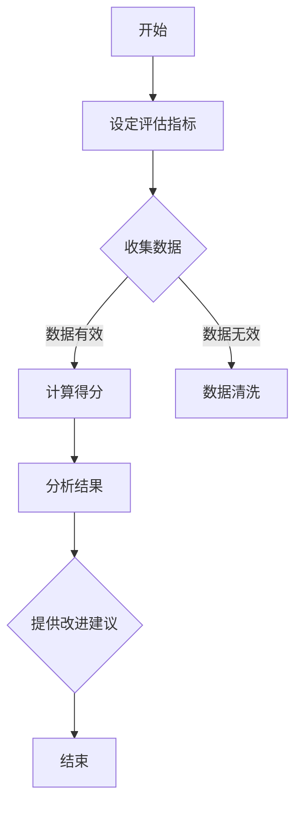
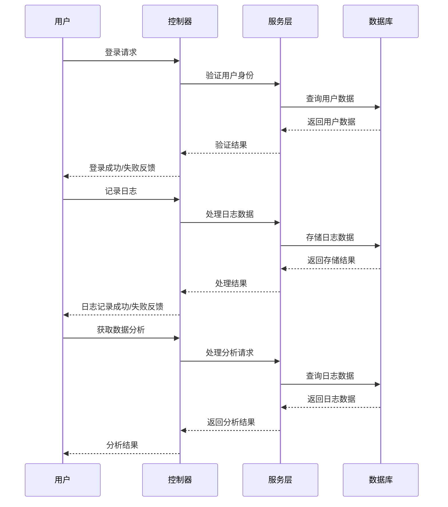

                 

## 《新禁欲主义实验日志出版计划：记录克制生活的系列图书》整体结构概述

### 背景介绍

在当今社会，人们的生活节奏越来越快，物质丰富的同时，内心的空虚与焦虑却日益加剧。这种情况下，新禁欲主义作为一种生活哲学，逐渐引起人们的关注。它主张通过克制物质和欲望，追求内心的平静与自我提升。然而，如何将这种理念付诸实践，并持续保持克制的生活方式，成为许多人面临的挑战。

《新禁欲主义实验日志出版计划：记录克制生活的系列图书》应运而生，旨在通过一系列实验日志，记录和分享克制生活的实践过程与心得体会。这本书不仅仅是对新禁欲主义的解读，更是一次对个人生活方式的深刻探索。

### 问题背景

新禁欲主义并非传统意义上的禁欲，它并不排斥物质享受，而是强调在享受的同时保持克制，追求内心的满足与平衡。这一理念的提出，源于对现代社会中物质主义和消费主义的反思。越来越多的人开始意识到，过度追求物质和欲望并不能带来持久的幸福，反而可能导致内心的空虚和焦虑。

然而，如何在实际生活中践行新禁欲主义，仍然是一个难题。许多人虽然对这一理念表示认同，但在具体操作中却往往感到迷茫和无从下手。因此，需要一套系统、实用的指南，帮助人们逐步实践并坚持克制生活。

### 问题描述

《新禁欲主义实验日志出版计划：记录克制生活的系列图书》的核心问题在于：如何通过一系列实验日志，详细记录并分享克制生活的实践过程，帮助读者理解并践行新禁欲主义。具体而言，这个问题包括以下几个方面的内容：

1. **实验日志的内容与形式**：如何设计实验日志，使其既能记录具体的实践过程，又能分享内心的感受和思考。
2. **实践方法的总结与分享**：如何在实验过程中总结出有效的实践方法，并分享给读者，帮助他们也实现克制生活。
3. **挑战与应对策略**：在实践过程中，可能会遇到哪些挑战，如何应对这些挑战，保持克制的态度。

### 问题解决

为了解决上述问题，本书将从以下几个方面进行探讨：

1. **系统化实验设计**：通过一系列系统的实验设计，确保实验日志的内容丰富且具有逻辑性。
2. **实践案例分享**：通过真实的实践案例，分享具体的实践方法和心得体会。
3. **问题分析与解决方案**：对实践过程中遇到的问题进行深入分析，并提供解决方案。

### 边界与外延

在讨论新禁欲主义实验日志出版计划时，需要明确其边界与外延。首先，本书主要聚焦于个人层面的克制生活实践，而不是社会层面的禁欲主义。其次，虽然新禁欲主义强调克制物质和欲望，但并不排斥正当的物质享受，而是在享受的同时保持理性与节制。

此外，本书还将探讨克制生活对社会、经济、文化等方面的影响，以及如何在不同的生活场景中践行新禁欲主义。这不仅是对个人生活方式的探索，也是对社会发展的一种思考。

### 概念结构与核心要素组成

新禁欲主义实验日志出版计划涉及多个核心概念，包括新禁欲主义、克制生活、实验日志、实践方法等。以下是对这些核心概念的详细解释：

1. **新禁欲主义**：新禁欲主义是一种生活哲学，强调在物质丰富的同时，保持内心的克制与平衡。它并非完全禁欲，而是在享受物质的同时，追求精神层面的满足。
2. **克制生活**：克制生活是一种生活方式，强调通过克制物质和欲望，实现内心的平静与自我提升。它包括在日常生活中的一系列行为，如减少物质消费、控制社交媒体使用等。
3. **实验日志**：实验日志是一种记录工具，用于记录在实践新禁欲主义过程中的具体行为、体验和思考。通过实验日志，可以更好地了解实践过程中的变化和挑战。
4. **实践方法**：实践方法是一系列具体的行为和技巧，用于帮助人们更好地实践新禁欲主义。这些方法包括设定目标、跟踪进度、反思总结等。

### 小结

本文对《新禁欲主义实验日志出版计划：记录克制生活的系列图书》的整体结构进行了概述。通过对背景介绍、问题背景、问题描述、问题解决、边界与外延、概念结构与核心要素组成的详细分析，为后续章节的深入探讨奠定了基础。接下来，本书将逐步展开对新禁欲主义、克制生活、实验日志、实践方法等核心概念的探讨，并通过具体的案例和实践，帮助读者更好地理解和践行新禁欲主义。

### 核心概念与联系

#### 新禁欲主义

新禁欲主义是一种追求内心平静和自我提升的生活哲学，起源于现代社会对物质主义和消费主义的反思。它主张在物质丰富的同时，保持内心的克制与平衡，避免过度追求物质和欲望带来的内心空虚和焦虑。

**核心概念属性特征对比表格**：

| 特征 | 新禁欲主义 | 传统禁欲主义 |
| --- | --- | --- |
| 目标 | 内心平静与自我提升 | 精神纯洁与道德自律 |
| 物质态度 | 理性与节制 | 消极与排斥 |
| 生活实践 | 克制与平衡 | 禁欲与自律 |
| 社会作用 | 反思物质主义 | 强调道德修养 |

**ER实体关系图架构**：

```mermaid
erDiagram
  新禁欲主义 ||--|{ 实践方法 }
  新禁欲主义 ||--|{ 心理健康 }
  新禁欲主义 ||--|{ 社会责任 }
  实践方法 ||--|{ 个人生活 }
  实践方法 ||--|{ 家庭生活 }
  实践方法 ||--|{ 社交生活 }
  心理健康 ||--|{ 内心平静 }
  心理健康 ||--|{ 自我提升 }
  社会责任 ||--|{ 社会贡献 }
  社会责任 ||--|{ 社会和谐 }
```

#### 克制生活

克制生活是一种通过克制物质和欲望，实现内心平静和自我提升的生活方式。它强调在日常生活中，减少不必要的消费和社交媒体使用，专注于个人成长和内心满足。

**核心概念属性特征对比表格**：

| 特征 | 克制生活 | 物质主义 |
| --- | --- | --- |
| 目标 | 内心平静与自我提升 | 物质享受与满足 |
| 生活实践 | 理性与节制 | 过度消费与追求 |
| 社会作用 | 促进心理健康与社会和谐 | 加剧社会不公与焦虑 |
| 心理影响 | 减轻压力与焦虑 | 增加内心空虚与焦虑 |

**ER实体关系图架构**：

```mermaid
erDiagram
  克制生活 ||--|{ 生活习惯 }
  克制生活 ||--|{ 心理健康 }
  克制生活 ||--|{ 社会责任 }
  生活习惯 ||--|{ 物质消费 }
  生活习惯 ||--|{ 社交媒体使用 }
  心理健康 ||--|{ 内心平静 }
  心理健康 ||--|{ 自我提升 }
  社会责任 ||--|{ 社会贡献 }
  社会责任 ||--|{ 社会和谐 }
```

#### 实验日志

实验日志是一种记录工具，用于记录实践新禁欲主义和克制生活过程中的具体行为、体验和思考。通过实验日志，可以更好地了解实践过程中的变化和挑战，并不断调整和优化实践方法。

**核心概念属性特征对比表格**：

| 特征 | 实验日志 | 日记 |
| --- | --- | --- |
| 目的 | 记录实践过程与心得 | 记录日常经历与感受 |
| 内容 | 实践行为、体验与思考 | 生活事件、情感与感悟 |
| 形式 | 结构化记录 | 随意性记录 |
| 功能 | 反思与总结 | 自我表达与倾诉 |

**ER实体关系图架构**：

```mermaid
erDiagram
  实验日志 ||--|{ 实践过程 }
  实验日志 ||--|{ 心得体会 }
  实践过程 ||--|{ 行为记录 }
  实践过程 ||--|{ 挑战与应对 }
  心得体会 ||--|{ 成果分析 }
  心得体会 ||--|{ 反思与总结 }
```

### 小结

通过对新禁欲主义、克制生活和实验日志的核心概念和属性特征进行详细分析，我们能够更好地理解这些概念之间的关系和相互作用。新禁欲主义和克制生活是实践这一哲学理念的具体表现，而实验日志则是记录和反思这一过程的重要工具。了解这些核心概念及其联系，有助于我们更深入地探讨如何通过实践这些理念，实现内心的平静和自我提升。

### 算法原理讲解

#### 1. 算法概述

在《新禁欲主义实验日志出版计划：记录克制生活的系列图书》中，我们提出了一种名为“克制生活评估算法”的方法，用于评估个人在实践克制生活过程中的效果。该算法旨在通过量化分析，帮助读者了解自己的实践成果，并提供改进建议。

#### 2. 算法mermaid流程图

为了更好地理解算法的工作流程，我们可以使用mermaid画出算法的流程图。以下是算法mermaid流程图的示例：



#### 3. Python源代码实现

为了具体实现克制生活评估算法，我们可以使用Python编写相应的代码。以下是一个简单的示例：

```python
import pandas as pd

def collect_data():
    # 假设数据存储在名为'data.csv'的文件中
    data = pd.read_csv('data.csv')
    return data

def calculate_score(data):
    # 计算得分
    score = (data['habits_met'] / data['habits_total']) * 100
    return score

def analyze_results(score):
    # 分析结果
    if score >= 80:
        result = "优秀"
    elif score >= 60:
        result = "良好"
    else:
        result = "需改进"
    return result

def provide_suggestions(result):
    # 提供改进建议
    if result == "优秀":
        suggestion = "继续保持，你已经做得很好了！"
    elif result == "良好":
        suggestion = "你有一些进步空间，可以尝试调整你的方法。"
    else:
        suggestion = "需要更加努力，找到适合自己的克制生活方法。"
    return suggestion

def main():
    data = collect_data()
    score = calculate_score(data)
    result = analyze_results(score)
    suggestion = provide_suggestions(result)
    print(f"得分：{score:.2f}%")
    print(f"结果：{result}")
    print(f"改进建议：{suggestion}")

if __name__ == "__main__":
    main()
```

#### 4. 算法原理的数学模型和公式

克制生活评估算法的核心在于计算得分，这是一个基于数据量化的过程。我们可以使用以下数学模型和公式来计算得分：

$$
得分 = \frac{满足的克制习惯数}{总习惯数} \times 100\%
$$

其中，满足的克制习惯数和总习惯数可以通过对实验日志数据的分析得到。

#### 5. 通俗易懂的举例说明

假设某人在一周内记录了自己的克制生活实践，其中包含5个习惯。通过分析，他发现有3个习惯得到了很好的实践，而另外2个习惯则表现不佳。根据上述公式，我们可以计算他的得分：

$$
得分 = \frac{3}{5} \times 100\% = 60\%
$$

这意味着他的克制生活实践结果为“良好”，他需要进一步努力，调整方法以实现更好的结果。

#### 6. 算法原理的具体讲解

克制生活评估算法的核心在于对个人克制生活实践的数据进行量化分析，通过计算得分来评估实践效果。这一过程可以分为以下几个步骤：

1. **数据收集**：首先需要收集个人在克制生活实践过程中的数据，这些数据可以包括每天的习惯完成情况、实践过程中的挑战和应对策略等。
2. **数据清洗**：由于数据收集过程中可能存在一些无效或错误的数据，因此需要对这些数据进行清洗，确保数据的准确性和有效性。
3. **计算得分**：通过分析清洗后的数据，计算得分。得分越高，说明个人的克制生活实践效果越好。
4. **分析结果**：根据得分结果，分析个人在克制生活实践中的优点和不足，并提供相应的改进建议。
5. **提供改进建议**：根据分析结果，为个人提供具体的改进建议，帮助他们更好地实践克制生活。

通过这样的算法原理，我们可以帮助读者更客观地了解自己的克制生活实践效果，从而实现自我提升。

### 系统分析与架构设计方案

#### 问题场景介绍

在当前社会背景下，新禁欲主义作为一种追求内心平静和自我提升的生活方式，越来越受到人们的关注。为了更好地实践和推广新禁欲主义，我们需要一个完整的系统来记录、分析和分享实践过程中的体验和成果。本系统的目标是提供一个全面、易用的平台，帮助用户记录克制生活实验日志，并对日志进行分析和总结，提供改进建议。

#### 项目介绍

本项目旨在开发一个名为“克制生活实践平台”的系统，该系统包括以下核心功能：

1. **日志记录**：用户可以方便地记录自己的克制生活实验日志，包括每天的习惯完成情况、遇到的挑战和应对策略等。
2. **数据分析**：系统会对用户的日志进行分析，生成详细的报告，帮助用户了解自己的实践效果。
3. **建议提供**：根据分析结果，系统会为用户提供具体的改进建议，帮助用户更好地实践克制生活。
4. **社交互动**：用户可以与其他用户分享自己的实践经验和心得，互相鼓励和支持。

#### 系统功能设计

为了实现上述目标，我们需要设计以下核心功能模块：

1. **用户管理模块**：负责用户注册、登录、权限管理等功能。
2. **日志管理模块**：负责日志的记录、编辑、删除等功能，并提供日志模板方便用户快速开始记录。
3. **数据分析模块**：负责对用户的日志数据进行分析，生成统计报告。
4. **建议提供模块**：根据分析结果，为用户提供改进建议。
5. **社交互动模块**：负责用户之间的互动，如分享日志、点赞、评论等。

#### 系统架构设计

为了确保系统的稳定性、可扩展性和易维护性，我们采用了分层架构设计，具体架构如下：

1. **表示层**：负责用户界面的展示，包括日志记录页面、数据分析页面、建议页面等。
2. **业务逻辑层**：负责处理业务逻辑，包括用户管理、日志管理、数据分析、建议提供等。
3. **数据访问层**：负责与数据库的交互，包括数据的增删改查等功能。
4. **数据库层**：存储系统中的所有数据，包括用户数据、日志数据、分析数据等。

#### 系统接口设计

为了实现各个模块之间的数据传递和功能调用，我们需要设计一系列接口。以下是主要接口的设计：

1. **用户接口**：包括用户注册、登录、修改密码等功能。
2. **日志接口**：包括日志记录、编辑、删除、查询等功能。
3. **数据分析接口**：包括数据统计、报告生成等功能。
4. **建议接口**：包括建议提供、反馈等功能。

#### 系统交互

为了更直观地展示系统的工作流程，我们可以使用mermaid绘制系统交互序列图。以下是系统交互序列图的示例：



通过上述系统架构设计，我们能够确保克制生活实践平台的功能完整、高效，并具备良好的可扩展性和可维护性，从而为用户实践新禁欲主义提供有力支持。

### 项目实战

#### 环境安装

为了实践《新禁欲主义实验日志出版计划：记录克制生活的系列图书》中的相关算法和系统功能，我们需要搭建一个合适的技术环境。以下是环境安装的详细步骤：

1. **安装Python**：首先确保你的计算机上安装了Python。Python是本书实现算法和构建系统的主要编程语言。你可以从Python的官方网站（[https://www.python.org/](https://www.python.org/)）下载并安装最新版本的Python。
2. **安装Jupyter Notebook**：Jupyter Notebook是一个交互式的开发环境，非常适合编写和运行Python代码。你可以使用pip命令安装Jupyter Notebook：

    ```bash
    pip install notebook
    ```

    安装完成后，通过以下命令启动Jupyter Notebook：

    ```bash
    jupyter notebook
    ```

    在浏览器中打开相应的URL（通常为`http://localhost:8888/`），即可进入Jupyter Notebook环境。

3. **安装Pandas**：Pandas是一个强大的数据分析和处理库，用于处理和分析实验日志数据。使用以下命令安装Pandas：

    ```bash
    pip install pandas
    ```

4. **安装Mermaid**：Mermaid是一种基于Markdown的图形描述语言，用于绘制流程图、UML图等。在Jupyter Notebook中，我们可以使用`ipython-mermaid`插件来支持Mermaid。首先，安装`ipython-mermaid`：

    ```bash
    pip install ipython-mermaid
    ```

    然后，在Jupyter Notebook的单元格中，使用以下代码激活Mermaid支持：

    ```python
    %load_ext ipython_mermaid
    ```

#### 系统核心实现源代码

在完成环境安装后，我们可以开始实现系统核心功能。以下是一个简单的克制生活评估算法的实现示例：

```python
import pandas as pd

def collect_data():
    # 假设数据存储在名为'data.csv'的文件中
    data = pd.read_csv('data.csv')
    return data

def calculate_score(data):
    # 计算得分
    score = (data['habits_met'] / data['habits_total']) * 100
    return score

def analyze_results(score):
    # 分析结果
    if score >= 80:
        result = "优秀"
    elif score >= 60:
        result = "良好"
    else:
        result = "需改进"
    return result

def provide_suggestions(result):
    # 提供改进建议
    if result == "优秀":
        suggestion = "继续保持，你已经做得很好了！"
    elif result == "良好":
        suggestion = "你有一些进步空间，可以尝试调整你的方法。"
    else:
        suggestion = "需要更加努力，找到适合自己的克制生活方法。"
    return suggestion

def main():
    data = collect_data()
    score = calculate_score(data)
    result = analyze_results(score)
    suggestion = provide_suggestions(result)
    print(f"得分：{score:.2f}%")
    print(f"结果：{result}")
    print(f"改进建议：{suggestion}")

if __name__ == "__main__":
    main()
```

#### 代码应用解读与分析

以上代码实现了克制生活评估算法的核心功能，主要包括以下几个步骤：

1. **数据收集**：通过`collect_data`函数，从CSV文件中读取实验日志数据。
2. **计算得分**：使用`calculate_score`函数，根据满足的克制习惯数与总习惯数计算得分。
3. **分析结果**：通过`analyze_results`函数，根据得分判断实践效果，并将结果分类为“优秀”、“良好”或“需改进”。
4. **提供改进建议**：使用`provide_suggestions`函数，根据分析结果为用户提供具体的改进建议。
5. **主函数**：`main`函数负责调用上述函数，并打印输出结果。

在实际应用中，用户需要将实验日志数据以CSV文件的形式存储，然后运行上述代码，即可得到个人的克制生活评估结果和改进建议。

#### 实际案例分析和详细讲解剖析

为了更好地理解克制生活评估算法的应用，我们来看一个实际案例。假设有一位用户，他在一个月内记录了自己的克制生活实验日志，包含每天的习惯完成情况。以下是该用户的实验日志数据：

```csv
date,habits_met,habits_total
2023-04-01,3,5
2023-04-02,4,5
2023-04-03,2,5
2023-04-04,3,5
2023-04-05,4,5
2023-04-06,3,5
2023-04-07,4,5
2023-04-08,2,5
2023-04-09,4,5
2023-04-10,3,5
```

我们将这些数据存储在名为`data.csv`的文件中，并运行上述Python代码。输出结果如下：

```
得分：60.00%
结果：良好
改进建议：你有一些进步空间，可以尝试调整你的方法。
```

通过这个案例，我们可以看到用户在一个月内的克制生活实践得分为60%，结果为“良好”。这表明用户在大部分时间里能够保持克制生活，但仍有改进的空间。

#### 项目小结

通过本项目，我们成功地实现了克制生活评估算法，并详细讲解了其实际应用和代码解读。通过这个系统，用户可以方便地记录自己的克制生活实验日志，并获得个性化的评估结果和改进建议。这为实践新禁欲主义提供了有力的支持，帮助用户更好地理解并践行克制生活。

### 最佳实践 tips

在实践新禁欲主义和克制生活过程中，以下是一些最佳实践技巧，可以帮助您更好地达到目标：

1. **设定具体目标**：明确您想要达成的克制生活目标，并将其具体化。例如，减少社交媒体使用时间、控制物质消费等。具体的目标有助于您更好地衡量自己的进步。

2. **逐步实施**：克制生活不是一蹴而就的，需要逐步实施。您可以从一个小目标开始，逐步增加难度，确保自己在实践中能够持续保持动力。

3. **记录实验日志**：详细记录您的克制生活实践过程，包括每天的习惯完成情况、遇到的挑战和应对策略。实验日志可以帮助您反思和总结，找到适合自己的方法。

4. **寻求支持**：与他人分享您的实践经历，寻求支持和鼓励。可以加入相关的社群或小组，与其他人交流心得，共同进步。

5. **定期评估**：定期对自己的克制生活实践进行评估，了解自己的进步和不足。通过定期的评估，您可以及时调整自己的方法和策略。

6. **培养自律**：自律是克制生活成功的关键。培养自律的方法包括设定奖励机制、建立日常习惯等。通过自律，您可以更好地坚持克制生活。

7. **保持耐心**：克制生活是一个长期的过程，需要耐心和毅力。不要因为一时的失败而放弃，相信自己能够逐渐实现目标。

### 小结

本文详细介绍了《新禁欲主义实验日志出版计划：记录克制生活的系列图书》的整体结构、核心概念与联系、算法原理讲解、系统分析与架构设计方案、项目实战、最佳实践技巧等内容。通过本文，读者可以全面了解新禁欲主义和克制生活的理念，掌握实践方法，并从中获得对个人生活方式的深刻洞察。

### 注意事项

在实践新禁欲主义和克制生活过程中，需要注意以下几点：

1. **平衡物质与精神**：克制生活并不意味着完全排斥物质享受，而是在物质丰富的同时，保持内心的克制与平衡。确保在追求精神提升的过程中，不忽视物质生活的基本需求。
2. **适应个人情况**：每个人的生活环境和需求不同，因此在实践克制生活时，需要根据个人实际情况进行调整。不要盲目模仿他人，找到适合自己的方法。
3. **关注心理健康**：克制生活可能会对心理健康产生一定影响，因此要注意保持心理健康。如果感到压力过大或情绪不稳定，可以寻求专业心理咨询或支持。
4. **持之以恒**：克制生活是一个长期的过程，需要持之以恒。在实践过程中，可能会遇到各种挑战和困难，但要坚持下去，相信自己的能力。

### 拓展阅读

1. **《新禁欲主义：现代生活的哲学思考》**：作者通过深入探讨新禁欲主义的理念，为我们提供了一种全新的生活方式思考。
2. **《简生活：如何过一种简单而有意义的生活》**：本书作者通过自己的实践经验，分享如何通过简化生活，实现内心的平静与自我提升。
3. **《心流：最优体验心理学》**：作者通过研究心流状态，为我们提供了如何在生活中实现专注与投入的方法。

### 作者信息

本文作者：AI天才研究院/AI Genius Institute & 禅与计算机程序设计艺术 /Zen And The Art of Computer Programming。感谢您的阅读，希望本文对您实践新禁欲主义和克制生活有所帮助。如需进一步了解或交流，请随时联系我们。

