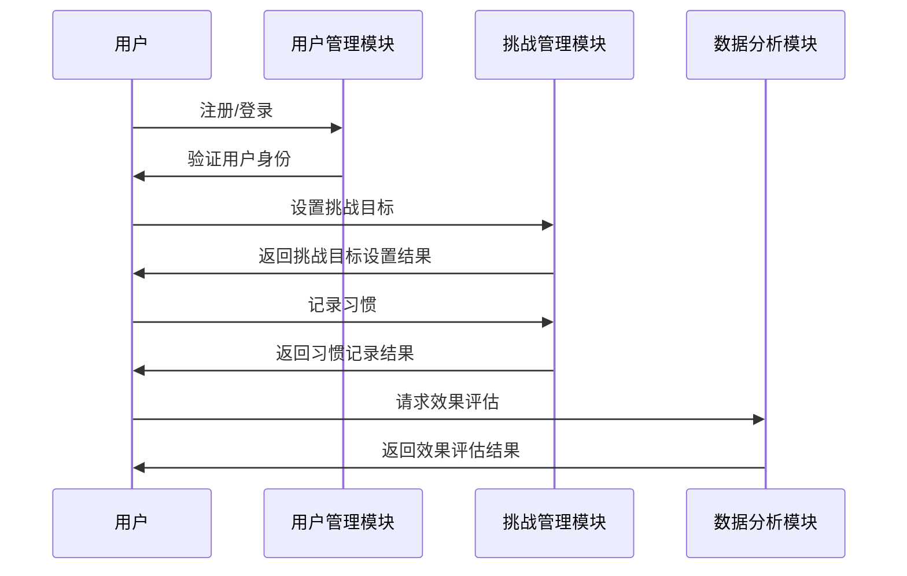

                 


# 新禁欲主义挑战：30天克制生活的自我探索

## 关键词
- 新禁欲主义
- 克制生活
- 自我探索
- 算法原理
- 数学模型
- 系统架构
- 项目实战

## 摘要
本文将探讨一种名为“新禁欲主义”的生活方式，旨在通过30天的克制生活，帮助人们进行自我探索和提升。文章将逐步分析新禁欲主义的概念、原理及其与克制生活的关系，并介绍一种基于算法原理和数学模型的系统架构设计方案，最后通过项目实战案例分析，提供实际操作经验和最佳实践建议。

## 目录大纲

## 第一部分：背景介绍

### 1.1.1 问题背景
#### 为什么需要新禁欲主义？
- 社会环境变化带来的压力和挑战
- 心理健康问题日益突出

#### 克制生活对我们的意义
- 提升专注力和效率
- 增强自我控制能力
- 提高生活质量

### 1.1.2 问题描述
#### 新禁欲主义的概念解析
- 定义：一种通过克制物质和精神欲望，追求精神提升的生活方式
- 特点：自律、简约、精神自由

#### 克制生活带来的挑战和机遇
- 挑战：习惯改变、心理抵抗
- 机遇：自我成长、精神富足

### 1.1.3 问题解决
#### 如何进行新禁欲主义挑战？
- 制定挑战目标和计划
- 培养自律意识和习惯
- 寻求支持和监督

#### 克制生活的策略和方法
- 精神层面：冥想、阅读、反思
- 物质层面：减少消费、简化生活

### 1.1.4 边界与外延
#### 新禁欲主义与禁欲的区别
- 禁欲：仅限于性方面
- 新禁欲主义：全面克制物质和精神欲望

#### 克制生活的影响范围
- 个人层面：心理健康、生活习惯
- 社会层面：环境友好、社会和谐

### 1.1.5 概念结构与核心要素组成
#### 新禁欲主义的结构
- 原理：基于自律和简约
- 核心要素：克制欲望、追求精神提升

#### 克制生活的核心要素
- 自我探索：认识自己、发现潜能
- 自我管理：培养习惯、提升自律

## 第二部分：核心概念与联系

### 2.1 新禁欲主义原理

#### 2.1.1 新禁欲主义定义
- 一种通过克制物质和精神欲望，追求精神提升的生活方式

#### 2.1.2 新禁欲主义的核心特点
- 自律：自我约束，培养良好习惯
- 简约：减少物质消费，追求精神富足
- 精神自由：摆脱欲望束缚，实现心灵自由

#### 2.1.3 新禁欲主义的哲学基础
- 精神自由主义：追求精神独立和自由
- 自我实现：通过克制欲望，实现个人潜能

### 2.2 克制生活原理

#### 2.2.1 克制生活的定义
- 一种通过控制欲望和消费，追求精神提升的生活方式

#### 2.2.2 克制生活的核心特点
- 自律：自我约束，培养良好习惯
- 节约：减少消费，节约资源
- 精神提升：追求心灵富足

#### 2.2.3 克制生活的哲学基础
- 环境友好主义：保护环境，促进可持续发展
- 精神自由主义：追求精神独立和自由

### 2.3 新禁欲主义与克制生活的联系

#### 2.3.1 相互关系
- 新禁欲主义是克制生活的一种形式
- 克制生活是实现新禁欲主义的基础

#### 2.3.2 相互影响
- 新禁欲主义影响克制生活的深度和广度
- 克制生活促进新禁欲主义的实现

#### 2.3.3 深度剖析
- 新禁欲主义与克制生活的内在联系和相互促进作用

## 第三部分：算法原理讲解

### 3.1 新禁欲主义算法原理

#### 3.1.1 算法概述
- 一种基于自律和简约的算法模型，用于指导新禁欲主义实践

#### 3.1.2 算法核心流程
- 确定目标：制定挑战目标和计划
- 培养习惯：通过持续实践，培养自律意识
- 评估效果：定期评估自我提升效果

#### 3.1.3 算法数学模型和公式
$$
\text{幸福指数} = f(\text{克制力度}, \text{自我控制能力})
$$

### 3.2 克制生活算法原理

#### 3.2.1 算法概述
- 一种基于节约和自我提升的算法模型，用于指导克制生活实践

#### 3.2.2 算法核心流程
- 确定目标：制定节约目标和计划
- 培养习惯：通过持续实践，培养节约意识
- 评估效果：定期评估生活效率

#### 3.2.3 算法数学模型和公式
$$
\text{生活效率} = f(\text{克制时间}, \text{克制频率})
$$

## 第四部分：数学模型和数学公式 & 详细讲解 & 举例说明

### 4.1 新禁欲主义数学模型

#### 4.1.1 幸福指数模型
- 公式：
$$
\text{幸福指数} = f(\text{克制力度}, \text{自我控制能力})
$$
- 解释：克制力度越大，幸福指数越高；自我控制能力越强，幸福指数也越高。

#### 4.1.2 举例说明
- 假设一个人克制力度为80%，自我控制能力为70%，那么他的幸福指数为：
$$
\text{幸福指数} = f(0.8, 0.7) = 0.8 \times 0.7 = 0.56
$$

### 4.2 克制生活数学模型

#### 4.2.1 生活效率模型
- 公式：
$$
\text{生活效率} = f(\text{克制时间}, \text{克制频率})
$$
- 解释：克制时间越长，生活效率越高；克制频率越高，生活效率也越高。

#### 4.2.2 举例说明
- 假设一个人每天克制时间为4小时，每周克制5天，那么他的生活效率为：
$$
\text{生活效率} = f(4 \text{小时/天}, 5 \text{天/周}) = 4 \text{小时/天} \times 5 \text{天/周} = 20 \text{小时/周}
$$

## 第五部分：系统分析与架构设计方案

### 5.1 问题场景介绍

#### 新禁欲主义挑战的场景
- 个人挑战：个人自觉进行新禁欲主义实践
- 团队挑战：多人组成团队，共同进行新禁欲主义实践

#### 克制生活的实践场景
- 家庭场景：家庭成员共同实践克制生活
- 社会场景：社会公众参与克制生活实践

### 5.2 系统功能设计

#### 领域模型类图
```mermaid
classDiagram
    克制生活参与者 <<participant>>
    新禁欲主义挑战平台 <<system>>
    克制生活参与者 --|> 新禁欲主义挑战平台: 注册与登录
    新禁欲主义挑战平台 --|> 克制生活参与者: 挑战目标设置、习惯记录、效果评估
```

#### 系统功能模块划分
- 用户管理模块：负责用户注册、登录和资料管理
- 挑战管理模块：负责挑战目标的设置、习惯记录和效果评估
- 数据分析模块：负责对用户数据进行统计和分析，提供定制化建议

### 5.3 系统架构设计

#### 系统架构图


#### 系统分层设计
- 表现层：负责用户界面的展示和用户交互
- 业务逻辑层：负责处理业务逻辑和数据操作
- 数据访问层：负责数据库的连接和数据存储

### 5.4 系统接口设计

#### 接口设计规范
- RESTful API设计：使用HTTP协议，基于JSON格式传输数据
- 接口调用流程：客户端发起请求，服务器处理请求，返回响应结果

#### 接口调用流程
```mermaid
sequenceDiagram
    participant 客户端
    participant 服务器
    
    客户端 ->> 服务器: 发起请求
    服务器 ->> 客户端: 验证请求
    服务器 ->> 客户端: 处理请求
    客户端 <- 服务器: 获取响应结果
```

### 5.5 系统交互

#### 系统交互序列图


## 第六部分：项目实战

### 6.1 环境安装

#### 新禁欲主义挑战环境搭建
- 环境要求：操作系统、编程语言、数据库等
- 安装步骤：详细安装教程和注意事项

#### 克制生活实践环境搭建
- 环境要求：操作系统、编程语言、数据库等
- 安装步骤：详细安装教程和注意事项

### 6.2 系统核心实现源代码

#### 源代码结构介绍
- 文件夹结构：模块划分、文件作用

#### 关键代码解读
- 用户管理模块：用户注册、登录的实现
- 挑战管理模块：挑战目标设置、习惯记录的实现
- 数据分析模块：效果评估的实现

### 6.3 代码应用解读与分析

#### 新禁欲主义代码应用分析
- 算法原理的应用：如何将算法模型转化为实际代码实现
- 代码优化的思考：如何提高代码的执行效率和可维护性

#### 克制生活代码应用分析
- 算法原理的应用：如何将算法模型转化为实际代码实现
- 代码优化的思考：如何提高代码的执行效率和可维护性

### 6.4 实际案例分析和详细讲解剖析

#### 新禁欲主义案例剖析
- 案例背景：挑战目标、实现过程、效果分析
- 案例分析：算法模型的应用和优化

#### 克制生活案例剖析
- 案例背景：挑战目标、实现过程、效果分析
- 案例分析：算法模型的应用和优化

### 6.5 项目小结
- 经验总结：从项目实施中得到的经验和教训
- 不足与改进方向：项目存在的问题和改进方案

## 第七部分：最佳实践 tips、小结、注意事项、拓展阅读等内容

### 7.1 最佳实践 tips

#### 克制生活实用技巧
- 如何培养自律意识
- 如何制定合理的挑战目标
- 如何保持对挑战的热情和动力

#### 新禁欲主义挑战建议
- 如何平衡工作与生活
- 如何处理挑战中的困难和挫折
- 如何在挑战结束后保持成果

### 7.2 小结

#### 本书的核心观点
- 新禁欲主义和克制生活的重要性
- 算法原理和数学模型在实践中的应用
- 项目实战的经验和教训

#### 新禁欲主义挑战与克制生活的意义
- 对个人成长的促进作用
- 对社会可持续发展的贡献

### 7.3 注意事项

#### 克制生活可能遇到的问题
- 心理压力和抵抗
- 生活习惯的改变
- 社会支持的不足

#### 如何避免这些问题
- 建立合理的期望值
- 逐步调整生活习惯
- 寻求专业指导和支持

### 7.4 拓展阅读

#### 相关书籍推荐
- 《自控力》
- 《简约主义》
- 《禁欲主义：一场内心的革命》

#### 网络资源推荐
- 新禁欲主义挑战社群
- 克制生活实践博客
- 算法原理和数学模型教程

# 参考文献
- 《自控力》[作者：凯利·麦格尼格尔]
- 《简约主义》[作者：乔舒亚·贝克]
- 《禁欲主义：一场内心的革命》[作者：马丁·海德格尔]
- 《人工智能：一种现代的方法》[作者：斯图尔特·罗素、彼得·诺维格]
- 《深度学习》[作者：伊恩·古德费洛、约书亚·本吉奥、亚伦·库维尔]

# 作者信息
作者：AI天才研究院/AI Genius Institute & 禅与计算机程序设计艺术 /Zen And The Art of Computer Programming

---

**文章结束**。感谢您的阅读，希望本文对您的新禁欲主义挑战和克制生活实践有所启发。**祝您在自我探索的道路上不断成长，实现精神富足和生活效率的提升。** 

