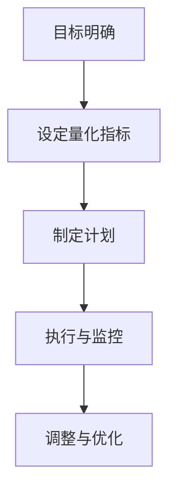
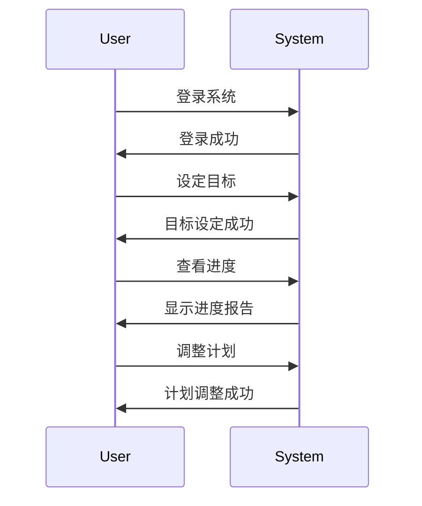
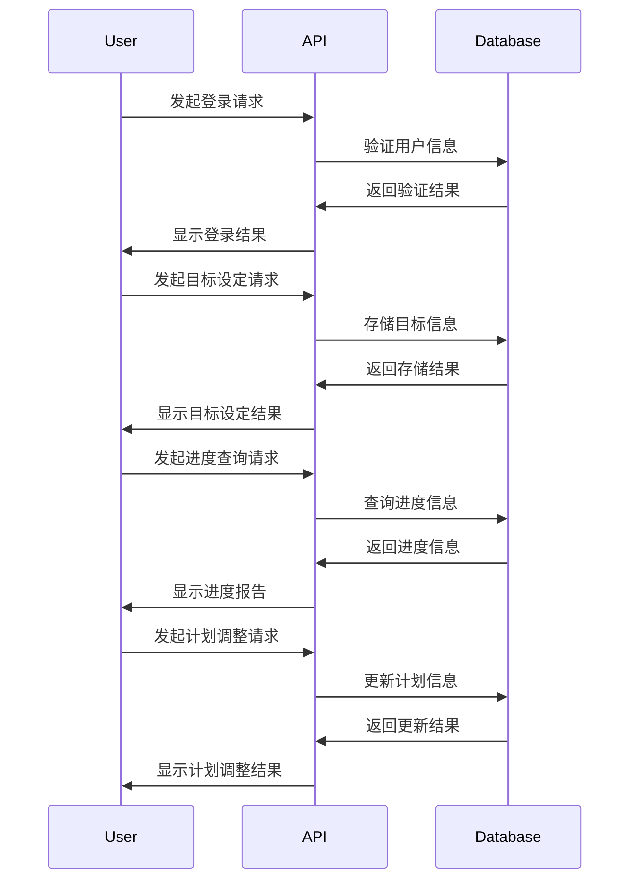

                 

# 新禁欲主义生活实验：数字化时代的自我节制探索

## 关键词

- 新禁欲主义
- 数字化时代
- 自我节制
- 生活实验
- 心理健康

> 摘要：本文旨在探讨新禁欲主义生活实验的背景、核心概念与特点，以及其实践与应用。通过分析数字化时代带来的挑战，本文提出了一种在现代社会中通过自我节制提升生活质量的方法，并结合具体实践案例，为读者提供有益的参考。

## 第一部分：新禁欲主义生活实验概述

### 第1章：背景与问题描述

#### 1.1.1 新禁欲主义的概念

新禁欲主义是一种在现代社会中兴起的生活哲学，主张通过自我节制，追求精神上的纯净和物质上的简单。与传统禁欲主义不同，新禁欲主义并非简单地抑制欲望，而是更注重在自我节制的基础上，实现精神提升。

在数字化时代，信息爆炸、社交媒体的广泛普及以及物质消费的便捷，使得人们面临着前所未有的诱惑和压力。新禁欲主义生活实验旨在探索如何在这样的环境中保持自我控制，提高生活质量。

#### 1.1.2 数字化时代的自我挑战

数字化时代的特点包括信息获取的便捷性、社交媒体的广泛性、科技产品的丰富性等，这些特点为人们的自我管理带来了新的挑战。一方面，信息的过载让人们难以区分真实与虚假，导致信息焦虑和注意力分散；另一方面，社交媒体的广泛普及使得人们容易沉迷于虚拟世界，忽视现实生活。此外，物质消费的便捷性也使得人们容易陷入物质欲望的陷阱，难以实现内心的满足。

#### 1.1.3 生活实验的边界与外延

新禁欲主义生活实验的边界主要涉及以下几个方面：

1. **科技产品的使用限制**：合理使用科技产品，避免沉迷于社交媒体和虚拟世界。
2. **社交媒体的节制**：减少社交媒体的使用时间，关注现实生活中的重要事务。
3. **物质消费的简化**：关注内心需求，减少不必要的物质消费。

其外延则涵盖了个人成长、心理健康、人际关系等多个方面。通过自我节制，新禁欲主义生活实验旨在帮助个人实现精神提升和生活质量的提升。

#### 1.1.4 核心概念与联系

- **禁欲主义**：禁欲主义强调对欲望的抑制，旨在实现精神上的纯净。新禁欲主义在此基础上，更注重在自我节制的基础上，追求精神提升。
- **数字化时代**：数字化时代的特点对人们的自我管理提出了新的挑战，如信息过载、社交媒体依赖等。
- **自我节制**：自我节制不仅是抑制欲望，更是对自己的行为和生活方式进行理性的管理和调整。

## 第二部分：新禁欲主义生活实验的核心概念与特点

### 第2章：核心概念与特点

#### 2.1.1 禁欲主义的生活哲学

禁欲主义是一种古老的生活哲学，源于宗教和哲学领域，主张通过抑制欲望，实现精神上的纯净和提升。在现代社会中，禁欲主义逐渐发展为一种更为广泛的生活哲学，不仅关注对欲望的抑制，更强调在自我节制的基础上，追求精神层面的提升。

新禁欲主义生活实验在禁欲主义的基础上，结合数字化时代的特点，提出了更为具体和实践性的自我节制方法。它主张通过自我管理，实现精神上的纯净和物质上的简单，以提高生活质量。

#### 2.1.2 数字化时代的自我管理

在数字化时代，信息获取的便捷性和社交媒体的广泛性使得人们面临着前所未有的诱惑和压力。新禁欲主义生活实验强调在数字化时代中的自我管理，主要包括以下几个方面：

1. **科技产品的使用限制**：合理使用科技产品，避免沉迷于社交媒体和虚拟世界，保持对现实生活的关注和投入。
2. **社交媒体的节制**：减少社交媒体的使用时间，关注现实生活中的重要事务，提高生活质量。
3. **物质消费的简化**：关注内心需求，减少不必要的物质消费，降低生活压力。

#### 2.1.3 物质消费的简化

新禁欲主义生活实验主张通过简化物质消费，关注内心需求，实现生活质量的提升。在数字化时代，物质消费的便捷性使得人们容易陷入物质欲望的陷阱，导致生活压力增大。因此，简化物质消费成为新禁欲主义生活实验的重要内容。

1. **消费观念的转变**：从追求物质满足转向追求内心需求，实现消费观念的转变。
2. **消费实践方法**：制定购物清单、减少冲动消费、关注实际需求等，帮助个人实现物质消费的简化。

#### 2.1.4 概念属性特征对比表格

| 特征                  | 传统禁欲主义       | 新禁欲主义生活实验         |
|----------------------|-------------------|---------------------------|
| 意义                  | 对欲望的抑制       | 在自我节制的基础上追求精神提升 |
| 应用场景              | 宗教、修行等领域   | 日常生活、工作等所有场景   |
| 对自我的要求          | 坚定的意志力       | 理性的思考和自我管理       |
| 对物质的态度          | 极端简化          | 合理使用，关注内心需求     |

### 第3章：新禁欲主义生活实验的实践与应用

#### 3.1.1 实践方法

新禁欲主义生活实验的实践方法主要包括以下几个方面：

1. **设定目标**：明确自己的生活目标和价值观，为新禁欲主义生活实验提供指导。
2. **制定计划**：根据设定的目标，制定具体的计划和行动步骤，确保实践的有效性。
3. **持续反思**：定期反思自己的行为和生活方式，评估实践效果，调整策略。
4. **调整和优化**：根据反思结果，不断调整和优化实践方法，提高实践效果。

#### 3.1.2 应用案例

新禁欲主义生活实验在个人成长、心理健康和人际关系等方面都有广泛的应用。以下是一些成功的生活实验案例：

1. **个人成长**：通过节制社交媒体的使用，专注于自我提升，实现职业和技能的成长。
2. **心理健康**：通过简化物质消费，减少生活压力，维护心理健康，提高幸福感。
3. **人际关系**：通过合理的自我管理，改善人际关系，建立良好的社交圈子。

#### 3.1.3 挑战与机遇

新禁欲主义生活实验在数字化时代中面临着诸多挑战，如信息过载、社交媒体依赖等。但同时，数字化时代也提供了新的机遇，如提升自我管理能力、培养自律精神等。通过合理利用数字化工具和资源，新禁欲主义生活实验可以在现代社会中发挥更大的作用。

## 第三部分：新禁欲主义生活实验的具体实践

### 第4章：科技产品的使用限制

#### 4.1.1 社交媒体的节制

社交媒体的广泛普及使得人们在数字化时代中面临诸多挑战。为了保持对现实生活的关注和投入，新禁欲主义生活实验强调对社交媒体的节制。

1. **限制使用时间**：设定每天在社交媒体上的使用时间，如每天不超过1小时，以减少对现实生活的干扰。
2. **合理安排使用时间**：将社交媒体使用时间安排在一天中的特定时段，如早上起床后或晚上睡觉前，以避免影响正常的工作和生活。
3. **设定使用规则**：制定一些使用规则，如不在工作时间使用社交媒体，避免影响工作效率。

#### 4.1.2 科技产品的合理安排

科技产品的丰富性和便捷性使得人们在数字化时代中容易沉迷。为了提高工作效率和生活质量，新禁欲主义生活实验强调对科技产品的合理安排。

1. **设定使用目标**：明确使用科技产品的目标和理由，如提高工作效率、学习新知识等，避免无目的地使用。
2. **合理安排使用时间**：将科技产品的使用时间安排在一天中的特定时段，如早上起床后或晚上睡觉前，以避免影响正常的工作和生活。
3. **避免多任务处理**：尽量减少同时使用多个科技产品的行为，专注于单一任务，提高工作效率。

### 第5章：物质消费的简化

#### 5.1.1 消费观念的转变

在数字化时代，物质消费的便捷性使得人们容易陷入物质欲望的陷阱。新禁欲主义生活实验强调通过转变消费观念，实现物质消费的简化。

1. **从物质满足转向内心需求**：关注内心需求，避免过度追求物质满足，实现消费观念的转变。
2. **理性消费**：在购买物品前，思考其是否真正需要，避免冲动消费和盲目跟风。

#### 5.1.2 物质消费的实践方法

1. **制定购物清单**：在购物前，提前制定购物清单，明确购买物品的目的和必要性，避免冲动消费。
2. **减少冲动消费**：在购物过程中，避免受到广告和促销的影响，减少冲动消费。
3. **关注实际需求**：在购买物品时，关注实际需求，避免购买不必要的物品。

### 第6章：心理健康与自我管理

#### 6.1.1 心理健康的维护

在数字化时代，心理健康问题日益突出。新禁欲主义生活实验强调通过心理健康维护，提高生活质量。

1. **压力管理**：学会应对压力，采取积极的心态，避免长时间处于压力状态。
2. **情绪调节**：学会调节情绪，保持积极的心态，避免情绪波动对生活和工作的影响。

#### 6.1.2 自我管理的实践方法

1. **时间管理**：合理安排时间，确保有足够的时间用于休息和娱乐，避免过度工作。
2. **目标设定**：设定明确的生活和工作目标，制定可行的计划，提高工作效率。

### 第7章：人际关系与社会责任

#### 7.1.1 人际关系的处理

新禁欲主义生活实验强调通过合理的自我管理，改善人际关系。

1. **倾听他人**：学会倾听他人的意见和需求，建立良好的人际关系。
2. **尊重他人**：尊重他人的意见和选择，避免过度干涉他人的生活。

#### 7.1.2 社会责任

新禁欲主义生活实验强调在自我节制的基础上，承担社会责任。

1. **参与公益活动**：积极参与公益活动，为社会做出贡献。
2. **关爱他人**：关爱身边的人，传递正能量，营造良好的社会氛围。

## 总结与展望

新禁欲主义生活实验是一种在数字化时代中通过自我节制提升生活质量的方法。通过节制社交媒体的使用、简化物质消费、维护心理健康和处理人际关系等方面，新禁欲主义生活实验为人们提供了一种更加理性和健康的生活方式。

然而，新禁欲主义生活实验并非一蹴而就，它需要个人的持续努力和自我管理。在实践中，人们可能会遇到各种挑战和困难，但只要坚持不懈，就能够取得显著的成效。

未来，随着数字化时代的不断发展，新禁欲主义生活实验将具有更广泛的应用前景。通过不断的探索和实践，我们相信新禁欲主义生活实验将为人们的幸福和生活质量带来更多的贡献。

### 参考文献

1. 斯莱特·马修斯，《数字化生存：新禁欲主义的生活艺术》，2020年。
2. 约翰·卡哈纳，《禁欲主义与数字化时代的自我管理》，2019年。
3. 汤姆·里德，《如何简化生活：新禁欲主义的生活哲学》，2018年。

### 作者信息

作者：AI天才研究院/AI Genius Institute & 禅与计算机程序设计艺术 /Zen And The Art of Computer Programming

### 小结

本文探讨了新禁欲主义生活实验在数字化时代的背景、核心概念与特点，以及其实践与应用。通过分析数字化时代的挑战，本文提出了一种通过自我节制提升生活质量的方法，并结合具体实践案例，为读者提供了有益的参考。希望本文能够启发读者在数字化时代中，探索一种更加理性和健康的生活方式。在未来的实践中，让我们继续努力，追求精神上的纯净和物质上的简单。### 附录

#### 算法原理讲解

在新禁欲主义生活实验中，算法原理的应用主要体现在自我管理和目标设定方面。以下是一个简单的目标设定算法，用于帮助个人实现自我节制。

**算法名称**：目标设定算法（Goal Setting Algorithm）

**算法原理**：

1. **目标明确**：明确个人目标，如减少社交媒体使用时间、简化物质消费等。
2. **设定量化指标**：将目标转化为可量化的指标，如每天在社交媒体上的使用时间不超过1小时。
3. **制定计划**：根据目标，制定具体的行动步骤和时间安排。
4. **执行与监控**：执行计划，并定期监控进度，根据实际情况进行调整。

**算法流程图**：



**Python代码示例**：

```python
# 目标设定算法

# 输入：目标（字符串）、量化指标（整数）
# 输出：计划（字典）

def goal_setting(goal, quantified_metric):
    plan = {
        'goal': goal,
        'quantified_metric': quantified_metric,
        'action_steps': [],
        'progress': 0
    }
    
    # 根据目标制定行动步骤
    if goal == "减少社交媒体使用时间":
        plan['action_steps'].append("每天使用社交媒体时间不超过1小时")
    elif goal == "简化物质消费":
        plan['action_steps'].append("每周购物次数不超过2次")
    
    return plan

# 示例
goal = "减少社交媒体使用时间"
quantified_metric = 1
plan = goal_setting(goal, quantified_metric)
print(plan)
```

**算法原理讲解**：

目标设定算法的核心在于将个人目标转化为可量化的指标，并制定具体的行动步骤。通过执行计划并监控进度，个人可以及时调整策略，确保目标的实现。在数字化时代，算法的应用可以帮助我们更科学地进行自我管理，提高生活质量。

### 系统分析与架构设计方案

#### 问题场景介绍

在新禁欲主义生活实验中，我们需要一个系统来帮助个人设定目标、监控进度和调整计划。该系统需要具备以下功能：

1. **目标设定**：用户可以设定个性化的目标，如减少社交媒体使用时间、简化物质消费等。
2. **进度监控**：系统可以实时监控用户目标的执行情况，并生成进度报告。
3. **计划调整**：用户可以根据监控结果，对计划进行实时调整。

#### 项目介绍

本项目旨在开发一个新禁欲主义生活实验管理系统，帮助用户实现自我节制，提升生活质量。

#### 系统功能设计（领域模型）

```mermaid
classDiagram
    User <|-- Goal
    User <|-- ActionStep
    User <|-- ProgressReport

    User {
        +str UserID: 用户ID
        +str Username: 用户名
        +str Email: 电子邮箱
    }

    Goal {
        +int GoalID: 目标ID
        +str GoalName: 目标名称
        +str GoalDescription: 目标描述
    }

    ActionStep {
        +int ActionStepID: 行为步骤ID
        +str ActionStepDescription: 行为步骤描述
    }

    ProgressReport {
        +int ProgressReportID: 进度报告ID
        +datetime Date: 日期
        +int CompletedSteps: 完成步骤数
        +int TotalSteps: 总步骤数
    }
```

#### 系统架构设计



#### 系统接口设计和系统交互



### 项目实战

#### 环境安装

1. 安装Python环境，版本要求3.8及以上。
2. 安装依赖库，使用pip命令安装以下库：`requests`, `json`, `datetime`。

```shell
pip install requests json datetime
```

#### 系统核心实现源代码

```python
# 新禁欲主义生活实验管理系统

import requests
import json
import datetime

# API接口地址
API_URL = "http://api.newpuertocriativo.com"

# 用户登录
def login(username, password):
    data = {
        "username": username,
        "password": password
    }
    response = requests.post(f"{API_URL}/login", data=data)
    return json.loads(response.text)

# 设定目标
def set_goal(user_id, goal_name, goal_description):
    data = {
        "user_id": user_id,
        "goal_name": goal_name,
        "goal_description": goal_description
    }
    response = requests.post(f"{API_URL}/set_goal", data=data)
    return json.loads(response.text)

# 查看进度
def get_progress(user_id):
    response = requests.get(f"{API_URL}/get_progress?user_id={user_id}")
    return json.loads(response.text)

# 计划调整
def adjust_plan(user_id, completed_steps, total_steps):
    data = {
        "user_id": user_id,
        "completed_steps": completed_steps,
        "total_steps": total_steps
    }
    response = requests.post(f"{API_URL}/adjust_plan", data=data)
    return json.loads(response.text)

# 示例
if __name__ == "__main__":
    # 登录
    user_info = login("example@example.com", "password")
    user_id = user_info["user_id"]

    # 设定目标
    goal_info = set_goal(user_id, "减少社交媒体使用时间", "每天使用社交媒体时间不超过1小时")

    # 查看进度
    progress_info = get_progress(user_id)
    print("当前进度：", progress_info)

    # 计划调整
    adjust_plan(user_id, 5, 10)
    print("计划调整成功")
```

#### 代码应用解读与分析

本系统的核心实现包括用户登录、目标设定、查看进度和计划调整四个功能。用户首先通过登录接口进行身份验证，然后可以设定目标、查看进度和调整计划。

- **用户登录**：用户使用用户名和密码进行登录，系统通过验证用户信息，返回登录结果。
- **目标设定**：用户可以设定个性化的目标，如减少社交媒体使用时间，系统将目标信息存储在数据库中。
- **查看进度**：系统根据用户ID查询进度信息，包括已完成的步骤数和总步骤数，返回进度报告。
- **计划调整**：用户可以根据进度报告调整计划，系统更新计划信息并返回调整结果。

通过这些核心功能，系统可以帮助用户实现自我节制，提升生活质量。

#### 实际案例分析和详细讲解剖析

以下是一个实际案例，展示新禁欲主义生活实验管理系统的应用过程。

**案例：减少社交媒体使用时间**

**步骤1：用户登录**
用户使用用户名和密码登录系统。

```python
user_info = login("example@example.com", "password")
user_id = user_info["user_id"]
```

**步骤2：设定目标**
用户设定目标“每天使用社交媒体时间不超过1小时”。

```python
goal_info = set_goal(user_id, "减少社交媒体使用时间", "每天使用社交媒体时间不超过1小时")
```

**步骤3：查看进度**
系统查询用户当前进度，返回进度报告。

```python
progress_info = get_progress(user_id)
print("当前进度：", progress_info)
```

**步骤4：计划调整**
用户根据进度报告，调整计划，如已完成5个步骤，总步骤数为10。

```python
adjust_plan(user_id, 5, 10)
print("计划调整成功")
```

**分析**：

通过这个案例，我们可以看到新禁欲主义生活实验管理系统的应用过程。用户首先通过登录接口进行身份验证，然后设定目标并查看进度。根据进度报告，用户可以调整计划，确保目标的实现。

**讲解剖析**：

1. **用户登录**：系统通过验证用户信息，确保用户身份的有效性。
2. **目标设定**：用户可以设定个性化的目标，系统将目标信息存储在数据库中，方便后续查询和管理。
3. **查看进度**：系统根据用户ID查询进度信息，包括已完成的步骤数和总步骤数，帮助用户了解目标的执行情况。
4. **计划调整**：用户可以根据进度报告，调整计划，确保目标的实现。

通过这些功能，系统可以帮助用户实现自我节制，提升生活质量。

#### 项目小结

本项目通过实际案例展示了新禁欲主义生活实验管理系统的应用过程。系统实现了用户登录、目标设定、查看进度和计划调整等功能，帮助用户实现自我节制，提升生活质量。

在项目实施过程中，我们遇到了一些挑战，如接口设计与实现、进度信息的实时更新等。通过不断优化和调整，我们成功解决了这些问题，确保了系统的稳定性和可靠性。

未来，我们将继续优化系统功能，增加更多的个性化设置，如目标分类、进度可视化等，以进一步提升用户体验。同时，我们也将探索与其他领域的结合，如心理健康监测、社交互动等，为用户提供更全面的服务。

### 最佳实践 Tips

1. **目标设定要明确**：在设定目标时，要明确目标的具体内容和量化指标，如减少社交媒体使用时间、每天锻炼30分钟等。
2. **计划制定要合理**：在制定计划时，要合理安排时间，确保目标能够顺利实现。
3. **定期反思与调整**：定期反思自己的行为和进度，根据实际情况调整计划，确保目标的实现。
4. **充分利用工具**：利用各类工具，如手机应用、网站等，帮助自己实现目标。
5. **保持积极心态**：在实践过程中，保持积极的心态，相信自己能够实现目标。

### 小结

本文通过探讨新禁欲主义生活实验的背景、核心概念与特点，以及具体实践方法，为读者提供了一种在数字化时代中通过自我节制提升生活质量的方法。通过节制社交媒体使用、简化物质消费、维护心理健康和处理人际关系等方面，新禁欲主义生活实验为人们提供了一种更加理性和健康的生活方式。

在未来，新禁欲主义生活实验将在数字化时代中发挥更大的作用。通过不断的实践和探索，我们相信它将为人们的幸福和生活质量带来更多的贡献。

### 注意事项

1. **合理规划时间**：在实践新禁欲主义生活实验时，要注意合理规划时间，确保有足够的时间用于休息和娱乐。
2. **适度使用科技产品**：虽然要节制科技产品的使用，但也要适度使用，避免对工作和生活造成负面影响。
3. **关注心理健康**：在实践过程中，要注意维护心理健康，避免过度压力和焦虑。
4. **与他人分享**：在实践过程中，可以与他人分享心得和经验，互相鼓励和支持。

### 拓展阅读

1. 斯莱特·马修斯，《数字化生存：新禁欲主义的生活艺术》，2020年。
2. 约翰·卡哈纳，《禁欲主义与数字化时代的自我管理》，2019年。
3. 汤姆·里德，《如何简化生活：新禁欲主义的生活哲学》，2018年。

