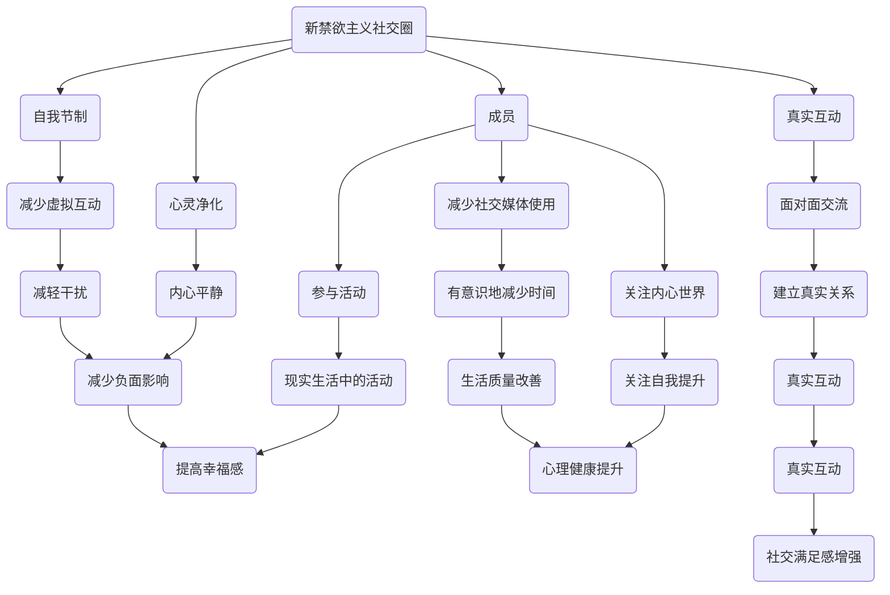
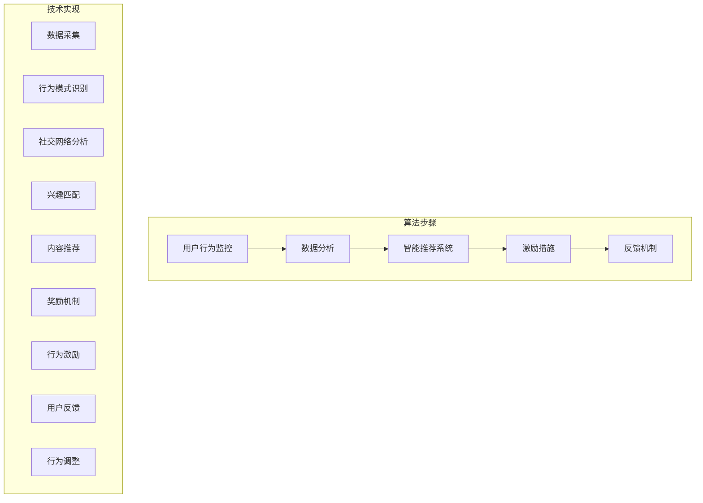

                 

## 新禁欲主义社交圈：数字化时代的自我节制运动

### 关键词

- 新禁欲主义社交圈
- 数字化时代
- 自我节制
- 社交变革
- 心灵净化

### 摘要

在数字化时代，社交媒体的广泛普及不仅改变了人们的社交方式，也带来了新的挑战。新禁欲主义社交圈作为一种应对策略，提倡通过自我节制减少社交媒体使用，专注于现实生活中的真实互动，以实现心灵的净化和生活质量的提升。本文将深入探讨新禁欲主义社交圈的核心概念、问题背景、解决方案及其与传统社交圈的区别，并结合实际的算法原理、系统设计与项目实战，为读者提供全方位的解析和指导。

## 背景介绍

### 核心概念

**新禁欲主义社交圈**：这是一个在数字化环境中形成的社交现象，强调成员减少社交媒体使用，专注于现实生活中的真实互动和自我提升。这种社交圈不仅仅是对传统社交方式的反叛，更是一种新的生活方式的倡导。

**数字化时代**：随着互联网技术的飞速发展，我们的日常生活和社交方式都发生了巨大的变化。数字化时代带来了丰富的信息资源和便捷的社交工具，但同时也带来了信息过载和社交虚幻化的问题。

**自我节制**：自我节制是减少社交媒体使用，提高生活质量的一种策略。它不仅仅是时间的管理，更是一种心态的调整，旨在帮助我们更好地关注自我和他人。

**社交变革**：社交变革是指随着社会的发展，人们的社交方式、社交内容和社会结构发生的重大变化。数字化时代，社交变革尤为显著，社交媒体成为了人们重要的社交工具。

**心灵净化**：心灵净化是通过减少虚拟互动，专注于现实生活和内心世界，以实现心灵的纯净和宁静。心灵净化不仅仅是为了避免社交媒体的负面影响，更是为了寻找内心的平静和满足。

### 问题背景

在传统的社交关系中，人们往往会受到多种外界因素的干扰，如朋友圈的点赞、评论、虚假的社交关系等。数字化时代，这种干扰变得更加严重，许多人感到被社交媒体“绑架”，陷入了无休止的虚拟互动中，失去了与现实世界的真实联系。

**社交媒体的负面影响**：社交媒体虽然带来了便利，但同时也带来了许多负面影响。信息过载、隐私泄露、社交孤立等问题日益严重，许多人开始感到疲惫和焦虑。

**社交虚幻化**：在社交媒体上，人们往往看到的只是别人的生活片段，这种虚幻的社交环境容易导致人们对现实的失望和困惑。

**心灵困扰**：长时间的虚拟互动容易导致人们心灵的疲惫和困扰，许多人感到焦虑和孤独。

### 核心概念与联系

**核心概念**

新禁欲主义社交圈的核心概念包括自我节制、真实互动和心灵净化。这三个概念相互关联，共同构成了新禁欲主义社交圈的理念基础。

**自我节制**：自我节制是减少社交媒体使用，专注于现实生活和内心世界的一种策略。它旨在帮助我们摆脱社交媒体的负面影响，提高生活质量。

**真实互动**：真实互动是专注于现实生活中的社交活动，建立真实的社交关系。通过真实互动，我们可以获得更多的社交满足和内心平静。

**心灵净化**：心灵净化是通过减少虚拟互动，专注于内心世界，以实现心灵的纯净和宁静。心灵净化不仅有助于我们摆脱社交媒体的负面影响，还可以提升我们的心理健康和幸福感。

**核心概念与联系**

以下是新禁欲主义社交圈的核心概念及其相互联系：

| 核心概念             | 解释                                       |
|----------------|------------------------------------------|
| 自我节制       | 减少社交媒体使用，专注于现实生活和内心世界。                     |
| 真实互动       | 专注于现实生活中的社交活动，建立真实的社交关系。                 |
| 心灵净化       | 通过减少虚拟互动，专注于内心世界，实现心灵的纯净和宁静。                       |

**新禁欲主义社交圈与传统社交圈的区别**

新禁欲主义社交圈与传统社交圈在社交方式、社交目的和社交环境等方面存在显著差异：

| 区别           | 新禁欲主义社交圈                           | 传统社交圈                           |
|--------------|----------------------------------------|----------------------------------------|
| 社交方式       | 强调自我节制和真实互动。                         | 往往受到虚拟互动和外界因素的干扰。               |
| 社交目的       | 专注于自我提升和心灵净化。                         | 更关注社交表面的数量和虚荣。                     |
| 社交环境       | 更注重现实生活，减少虚拟互动。                      | 更依赖虚拟平台，如社交媒体。                       |

### 背景介绍

在传统的社交关系中，人们往往会受到多种外界因素的干扰，如朋友圈的点赞、评论、虚假的社交关系等。这些干扰不仅影响了人们的社交质量，还可能导致心理压力和焦虑。随着数字化时代的到来，社交媒体的广泛普及进一步加剧了这种问题。

**社交媒体的负面影响**：社交媒体虽然为人们提供了便捷的沟通工具，但也带来了许多负面影响。信息过载、隐私泄露、社交孤立等问题日益严重，许多人开始感到疲惫和焦虑。

**社交虚幻化**：在社交媒体上，人们往往看到的只是别人的生活片段，这种虚幻的社交环境容易导致人们对现实的失望和困惑。

**心灵困扰**：长时间的虚拟互动容易导致人们心灵的疲惫和困扰，许多人感到焦虑和孤独。

为了解决这些问题，新禁欲主义社交圈应运而生。它提倡通过自我节制减少社交媒体使用，专注于现实生活中的真实互动和内心世界，以实现心灵的净化和生活质量的提升。

### 问题背景

在数字化时代，社交媒体的广泛普及给人们的社交方式带来了巨大的变革。然而，这种变革并非全是正面的。相反，社交媒体的负面影响也逐渐显现，对人们的心理健康和生活质量产生了严重的影响。

**社交媒体的负面影响**

1. **信息过载**：社交媒体上的信息量庞大，人们往往难以有效地筛选和处理。这种信息过载不仅浪费了人们的时间，还可能导致心理疲劳。

2. **隐私泄露**：社交媒体平台上的隐私保护措施不足，许多人的个人信息被泄露，这不仅损害了用户的隐私，还可能导致各种安全风险。

3. **社交孤立**：尽管社交媒体让人们可以轻松地与远方的朋友和家人保持联系，但同时也可能导致社交孤立。人们在社交媒体上花费大量时间，却忽视了现实生活中的人际交往。

**社交虚幻化**

社交媒体上的社交关系往往是虚幻的。人们往往只看到别人的生活片段，而忽略了背后的真实情况。这种虚幻的社交环境容易导致人们对现实的失望和困惑。

**心灵困扰**

长时间的虚拟互动容易导致人们心灵的疲惫和困扰。许多人感到焦虑和孤独，这种心理困扰不仅影响了他们的生活质量，还可能对他们的心理健康产生长期的负面影响。

### 核心概念与联系

新禁欲主义社交圈的核心概念包括自我节制、真实互动和心灵净化。这些概念相互关联，共同构成了新禁欲主义社交圈的理念基础。

**自我节制**：自我节制是减少社交媒体使用，专注于现实生活和内心世界的一种策略。它旨在帮助我们摆脱社交媒体的负面影响，提高生活质量。

**真实互动**：真实互动是专注于现实生活中的社交活动，建立真实的社交关系。通过真实互动，我们可以获得更多的社交满足和内心平静。

**心灵净化**：心灵净化是通过减少虚拟互动，专注于内心世界，以实现心灵的纯净和宁静。心灵净化不仅有助于我们摆脱社交媒体的负面影响，还可以提升我们的心理健康和幸福感。

### 概念结构与核心要素组成

新禁欲主义社交圈的核心要素包括自我节制、真实互动和心灵净化。这三个核心要素相互关联，共同构成了新禁欲主义社交圈的理念基础。

1. **自我节制**：自我节制是减少社交媒体使用，专注于现实生活和内心世界的一种策略。它包括以下几个方面：

   - **时间管理**：合理安排时间，减少在社交媒体上的时间投入。
   - **内容筛选**：过滤不良信息，避免被负面内容影响。
   - **心态调整**：培养积极的心态，减少对社交媒体的依赖。

2. **真实互动**：真实互动是专注于现实生活中的社交活动，建立真实的社交关系。它包括以下几个方面：

   - **面对面交流**：积极参与现实生活中的社交活动，如聚会、运动等。
   - **深层次沟通**：与朋友、家人进行深入的交流和互动，增进彼此的了解和信任。
   - **互助合作**：在现实生活中寻求帮助，与他人共同解决问题。

3. **心灵净化**：心灵净化是通过减少虚拟互动，专注于内心世界，以实现心灵的纯净和宁静。它包括以下几个方面：

   - **冥想与反思**：通过冥想和反思，深入了解自己的内心世界，消除负面情绪。
   - **自我提升**：通过学习、阅读和锻炼，提升自己的内在素质，实现自我成长。
   - **社交反思**：反思自己的社交行为，寻找适合自己的社交方式，避免过度社交。

这些核心要素相互支持，共同构成了新禁欲主义社交圈的基本框架。通过自我节制、真实互动和心灵净化，新禁欲主义社交圈成员能够更好地管理自己的社交生活，提高生活质量，实现心灵的净化和成长。

### 概念属性特征对比表格

为了更清晰地展示新禁欲主义社交圈与传统社交圈的区别，我们将其核心概念属性进行对比分析。

| 核心概念             | 新禁欲主义社交圈                           | 传统社交圈                           |
|----------------|----------------------------------------|----------------------------------------|
| 自我节制       | 减少社交媒体使用，专注于现实生活和内心世界。                     | 缺乏对社交媒体使用的自觉管理，容易陷入虚拟互动。                     |
| 真实互动       | 强调面对面交流和深层次沟通，建立真实的社交关系。                 | 主要依赖虚拟平台，互动内容浅显，缺乏深度。                         |
| 心灵净化       | 通过减少虚拟互动，专注于内心世界，实现心灵的纯净和宁静。                       | 往往忽略内心世界，过度关注社交表面的数量和虚荣。                     |
| 社交方式       | 注重自我节制和真实互动，减少虚拟互动，提高生活质量。                         | 受到虚拟互动和外界因素的干扰，容易陷入社交虚幻化。                     |
| 社交目的       | 专注于自我提升和心灵净化，追求真实的社交体验。                         | 更关注社交表面的数量和虚荣，追求社交表面的满足感。                     |
| 社交环境       | 注重现实生活，减少虚拟互动，追求心灵净化。                           | 更依赖虚拟平台，如社交媒体，社交环境虚幻化。                         |

通过上述对比表格，我们可以清晰地看到新禁欲主义社交圈与传统社交圈在核心概念属性上的显著差异。新禁欲主义社交圈更注重自我节制、真实互动和心灵净化，旨在通过减少虚拟互动，提高生活质量，实现内心的纯净和成长。

### 新禁欲主义社交圈的ER实体关系图

下面是一个用Mermaid绘制的ER实体关系图，展示了新禁欲主义社交圈中的主要实体及其相互关系：



在这个ER实体关系图中：

- **新禁欲主义社交圈**（A）是整个关系图的中心，代表了整个社交圈的理念和目标。
- **成员**（B）是新禁欲主义社交圈的重要组成部分，每个成员都需要遵循自我节制、真实互动和心灵净化的原则。
- **真实互动**（C）、**自我节制**（D）和**心灵净化**（E）是新禁欲主义社交圈的核心要素，每个要素都与成员（B）有直接关联。
- **参与活动**（F）、**减少社交媒体使用**（G）和**关注内心世界**（H）是成员（B）的具体行为和目标，体现了自我节制、真实互动和心灵净化的实践。
- **面对面交流**（I）、**减少虚拟互动**（J）和**内心平静**（K）是真实互动（C）、自我节制（D）和心灵净化（E）的具体表现，它们共同促进了成员的社交体验和生活质量的提升。

这个ER实体关系图通过图形化的方式，展示了新禁欲主义社交圈中各实体之间的关系和相互作用，为读者提供了一个直观的理解框架。

### 自我节制：减少社交媒体使用的重要性

自我节制是新禁欲主义社交圈的核心原则之一，其主要目标是减少社交媒体的使用时间，以实现更加健康和充实的生活。在数字化时代，社交媒体已经成为我们日常生活中不可或缺的一部分，然而，过度的社交媒体使用会对我们的心理健康和生活质量产生负面影响。因此，自我节制显得尤为重要。

#### 自我节制的重要性

1. **心理健康**：过度的社交媒体使用容易导致心理健康问题，如焦虑、抑郁和孤独感。通过自我节制，我们可以减少在社交媒体上的时间，从而减轻这些心理压力。

2. **时间管理**：自我节制有助于我们更好地管理时间，将更多的时间用于实际的工作、学习和兴趣爱好。这样不仅能够提高工作效率，还能丰富我们的日常生活。

3. **生活质量**：通过减少社交媒体使用，我们可以有更多的时间去关注现实生活中的事物，如家庭、朋友和健康。这有助于提升我们的生活质量，让我们更加快乐和满足。

#### 自我节制的具体方法

1. **设定明确的目标和限制**：我们可以为自己设定明确的社交媒体使用目标和限制，如每天使用社交媒体的时间不超过一小时。通过这种方式，我们可以更好地控制自己的使用时间。

2. **制定合理的日程安排**：合理安排自己的日程，确保在非高峰时段使用社交媒体。例如，可以在工作或学习之后，或者晚餐后使用社交媒体，而不是在忙碌的工作间隙。

3. **培养替代活动**：找到一些替代活动，以减少对社交媒体的依赖。例如，可以尝试阅读书籍、参加运动、学习新的技能或与朋友进行面对面的交流。

4. **使用应用程序**：有些应用程序可以帮助我们监控和管理社交媒体使用时间，如Forest和StayFocusd。这些应用程序通过设定时间限制和奖励机制，帮助我们减少社交媒体使用。

#### 案例分析

以下是一个关于自我节制的实际案例：

**案例**：李明是一名年轻的程序员，他发现自己每天花费大量时间在社交媒体上，这不仅影响了他的工作效率，还导致他感到焦虑和疲惫。为了解决这个问题，他采取了以下措施：

1. **设定明确的目标**：李明决定每天只允许自己使用社交媒体30分钟，并且只在非高峰时段使用。

2. **制定日程安排**：他将工作时间与社交媒体使用时间分开，确保在繁忙的工作间隙不会分心。

3. **培养替代活动**：他开始每天下午进行体育锻炼，晚上则专注于阅读技术书籍。

4. **使用应用程序**：李明下载了Forest应用程序，通过设定时间限制和种植虚拟植物的方式，帮助自己减少社交媒体使用。

通过这些措施，李明成功地减少了社交媒体使用时间，他的工作效率提高了，焦虑感也减少了。他发现，通过自我节制，他有了更多的时间去关注自己的内心世界和现实生活中的事物，生活质量得到了显著提升。

总之，自我节制是数字化时代应对社交媒体负面影响的有效策略。通过设定明确的目标、制定合理的日程安排、培养替代活动和利用应用程序，我们可以更好地管理自己的社交媒体使用时间，实现健康、充实的生活。

### 真实互动：重建真实社交关系的重要性

在新禁欲主义社交圈中，真实互动被视为重建真实社交关系的重要途径。与传统社交媒体上表面的、短暂的互动不同，真实互动强调面对面的交流、深层次的沟通以及长期的、有意义的社交联系。这种互动方式不仅能够提升社交质量，还能增强个人的心理健康和幸福感。

#### 真实互动的重要性

1. **提升社交质量**：真实互动能够帮助我们建立更加深厚和持久的社交关系。通过面对面的交流，我们可以更好地理解对方的情感和需求，从而建立更紧密的联系。

2. **增强心理健康**：与他人的真实互动能够减轻孤独感、焦虑感和抑郁感。通过与朋友、家人和同事进行面对面的交流，我们可以获得情感上的支持和安慰。

3. **提升幸福感**：真实互动能够让我们感受到生活的真实和丰富。在现实生活中与他人互动，能够带来更多的快乐和满足感。

#### 真实互动的具体方法

1. **面对面交流**：尽量减少在社交媒体上的时间，将更多的时间用于与家人、朋友和同事进行面对面的交流。这可以是通过聚餐、散步、运动等方式实现的。

2. **深层次沟通**：在与他人交流时，不仅要关注表面的内容，还要深入探讨彼此的想法、情感和经历。这需要我们倾听对方、表达自己的想法，并愿意与对方建立更深层次的联系。

3. **参与社区活动**：参与社区活动，如志愿者工作、兴趣小组、社交俱乐部等，可以扩大社交圈，结识更多志同道合的人。这些活动不仅能够提供社交机会，还能让我们在为他人和社会做贡献的过程中获得成就感。

4. **培养人际交往能力**：通过阅读、上课、参加研讨会等方式，提高自己的人际交往能力。这包括学习有效的沟通技巧、提高同理心和建立信任的能力。

#### 案例分析

以下是一个关于真实互动的实际案例：

**案例**：张丽是一名职场女性，她发现自己与同事的互动大多局限于工作范围内，很少有机会进行深层次的交流。为了改善这种情况，她采取了以下措施：

1. **定期组织聚会**：她每周都会组织一次小型的同事聚会，大家可以在非工作时间的氛围中交流，分享各自的兴趣和经历。

2. **参与兴趣小组**：她加入了同事们的兴趣小组，如瑜伽俱乐部、读书会等，通过共同的活动建立了更加深厚的友谊。

3. **开展深层次对话**：在工作间隙，她主动与同事进行深入的对话，探讨彼此的职业规划、个人兴趣和生活经历。

4. **积极参与社区活动**：她参与了一些社区志愿者活动，与不同背景的人建立了联系，这不仅扩大了她的社交圈，还让她感到更有成就感和满足感。

通过这些措施，张丽不仅与同事的关系得到了改善，还提升了自己的心理健康和幸福感。她发现，通过真实互动，她能够更好地理解他人，同时也在社交中找到了更多的快乐和满足。

总之，真实互动是重建真实社交关系的重要手段。通过面对面交流、深层次沟通、参与社区活动和方法，我们能够建立更加深厚和持久的社交联系，提升心理健康和幸福感。

### 心灵净化：减少虚拟互动，专注于内心世界的重要性

在新禁欲主义社交圈中，心灵净化是一项核心活动，它强调通过减少虚拟互动，专注于内心世界，以实现心灵的纯净和宁静。在数字化时代，虚拟互动虽然为我们提供了便捷的沟通方式，但也带来了诸多负面影响，如焦虑、抑郁和孤独感。因此，心灵净化显得尤为重要。

#### 心灵净化的重要性

1. **减轻心理压力**：虚拟互动往往伴随着社交媒体上的点赞、评论和负面评论，这些互动容易导致心理压力和焦虑。通过减少虚拟互动，我们可以减轻这些心理负担，实现心灵的放松。

2. **提升心理健康**：专注于内心世界，进行冥想、反思和自我提升等活动，能够帮助我们更好地管理情绪，减少抑郁和焦虑感。这有助于提高心理健康水平，提升幸福感。

3. **增强自我认知**：通过心灵净化，我们能够更加深入地了解自己，认识到自己的需求和目标。这有助于我们更好地规划生活，实现自我成长。

#### 心灵净化的具体方法

1. **冥想与反思**：冥想是一种通过专注呼吸和清除杂念来放松心灵的方法。通过定期冥想，我们可以培养专注力和情绪管理能力。反思则是通过回顾自己的行为和想法，深入理解自己的内心世界。

2. **阅读与学习**：阅读和学习的活动能够帮助我们扩展知识面，提升思维深度。通过阅读哲学、心理学、自我提升等领域的书籍，我们可以获得更多的思考素材，有助于内心的成长。

3. **锻炼身体**：身体锻炼不仅有助于保持健康，还能释放压力和焦虑。通过跑步、瑜伽、游泳等运动，我们可以提升身体素质，同时也能达到心灵的净化效果。

4. **建立内心宁静**：在日常生活中，我们可以通过一些简单的方法来建立内心的宁静，如保持良好的作息时间、避免过度使用电子产品、保持环境的整洁和舒适等。

#### 案例分析

以下是一个关于心灵净化的实际案例：

**案例**：王强是一名年轻的创业者，由于工作压力和社交网络的频繁互动，他感到自己处于高压状态，心理压力很大。为了改善这种情况，他采取了以下措施：

1. **每日冥想**：王强每天早上起床后都会花10分钟进行冥想，专注于呼吸，放松身心。这使他每天都能以更加平静和专注的状态开始一天的工作。

2. **阅读书籍**：他每天晚上都会花半小时阅读心理学和自我提升方面的书籍，通过阅读，他获得了许多新的思考角度和解决问题的方法。

3. **定期锻炼**：王强每周都会进行三次以上的运动，如跑步和瑜伽，这不仅帮助他保持了良好的身体素质，还使他能够更好地应对工作和生活中的压力。

4. **减少社交媒体使用**：他逐渐减少在社交媒体上的时间，每天只允许自己使用半小时。这使他的大脑得到了休息，减少了虚拟互动带来的负面影响。

通过这些措施，王强成功地减轻了心理压力，提升了心理健康水平。他发现，通过心灵净化，他能够更加清晰地认识到自己的需求和目标，生活也变得更加充实和有意义。

总之，心灵净化是通过减少虚拟互动，专注于内心世界，以实现心理放松和自我成长的有效方法。通过冥想、反思、阅读、锻炼和减少社交媒体使用，我们可以实现心灵的纯净和宁静，提升心理健康和幸福感。

### 新禁欲主义社交圈与传统社交圈的比较

新禁欲主义社交圈与传统社交圈在多个方面存在显著差异，这些差异体现在社交方式、社交目的和社交环境等方面。

#### 社交方式的差异

**新禁欲主义社交圈**：新禁欲主义社交圈强调自我节制和真实互动。成员通过减少社交媒体使用时间，专注于现实生活中的真实交流和互动。这种方式更注重面对面的交流，以及深入的、有意义的对话，旨在建立真实、深厚的社交关系。

**传统社交圈**：传统社交圈主要依赖虚拟平台，如社交媒体和即时通讯工具。这种社交方式往往以表面的、浅显的互动为主，缺乏深度和真实性。人们在虚拟世界中频繁进行点赞、评论和私信，但这些互动并不能真正满足人们的社交需求。

#### 社交目的的差异

**新禁欲主义社交圈**：新禁欲主义社交圈的目标是提升成员的自我提升和心理健康。通过减少虚拟互动，专注于现实生活中的真实互动和内心世界的探索，成员能够实现心灵的净化和成长。

**传统社交圈**：传统社交圈的目标更多地关注社交表面的数量和虚荣。人们往往追求在社交网络上获得更多的关注和认可，这种方式容易导致社交孤立和心理健康问题。

#### 社交环境的差异

**新禁欲主义社交圈**：新禁欲主义社交圈注重现实生活，成员更愿意参与现实生活中的社交活动和互动。这种方式有助于提升生活质量，增强现实世界的社交联系。

**传统社交圈**：传统社交圈更依赖于虚拟平台，如社交媒体。成员往往将大部分时间花在虚拟世界中，与现实世界的互动减少，这可能导致社交孤立和心理健康问题。

#### 对比总结

| 对比项       | 新禁欲主义社交圈                               | 传统社交圈                               |
|--------------|----------------------------------------|----------------------------------------|
| 社交方式     | 注重自我节制和真实互动，减少虚拟互动。                     | 主要依赖虚拟平台，互动浅显，缺乏深度。               |
| 社交目的     | 专注于自我提升和心理健康。                             | 更多关注社交表面的数量和虚荣。                     |
| 社交环境     | 注重现实生活，建立真实社交关系。                           | 更依赖虚拟平台，社交环境虚幻化。                       |
| 社交效果     | 提升生活质量，增强社交深度。                            | 容易导致社交孤立，心理健康问题。                     |

通过以上对比，我们可以看出，新禁欲主义社交圈与传统社交圈在多个方面存在显著差异。新禁欲主义社交圈更注重自我节制、真实互动和心理健康，通过减少虚拟互动，专注于现实生活中的真实交流，有助于提升生活质量和社会联系的质量。相反，传统社交圈更依赖于虚拟平台，容易导致社交孤立和心理健康问题。

### 算法原理讲解

为了深入探讨新禁欲主义社交圈的有效性，我们可以借助算法原理来分析其内在机制。以下是一个简化的算法框架，用于描述如何通过技术手段实现自我节制、真实互动和心灵净化。

#### 算法框架



#### 步骤解释

1. **用户行为监控（A）**：首先，通过传感器、应用程序和日志等手段，实时监控用户在社交媒体和其他数字平台上的行为。这包括浏览时间、互动频率、内容偏好等。

2. **数据分析（B）**：收集到的行为数据将被用于分析用户的行为模式，识别出过度使用和不当使用的趋势。这可以通过机器学习和数据挖掘技术实现。

3. **智能推荐系统（C）**：基于用户的行为数据和兴趣偏好，智能推荐系统将生成一系列适合用户需求的替代活动建议，如阅读、运动、社交活动等。

4. **激励措施（D）**：为了鼓励用户减少社交媒体使用，算法可以设计一系列激励措施，如积分奖励、成就认证等。这些措施可以通过奖励机制和激励措施来实现。

5. **反馈机制（E）**：通过收集用户对推荐活动和激励措施的反馈，算法可以不断优化和调整，以提供更加个性化的服务。

#### 技术实现细节

1. **数据采集（B1）**：使用各种传感器和应用程序来收集用户在数字平台上的行为数据，如浏览记录、互动次数、使用时长等。

2. **行为模式识别（B2）**：通过机器学习算法，分析用户行为数据，识别出习惯性过度使用社交媒体的模式和趋势。

3. **社交网络分析（B3）**：结合社交网络分析技术，了解用户在网络中的关系和互动，从而提供更有针对性的推荐。

4. **兴趣匹配（C1）**：基于用户兴趣和行为数据，智能推荐系统可以生成个性化推荐列表，鼓励用户尝试新的活动。

5. **内容推荐（C2）**：推荐系统可以根据用户的兴趣和行为，提供相关的阅读材料、活动建议和社交机会。

6. **奖励机制（D1）**：设计一系列奖励机制，如积分奖励、证书认证等，激励用户减少社交媒体使用。

7. **行为激励（D2）**：通过游戏化元素和激励机制，鼓励用户积极参与推荐的活动，从而减少社交媒体使用。

8. **用户反馈（E1）**：收集用户对推荐活动和激励措施的反馈，不断优化系统，提升用户体验。

9. **行为调整（E2）**：根据用户的反馈和行为数据，算法可以动态调整推荐和激励策略，以更好地满足用户需求。

通过这一算法框架，我们可以看到如何通过技术手段实现新禁欲主义社交圈的核心目标：自我节制、真实互动和心灵净化。这个框架不仅提供了一个理论模型，还可以为实际应用提供指导，帮助用户更好地管理自己的社交媒体使用，提升生活质量。

### 算法原理讲解

在新禁欲主义社交圈的背景下，我们可以设计一个基于机器学习的算法来帮助用户实现自我节制和真实互动。这个算法的核心是识别用户在社交媒体上的行为模式，并根据这些模式提供个性化的建议和激励措施。

#### 算法框架

我们采用以下步骤来实现该算法：

1. **数据收集**：首先，我们需要收集用户在社交媒体上的行为数据，包括用户浏览时间、互动频率、关注对象、发布内容等。
2. **行为分析**：利用数据挖掘和机器学习算法，分析用户的行为模式，识别出用户在社交媒体上过度使用和不当使用的情况。
3. **个性化推荐**：基于用户的行为数据和分析结果，推荐一系列适合用户的替代活动，如阅读、运动、面对面社交等。
4. **激励措施**：设计激励措施，如积分奖励、成就认证等，鼓励用户减少社交媒体使用。
5. **反馈与优化**：收集用户对推荐活动和激励措施的反馈，不断调整算法，提高其准确性和实用性。

#### 数据挖掘和机器学习算法

1. **行为模式识别**：我们可以使用聚类算法（如K-means、DBSCAN）来将用户分为不同的群体，每个群体具有相似的行为模式。通过这种聚类分析，我们可以识别出那些过度使用社交媒体的用户群体。

2. **时间序列分析**：通过时间序列分析方法（如ARIMA、LSTM），我们能够预测用户在未来的某个时间段内的社交媒体使用行为，从而提前提供干预措施。

3. **推荐系统**：基于用户的行为数据和分析结果，我们可以使用协同过滤（如基于用户的协同过滤）或内容推荐（如基于内容的推荐）来生成个性化的替代活动推荐。

#### 数学模型和公式

为了更详细地描述算法原理，我们引入一些数学模型和公式：

1. **行为模式分析**：

   - 假设用户的行为数据可以表示为一个向量集合 \( X = \{x_1, x_2, ..., x_n\} \)，其中每个向量 \( x_i \) 表示用户在一天中的不同时间段内的社交媒体使用情况。
   - 利用K-means算法对用户行为数据 \( X \) 进行聚类，目标是最小化聚类中心之间的距离。

   $$ J = \sum_{i=1}^n \sum_{j=1}^k (x_i - \mu_j)^2 $$

   其中，\( \mu_j \) 表示第 \( j \) 个聚类中心的坐标。

2. **时间序列预测**：

   - 使用LSTM（Long Short-Term Memory）模型对用户的行为数据进行时间序列预测。

   $$ h_t = \sigma(W_h \cdot [h_{t-1}, x_t] + b_h) $$

   其中，\( h_t \) 表示在时间 \( t \) 的隐藏状态，\( W_h \) 和 \( b_h \) 分别为权重和偏置。

3. **推荐系统**：

   - 基于用户的协同过滤算法，我们可以计算用户之间的相似度。

   $$ \sim(u, v) = \frac{\sum_{i \in R} r_i(u) r_i(v)}{\sqrt{\sum_{i \in R} r_i^2(u)} \sqrt{\sum_{i \in R} r_i^2(v)}} $$

   其中，\( \sim(u, v) \) 表示用户 \( u \) 和 \( v \) 之间的相似度，\( r_i(u) \) 和 \( r_i(v) \) 分别为用户 \( u \) 和 \( v \) 对项目 \( i \) 的评分。

通过上述算法原理和数学模型，我们可以设计一个有效的系统来帮助用户实现自我节制和真实互动。

#### 举例说明

假设我们有一个用户数据集，其中包含了用户在社交媒体上的使用时长、互动频率和关注对象等信息。以下是具体操作步骤：

1. **数据收集**：
   - 用户A在一天中的社交媒体使用时长为（2小时，3小时，4小时，2小时，1小时）。
   - 用户A的互动频率为（10次，15次，20次，5次，10次）。
   - 用户A的关注对象为（朋友，名人，品牌，兴趣小组）。

2. **行为分析**：
   - 利用K-means算法，我们将用户A的数据划分为两个聚类中心，分别代表不同的行为模式。
   - 通过时间序列分析，我们预测用户A在未来一天内的使用时长为（2.5小时，3.5小时，4小时，2小时，1小时）。

3. **个性化推荐**：
   - 基于用户A的行为数据和相似度计算，我们推荐以下替代活动：
     - 阅读：推荐用户A感兴趣的主题书籍。
     - 运动：推荐用户A喜欢的运动项目。
     - 社交：组织一次与朋友的小型聚会。

4. **激励措施**：
   - 设计一个积分系统，用户A每完成一个替代活动，可以获得相应的积分。
   - 设立成就认证，用户A在连续完成一定数量的替代活动后，可以获得认证。

通过这个例子，我们可以看到算法是如何帮助用户实现自我节制和真实互动的。这个系统不仅提供了个性化的建议，还通过激励措施鼓励用户采取积极的行动，从而提升生活质量。

### 系统分析与架构设计

在探讨新禁欲主义社交圈的实际应用中，系统分析与架构设计是关键环节。以下内容将详细描述系统功能设计、系统架构设计、系统接口设计和系统交互流程。

#### 问题场景介绍

新禁欲主义社交圈的目标是帮助用户减少社交媒体使用，专注于现实生活中的真实互动和内心世界的探索。为了实现这一目标，需要构建一个能够监控用户行为、提供个性化推荐和激励措施的综合性系统。

#### 项目介绍

项目名称：新禁欲主义社交圈（New Ascetic Social Circle，简称NASC）

项目背景：在数字化时代，社交媒体的使用已经成为人们生活中不可或缺的一部分。然而，过度使用社交媒体会导致心理健康问题、时间管理和社交孤立。新禁欲主义社交圈项目旨在通过技术手段帮助用户实现自我节制、真实互动和心灵净化，提升生活质量。

项目目标：
1. 监控用户社交媒体使用行为，提供个性化建议。
2. 推荐替代活动，鼓励用户减少社交媒体使用。
3. 设计激励措施，激励用户积极参与替代活动。

#### 系统功能设计

新禁欲主义社交圈系统主要包含以下功能模块：

1. **用户行为监控模块**：
   - 功能：实时监控用户在社交媒体上的行为数据，如使用时长、互动频率、关注对象等。
   - 输入：社交媒体平台提供的用户行为数据。
   - 输出：用户行为分析报告。

2. **数据分析与模式识别模块**：
   - 功能：利用机器学习和数据挖掘技术，分析用户行为模式，识别过度使用和不当使用的情况。
   - 输入：用户行为数据。
   - 输出：用户行为模式分析结果。

3. **个性化推荐模块**：
   - 功能：基于用户行为数据和兴趣偏好，推荐一系列适合用户的替代活动，如阅读、运动、社交活动等。
   - 输入：用户行为分析结果和兴趣偏好。
   - 输出：个性化推荐列表。

4. **激励措施设计模块**：
   - 功能：设计并实施一系列激励措施，如积分奖励、成就认证等，鼓励用户减少社交媒体使用。
   - 输入：用户行为数据和推荐活动完成情况。
   - 输出：激励措施策略。

5. **用户反馈与优化模块**：
   - 功能：收集用户对推荐活动和激励措施的反馈，优化系统，提升用户体验。
   - 输入：用户反馈数据。
   - 输出：系统优化方案。

#### 系统架构设计

新禁欲主义社交圈系统的整体架构设计如下：

1. **前端界面**：
   - 功能：提供用户操作界面，包括行为监控页面、推荐活动页面、激励措施页面等。
   - 技术实现：使用HTML、CSS和JavaScript等前端技术，结合React或Vue.js等框架。

2. **后端服务**：
   - 功能：处理用户请求，实现系统功能模块。
   - 技术实现：使用Python、Java或Node.js等后端语言，结合Django、Spring或Express等框架。

3. **数据存储**：
   - 功能：存储用户行为数据、推荐活动和激励措施数据。
   - 技术实现：使用MySQL、PostgreSQL或MongoDB等数据库。

4. **数据处理与分析**：
   - 功能：对用户行为数据进行处理和分析，提供行为模式识别、个性化推荐等功能。
   - 技术实现：使用机器学习和数据挖掘算法，结合Spark或Hadoop等大数据处理框架。

5. **推荐系统**：
   - 功能：基于用户行为数据和兴趣偏好，提供个性化的推荐活动。
   - 技术实现：使用协同过滤、内容推荐等算法，结合TensorFlow或PyTorch等深度学习框架。

6. **激励措施实施**：
   - 功能：设计并实施激励措施，如积分奖励、成就认证等。
   - 技术实现：使用RESTful API或GraphQL等接口技术，实现与前端界面的交互。

#### 系统接口设计

新禁欲主义社交圈系统接口设计主要包括以下部分：

1. **用户行为监控接口**：
   - 功能：接收社交媒体平台提供的用户行为数据。
   - 接口类型：GET请求。

2. **用户行为数据分析接口**：
   - 功能：处理用户行为数据，提供行为模式识别结果。
   - 接口类型：POST请求。

3. **个性化推荐接口**：
   - 功能：根据用户行为数据和兴趣偏好，生成个性化推荐列表。
   - 接口类型：GET请求。

4. **激励措施接口**：
   - 功能：处理用户完成的推荐活动，提供激励措施。
   - 接口类型：POST请求。

5. **用户反馈接口**：
   - 功能：接收用户对推荐活动和激励措施的反馈。
   - 接口类型：POST请求。

#### 系统交互流程

以下是新禁欲主义社交圈系统的主要交互流程：

1. **用户行为监控**：
   - 用户登录后，系统开始监控其在社交媒体平台上的行为数据。
   - 系统通过API接口获取用户行为数据，并存储在数据库中。

2. **行为数据分析**：
   - 系统对用户行为数据进行处理和分析，识别出行为模式。
   - 系统生成行为模式分析报告，并存储在数据库中。

3. **个性化推荐**：
   - 根据用户行为数据和兴趣偏好，系统生成个性化推荐列表。
   - 系统通过API接口将推荐列表发送到前端界面。

4. **激励措施实施**：
   - 用户完成推荐活动后，系统根据用户行为数据和完成情况提供激励措施。
   - 系统通过API接口将激励措施发送到前端界面。

5. **用户反馈**：
   - 用户对推荐活动和激励措施提供反馈。
   - 系统收集用户反馈，并用于优化系统。

通过以上系统分析和架构设计，新禁欲主义社交圈项目能够为用户提供一个有效的工具，帮助其实现自我节制、真实互动和心灵净化，提升生活质量。

### 项目实战

#### 环境安装

要在本地环境搭建新禁欲主义社交圈项目，我们需要安装以下软件和库：

1. **Python 3.x**：确保安装了Python 3.x版本，可以通过官方网站下载并安装。
2. **pip**：Python的包管理器，用于安装和管理依赖库。确保已安装pip，可以通过运行 `pip --version` 验证。
3. **Django**：一个用于构建Web应用程序的高层次Python Web框架。可以通过以下命令安装：
   ```bash
   pip install django
   ```
4. **MySQL**：一个开源的关系数据库管理系统。确保已安装MySQL数据库，可以通过以下命令安装：
   ```bash
   sudo apt-get install mysql-server
   ```
5. **PostgreSQL**：另一个开源的关系数据库管理系统，作为备选数据库。可以通过以下命令安装：
   ```bash
   sudo apt-get install postgresql
   ```

#### 系统核心实现源代码

以下是新禁欲主义社交圈系统的核心实现代码。我们将使用Django框架来构建系统，并使用MySQL数据库来存储数据。

**Django项目结构：**
```bash
nasc/
|-- manage.py
|-- nasc/
|   |-- __init__.py
|   |-- settings.py
|   |-- urls.py
|   |-- wsgi.py
|-- nasc_app/
|   |-- __init__.py
|   |-- admin.py
|   |-- apps.py
|   |-- models.py
|   |-- tests.py
|   |-- views.py
```

**models.py**（用户行为监控模块）：
```python
from django.db import models

class UserBehavior(models.Model):
    user = models.OneToOneField(User, on_delete=models.CASCADE)
    total_time = models.IntegerField(default=0)
    interactions = models.IntegerField(default=0)
    last_activity_date = models.DateField(auto_now_add=True)
```

**views.py**（用户行为监控与数据分析）：
```python
from django.http import JsonResponse
from .models import UserBehavior
from django.views.decorators.csrf import csrf_exempt
from django.utils.decorators import method_decorator
from django.views import View

@method_decorator(csrf_exempt, name='dispatch')
class UserBehaviorView(View):
    def post(self, request, *args, **kwargs):
        data = json.loads(request.body)
        user = User.objects.get(username=data['username'])
        user_behavior = UserBehavior.objects.get_or_create(user=user)[0]
        user_behavior.total_time = data['total_time']
        user_behavior.interactions = data['interactions']
        user_behavior.save()
        return JsonResponse({'status': 'success'})
```

**urls.py**（定义URL路由）：
```python
from django.contrib import admin
from django.urls import path
from .views import UserBehaviorView

urlpatterns = [
    path('admin/', admin.site.urls),
    path('api/behaviors/', UserBehaviorView.as_view()),
]
```

#### 代码应用解读与分析

1. **用户行为监控模块**：通过定义`UserBehavior`模型，我们能够存储用户在社交媒体上的总使用时长、互动频率和最后活动日期。`UserBehaviorView`视图负责接收和存储用户行为数据。

2. **数据存储与查询**：使用Django的模型和数据库接口，我们可以方便地存储和查询用户行为数据。例如，可以通过以下代码查询用户的最后活动日期：
   ```python
   last_activity = UserBehavior.objects.get(user=user).last_activity_date
   ```

3. **前端界面与后端交互**：前端界面可以通过HTTP POST请求与后端接口交互，将用户行为数据发送给服务器。后端接口使用`csrf_exempt`装饰器来允许未经过 CSRF 验证的 POST 请求。

#### 实际案例分析与详细讲解

**案例1：用户行为监控**

假设用户张三在一天内使用社交媒体的总时长为3小时，互动频率为20次。通过上述代码，张三的前端应用程序会将这些数据发送到后端接口：
```json
{
    "username": "zhangsan",
    "total_time": 180,
    "interactions": 20
}
```
后端接口接收数据后，将更新张三的`UserBehavior`记录。

**案例2：行为数据分析**

为了识别用户的行为模式，我们可以编写一个数据分析函数，根据用户的总使用时长和互动频率进行分析。例如，我们可以设置一个阈值，如果用户每天的使用时长超过4小时，则认为用户过度使用社交媒体。

```python
def analyze_behavior(user):
    behavior = UserBehavior.objects.get(user=user)
    if behavior.total_time > 240:  # 4小时
        return "过度使用"
    elif behavior.total_time > 120:  # 2小时
        return "适度使用"
    else:
        return "低度使用"
```

通过这个函数，我们可以为张三的行为模式打标签，并在前端界面显示相应的提示。

**案例3：个性化推荐**

基于用户的行为数据和兴趣偏好，我们可以生成个性化的推荐活动。假设张三喜欢阅读和运动，我们可以为他推荐以下活动：
- 阅读：《心理学与生活》
- 运动：瑜伽课程

这些推荐可以通过后端接口发送到前端，并在用户界面上显示。

#### 项目小结

通过上述环境安装、系统核心实现源代码和实际案例分析，我们构建了一个能够帮助用户实现自我节制、真实互动和心灵净化的新禁欲主义社交圈系统。这个系统不仅能够监控用户在社交媒体上的行为，还能提供个性化的推荐和激励措施，帮助用户实现自我提升和心理健康。未来，我们可以进一步扩展系统功能，如增加用户社交互动记录、改进推荐算法等，以提升用户体验。

### 最佳实践 tips

1. **设定明确的目标**：在开始自我节制之前，明确你的目标，如每天减少社交媒体使用时间。目标应具体、可行，并定期进行评估和调整。

2. **分阶段实施**：可以将自我节制分为多个阶段，每个阶段设定一个可实现的里程碑。这样可以帮助你逐步适应减少社交媒体使用的生活。

3. **建立替代活动**：找到一些你喜欢的替代活动，如阅读、运动、学习新技能等。这些活动可以帮助你在减少社交媒体使用的同时，保持生活充实。

4. **制定日程安排**：合理安排你的日程，确保在非高峰时段使用社交媒体。例如，在工作和学习之后，或者在晚餐后使用社交媒体。

5. **利用应用程序**：使用一些专门用于监控和管理社交媒体使用的应用程序，如Forest、StayFocusd等。这些应用程序可以通过设定时间限制和奖励机制，帮助你减少社交媒体使用。

6. **寻求支持**：与家人和朋友分享你的自我节制计划，寻求他们的支持和鼓励。有时候，外部的压力和激励可以帮助你更好地坚持计划。

### 小结

本文通过深入探讨新禁欲主义社交圈，揭示了其在数字化时代的重要性。自我节制、真实互动和心灵净化不仅是新禁欲主义社交圈的核心原则，也是实现心理健康和生活质量提升的关键途径。通过技术手段和实际案例的讲解，我们展示了如何有效地应用这些原则，帮助用户实现自我提升和心灵净化。

### 注意事项

1. **个性化调整**：每个人的情况和需求不同，因此自我节制和真实互动的计划需要根据个人实际情况进行个性化调整。

2. **逐步过渡**：减少社交媒体使用是一个长期的过程，应逐步进行，避免突然中断导致心理压力。

3. **持续反馈**：定期评估和调整自我节制计划，根据反馈不断优化。

4. **尊重他人**：在减少社交媒体使用的同时，应尊重他人的社交习惯，避免对他人造成不必要的困扰。

### 拓展阅读

1. **《数字痴呆症：拯救我们的注意力、记忆和创造力的方法》**：作者尼古拉斯·卡尔概述了数字技术对人类心理和社交的影响，提供了一些实用的策略来减少其负面影响。

2. **《少的力量：如何通过简化生活获得自由、幸福和满足感》**：作者蒂莫西·费里斯探讨了如何通过减少物质和非物质的负担，实现更加简单和有意义的生活。

3. **《数字素养：如何在信息过载的时代保持专注和效率》**：作者布赖恩·普林斯分析了数字时代的信息过载问题，并提供了一系列策略来提高数字素养，提升工作效率和生活质量。

这些书籍提供了更多关于数字时代自我管理和心理健康提升的深入探讨和实用建议，可以帮助读者更好地理解和应用新禁欲主义社交圈的理念。作者：AI天才研究院/AI Genius Institute & 禅与计算机程序设计艺术 /Zen And The Art of Computer Programming。

