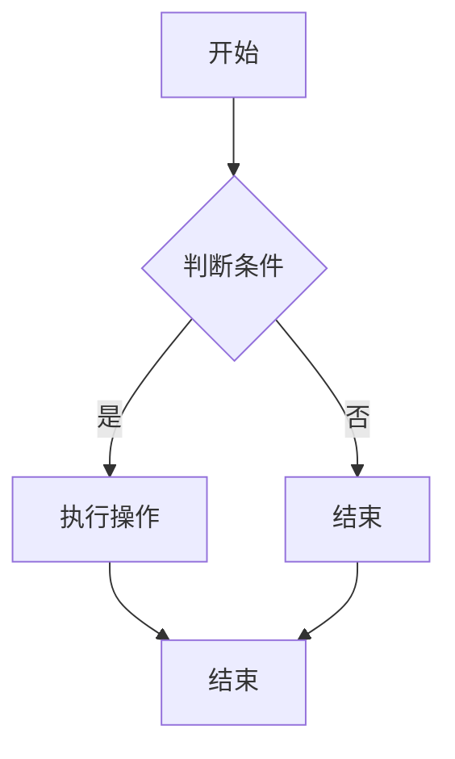

                 

# 新禁欲主义运动：数字化时代的自我节制

> 关键词：新禁欲主义、数字化、心理健康、自我节制、生活方式

> 摘要：在数字化时代，信息过载、社交媒体成瘾以及数字化依赖成为普遍现象，对个体心理和社交生活带来了诸多负面影响。新禁欲主义运动应运而生，提倡通过自我节制来应对数字化时代的挑战，寻求心理健康和数字化生活方式的平衡。本文将从数字化时代的社会与心理背景出发，深入探讨新禁欲主义运动的兴起、核心思想与实践方法，分析其在教育、工作与职业发展等领域的应用，并展望其未来的发展方向。最后，本文将总结新禁欲主义运动的意义，并探讨数字化时代下个人的选择。

## 第一部分：数字化时代的社会与心理背景

### 第1章：数字化时代的到来与新禁欲主义运动

#### 1.1 数字化时代的特征

**1.1.1 互联网普及与信息爆炸**

互联网的普及是数字化时代最显著的标志之一。据国际电信联盟（ITU）统计，截至2021年，全球互联网用户已达到46亿，占全球总人口的61%。互联网的普及使得人们能够随时随地获取海量的信息资源，极大地丰富了知识的传播和共享方式。

然而，互联网的普及也带来了信息爆炸的问题。在信息爆炸的时代，人们面临着海量的信息选择，往往难以筛选出对自己真正有价值的内容。这种现象被称为“信息过载”，它可能导致个体的焦虑和压力增加。

**1.1.2 移动设备的普及**

随着智能手机和便携式电子设备的普及，人们可以随时随地进行网络连接和信息交流。移动设备的普及不仅改变了人们的通信方式，也改变了人们的生活方式和工作方式。

移动设备的高便携性和即时通讯功能，使得个体更加依赖数字化工具，如社交媒体、即时通讯软件、电子邮件等，进行日常社交和任务管理。这种依赖性在一定程度上加剧了数字化依赖的问题。

**1.1.3 社交媒体的影响**

社交媒体的兴起是数字化时代的重要特征之一。社交媒体平台如Facebook、Twitter、Instagram等，已经成为人们日常生活的一部分。它们不仅改变了人们的社交模式，也对个体的心理健康产生了深远影响。

社交媒体的正面影响包括：增强了社交联系，提供了分享和表达自我的平台，以及促进了信息的快速传播。然而，社交媒体的负面影响也不容忽视，如社交媒体成瘾、网络欺凌、信息不准确等。

#### 1.2 新禁欲主义运动的兴起

**1.2.1 运动的背景**

新禁欲主义运动（Digital Puritanism）的兴起，是对数字化时代带来的一系列挑战的回应。随着数字化技术的发展，人们开始意识到，过度依赖数字化工具和社交媒体可能对心理健康和社交生活产生负面影响。

新禁欲主义运动的背景包括以下几个方面：

1. **心理健康问题**：研究表明，数字化依赖与一系列心理健康问题有关，如焦虑、抑郁、社交回避等。
2. **社交媒体成瘾**：大量年轻人沉迷于社交媒体，导致社交时间减少，现实生活中的人际关系疏远。
3. **信息过载**：人们在互联网上接触的信息量巨大，难以有效筛选和处理，导致压力增加。

**1.2.2 运动的核心思想**

新禁欲主义运动的核心思想是通过自我节制来应对数字化时代的挑战。它提倡减少对数字化工具和社交媒体的依赖，回归到更为简单和健康的生活方式。

新禁欲主义运动的核心思想包括：

1. **数字节食**：通过减少每天使用数字化工具的时间来减少数字化依赖。
2. **简化生活**：通过减少物质和信息的负担，减少压力和焦虑。
3. **心理调节**：通过冥想、运动等方式来提高心理健康水平。

**1.2.3 运动的主要代表人物**

新禁欲主义运动并没有一个统一的组织或代表人物，但有一些知名的思想家和活动家在这一领域做出了显著贡献。例如：

1. **Cal Newport**：他在《深度工作》（Deep Work）一书中，提倡减少数字化干扰，专注于高价值的工作。
2. **Nicholas Carr**：他在《浅薄》（The Shallows）一书中，探讨了数字化技术对个体注意力和认知能力的影响。
3. **Tim Ferriss**：他在《每周工作4小时》（The 4-Hour Workweek）一书中，提出了一些减少工作时间，提高工作效率的策略。

### 第2章：数字化对个体心理的影响

#### 2.1 数字化依赖与心理健康

**2.1.1 数字化依赖的定义与现象**

数字化依赖（Digital Dependence）是指个体对数字化工具和社交媒体的过度依赖，这种依赖可能导致一系列心理健康问题。

数字化依赖的现象包括：

1. **社交媒体成瘾**：个体在社交媒体上花费大量时间，影响日常生活中的其他活动。
2. **电子邮件成瘾**：个体对电子邮件的过度关注，导致工作效率下降和焦虑感增加。
3. **游戏成瘾**：个体在电子游戏中花费大量时间，影响学习、工作和社交生活。

**2.1.2 数字化依赖对心理健康的影响**

数字化依赖对心理健康的影响是多方面的。研究表明，数字化依赖可能导致以下问题：

1. **焦虑和抑郁**：数字化依赖可能增加个体的焦虑和抑郁症状。
2. **社交回避**：个体可能因为过度依赖数字化工具而减少现实生活中的人际交往。
3. **睡眠障碍**：数字化设备的使用，特别是夜间，可能影响个体的睡眠质量。

**2.1.3 预防数字化依赖的策略**

为了预防数字化依赖，可以采取以下策略：

1. **设定时间限制**：为每天使用数字化工具设定时间限制，减少过度使用。
2. **培养替代活动**：鼓励个体培养其他兴趣和爱好，减少对数字化工具的依赖。
3. **心理调节**：通过冥想、运动等方式来提高心理健康水平，减轻数字化依赖带来的负面影响。

#### 2.2 数字化时代的自我感知

**2.2.1 数字化时代下的自我形象**

在数字化时代，个体的自我形象受到数字化工具和社交媒体的影响。个体在社交媒体上塑造的形象可能与其现实生活中的自我形象存在差异。

1. **自我呈现**：个体在社交媒体上通过发布照片、文字和视频等方式，塑造自己的形象。
2. **自我形象塑造**：个体可能通过编辑和美化自己的内容，来塑造一个更好的自我形象。

**2.2.2 数字化时代下的自我认同**

数字化时代也改变了个体的自我认同。个体的自我认同不仅基于个人特质，还受到社交媒体和网络互动的影响。

1. **网络认同**：个体在网络上的互动和参与，可能影响其自我认同。
2. **虚拟社区**：虚拟社区为个体提供了新的自我认同空间，个体可能通过参与虚拟社区来获得认同感。

**2.2.3 数字化时代下的自我节制**

在数字化时代，自我节制成为一项重要技能。个体需要学会控制自己的数字化使用，以维持心理健康和社交平衡。

1. **自我监控**：个体需要对自己的数字化使用进行监控，了解自己的使用习惯。
2. **自我约束**：个体需要设定数字化使用的界限，遵守自己设定的规则。

## 第二部分：新禁欲主义运动的理论与实践

### 第3章：新禁欲主义的核心理论与方法

#### 3.1 新禁欲主义的哲学基础

**3.1.1 禁欲主义的起源与发展**

禁欲主义（Puritanism）起源于16世纪的英国，是对宗教改革运动的回应。禁欲主义者强调个人行为的节制，反对过度享乐和物质主义。

禁欲主义的发展经历了几个阶段：

1. **宗教禁欲主义**：早期禁欲主义主要关注宗教信仰和道德规范。
2. **社会禁欲主义**：随着禁欲主义思想的传播，它逐渐扩展到社会生活的各个方面。
3. **数字化禁欲主义**：在数字化时代，禁欲主义思想被重新解读，用于应对数字化带来的挑战。

**3.1.2 新禁欲主义的哲学内涵**

新禁欲主义的哲学内涵主要包括以下几点：

1. **自我节制**：新禁欲主义强调通过自我节制来控制数字化工具的使用，以维持心理健康和社交平衡。
2. **简单生活**：新禁欲主义提倡简化生活方式，减少物质和信息的负担。
3. **心灵成长**：新禁欲主义认为，通过自我节制和心灵成长，个体可以实现更高层次的自我实现。

**3.1.3 新禁欲主义与数字化时代的关系**

新禁欲主义与数字化时代有着密切的关系。数字化时代带来了信息过载、社交媒体成瘾和数字化依赖等问题，这些问题对个体心理和社交生活产生了负面影响。新禁欲主义通过提倡自我节制和简化生活方式，为应对这些挑战提供了一种可能的解决方案。

#### 3.2 新禁欲主义的方法与实践

**3.2.1 数字节制的方法**

新禁欲主义提出了一系列数字节制的方法，帮助个体减少数字化工具的使用。

1. **时间管理**：通过设定具体的时间限制，例如每天只允许使用社交媒体一个小时，来减少数字化工具的使用。
2. **数字化节食**：类似于饮食节制，数字化节食是指减少每天使用数字化工具的总时间。
3. **技术断食**：定期进行技术断食，即完全停止使用所有数字化工具，以减少依赖和放松心情。

**3.2.2 心理调节技巧**

新禁欲主义强调心理调节技巧在应对数字化依赖中的重要性。以下是一些常用的心理调节技巧：

1. **冥想**：通过冥想练习来减少焦虑和压力，提高专注力。
2. **运动**：定期进行体育锻炼，如跑步、瑜伽等，以提高心理健康水平。
3. **正念**：通过正念练习，如正念呼吸、正念行走等，提高对数字化工具使用的意识和自我控制能力。

**3.2.3 生活方式的改变**

新禁欲主义还提倡通过改变生活方式来应对数字化时代的挑战。以下是一些生活方式的改变建议：

1. **减少社交媒体使用**：减少每天在社交媒体上的时间，专注于更有意义的活动。
2. **减少信息消费**：通过阅读纸质书籍、参加面对面活动等方式，减少对数字化信息的依赖。
3. **增加面对面交流**：通过参加社交活动、家庭聚会等方式，增加现实生活中的人际交往。

### 第4章：新禁欲主义在社会各领域的应用

#### 4.1 教育领域的应用

**4.1.1 数字化时代的教育挑战**

在数字化时代，教育面临着一系列挑战，如信息过载、数字化依赖和社交媒体的影响。这些问题对学生的学习效果和心理健康产生了负面影响。

**4.1.2 新禁欲主义教育策略**

新禁欲主义教育策略旨在通过自我节制和简化生活方式，帮助学生应对数字化时代的挑战。以下是一些新禁欲主义教育策略：

1. **数字化节食**：通过限制学生每天使用数字化工具的时间，减少数字化依赖。
2. **正念教育**：通过正念练习，提高学生的专注力和自我控制能力。
3. **面对面交流**：鼓励学生参加课堂讨论和社交活动，以增加现实生活中的人际交往。

**4.1.3 新禁欲主义教育案例分析**

以下是一个新禁欲主义教育案例：

某学校实施了一项名为“数字节食”的计划，要求学生在放学后限制使用社交媒体和电子游戏的时间。同时，学校组织了正念课程和社交活动，以帮助学生提高自我控制和社交能力。经过一年的实践，该计划显著改善了学生的心理健康水平和学习效果。

#### 4.2 工作与职业发展中的应用

**4.2.1 数字化工作环境下的压力管理**

在数字化工作环境中，员工面临着信息过载、电子邮件成瘾和工作时间延长等问题。这些问题可能导致压力增加，影响工作效率和心理健康。

**4.2.2 新禁欲主义职业规划策略**

新禁欲主义职业规划策略旨在通过自我节制和简化生活方式，帮助员工应对数字化工作环境下的压力。以下是一些新禁欲主义职业规划策略：

1. **设定工作时间**：通过设定工作时间，减少工作时间和个人时间的冲突。
2. **数字化节食**：通过减少每天使用数字化工具的时间，减轻压力和焦虑。
3. **心理调节**：通过冥想、运动等方式，提高心理健康水平。

**4.2.3 新禁欲主义在工作场所的应用**

以下是一个新禁欲主义在工作场所应用的案例：

某公司实施了一项名为“数字健康计划”的员工福利计划，鼓励员工减少使用社交媒体和电子邮件的时间。公司还提供了冥想课程和健身房会员服务，以帮助员工提高心理健康水平。经过一年的实施，该计划显著改善了员工的工作效率和心理健康。

### 第5章：新禁欲主义的自我实践

#### 5.1 自我反思与意识觉醒

**5.1.1 数字化依赖的自我评估**

个体可以通过自我评估来了解自己的数字化依赖程度。以下是一些自我评估的方法：

1. **数字化使用记录**：记录每天使用数字化工具的时间，了解自己的使用习惯。
2. **数字化依赖问卷**：通过填写数字化依赖问卷，了解自己的数字化依赖程度。
3. **数字化依赖量表**：使用数字化依赖量表，评估自己的数字化依赖程度。

**5.1.2 自我节制的目标设定**

个体可以设定自我节制的目标，以减少数字化依赖。以下是一些目标设定的建议：

1. **时间限制**：为每天使用数字化工具设定时间限制，例如每天只允许使用社交媒体一个小时。
2. **数字化节食**：通过减少每天使用数字化工具的总时间，来减轻依赖。
3. **替代活动**：培养替代活动，如阅读、运动等，以减少对数字化工具的依赖。

**5.1.3 数字化自我约束的实践**

个体可以通过以下实践来约束自己的数字化使用：

1. **设置提醒**：通过设置手机或电脑的提醒，提醒自己遵守数字化使用时间限制。
2. **远离诱惑**：将手机或电脑放在不易获取的地方，以减少使用数字化工具的诱惑。
3. **心理调节**：通过冥想、运动等方式，提高自我控制能力，减少数字化依赖。

#### 5.2 实践案例分享

**5.2.1 成功案例分享**

以下是一个成功案例：

李先生是一名软件工程师，他意识到自己的数字化依赖对他工作和心理健康产生了负面影响。他决定通过新禁欲主义实践来改善自己的生活方式。他设定了每天使用社交媒体的时间限制，并开始参加健身房和瑜伽课程。经过半年的实践，他的心理健康水平显著提高，工作效率也得到了提升。

**5.2.2 失败案例分析**

以下是一个失败案例：

张女士是一名销售人员，她希望通过减少数字化工具的使用来改善自己的工作压力。然而，她并没有设定具体的时间限制，也没有找到合适的替代活动。结果，她无法有效控制自己的数字化使用，工作压力反而增加。这个案例表明，成功的数字化节制需要明确的计划和实际行动。

**5.2.3 案例总结与启示**

从成功和失败案例中可以得出以下启示：

1. **设定明确的目标**：设定具体的时间限制和替代活动，以减少数字化依赖。
2. **实际行动**：通过实际行动，如记录数字化使用时间、参加心理调节课程等，来改善生活方式。
3. **持续反思**：定期反思自己的数字化使用习惯，调整目标和计划。

### 第6章：新禁欲主义运动的影响与未来展望

#### 6.1 新禁欲主义运动的社会影响

**6.1.1 新禁欲主义运动对社会心理的影响**

新禁欲主义运动对社会心理产生了积极影响。通过提倡自我节制和简化生活方式，新禁欲主义有助于减轻数字化依赖带来的负面影响，提高个体的心理健康水平。

1. **减少焦虑和抑郁**：通过减少数字化工具的使用，个体可以减少焦虑和抑郁症状。
2. **提高专注力**：通过自我节制，个体可以提高专注力，提高工作效率。
3. **改善社交关系**：通过减少数字化工具的使用，个体可以有更多时间进行现实生活中的人际交往。

**6.1.2 新禁欲主义运动对数字生活方式的改变**

新禁欲主义运动对数字生活方式产生了显著改变。它鼓励人们重新评估数字化工具的使用，寻求更为健康和平衡的生活方式。

1. **减少信息过载**：通过减少数字化工具的使用，个体可以减少信息过载，提高信息处理的效率。
2. **简化生活**：通过减少物质和信息的负担，个体可以减少压力和焦虑。
3. **提高生活质量**：通过简化生活方式，个体可以改善生活质量，获得更多的满足感和幸福感。

**6.1.3 新禁欲主义运动面临的挑战**

新禁欲主义运动面临着一些挑战，如数字化工具的日益普及、社交媒体的强大影响力等。要实现新禁欲主义的理念，需要克服这些挑战。

1. **数字化工具的依赖**：随着数字化工具的日益普及，个体可能面临更大的依赖问题。
2. **社交媒体的诱惑**：社交媒体的强大影响力可能导致个体难以坚持自我节制。
3. **社会文化的变化**：社会文化的变化可能对新禁欲主义运动产生负面影响。

#### 6.2 新禁欲主义运动的未来展望

**6.2.1 新禁欲主义运动的发展趋势**

新禁欲主义运动在未来将继续发展。随着数字化技术的不断进步，人们对数字化生活方式的反思也将不断加深。新禁欲主义运动将为个体提供更为全面和系统的解决方案。

1. **个性化服务**：新禁欲主义运动将提供个性化的数字化节制方案，满足个体的需求。
2. **技术进步**：新禁欲主义运动将利用最新的技术，如人工智能、虚拟现实等，提供更高效和便捷的服务。
3. **跨学科合作**：新禁欲主义运动将跨学科合作，如心理学、社会学、计算机科学等，以提供更为全面的理论支持和实践方法。

**6.2.2 新禁欲主义运动对数字化时代的影响**

新禁欲主义运动将对数字化时代产生深远影响。它将帮助个体应对数字化依赖，提高心理健康水平，改善生活质量。

1. **心理健康提升**：新禁欲主义运动将提升个体的心理健康水平，减少焦虑和抑郁症状。
2. **社交关系改善**：新禁欲主义运动将改善个体与他人的社交关系，增强社会联系。
3. **生活质量提高**：新禁欲主义运动将提高个体的生活质量，带来更多的满足感和幸福感。

**6.2.3 新禁欲主义运动的未来发展方向**

新禁欲主义运动的未来发展方向包括：

1. **教育普及**：加强新禁欲主义运动在教育领域的普及，提高个体的数字化节制意识和能力。
2. **政策支持**：政府和企业可以制定相关政策，支持新禁欲主义运动的发展，如减少工作时间、推广心理健康服务等。
3. **社会参与**：鼓励社会各界参与新禁欲主义运动，共同推动数字化时代的健康生活方式。

### 第7章：结语

**7.1 新禁欲主义运动的总结**

新禁欲主义运动在数字化时代为我们提供了一种新的生活方式选择，它鼓励我们通过自我节制来管理数字化带来的负面影响。本文从数字化时代的社会与心理背景出发，探讨了新禁欲主义运动的兴起、核心思想与实践方法，分析了其在教育、工作与职业发展等领域的应用，并展望了其未来的发展方向。

**7.1.1 新禁欲主义运动的成果与不足**

新禁欲主义运动取得了一系列成果，如提高个体心理健康水平、改善生活质量、增强社交关系等。然而，新禁欲主义运动也面临着一些不足，如数字化工具的依赖、社交媒体的诱惑等。

**7.1.2 新禁欲主义运动的启示与意义**

新禁欲主义运动的启示与意义在于，它提醒我们在数字化时代需要自我节制，寻找心理健康和数字化生活方式的平衡。它为我们提供了一种应对数字化挑战的全新思路，具有重要的理论和实践价值。

**7.1.3 新禁欲主义运动的未来展望**

新禁欲主义运动的未来将充满机遇和挑战。随着数字化技术的不断进步，新禁欲主义运动将在全球范围内得到更广泛的关注和支持。通过教育普及、政策支持和社会参与，新禁欲主义运动有望实现其目标，为个体和社会带来更多的福祉。

**7.2 数字化时代下的个人选择**

在数字化时代，每个人都需要做出自己的选择，以应对数字化带来的挑战。以下是一些建议：

1. **自我节制**：通过自我节制，减少数字化工具的使用，提高心理健康水平。
2. **心理调节**：通过心理调节技巧，如冥想、运动等，提高心理健康水平。
3. **生活方式改变**：通过改变生活方式，如减少社交媒体使用、增加面对面交流等，改善生活质量。
4. **社会参与**：积极参与新禁欲主义运动，分享经验，共同推动数字化时代的健康生活方式。

**附录：**

### A. 新禁欲主义相关资源推荐

**A.1 书籍推荐**

1. Newport, C. (2016). Deep Work: Rules for Focused Success in a Distracted World.
2. Carr, N. (2010). The Shallows: What the Internet Is Doing to Our Brains.
3. Ferriss, T. (2011). The 4-Hour Workweek: Escape 9-5, Live Anywhere, and Join the New Rich.

**A.2 文章推荐**

1. "Digital Puritanism: A Philosophy for Our Digital Age" by Cal Newport.
2. "The Case for Digital Minimalism" by Cal Newport.
3. "The Digital Detox Movement" by The New York Times.

**A.3 媒体报道**

1. "The Rise of Digital Puritanism" by The Guardian.
2. "How to Live a Digital Detox Life" by BBC.
3. "The Benefits of a Digital Purge" by CNN.

### B. 新禁欲主义实践指南

**B.1 实践步骤**

1. **自我评估**：了解自己的数字化使用习惯。
2. **设定目标**：设定明确的数字化节制目标。
3. **执行计划**：遵守设定的数字化使用时间限制。
4. **持续反思**：定期反思和调整自己的数字化使用计划。

**B.2 实践技巧**

1. **设置提醒**：通过设置手机或电脑的提醒，提醒自己遵守数字化使用时间限制。
2. **培养替代活动**：通过培养其他兴趣和爱好，减少对数字化工具的依赖。
3. **心理调节**：通过冥想、运动等方式，提高心理健康水平。

**B.3 实践反思**

1. **记录数字化使用时间**：记录每天使用数字化工具的时间，了解自己的数字化使用习惯。
2. **反思效果**：定期反思数字化节制的效果，调整自己的计划。
3. **分享经验**：与他人分享自己的数字化节制经验，共同进步。

**结语：**

新禁欲主义运动在数字化时代为我们提供了一种新的生活方式选择，它鼓励我们通过自我节制来管理数字化带来的负面影响。通过本文的探讨，我们更深入地了解了新禁欲主义运动的核心思想、理论和方法，并对其未来发展方向有了更加清晰的展望。希望读者能够在日常生活中实践这些理念，实现更加健康、平衡的数字化生活方式。

**作者：AI天才研究院/AI Genius Institute & 禅与计算机程序设计艺术 /Zen And The Art of Computer Programming**以下是markdown格式的文章：

```markdown
# 新禁欲主义运动：数字化时代的自我节制

> 关键词：新禁欲主义、数字化、心理健康、自我节制、生活方式

> 摘要：在数字化时代，信息过载、社交媒体成瘾以及数字化依赖成为普遍现象，对个体心理和社交生活带来了诸多负面影响。新禁欲主义运动应运而生，提倡通过自我节制来应对数字化时代的挑战，寻求心理健康和数字化生活方式的平衡。本文将从数字化时代的社会与心理背景出发，深入探讨新禁欲主义运动的兴起、核心思想与实践方法，分析其在教育、工作与职业发展等领域的应用，并展望其未来的发展方向。最后，本文将总结新禁欲主义运动的意义，并探讨数字化时代下个人的选择。

## 第一部分：数字化时代的社会与心理背景

### 第1章：数字化时代的到来与新禁欲主义运动

#### 1.1 数字化时代的特征

**1.1.1 互联网普及与信息爆炸**

互联网的普及是数字化时代最显著的标志之一。据国际电信联盟（ITU）统计，截至2021年，全球互联网用户已达到46亿，占全球总人口的61%。互联网的普及使得人们能够随时随地获取海量的信息资源，极大地丰富了知识的传播和共享方式。

然而，互联网的普及也带来了信息爆炸的问题。在信息爆炸的时代，人们面临着海量的信息选择，往往难以筛选出对自己真正有价值的内容。这种现象被称为“信息过载”，它可能导致个体的焦虑和压力增加。

**1.1.2 移动设备的普及**

随着智能手机和便携式电子设备的普及，人们可以随时随地进行网络连接和信息交流。移动设备的普及不仅改变了人们的通信方式，也改变了人们的生活方式和工作方式。

移动设备的高便携性和即时通讯功能，使得个体更加依赖数字化工具，如社交媒体、即时通讯软件、电子邮件等，进行日常社交和任务管理。这种依赖性在一定程度上加剧了数字化依赖的问题。

**1.1.3 社交媒体的影响**

社交媒体的兴起是数字化时代的重要特征之一。社交媒体平台如Facebook、Twitter、Instagram等，已经成为人们日常生活的一部分。它们不仅改变了人们的社交模式，也对个体的心理健康产生了深远影响。

社交媒体的正面影响包括：增强了社交联系，提供了分享和表达自我的平台，以及促进了信息的快速传播。然而，社交媒体的负面影响也不容忽视，如社交媒体成瘾、网络欺凌、信息不准确等。

#### 1.2 新禁欲主义运动的兴起

**1.2.1 运动的背景**

新禁欲主义运动（Digital Puritanism）的兴起，是对数字化时代带来的一系列挑战的回应。随着数字化技术的发展，人们开始意识到，过度依赖数字化工具和社交媒体可能对心理健康和社交生活产生负面影响。

新禁欲主义运动的背景包括以下几个方面：

1. **心理健康问题**：研究表明，数字化依赖与一系列心理健康问题有关，如焦虑、抑郁、社交回避等。
2. **社交媒体成瘾**：大量年轻人沉迷于社交媒体，导致社交时间减少，现实生活中的人际关系疏远。
3. **信息过载**：人们在互联网上接触的信息量巨大，难以有效筛选和处理，导致压力增加。

**1.2.2 运动的核心思想**

新禁欲主义运动的核心思想是通过自我节制来应对数字化时代的挑战。它提倡减少对数字化工具和社交媒体的依赖，回归到更为简单和健康的生活方式。

新禁欲主义运动的核心思想包括：

1. **数字节食**：通过减少每天使用数字化工具的时间来减少数字化依赖。
2. **简化生活**：通过减少物质和信息的负担，减少压力和焦虑。
3. **心理调节**：通过冥想、运动等方式来提高心理健康水平。

**1.2.3 运动的主要代表人物**

新禁欲主义运动并没有一个统一的组织或代表人物，但有一些知名的思想家和活动家在这一领域做出了显著贡献。例如：

1. **Cal Newport**：他在《深度工作》（Deep Work）一书中，提倡减少数字化干扰，专注于高价值的工作。
2. **Nicholas Carr**：他在《浅薄》（The Shallows）一书中，探讨了数字化技术对个体注意力和认知能力的影响。
3. **Tim Ferriss**：他在《每周工作4小时》（The 4-Hour Workweek）一书中，提出了一些减少工作时间，提高工作效率的策略。

### 第2章：数字化对个体心理的影响

#### 2.1 数字化依赖与心理健康

**2.1.1 数字化依赖的定义与现象**

数字化依赖（Digital Dependence）是指个体对数字化工具和社交媒体的过度依赖，这种依赖可能导致一系列心理健康问题。

数字化依赖的现象包括：

1. **社交媒体成瘾**：个体在社交媒体上花费大量时间，影响日常生活中的其他活动。
2. **电子邮件成瘾**：个体对电子邮件的过度关注，导致工作效率下降和焦虑感增加。
3. **游戏成瘾**：个体在电子游戏中花费大量时间，影响学习、工作和社交生活。

**2.1.2 数字化依赖对心理健康的影响**

数字化依赖对心理健康的影响是多方面的。研究表明，数字化依赖可能导致以下问题：

1. **焦虑和抑郁**：数字化依赖可能增加个体的焦虑和抑郁症状。
2. **社交回避**：个体可能因为过度依赖数字化工具而减少现实生活中的人际交往。
3. **睡眠障碍**：数字化设备的使用，特别是夜间，可能影响个体的睡眠质量。

**2.1.3 预防数字化依赖的策略**

为了预防数字化依赖，可以采取以下策略：

1. **设定时间限制**：为每天使用数字化工具设定时间限制，减少过度使用。
2. **培养替代活动**：鼓励个体培养其他兴趣和爱好，减少对数字化工具的依赖。
3. **心理调节**：通过冥想、运动等方式来提高心理健康水平，减轻数字化依赖带来的负面影响。

#### 2.2 数字化时代的自我感知

**2.2.1 数字化时代下的自我形象**

在数字化时代，个体的自我形象受到数字化工具和社交媒体的影响。个体在社交媒体上塑造的形象可能与其现实生活中的自我形象存在差异。

1. **自我呈现**：个体在社交媒体上通过发布照片、文字和视频等方式，塑造自己的形象。
2. **自我形象塑造**：个体可能通过编辑和美化自己的内容，来塑造一个更好的自我形象。

**2.2.2 数字化时代下的自我认同**

数字化时代也改变了个体的自我认同。个体的自我认同不仅基于个人特质，还受到社交媒体和网络互动的影响。

1. **网络认同**：个体在网络上的互动和参与，可能影响其自我认同。
2. **虚拟社区**：虚拟社区为个体提供了新的自我认同空间，个体可能通过参与虚拟社区来获得认同感。

**2.2.3 数字化时代下的自我节制**

在数字化时代，自我节制成为一项重要技能。个体需要学会控制自己的数字化使用，以维持心理健康和社交平衡。

1. **自我监控**：个体需要对自己的数字化使用进行监控，了解自己的使用习惯。
2. **自我约束**：个体需要设定数字化使用的界限，遵守自己设定的规则。

## 第二部分：新禁欲主义运动的理论与实践

### 第3章：新禁欲主义的核心理论与方法

#### 3.1 新禁欲主义的哲学基础

**3.1.1 禁欲主义的起源与发展**

禁欲主义（Puritanism）起源于16世纪的英国，是对宗教改革运动的回应。禁欲主义者强调个人行为的节制，反对过度享乐和物质主义。

禁欲主义的发展经历了几个阶段：

1. **宗教禁欲主义**：早期禁欲主义主要关注宗教信仰和道德规范。
2. **社会禁欲主义**：随着禁欲主义思想的传播，它逐渐扩展到社会生活的各个方面。
3. **数字化禁欲主义**：在数字化时代，禁欲主义思想被重新解读，用于应对数字化带来的挑战。

**3.1.2 新禁欲主义的哲学内涵**

新禁欲主义的哲学内涵主要包括以下几点：

1. **自我节制**：新禁欲主义强调通过自我节制来控制数字化工具的使用，以维持心理健康和社交平衡。
2. **简单生活**：新禁欲主义提倡简化生活方式，减少物质和信息的负担。
3. **心灵成长**：新禁欲主义认为，通过自我节制和心灵成长，个体可以实现更高层次的自我实现。

**3.1.3 新禁欲主义与数字化时代的关系**

新禁欲主义与数字化时代有着密切的关系。数字化时代带来了信息过载、社交媒体成瘾和数字化依赖等问题，这些问题对个体心理和社交生活产生了负面影响。新禁欲主义通过提倡自我节制和简化生活方式，为应对这些挑战提供了一种可能的解决方案。

#### 3.2 新禁欲主义的方法与实践

**3.2.1 数字节制的方法**

新禁欲主义提出了一系列数字节制的方法，帮助个体减少数字化工具的使用。

1. **时间管理**：通过设定具体的时间限制，例如每天只允许使用社交媒体一个小时，来减少数字化工具的使用。
2. **数字化节食**：通过减少每天使用数字化工具的总时间，来减轻依赖。
3. **技术断食**：定期进行技术断食，即完全停止使用所有数字化工具，以减少依赖和放松心情。

**3.2.2 心理调节技巧**

新禁欲主义强调心理调节技巧在应对数字化依赖中的重要性。以下是一些常用的心理调节技巧：

1. **冥想**：通过冥想练习来减少焦虑和压力，提高专注力。
2. **运动**：定期进行体育锻炼，如跑步、瑜伽等，以提高心理健康水平。
3. **正念**：通过正念练习，如正念呼吸、正念行走等，提高对数字化工具使用的意识和自我控制能力。

**3.2.3 生活方式的改变**

新禁欲主义还提倡通过改变生活方式来应对数字化时代的挑战。以下是一些生活方式的改变建议：

1. **减少社交媒体使用**：减少每天在社交媒体上的时间，专注于更有意义的活动。
2. **减少信息消费**：通过阅读纸质书籍、参加面对面活动等方式，减少对数字化信息的依赖。
3. **增加面对面交流**：通过参加社交活动、家庭聚会等方式，增加现实生活中的人际交往。

### 第4章：新禁欲主义在社会各领域的应用

#### 4.1 教育领域的应用

**4.1.1 数字化时代的教育挑战**

在数字化时代，教育面临着一系列挑战，如信息过载、数字化依赖和社交媒体的影响。这些问题对学生的学习效果和心理健康产生了负面影响。

**4.1.2 新禁欲主义教育策略**

新禁欲主义教育策略旨在通过自我节制和简化生活方式，帮助学生应对数字化时代的挑战。以下是一些新禁欲主义教育策略：

1. **数字化节食**：通过限制学生每天使用数字化工具的时间，减少数字化依赖。
2. **正念教育**：通过正念练习，提高学生的专注力和自我控制能力。
3. **面对面交流**：鼓励学生参加课堂讨论和社交活动，以增加现实生活中的人际交往。

**4.1.3 新禁欲主义教育案例分析**

以下是一个新禁欲主义教育案例：

某学校实施了一项名为“数字节食”的计划，要求学生在放学后限制使用社交媒体和电子游戏的时间。同时，学校组织了正念课程和社交活动，以帮助学生提高自我控制和社交能力。经过一年的实践，该计划显著改善了学生的心理健康水平和学习效果。

#### 4.2 工作与职业发展中的应用

**4.2.1 数字化工作环境下的压力管理**

在数字化工作环境中，员工面临着信息过载、电子邮件成瘾和工作时间延长等问题。这些问题可能导致压力增加，影响工作效率和心理健康。

**4.2.2 新禁欲主义职业规划策略**

新禁欲主义职业规划策略旨在通过自我节制和简化生活方式，帮助员工应对数字化工作环境下的压力。以下是一些新禁欲主义职业规划策略：

1. **设定工作时间**：通过设定工作时间，减少工作时间和个人时间的冲突。
2. **数字化节食**：通过减少每天使用数字化工具的时间，减轻压力和焦虑。
3. **心理调节**：通过冥想、运动等方式，提高心理健康水平。

**4.2.3 新禁欲主义在工作场所的应用**

以下是一个新禁欲主义在工作场所应用的案例：

某公司实施了一项名为“数字健康计划”的员工福利计划，鼓励员工减少使用社交媒体和电子邮件的时间。公司还提供了冥想课程和健身房会员服务，以帮助员工提高心理健康水平。经过一年的实施，该计划显著改善了员工的工作效率和心理健康。

### 第5章：新禁欲主义的自我实践

#### 5.1 自我反思与意识觉醒

**5.1.1 数字化依赖的自我评估**

个体可以通过自我评估来了解自己的数字化依赖程度。以下是一些自我评估的方法：

1. **数字化使用记录**：记录每天使用数字化工具的时间，了解自己的使用习惯。
2. **数字化依赖问卷**：通过填写数字化依赖问卷，了解自己的数字化依赖程度。
3. **数字化依赖量表**：使用数字化依赖量表，评估自己的数字化依赖程度。

**5.1.2 自我节制的目标设定**

个体可以设定自我节制的目标，以减少数字化依赖。以下是一些目标设定的建议：

1. **时间限制**：为每天使用数字化工具设定时间限制，例如每天只允许使用社交媒体一个小时。
2. **数字化节食**：通过减少每天使用数字化工具的总时间，来减轻依赖。
3. **替代活动**：培养替代活动，如阅读、运动等，以减少对数字化工具的依赖。

**5.1.3 数字化自我约束的实践**

个体可以通过以下实践来约束自己的数字化使用：

1. **设置提醒**：通过设置手机或电脑的提醒，提醒自己遵守数字化使用时间限制。
2. **远离诱惑**：将手机或电脑放在不易获取的地方，以减少使用数字化工具的诱惑。
3. **心理调节**：通过冥想、运动等方式，提高自我控制能力，减少数字化依赖。

#### 5.2 实践案例分享

**5.2.1 成功案例分享**

以下是一个成功案例：

李先生是一名软件工程师，他意识到自己的数字化依赖对他工作和心理健康产生了负面影响。他决定通过新禁欲主义实践来改善自己的生活方式。他设定了每天使用社交媒体的时间限制，并开始参加健身房和瑜伽课程。经过半年的实践，他的心理健康水平显著提高，工作效率也得到了提升。

**5.2.2 失败案例分析**

以下是一个失败案例：

张女士是一名销售人员，她希望通过减少数字化工具的使用来改善自己的工作压力。然而，她并没有设定具体的时间限制，也没有找到合适的替代活动。结果，她无法有效控制自己的数字化使用，工作压力反而增加。这个案例表明，成功的数字化节制需要明确的计划和实际行动。

**5.2.3 案例总结与启示**

从成功和失败案例中可以得出以下启示：

1. **设定明确的目标**：设定具体的时间限制和替代活动，以减少数字化依赖。
2. **实际行动**：通过实际行动，如记录数字化使用时间、参加心理调节课程等，来改善生活方式。
3. **持续反思**：定期反思自己的数字化使用习惯，调整目标和计划。

### 第6章：新禁欲主义运动的影响与未来展望

#### 6.1 新禁欲主义运动的社会影响

**6.1.1 新禁欲主义运动对社会心理的影响**

新禁欲主义运动对社会心理产生了积极影响。通过提倡自我节制和简化生活方式，新禁欲主义有助于减轻数字化依赖带来的负面影响，提高个体的心理健康水平。

1. **减少焦虑和抑郁**：通过减少数字化工具的使用，个体可以减少焦虑和抑郁症状。
2. **提高专注力**：通过自我节制，个体可以提高专注力，提高工作效率。
3. **改善社交关系**：通过减少数字化工具的使用，个体可以有更多时间进行现实生活中的人际交往。

**6.1.2 新禁欲主义运动对数字生活方式的改变**

新禁欲主义运动对数字生活方式产生了显著改变。它鼓励人们重新评估数字化工具的使用，寻求更为健康和平衡的生活方式。

1. **减少信息过载**：通过减少数字化工具的使用，个体可以减少信息过载，提高信息处理的效率。
2. **简化生活**：通过减少物质和信息的负担，个体可以减少压力和焦虑。
3. **提高生活质量**：通过简化生活方式，个体可以改善生活质量，带来更多的满足感和幸福感。

**6.1.3 新禁欲主义运动面临的挑战**

新禁欲主义运动面临着一些挑战，如数字化工具的日益普及、社交媒体的强大影响力等。要实现新禁欲主义的理念，需要克服这些挑战。

1. **数字化工具的依赖**：随着数字化工具的日益普及，个体可能面临更大的依赖问题。
2. **社交媒体的诱惑**：社交媒体的强大影响力可能导致个体难以坚持自我节制。
3. **社会文化的变化**：社会文化的变化可能对新禁欲主义运动产生负面影响。

#### 6.2 新禁欲主义运动的未来展望

**6.2.1 新禁欲主义运动的发展趋势**

新禁欲主义运动在未来将继续发展。随着数字化技术的不断进步，人们对数字化生活方式的反思也将不断加深。新禁欲主义运动将为个体提供更为全面和系统的解决方案。

1. **个性化服务**：新禁欲主义运动将提供个性化的数字化节制方案，满足个体的需求。
2. **技术进步**：新禁欲主义运动将利用最新的技术，如人工智能、虚拟现实等，提供更高效和便捷的服务。
3. **跨学科合作**：新禁欲主义运动将跨学科合作，如心理学、社会学、计算机科学等，以提供更为全面的理论支持和实践方法。

**6.2.2 新禁欲主义运动对数字化时代的影响**

新禁欲主义运动将对数字化时代产生深远影响。它将帮助个体应对数字化依赖，提高心理健康水平，改善生活质量。

1. **心理健康提升**：新禁欲主义运动将提升个体的心理健康水平，减少焦虑和抑郁症状。
2. **社交关系改善**：新禁欲主义运动将改善个体与他人的社交关系，增强社会联系。
3. **生活质量提高**：新禁欲主义运动将提高个体的生活质量，带来更多的满足感和幸福感。

**6.2.3 新禁欲主义运动的未来发展方向**

新禁欲主义运动的未来发展方向包括：

1. **教育普及**：加强新禁欲主义运动在教育领域的普及，提高个体的数字化节制意识和能力。
2. **政策支持**：政府和企业可以制定相关政策，支持新禁欲主义运动的发展，如减少工作时间、推广心理健康服务等。
3. **社会参与**：鼓励社会各界参与新禁欲主义运动，共同推动数字化时代的健康生活方式。

### 第7章：结语

**7.1 新禁欲主义运动的总结**

新禁欲主义运动在数字化时代为我们提供了一种新的生活方式选择，它鼓励我们通过自我节制来管理数字化带来的负面影响。本文从数字化时代的社会与心理背景出发，探讨了新禁欲主义运动的兴起、核心思想与实践方法，分析了其在教育、工作与职业发展等领域的应用，并展望了其未来的发展方向。

**7.1.1 新禁欲主义运动的成果与不足**

新禁欲主义运动取得了一系列成果，如提高个体心理健康水平、改善生活质量、增强社交关系等。然而，新禁欲主义运动也面临着一些不足，如数字化工具的依赖、社交媒体的诱惑等。

**7.1.2 新禁欲主义运动的启示与意义**

新禁欲主义运动的启示与意义在于，它提醒我们在数字化时代需要自我节制，寻找心理健康和数字化生活方式的平衡。它为我们提供了一种应对数字化挑战的全新思路，具有重要的理论和实践价值。

**7.1.3 新禁欲主义运动的未来展望**

新禁欲主义运动的未来将充满机遇和挑战。随着数字化技术的不断进步，新禁欲主义运动将在全球范围内得到更广泛的关注和支持。通过教育普及、政策支持和社会参与，新禁欲主义运动有望实现其目标，为个体和社会带来更多的福祉。

**7.2 数字化时代下的个人选择**

在数字化时代，每个人都需要做出自己的选择，以应对数字化带来的挑战。以下是一些建议：

1. **自我节制**：通过自我节制，减少数字化工具的使用，提高心理健康水平。
2. **心理调节**：通过心理调节技巧，如冥想、运动等，提高心理健康水平。
3. **生活方式改变**：通过改变生活方式，如减少社交媒体使用、增加面对面交流等，改善生活质量。
4. **社会参与**：积极参与新禁欲主义运动，分享经验，共同推动数字化时代的健康生活方式。

**附录：**

### A. 新禁欲主义相关资源推荐

**A.1 书籍推荐**

1. Newport, C. (2016). Deep Work: Rules for Focused Success in a Distracted World.
2. Carr, N. (2010). The Shallows: What the Internet Is Doing to Our Brains.
3. Ferriss, T. (2011). The 4-Hour Workweek: Escape 9-5, Live Anywhere, and Join the New Rich.

**A.2 文章推荐**

1. "Digital Puritanism: A Philosophy for Our Digital Age" by Cal Newport.
2. "The Case for Digital Minimalism" by Cal Newport.
3. "The Digital Detox Movement" by The New York Times.

**A.3 媒体报道**

1. "The Rise of Digital Puritanism" by The Guardian.
2. "How to Live a Digital Detox Life" by BBC.
3. "The Benefits of a Digital Purge" by CNN.

### B. 新禁欲主义实践指南

**B.1 实践步骤**

1. **自我评估**：了解自己的数字化使用习惯。
2. **设定目标**：设定明确的数字化节制目标。
3. **执行计划**：遵守设定的数字化使用时间限制。
4. **持续反思**：定期反思和调整自己的数字化使用计划。

**B.2 实践技巧**

1. **设置提醒**：通过设置手机或电脑的提醒，提醒自己遵守数字化使用时间限制。
2. **培养替代活动**：通过培养其他兴趣和爱好，减少对数字化工具的依赖。
3. **心理调节**：通过冥想、运动等方式，提高心理健康水平。

**B.3 实践反思**

1. **记录数字化使用时间**：记录每天使用数字化工具的时间，了解自己的数字化使用习惯。
2. **反思效果**：定期反思数字化节制的效果，调整自己的计划。
3. **分享经验**：与他人分享自己的数字化节制经验，共同进步。

**结语：**

新禁欲主义运动在数字化时代为我们提供了一种新的生活方式选择，它鼓励我们通过自我节制来管理数字化带来的负面影响。通过本文的探讨，我们更深入地了解了新禁欲主义运动的核心思想、理论和方法，并对其未来发展方向有了更加清晰的展望。希望读者能够在日常生活中实践这些理念，实现更加健康、平衡的数字化生活方式。

**作者：AI天才研究院/AI Genius Institute & 禅与计算机程序设计艺术 /Zen And The Art of Computer Programming**
```在markdown格式的文章基础上，我将添加一些Mermaid图表和LaTeX公式，以增强文章的结构和可读性。

```markdown
# 新禁欲主义运动：数字化时代的自我节制

> 关键词：新禁欲主义、数字化、心理健康、自我节制、生活方式

> 摘要：在数字化时代，信息过载、社交媒体成瘾以及数字化依赖成为普遍现象，对个体心理和社交生活带来了诸多负面影响。新禁欲主义运动应运而生，提倡通过自我节制来应对数字化时代的挑战，寻求心理健康和数字化生活方式的平衡。本文将从数字化时代的社会与心理背景出发，深入探讨新禁欲主义运动的兴起、核心思想与实践方法，分析其在教育、工作与职业发展等领域的应用，并展望其未来的发展方向。最后，本文将总结新禁欲主义运动的意义，并探讨数字化时代下个人的选择。

## 第一部分：数字化时代的社会与心理背景

### 第1章：数字化时代的到来与新禁欲主义运动

#### 1.1 数字化时代的特征

**1.1.1 互联网普及与信息爆炸**

互联网的普及是数字化时代最显著的标志之一。据国际电信联盟（ITU）统计，截至2021年，全球互联网用户已达到46亿，占全球总人口的61%。互联网的普及使得人们能够随时随地获取海量的信息资源，极大地丰富了知识的传播和共享方式。

**1.1.2 移动设备的普及**

随着智能手机和便携式电子设备的普及，人们可以随时随地进行网络连接和信息交流。移动设备的普及不仅改变了人们的通信方式，也改变了人们的生活方式和工作方式。

**1.1.3 社交媒体的影响**

社交媒体的兴起是数字化时代的重要特征之一。社交媒体平台如Facebook、Twitter、Instagram等，已经成为人们日常生活的一部分。它们不仅改变了人们的社交模式，也对个体的心理健康产生了深远影响。

#### 1.2 新禁欲主义运动的兴起

**1.2.1 运动的背景**

新禁欲主义运动（Digital Puritanism）的兴起，是对数字化时代带来的一系列挑战的回应。随着数字化技术的发展，人们开始意识到，过度依赖数字化工具和社交媒体可能对心理健康和社交生活产生负面影响。

**1.2.2 运动的核心思想**

新禁欲主义运动的核心思想是通过自我节制来应对数字化时代的挑战。它提倡减少对数字化工具和社交媒体的依赖，回归到更为简单和健康的生活方式。

**1.2.3 运动的主要代表人物**

新禁欲主义运动并没有一个统一的组织或代表人物，但有一些知名的思想家和活动家在这一领域做出了显著贡献。例如：

1. **Cal Newport**：他在《深度工作》（Deep Work）一书中，提倡减少数字化干扰，专注于高价值的工作。
2. **Nicholas Carr**：他在《浅薄》（The Shallows）一书中，探讨了数字化技术对个体注意力和认知能力的影响。
3. **Tim Ferriss**：他在《每周工作4小时》（The 4-Hour Workweek）一书中，提出了一些减少工作时间，提高工作效率的策略。

### 第2章：数字化对个体心理的影响

#### 2.1 数字化依赖与心理健康

**2.1.1 数字化依赖的定义与现象**

数字化依赖（Digital Dependence）是指个体对数字化工具和社交媒体的过度依赖，这种依赖可能导致一系列心理健康问题。

**2.1.2 数字化依赖对心理健康的影响**

数字化依赖对心理健康的影响是多方面的。研究表明，数字化依赖可能导致以下问题：

1. **焦虑和抑郁**：数字化依赖可能增加个体的焦虑和抑郁症状。
2. **社交回避**：个体可能因为过度依赖数字化工具而减少现实生活中的人际交往。
3. **睡眠障碍**：数字化设备的使用，特别是夜间，可能影响个体的睡眠质量。

**2.1.3 预防数字化依赖的策略**

为了预防数字化依赖，可以采取以下策略：

1. **设定时间限制**：为每天使用数字化工具设定时间限制，减少过度使用。
2. **培养替代活动**：鼓励个体培养其他兴趣和爱好，减少对数字化工具的依赖。
3. **心理调节**：通过冥想、运动等方式来提高心理健康水平，减轻数字化依赖带来的负面影响。

#### 2.2 数字化时代的自我感知

**2.2.1 数字化时代下的自我形象**

在数字化时代，个体的自我形象受到数字化工具和社交媒体的影响。个体在社交媒体上塑造的形象可能与其现实生活中的自我形象存在差异。

1. **自我呈现**：个体在社交媒体上通过发布照片、文字和视频等方式，塑造自己的形象。
2. **自我形象塑造**：个体可能通过编辑和美化自己的内容，来塑造一个更好的自我形象。

**2.2.2 数字化时代下的自我认同**

数字化时代也改变了个体的自我认同。个体的自我认同不仅基于个人特质，还受到社交媒体和网络互动的影响。

1. **网络认同**：个体在网络上的互动和参与，可能影响其自我认同。
2. **虚拟社区**：虚拟社区为个体提供了新的自我认同空间，个体可能通过参与虚拟社区来获得认同感。

**2.2.3 数字化时代下的自我节制**

在数字化时代，自我节制成为一项重要技能。个体需要学会控制自己的数字化使用，以维持心理健康和社交平衡。

1. **自我监控**：个体需要对自己的数字化使用进行监控，了解自己的使用习惯。
2. **自我约束**：个体需要设定数字化使用的界限，遵守自己设定的规则。

## 第二部分：新禁欲主义运动的理论与实践

### 第3章：新禁欲主义的核心理论与方法

#### 3.1 新禁欲主义的哲学基础

**3.1.1 禁欲主义的起源与发展**

禁欲主义（Puritanism）起源于16世纪的英国，是对宗教改革运动的回应。禁欲主义者强调个人行为的节制，反对过度享乐和物质主义。

**3.1.2 新禁欲主义的哲学内涵**

新禁欲主义的哲学内涵主要包括以下几点：

1. **自我节制**：新禁欲主义强调通过自我节制来控制数字化工具的使用，以维持心理健康和社交平衡。
2. **简单生活**：新禁欲主义提倡简化生活方式，减少物质和信息的负担。
3. **心灵成长**：新禁欲主义认为，通过自我节制和心灵成长，个体可以实现更高层次的自我实现。

**3.1.3 新禁欲主义与数字化时代的关系**

新禁欲主义与数字化时代有着密切的关系。数字化时代带来了信息过载、社交媒体成瘾和数字化依赖等问题，这些问题对个体心理和社交生活产生了负面影响。新禁欲主义通过提倡自我节制和简化生活方式，为应对这些挑战提供了一种可能的解决方案。

#### 3.2 新禁欲主义的方法与实践

**3.2.1 数字节制的方法**

新禁欲主义提出了一系列数字节制的方法，帮助个体减少数字化工具的使用。

1. **时间管理**：通过设定具体的时间限制，例如每天只允许使用社交媒体一个小时，来减少数字化工具的使用。
2. **数字化节食**：通过减少每天使用数字化工具的总时间，来减轻依赖。
3. **技术断食**：定期进行技术断食，即完全停止使用所有数字化工具，以减少依赖和放松心情。

**3.2.2 心理调节技巧**

新禁欲主义强调心理调节技巧在应对数字化依赖中的重要性。以下是一些常用的心理调节技巧：

1. **冥想**：通过冥想练习来减少焦虑和压力，提高专注力。
2. **运动**：定期进行体育锻炼，如跑步、瑜伽等，以提高心理健康水平。
3. **正念**：通过正念练习，如正念呼吸、正念行走等，提高对数字化工具使用的意识和自我控制能力。

**3.2.3 生活方式的改变**

新禁欲主义还提倡通过改变生活方式来应对数字化时代的挑战。以下是一些生活方式的改变建议：

1. **减少社交媒体使用**：减少每天在社交媒体上的时间，专注于更有意义的活动。
2. **减少信息消费**：通过阅读纸质书籍、参加面对面活动等方式，减少对数字化信息的依赖。
3. **增加面对面交流**：通过参加社交活动、家庭聚会等方式，增加现实生活中的人际交往。

### 第4章：新禁欲主义在社会各领域的应用

#### 4.1 教育领域的应用

**4.1.1 数字化时代的教育挑战**

在数字化时代，教育面临着一系列挑战，如信息过载、数字化依赖和社交媒体的影响。这些问题对学生的学习效果和心理健康产生了负面影响。

**4.1.2 新禁欲主义教育策略**

新禁欲主义教育策略旨在通过自我节制和简化生活方式，帮助学生应对数字化时代的挑战。以下是一些新禁欲主义教育策略：

1. **数字化节食**：通过限制学生每天使用数字化工具的时间，减少数字化依赖。
2. **正念教育**：通过正念练习，提高学生的专注力和自我控制能力。
3. **面对面交流**：鼓励学生参加课堂讨论和社交活动，以增加现实生活中的人际交往。

**4.1.3 新禁欲主义教育案例分析**

以下是一个新禁欲主义教育案例：

某学校实施了一项名为“数字节食”的计划，要求学生在放学后限制使用社交媒体和电子游戏的时间。同时，学校组织了正念课程和社交活动，以帮助学生提高自我控制和社交能力。经过一年的实践，该计划显著改善了学生的心理健康水平和学习效果。

#### 4.2 工作与职业发展中的应用

**4.2.1 数字化工作环境下的压力管理**

在数字化工作环境中，员工面临着信息过载、电子邮件成瘾和工作时间延长等问题。这些问题可能导致压力增加，影响工作效率和心理健康。

**4.2.2 新禁欲主义职业规划策略**

新禁欲主义职业规划策略旨在通过自我节制和简化生活方式，帮助员工应对数字化工作环境下的压力。以下是一些新禁欲主义职业规划策略：

1. **设定工作时间**：通过设定工作时间，减少工作时间和个人时间的冲突。
2. **数字化节食**：通过减少每天使用数字化工具的时间，减轻压力和焦虑。
3. **心理调节**：通过冥想、运动等方式，提高心理健康水平。

**4.2.3 新禁欲主义在工作场所的应用**

以下是一个新禁欲主义在工作场所应用的案例：

某公司实施了一项名为“数字健康计划”的员工福利计划，鼓励员工减少使用社交媒体和电子邮件的时间。公司还提供了冥想课程和健身房会员服务，以帮助员工提高心理健康水平。经过一年的实施，该计划显著改善了员工的工作效率和心理健康。

### 第5章：新禁欲主义的自我实践

#### 5.1 自我反思与意识觉醒

**5.1.1 数字化依赖的自我评估**

个体可以通过自我评估来了解自己的数字化依赖程度。以下是一些自我评估的方法：

1. **数字化使用记录**：记录每天使用数字化工具的时间，了解自己的使用习惯。
2. **数字化依赖问卷**：通过填写数字化依赖问卷，了解自己的数字化依赖程度。
3. **数字化依赖量表**：使用数字化依赖量表，评估自己的数字化依赖程度。

**5.1.2 自我节制的目标设定**

个体可以设定自我节制的目标，以减少数字化依赖。以下是一些目标设定的建议：

1. **时间限制**：为每天使用数字化工具设定时间限制，例如每天只允许使用社交媒体一个小时。
2. **数字化节食**：通过减少每天使用数字化工具的总时间，来减轻依赖。
3. **替代活动**：培养替代活动，如阅读、运动等，以减少对数字化工具的依赖。

**5.1.3 数字化自我约束的实践**

个体可以通过以下实践来约束自己的数字化使用：

1. **设置提醒**：通过设置手机或电脑的提醒，提醒自己遵守数字化使用时间限制。
2. **远离诱惑**：将手机或电脑放在不易获取的地方，以减少使用数字化工具的诱惑。
3. **心理调节**：通过冥想、运动等方式，提高自我控制能力，减少数字化依赖。

#### 5.2 实践案例分享

**5.2.1 成功案例分享**

以下是一个成功案例：

李先生是一名软件工程师，他意识到自己的数字化依赖对他工作和心理健康产生了负面影响。他决定通过新禁欲主义实践来改善自己的生活方式。他设定了每天使用社交媒体的时间限制，并开始参加健身房和瑜伽课程。经过半年的实践，他的心理健康水平显著提高，工作效率也得到了提升。

**5.2.2 失败案例分析**

以下是一个失败案例：

张女士是一名销售人员，她希望通过减少数字化工具的使用来改善自己的工作压力。然而，她并没有设定具体的时间限制，也没有找到合适的替代活动。结果，她无法有效控制自己的数字化使用，工作压力反而增加。这个案例表明，成功的数字化节制需要明确的计划和实际行动。

**5.2.3 案例总结与启示**

从成功和失败案例中可以得出以下启示：

1. **设定明确的目标**：设定具体的时间限制和替代活动，以减少数字化依赖。
2. **实际行动**：通过实际行动，如记录数字化使用时间、参加心理调节课程等，来改善生活方式。
3. **持续反思**：定期反思自己的数字化使用习惯，调整目标和计划。

### 第6章：新禁欲主义运动的影响与未来展望

#### 6.1 新禁欲主义运动的社会影响

**6.1.1 新禁欲主义运动对社会心理的影响**

新禁欲主义运动对社会心理产生了积极影响。通过提倡自我节制和简化生活方式，新禁欲主义有助于减轻数字化依赖带来的负面影响，提高个体的心理健康水平。

**6.1.2 新禁欲主义运动对数字生活方式的改变**

新禁欲主义运动对数字生活方式产生了显著改变。它鼓励人们重新评估数字化工具的使用，寻求更为健康和平衡的生活方式。

**6.1.3 新禁欲主义运动面临的挑战**

新禁欲主义运动面临着一些挑战，如数字化工具的日益普及、社交媒体的强大影响力等。要实现新禁欲主义的理念，需要克服这些挑战。

#### 6.2 新禁欲主义运动的未来展望

**6.2.1 新禁欲主义运动的发展趋势**

新禁欲主义运动在未来将继续发展。随着数字化技术的不断进步，人们对数字化生活方式的反思也将不断加深。新禁欲主义运动将为个体提供更为全面和系统的解决方案。

**6.2.2 新禁欲主义运动对数字化时代的影响**

新禁欲主义运动将对数字化时代产生深远影响。它将帮助个体应对数字化依赖，提高心理健康水平，改善生活质量。

**6.2.3 新禁欲主义运动的未来发展方向**

新禁欲主义运动的未来发展方向包括：

1. **教育普及**：加强新禁欲主义运动在教育领域的普及，提高个体的数字化节制意识和能力。
2. **政策支持**：政府和企业可以制定相关政策，支持新禁欲主义运动的发展，如减少工作时间、推广心理健康服务等。
3. **社会参与**：鼓励社会各界参与新禁欲主义运动，共同推动数字化时代的健康生活方式。

### 第7章：结语

**7.1 新禁欲主义运动的总结**

新禁欲主义运动在数字化时代为我们提供了一种新的生活方式选择，它鼓励我们通过自我节制来管理数字化带来的负面影响。本文从数字化时代的社会与心理背景出发，探讨了新禁欲主义运动的兴起、核心思想与实践方法，分析了其在教育、工作与职业发展等领域的应用，并展望了其未来的发展方向。

**7.1.1 新禁欲主义运动的成果与不足**

新禁欲主义运动取得了一系列成果，如提高个体心理健康水平、改善生活质量、增强社交关系等。然而，新禁欲主义运动也面临着一些不足，如数字化工具的依赖、社交媒体的诱惑等。

**7.1.2 新禁欲主义运动的启示与意义**

新禁欲主义运动的启示与意义在于，它提醒我们在数字化时代需要自我节制，寻找心理健康和数字化生活方式的平衡。它为我们提供了一种应对数字化挑战的全新思路，具有重要的理论和实践价值。

**7.1.3 新禁欲主义运动的未来展望**

新禁欲主义运动的未来将充满机遇和挑战。随着数字化技术的不断进步，新禁欲主义运动将在全球范围内得到更广泛的关注和支持。通过教育普及、政策支持和社会参与，新禁欲主义运动有望实现其目标，为个体和社会带来更多的福祉。

**7.2 数字化时代下的个人选择**

在数字化时代，每个人都需要做出自己的选择，以应对数字化带来的挑战。以下是一些建议：

1. **自我节制**：通过自我节制，减少数字化工具的使用，提高心理健康水平。
2. **心理调节**：通过心理调节技巧，如冥想、运动等，提高心理健康水平。
3. **生活方式改变**：通过改变生活方式，如减少社交媒体使用、增加面对面交流等，改善生活质量。
4. **社会参与**：积极参与新禁欲主义运动，分享经验，共同推动数字化时代的健康生活方式。

**附录：**

### A. 新禁欲主义相关资源推荐

**A.1 书籍推荐**

1. Newport, C. (2016). Deep Work: Rules for Focused Success in a Distracted World.
2. Carr, N. (2010). The Shallows: What the Internet Is Doing to Our Brains.
3. Ferriss, T. (2011). The 4-Hour Workweek: Escape 9-5, Live Anywhere, and Join the New Rich.

**A.2 文章推荐**

1. "Digital Puritanism: A Philosophy for Our Digital Age" by Cal Newport.
2. "The Case for Digital Minimalism" by Cal Newport.
3. "The Digital Detox Movement" by The New York Times.

**A.3 媒体报道**

1. "The Rise of Digital Puritanism" by The Guardian.
2. "How to Live a Digital Detox Life" by BBC.
3. "The Benefits of a Digital Purge" by CNN.

### B. 新禁欲主义实践指南

**B.1 实践步骤**

1. **自我评估**：了解自己的数字化使用习惯。
2. **设定目标**：设定明确的数字化节制目标。
3. **执行计划**：遵守设定的数字化使用时间限制。
4. **持续反思**：定期反思和调整自己的数字化使用计划。

**B.2 实践技巧**

1. **设置提醒**：通过设置手机或电脑的提醒，提醒自己遵守数字化使用时间限制。
2. **培养替代活动**：通过培养其他兴趣和爱好，减少对数字化工具的依赖。
3. **心理调节**：通过冥想、运动等方式，提高心理健康水平。

**B.3 实践反思**

1. **记录数字化使用时间**：记录每天使用数字化工具的时间，了解自己的数字化使用习惯。
2. **反思效果**：定期反思数字化节制的效果，调整自己的计划。
3. **分享经验**：与他人分享自己的数字化节制经验，共同进步。

**结语：**

新禁欲主义运动在数字化时代为我们提供了一种新的生活方式选择，它鼓励我们通过自我节制来管理数字化带来的负面影响。通过本文的探讨，我们更深入地了解了新禁欲主义运动的核心思想、理论和方法，并对其未来发展方向有了更加清晰的展望。希望读者能够在日常生活中实践这些理念，实现更加健康、平衡的数字化生活方式。

**作者：AI天才研究院/AI Genius Institute & 禅与计算机程序设计艺术 /Zen And The Art of Computer Programming**

### Mermaid 图表示例

#### ER实体关系图

```mermaid
erDiagram
    Product ||--|{ Customer }| Customer
    Product ||--|{ Order }| Order
    Customer ||--|{ Address }| Address
    Order ||--|{ Item }| Item
    Customer {
        :Product:
        :Order:
    }
    Product {
        :Order:
    }
    Address {
        :Customer:
    }
    Item {
        :Order:
    }
```

#### 算法流程图



### LaTeX 公式示例

$$
E = mc^2
$$

$1 + 1 = 2$

---

**请注意**：在Markdown中直接嵌入LaTeX公式和Mermaid图表可能需要特定的Markdown解析器支持。在上面的代码示例中，`$$...$$`用于行内和独立的LaTeX公式，而Mermaid图表则是在代码块中定义的。在实际应用中，您可能需要确保所使用的Markdown工具能够正确渲染这些格式。此外，图表和公式只是示例，您可以根据实际内容替换为相关的图表和公式。

