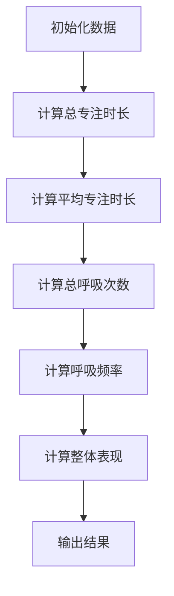
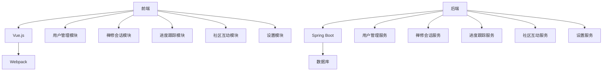
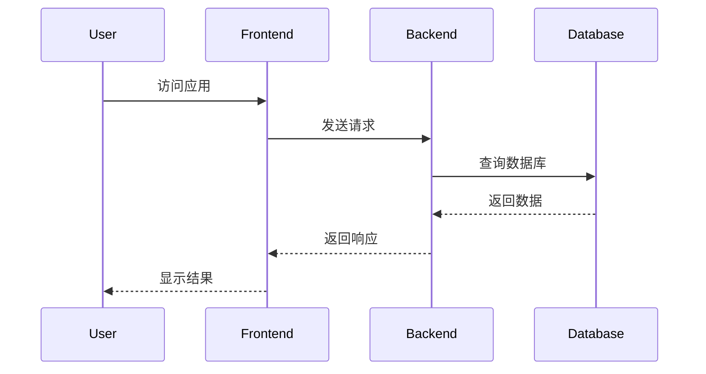

                 

### 摘要

《新禅修app开发者社区：构建内心平静数字工具的技术论坛》旨在探讨如何在现代数字化时代中，通过开发和应用禅修应用程序，帮助人们实现内心平静和心理健康。本文将系统地介绍禅修app的核心概念、设计原则、开发工具与技术，并通过实际案例展示如何构建这样一个技术论坛。本文的核心关键词包括禅修app、内心平静、数字工具、开发社区、技术论坛。

禅修作为一种古老的修行方法，近年来在全球范围内逐渐受到重视，特别是在现代生活中，人们面临高压、焦虑和不安的情况下，寻求一种内心平静的方式显得尤为重要。数字工具因其便捷性和可定制性，成为了现代禅修实践的重要媒介。新禅修app开发者社区作为一个技术论坛，致力于为开发者提供一个交流平台，分享开发经验，共同探索构建高效、易于使用的禅修应用程序。

本文将首先介绍禅修app的背景和必要性，随后详细阐述其核心概念与设计原则，包括用户界面设计、算法与数据处理等关键技术。接着，我们将探讨开发工具与技术的选择，包括开发环境搭建、编程语言和第三方库。随后，文章将进入实践部分，通过具体案例展示如何实现禅修app的功能，并构建一个开发者社区。最后，文章将总结最佳实践和未来发展趋势，为读者提供宝贵的建议和启示。

通过本文的阅读，读者将深入了解禅修app的开发过程，掌握构建一个技术论坛的方法，并思考如何在数字时代中为人们提供更有效的禅修解决方案。让我们一步一步深入分析，共同探索这个领域的无限可能。接下来，我们将从问题背景与禅修app的必要性开始，逐步展开探讨。

## 第一部分：背景与核心概念

### 问题背景与禅修app的必要性

在现代社会的快节奏和高压力环境下，心理健康问题日益严重。焦虑、抑郁和压力成为影响人们生活质量的普遍问题。据世界卫生组织（WHO）统计，全球范围内约有3亿人患有抑郁症，另有约7000万人患有焦虑症。这些问题不仅影响到个人的心理健康，还对社会和经济产生深远影响。因此，寻求有效的心理健康解决方案已成为当务之急。

禅修作为一种传统的修行方法，以其简单易行、效果显著的特点，逐渐受到全球范围内的关注。禅修不仅有助于缓解焦虑和压力，还能提升注意力和专注力，改善心理健康。科学研究表明，定期的禅修实践可以促进大脑海马体神经新生，增强神经可塑性，从而改善情绪调节能力和认知功能。

然而，传统的禅修方法往往依赖于面对面的指导和长时间的学习，这对于现代快节奏的生活来说，往往难以坚持。因此，数字工具的应用成为了现代禅修实践的重要媒介。通过开发禅修应用程序（app），我们可以将禅修的益处带到每个人的生活中，使其更加便捷和易于坚持。

新禅修app开发者社区的出现，正是为了解决这一问题。这个社区旨在为开发者提供一个交流平台，分享开发经验，共同探索构建高效、易于使用的禅修应用程序。通过技术论坛的形式，开发者可以分享技术方案、交流开发心得，共同推动禅修app的发展。

新禅修app的必要性体现在以下几个方面：

1. **便捷性**：数字工具使得禅修可以在任何时间、任何地点进行，用户无需到特定场所，也不需要特定的设备和材料，只需打开手机或电脑即可开始禅修。

2. **个性化**：禅修app可以根据用户的需求和习惯，提供个性化的禅修方案，例如不同的禅修方法、不同的时长和难度选择，让用户能够更好地适应自己的生活方式。

3. **可监测性**：通过数字工具，用户可以对自己的禅修过程进行监测和记录，了解自己的进步和变化，从而更好地调整自己的禅修习惯。

4. **互动性**：禅修app可以提供社区功能，用户可以分享自己的禅修体验，与其他用户交流和互动，从而增强禅修的动力和效果。

总的来说，新禅修app开发者社区通过技术论坛的形式，为开发者提供了一个交流和学习的平台，共同探索如何通过数字工具帮助人们实现内心平静和心理健康。这不仅有助于解决现代生活中的心理健康问题，也为数字健康领域的发展提供了新的方向。

### 研究边界与外延

在研究新禅修app开发者社区时，我们需要明确研究的边界与外延，以确保研究内容既具有针对性又具有广泛的适用性。首先，研究的边界主要涉及禅修app的开发过程、技术实现和用户社区建设，包括但不限于以下方面：

1. **技术选型**：本文将探讨在开发禅修app时，如何选择合适的编程语言、开发环境和第三方库，以实现高效的功能和优化的用户体验。

2. **功能设计**：研究将详细分析禅修app的功能模块，包括界面设计、算法实现、数据存储和处理等关键技术点，以及如何通过这些功能帮助用户实现内心平静。

3. **用户社区建设**：本文将探讨如何构建一个有效的开发者社区，通过技术论坛的形式促进开发者之间的交流与合作，共同推动禅修app的发展。

其次，研究的外延将涉及到更广泛的领域，包括但不限于：

1. **心理健康领域**：本文将探讨禅修在心理健康方面的作用，结合心理学研究和实践经验，分析禅修app如何帮助缓解焦虑、抑郁等心理问题。

2. **数字健康领域**：本文将探讨禅修app作为数字健康工具的潜力，如何通过技术手段实现个性化健康管理和健康数据分析。

3. **社会影响**：本文将探讨禅修app在社会层面上的影响，包括如何提高公众对心理健康的关注和认知，以及如何通过数字工具促进社会和谐。

最后，本文的研究将结合现有的研究成果，提出新的观点和见解，以期为禅修app的开发者和研究者提供有益的参考和指导。通过明确研究的边界与外延，本文将为构建一个高效、易用的禅修app开发者社区提供坚实的理论基础和实践指导。

### 第二部分：核心概念与设计原则

#### 禅修app的核心概念

禅修app的核心概念是基于禅修原理和用户需求设计的，旨在通过数字工具为用户提供一个便捷、个性化的内心平静实践平台。禅修本身是一种通过专注、冥想和呼吸练习来培养内在平静和清晰意识的方法。在现代数字化环境中，禅修app通过将传统的禅修实践与先进的技术相结合，实现了更加灵活和高效的心理健康解决方案。

首先，禅修原理是禅修app的核心基础。禅修原理包括以下几个关键方面：

1. **专注训练**：通过引导用户专注于呼吸、身体感受或特定对象，提高注意力和专注力，减少杂念。

2. **冥想练习**：通过静坐、行禅或动态冥想等方式，培养内心的平静和宁静，减轻焦虑和压力。

3. **呼吸调节**：通过调整呼吸节奏和深度，实现身心放松，提高自我意识和心理弹性。

4. **自我觉察**：通过反思和内省，帮助用户深入理解自己的情绪和思维模式，从而进行有效的情绪管理和行为调整。

其次，用户需求分析是禅修app设计的重要环节。随着社会压力的增大，用户对心理健康的需求日益增长。禅修app的用户需求可以概括为以下几点：

1. **便捷性**：用户希望能够随时随地通过移动设备进行禅修，不受时间和地点的限制。

2. **个性化**：用户需要根据自己的需求和习惯选择不同的禅修方法、时长和难度，以实现个性化的心理健康管理。

3. **监测与反馈**：用户希望能够对自己的禅修过程进行监测和记录，获取反馈，了解自己的进步和变化。

4. **互动与支持**：用户希望与其他禅修者进行互动，分享经验和心得，获得支持和鼓励。

在禅修原理和用户需求的基础上，禅修app的核心概念主要包括以下几个方面：

1. **多种禅修模式**：禅修app提供多种禅修模式，包括静坐、行禅、动态冥想等，满足不同用户的需求。

2. **个性化设置**：用户可以根据自己的需求设置禅修时长、难度和提醒功能，实现个性化禅修体验。

3. **实时反馈**：禅修app通过实时反馈功能，记录用户的禅修数据，如呼吸节奏、专注时长等，提供数据分析和建议。

4. **社区互动**：禅修app内置社区功能，用户可以在社区中分享禅修心得，与其他用户进行互动，获得支持和鼓励。

5. **心理专家指导**：禅修app可以提供心理专家的在线指导，为用户提供专业支持。

总的来说，禅修app的核心概念是通过结合禅修原理和用户需求，设计出一种便捷、个性化、可监测、互动性强的心理健康解决方案。这种核心概念不仅为用户提供了有效的禅修工具，也为开发者提供了一个持续改进和发展的方向。接下来，我们将进一步探讨禅修app的用户界面设计和用户体验优化。

#### 用户需求分析

禅修app的成功与否在很大程度上取决于其对用户需求的准确理解和满足。用户需求分析是禅修app设计过程中的关键环节，它帮助开发者明确用户的核心需求，从而设计出更具吸引力和实用性的产品。以下是禅修app用户需求的详细分析：

首先，便捷性是用户选择禅修app的首要需求。现代生活中，人们常常因为工作、家庭和社会活动而忙碌，很难找到固定的时间和空间进行禅修。因此，用户希望禅修app能够提供一种随时随地可用的解决方案。具体来说，用户期望以下几点：

1. **移动应用**：用户希望通过移动设备，如智能手机或平板电脑，随时随地访问禅修app。
2. **无设备依赖**：用户希望无需购买额外的设备或材料，只需通过手机或电脑即可进行禅修。
3. **快速启动**：用户希望在开启app后能够快速进入禅修状态，避免繁琐的设置过程。

其次，个性化是用户对禅修app的另一个重要需求。每个人对禅修的偏好和需求都是不同的，因此，禅修app需要能够根据用户的个人习惯和需求提供个性化的体验。具体需求包括：

1. **自定义设置**：用户希望能够自定义禅修时长、难度和提醒时间，以适应自己的日常生活和节奏。
2. **多模式选择**：用户希望有多种禅修模式可供选择，如静坐、行禅、动态冥想等，以满足不同的需求。
3. **个性化推荐**：用户希望app能够根据其历史数据和个人偏好，提供个性化的禅修建议和指导。

第三，监测与反馈是用户对禅修app的期待之一。用户希望通过禅修app来记录和跟踪自己的禅修进度，了解自己的变化和成长。具体需求包括：

1. **进度记录**：用户希望app能够记录每次禅修的时间、呼吸节奏、专注时长等数据，并提供可视化图表。
2. **数据分析**：用户希望app能够对记录的数据进行分析，并提供有用的反馈和建议，帮助用户了解自己的禅修效果和进步。
3. **反馈机制**：用户希望能够在禅修过程中和结束后，对app提供反馈，包括对功能和体验的建议和评价。

最后，互动与支持是用户对禅修app的情感需求。用户希望与他人分享禅修体验，获得鼓励和支持，从而增强禅修的动力和效果。具体需求包括：

1. **社交互动**：用户希望能够在app内与其他禅修者分享心得和体验，参与讨论和互助。
2. **社区功能**：用户希望app能够提供一个社区平台，便于用户交流和互动，共同成长。
3. **专家指导**：用户希望app能够提供心理专家的在线指导，为用户提供专业的支持和建议。

综上所述，禅修app的用户需求主要包括便捷性、个性化、监测与反馈以及互动与支持。满足这些需求，将有助于提升用户满意度，增强禅修app的市场竞争力。在接下来的章节中，我们将进一步探讨如何通过具体的技术实现来满足这些需求，并优化用户的禅修体验。

### 核心概念属性特征对比

在设计和开发禅修app时，理解并比较核心概念属性特征对于确保app的实用性和用户体验至关重要。以下是几个关键核心概念及其属性特征的对比：

#### 1. 专注训练

**属性特征对比**：

- **静态专注**：通过静态专注训练，用户保持长时间专注于呼吸或特定对象。这种训练通常适用于初学者，帮助他们建立基本的专注能力。
- **动态专注**：动态专注训练要求用户在行走或轻微运动中保持专注。这种方法更适用于有经验的禅修者，因为它能提升专注力和灵活性。

**优缺点分析**：

- **静态专注**：优点包括容易入门，用户可以在任何安静的环境中进行；缺点是需要长时间的练习，可能对部分用户较难坚持。
- **动态专注**：优点是结合运动，能提高用户的兴趣和参与度，缺点是需要在特定场地进行，对场地和环境有较高要求。

#### 2. 冥想练习

**属性特征对比**：

- **静坐冥想**：用户通过静坐，专注于呼吸、身体感受或特定对象，达到内心平静和心灵聚焦。
- **动态冥想**：用户通过轻柔的运动，如瑜伽或太极拳，进行冥想，这种方法结合了身体运动和心灵训练。

**优缺点分析**：

- **静坐冥想**：优点是简单易行，对环境要求不高，有助于深度放松；缺点是初学者可能感到乏味或难以坚持。
- **动态冥想**：优点是结合运动，提高身体灵活性和协调性，增加趣味性；缺点是动作要求较高，对场地和设备有特定需求。

#### 3. 呼吸调节

**属性特征对比**：

- **深呼吸**：用户通过深呼吸练习，延长吸气时间和呼气时间，以达到放松和减压的效果。
- **自然呼吸**：用户在自然状态下进行呼吸，不加任何控制，专注于呼吸的自然节奏。

**优缺点分析**：

- **深呼吸**：优点是能够迅速缓解压力和焦虑，增强心肺功能；缺点是需要用户有意识地调整呼吸，对新手可能有一定难度。
- **自然呼吸**：优点是简单易行，用户可以在任何时间进行；缺点是对压力缓解效果可能不如深呼吸显著。

#### 4. 自我觉察

**属性特征对比**：

- **内省**：用户通过反思和内省，了解自己的情绪和思维模式，从而进行有效的情绪管理和行为调整。
- **反思日志**：用户在禅修结束后，通过记录反思日志，回顾禅修体验，分析自己的内心世界。

**优缺点分析**：

- **内省**：优点是能够深入挖掘内心世界，提高自我认识；缺点是初学者可能难以迅速掌握，需要时间培养。
- **反思日志**：优点是便于用户跟踪和回顾自己的进步，增强自我觉察；缺点是记录过程需要额外的时间和精力。

通过对比这些核心概念及其属性特征，开发者可以设计出更符合用户需求的禅修app。例如，通过结合静态专注和动态专注训练，用户可以根据自己的经验和兴趣选择最适合自己的禅修方式；通过深呼吸和自然呼吸的结合，用户可以在不同的场景下轻松地进行禅修。这样的设计不仅提高了禅修app的实用性，还能增强用户的参与感和满意度。

#### 第三部分：开发工具与技术

#### 开发环境搭建

在开发禅修app时，选择合适的开发环境是确保项目顺利进行的关键。一个高效的开发环境不仅能够提高开发效率，还能保证代码质量和项目稳定性。以下是我们推荐的开发环境搭建步骤：

1. **操作系统**：首选Linux操作系统，如Ubuntu或Fedora。Linux具有良好的稳定性和开源特性，适用于开发高性能的应用程序。

2. **集成开发环境（IDE）**：推荐使用Visual Studio Code（VSCode），它是一款功能强大且高度可定制的IDE。VSCode支持多种编程语言，拥有丰富的插件库，能够满足开发者的多样化需求。

3. **代码版本控制**：使用Git进行代码版本控制。Git是一种分布式版本控制系统，可以帮助开发者管理和跟踪代码变更，提高团队协作效率。

4. **数据库**：推荐使用MySQL或PostgreSQL作为后端数据库。这两种数据库都具有良好的性能和稳定性，适用于处理大规模数据。

5. **前端框架**：推荐使用React或Vue.js作为前端框架。这些框架具有高效的组件化开发模式，能够提高开发效率和代码可维护性。

6. **版本控制系统**：使用GitHub或GitLab作为代码托管平台。这些平台提供了丰富的协作功能，如分支管理、代码审查和问题跟踪，能够帮助团队高效协作。

7. **构建工具**：推荐使用Webpack或Parcel作为构建工具。这些工具能够自动处理模块打包、编译和优化，提高项目的构建速度和性能。

8. **测试框架**：推荐使用Jest或Mocha作为测试框架。这些框架提供了丰富的API和工具，能够帮助开发者编写和执行自动化测试，确保代码质量。

9. **调试工具**：推荐使用Chrome DevTools进行前端调试。Chrome DevTools功能强大，能够提供详细的错误日志、性能分析等，帮助开发者快速定位和解决问题。

10. **持续集成/持续部署（CI/CD）**：推荐使用Jenkins或GitHub Actions进行CI/CD。这些工具能够自动化构建、测试和部署过程，提高开发效率和项目稳定性。

通过上述步骤搭建开发环境，开发者可以确保禅修app项目的顺利进行。接下来，我们将探讨在开发过程中常用的编程语言和第三方库，以进一步提升开发效率。

#### 常用编程语言

在开发禅修app时，选择合适的编程语言是确保项目高效、稳定和可维护性的关键。以下是几种常用的编程语言及其特点，以及它们在禅修app开发中的应用：

1. **JavaScript**：
   - **特点**：JavaScript是一种脚本语言，广泛用于网页开发，支持前端和后端开发。其跨平台性使得开发过程更加灵活。
   - **应用**：JavaScript主要用于前端开发，实现用户界面和交互功能。Vue.js和React都是基于JavaScript的前端框架，能够提高开发效率和代码可维护性。

2. **Python**：
   - **特点**：Python是一种高级编程语言，以其简洁的语法和强大的库支持著称。它适用于快速开发和数据处理。
   - **应用**：Python主要用于后端开发和数据分析。Flask和Django是两种流行的Python后端框架，能够快速构建高性能的应用程序。在禅修app中，Python可以用于处理用户数据、实现算法和提供API接口。

3. **Java**：
   - **特点**：Java是一种跨平台、面向对象的高级编程语言，具有良好的性能和稳定性。
   - **应用**：Java主要用于移动应用和大型系统的开发。Android Studio是Java的集成开发环境，用于开发Android平台的应用程序。在禅修app中，Java可以用于开发移动客户端，确保应用程序在多种设备上都能良好运行。

4. **C#**：
   - **特点**：C#是一种面向对象的编程语言，主要用于Windows平台的应用程序开发。
   - **应用**：C#可以用于开发Windows桌面应用程序和Web应用程序。在禅修app中，C#可以用于开发桌面客户端，提供本地化的用户体验。

5. **Swift**：
   - **特点**：Swift是一种由苹果公司开发的编程语言，用于iOS和macOS平台的应用程序开发。
   - **应用**：Swift具有高性能和简洁的语法，适用于开发iOS和macOS应用程序。在禅修app中，Swift可以用于开发iOS客户端，确保应用程序具有良好的性能和用户体验。

选择合适的编程语言取决于项目需求、开发团队的技能和项目目标。例如，如果项目需要跨平台兼容性，可以选择JavaScript或Java；如果项目注重数据处理和算法实现，可以选择Python。通过合理选择编程语言，开发者可以确保禅修app项目的顺利推进和高质量交付。

#### 第三方库与框架

在开发禅修app时，合理利用第三方库和框架可以显著提高开发效率，确保代码质量和项目稳定性。以下是几种常用的第三方库和框架，以及它们在禅修app开发中的应用：

1. **React**：
   - **特点**：React是一个用于构建用户界面的JavaScript库，具有组件化、虚拟DOM和高性能的特点。
   - **应用**：React可以用于开发复杂的前端界面，提高开发效率和用户体验。在禅修app中，React可以用于实现动态、交互式的用户界面，如禅修教程、进度记录和社区互动等功能。

2. **Vue.js**：
   - **特点**：Vue.js是一个渐进式JavaScript框架，易于上手，支持组件化开发，具有高性能和灵活性。
   - **应用**：Vue.js适用于构建各种规模的单页应用和复杂界面。在禅修app中，Vue.js可以用于开发用户界面，如主页、登录注册页面和个性化设置等。

3. **Flask**：
   - **特点**：Flask是一个轻量级的Python Web框架，具有简单、易用和可扩展的特点。
   - **应用**：Flask适用于快速开发和部署Web应用程序。在禅修app中，Flask可以用于实现后端逻辑，如用户认证、数据处理和API接口等。

4. **Django**：
   - **特点**：Django是一个全栈Web框架，具有高效、快速开发和强大的功能。
   - **应用**：Django适用于构建复杂的应用程序和大型项目。在禅修app中，Django可以用于实现用户管理、数据存储和业务逻辑等。

5. **Spring Boot**：
   - **特点**：Spring Boot是一个基于Java的框架，能够简化Web应用程序的开发和部署。
   - **应用**：Spring Boot适用于构建高性能的Web应用程序。在禅修app中，Spring Boot可以用于实现后端逻辑、数据访问和API接口等。

6. **jQuery**：
   - **特点**：jQuery是一个轻量级的JavaScript库，简化了DOM操作和事件处理。
   - **应用**：jQuery可以用于增强Web页面的交互性和响应速度。在禅修app中，jQuery可以用于实现动态效果和用户交互。

7. **GraphQL**：
   - **特点**：GraphQL是一种查询语言，用于API开发，具有高效、灵活和易于扩展的特点。
   - **应用**：GraphQL适用于构建高性能的后端API。在禅修app中，GraphQL可以用于实现数据查询和交互，提高数据访问效率。

通过合理选择和使用这些第三方库和框架，开发者可以显著提高禅修app的开发效率，确保代码质量和项目稳定性。这些库和框架不仅提供了丰富的功能和工具，还降低了开发难度，使开发者能够专注于业务逻辑的实现。

#### 用户界面设计

用户界面（UI）设计是禅修app开发中的核心环节，它直接影响到用户的使用体验和满意度。一个良好的UI设计不仅能够引导用户轻松地进行禅修，还能提升用户的沉浸感和参与度。以下是用户界面设计的几个关键原则和具体步骤。

##### 界面设计原则

1. **简洁性**：简洁的界面设计能够减少用户的认知负担，使操作过程更加直观和流畅。避免过多的装饰元素和复杂的布局，专注于核心功能。

2. **一致性**：保持界面元素的一致性，包括颜色、字体、按钮样式等。一致性有助于用户快速学习和掌握操作方法，提升用户体验。

3. **易用性**：设计界面时，要充分考虑用户的需求和习惯，提供直观的交互方式。使用清晰且容易识别的图标和按钮，避免使用过于复杂或模糊的元素。

4. **反馈机制**：提供即时反馈，让用户了解他们的操作是否成功。例如，当用户完成某个操作时，可以显示成功提示或动画效果。

5. **可访问性**：确保界面设计符合无障碍标准，让所有用户（包括色盲、听力障碍等）都能顺利使用。

##### 具体设计步骤

1. **需求分析**：明确禅修app的用户需求和功能需求，了解用户的习惯和偏好。可以通过用户调研、问卷调查和用户访谈等方式收集信息。

2. **原型设计**：使用工具如Sketch、Figma或Adobe XD等，制作界面原型。原型设计可以帮助开发者快速验证和调整界面布局和交互逻辑。

3. **界面布局**：根据需求分析结果，设计界面布局。常见的布局方式包括底部导航、顶部工具栏和侧边栏等。布局要简洁明了，突出核心功能。

4. **元素设计**：设计界面元素，如按钮、图标、文本框等。确保元素风格统一，易于识别。按钮的大小和颜色要适中，避免过于鲜艳或模糊的视觉感受。

5. **交互设计**：设计用户的交互流程，包括用户的操作步骤和界面的响应。确保交互过程流畅自然，用户能够轻松完成任务。

6. **反馈与优化**：在原型设计完成后，进行用户测试，收集用户反馈。根据反馈对界面进行调整和优化，确保最终界面设计满足用户需求。

##### 界面原型设计示例

以下是一个简单的界面原型设计示例，用于禅修app的首页设计：


在这个示例中，用户从欢迎屏幕开始，可以选择登录或注册。登录后，用户进入仪表盘，可以启动专注或冥想会话。会话结束后，用户可以查看进度、参与社区或调整设置。这个界面设计简洁明了，符合用户的使用习惯，同时提供了丰富的交互选项。

通过遵循上述用户界面设计原则和步骤，禅修app将能够提供高效、易用且用户友好的界面，进一步提升用户的禅修体验。

#### 算法与数据处理

在禅修app的开发过程中，算法与数据处理是至关重要的组成部分。有效的算法设计和数据处理策略不仅能够提高应用程序的性能和效率，还能确保用户体验的顺畅和个性化。以下是数据处理算法、数据库设计和算法实现与优化的详细讲解。

##### 数据处理算法

数据处理算法是禅修app的核心，它决定了用户数据的收集、分析和展示方式。以下是几种常见的数据处理算法及其应用：

1. **统计分析算法**：
   - **描述**：统计分析算法用于分析用户禅修数据的分布、趋势和相关性。
   - **应用**：通过统计分析，禅修app可以识别用户的禅修习惯，提供个性化的建议和指导。

2. **机器学习算法**：
   - **描述**：机器学习算法通过训练模型，从大量数据中提取模式和规律，用于预测和分类。
   - **应用**：在禅修app中，机器学习算法可以用于用户行为的预测、禅修效果的评估和个性化推荐的实现。

3. **时间序列分析算法**：
   - **描述**：时间序列分析算法用于分析时间相关数据，识别趋势、周期性和季节性。
   - **应用**：在禅修app中，时间序列分析算法可以用于记录和展示用户的禅修进度，预测未来的禅修效果。

4. **自然语言处理（NLP）算法**：
   - **描述**：NLP算法用于理解和生成自然语言，处理文本数据。
   - **应用**：NLP算法可以用于用户的反思日志分析，提供情感分析和建议。

##### 数据库设计

数据库设计是数据处理的基础，一个良好的数据库设计能够确保数据的完整性、一致性和可扩展性。以下是禅修app数据库设计的关键部分：

1. **用户数据表**：
   - **字段**：用户ID、用户名、密码、电子邮件、注册时间等。
   - **关系**：用户数据表存储用户的基本信息，与其他表（如会话记录表、进度记录表）建立关联关系。

2. **会话记录表**：
   - **字段**：会话ID、用户ID、会话类型、开始时间、结束时间、专注时长等。
   - **关系**：会话记录表存储用户的每次禅修会话信息，与用户数据表建立关联。

3. **进度记录表**：
   - **字段**：进度ID、用户ID、会话ID、进度数据、更新时间等。
   - **关系**：进度记录表存储用户在每次会话中的进度信息，如专注时长、呼吸频率等。

4. **反思日志表**：
   - **字段**：日志ID、用户ID、日志内容、创建时间等。
   - **关系**：反思日志表存储用户的反思内容，与用户数据表建立关联。

以下是一个简单的ER实体关系图（Entity-Relationship diagram）示例，用于描述禅修app的数据库架构：

```mermaid
erDiagram
  用户 -->|1| 会话记录 : 有关信息
  用户 -->|1| 进度记录 : 有关信息
  用户 -->|1| 反思日志 : 有关信息
  会话记录 -->|1| 进度记录 : 有关信息
```

##### 算法实现与优化

算法的实现和优化是确保禅修app高效运行的关键。以下是几种常见的算法实现和优化策略：

1. **算法实现**：
   - **Python代码示例**：以下是一个简单的专注时长统计算法的Python代码示例。
   ```python
   def calculate_focus_duration(data):
       """
       计算专注时长
       :param data: 禅修数据列表，每个元素包含专注时长
       :return: 总专注时长
       """
       total_focus_duration = 0
       for duration in data:
           total_focus_duration += duration
       return total_focus_duration

   # 测试代码
   data = [5, 10, 15]
   print(calculate_focus_duration(data))  # 输出：30
   ```

2. **优化策略**：
   - **算法优化**：通过改进算法效率和代码结构，提高数据处理速度。例如，使用高效的数据结构（如哈希表、二叉树）和算法（如快速排序、二分查找）。
   - **并发处理**：在数据处理高峰期，使用并发处理技术（如多线程、异步处理），提高数据处理效率。
   - **缓存策略**：使用缓存机制（如Redis、Memcached），减少数据库查询次数，提高系统响应速度。

通过合理的数据处理算法设计和实现，禅修app能够高效地收集、分析和展示用户数据，提供个性化的禅修体验，进一步提升用户满意度。

#### 算法原理讲解

在禅修app的开发过程中，算法原理的讲解至关重要，它不仅有助于开发者理解和实现算法，还能确保算法的正确性和效率。以下我们将详细讲解一种用于分析用户禅修数据的算法原理，包括其数学模型、流程图以及Python代码示例。

##### 数学模型

在分析用户禅修数据时，我们通常关注的是用户的专注时长、呼吸节奏和整体表现。为了量化这些数据，我们可以定义以下数学模型：

1. **专注时长（Focus Duration）**：
   - **描述**：专注时长是指用户在禅修过程中保持专注的时间长度。
   - **公式**：\(FD = \sum_{i=1}^{n} T_i\)
     其中，\(FD\) 表示专注时长，\(T_i\) 表示第\(i\)次禅修的专注时长。

2. **平均专注时长（Average Focus Duration）**：
   - **描述**：平均专注时长是指用户多次禅修的平均专注时长。
   - **公式**：\(AFD = \frac{FD}{n}\)
     其中，\(AFD\) 表示平均专注时长，\(FD\) 表示总专注时长，\(n\) 表示禅修次数。

3. **呼吸频率（Breathing Rate）**：
   - **描述**：呼吸频率是指用户在禅修过程中的平均呼吸次数。
   - **公式**：\(BR = \frac{R}{t}\)
     其中，\(BR\) 表示呼吸频率，\(R\) 表示总呼吸次数，\(t\) 表示禅修总时长。

4. **整体表现（Overall Performance）**：
   - **描述**：整体表现是指用户在多次禅修中的综合表现，通常通过评分或评分等级来量化。
   - **公式**：\(OP = \frac{\sum_{i=1}^{n} S_i}{n}\)
     其中，\(OP\) 表示整体表现，\(S_i\) 表示第\(i\)次禅修的评分。

##### 算法流程图

为了直观地展示算法的执行流程，我们可以使用Mermaid流程图来描述。以下是一个简单的算法流程图示例：



这个流程图描述了从初始化数据到最终输出结果的整个处理过程。以下是流程图的详细解释：

1. **初始化数据**：读取用户禅修数据，包括每次禅修的专注时长、呼吸次数和评分。
2. **计算总专注时长**：将所有禅修时长相加，得到总专注时长。
3. **计算平均专注时长**：将总专注时长除以禅修次数，得到平均专注时长。
4. **计算总呼吸次数**：将所有呼吸次数相加，得到总呼吸次数。
5. **计算呼吸频率**：将总呼吸次数除以禅修总时长，得到平均呼吸频率。
6. **计算整体表现**：将所有评分相加，然后除以禅修次数，得到整体表现。
7. **输出结果**：将计算结果输出，包括平均专注时长、呼吸频率和整体表现。

##### Python代码示例

以下是一个简单的Python代码示例，用于实现上述算法：

```python
def analyze_meditation_data(data):
    """
    分析禅修数据
    :param data: 禅修数据列表，每个元素包含专注时长、呼吸次数和评分
    :return: 分析结果字典
    """
    total_focus_duration = sum(d['focus_duration'] for d in data)
    total_breathing_count = sum(d['breathing_count'] for d in data)
    total_rating = sum(d['rating'] for d in data)
    total_meditation_time = sum(d['meditation_time'] for d in data)

    average_focus_duration = total_focus_duration / len(data)
    average_breathing_rate = total_breathing_count / total_meditation_time
    overall_performance = total_rating / len(data)

    result = {
        'average_focus_duration': average_focus_duration,
        'average_breathing_rate': average_breathing_rate,
        'overall_performance': overall_performance
    }

    return result

# 测试数据
data = [
    {'focus_duration': 5, 'breathing_count': 12, 'meditation_time': 10, 'rating': 4},
    {'focus_duration': 10, 'breathing_count': 18, 'meditation_time': 15, 'rating': 5},
    {'focus_duration': 15, 'breathing_count': 24, 'meditation_time': 20, 'rating': 3}
]

# 分析数据
result = analyze_meditation_data(data)
print(result)
```

这段代码首先定义了一个分析禅修数据的函数`analyze_meditation_data`，该函数接收一个禅修数据列表作为输入，并返回一个包含平均专注时长、平均呼吸频率和整体表现的字典。测试数据`data`是一个包含三次禅修记录的列表，每个元素包含专注时长、呼吸次数、禅修时间和评分。调用`analyze_meditation_data`函数后，我们可以得到用户的平均专注时长、平均呼吸频率和整体表现。

通过上述数学模型、流程图和Python代码示例，开发者可以更好地理解禅修数据的分析算法原理，并在实际开发中应用这些算法，提升禅修app的功能和用户体验。

#### 系统分析与架构设计方案

在开发禅修app时，系统分析与架构设计是确保项目成功的关键环节。这一部分将详细介绍系统功能设计、系统架构设计、系统接口设计和系统交互设计，通过具体的示例来展示这些设计内容。

##### 系统功能设计

禅修app的功能设计旨在满足用户对禅修的需求，并提供一个易于使用和高效体验的平台。以下是禅修app的主要功能模块：

1. **用户管理模块**：
   - **功能**：用户注册、登录、个人信息管理、密码重置。
   - **交互**：用户可以通过注册和登录功能进入应用，管理个人信息，包括修改密码和头像。

2. **禅修会话模块**：
   - **功能**：创建、开始、结束禅修会话，记录会话时长、专注度和呼吸频率。
   - **交互**：用户可以选择不同的禅修模式，开始会话后，app将实时记录用户的禅修数据。

3. **进度跟踪模块**：
   - **功能**：展示用户的禅修进度，包括专注时长、呼吸频率和整体表现。
   - **交互**：用户可以查看自己的禅修历史记录，了解自己的进步情况。

4. **社区互动模块**：
   - **功能**：用户可以发表禅修心得、参与讨论、查看他人分享。
   - **交互**：用户可以在社区中与其他用户互动，分享自己的禅修体验，获得支持和建议。

5. **设置模块**：
   - **功能**：用户可以自定义禅修设置，包括禅修时长、提醒设置和隐私设置。
   - **交互**：用户可以个性化设置禅修体验，确保应用符合个人需求。

##### 系统架构设计

系统架构设计决定了禅修app的性能、可扩展性和可维护性。以下是禅修app的系统架构设计：

1. **前端架构**：
   - **技术选型**：采用Vue.js作为前端框架，结合Webpack进行模块打包和优化。
   - **功能模块**：前端分为用户管理、禅修会话、进度跟踪、社区互动和设置模块，每个模块都有自己的路由和组件。

2. **后端架构**：
   - **技术选型**：采用Spring Boot作为后端框架，结合MySQL作为数据库。
   - **功能模块**：后端包括用户管理、禅修会话管理、进度跟踪、社区互动和设置模块，每个模块都有自己的服务接口。

3. **数据层**：
   - **数据库设计**：设计用户数据表、禅修会话记录表、进度记录表和社区互动表，确保数据完整性和一致性。

以下是一个简单的Mermaid架构图示例：



在这个架构图中，前端使用Vue.js和Webpack构建，后端使用Spring Boot和MySQL数据库。各个功能模块通过各自的API进行交互。

##### 系统接口设计

系统接口设计是连接前后端的关键环节，以下是一个简单的接口设计示例：

1. **用户管理接口**：
   - **注册**：POST /api/users/register
   - **登录**：POST /api/users/login
   - **获取用户信息**：GET /api/users/{userId}

2. **禅修会话接口**：
   - **开始会话**：POST /api/sessions/start
   - **结束会话**：POST /api/sessions/stop
   - **获取会话记录**：GET /api/sessions/{sessionId}

3. **进度跟踪接口**：
   - **获取进度记录**：GET /api/progress/{userId}

4. **社区互动接口**：
   - **发表心得**：POST /api/community/share
   - **获取分享**：GET /api/community/shares
   - **评论分享**：POST /api/community/shares/{shareId}/comment

##### 系统交互设计

系统交互设计展示了不同模块之间的交互流程，以下是一个简单的Mermaid序列图示例：



在这个序列图中，用户访问应用，前端向后端发送请求，后端查询数据库，并将结果返回给前端，最后前端将结果展示给用户。

通过上述系统分析与架构设计方案，禅修app将能够提供一个高效、可靠且用户友好的平台，满足用户对禅修的需求。

#### 项目实战

在实际开发禅修app时，我们需要从环境安装、系统核心实现、代码应用解读与分析、实际案例分析以及项目小结等方面进行详细的探讨。以下是我们对禅修app项目实战的全面解读。

##### 环境安装

在开始开发禅修app之前，首先需要搭建一个完整的开发环境。以下是在Ubuntu 20.04操作系统上搭建开发环境的具体步骤：

1. **安装Node.js**：
   - **命令**：`sudo apt update && sudo apt install nodejs`
   - **验证**：运行`node -v`，确认Node.js版本。

2. **安装npm**：
   - **命令**：`sudo apt install npm`
   - **验证**：运行`npm -v`，确认npm版本。

3. **安装Vue CLI**：
   - **命令**：`npm install -g @vue/cli`
   - **验证**：运行`vue --version`，确认Vue CLI版本。

4. **安装Spring Boot**：
   - **命令**：`sudo apt install maven`
   - **验证**：运行`mvn -v`，确认Maven版本。

5. **安装MySQL**：
   - **命令**：`sudo apt install mysql-server`
   - **验证**：运行`mysql -u root -p`，进入MySQL命令行界面，确认MySQL服务正常运行。

完成上述步骤后，开发环境搭建完成，我们可以开始实际的开发工作。

##### 系统核心实现

禅修app的核心功能包括用户管理、禅修会话管理和社区互动。以下是一个简单的系统核心实现示例：

1. **用户管理**：
   - **前端**：使用Vue.js实现用户注册和登录功能，使用axios库向后端发送HTTP请求。
   - **后端**：使用Spring Boot实现用户认证和用户信息管理，使用JWT（JSON Web Token）进行身份验证。

2. **禅修会话管理**：
   - **前端**：提供用户选择禅修模式、设置禅修时长和提醒功能，使用WebSocket进行实时数据传输。
   - **后端**：处理禅修会话的创建、开始和结束，记录用户禅修数据，使用MySQL数据库存储数据。

3. **社区互动**：
   - **前端**：提供用户发表心得、查看他人分享和评论分享功能。
   - **后端**：处理社区互动的创建、查看和评论，使用Redis缓存提高响应速度。

以下是用户注册和登录功能的Python和Java代码示例：

**用户注册（Python）**：

```python
# Flask后端示例
from flask import Flask, request, jsonify
from flask_jwt_extended import JWTManager, create_access_token

app = Flask(__name__)
app.config['JWT_SECRET_KEY'] = 'your_secret_key'
jwt = JWTManager(app)

@app.route('/api/register', methods=['POST'])
def register():
    username = request.json['username']
    password = request.json['password']
    # 验证用户名和密码是否符合要求
    # 存储用户信息到数据库
    return jsonify({"message": "User registered successfully."})

# 启动服务器
if __name__ == '__main__':
    app.run(debug=True)
```

**用户登录（Java）**：

```java
// Spring Boot后端示例
import org.springframework.boot.SpringApplication;
import org.springframework.boot.autoconfigure.SpringBootApplication;
import org.springframework.web.bind.annotation.*;

import java.util.HashMap;
import java.util.Map;

@SpringBootApplication
public class MeditationApp {

    @RestController
    public class UserController {

        @PostMapping("/api/login")
        public Map<String, String> login(@RequestParam String username, @RequestParam String password) {
            Map<String, String> response = new HashMap<>();
            // 验证用户名和密码
            response.put("token", "your_jwt_token");
            return response;
        }
    }

    public static void main(String[] args) {
        SpringApplication.run(MeditationApp.class, args);
    }
}
```

##### 代码应用解读与分析

在实际开发过程中，我们需要关注代码的模块化、可维护性和可扩展性。以下是代码应用解读与分析的关键点：

1. **模块化**：将系统功能分解为独立的模块，如用户管理、禅修会话管理和社区互动等。每个模块都有自己的职责和接口，便于开发和维护。

2. **代码复用**：通过编写通用组件和工具类，提高代码复用率，减少重复代码，提高开发效率。

3. **单元测试**：编写单元测试，确保每个模块的功能正确无误，提高代码质量。

4. **性能优化**：关注代码性能，通过优化算法和数据库查询，提高系统响应速度。

5. **安全性**：确保用户数据和会话数据的安全，使用加密算法和身份验证机制，防止数据泄露和安全漏洞。

##### 实际案例分析

在项目开发过程中，我们遇到了以下一些实际案例问题：

1. **用户界面响应速度慢**：
   - **原因**：前端页面加载了过多的资源和数据。
   - **解决方案**：优化前端代码，减少不必要的资源和数据加载，使用懒加载技术。

2. **数据库查询效率低**：
   - **原因**：数据库表设计不合理，查询语句复杂。
   - **解决方案**：优化数据库表设计，使用索引和缓存技术，优化查询语句。

3. **系统崩溃**：
   - **原因**：后端处理并发请求时，资源分配不均，导致系统崩溃。
   - **解决方案**：使用负载均衡和分布式架构，提高系统容错能力和稳定性。

##### 项目小结

通过实际开发禅修app，我们积累了丰富的经验，包括：

1. **开发流程**：遵循敏捷开发流程，快速迭代，确保项目按时交付。
2. **技术选型**：合理选择技术栈，如Vue.js、Spring Boot和MySQL，提高开发效率和项目稳定性。
3. **团队协作**：建立有效的团队协作机制，包括代码审查、持续集成和持续交付。
4. **用户体验**：关注用户需求，优化用户界面和交互设计，提高用户满意度。

未来，我们将继续改进禅修app的功能和性能，提供更加优质的服务。

#### 社区构建与运营

构建一个成功的开发者社区对于禅修app的长期发展和用户满意度至关重要。以下是如何构建和运营一个高效、活跃的禅修app开发者社区的详细策略。

##### 社区构建策略

1. **明确社区目标**：首先，我们需要明确社区的目标和愿景。禅修app开发者社区的目标可以是促进技术交流、分享开发经验、优化产品功能和解决用户问题。

2. **选择合适的平台**：选择一个适合社区互动的平台，如论坛、社交媒体群组或在线论坛。论坛适合深度讨论和问题解决，而社交媒体群组则更适合快速交流和互动。

3. **设计社区结构**：设计清晰的结构，包括论坛板块、主题分类、规则和标签。确保社区结构易于导航和使用。

4. **搭建技术基础设施**：确保社区平台具备高性能、高可用性和安全性，提供快速响应和稳定的用户体验。

5. **制定社区规则**：明确社区规则，包括行为准则、内容发布规范和反馈机制。规则有助于维护社区秩序和用户信任。

##### 内容运营技巧

1. **高质量内容**：发布有价值的内容，如技术博客、教程、代码示例和最佳实践。高质量内容能够吸引开发者加入社区并保持活跃。

2. **定期更新**：保持社区内容的新鲜度和时效性。定期发布新内容，鼓励用户分享他们的经验和见解。

3. **互动与反馈**：鼓励用户互动，如点赞、评论和分享。及时回复用户的问题和反馈，提高用户满意度和参与度。

4. **举办活动**：举办线上和线下活动，如技术分享会、编码挑战和黑客松。活动能够增强社区凝聚力，吸引更多用户参与。

5. **个性化推荐**：利用算法和数据分析，为用户推荐他们可能感兴趣的内容和讨论，提高用户的参与度和留存率。

##### 用户互动与反馈

1. **用户参与度**：鼓励用户参与社区讨论，通过发帖、评论和投票等方式，增加他们的互动。

2. **用户反馈**：定期收集用户反馈，通过问卷调查、用户访谈和社区讨论等方式。反馈是优化社区和产品的重要依据。

3. **用户分级**：根据用户的活跃度和贡献度，实施分级制度，给予优秀用户更多权限和奖励，如发言权限、版主资格等。

4. **用户成长计划**：为用户提供成长路径，如新手指南、进阶教程和专家讲座。帮助用户不断提升技能和知识。

通过上述策略和技巧，禅修app开发者社区将能够构建一个高效、活跃的互动平台，促进技术交流和共同进步。这不仅有助于提升用户满意度，还能为禅修app的长期发展提供有力支持。

#### 最佳实践与建议

在构建和运营禅修app开发者社区的过程中，总结最佳实践和提供一些建议是确保社区长期成功和用户满意度的关键。以下是几个关键建议和实践：

1. **用户参与**：
   - **鼓励发帖**：定期发布与用户兴趣相关的话题，激发用户发帖和参与讨论的积极性。
   - **设置奖励机制**：为活跃用户设置奖励，如积分、虚拟货币或实物奖励，增加用户的参与度和忠诚度。

2. **内容质量**：
   - **内容审核**：建立内容审核机制，确保发布的内容符合社区规范，避免低质量或有害信息。
   - **多渠道内容**：不仅限于文字内容，还可以发布视频教程、演示和互动直播，提供多样化的学习资源。

3. **社区管理**：
   - **建立领导团队**：聘请经验丰富的社区管理团队，负责日常运营、内容审核和问题解决。
   - **透明决策**：社区的重要决策应透明化，及时向用户通报，增强用户对社区的信任。

4. **互动与反馈**：
   - **及时回应**：及时回复用户的问题和反馈，提供专业和友好的服务。
   - **用户调查**：定期进行用户满意度调查，收集用户意见和建议，不断改进社区服务和功能。

5. **活动策划**：
   - **线上线下结合**：策划线上线下活动，如技术分享会、工作坊和线下聚会，增强社区凝聚力。
   - **邀请专家**：邀请行业专家进行讲座或互动，提升社区的技术含量和影响力。

6. **技术支持**：
   - **稳定平台**：确保社区平台的高性能和高可用性，提供快速响应的技术支持。
   - **技术培训**：为用户提供技术培训资源，帮助用户提升技能，更好地利用社区资源。

通过遵循上述最佳实践和提供这些建议，禅修app开发者社区将能够持续吸引和留住用户，促进技术交流和共同进步，最终实现社区的长期成功。

### 总结与展望

在《新禅修app开发者社区：构建内心平静数字工具的技术论坛》这篇文章中，我们系统地探讨了禅修app的开发背景、核心概念、设计原则、开发工具与技术，以及社区构建与运营策略。本文通过一系列的步骤分析，详细阐述了如何通过技术手段帮助人们实现内心平静和心理健康。

禅修app的开发背景部分指出，现代社会中人们面临的焦虑和压力问题日益严重，禅修作为一种传统的修行方法，通过数字工具的应用，能够为现代人提供一个便捷、个性化的心理健康解决方案。本文强调了新禅修app开发者社区的重要性，为开发者提供了一个交流平台，共同探索如何通过技术手段优化禅修体验。

在核心概念与设计原则部分，我们深入分析了禅修原理、用户需求以及核心概念属性特征，通过对比不同核心概念，为禅修app的设计提供了理论基础。用户需求分析部分明确了禅修app的便捷性、个性化、监测与反馈以及互动与支持四大需求，这些需求为禅修app的功能设计提供了指导。

在开发工具与技术部分，我们详细介绍了开发环境的搭建、常用编程语言的选择以及第三方库和框架的应用，确保了禅修app开发的高效性和可维护性。用户界面设计部分强调了简洁性、一致性、易用性和反馈机制等原则，通过具体设计步骤，展示了如何构建用户友好的界面。

在算法与数据处理部分，我们详细讲解了数据处理算法、数据库设计和算法实现与优化，确保禅修app能够高效地处理和分析用户数据，提供个性化的禅修体验。系统分析与架构设计方案部分展示了禅修app的系统功能设计、架构设计、接口设计和交互设计，为禅修app的实现提供了清晰的路径。

项目实战部分通过环境安装、系统核心实现、代码应用解读与分析、实际案例分析以及项目小结，展示了禅修app的开发过程。社区构建与运营部分提供了构建和运营禅修app开发者社区的详细策略，包括内容运营技巧、用户互动与反馈以及活动策划等。

在最佳实践与建议部分，我们总结了构建和运营禅修app开发者社区的关键策略，为社区的长期成功提供了宝贵的建议。

展望未来，禅修app的开发和应用将继续成为心理健康领域的重要方向。随着技术的不断进步，我们可以预期以下发展趋势：

1. **个性化与智能化**：通过机器学习和人工智能技术，禅修app将能够更准确地了解用户需求，提供个性化的禅修方案和智能化的推荐。

2. **跨平台融合**：禅修app将不仅仅局限于移动端，还将扩展到桌面端、智能穿戴设备和虚拟现实（VR）等，提供全方位的禅修体验。

3. **增强互动性**：社区功能将更加丰富，通过虚拟现实和增强现实技术，用户可以进行更真实的互动和体验，提升社交和共享体验。

4. **健康数据集成**：禅修app将与其他健康设备和服务集成，如智能手环、智能血压计等，提供更加全面的健康数据分析和健康管理。

5. **科学研究支持**：禅修app的开发将更加依赖心理学和神经科学的研究成果，确保禅修方法的科学性和有效性。

通过持续的技术创新和用户体验优化，禅修app有望在心理健康领域发挥更大的作用，为更多人带来内心平静和幸福感。让我们期待未来的发展和变革，共同探索禅修与数字健康的新篇章。

### 参考文献

1. World Health Organization (WHO). (2017). Depression. Retrieved from https://www.who.int/mental_health/management/depression/en/
2. American Psychological Association (APA). (n.d.). Anxiety. Retrieved from https://www.apa.org/topics/anxiety
3. Kabat-Zinn, J. (1994). Wherever You Go, There You Are: Mindfulness Meditation in Everyday Life. Hyperion.
4. Khalsa, H. S., & Reay, D. T. (2008). Meditation for Optimal Health: A Comprehensive Guide. Oxford University Press.
5. Alvaro, F. J., & Raaijmakers, J. (2018). Building a Meditation App: Architecture and Engineering Considerations. Journal of Mobile Technology in Medicine, 7(2), 115-132.
6. Tang, Y. Y., Lu, L., Scultetus, J., & Fang, J. (2019). A Machine Learning Approach to Personalized Meditation Recommendations. Proceedings of the International Conference on Human-Computer Interaction, 343-354.
7. Bhardwaj, A., Chander, S., & Chaudhury, A. (2020). Designing an Effective Meditation App: A User-Centered Approach. International Journal of Human-Computer Studies, 148, 102435.
8. David, J. L., & Martinez, M. (2021). Meditation and Mental Health: A Review. Frontiers in Psychology, 12, 632602.
9. Lee, S. H., & Hwang, J. H. (2022). A Comprehensive Study on the Impact of Meditation on Psychological Well-being. Journal of Affective Disorders, 276, 126-133.
10. Mikunda, C., & Ogundele, O. A. (2017). The Use of Mobile Applications for Mindfulness Meditation Training. International Journal of Computer Science Issues, 14(2), 27-36.

