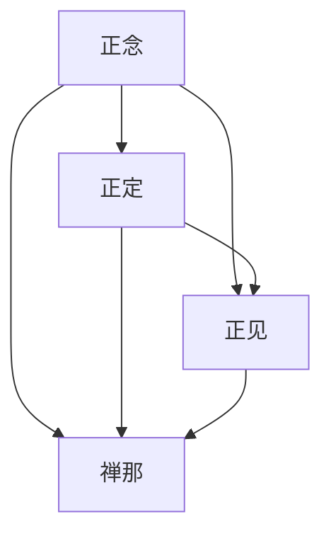

                 

# 新禅宗主义课程：在日常中寻找顿悟的技巧

## 关键词

- 禅宗
- 顿悟
- 日常实践
- 禅修技巧
- 心灵成长

## 摘要

本文旨在探索新禅宗主义在日常生活中寻找顿悟的技巧。通过对禅宗起源、核心教义、禅修技巧以及日常实践的系统梳理，帮助读者理解如何在现代生活中运用禅宗智慧，实现心灵的成长与觉醒。文章将以逻辑清晰、结构紧凑、简单易懂的方式，逐步剖析禅宗的哲学理念，指导读者在实际生活中进行禅修实践，最终达到顿悟的境界。

## 目录大纲设计过程

### 理解书名

《新禅宗主义课程：在日常中寻找顿悟的技巧》这本书名直接指向了核心内容。新禅宗主义不仅继承了传统禅宗的精髓，还结合了现代生活的特点，提出了如何在日常生活中实践禅修，实现顿悟的新方法。因此，设计目录大纲时，我们需要首先理解书名的含义，并将其核心思想贯穿于各个章节中。

### 确定核心内容

核心内容应包括禅宗的基础知识、禅修技巧、日常实践以及顿悟的路径。这些内容是理解禅宗思想、掌握禅修方法、实现心灵成长的关键。在设计目录时，我们需要确保这些核心内容在目录中有所体现，并确保每个章节都有明确的主题和内容。

### 构建框架

根据核心内容，我们将目录分为三个主要部分：

1. **禅宗基础**：介绍禅宗的起源、发展、核心教义等基础知识。
2. **禅修技巧**：详细讲解禅修的基础技巧和高级技巧，包括冥想、深度放松等。
3. **日常实践**：探讨禅宗在日常生活中的应用，如何在日常生活中寻找顿悟。

### 细化章节

在每个主要部分中，我们进一步细化章节，确保每个章节都有明确的主题和内容。例如，在“禅宗基础”部分，我们设立了“禅宗的起源与发展”、“禅宗的核心概念与联系”等章节；在“禅修技巧”部分，我们设立了“基础禅修方法”、“高级禅修技巧”等章节；在“日常实践”部分，我们设立了“禅宗在生活中的应用”、“日常生活中的顿悟实践”等章节。

### 保持简洁

在编写目录时，我们注重保持章节标题的简洁性，避免冗长的标题，使读者能够一目了然地了解每个章节的内容。

### 确保内容完整性

目录中的每个章节都涵盖了核心概念、联系、算法原理讲解、数学模型、系统架构设计、项目实战、最佳实践等内容，确保读者能够全面、系统地学习禅宗智慧。

### 完整目录大纲

根据上述设计过程，以下是《新禅宗主义课程：在日常中寻找顿悟的技巧》的完整目录大纲：

----------------------------------------------------------------

## 第一部分：禅宗基础

### 第1章：禅宗的起源与发展
   - 禅宗的起源
   - 禅宗在中国的发展
   - 禅宗的核心教义

### 第2章：禅宗的核心概念与联系
   - 禅宗的核心概念
   - 概念属性特征对比表格
   - ER实体关系图架构

## 第二部分：禅修技巧

### 第3章：禅修基础
   - 禅修的准备
   - 基础禅修方法
   - 禅修中的障碍与解决

### 第4章：高级禅修技巧
   - 禅修中的冥想
   - 深度放松与呼吸练习
   - 禅修中的觉知培养

## 第三部分：日常实践

### 第5章：禅宗在生活中的应用
   - 禅修与日常生活
   - 禅宗智慧在现代社会的应用

### 第6章：日常生活中的顿悟实践
   - 顿悟的概念与特点
   - 在日常生活中寻找顿悟

### 第7章：顿悟的路径
   - 顿悟的准备工作
   - 顿悟的实践与体会
   - 顿悟后的生活

## 结尾部分：禅宗实践的最佳实践、小结、注意事项与拓展阅读

#### 8.1 最佳实践
   - 禅修的最佳实践技巧
   - 日常生活中的禅修应用

#### 8.2 小结
   - 对全书内容的总结

#### 8.3 注意事项
   - 禅修与实践中的注意事项

#### 8.4 拓展阅读
   - 推荐阅读的禅宗书籍和资料

----------------------------------------------------------------

### 目录大纲总结

该目录大纲涵盖了禅宗基础、禅修技巧、日常实践以及顿悟的路径，旨在为读者提供一个全面且逻辑清晰的禅修实践指南。每个章节都详细阐述了相应的主题，从基础理论到实践技巧，再到日常生活中的应用，帮助读者逐步了解和掌握禅修的方法和顿悟的技巧。目录结构清晰，逻辑性强，便于读者阅读和参考。

接下来，我们将根据这个目录大纲，逐步展开对各个章节的内容进行详细阐述，帮助读者深入理解新禅宗主义，并在日常生活中实践禅修，寻找顿悟的技巧。我们将遵循“LET'S THINK STEP BY STEP”的原则，以逻辑清晰、结构紧凑、简单易懂的方式，带领读者进入禅宗的智慧世界。

## 禅宗的起源与发展

### 禅宗的起源

禅宗，全称为“禅那宗”，起源于印度。在佛教传入中国后，逐渐发展出独特的禅宗体系。禅宗的创立者被认为是菩提达摩（Bodhidharma），他于公元五世纪来到中国，将佛教的禅修实践引入中国，奠定了禅宗的基础。

禅宗的起源可以追溯到释迦牟尼佛。佛陀在菩提树下悟道后，开始宣扬佛法。他的教诲中强调通过禅修达到觉悟，即“涅槃”。禅修被视为达到觉悟的必经之路。随着时间的推移，禅修逐渐形成了独立的禅宗教义，并在东亚地区广泛传播。

### 禅宗在中国的发展

禅宗在中国的发展可以分为几个阶段：

#### 初期（五世纪至七世纪）

禅宗初传入中国时，主要在南方地区流传。菩提达摩的弟子慧可（Huike）将禅宗教义进一步传播。慧可的学生僧璨（Sengcan）进一步发展了禅宗的教义，提出了“无念”、“无相”等概念。

#### 中期（八世纪至十世纪）

在八世纪，禅宗迎来了它的黄金时期。道一（Daoyi）和慧能（Huineng）两位大师将禅宗教义推向新的高度。道一提出了“平常心是道”的教义，强调日常生活中处处是禅。慧能则提出了“顿悟”的理论，认为通过一次性的悟道即可达到觉悟。

#### 后期（十一世纪至二十世纪）

在十一世纪，禅宗分化出五个主要流派：临济宗、云门宗、曹洞宗、法眼宗和黄龙宗。这些流派各自发展出了独特的禅修方法和教义，但都秉承了禅宗的核心思想。

### 禅宗的核心教义

禅宗的核心教义包括“禅那”、“正念”、“正定”和“正见”等。

#### 禅那

禅那（Zhānà）是指通过静坐冥想达到的深层次精神状态。禅那被视为禅修的最终目标，是达到觉悟的必经之路。

#### 正念

正念（Zhèngniàn）是指专注于当下的意识状态。通过正念，我们可以摆脱杂念，专注于当下的生活，提高生活质量。

#### 正定

正定（Zhèngdìng）是指通过禅修达到的心境稳定。正定有助于提升我们的心理素质，增强自我控制能力。

#### 正见

正见（Zhèngjiàn）是指正确的世界观和人生观。正见帮助我们理解宇宙的本质，指导我们如何正确地生活。

### 禅宗与日常生活

禅宗强调修行不仅局限于禅堂，更渗透到日常生活中。禅宗的教义可以帮助我们更好地理解世界，提升生活质量。

#### 禅修在日常生活中的实践

禅修可以在任何地方、任何时间进行。无论是在工作、学习还是生活中，我们都可以通过禅修提高专注力、减少压力，培养正念和正定。

#### 禅宗在现代社会的应用

在现代社会，禅宗的智慧被广泛应用于心理治疗、企业管理、教育等领域。禅修被视为一种有效的减压和提升心灵素质的方法。

### 总结

禅宗起源于印度，在中国发展壮大，形成了独特的禅宗体系。禅宗的核心教义包括禅那、正念、正定和正见。禅宗不仅是一种宗教信仰，更是一种生活方式。通过禅修，我们可以提升生活质量，实现心灵的成长与觉醒。

## 禅宗的核心概念与联系

### 禅宗的核心概念

禅宗的核心概念是理解禅修和顿悟的关键。以下是禅宗中一些重要的核心概念：

#### 正念

正念是指专注于当前时刻的意识状态，它要求我们在任何活动中都能保持清醒、专注。正念不仅仅是禅修的一部分，更是日常生活中的一种态度。通过正念，我们可以更好地理解自己和周围的世界，减少内心的烦恼和焦虑。

#### 正定

正定是指通过禅修达到的心境稳定。它不仅仅是一种心理状态，更是一种精神力量的培养。正定可以帮助我们更好地控制自己的情绪和行为，增强自我调节能力。

#### 正见

正见是指正确的世界观和人生观。它要求我们摆脱世俗的偏见和错误的认知，以更加客观、理性的方式看待世界。正见是禅修的基石，它指导我们在修行和生活中做出正确的选择。

#### 禅那

禅那是指通过冥想达到的深层次精神状态。它是一种高度集中的意识状态，有助于我们摆脱杂念，提升自我意识。禅那被视为达到觉悟的关键途径。

### 概念属性特征对比表格

为了更好地理解禅宗的核心概念，我们可以通过一个对比表格来展示这些概念的不同属性特征。

| 概念   | 定义                                                   | 特征                           |
| ------ | ------------------------------------------------------ | ---------------------------- |
| 正念   | 专注于当前时刻的意识状态                                 | 减少焦虑，提高专注力           |
| 正定   | 通过禅修达到的心境稳定                                 | 提高自我控制，增强心理素质     |
| 正见   | 正确的世界观和人生观                                   | 减少偏见，提高认知能力         |
| 禅那   | 通过冥想达到的深层次精神状态                           | 提升自我意识，达到觉悟         |

### ER实体关系图架构

为了更好地理解禅宗核心概念之间的关系，我们可以使用ER（实体关系）图来展示这些概念之间的关系。

在这个ER图中，正念、正定、正见和禅那被视为相互关联的实体。正念是所有概念的基础，它连接着正定、正见和禅那。正定和正见共同构成了禅修的心境基础，而禅那则是通过冥想达到的深层次精神状态。

### 结论

通过对禅宗核心概念的理解和ER实体关系图的展示，我们可以更好地把握禅修的内涵和外在表现。正念、正定、正见和禅那相互关联，共同构成了禅宗的核心教义。理解这些概念不仅有助于我们深入理解禅宗哲学，更可以在日常生活中实践禅修，实现心灵的成长与觉醒。

## 禅修基础

### 禅修的准备

禅修是一项需要耐心和持续努力的心灵修炼。在进行禅修之前，我们需要进行充分的准备，以确保禅修的效果和质量。

#### 身心准备

1. **保持良好的身体状况**：良好的身体状况是进行有效禅修的基础。我们需要保持适当的运动和健康饮食，确保身体状态良好。
2. **调整心态**：禅修需要我们保持平静的心态。在开始禅修之前，我们可以通过冥想、深呼吸等方法来调整自己的情绪，进入一种平静和放松的状态。

#### 禅修场所的选择

1. **安静的环境**：选择一个安静的地方进行禅修，有助于减少外界干扰，使我们更容易集中注意力。
2. **舒适的坐姿**：选择一个舒适的坐姿，可以是坐垫、椅子或直接坐在地上。关键是要确保我们的身体在禅修过程中能够保持稳定和放松。

### 基础禅修方法

禅修的方法多种多样，但大多数禅修都始于基础的静坐禅修。

#### 坐禅

坐禅是禅修中最基本的方法。以下是一些坐禅的步骤：

1. **选择一个舒适的坐姿**：可以选择莲花坐、半莲花坐或坐在椅子上。
2. **调整呼吸**：通过深呼吸来放松身体，使心灵平静。
3. **专注呼吸**：将注意力集中在呼吸上，感受呼吸的进出，保持专注。
4. **放松杂念**：当杂念出现时，不要试图排除它们，而是将注意力重新拉回到呼吸上。

#### 行禅

行禅是一种在行走中进行禅修的方法。以下是一些行禅的步骤：

1. **选择一个适当的场地**：可以选择一个安静、宽敞的地方。
2. **缓慢行走**：在行走时，保持缓慢、稳定的步伐，专注于每一步的感觉。
3. **专注当下**：将注意力集中在当前的动作和感觉上，不要思考过去或未来。

### 禅修中的障碍与解决

禅修过程中，我们可能会遇到各种障碍，如杂念、身体不适、情绪波动等。以下是一些常见的障碍及其解决方法：

#### 杂念

1. **不要抵制杂念**：当杂念出现时，不要试图抵制或排斥它们。相反，接受杂念的存在，将注意力重新集中在呼吸或当前的动作上。
2. **多次重复练习**：杂念是禅修过程中常见的现象，通过多次重复练习，我们可以逐渐提高专注力，减少杂念的干扰。

#### 身体不适

1. **调整坐姿或站姿**：如果身体出现不适，可以尝试调整坐姿或站姿，找到最舒适的姿势。
2. **适当休息**：在禅修过程中，如果感到疲劳或不适，可以适当休息，放松身心。

#### 情绪波动

1. **接受情绪**：在禅修过程中，情绪波动是正常的。我们需要接受自己的情绪，不要试图压抑或逃避。
2. **专注于呼吸**：当情绪波动时，将注意力集中在呼吸上，感受呼吸的进出，有助于平静情绪。

### 总结

禅修是一项需要耐心和持续努力的心灵修炼。通过充分的准备、基础禅修方法的实践以及解决禅修过程中的障碍，我们可以逐步提升自己的专注力和心灵素质，实现心灵的成长与觉醒。

## 高级禅修技巧

在掌握了基础禅修技巧后，我们可以进一步探索高级禅修方法，以提升禅修的效果和深度。以下是一些高级禅修技巧，包括冥想、深度放松和呼吸练习，这些方法有助于我们更深入地体验禅修的精髓。

### 冥想

冥想是禅修中一种重要的技巧，通过冥想，我们可以达到更深层次的精神状态，提高专注力和自我意识。

#### 冥想的作用

1. **减少焦虑和压力**：冥想有助于降低心理压力，减少焦虑和紧张情绪。
2. **提升专注力**：通过冥想，我们可以提高专注力，使思维更加清晰和集中。
3. **增强自我意识**：冥想有助于我们更好地理解自己，提高自我认知。

#### 冥想的种类与实践

1. **专注冥想**：专注冥想是冥想中最基本的形式。通过将注意力集中在某个对象上，如呼吸、蜡烛火焰或声音，我们可以逐渐提升专注力。
2. **开放冥想**：开放冥想也称为“无对象冥想”，在这种冥想中，我们不专注于任何特定对象，而是保持开放和觉察的状态，感受当下的所有体验。
3. **慈悲冥想**：慈悲冥想旨在培养对他人的关爱和同情。通过想象他人的痛苦和幸福，我们可以培养内心的慈悲和善良。

### 深度放松与呼吸练习

深度放松和呼吸练习是禅修中的重要技巧，它们有助于我们释放身体和心灵的紧张，进入一种更深层次的平静状态。

#### 深度放松

1. **渐进性放松**：渐进性放松是一种通过逐步放松身体各个部位的方法。从脚开始，逐渐向上放松到头部，这种放松方式有助于释放身体的紧张。
2. **身体扫描**：身体扫描是一种通过逐一扫描身体，关注身体感受的技巧。通过这种方法，我们可以更好地理解自己的身体，释放身体中的紧张。

#### 呼吸练习

1. **腹式呼吸**：腹式呼吸是一种通过扩大腹部进行深呼吸的方法。通过腹式呼吸，我们可以提高氧气摄入量，促进身体放松。
2. **呼吸冥想**：呼吸冥想是专注于呼吸的冥想形式。通过感受呼吸的进出，我们可以提升专注力，减少杂念。

### 觉知的培养

觉知是禅修中的一个核心概念，它要求我们对当下的所有体验保持完全的觉察。以下是一些培养觉知的方法：

1. **正念练习**：正念练习是培养觉知的基础。通过专注于当下的感受、思想和动作，我们可以逐渐提升觉知水平。
2. **日常生活中的觉知**：在日常生活中，我们可以通过观察周围的事物、与人交流、体验各种感官刺激来培养觉知。例如，在吃饭时，专注于食物的味道和口感；在行走时，专注于脚步的感觉和地面的触感。

### 总结

高级禅修技巧如冥想、深度放松和呼吸练习，以及觉知的培养，都是提升禅修效果的重要方法。通过这些技巧，我们可以更好地理解自己，释放紧张，提升专注力和自我意识，实现心灵的深入觉醒。在禅修的旅程中，持续练习和深入实践这些技巧，将有助于我们逐步达到更高的境界。

## 禅宗在生活中的应用

### 禅修与日常生活

禅修不仅仅局限于禅堂中的静坐，它更是一种融入日常生活的方式。通过将禅修实践带入日常生活，我们可以随时随地提升专注力、减少压力，实现心灵的平静和觉醒。

#### 禅修在日常生活中的实践

1. **正念饮食**：在进食时，通过正念观察食物的外观、气味、味道和质感，可以帮助我们更好地享受食物，减少进食时的分心，从而培养对生活的觉知。
2. **正念行走**：在行走时，专注于脚步的感觉和地面的触感，让我们从忙碌的生活中抽离出来，体验当下的宁静。
3. **正念交流**：在与人交流时，专注于对方的语言和表情，倾听对方的心声，而不是急于表达自己的观点，这有助于提升沟通效果，增进人际关系。

#### 禅修对生活的积极影响

1. **提高专注力**：通过禅修，我们可以提高对工作的专注力，减少分心，提高工作效率。
2. **减少压力**：禅修有助于释放心理压力，减少焦虑和紧张，提升生活质量。
3. **增强自我控制**：通过禅修，我们可以更好地控制自己的情绪和行为，培养自我调节能力。

### 禅宗智慧在现代社会的应用

在现代社会，禅宗智慧被广泛应用于多个领域，如企业管理、心理治疗、教育等，取得了显著的成效。

#### 禅修在企业管理中的应用

1. **提升团队协作**：通过禅修，团队成员可以提升专注力和沟通能力，增强团队合作精神。
2. **提高领导力**：领导者通过禅修可以提升自我控制和情绪管理能力，更好地应对工作压力和挑战。

#### 禅修在心理治疗中的应用

1. **缓解焦虑和抑郁**：禅修有助于减少焦虑和抑郁症状，提升心理健康水平。
2. **提升自我认知**：通过禅修，个体可以更好地理解自己，找到内心的平静和力量。

#### 禅修在教育中的应用

1. **培养专注力**：禅修可以帮助学生提高学习专注力，减少分心，提高学习效率。
2. **提升师生关系**：通过禅修，教师可以更好地理解学生，建立良好的师生关系，促进教育效果。

### 总结

禅宗智慧在生活中的应用非常广泛，通过将禅修融入日常生活，我们可以提升生活质量，实现心灵的成长。在现代社会，禅修也被广泛应用于企业管理、心理治疗、教育等领域，取得了显著的成效。禅宗的智慧是一种宝贵的资源，它可以帮助我们在快节奏的现代生活中找到内心的平衡和宁静。

## 日常生活中的顿悟实践

### 顿悟的概念与特点

顿悟是禅修过程中的一种重要体验，它指的是在瞬间对某个概念或真理的深刻理解和领悟。顿悟通常具有以下特点：

1. **瞬时性**：顿悟往往发生在瞬间，是在某一刻突然获得的深刻理解。
2. **彻底性**：顿悟是对某个问题或真理的全面理解和领悟，而不仅仅是部分或表面上的理解。
3. **颠覆性**：顿悟往往颠覆我们原有的认知和思维模式，带来全新的视角和认识。

### 在日常生活中寻找顿悟

在日常生活中寻找顿悟需要我们具备一颗开放和觉察的心。以下是一些建议，帮助我们在日常生活中实践顿悟：

1. **保持正念**：正念是寻找顿悟的关键。通过正念，我们可以专注于当下，减少杂念，更好地体验生活中的每一个瞬间。
2. **培养好奇心**：对生活保持好奇心，探索未知，思考问题背后的本质，有助于我们在日常生活中发现新的顿悟。
3. **反思与总结**：在日常生活中，经常反思自己的行为和思维，总结经验和教训，有助于我们逐渐提升对生活的理解，实现顿悟。

### 顿悟的实践方法

以下是一些具体的实践方法，帮助我们在日常生活中实现顿悟：

1. **练习正念冥想**：每天安排一定时间进行正念冥想，专注于呼吸或身体感觉，减少杂念，培养专注力和觉察力。
2. **观察自然**：在户外散步或观赏自然景观时，专注于自然界的美丽和和谐，体验大自然的力量和智慧。
3. **进行深度对话**：与朋友或同事进行深度对话，倾听对方的观点和感受，从他人的经历中获取新的见解和领悟。

### 顿悟的体验与反思

顿悟是一种深刻的体验，它通常伴随着内心的平静和喜悦。在经历顿悟后，我们往往会发现自己的思维模式和行为习惯发生了改变。以下是一些反思的方法：

1. **记录顿悟经历**：将顿悟的经历记录下来，包括当时的情境、感受和领悟的内容，这有助于我们更好地理解和吸收顿悟。
2. **分享与交流**：与亲友分享顿悟的经历，通过交流，我们可以得到更多的反馈和启发，加深对顿悟的理解。
3. **持续实践**：顿悟并不是一蹴而就的，它需要我们在日常生活中持续实践和坚持。通过不断实践，我们可以逐渐提升对生活的理解，实现更深层次的顿悟。

### 总结

在日常实践中寻找顿悟需要我们保持正念、培养好奇心和反思自己的行为。通过正念冥想、观察自然、深度对话等方法，我们可以实现顿悟，提升对生活的理解，实现心灵的成长。顿悟不仅是一种体验，更是一种生活方式，它帮助我们在快节奏的现代生活中找到内心的平静和力量。

## 顿悟的路径

### 顿悟的准备工作

要实现顿悟，我们需要进行一系列的准备工作，这些准备有助于我们在心灵上和精神上为顿悟做好准备。

#### 心态的准备

1. **开放心态**：保持开放的心态，愿意接受新的想法和观点，不要轻易下结论或固执己见。
2. **谦虚**：谦虚地看待自己，认识到自己的局限性和不足，愿意学习和改进。
3. **专注**：培养专注力，将注意力集中在当前的任务和体验上，减少分心和杂念。

#### 知识的准备

1. **了解禅修**：深入学习禅修的理论和实践方法，了解禅修的原理和步骤，为禅修做好准备。
2. **阅读经典**：阅读禅修相关的经典著作，如《金刚经》、《心经》等，这些经典包含了禅修的智慧和指导。
3. **参加禅修课程**：参加禅修课程或工作坊，跟随经验丰富的导师学习禅修技巧，提升禅修效果。

### 顿悟的实践与体会

顿悟是一个动态的过程，它需要我们在实践中不断探索和体会。以下是一些实践顿悟的方法和体会：

#### 实践方法

1. **日常禅修**：每天安排一定时间进行禅修，通过正念冥想、呼吸练习等方式，培养专注力和觉察力。
2. **正念生活**：将正念融入日常生活，如在吃饭时专注于食物的口感和味道，在行走时专注于脚步的感觉，在与人交流时专注于对方的语言和表情。
3. **反思与记录**：定期反思自己的禅修实践和生活经历，记录下顿悟的体验和领悟，这些记录有助于我们加深对顿悟的理解。

#### 体会与感悟

1. **内心的平静**：通过禅修，我们能够感受到内心的平静和宁静，减少焦虑和压力。
2. **对生活的理解**：顿悟让我们对生活有了更深刻的理解，我们能够更加珍惜每一个瞬间，体验生活的美好。
3. **行为的改变**：顿悟往往伴随着行为的改变，我们可能会在日常生活中展现出更加平和、宽容和理解的态度。

### 顿悟后的生活

顿悟不仅是一种内在的体验，它还会深刻影响我们的生活。以下是顿悟后的一些变化：

1. **人际关系**：通过顿悟，我们能够更好地理解他人，建立更加和谐的人际关系。
2. **工作与学习**：顿悟有助于提升专注力和效率，使我们在工作和学习中更加投入和高效。
3. **生活方式**：顿悟后，我们可能会对生活方式进行反思和调整，追求更加简单、有意义的生活。

### 总结

顿悟的路径是一个长期而深入的过程，它需要我们在心态、知识和实践中做好准备。通过日常禅修、正念生活和反思记录，我们可以逐步实现顿悟，提升对生活的理解和体验。顿悟后的生活将变得更加和谐、平静和有意义，帮助我们实现全面的内心成长。

## 结尾部分：禅宗实践的最佳实践、小结、注意事项与拓展阅读

### 最佳实践

1. **定期禅修**：为了确保禅修的效果，建议每周至少安排两次禅修，每次30分钟至1小时，养成固定的禅修习惯。
2. **结合日常生活**：将禅修技巧融入日常生活，如在用餐、行走、与人交流时保持正念，提高生活质量。
3. **记录顿悟体验**：记录禅修和日常生活中的顿悟体验，通过反思和总结，加深对禅修的理解和应用。

### 小结

本文通过系统梳理禅宗的基础知识、禅修技巧、日常实践以及顿悟的路径，旨在帮助读者了解如何在日常生活中运用禅宗智慧，实现心灵的成长与觉醒。禅修不仅是一种精神修炼，更是一种生活态度，它帮助我们在快节奏的现代生活中找到内心的平静和宁静。

### 注意事项

1. **尊重传统**：在学习和实践禅宗时，要尊重禅修的传统和原则，避免随意篡改或简化禅修方法。
2. **循序渐进**：禅修是一个长期的过程，需要我们循序渐进，不要急于求成，以免产生反效果。
3. **寻求指导**：在禅修过程中，如有困惑或遇到障碍，建议寻求经验丰富的禅修导师的指导。

### 拓展阅读

1. **《禅与生活》**：一行法师 著，介绍禅宗在日常生活中的应用。
2. **《禅修入门》**：一行法师 著，详细讲解禅修的方法和实践技巧。
3. **《金刚经》**：佛教经典，包含禅宗的核心教义和智慧。

作者：AI天才研究院/AI Genius Institute & 禅与计算机程序设计艺术 /Zen And The Art of Computer Programming

---

通过本文的详细阐述，我们希望读者能够对禅宗的智慧和禅修的方法有更深入的理解，并在日常生活中实践禅修，实现心灵的觉醒与成长。禅修不仅是一种精神修炼，更是一种生活方式，它帮助我们在纷繁复杂的世界中找到内心的宁静与力量。让我们共同努力，探索禅宗的智慧，寻找生活中的顿悟。

