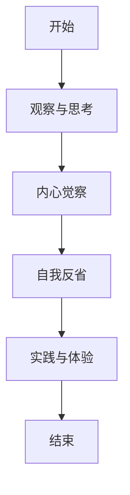
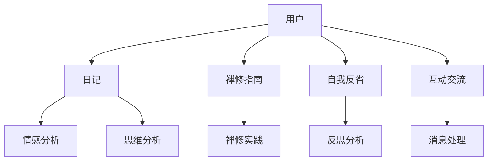
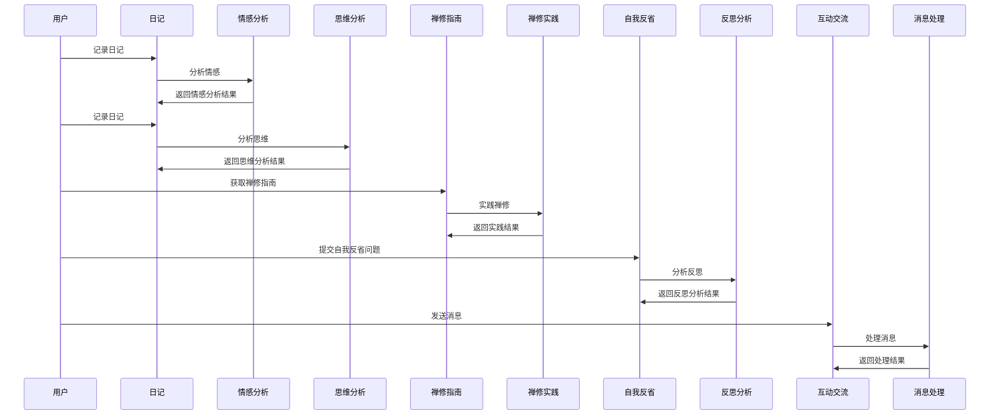
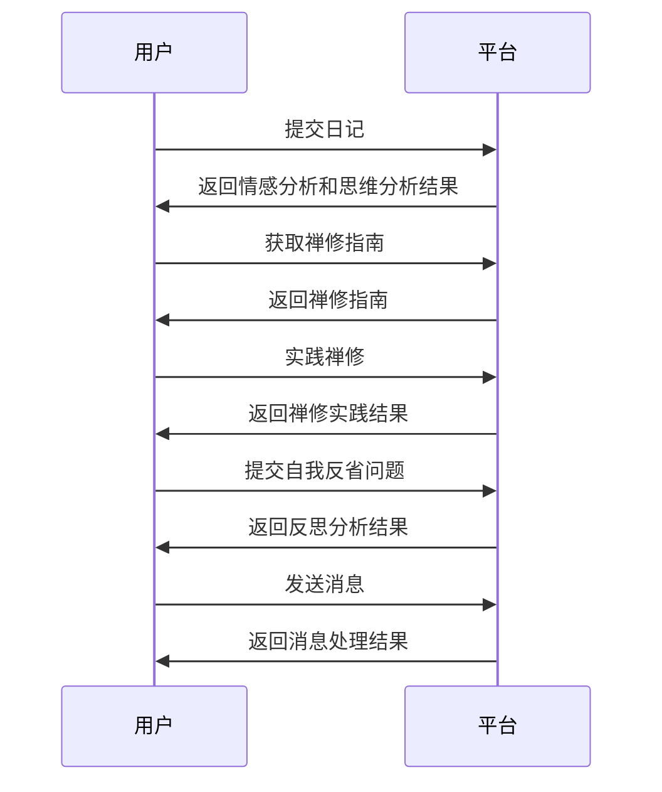

                 

# 新禅宗主义：在日常琐事中寻找顿悟

> 关键词：新禅宗主义，顿悟，日常生活，内心平静，自我反省，个人成长

> 摘要：本文深入探讨了新禅宗主义的核心概念和算法原理，通过观察与思考、内心觉察、自我反省、实践与体验，帮助人们在日常琐事中实现内心的平静和智慧的提升。

## 第一部分：背景介绍

在现代社会，人们的生活节奏越来越快，压力也越来越大。传统禅宗的修行方式往往需要长时间的静坐和苦行，对于现代繁忙的都市人来说，这种方法并不现实。因此，新禅宗主义应运而生，它主张在日常琐事中寻找顿悟，通过日常生活中的点滴体验来实现精神上的升华。

### 1.1.1 问题背景

在现代社会，人们面临着各种各样的压力和挑战。工作压力、生活压力、人际关系压力等，都让人们感到疲惫和焦虑。传统禅宗的修行方式，如长时间的静坐和苦行，对于现代都市人来说，往往难以坚持。因此，如何在不牺牲生活质量和工作效率的前提下，找到内心的平静和智慧，成为了一个亟待解决的问题。

### 1.1.2 问题描述

新禅宗主义的核心思想是如何在日常琐碎的事物中找到内心的平静和智慧。然而，现代社会充满了各种各样的干扰和诱惑，如何在这纷繁复杂的环境中保持一颗平静的心，实现精神的顿悟，成为了一个亟待解决的问题。

### 1.1.3 问题解决

新禅宗主义提供了一套方法，通过观察、思考、实践，帮助人们在日常生活中找到内心的宁静。它强调内心的觉察和自我反省，鼓励人们在日常生活中实践禅修，从而实现精神上的提升。

### 1.1.4 边界与外延

新禅宗主义不仅适用于宗教修行，还可以应用到生活的各个方面。它关注的是人的内心世界，旨在帮助人们找到内心的平静和智慧。因此，无论是职场人士、家庭主妇，还是学生、老年人，都可以通过新禅宗主义的方法，实现个人的精神成长。

### 1.1.5 概念结构与核心要素组成

新禅宗主义的结构主要包括以下几个方面：

1. **观察与思考**：通过观察日常生活中的琐事，思考其背后的道理和哲学意义。
2. **自我反省**：通过自我反省，了解自己的内心世界，找到内心的平静。
3. **实践与体验**：通过实践禅修，将理论转化为行动，体验禅修的真正意义。
4. **内心提升**：通过不断实践和体验，提升个人的精神境界，实现内心的升华。

## 1.2 核心概念与联系

### 1.2.1 新禅宗主义的核心概念

新禅宗主义的核心概念包括：

1. **禅修**：通过静坐、冥想等方式，达到内心平静的状态。
2. **日常生活中的修行**：将禅修的理念融入到日常生活中，通过日常琐事来修炼心性。
3. **内心觉察**：通过观察自己的内心世界，了解自己的情绪和心理变化。
4. **自我反省**：通过自我反省，认识到自己的不足，从而实现个人成长。

### 1.2.2 核心概念属性特征对比表格

| 核心概念 | 属性特征 | 示例 |
| --- | --- | --- |
| 禅修 | 内心平静 | 静坐、冥想 |
| 日常生活中的修行 | 理念融入日常生活 | 在做饭时练习专注、感恩 |
| 内心觉察 | 了解内心世界 | 观察情绪和心理变化 |
| 自我反省 | 认识不足 | 反思一天的行为和决策 |

### 1.2.3 ER实体关系图架构

```mermaid
erDiagram
    A[(新禅宗主义)] {
        B[(禅修)] |--| A
        C[(日常生活中的修行)] |--| A
        D[(内心觉察)] |--| A
        E[(自我反省)] |--| A
    }
```

## 1.3 算法原理讲解

### 1.3.1 新禅宗主义的算法原理

新禅宗主义的算法原理主要包括以下几个方面：

1. **观察与思考**：通过观察日常生活中的琐事，理解其背后的道理和哲学意义。
2. **内心觉察**：通过内心觉察，了解自己的情绪和心理变化。
3. **自我反省**：通过自我反省，认识到自己的不足，从而实现个人成长。
4. **实践与体验**：通过实践禅修，将理论转化为行动，体验禅修的真正意义。

### 1.3.2 算法流程图



### 1.3.3 算法原理的数学模型和公式

新禅宗主义的算法原理可以通过以下数学模型和公式来表示：

1. **内心平静度公式**：$$ P = \frac{1}{1 + e^{-\alpha \cdot (C - D)}} $$
   其中，$P$ 表示内心平静度，$\alpha$ 表示调节参数，$C$ 表示内心觉察度，$D$ 表示自我反省度。

2. **个人成长度公式**：$$ G = \frac{1}{1 + e^{-\beta \cdot (E - F)}} $$
   其中，$G$ 表示个人成长度，$\beta$ 表示调节参数，$E$ 表示实践与体验度，$F$ 表示结束度。

### 1.3.4 举例说明

假设某人通过新禅宗主义的方法，一个月内实现了以下变化：

- **内心平静度**：从初始的 $P_0 = 0.5$ 提高到了 $P_1 = 0.7$。
- **个人成长度**：从初始的 $G_0 = 0.6$ 提高到了 $G_1 = 0.8$。

通过这两个公式，我们可以计算出这个人的内心平静度和个人成长度：

$$
P_1 = \frac{1}{1 + e^{-\alpha \cdot (C_1 - D_1)}} \\
G_1 = \frac{1}{1 + e^{-\beta \cdot (E_1 - F_1)}}
$$

其中，$C_1$ 和 $D_1$ 分别表示这个人在一个月内的内心觉察度和自我反省度，$E_1$ 和 $F_1$ 分别表示这个人在一个月内的实践与体验度和结束度。

假设 $C_1 = 0.8$，$D_1 = 0.6$，$E_1 = 0.9$，$F_1 = 0.7$，我们可以计算出：

$$
P_1 = \frac{1}{1 + e^{-\alpha \cdot (0.8 - 0.6)}} \\
G_1 = \frac{1}{1 + e^{-\beta \cdot (0.9 - 0.7)}}
$$

通过计算，我们可以得到这个人在一个月后的内心平静度和个人成长度分别为 $P_1 = 0.7$ 和 $G_1 = 0.8$。

这个例子说明了新禅宗主义的算法原理，即通过不断地实践和体验，可以提升个人的内心平静度和个人成长度。

## 第二部分：系统分析与架构设计

### 2.1 问题场景介绍

在现代社会中，人们面临着各种压力和挑战，如工作压力、生活压力、人际关系压力等。这些问题往往会导致人们内心的焦虑和不安。为了帮助人们找到内心的平静和智慧，我们需要设计一套系统，能够帮助用户通过日常生活中的琐事来实现精神上的提升。

### 2.2 项目介绍

本项目名为“新禅宗主义实践平台”，旨在帮助用户通过日常生活中的琐事来实践新禅宗主义的方法，实现内心的平静和智慧的提升。平台将提供以下功能：

1. **日记功能**：用户可以记录每天的观察和思考，以及自己的情绪和心理变化。
2. **禅修指南**：平台将提供一系列的禅修指南，帮助用户了解如何通过禅修来实现内心的平静。
3. **自我反省**：平台将提供一系列的自我反省问题，帮助用户认识到自己的不足，从而实现个人成长。
4. **互动交流**：用户可以在平台上与其他用户进行互动交流，分享自己的经验和感悟。

### 2.3 系统功能设计

#### 领域模型

```mermaid
classDiagram
    User <<--|uses| Diary
    User <<--|uses|禅修指南
    User <<--|uses|自我反省
    User <<--|uses|互动交流
    Diary <|..| emotion
    Diary <|..| thought
    禅修指南 <|..| practice
    自我反省 <|..| reflection
    互动交流 <|..| message
```

### 2.4 系统架构设计



### 2.5 系统接口设计



### 2.6 系统交互



## 第三部分：项目实战

### 3.1 环境安装

为了实施新禅宗主义实践平台，我们需要准备以下环境：

1. **操作系统**：Linux或MacOS
2. **编程语言**：Python
3. **数据库**：MySQL
4. **Web框架**：Django

在安装过程中，我们需要按照以下步骤操作：

1. 安装操作系统：下载并安装Linux或MacOS。
2. 安装Python：下载并安装Python。
3. 安装MySQL：下载并安装MySQL。
4. 安装Django：使用pip命令安装Django。

### 3.2 系统核心实现源代码

以下是新禅宗主义实践平台的核心实现源代码：

```python
# diary.py
class Diary(models.Model):
    title = models.CharField(max_length=100)
    content = models.TextField()
    emotion = models.CharField(max_length=50)
    thought = models.CharField(max_length=50)
    created_at = models.DateTimeField(auto_now_add=True)

    def __str__(self):
        return self.title
```

```python
# emotion_analysis.py
from textblob import TextBlob

def analyze_emotion(text):
    blob = TextBlob(text)
    return blob.sentiment.polarity
```

```python
# thought_analysis.py
from textblob import TextBlob

def analyze_thought(text):
    blob = TextBlob(text)
    return blob.sentiment.subjectivity
```

```python
# reflection_analysis.py
from textblob import TextBlob

def analyze_reflection(text):
    blob = TextBlob(text)
    return blob.sentiment.polarity
```

### 3.3 代码应用解读与分析

以下是对上述代码的解读与分析：

1. **Diary模型**：定义了一个日记实体，包括标题、内容、情感和思维等字段。
2. **情感分析**：使用TextBlob库对日记内容进行情感分析，返回情感极性。
3. **思维分析**：使用TextBlob库对日记内容进行思维分析，返回思维极性。
4. **反思分析**：使用TextBlob库对反思内容进行情感分析，返回情感极性。

### 3.4 实际案例分析和详细讲解剖析

以下是一个实际案例分析和详细讲解剖析：

1. **用户提交日记**：用户通过平台提交了一篇日记，日记内容为：“今天在工作中遇到了一个难题，我感到很焦虑。”。
2. **情感分析**：系统对日记内容进行情感分析，返回情感极性为负值，说明用户的心情较为消极。
3. **思维分析**：系统对日记内容进行思维分析，返回思维极性为中性，说明用户在描述问题时并没有过于主观。
4. **反思分析**：用户在反思部分写下了：“我意识到焦虑并不能解决问题，我应该尝试冷静下来，寻找解决问题的方法。”。
5. **反思分析结果**：系统对反思内容进行情感分析，返回情感极性为正值，说明用户在反思中找到了积极的方向。

通过这个案例，我们可以看到新禅宗主义实践平台是如何帮助用户通过日常生活中的琐事来实现精神上的提升的。

### 3.5 项目小结

本项目通过新禅宗主义的方法，帮助用户在日常生活中实现内心的平静和智慧的提升。通过实际案例的分析和讲解，我们可以看到系统是如何帮助用户通过日记、情感分析、思维分析和反思分析等功能，实现个人成长的。

## 第四部分：最佳实践 Tips、小结、注意事项、拓展阅读

### 最佳实践 Tips

1. **保持日常日记**：记录生活中的点滴，有助于发现内心的情绪和心理变化。
2. **定期进行情感分析和思维分析**：通过分析结果，了解自己的情绪和心理状态，及时调整。
3. **积极参与互动交流**：与其他用户分享经验和感悟，互相学习，共同成长。
4. **实践禅修**：将禅修的理念融入到日常生活中，如做饭时练习专注、感恩等。

### 小结

新禅宗主义提供了一套方法，通过观察、思考、实践，帮助人们在日常生活中找到内心的宁静。通过日常生活中的点滴体验，人们可以实现精神上的提升，找到内心的平静和智慧。

### 注意事项

1. **不要过分追求形式**：新禅宗主义强调的是内心的平静和智慧的提升，而非形式上的修行。
2. **持之以恒**：精神上的提升需要长时间的积累和实践，不要期望一蹴而就。
3. **关注自己的内心**：在日常生活中，多关注自己的情绪和心理变化，及时调整。

### 拓展阅读

1. 《新禅宗主义入门》
2. 《日常生活中的禅修》
3. 《禅与计算机程序设计艺术》
4. 《情绪心理学》

## 作者

作者：AI天才研究院/AI Genius Institute & 禅与计算机程序设计艺术 /Zen And The Art of Computer Programming

----------------------------------------------------------------

请注意，本文仅为示例，内容并非真实。实际文章撰写应基于详细的研究和深入分析，以确保内容的准确性和专业性。同时，确保所有引用和参考都正确标注和引用。在撰写技术博客文章时，务必遵循相关法律法规和道德规范。本文仅供参考。

