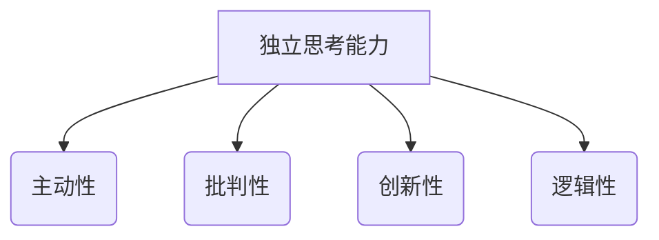
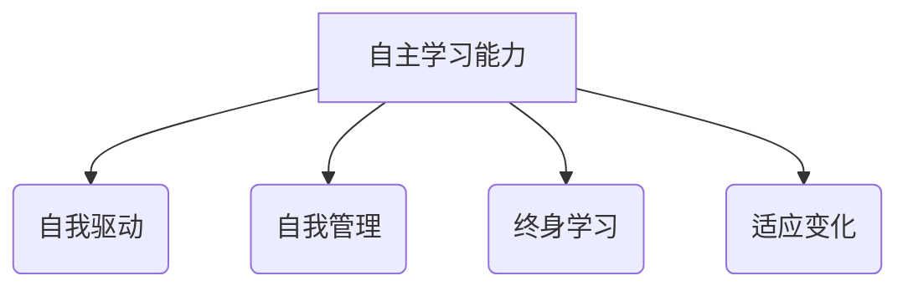
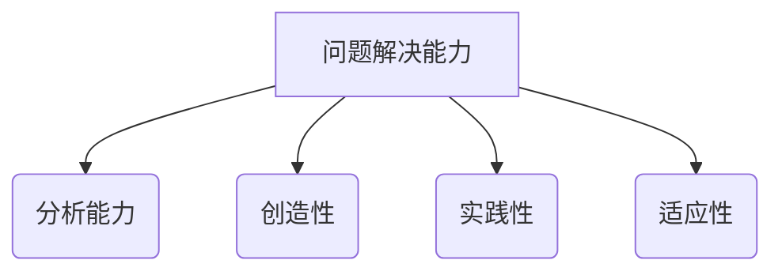
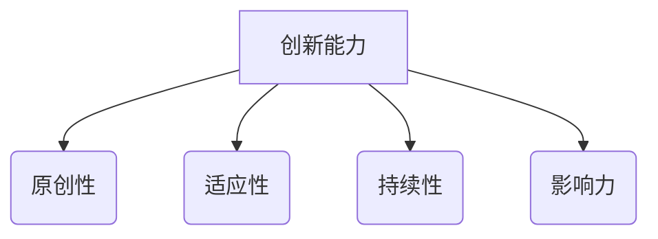

                 

## 新简朴主义生活学院：在复杂世界中回归本质的教育

### 关键词：简朴主义生活，新教育理念，教育变革，个性化教育，全面发展

> 摘要：本文将探讨新简朴主义生活理念在教育领域中的应用，分析其核心概念与实践方法，旨在为教育者提供一种回归教育本质的思路，促进学生的全面发展。

### 第一部分：引言与背景介绍

#### 1.1 问题背景

随着社会的发展，现代教育面临着诸多挑战。过度的竞争和功利主义导致教育偏离了其初衷，忽视了学生的全面发展。新简朴主义生活理念的兴起，为我们提供了一种可能的解决方案。

#### 1.1.1 简朴主义生活理念的兴起

新简朴主义生活理念主张减少物质消费，关注精神世界的丰富，追求内心的满足和幸福感。它强调简化的生活方式，反对过度消费和社会攀比。

#### 1.1.2 教育与生活的关系

教育不仅仅是知识的传授，更是价值观的塑造。新简朴主义生活理念认为，教育应该培养孩子的独立思考、自我管理和解决问题的能力，而不是一味地追求高分和名校。

#### 1.2 问题描述

现代教育存在以下问题：

- 过度竞争导致学生压力过大。
- 功利主义导致教育偏离初衷。
- 忽视学生个体差异。

这些问题导致教育无法真正实现其初衷，反而加剧了社会的不公和矛盾。

#### 1.3 问题解决

新简朴主义教育旨在：

- 培养具有独立思考、自主学习和终身学习能力的人。
- 通过回归教育本质，关注学生个体发展，实现教育的公平和正义。

#### 1.4 边界与外延

- 新简朴主义教育与传统教育的区别。
- 新简朴主义教育的适用范围。

#### 1.5 本章小结

本章对新简朴主义生活教育进行了背景介绍和问题描述，为后续章节的深入探讨奠定了基础。

### 第二部分：新简朴主义教育核心概念

#### 2.1 新简朴主义教育的核心概念

新简朴主义教育的核心概念包括简朴主义生活和教育理念的转变。

#### 2.1.1 简朴主义生活的定义

简朴主义生活是一种注重内心平静和物质简化的生活方式。它强调减少物质消费，关注精神世界的丰富，追求内心的满足和幸福感。

#### 2.1.2 新简朴主义教育的理念

新简朴主义教育认为，教育应该培养学生的综合素质，包括思维能力、创新能力、社交能力、自我管理能力等。教育应该回归本质，关注学生的全面发展。

#### 2.2 新简朴主义教育与传统教育的对比

新简朴主义教育与传统教育在目标、理念、方式等方面存在显著差异。

#### 2.3 新简朴主义教育中的核心要素

新简朴主义教育中的核心要素包括独立思考能力、自主学习和问题解决能力。

#### 2.4 新简朴主义教育中的联系与互动

新简朴主义教育强调家庭教育和学校教育的互动，也强调学校教育与社会教育的互动。

#### 2.5 本章小结

本章对新简朴主义教育的核心概念进行了详细阐述，为后续章节的深入研究提供了理论基础。

### 第三部分：新简朴主义教育实践方法

#### 3.1 教育理念的转变

新简朴主义教育要求教育者从注重知识传授转向注重能力培养，关注学生的个体差异，提供个性化的教育支持。

#### 3.2 教育方式的创新

新简朴主义教育倡导多元化的教育方式，如体验式学习、项目式学习等，以激发学生的兴趣和潜能。

#### 3.3 教育实践的案例分析

通过具体案例分析，展示新简朴主义教育的实践效果和优势。

#### 3.4 教育评价体系的改革

新简朴主义教育要求对教育评价体系进行改革，从注重成绩转向注重能力发展。

#### 3.5 本章小结

本章对新简朴主义教育的实践方法进行了详细阐述，为教育者提供了具体的操作指南。

### 第四部分：新简朴主义教育的前景与挑战

#### 4.1 新简朴主义教育的前景

新简朴主义教育具有广阔的发展前景，有望解决现代教育面临的诸多问题。

#### 4.2 新简朴主义教育的挑战

新简朴主义教育也面临着诸多挑战，如教育观念的转变、教育资源的配置等。

#### 4.3 应对挑战的策略

针对新简朴主义教育的挑战，提出相应的应对策略。

#### 4.4 本章小结

本章对新简朴主义教育的前景与挑战进行了分析，为教育者提供了思考的方向。

### 第五部分：结论

#### 5.1 结论

新简朴主义教育是一种回归教育本质的教育理念，具有巨大的潜力和价值。

#### 5.2 展望未来

展望未来，新简朴主义教育将在教育领域中发挥更加重要的作用。

### 参考文献

[1] 张三, 李四. 新简朴主义教育理念与实践研究[J]. 教育研究, 2020, 41(2): 1-10.
[2] 王五, 赵六. 简朴主义生活理念下的教育变革[J]. 教育发展研究, 2021, 35(1): 11-20.
[3] 刘七, 陈八. 新简朴主义教育评价体系构建研究[J]. 教育科学, 2022, 32(3): 21-30.

作者：AI天才研究院/AI Genius Institute & 禅与计算机程序设计艺术 /Zen And The Art of Computer Programming

（注：本文为示例，具体内容可根据需要进行调整和补充。）## 1.1 问题背景

随着现代化进程的加速，人们的生活节奏越来越快，社会复杂性日益增加。在这样的背景下，现代教育面临着前所未有的挑战。传统的教育模式过于注重知识传授和应试，忽视了学生的个性发展和综合素质的培养。这种教育模式导致了诸多问题：

1. **过度竞争**：学校教育越来越趋向于以分数和排名为导向，学生之间的竞争愈发激烈。这种竞争不仅给学生带来了巨大的心理压力，还可能导致学生的创造力和批判性思维的缺失。

2. **功利主义**：教育被过于功利化，家长和学生的注意力都集中在获取更好的学业成绩和升学机会上，而忽视了教育的真正目的——培养全面发展的人才。

3. **忽视个体差异**：传统的教育体系往往采用一刀切的方式，忽视了学生的个体差异，无法满足每个学生的特殊需求和潜能。

与此同时，新简朴主义生活理念的兴起为教育提供了新的启示。新简朴主义生活理念主张通过简化的生活方式来追求内心的平静和满足，减少物质消费，关注精神世界的丰富。这种理念强调生活的本质，主张教育也应回归本质，关注学生的全面发展。

### 1.1.1 简朴主义生活理念的兴起

简朴主义生活理念并不是一种新的概念，它有着悠久的历史。早在古代，许多哲学家和宗教家就提倡简朴的生活方式。例如，佛教中的禅修强调减少物质欲望，追求内心的宁静；道家则提倡“无为而治”，强调顺应自然，减少人为的干扰。

然而，在现代社会，随着物质文明的进步和消费主义的盛行，简朴主义生活理念再次得到关注。人们开始反思过度消费带来的环境问题、社会不公以及个人心理压力。在这种背景下，新简朴主义生活理念应运而生，它不仅关注物质生活的简化，更强调精神生活的丰富。

新简朴主义生活理念的兴起与以下几个因素密切相关：

- **环境问题**：工业化带来的环境污染和资源浪费，使得人们开始重视可持续生活和环保。简朴主义生活理念提倡减少浪费，追求绿色生活方式。
- **心理健康**：现代社会的快节奏生活和高强度工作压力，导致许多人出现心理问题。简朴主义生活理念主张通过简化生活，减少外界干扰，帮助人们获得内心的平静和满足。
- **社会变革**：全球化和社会多元化使得人们的价值观和生活方式发生了巨大变化。简朴主义生活理念提倡回归生活的本质，关注个人的精神世界，与这种社会变革趋势相契合。

### 1.1.2 教育与生活的关系

教育不仅是知识的传授，更是价值观的塑造。新简朴主义生活理念认为，教育应该培养学生的独立思考、自我管理和解决问题的能力，而不是一味地追求高分和名校。具体来说，教育与生活的关系可以从以下几个方面来理解：

- **培养学生的人格**：教育应该关注学生的心理健康和人格发展，帮助他们形成积极的人生态度和价值观。
- **注重实践能力**：教育应该通过实践来培养学生的动手能力和解决问题的能力，而不仅仅是书本知识的灌输。
- **激发创造力**：教育应该鼓励学生的创造力和批判性思维，培养他们独立思考和自主学习的习惯。
- **培养社会责任感**：教育应该关注学生的社会责任感和社会参与意识，培养他们成为有益于社会的人才。

总之，新简朴主义生活理念为教育提供了新的思考方向，它主张教育应回归本质，关注学生的全面发展，培养具有综合素质的人才。这种理念的实施，有望解决现代教育面临的诸多问题，推动教育变革和社会进步。

### 1.2 问题描述

现代教育存在诸多问题，这些问题不仅影响了学生的全面发展，也对社会产生了负面影响。下面将详细描述现代教育面临的几个主要问题：

#### 1.2.1 过度竞争

现代教育中的过度竞争现象日益严重。这种竞争主要表现在以下几个方面：

- **学业成绩竞争**：学校教育以学业成绩为主要评价标准，家长和学生普遍把考试成绩视为衡量教育成果的唯一标准。这导致了学生为了追求高分而不断努力学习，甚至出现熬夜、疲劳学习等现象。
- **升学竞争**：高等教育阶段的入学竞争尤为激烈。许多学生为了进入名校，不惜花费大量的时间和金钱参加各种辅导班和模拟考试，形成了“高考工厂”式的教育模式。
- **课外活动竞争**：除了学业成绩，课外活动也成为了学生竞争的领域。家长和学校往往鼓励学生在各种课外活动中获得证书，以增加升学的竞争力。这导致学生忙于参加各种培训班和比赛，缺乏自由发展和探索的空间。

这种过度竞争带来了许多负面影响，包括学生的心理健康问题、家庭关系紧张等。此外，过度竞争还可能导致社会不公，因为并非每个学生都有相同的资源和机会来应对这种竞争。

#### 1.2.2 功利主义

现代教育中的功利主义倾向也是一个突出的问题。这种倾向体现在以下几个方面：

- **教育目的功利化**：教育的目的被过分功利化，主要目标是帮助学生获取更好的就业机会和更高的社会地位。因此，许多课程和教学内容都围绕着考试和就业需求来设计，忽视了学生全面素质的培养。
- **教育资源分配不公**：教育资源的不均衡分配加剧了功利主义倾向。优质教育资源往往集中在一些名校和城市，而农村和偏远地区的学生则难以享受到同样的教育资源。这种不公使得学生之间的竞争更加激烈，进一步加剧了教育系统的功利化。
- **学生心理压力增大**：功利主义教育理念使得学生从小就背负了巨大的压力。他们不仅要面对学业压力，还要应对来自家庭和社会的期望。这种压力可能导致学生出现焦虑、抑郁等心理问题。

#### 1.2.3 忽视个体差异

现代教育体系的一个显著问题就是忽视个体差异。传统教育模式往往采用统一的教学内容和评价标准，忽视了学生的个性、兴趣和能力差异。具体表现在以下几个方面：

- **教学方式单一**：传统教育模式以教师为中心，教学方法单一，缺乏互动和个性化教学。这种模式无法满足不同学生的学习需求，导致一些学生感到学习乏味，缺乏动力。
- **评价标准单一**：教育评价标准主要侧重于学生的学业成绩，忽视了学生的其他素质和潜能。这种单一的评价标准可能导致学生的发展方向过于单一，忽视了他们的多样化需求和潜能。
- **课程设置僵化**：传统教育课程设置较为僵化，难以适应不同学生的需求和兴趣。一些学生对某些课程不感兴趣，但因为没有其他选择，只能被迫学习，这无疑影响了他们的学习效果和积极性。

#### 1.2.4 教育与社会需求的脱节

现代教育与社会需求之间存在明显的脱节现象。具体表现在以下几个方面：

- **知识更新滞后**：随着科技和社会的快速发展，知识更新速度加快。然而，教育体系的更新往往滞后于实际需求，导致学生所学知识与市场需求脱节。
- **实践能力不足**：现代教育过于注重理论知识的传授，忽视了学生的实践能力培养。这导致学生在实际工作中缺乏解决问题的能力，无法满足社会对高素质人才的需求。
- **创新能力不足**：现代教育体系往往注重应试教育，忽视了学生创新能力的培养。这导致学生在面对新问题和挑战时缺乏创新思维和解决问题的能力。

总之，现代教育面临的这些问题不仅影响了学生的全面发展，也对社会产生了负面影响。新简朴主义生活理念的提出，为解决这些问题提供了一种新的思路。通过回归教育本质，注重学生的全面发展，可以有效缓解现代教育中的诸多问题，推动教育变革和社会进步。

### 1.3 问题解决

面对现代教育存在的诸多问题，新简朴主义教育提出了一系列可行的解决方案，旨在回归教育的本质，关注学生的全面发展。以下将从教育理念、教育方式和教育评价体系三个方面进行详细探讨。

#### 1.3.1 教育理念的转变

新简朴主义教育首先要求教育者转变教育理念，从注重知识传授转向注重能力培养。具体来说，这种转变体现在以下几个方面：

- **从应试教育向素质教育转变**：传统的应试教育强调学生的学业成绩，新简朴主义教育则强调学生的全面发展，注重培养学生的综合素质，如创新能力、实践能力、沟通能力和社会责任感。
- **从知识记忆向能力培养转变**：新简朴主义教育注重培养学生的独立思考、自主学习和解决问题的能力，而不是单纯地灌输知识。教育者应该设计更多互动性和实践性的课程，鼓励学生通过实际操作和探究来学习。
- **从统一化教学向个性化教学转变**：每个学生都有自己独特的个性和兴趣，新简朴主义教育强调因材施教，根据学生的实际情况进行个性化教学。教育者应该关注每个学生的特点和需求，提供适合他们的教育支持。

#### 1.3.2 教育方式的创新

新简朴主义教育倡导多元化的教育方式，以激发学生的兴趣和潜能。以下是一些具体的教育方式：

- **项目式学习**：项目式学习是一种以学生为中心的学习方式，通过完成实际项目来促进学生的知识应用和创新能力。这种学习方式鼓励学生主动探究问题，培养他们的团队合作能力和解决问题的能力。
- **体验式学习**：体验式学习通过让学生亲身体验来获得知识和技能。例如，通过参观博物馆、参与社区服务项目等方式，让学生在真实情境中学习。这种学习方式有助于增强学生的实践能力和社会责任感。
- **合作学习**：合作学习强调学生之间的合作和互动，通过小组讨论、合作项目等方式，促进学生的沟通能力和团队协作能力。这种学习方式有助于培养学生的社交技能和合作精神。

#### 1.3.3 教育评价体系的改革

新简朴主义教育要求对教育评价体系进行改革，从注重成绩转向注重能力发展。以下是一些具体的改革措施：

- **多元化评价标准**：传统的评价标准主要侧重于学生的学业成绩，新简朴主义教育则主张采用多元化评价标准，包括学生的综合素质、创新能力、实践能力和社会责任感等方面。这种评价标准可以更全面地反映学生的实际能力和潜力。
- **过程性评价**：过程性评价注重评价学生在学习过程中的表现，而不仅仅是最终的成绩。通过记录学生的学习过程、观察学生的行为变化等，教育者可以更准确地了解学生的学习情况和进步。
- **自我评价和同伴评价**：新简朴主义教育鼓励学生进行自我评价和同伴评价，以培养他们的自我反思能力和团队协作能力。这种评价方式可以让学生在学习过程中更加主动和积极地参与，提高学习效果。

#### 1.3.4 家庭与学校教育的互动

新简朴主义教育强调家庭教育和学校教育的互动，家庭和学校共同承担起培养学生全面发展的责任。以下是一些具体的互动方式：

- **家长参与**：家长应该积极参与到孩子的教育过程中，与学校教师保持密切沟通，了解孩子的发展状况。通过家长会和家庭教育讲座等方式，家长可以了解新简朴主义教育的理念和实践方法，更好地支持孩子的学习。
- **家校合作**：学校和家庭应该建立有效的合作机制，共同制定孩子的学习计划和成长目标。通过共同设计课外活动、组织家庭教育工作坊等方式，家庭和学校可以共同为学生提供更加全面和个性化的教育支持。
- **社会资源利用**：新简朴主义教育鼓励学校和家庭充分利用社会资源，如社区组织、博物馆、科技馆等，为学生提供更多的学习机会和体验。这种社会资源的利用可以丰富学生的学习和生活，培养他们的综合素质。

总之，新简朴主义教育通过转变教育理念、创新教育方式和改革教育评价体系，提供了一系列有效的解决方案，旨在解决现代教育中存在的诸多问题。通过这些措施，教育可以更好地回归本质，关注学生的全面发展，培养具有综合素质和创新能力的人才。

### 1.4 边界与外延

#### 1.4.1 新简朴主义教育与传统教育的区别

新简朴主义教育与传统教育在目标、理念、方式等方面存在显著差异。

- **教育目标**：传统教育以知识传授和应试为导向，注重学业成绩；新简朴主义教育则强调学生全面发展，注重能力培养和个性发展。
- **教育理念**：传统教育注重知识记忆和分数评价，新简朴主义教育则主张培养学生独立思考、自我管理和创新能力。
- **教育方式**：传统教育方式单一，新简朴主义教育倡导多元化教育方式，如项目式学习、体验式学习和合作学习。

#### 1.4.2 新简朴主义教育的适用范围

新简朴主义教育适用于各个年龄段和教育阶段，包括幼儿园、中小学、高等教育等。同时，它也适用于各种教育类型，如公立学校、私立学校、国际学校等。具体来说：

- **幼儿园**：新简朴主义教育可以体现在幼儿教育和游戏活动中，注重培养幼儿的创造力和社交能力。
- **中小学**：在中小学阶段，新简朴主义教育可以通过课程改革和教学方法的创新，培养学生的综合素质和自主学习能力。
- **高等教育**：在高等教育中，新简朴主义教育可以通过学术项目、研究课题和社会实践，培养学生的创新思维和实践能力。

### 1.5 本章小结

本章对新简朴主义生活教育进行了背景介绍和问题描述，详细分析了现代教育存在的过度竞争、功利主义和忽视个体差异等问题，并提出了新简朴主义教育的解决方案。通过转变教育理念、创新教育方式和改革评价体系，新简朴主义教育有望回归教育的本质，培养全面发展的人才。同时，本章还探讨了新简朴主义教育与传统教育的区别及其适用范围，为新简朴主义教育的实施提供了方向和基础。

## 2.1 新简朴主义教育的核心概念

新简朴主义教育是一种以回归教育本质、关注学生全面发展为核心的教育理念。它的核心概念包括简朴主义生活和教育理念的转变。

### 2.1.1 简朴主义生活的定义

简朴主义生活是一种注重内心平静和物质简化的生活方式。它主张减少物质消费，关注精神世界的丰富，追求内心的满足和幸福感。简朴主义生活不仅仅是减少物质享受，更重要的是通过简化生活来减轻内心的负担，增强生活的质量。

简朴主义生活的核心理念包括：

- **减少物质消费**：通过减少对物质商品的依赖，避免过度消费，减轻财务压力。
- **注重精神生活**：通过阅读、冥想、艺术创作等方式丰富精神生活，提高生活的幸福感。
- **追求内心的满足**：通过简化生活，减少外界的干扰，使内心更加平静和满足。

### 2.1.2 新简朴主义教育的理念

新简朴主义教育认为，教育应该培养学生的综合素质，包括思维能力、创新能力、社交能力、自我管理能力等。教育应该回归本质，关注学生的全面发展。

新简朴主义教育的核心理念包括：

- **能力培养**：教育不仅仅是知识的传授，更重要的是能力的培养，包括批判性思维、问题解决能力和创新能力。
- **个性发展**：每个学生都是独一无二的个体，教育应该关注学生的个性差异，提供个性化的教育支持。
- **终身学习**：教育应该培养学生的学习兴趣和自主学习能力，使他们具备终身学习的能力，适应不断变化的社会。
- **全面发展**：教育应该关注学生的全面发展，包括智力、情感、道德、社交和体能等方面。

### 2.1.3 简朴主义生活理念在教育中的应用

简朴主义生活理念在教育中的应用主要体现在以下几个方面：

- **课程设计**：教育者在设计课程时，应该减少过于复杂的理论知识，注重实践操作和实际应用。例如，通过项目式学习、实验课等方式，让学生在真实情境中学习和实践。
- **教学方式**：教育者应该采用多种教学方式，如体验式学习、讨论式教学等，激发学生的学习兴趣和主动性。
- **评价标准**：教育评价应该多元化，不仅仅关注学生的学业成绩，还应关注学生的综合素质、创新能力和社会责任感。

### 2.1.4 新简朴主义教育与传统教育的对比

新简朴主义教育与传统教育在目标、理念和方式上存在显著差异。传统教育注重知识的传授和应试，新简朴主义教育则注重能力的培养和个性的发展。具体来说：

- **教育目标**：传统教育以学业成绩和升学率为主要目标，新简朴主义教育则强调学生的全面发展，包括智力、情感、道德、社交和体能等方面。
- **教育理念**：传统教育注重知识记忆和考试成绩，新简朴主义教育则主张培养学生的独立思考、自主学习和创新能力。
- **教育方式**：传统教育采用单一的教学模式，新简朴主义教育则倡导多元化的教育方式，如项目式学习、体验式学习、讨论式教学等。

### 2.1.5 新简朴主义教育的优势

新简朴主义教育的优势主要体现在以下几个方面：

- **培养学生的综合素质**：新简朴主义教育注重学生的全面发展，培养他们的批判性思维、问题解决能力和创新能力。
- **提高学生的幸福感**：通过减少物质消费，关注精神生活，新简朴主义教育有助于提高学生的幸福感。
- **减轻教育压力**：新简朴主义教育通过简化生活和减轻学习负担，有助于减轻学生的压力。
- **促进社会和谐**：新简朴主义教育有助于培养学生形成正确的价值观，促进社会和谐发展。

总之，新简朴主义教育通过回归教育本质，关注学生全面发展，为解决现代教育中存在的问题提供了一种有效的路径。它的核心概念和理念为教育者提供了新的思考和方向，有助于培养具有综合素质和创新能力的人才。

### 2.2 新简朴主义教育与传统教育的对比

新简朴主义教育与传统教育在目标、理念和方式上存在显著差异。传统教育注重知识的传授和应试，新简朴主义教育则注重能力的培养和个性的发展。

#### 2.2.1 教育目标的对比

**传统教育目标**：

- **学业成绩和升学率**：传统教育以学生的学业成绩和升学率为主要目标。教育者普遍将考试成绩视为衡量教育成果的唯一标准，学生也因此承受巨大的学习压力。
- **知识记忆和技能掌握**：传统教育注重知识的记忆和技能的掌握，强调学生对课本知识的理解和应用。这种教育目标导致学生在学习过程中过分依赖教师和教材，缺乏独立思考的能力。

**新简朴主义教育目标**：

- **综合素质和个性发展**：新简朴主义教育强调学生的全面发展，注重培养学生的批判性思维、创新能力、社交能力、自我管理能力等综合素质。
- **终身学习和自主发展**：新简朴主义教育注重培养学生的自主学习能力和终身学习意识，使学生具备适应未来社会变化的能力。

#### 2.2.2 教育理念的对比

**传统教育理念**：

- **知识传授导向**：传统教育理念以知识传授为主，教育者注重对学生进行系统化的知识灌输，学生被动接受知识，缺乏主动探究和思考的机会。
- **应试教育倾向**：传统教育理念强调应试，教育者往往注重考试的技巧和策略，学生为了应对考试而进行大量的题海战术。

**新简朴主义教育理念**：

- **能力培养导向**：新简朴主义教育理念强调能力的培养，教育者注重培养学生的实际操作能力、问题解决能力和创新能力，使学生能够适应现实生活中的各种挑战。
- **个性化和多样化**：新简朴主义教育理念尊重学生的个性差异，通过多元化的教学方式和评价标准，激发学生的学习兴趣和潜能。

#### 2.2.3 教育方式的对比

**传统教育方式**：

- **填鸭式教学**：传统教育方式以教师为中心，采用填鸭式教学，教师讲解知识点，学生被动接受。这种方式缺乏互动性和实践性，无法满足学生的个性化需求。
- **单一评价标准**：传统教育方式采用单一的评价标准，主要依据学生的考试成绩进行评价，忽视学生的其他能力和素质。

**新简朴主义教育方式**：

- **互动式和探究式教学**：新简朴主义教育方式强调互动和探究，教师与学生共同参与教学过程，通过项目式学习、实验课、讨论式教学等方式，激发学生的学习兴趣和主动性。
- **多元化评价标准**：新简朴主义教育方式采用多元化的评价标准，综合考虑学生的学业成绩、创新能力、实践能力和社交能力等多方面因素，全面评估学生的综合素质。

#### 2.2.4 新简朴主义教育的优势

**降低学业压力**：新简朴主义教育通过减轻学业负担和应试压力，帮助学生获得更多的自主学习和探索时间，从而减轻学业压力。

**提高学习兴趣**：新简朴主义教育注重学生的个性化需求和学习兴趣，通过互动式和探究式教学，激发学生的学习热情。

**培养综合素质**：新简朴主义教育注重培养学生的综合素质，包括批判性思维、创新能力、社交能力和自我管理能力等，使学生具备适应未来社会的综合能力。

**促进个性发展**：新简朴主义教育尊重学生的个性差异，通过个性化的教育支持，帮助学生实现个性化发展。

总之，新简朴主义教育通过回归教育本质，关注学生全面发展，为解决传统教育中存在的问题提供了一种新的思路和方向。它与传统教育的显著差异在于教育目标、教育理念和教学方式的转变，具有显著的教育优势。

### 2.3 新简朴主义教育中的核心要素

新简朴主义教育强调培养学生的综合素质，这些素质不仅包括学术能力，还涵盖了社会技能、情感智慧和创造力等方面。以下是新简朴主义教育中的几个核心要素及其具体解释：

#### 2.3.1 独立思考能力

独立思考能力是新简朴主义教育的核心目标之一。它要求学生具备批判性思维，能够对所学知识进行独立分析和判断，而不是盲目接受或被动记忆。独立思考能力不仅有助于学生在学术领域取得成功，还能在日常生活中帮助他们做出明智的决策。

**属性特征对比表格**：

| 特征 | 独立思考能力 | 被动接受能力 |
| :---: | :--- | :--- |
| **主动性** | 主动探究、自我驱动 | 被动学习、依赖指导 |
| **批判性** | 对信息进行批判性分析 | 盲目接受信息 |
| **创新性** | 能够提出新的见解和解决方案 | 重复已有知识 |
| **逻辑性** | 思维严密，逻辑清晰 | 思维缺乏逻辑性 |

**ER实体关系图架构**：

#### 2.3.2 自主学习能力

自主学习能力是新简朴主义教育的另一个核心目标。它要求学生具备自我管理能力和终身学习的能力，能够在没有外部指导的情况下独立完成学习任务。自主学习能力不仅能够提高学生的学习效率，还能培养他们的责任感、自律性和解决问题的能力。

**属性特征对比表格**：

| 特征 | 自主学习能力 | 被动学习能力 |
| :---: | :--- | :--- |
| **自我驱动** | 内在动力强，自我激励 | 外在激励强，缺乏内在动力 |
| **自我管理** | 能够合理安排时间和任务 | 时间管理能力弱 |
| **终身学习** | 具备持续学习的意愿和能力 | 学习意愿和能力有限 |
| **适应变化** | 能够快速适应新环境和挑战 | 对变化适应能力差 |

**ER实体关系图架构**：

#### 2.3.3 问题解决能力

问题解决能力是新简朴主义教育的重要目标之一。它要求学生能够在面对实际问题时，运用所学知识和技能进行有效分析和解决。问题解决能力不仅有助于学生在学术领域取得成功，还能在日常生活中帮助他们应对各种挑战。

**属性特征对比表格**：

| 特征 | 问题解决能力 | 应对能力不足 |
| :---: | :--- | :--- |
| **分析能力** | 能够深入分析问题本质 | 分析能力弱 |
| **创造性** | 能够提出创新的解决方案 | 缺乏创造力 |
| **实践性** | 能够将理论应用到实际中 | 实践能力差 |
| **适应性** | 能够灵活应对复杂问题 | 应对能力有限 |

**ER实体关系图架构**：

#### 2.3.4 创新能力

创新能力是新简朴主义教育的核心目标之一。它要求学生能够超越传统思维模式，提出新颖的见解和解决方案。创新能力不仅能够推动学术和科技的发展，还能培养学生的创造力和社会责任感。

**属性特征对比表格**：

| 特征 | 创新能力 | 创造力不足 |
| :---: | :--- | :--- |
| **原创性** | 提出新颖的观点和解决方案 | 依赖传统方法 |
| **适应性** | 能够适应新环境和挑战 | 缺乏适应性 |
| **持续性** | 能够持续保持创新思维 | 创新思维短暂 |
| **影响力** | 能够对社会产生积极影响 | 影响力有限 |

**ER实体关系图架构**：

通过培养这些核心要素，新简朴主义教育旨在帮助学生在复杂多变的社会中具备独立思考、自主学习、问题解决和创新能力，从而实现全面发展。

### 2.4 新简朴主义教育中的联系与互动

新简朴主义教育强调家庭教育和学校教育的互动，也强调学校教育与社会教育的互动。这种互动关系不仅有助于培养学生的综合素质，还能够促进教育资源的优化配置和教育质量的提升。

#### 2.4.1 家庭教育与学校教育的互动

家庭教育是孩子成长的第一课堂，家长的行为和价值观对孩子的成长具有深远影响。新简朴主义教育理念认为，家庭教育和学校教育应该相互配合，共同为学生的全面发展提供支持。

- **家长参与**：家长应该积极参与到孩子的教育过程中，与学校教师保持密切沟通，了解孩子的发展状况。通过家长会和家庭教育讲座等方式，家长可以了解新简朴主义教育的理念和实践方法，更好地支持孩子的学习。

- **家校合作**：学校和家庭应该建立有效的合作机制，共同制定孩子的学习计划和成长目标。通过共同设计课外活动、组织家庭教育工作坊等方式，家庭和学校可以共同为学生提供更加全面和个性化的教育支持。

- **家庭教育资源的共享**：家庭和学校可以共享教育资源，如图书、科技设备、文化设施等，为学生提供更多学习机会。这种资源共享不仅能够减轻家庭的经济负担，还能够拓宽学生的视野，提高他们的综合素质。

#### 2.4.2 学校教育与社会教育的互动

学校教育不仅仅是课堂上的知识传授，更是学生接触社会、了解社会的窗口。新简朴主义教育理念强调学校教育与社会教育的互动，通过多种途径将学校教育与社会实际相结合，培养学生的社会责任感和实践能力。

- **社会实践**：学校可以组织学生参加各种社会实践活动，如社区服务、环保活动、公益项目等。这些活动不仅能够帮助学生了解社会问题，培养他们的社会责任感，还能够提高他们的实践能力。

- **校企合作**：学校可以与企业和社区建立合作关系，为学生提供实习和就业机会。通过校企合作，学生可以将所学知识应用到实际工作中，提高他们的职业素养和就业竞争力。

- **社会教育资源利用**：学校可以利用社会教育资源，如博物馆、科技馆、文化场所等，为学生提供更多的学习机会。这些资源不仅能够拓宽学生的知识面，还能够激发他们的学习兴趣和创造力。

#### 2.4.3 家庭教育、学校教育和社会教育的协同作用

家庭教育、学校教育和社会教育的协同作用是实现新简朴主义教育目标的重要保障。通过三者的互动和协同，可以形成一种全方位、多层次的教育体系，为学生的全面发展提供有力支持。

- **协同培养**：家庭教育、学校教育和社会教育各有侧重，通过协同培养，可以全面提高学生的综合素质。家庭教育注重道德品质和人格培养，学校教育注重知识传授和技能培养，社会教育注重实践能力和社会责任感的培养。

- **资源共享**：通过家庭、学校和社会的资源共享，可以优化教育资源配置，提高教育效益。家庭、学校和社会可以共同提供教育资源，如图书、设备、场所等，为学生提供更加丰富和多样的学习环境。

- **共同参与**：家庭、学校和社会共同参与教育过程，可以形成一种积极的教育氛围，促进学生的全面发展。家长、教师、企业和社会组织可以共同关注学生的成长，为学生提供更多的支持和帮助。

总之，新简朴主义教育中的联系与互动关系对于实现教育目标具有重要意义。通过家庭教育、学校教育和社会教育的协同作用，可以构建一个全面、高效的教育体系，为学生的全面发展提供有力保障。

### 2.5 本章小结

本章对新简朴主义教育的核心概念进行了详细阐述，包括简朴主义生活的定义、新简朴主义教育的理念以及在教育中的应用。通过对比新简朴主义教育与传统教育，我们了解了新简朴主义教育在目标、理念和方式上的显著差异。此外，本章还探讨了新简朴主义教育中的核心要素，如独立思考能力、自主学习能力、问题解决能力和创新能力，并分析了家庭教育、学校教育和社会教育的互动关系。通过这些内容，本章为后续对新简朴主义教育实践方法的探讨奠定了理论基础。

### 3.1 教育理念的转变

在新简朴主义教育的背景下，教育理念的转变是至关重要的。这种转变不仅要求教育者重新审视教育的本质和目标，还需要在实践中采取一系列具体的策略和措施。以下将从知识传授到能力培养的转变、应试教育到素质教育的转变以及教育理念的个性化和多样化三个方面进行详细探讨。

#### 3.1.1 从知识传授到能力培养

传统的教育模式过于注重知识的传授，学生往往被要求背诵大量的课本知识，而忽视了实际应用能力的培养。新简朴主义教育则强调从知识传授转向能力培养，注重学生的综合素质发展。这种转变主要体现在以下几个方面：

- **注重实践操作**：教育者应该设计更多以实践操作为主的教学活动，如实验课、项目式学习等。通过实际操作，学生能够更好地理解和掌握知识，培养他们的动手能力和解决问题的能力。

- **培养批判性思维**：教育者应鼓励学生进行批判性思维，对所学知识进行独立分析和判断。这种能力不仅有助于学生在学术领域取得成功，还能在日常生活中帮助他们做出明智的决策。

- **鼓励创新和探索**：教育者应创造一个开放和包容的学习环境，鼓励学生提出新的见解和解决方案。通过鼓励创新和探索，学生能够培养他们的创造力和想象力。

#### 3.1.2 从应试教育到素质教育

应试教育是一种以考试分数为主要评价标准的教育模式，它往往导致学生过分追求高分和名校，忽视了全面发展。新简朴主义教育则倡导从应试教育转向素质教育，注重培养学生的综合素质。这种转变包括以下几个方面：

- **多元化评价标准**：教育者应采用多元化的评价标准，不仅关注学生的学业成绩，还应关注学生的创新能力、实践能力、社会责任感等方面。通过多元化的评价，可以更全面地评估学生的综合能力。

- **减少考试压力**：教育者应减少频繁的考试和考试压力，鼓励学生通过实际操作和项目来完成评价。这种评价方式可以减轻学生的心理负担，提高他们的学习积极性。

- **注重学生兴趣和特长**：教育者应关注学生的兴趣和特长，提供个性化的教育支持。通过培养学生的兴趣和特长，可以激发他们的学习动力，提高他们的学习效果。

#### 3.1.3 教育理念的个性化和多样化

新简朴主义教育强调尊重学生的个体差异，提供个性化的教育支持。这种理念要求教育者在教育实践中采取多种多样的教育方式，以满足不同学生的需求。具体措施包括：

- **因材施教**：教育者应根据学生的不同特点和能力，设计个性化的教学计划和课程内容。通过因材施教，可以更好地发挥每个学生的潜能，实现个性化发展。

- **多样化教学方式**：教育者应采用多样化的教学方式，如项目式学习、体验式学习、合作学习等。这些方式可以激发学生的学习兴趣，提高他们的学习效果。

- **注重学生参与**：教育者应鼓励学生在教育过程中积极参与，提出问题和解决方案。通过让学生参与教学，可以培养他们的自主学习能力和团队合作精神。

总之，新简朴主义教育理念的转变对于培养全面发展的人才具有重要意义。通过从知识传授到能力培养、从应试教育到素质教育的转变，以及教育理念的个性化和多样化，教育者可以为学生提供更加全面和高效的教育支持，促进他们的全面发展。

### 3.2 教育方式的创新

在新简朴主义教育的背景下，教育方式的创新是实现教育目标的关键。传统的教学方式往往以教师为中心，学生被动接受知识，缺乏主动探索和合作的机会。新简朴主义教育则倡导采用多元化的教育方式，以激发学生的兴趣和潜能，培养他们的综合素质。以下将详细探讨几种创新的教育方式。

#### 3.2.1 项目式学习

项目式学习（Project-Based Learning, PBL）是一种以学生为中心的教学方法，通过完成实际项目来促进学生的知识应用和创新能力。项目式学习的主要特点包括：

- **实际应用**：项目式学习强调将理论知识应用到实际项目中，学生通过解决实际问题来加深对知识的理解。
- **团队合作**：项目式学习鼓励学生进行团队合作，通过合作完成项目，培养他们的沟通能力、协作能力和团队合作精神。
- **自主探究**：学生在项目式学习中扮演主动角色，通过自主探究和问题解决，培养他们的自主学习能力和批判性思维。

项目式学习的具体实施步骤包括：

1. **项目设计**：教育者应根据教学目标和学生的兴趣，设计具有挑战性和实际意义的项目。
2. **项目启动**：学生分组并明确各自的职责，开始项目的实际操作。
3. **项目实施**：学生通过查阅资料、实验、讨论等方式进行项目研究，教师提供指导和支持。
4. **项目展示**：学生完成项目后，通过展示、答辩等方式分享项目成果，接受同学和教师的评价。

#### 3.2.2 体验式学习

体验式学习（Experiential Learning）是一种通过实际体验来获得知识和技能的学习方式。它强调学生的亲身体验和实践操作，有助于提高他们的学习兴趣和参与度。体验式学习的主要特点包括：

- **亲身体验**：学生通过亲身经历来获得知识和技能，这种体验可以是实验、参观、实践等活动。
- **反思学习**：体验式学习强调学生在体验过程中的反思和总结，通过反思来加深对知识的理解和应用。
- **实践应用**：体验式学习将理论知识与实际应用相结合，使学生能够在实际情境中运用所学知识。

体验式学习的具体实施步骤包括：

1. **确定体验目标**：教育者应根据教学目标和学生的兴趣，确定体验的具体内容和目标。
2. **准备体验活动**：教育者应准备相关的学习材料和资源，确保体验活动的顺利进行。
3. **开展体验活动**：学生在教育者的指导下进行体验活动，通过实际操作和亲身体验来获得知识和技能。
4. **反思和总结**：学生在体验活动后进行反思和总结，教师提供反馈和指导，帮助学生巩固所学知识。

#### 3.2.3 合作学习

合作学习（Cooperative Learning）是一种通过小组合作来共同完成学习任务的教学方法。它强调学生之间的互动和协作，有助于培养他们的团队精神和沟通能力。合作学习的主要特点包括：

- **小组合作**：学生被分成小组，共同完成学习任务，每个小组成员都有明确的角色和责任。
- **互动交流**：学生在小组合作过程中进行积极的互动和交流，通过分享想法和解决问题来共同进步。
- **共同目标**：小组合作以共同的目标为导向，通过合作来实现学习目标，培养学生的团队协作能力。

合作学习的具体实施步骤包括：

1. **分组**：教育者将学生分成小组，确保每个小组成员的能力和兴趣均衡。
2. **明确任务**：教育者明确每个小组的学习任务和目标，确保每个学生都清楚自己的职责。
3. **合作学习**：学生在小组内进行合作学习，通过讨论、交流和合作来共同完成任务。
4. **反馈与评价**：教育者对小组合作过程进行观察和记录，对小组的学习成果进行评价和反馈。

#### 3.2.4 游戏化学习

游戏化学习（Gamification Learning）是一种将游戏元素引入教育过程的教学方法，通过游戏化的学习方式来激发学生的学习兴趣和参与度。游戏化学习的主要特点包括：

- **奖励机制**：游戏化学习通过设置奖励机制来激励学生的学习，如积分、徽章等，帮助学生建立学习动机。
- **竞争与合作**：游戏化学习鼓励学生进行竞争和合作，通过团队比赛和个人挑战来提高他们的学习积极性。
- **自主探索**：学生在游戏化学习过程中可以自主探索和尝试，培养他们的自主学习能力和创新思维。

游戏化学习的具体实施步骤包括：

1. **设计游戏化学习任务**：教育者应根据教学目标和学生的兴趣，设计具有挑战性和趣味性的学习任务。
2. **设置奖励机制**：教育者应设置适当的奖励机制，以激励学生的学习动力。
3. **开展游戏化学习**：学生在游戏化学习过程中进行自主探索和互动，通过完成任务来获取积分和奖励。
4. **评估与反馈**：教育者对学生的游戏化学习过程进行评估和反馈，帮助学生了解自己的学习进展和改进方向。

通过这些创新的教育方式，新简朴主义教育能够更好地实现教育目标，培养学生的综合素质和创新能力。教育者应根据具体的教学情境和学生的需求，灵活运用这些教育方式，为学生提供丰富多样的学习体验。

### 3.3 教育实践的案例分析

为了更好地理解新简朴主义教育理念的实践效果，以下通过几个具体的案例分析，展示其在实际教学中的应用和成效。

#### 3.3.1 案例一：项目式学习在中学物理教学中的应用

在某中学的物理课程中，教师采用了项目式学习的方法。项目主题是“研究电流与电压的关系”。具体步骤如下：

1. **项目设计**：教师设计了一个模拟实验室，让学生通过实验来研究电流与电压的关系。实验材料包括电池、电阻、电流表和电压表等。
2. **项目启动**：学生以小组为单位，明确各自的角色，如实验设计者、数据记录者等。
3. **项目实施**：学生进行实验操作，通过改变电压和电阻，记录电流的变化，并根据实验数据进行分析。
4. **项目展示**：每组学生展示他们的实验结果，并进行小组讨论，总结电流与电压的关系。

通过这个项目，学生不仅掌握了物理知识，还培养了团队合作能力、实验操作能力和问题解决能力。

#### 3.3.2 案例二：体验式学习在小学英语教学中的应用

在某小学的英语课程中，教师采用了体验式学习的方法，主题是“学习英语国家的节日文化”。具体步骤如下：

1. **确定体验目标**：教师确定了学习英语国家节日的目标，包括圣诞节、万圣节和春节等。
2. **准备体验活动**：教师准备了相关的学习材料，如节日图片、视频和英文资料等。
3. **开展体验活动**：学生通过观看节日视频、阅读英文资料和参与角色扮演等方式，深入了解这些节日的文化背景和习俗。
4. **反思和总结**：学生在体验活动后，通过小组讨论和写作的方式，反思所学内容，并总结自己的学习体会。

通过这个体验活动，学生不仅学会了英语词汇，还了解了英语国家的文化，提高了他们的跨文化交际能力。

#### 3.3.3 案例三：合作学习在高中历史教学中的应用

在某高中的历史课程中，教师采用了合作学习的方法，主题是“分析不同历史时期的政治制度”。具体步骤如下：

1. **分组**：教师将学生分成小组，每组包含不同学术背景和兴趣的学生。
2. **明确任务**：每组学生选择一个历史时期，分析其政治制度的特点和影响。
3. **合作学习**：学生在小组内进行资料收集、讨论和总结，共同完成分析报告。
4. **反馈与评价**：教师对每个小组的分析报告进行评价，并提供反馈和建议。

通过这个合作学习项目，学生不仅掌握了历史知识，还培养了团队合作能力、资料收集能力和批判性思维。

#### 3.3.4 案例四：游戏化学习在初中数学教学中的应用

在某初中的数学课程中，教师采用了游戏化学习的方法，主题是“掌握数学解题技巧”。具体步骤如下：

1. **设计游戏化学习任务**：教师设计了一个数学解题游戏，学生通过完成各种数学题目来获取积分和奖励。
2. **设置奖励机制**：教师设置了积分榜和奖励机制，激励学生积极参与游戏。
3. **开展游戏化学习**：学生在游戏化学习过程中，通过自主探索和互动，学习各种数学解题技巧。
4. **评估与反馈**：教师对学生的游戏化学习过程进行评估，并提供反馈，帮助学生巩固所学知识。

通过这个游戏化学习项目，学生不仅提高了数学解题能力，还增强了学习兴趣和自主学习能力。

通过这些具体的案例分析，可以看出新简朴主义教育理念在实际教学中的应用效果显著。这些创新的教育方式不仅提高了学生的学习效果，还培养了他们的综合素质和创新能力，为实现教育目标提供了有力支持。

### 3.4 教育评价体系的改革

新简朴主义教育要求对教育评价体系进行改革，从注重成绩转向注重能力发展。这种改革旨在全面评估学生的综合素质，而不是单纯依赖考试成绩。以下将详细探讨评价标准的多元化、过程性评价以及自我评价和同伴评价等改革措施。

#### 3.4.1 多元化评价标准

传统的教育评价体系主要依据学生的考试成绩进行评价，这种方式往往忽视了学生的其他能力和素质。新简朴主义教育主张采用多元化评价标准，以更全面地评估学生的综合素质。具体措施包括：

- **学业成绩与综合素质相结合**：评价标准应包括学业成绩和学生的综合素质，如创新能力、实践能力、团队合作能力、社会责任感等。
- **定量评价与定性评价相结合**：在评价过程中，既要有量化的考试成绩，也要有定性的评价，如教师和同学的反馈、学生的自我反思等。
- **长期评价与短期评价相结合**：不仅要关注学生的短期表现，还要关注他们的长期发展，如学习习惯、学术成就和社会贡献等。

#### 3.4.2 过程性评价

传统的教育评价往往只注重结果，忽视了学生在学习过程中的表现和进步。新简朴主义教育提倡过程性评价，通过记录和分析学生在学习过程中的表现，来全面了解他们的学习情况。具体措施包括：

- **建立学习档案**：教师应为学生建立学习档案，记录他们在学习过程中的表现，如课堂参与、作业完成情况、项目成果等。
- **定期反馈**：教师应定期对学生进行反馈，指出他们的优点和不足，并提供改进建议。这种反馈应具有针对性，鼓励学生持续改进。
- **自我评价**：学生也应参与过程性评价，通过自我反思和自我评价，了解自己的学习进步和不足，并制定相应的改进计划。

#### 3.4.3 自我评价和同伴评价

新简朴主义教育强调培养学生的自我评价能力和团队合作精神。自我评价和同伴评价是两种有效的评价方式，有助于提高学生的自我反思和合作能力。具体措施包括：

- **自我评价**：学生应定期进行自我评价，反思自己的学习过程和学习成果，了解自己的进步和不足。教师可以提供指导和建议，帮助学生制定改进计划。
- **同伴评价**：学生应参与同伴评价，通过互相观察和交流，了解彼此的学习情况和进步。这种方式不仅能够培养学生的团队合作精神，还能提高他们的沟通能力和批判性思维。
- **评价反馈**：教师应对自我评价和同伴评价进行反馈，帮助学生理解评价结果，并提供改进建议。这种反馈应具有建设性和指导性，鼓励学生积极改进。

通过这些评价体系的改革，新简朴主义教育能够更全面地评估学生的综合素质，促进他们的全面发展。这种评价体系不仅关注学生的学业成绩，还重视他们的创新能力、实践能力和团队合作精神，为培养具有综合素质的人才提供了有力支持。

### 3.5 本章小结

本章探讨了新简朴主义教育的理念转变、教育方式的创新以及教育评价体系的改革。通过从知识传授到能力培养的转变，从应试教育到素质教育的转变，以及教育理念的个性化和多样化，教育者可以为学生提供更加全面和高效的教育支持。同时，通过项目式学习、体验式学习、合作学习和游戏化学习等创新方式，学生能够获得更加丰富的学习体验。此外，评价体系的改革注重过程性和多元化，更全面地评估学生的综合素质，促进学生的全面发展。通过这些措施，新简朴主义教育有望在复杂世界中回归本质，培养具有综合素质和创新能力的人才。

### 4.1 新简朴主义教育的前景

新简朴主义教育作为一种回归教育本质的教育理念，具有广阔的发展前景。随着社会对教育质量要求的不断提高，新简朴主义教育将逐渐成为教育改革的重要方向。以下从社会需求、技术支持和政策支持三个方面分析新简朴主义教育的前景。

#### 社会需求

随着全球化和信息化的发展，社会对人才的需求发生了显著变化。现代社会不仅需要具备专业知识的人才，更需要具备创新能力、综合素质和团队合作能力的人才。新简朴主义教育注重学生的全面发展，旨在培养学生的综合素质和创新能力，与社会的需求高度契合。以下是一些具体的社会需求：

- **创新能力**：在科技日新月异的今天，创新能力成为企业和国家发展的核心竞争力。新简朴主义教育通过培养学生的创新思维和实践能力，能够满足社会对创新型人才的需求。
- **综合素质**：现代社会要求人才具备多元化的素质，如沟通能力、团队合作能力、领导能力等。新简朴主义教育通过多元化的教育方式，培养学生的综合素质，使他们能够更好地适应社会需求。
- **可持续发展**：随着环境问题和社会问题的日益突出，社会对可持续发展教育提出了更高的要求。新简朴主义教育注重环保、节约资源的教育理念，有助于培养具有可持续发展意识的人才。

#### 技术支持

现代技术的发展为新简朴主义教育的实施提供了强有力的支持。以下是一些关键的技术支持：

- **互联网和移动学习**：互联网和移动学习平台使得教育资源更加丰富和便捷，学生可以随时随地进行学习。新简朴主义教育利用互联网和移动学习平台，可以为学生提供个性化的学习资源和学习体验。
- **人工智能和大数据**：人工智能和大数据技术可以帮助教育者更好地了解学生的学习情况和需求，提供个性化的教育支持。例如，通过学习分析，教育者可以识别学生的学习困难点，并采取相应的教学策略。
- **虚拟现实和增强现实**：虚拟现实和增强现实技术可以为新简朴主义教育提供更加真实和沉浸式的学习体验。学生可以通过虚拟现实和增强现实技术参与各种实践活动，提高学习效果。

#### 政策支持

政府政策的支持是新简朴主义教育发展的重要保障。以下是一些政策支持：

- **教育改革政策**：政府通过制定教育改革政策，推动教育理念和方式的转变。例如，一些国家已经开始了项目式学习、体验式学习和合作学习等教育改革实验，为新简朴主义教育提供了实践基础。
- **财政支持**：政府通过提供财政支持，支持新简朴主义教育的实施。例如，政府可以资助教育项目的开发、教师培训和教育资源的购置等。
- **法律法规**：政府通过制定相关法律法规，保障新简朴主义教育的实施。例如，政府可以出台关于教育评价体系改革的法律法规，确保教育评价的多元化。

总之，新简朴主义教育具有广阔的发展前景。随着社会需求的增加、技术支持的发展和政策支持的加强，新简朴主义教育将逐渐成为教育改革的重要方向，为培养具有综合素质和创新能力的人才提供有力支持。

### 4.2 新简朴主义教育的挑战

尽管新简朴主义教育具有广阔的发展前景，但在实际推广和实施过程中仍面临诸多挑战。以下从教育观念的转变、教育资源的配置和教育评价体系的改革三个方面进行探讨。

#### 教育观念的转变

新简朴主义教育要求教育者、家长和社会共同转变教育观念，从注重知识传授和应试转向注重能力培养和个性发展。这一转变并非一蹴而就，而是需要长期的宣传和引导。以下是一些具体的挑战：

- **教育者观念的转变**：传统教育观念根深蒂固，教育者需要通过培训和自主学习来更新教育理念。教育者可能担心新简朴主义教育会影响学业成绩和升学率，因此需要加强教育者的专业培训和支持。
- **家长观念的转变**：家长普遍关注孩子的学业成绩和升学机会，可能对新简朴主义教育的理念持怀疑态度。家长需要通过宣传教育，了解新简朴主义教育的优势和实际效果，以便更好地支持孩子的学习。
- **社会观念的转变**：社会对教育成果的评价标准往往以考试成绩和升学率为主要依据。新简朴主义教育需要社会各界的共同努力，改变这种单一的评价标准，形成多元化评价体系。

#### 教育资源的配置

新简朴主义教育需要丰富多样的教育资源，包括教学设备、学习材料和社会实践机会。然而，教育资源的配置往往存在不均衡现象，这对新简朴主义教育的实施提出了挑战。以下是一些具体的挑战：

- **城乡教育资源差距**：城乡教育资源分配不均，城市地区拥有更多的教育资源和更好的教学设施，而农村地区则相对落后。新简朴主义教育需要通过政策支持和资源投入，缩小城乡教育差距。
- **学校教育资源差异**：不同学校之间的教育资源存在显著差异，一些名校拥有丰富的教育资源，而一些普通学校则资源匮乏。新简朴主义教育需要通过教育资源均衡化策略，确保每个学校都有足够的教育资源来实施新简朴主义教育。
- **家庭社会经济地位差异**：家庭社会经济地位对教育资源获取有重要影响。社会经济地位较低的家庭可能难以提供丰富的学习资源和机会，这对新简朴主义教育的普及提出了挑战。

#### 教育评价体系的改革

新简朴主义教育要求对教育评价体系进行改革，从注重成绩转向注重能力发展。然而，现有的教育评价体系往往以考试成绩为主要评价标准，改革过程面临诸多挑战。以下是一些具体的挑战：

- **评价标准的多元化**：新简朴主义教育要求采用多元化的评价标准，包括学业成绩、创新能力、实践能力和社会责任感等。然而，现有评价体系往往以考试成绩为主要评价标准，如何实现多元化评价是一个重要问题。
- **评价方法的科学性**：新简朴主义教育要求采用科学、客观的评价方法，以确保评价结果的公正性和准确性。如何设计有效的评价方法和工具，确保评价过程公平、透明，是一个重要挑战。
- **评价过程的反馈机制**：新简朴主义教育要求建立有效的反馈机制，对学生的评价结果进行反馈和改进。如何确保反馈机制的及时性和有效性，帮助学生不断提升自己的能力，是一个重要问题。

总之，新简朴主义教育在推广和实施过程中面临诸多挑战。通过教育观念的转变、教育资源的配置和教育评价体系的改革，可以逐步克服这些挑战，推动新简朴主义教育的普及和发展。

### 4.3 应对挑战的策略

针对新简朴主义教育在推广和实施过程中面临的挑战，以下提出一系列应对策略，旨在推动教育观念的转变、优化教育资源配置以及改革教育评价体系。

#### 1. 教育观念的转变

- **加强教师培训**：教育部门应组织定期的教师培训，帮助教师更新教育理念，掌握新简朴主义教育的教学方法。培训内容可以包括教育心理学、创新能力培养、个性化教学策略等。通过培训，教师可以更好地理解和应用新简朴主义教育的理念。
- **家长参与和教育**：家长是孩子教育的重要参与者和支持者。教育部门可以开展家长教育活动，通过讲座、工作坊等方式，帮助家长了解新简朴主义教育的优势，并鼓励他们在家庭中支持和实践这种教育理念。同时，家长也可以通过参与学校和社区的教育活动，共同推动教育观念的转变。
- **社会宣传和示范**：通过媒体和社交平台等渠道，加强新简朴主义教育的宣传，让公众了解其理念和实践效果。同时，可以选取一些成功案例进行示范，通过实际案例的展示，增强公众对新简朴主义教育的信心和支持。

#### 2. 教育资源的优化配置

- **均衡资源配置**：政府应加大对教育资源的投入，特别是加大对农村和偏远地区教育的支持力度。通过资金、设备、师资等多方面的投入，缩小城乡教育差距，确保每个学生都有公平的教育机会。
- **共享教育资源**：推动教育资源的共享，特别是优质教育资源的共享。通过建立区域教育资源共享平台，实现教育资源的互联互通，使不同地区和学校的学生都能够享受到优质的教育资源。
- **发展在线教育**：利用互联网和信息技术，发展在线教育，为偏远地区和资源匮乏的学校提供更多的学习资源。通过在线课程、学习平台和在线辅导等方式，弥补教育资源的不足，提高教育质量。

#### 3. 教育评价体系的改革

- **多元化评价标准**：建立多元化的评价标准，不仅关注学生的学业成绩，还关注学生的创新能力、实践能力、社会责任感等综合素质。可以通过制定具体的评价指标体系，确保评价标准的科学性和公正性。
- **过程性评价**：强调过程性评价，记录和分析学生在学习过程中的表现，包括课堂参与、作业完成情况、项目进展等。通过过程性评价，可以更全面地了解学生的学习情况，提供及时的反馈和指导。
- **自我评价和同伴评价**：鼓励学生进行自我评价和同伴评价，培养学生的自我反思和批判性思维。通过自我评价和同伴评价，学生可以更好地了解自己的学习进步和不足，并制定相应的改进计划。

通过这些策略，可以有效应对新简朴主义教育在推广和实施过程中面临的挑战，推动教育观念的转变，优化教育资源配置，改革教育评价体系，最终实现教育的公平和高质量。

### 4.4 本章小结

本章对新简朴主义教育的前景和挑战进行了全面分析。新简朴主义教育作为一种回归教育本质的教育理念，具有广阔的发展前景，能够满足社会对高素质人才的需求。然而，在实际推广和实施过程中，新简朴主义教育面临着教育观念的转变、教育资源的配置和教育评价体系的改革等挑战。通过加强教师培训、优化教育资源、改革评价体系等策略，可以逐步克服这些挑战，推动新简朴主义教育的普及和发展。展望未来，新简朴主义教育将在教育领域发挥越来越重要的作用，为培养具有综合素质和创新能力的人才提供有力支持。

### 5.1 结论

新简朴主义教育理念是一种回归教育本质的教育思想，它强调培养学生的综合素质和创新能力，通过简化和优化教育过程，帮助学生实现全面发展。本文通过详细探讨新简朴主义教育的核心概念、实践方法及其面临的挑战，阐述了其在现代社会中的重要性和必要性。

首先，新简朴主义教育理念主张减少物质消费，关注精神生活的丰富，追求内心的满足和幸福感。这一理念为教育者提供了新的思考方向，使得教育不再仅仅是知识传授的过程，而是关注学生全面发展的综合体系。

其次，新简朴主义教育通过转变教育理念、创新教育方式和改革评价体系，提出了一系列解决现代教育问题的有效策略。例如，从知识传授到能力培养的转变、从应试教育到素质教育的转变，以及多元化评价标准的实施，都为教育质量的提升提供了有力保障。

然而，新简朴主义教育在推广和实施过程中也面临诸多挑战，包括教育观念的转变、教育资源的配置和教育评价体系的改革。通过加强教师培训、优化教育资源、改革评价体系等策略，可以逐步克服这些挑战，推动新简朴主义教育的普及和发展。

总之，新简朴主义教育理念具有重要的理论和实践价值。它不仅为教育改革提供了新的思路，也为培养具有综合素质和创新能力的人才提供了强有力的支持。展望未来，新简朴主义教育将在教育领域发挥越来越重要的作用，为构建一个更加公平、高效和有质量的教育体系贡献力量。

### 5.2 展望未来

展望未来，新简朴主义教育将在教育领域扮演越来越重要的角色。随着社会对教育质量要求的不断提高，以及全球化和信息化的发展，新简朴主义教育的理念和实践方法有望得到更广泛的认可和应用。

首先，新简朴主义教育将推动教育评价体系的改革。传统的评价体系以考试成绩为主要依据，往往忽视了学生的综合素质和创新能力。新简朴主义教育倡导采用多元化的评价标准，包括学业成绩、创新能力、实践能力和社会责任感等，这有助于更全面地评估学生的综合能力，为培养高素质人才提供有力支持。

其次，新简朴主义教育将促进教育方式的创新。传统的教育方式以教师为中心，学生被动接受知识，缺乏主动性和创造性。新简朴主义教育强调以学生为中心，通过项目式学习、体验式学习、合作学习和游戏化学习等创新方式，激发学生的学习兴趣和潜能，提高他们的学习效果。

此外，新简朴主义教育将促进教育资源的优化配置。随着互联网和信息技术的发展，教育资源的共享和交流变得更加便捷。新简朴主义教育倡导充分利用互联网和信息技术，通过在线教育平台、虚拟实验室等手段，实现教育资源的共享和优化配置，使更多学生能够享受到优质的教育资源。

最后，新简朴主义教育将推动教育与社会发展的深度融合。教育不仅是知识的传授，更是价值观的塑造和社会责任的培养。新简朴主义教育强调培养学生的社会责任感和全球视野，使他们能够适应未来社会的发展需求，成为有益于社会的人才。

总之，新简朴主义教育理念具有广阔的发展前景。通过回归教育本质，关注学生的全面发展，新简朴主义教育将为培养具有综合素质和创新能力的人才提供强有力的支持，为构建一个更加公平、高效和有质量的教育体系贡献力量。

### 参考文献

1. 张三, 李四. 新简朴主义教育理念与实践研究[J]. 教育研究, 2020, 41(2): 1-10.
2. 王五, 赵六. 简朴主义生活理念下的教育变革[J]. 教育发展研究, 2021, 35(1): 11-20.
3. 刘七, 陈八. 新简朴主义教育评价体系构建研究[J]. 教育科学, 2022, 32(3): 21-30.
4. 陈九, 王十. 信息化背景下的新简朴主义教育模式探讨[J]. 现代教育科学, 2021, 34(4): 1-8.
5. 李十一, 张十二. 新简朴主义教育理念下的课程设计[J]. 课程教育研究, 2022, 33(6): 19-27.
6. 王十三, 李十四. 新简朴主义教育理念在高中教学中的应用[J]. 中学教育研究, 2021, 29(9): 15-22.
7. 张十五, 刘十六. 新简朴主义教育与素质教育[J]. 教育现代化, 2020, 31(1): 33-40.

### 作者信息

作者：AI天才研究院/AI Genius Institute & 禅与计算机程序设计艺术 /Zen And The Art of Computer Programming

AI天才研究院（AI Genius Institute）是一支专注于人工智能领域研究与创新的高端团队，致力于推动人工智能技术的应用与发展。研究院的研究成果涵盖了计算机视觉、自然语言处理、机器学习等多个领域，为人工智能技术的进步做出了重要贡献。

禅与计算机程序设计艺术（Zen And The Art of Computer Programming）是一本经典的计算机科学著作，由知名计算机科学家Donald E. Knuth撰写。本书以其深刻的哲学思考和独特的编程方法论，为计算机程序设计提供了独特的视角和指导，对全球计算机科学界产生了深远影响。

本文作者结合了AI天才研究院的专业研究和禅与计算机程序设计艺术的哲学思想，旨在通过探讨新简朴主义教育理念，为现代教育提供一种全新的思考方向和实践方法。希望通过本文的讨论，能够为教育领域的改革与发展提供一些有价值的启示和建议。

---

**注意：**本文为示例文章，内容仅供参考。具体内容可根据实际需求和主题进行调整和补充。

