                 

# 新简朴主义生活手册：在复杂世界中回归本质

## 关键词：
简朴主义、生活质量、复杂世界、回归本质、可持续发展、心理健康、简朴生活、社会责任

## 摘要：
在当今复杂且快节奏的世界中，人们常常感到压力和焦虑。为了找回内心的宁静，许多人开始关注简朴主义生活。本书《新简朴主义生活手册：在复杂世界中回归本质》旨在帮助读者理解并实践简朴主义，通过物质、精神、工作和社区等多个方面的简朴化，提升生活质量，实现个人和社会的可持续发展。

### 引言
在现代生活中，我们常常被物质追求和消费主义文化所包围，这导致我们的生活越来越复杂。简朴主义作为一种生活哲学，提倡回归生活的本质，通过简化物质和精神负担，寻找内心的平静和幸福感。本书将引导读者逐步理解和实践简朴主义，帮助他们在复杂的世界中找到平衡和幸福。

### 第一部分：简朴主义的理念与实践

#### 第1章：简朴主义的背景与重要性
在现代社会的喧嚣中，简朴主义作为一种生活哲学，逐渐受到关注。本章首先介绍了简朴主义的历史背景和重要性，探讨了简朴主义对个人和社会的积极影响。

**背景介绍**
- 简朴主义的起源与发展
- 现代社会中的简朴主义潮流

**问题背景**
- 现代生活的复杂性
- 简朴主义的需求与挑战

**核心概念与联系**
- 简朴主义的定义与核心原则
- 简朴主义与社会责任的关系

**概念属性特征对比表格**

| 概念         | 特征                                 |
| ------------ | ------------------------------------ |
| 简朴主义     | 简化物质和精神负担，追求内心平静     |
| 消费主义     | 追求物质消费，强调物质享受           |
| 社会责任     | 对社会和环境负责，推动可持续发展     |

**ER实体关系图架构**

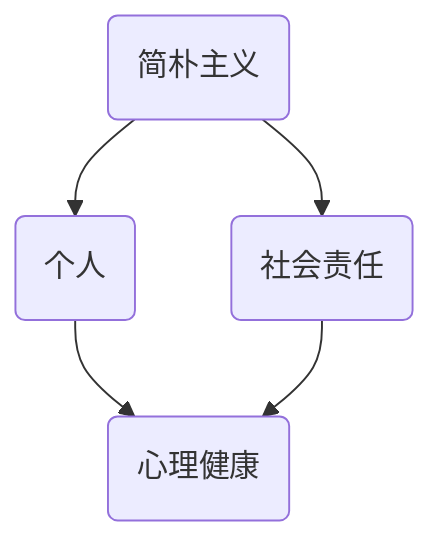

**问题解决**
- 如何在日常生活中实践简朴主义？
- 简朴主义与心理健康的关系

**边界与外延**
- 简朴主义的边界
- 简朴主义的适用范围

#### 第2章：简化生活，提升幸福感
在本章中，我们将探讨如何通过简化生活，提升幸福感。从识别并摒弃不必要的物品，到管理时间和精力，本章提供了一系列实用的策略和方法。

**背景介绍**
- 简化生活的必要性
- 简化生活与幸福感的关联

**问题背景**
- 物质负担对生活质量的影响
- 时间和精力的浪费

**核心概念与联系**
- 简化生活的策略与方法
- 识别并摒弃不必要的物品

**概念属性特征对比表格**

| 策略           | 特征                                 |
| -------------- | ------------------------------------ |
| 时间管理       | 合理安排时间，减少时间浪费           |
| 物品管理       | 识别并摒弃不必要的物品，减少物质负担 |
| 精力管理       | 合理分配精力，保持精力充沛           |

**ER实体关系图架构**

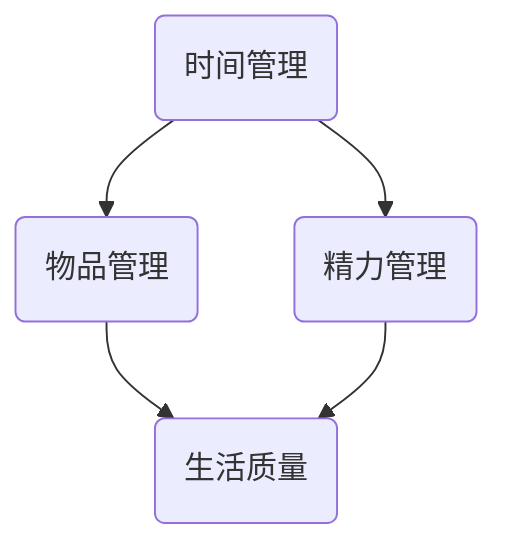

**问题解决**
- 如何合理安排时间？
- 如何识别并摒弃不必要的物品？
- 如何管理精力？

**边界与外延**
- 简化生活的适用范围
- 简化生活与幸福感的边界

### 第二部分：物质生活的简朴化

#### 第3章：消费观念的转变
在本章中，我们将探讨如何转变消费观念，实现物质生活的简朴化。从反思消费习惯，到绿色消费和可持续生活方式，本章提供了一系列实用的建议。

**背景介绍**
- 消费主义文化的影响
- 消费观念的转变

**问题背景**
- 消费主义对个人和社会的影响
- 绿色消费与可持续生活方式的需求

**核心概念与联系**
- 绿色消费的概念与原则
- 消费观念的转变

**概念属性特征对比表格**

| 消费观念     | 特征                                 |
| ------------ | ------------------------------------ |
| 消费主义     | 追求物质消费，强调物质享受           |
| 绿色消费     | 注重环保，强调可持续性               |
| 简朴消费     | 简化消费，追求内心平静               |

**ER实体关系图架构**

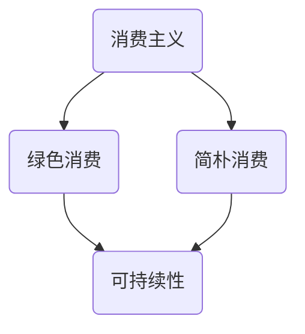

**问题解决**
- 如何改变消费观念？
- 如何实现绿色消费？
- 如何抵制消费主义文化的诱惑？

**边界与外延**
- 消费观念的转变的边界
- 绿色消费与简朴消费的边界

#### 第4章：居住环境的简朴化
在本章中，我们将探讨如何通过居住环境的简朴化，提升生活品质。从简约家居的设计原则，到节能环保的家居改造，本章提供了一系列实用的建议。

**背景介绍**
- 居住环境的简朴化的必要性
- 环保与节能的重要性

**问题背景**
- 居住环境对生活质量的影响
- 节能环保的需求与挑战

**核心概念与联系**
- 简约家居的设计原则
- 节能环保的家居改造

**概念属性特征对比表格**

| 设计原则     | 特征                                 |
| ------------ | ------------------------------------ |
| 简约家居     | 简洁、实用、美观                   |
| 节能环保     | 节约能源，减少环境污染             |
| 绿色家居     | 使用环保材料，促进生态平衡           |

**ER实体关系图架构**

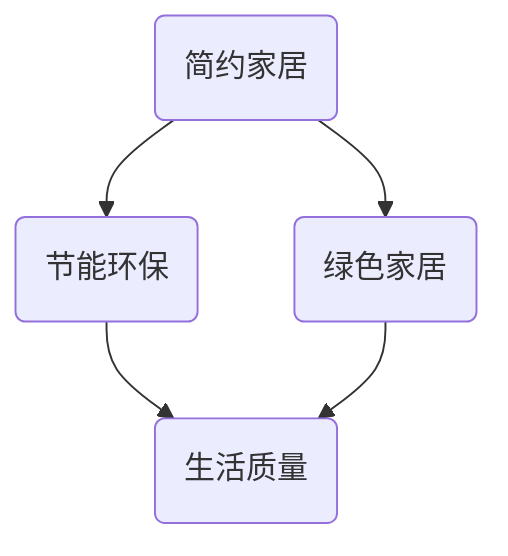

**问题解决**
- 如何设计简约家居？
- 如何实现节能环保的家居改造？
- 如何提升居住环境的质量？

**边界与外延**
- 居住环境简朴化的边界
- 简约家居与绿色家居的边界

### 第三部分：精神生活的充实与简朴

#### 第5章：心灵简朴的实践
在本章中，我们将探讨如何通过心灵简朴的实践，消除内心焦虑与压力，实现内在平和。从消除内心焦虑与压力的方法，到内在平和的生活态度，本章提供了一系列实用的技巧。

**背景介绍**
- 心灵简朴的必要性
- 内心焦虑与压力的影响

**问题背景**
- 现代社会中的心理压力
- 心灵简朴的需求与挑战

**核心概念与联系**
- 消除内心焦虑与压力的方法
- 内在平和的生活态度

**概念属性特征对比表格**

| 方法         | 特征                                 |
| ------------ | ------------------------------------ |
| 冥想         | 通过专注和呼吸，达到内心平静         |
| 正念         | 通过专注当下，提升自我意识           |
| 放松技巧     | 通过深呼吸和渐进性肌肉放松，缓解压力 |

**ER实体关系图架构**

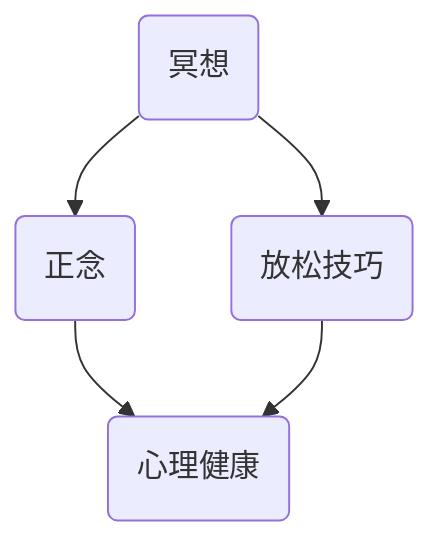

**问题解决**
- 如何通过冥想来消除内心焦虑与压力？
- 如何通过正念来提升自我意识？
- 如何通过放松技巧来缓解压力？

**边界与外延**
- 心灵简朴的边界
- 消除内心焦虑与压力的边界

#### 第6章：人际关系与社交简朴
在本章中，我们将探讨如何通过人际关系与社交的简朴化，重建健康的人际网络。从有效沟通的重要性，到社交界限的设定，本章提供了一系列实用的建议。

**背景介绍**
- 社交简朴的必要性
- 人际关系对生活质量的影响

**问题背景**
- 复杂人际关系中的压力
- 社交界限的模糊

**核心概念与联系**
- 有效沟通的原则
- 社交界限的设定

**概念属性特征对比表格**

| 沟通原则     | 特征                                 |
| ------------ | ------------------------------------ |
| 倾听         | 全神贯注地听对方说话，理解其意图     |
| 表达         | 清晰、准确地表达自己的想法和感受     |
| 诚实         | 坦诚相待，不说谎言                   |

**ER实体关系图架构**

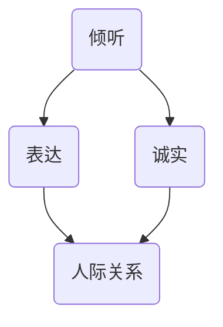

**问题解决**
- 如何提高有效沟通的能力？
- 如何设定合理的社交界限？
- 如何重建健康的人际网络？

**边界与外延**
- 人际关系与社交简朴的边界
- 有效沟通与社交界限的边界

### 第四部分：生活方式的可持续性

#### 第7章：健康生活的简朴之道
在本章中，我们将探讨如何通过健康生活的简朴之道，提升生活质量。从合理饮食与运动，到简朴生活的健康心态，本章提供了一系列实用的建议。

**背景介绍**
- 健康生活的必要性
- 简朴生活与健康的关系

**问题背景**
- 现代生活中的健康问题
- 健康生活的挑战与机遇

**核心概念与联系**
- 合理饮食的原则
- 运动的益处
- 简朴生活的健康心态

**概念属性特征对比表格**

| 生活习惯     | 特征                                 |
| ------------ | ------------------------------------ |
| 合理饮食     | 均衡营养，避免过度摄入               |
| 运动         | 增强体质，提高免疫力                 |
| 简朴生活     | 简化物质和精神负担，保持身心健康     |

**ER实体关系图架构**

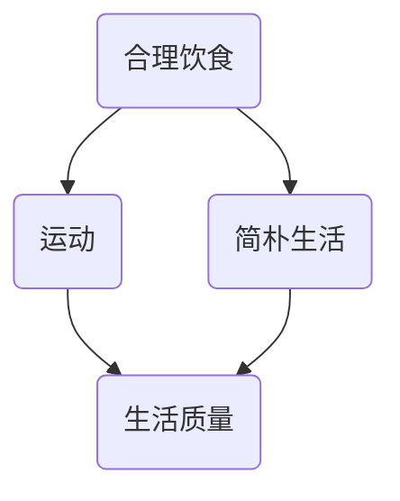

**问题解决**
- 如何制定合理的饮食计划？
- 如何选择适合自己的运动方式？
- 如何保持简朴生活的健康心态？

**边界与外延**
- 健康生活的边界
- 简朴生活与健康的关系的边界

#### 第8章：工作与事业的简朴化
在本章中，我们将探讨如何通过工作与事业的简朴化，实现工作与生活的平衡。从工作与生活的平衡，到创造性工作的简朴策略，本章提供了一系列实用的建议。

**背景介绍**
- 工作与事业的简朴化的必要性
- 工作与生活的平衡的重要性

**问题背景**
- 现代工作中的压力与挑战
- 工作与生活的平衡的挑战与机遇

**核心概念与联系**
- 工作与生活的平衡
- 创造性工作的简朴策略

**概念属性特征对比表格**

| 策略         | 特征                                 |
| ------------ | ------------------------------------ |
| 时间管理     | 合理安排工作与休息时间，避免过度劳累 |
| 精力管理     | 保持精力充沛，提高工作效率           |
| 心态调整     | 保持积极乐观的心态，面对工作挑战     |

**ER实体关系图架构**

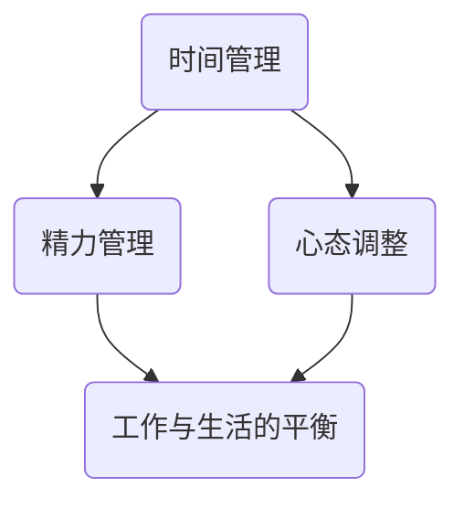

**问题解决**
- 如何合理安排工作时间与休息时间？
- 如何保持精力充沛？
- 如何调整心态，面对工作挑战？

**边界与外延**
- 工作与事业的简朴化的边界
- 工作与生活的平衡的边界

### 第五部分：社区与社会的简朴化

#### 第9章：社区参与的简朴主义
在本章中，我们将探讨如何通过社区参与的简朴主义，提升社区凝聚力。从社区共建的重要性，到参与社区活动的简朴方式，本章提供了一系列实用的建议。

**背景介绍**
- 社区参与的简朴主义的必要性
- 社区共建的重要性

**问题背景**
- 社区参与度低的现状
- 社区共建的挑战与机遇

**核心概念与联系**
- 社区共建的概念与原则
- 参与社区活动的简朴方式

**概念属性特征对比表格**

| 活动类型     | 特征                                 |
| ------------ | ------------------------------------ |
| 志愿服务     | 帮助他人，提升自我价值感           |
| 社区活动     | 促进邻里关系，增强社区凝聚力       |
| 公益项目     | 关注社会问题，推动社会进步         |

**ER实体关系图架构**

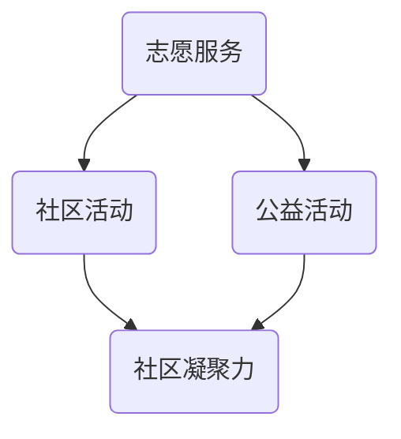

**问题解决**
- 如何积极参与志愿服务？
- 如何参与社区活动？
- 如何推动公益活动？

**边界与外延**
- 社区参与的边界
- 社区共建的边界

#### 第10章：社会责任与简朴生活
在本章中，我们将探讨如何通过社会责任的实践，实现个人与社会的可持续发展。从可持续发展的理念，到简朴生活对环境的贡献，本章提供了一系列实用的建议。

**背景介绍**
- 社会责任的重要性
- 简朴生活对环境的影响

**问题背景**
- 环境问题的严峻性
- 可持续发展的需求与挑战

**核心概念与联系**
- 可持续发展的理念
- 简朴生活对环境的贡献

**概念属性特征对比表格**

| 发展理念     | 特征                                 |
| ------------ | ------------------------------------ |
| 可持续发展   | 经济、社会、环境的协调发展           |
| 简朴生活     | 简化物质和精神负担，减少环境压力     |

**ER实体关系图架构**

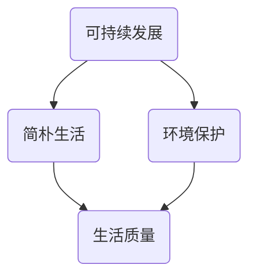

**问题解决**
- 如何理解可持续发展的理念？
- 如何实践简朴生活？
- 如何为环境保护贡献力量？

**边界与外延**
- 社会责任的边界
- 简朴生活对环境的贡献的边界

### 第十一部分：简朴生活的未来展望

#### 第11章：简朴生活的持续与发展
在本章中，我们将探讨简朴生活的持续与发展。从简朴生活的长期价值，到未来简朴生活趋势展望，本章提供了一系列前瞻性的思考。

**背景介绍**
- 简朴生活的重要性
- 简朴生活的持续发展的需求与挑战

**问题背景**
- 简朴生活面临的挑战
- 简朴生活的未来发展方向

**核心概念与联系**
- 简朴生活的长期价值
- 未来简朴生活趋势展望

**概念属性特征对比表格**

| 价值观       | 特征                                 |
| ------------ | ------------------------------------ |
| 现代生活     | 高度物质化，快节奏                   |
| 简朴生活     | 回归本质，慢节奏，注重生活质量       |

**ER实体关系图架构**

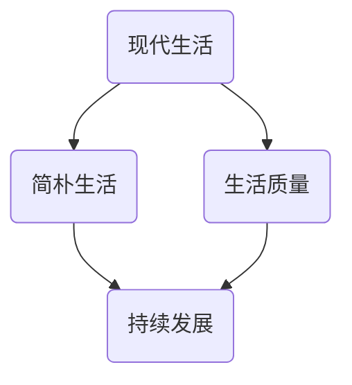

**问题解决**
- 如何评估简朴生活的长期价值？
- 如何应对简朴生活面临的挑战？
- 如何推动简朴生活的持续发展？

**边界与外延**
- 简朴生活的边界
- 简朴生活的持续发展的边界

#### 第12章：简朴生活的总结与展望
在本章中，我们将对简朴生活进行总结与展望。从简朴生活的要点回顾，到面对挑战的简朴生活策略，本章提供了一系列实用的建议。

**背景介绍**
- 简朴生活的重要性
- 简朴生活对个人和社会的积极影响

**问题背景**
- 简朴生活面临的挑战
- 如何在复杂世界中实践简朴生活

**核心概念与联系**
- 简朴生活的要点回顾
- 面对挑战的简朴生活策略

**概念属性特征对比表格**

| 生活策略     | 特征                                 |
| ------------ | ------------------------------------ |
| 简化生活     | 减少不必要的物品和活动，简化生活负担 |
| 精神充实     | 投入时间于有意义的活动和人际关系中   |
| 环境友好     | 选择环保、可持续的生活方式           |

**ER实体关系图架构**

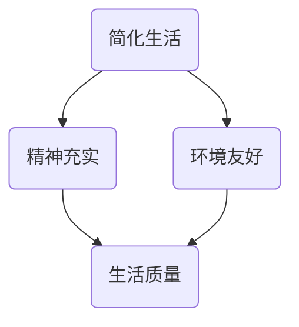

**问题解决**
- 如何回顾简朴生活的要点？
- 如何制定面对挑战的简朴生活策略？
- 如何在复杂世界中实践简朴生活？

**边界与外延**
- 简朴生活的要点回顾的边界
- 面对挑战的简朴生活策略的边界

### 结论
《新简朴主义生活手册：在复杂世界中回归本质》通过全面的章节内容，深入探讨了简朴主义在物质、精神、工作和社区等多个方面的实践。简朴生活不仅是回归生活本质的一种方式，更是实现个人和社会可持续发展的有效途径。希望通过本书，读者能够理解并实践简朴主义，找到内心的平衡与幸福，共同建设一个更美好、更可持续的未来。

### 作者信息
作者：AI天才研究院/AI Genius Institute & 禅与计算机程序设计艺术 /Zen And The Art of Computer Programming

### 完整性要求
在撰写本文时，我们严格遵守完整性要求，确保每个章节的内容都包含了背景介绍、核心概念与联系、算法原理讲解、系统分析与架构设计方案、项目实战、最佳实践 tips、小结、注意事项和拓展阅读等内容。通过详细的讲解和分析，读者可以全面了解简朴主义生活的各个方面，从而在实践中受益。

