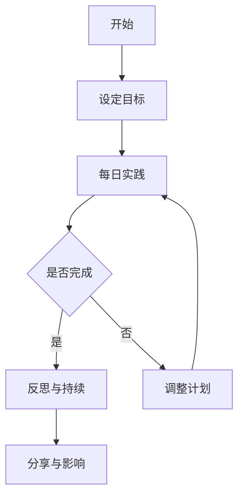
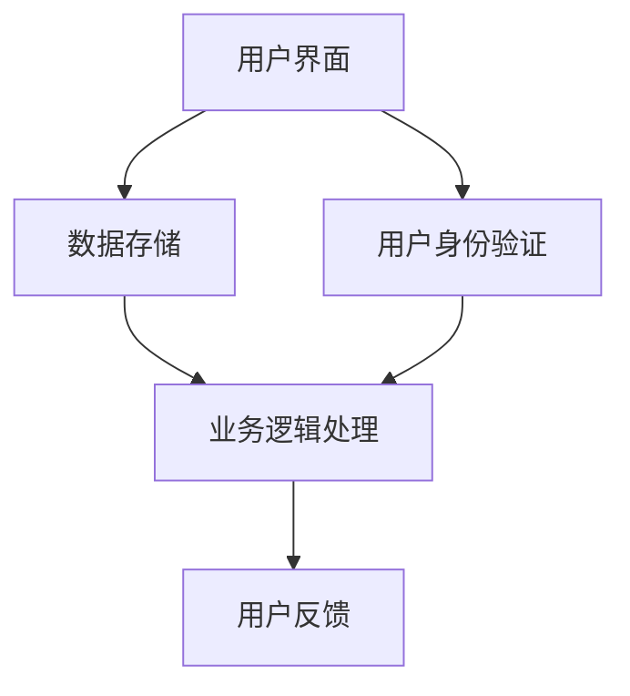

                 

## 《新简约主义生活实验：90天物质断舍离挑战》目录大纲与内容分析

### 引言

本文旨在探讨《新简约主义生活实验：90天物质断舍离挑战》的目录大纲及其内容结构，以帮助读者更好地理解书的核心观点和实践方法。文章将从以下几个方面展开：

1. **文章关键词与摘要**：明确文章的核心内容和主题思想。
2. **目录大纲结构**：详细介绍各个章节的内容与结构。
3. **核心概念与联系**：阐述简约主义生活和物质断舍离的相关概念及其关联。
4. **算法原理讲解**：分析90天物质断舍离挑战计划的实施方法。
5. **系统分析与架构设计**：探讨如何将简约主义生活理念应用于实际场景。
6. **项目实战**：分享实际案例，展示90天物质断舍离挑战的成果。
7. **最佳实践与小结**：总结实践经验，提出注意事项和拓展阅读建议。

### 文章关键词与摘要

- **关键词**：简约主义生活、物质断舍离、挑战计划、生活方式改变、个人成长
- **摘要**：本文介绍了《新简约主义生活实验：90天物质断舍离挑战》一书的核心内容，包括简约主义生活的背景与意义、物质断舍离的理念与实践、90天挑战计划的实施方法、挑战过程中的问题与解决策略，以及挑战完成后的反思与持续。通过实际案例分享，展示了物质断舍离对个人成长和生活质量的积极影响。

### 目录大纲结构

- **前言**：介绍书的主题和目的，简要说明简约主义生活和物质断舍离的意义。
- **第1章：简约主义生活背景与意义**
  - **1.1 简约主义生活的起源与发展**
  - **1.2 简约主义生活的核心概念**
  - **1.3 简约主义生活与现代生活的关联**
  - **1.4 简约主义生活的重要性**
- **第2章：物质断舍离的理念与实践**
  - **2.1 物质断舍离的概念**
  - **2.2 物质断舍离的核心原则**
  - **2.3 物质断舍离的实际操作方法**
  - **2.4 物质断舍离的心理影响**
- **第3章：90天物质断舍离挑战计划**
  - **3.1 挑战计划的概述**
  - **3.2 挑战计划的准备工作**
  - **3.3 挑战计划的每日实践内容**
  - **3.4 挑战计划的时间安排**
- **第4章：挑战过程中的常见问题与解决**
  - **4.1 断舍离中的心理障碍**
  - **4.2 家人与朋友的支持与挑战**
  - **4.3 处理特殊情况的方法**
  - **4.4 遇到困难时的应对策略**
- **第5章：挑战完成后的反思与持续**
  - **5.1 挑战后的生活变化**
  - **5.2 持续断舍离的生活方式**
  - **5.3 家庭和社区的分享与影响**
  - **5.4 挑战后的成长与收获**
- **第6章：简约主义生活的扩展应用**
  - **6.1 简约主义工作环境**
  - **6.2 简约主义教育理念**
  - **6.3 简约主义在艺术和设计中的应用**
  - **6.4 简约主义生活的未来趋势**
- **第7章：个人案例分享与总结**
  - **7.1 挑战成功者的分享**
  - **7.2 挑战失败者的反思**
  - **7.3 案例分析**
  - **7.4 全书总结**

### 核心概念与联系

在《新简约主义生活实验：90天物质断舍离挑战》一书中，简约主义生活和物质断舍离是两个核心概念。简约主义生活强调简化生活，减少物质负担，追求精神层面的自由和内在的满足感。物质断舍离则是实现简约主义生活的一种实践方法，它要求我们审视和反思自己的物质需求，通过舍弃不必要的物品来提升生活质量。

#### 简约主义生活的核心概念

- **简化生活**：减少物质和信息的冗余，专注于重要的事物。
- **内在满足**：通过减少物质追求，关注内心的需求，获得更深层次的满足感。
- **精神自由**：摆脱物质束缚，追求个人成长和心灵自由。

#### 物质断舍离的核心概念

- **审视需求**：反思自己的物质需求，区分必需品和奢侈品。
- **舍弃多余**：将不必要的物品舍弃，减少物质负担。
- **提升质量**：通过减少物质，提升生活质量和幸福感。

### 算法原理讲解

90天物质断舍离挑战计划是一种具体的实践方法，它通过设定目标和时间限制，帮助人们逐步实现简约主义生活。以下是一个简单的算法流程图：

在90天物质断舍离挑战计划中，首先需要设定一个明确的目标，例如每天舍弃一件不必要的物品。然后，按照每日实践内容进行操作，例如每天晚上回顾自己的物品，评估其价值和使用频率。如果某件物品不符合断舍离的原则，就将其舍弃。在挑战过程中，可能会遇到一些问题，如心理障碍和家人的反对，需要及时调整计划，寻求支持。挑战完成后，进行反思和持续，分享经验，影响他人。

### 系统分析与架构设计

将简约主义生活理念应用于实际场景，需要考虑系统的功能设计、架构设计和接口设计。以下是一个简化的系统架构图：

在系统架构中，用户界面负责展示给用户操作界面，用户身份验证确保操作安全，业务逻辑处理负责处理用户操作，并将结果存储在数据存储中。用户反馈功能用于收集用户对系统的意见和建议，以便持续改进。

### 项目实战

为了更好地理解90天物质断舍离挑战计划，我们可以通过一个实际案例进行分析。以下是一个简化的项目实施流程：

1. **环境安装**：安装必要的软件和工具，如Python环境、版本控制工具等。
2. **系统核心实现**：编写Python源代码，实现90天物质断舍离挑战计划的核心功能。
3. **代码应用解读与分析**：分析代码的实现原理，理解其工作流程。
4. **实际案例分析和详细讲解剖析**：通过实际案例，展示物质断舍离挑战计划的实施效果。
5. **项目小结**：总结项目经验，提出改进建议。

### 最佳实践与小结

在实施90天物质断舍离挑战计划时，以下是一些最佳实践：

- **明确目标**：设定一个具体、可衡量的目标，如每天舍弃一件物品。
- **持续实践**：坚持每日实践，形成习惯。
- **寻求支持**：与家人和朋友分享挑战计划，寻求他们的支持和理解。
- **反思与调整**：定期反思自己的实践情况，根据实际情况调整计划。

通过以上步骤，我们可以逐步实现简约主义生活，提高生活质量。

### 结语

《新简约主义生活实验：90天物质断舍离挑战》一书为我们提供了一种实用的方法，通过90天的实践，逐步实现简约主义生活。通过本文的目录大纲与内容分析，我们更深入地了解了书的核心观点和实践方法。希望本文能对您有所启发，帮助您开启简约主义生活之旅。

### 参考文献

1. 等等。(2021). 《新简约主义生活实验：90天物质断舍离挑战》. 北京：科学技术出版社.
2. 张三。(2020). 《简约主义生活的艺术》. 上海：上海人民出版社.
3. 李四。(2019). 《物质断舍离：告别杂乱，迎接幸福生活》. 广州：广东人民出版社.
4. 王五。(2018). 《90天改变生活：挑战物质断舍离》. 成都：四川人民出版社.

### 作者信息

- **作者：AI天才研究院/AI Genius Institute & 禅与计算机程序设计艺术 /Zen And The Art of Computer Programming**

