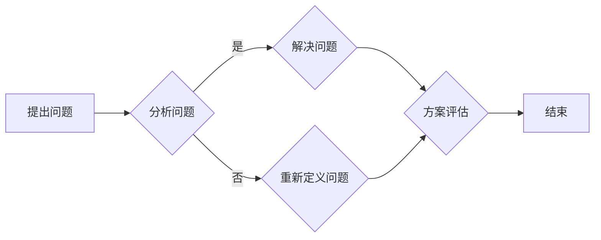
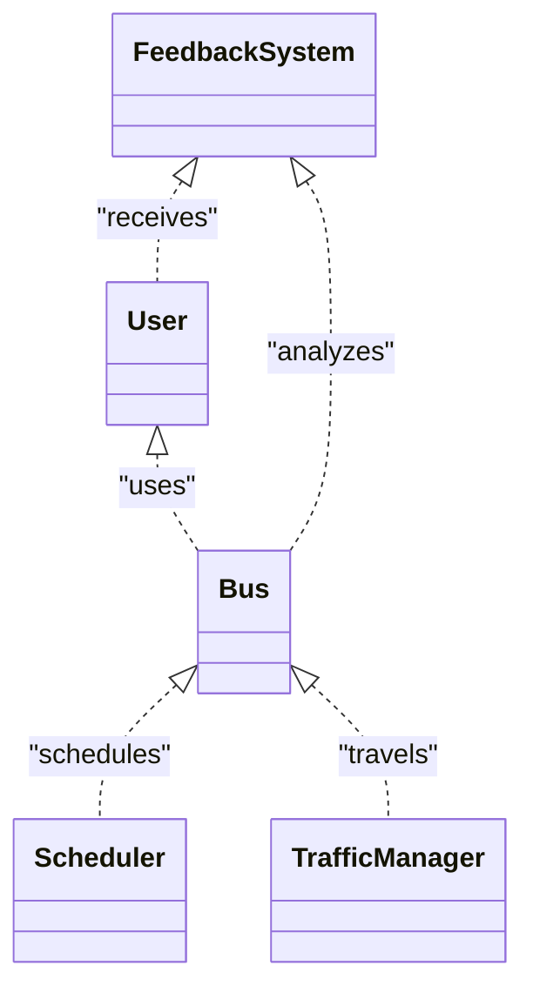
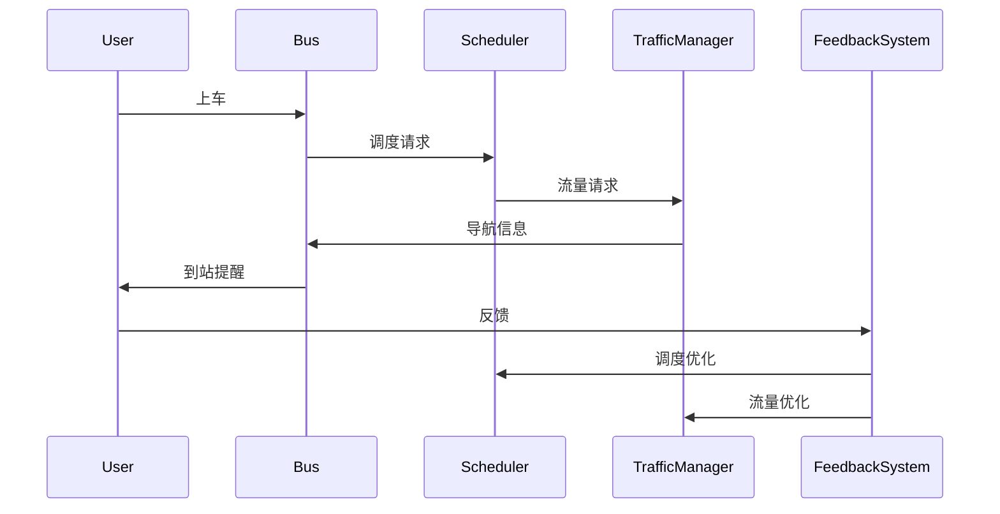
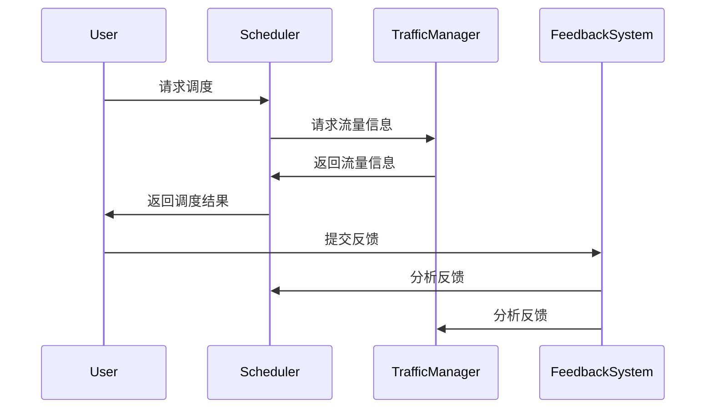

                 

### 引言：街头哲学的意义与价值

**1. 引言背景**

街头哲学，顾名思义，是在街头或公共场所中进行的哲学讨论和思考。这种哲学形式起源于古代希腊的苏格拉底，他常常在公共场所与人们进行对话，探讨各种哲学问题。随着时代的发展，街头哲学在现代社会中逐渐兴起，成为了一种独特的文化现象。

现代社会节奏快，信息爆炸，人们渴望在繁忙的生活中找到片刻的宁静和思考的空间。街头哲学正好提供了这样一个平台，让人们能够在日常生活的喧嚣中暂时停下来，反思自身、社会和宇宙的诸多问题。这种形式不仅打破了传统哲学的严肃性，也让哲学变得更加贴近普通人的生活。

**2. 街头哲学的定义**

街头哲学，通常指的是在公共场所（如街头、咖啡馆、公园等）进行的非正式哲学讨论。它具有以下几个特点：

- **互动性**：街头哲学强调参与者之间的互动，每个人都可以自由发表观点，进行辩论和探讨。
- **开放性**：街头哲学不对参与者进行学术或专业要求，任何人都可以参与其中，这使得哲学讨论更加广泛和多样化。
- **实践性**：街头哲学强调理论联系实际，讨论的问题往往是与人们日常生活息息相关的，如道德、伦理、社会问题等。

**3. 街头哲学在现代社会的作用**

街头哲学在现代社会中扮演着多重角色：

- **知识传播**：通过街头哲学，哲学知识和思想得以更广泛地传播，不仅限于学术圈。
- **社会批判**：街头哲学往往关注社会现实问题，通过讨论和批判，对社会现象进行反思和改进。
- **文化多样性**：街头哲学促进了不同文化背景的人们之间的交流和理解，增强了文化多样性。

在接下来的章节中，我们将深入探讨街头哲学的基本概念、核心议题、案例分析以及其在现代社会中的应用和未来展望。希望通过这篇技术博客，能够激发读者对街头哲学的兴趣，并启发大家在日常生活中运用哲学思维去思考和解决实际问题。

## 第一部分：街头哲学的基本概念

### 第1章：哲学与街头文化的碰撞

**1.1 哲学的本质**

哲学，作为一门探究宇宙、知识、价值和存在等基本问题的学科，其历史可以追溯到古希腊时期。哲学不仅仅是理论思辨，更是一种生活方式，一种对人类存在的深刻反思。哲学的本质在于其追求真理、寻求智慧，并通过逻辑和理性的分析来理解和解释世界。

哲学的核心问题是存在性问题。哲学家们一直在探索：什么是存在？存在有什么意义？人类的存在与宇宙有何关系？这些基本问题贯穿了哲学的整个发展历程。例如，苏格拉底主张通过提问和对话来寻求真理，而柏拉图则提出了理念论，认为真实的存在是理念世界而非物质世界。

**1.2 街头文化的发展**

街头文化，作为一种独特的文化现象，起源于20世纪中期的美国和欧洲。它包括涂鸦艺术、街头表演、街头音乐等多种形式。街头文化的发展与城市化进程紧密相关，城市成为了街头文化的温床。随着互联网和社交媒体的兴起，街头文化的影响力进一步扩大，成为全球性的文化现象。

街头文化的特点在于其自由、叛逆和反传统的精神。街头艺术家通过创作和表演来表达自己的观点和情感，这使得街头文化成为一种强大的社会批判工具。例如，涂鸦艺术常被用来表达对社会不公、种族歧视和政治腐败的抗议。

**1.3 哲学与街头文化的交汇**

哲学与街头文化的交汇点在于它们都关注社会现实问题，强调个体表达和自由思想。街头哲学正是哲学与街头文化相结合的产物。街头哲学家们通过在公共场所进行讨论和辩论，将哲学的深度和街头文化的实践性相结合。

街头哲学的讨论议题广泛，从道德伦理到社会正义，从个人自由到公共责任，每一个话题都与人们的日常生活密切相关。这种互动性的讨论方式，不仅使得哲学变得更为生动和实际，也促进了参与者之间的思想交流和观点碰撞。

**1.4 街头哲学的互动性**

街头哲学的互动性是其最重要的特点之一。在街头哲学的讨论中，每个人都是平等的参与者，没有人是权威或专家。这种平等的讨论环境鼓励了自由表达和开放性思维，使得每个人都能从他人的观点中获得启发。

例如，在一个关于社会正义的讨论中，一位参与者可能从伦理学的角度提出观点，另一位参与者则可能从社会学的角度进行分析，而第三位参与者则可能分享自己的亲身经历。通过这样的讨论，不同观点得以交流和碰撞，从而形成更为全面和深刻的理解。

**1.5 街头哲学的开放性**

街头哲学的开放性表现在它不拘泥于传统哲学的框架和定义，鼓励创新和多样化的思考方式。街头哲学不仅关注哲学经典问题，如存在、知识、价值等，还涉及当代社会面临的各种挑战，如数字伦理、环境问题、全球化等。

这种开放性使得街头哲学能够与时俱进，不断适应和反映社会的变化。例如，随着互联网和社交媒体的兴起，街头哲学家们开始探讨数字伦理问题，如隐私、数据所有权、网络暴力等。这些问题不仅具有哲学意义，也与每个人的日常生活息息相关。

**1.6 街头哲学的实践性**

街头哲学的实践性体现在其关注社会现实问题和个体经验的讨论。街头哲学家们不仅思考抽象的哲学问题，还试图通过讨论和行动来改善社会现状。

例如，在讨论社会正义问题时，街头哲学家们可能会提出具体的解决方案，如呼吁政府进行制度改革、推动社会公正等。通过这种实践性的讨论，街头哲学不仅提供了理论指导，还激发了人们的行动力。

**1.7 街头哲学的影响**

街头哲学的影响不仅局限于哲学领域，它还对其他文化和社会领域产生了深远的影响。首先，街头哲学激发了人们对哲学的兴趣，使得更多的人开始关注和思考哲学问题。其次，街头哲学促进了不同文化之间的交流和理解，增强了文化的多样性。

此外，街头哲学也为社会批判提供了有力的工具。通过在公共场所进行讨论和辩论，街头哲学家们能够揭露社会问题，呼吁社会变革。例如，一些街头哲学家通过涂鸦艺术表达对社会不公的抗议，引起了广泛的关注和讨论。

总之，街头哲学作为一种独特的哲学形式，在现代社会中具有重要的作用。它不仅打破了传统哲学的严肃性，使得哲学更加贴近普通人的生活，还通过互动性、开放性和实践性的讨论，为社会提供了新的思考和解决问题的视角。

### 第2章：街头哲学的核心议题

**2.1 存在主义**

存在主义是街头哲学中的一个重要议题，它强调个体的自由、责任和存在意义。存在主义的核心观点是，人的存在先于其本质，即人不是被预先设定好的存在，而是通过自己的选择和行动来定义自己的本质。

在街头哲学的讨论中，存在主义常常被用来探讨个人自由的问题。例如，一位参与者可能会提出：“我们每个人都有选择自己的生活方式的自由，但这种自由同时也伴随着责任。自由并不是无条件的，我们必须为自己的选择承担责任。”

存在主义的另一个重要观点是关于死亡和自由意志。存在主义者认为，面对死亡的恐惧可以激发人的自由意志，让人更加珍惜生命。例如，一位街头哲学家可能会说：“面对死亡，我们可以选择逃避，也可以选择勇敢地面对。这种选择不仅关乎我们的生命，也关乎我们的价值观。”

**2.2 伦理学**

伦理学是哲学中的一个分支，它探讨道德和行为的准则。在街头哲学的讨论中，伦理学问题常常成为焦点，如道德责任、道德选择和道德标准等。

街头哲学家们经常讨论道德责任的问题。例如，一位参与者可能会提出：“我们每个人都有道德责任去帮助那些处于困境中的人。这不仅是对他人的责任，也是对我们自己的责任。”

道德选择是伦理学讨论的另一个重要方面。在街头哲学的讨论中，人们常常探讨在复杂的社会环境中如何做出正确的道德选择。例如，一位街头哲学家可能会说：“在面临道德困境时，我们需要理性思考，同时也要考虑自己的价值观和道德标准。”

道德标准是伦理学讨论的基础。在街头哲学的讨论中，人们常常探讨不同的道德标准如何影响我们的行为和决策。例如，一位参与者可能会提出：“不同的文化和社会有不同的道德标准，我们需要在尊重差异的基础上，寻求共同的道德准则。”

**2.3 人类学**

人类学是哲学中的一个分支，它研究人类文化、行为和社会的结构。在街头哲学的讨论中，人类学问题常常被用来探讨文化多样性、社会结构和人类发展等议题。

文化多样性是街头哲学讨论中的一个重要议题。街头哲学家们经常讨论如何尊重和保护不同文化之间的多样性。例如，一位参与者可能会提出：“我们应该尊重每个人的文化背景，避免文化冲突，促进文化交流和理解。”

社会结构也是人类学讨论的一个重要方面。在街头哲学的讨论中，人们常常探讨社会结构如何影响个体的行为和决策。例如，一位街头哲学家可能会说：“社会结构决定了我们的生活方式和社会角色，我们需要关注社会结构的不公和缺陷，努力改变现状。”

人类发展是街头哲学讨论中的另一个重要议题。街头哲学家们经常探讨人类如何通过教育、科技和社会进步来实现全面发展。例如，一位参与者可能会提出：“人类的发展需要科技和教育的支持，我们需要关注教育资源的分配和社会公平，以确保每个人都能获得平等的发展机会。”

**2.4 政治哲学**

政治哲学是哲学中的一个重要分支，它探讨政治权力的本质、政治制度的设计以及政府与社会的关系。在街头哲学的讨论中，政治哲学问题常常成为焦点，如民主、正义、自由和社会责任等。

民主是政治哲学讨论中的一个核心议题。在街头哲学的讨论中，人们经常探讨如何实现真正的民主，以及民主制度如何保障公民的权益。例如，一位参与者可能会提出：“民主不仅仅是选举，更是一种生活方式。我们需要通过日常参与和对话来保障民主的实现。”

正义是政治哲学讨论中的另一个重要议题。在街头哲学的讨论中，人们经常探讨如何实现社会正义，以及正义如何体现在法律、政策和制度中。例如，一位街头哲学家可能会说：“正义是社会制度的基石，我们需要关注社会不公，努力实现正义。”

自由是政治哲学讨论中的核心概念之一。在街头哲学的讨论中，人们经常探讨自由的意义和限制，以及自由如何与责任相结合。例如，一位参与者可能会提出：“自由是每个人的权利，但自由同时也伴随着责任。我们需要在享受自由的同时，承担相应的责任。”

社会责任是政治哲学讨论中的一个重要议题。在街头哲学的讨论中，人们经常探讨政府和社会如何承担社会责任，以及个人如何参与社会事务。例如，一位参与者可能会提出：“社会责任不仅仅是政府的责任，也是每个人的责任。我们需要关注社会问题，积极参与社会事务，共同推动社会的进步。”

总之，街头哲学的核心议题涵盖了存在主义、伦理学、人类学和政治哲学等多个领域。通过这些议题的讨论，街头哲学不仅提供了深刻的哲学思考，也促进了社会的进步和变革。

### 第3章：街头哲学的案例分析

**3.1 街头哲学在艺术中的体现**

街头哲学在艺术中的体现尤为显著，尤其是涂鸦艺术。涂鸦不仅是街头文化的一部分，也是街头哲学的一种表现形式。涂鸦艺术家通过创作和展示作品，传达自己的哲学观点和社会批判。

例如，纽约的“ Banksy ”是一位著名的涂鸦艺术家，他的作品常常包含对社会问题的深刻反思。他的作品《希特勒刷牙》（Hitler Cleaning His Teeth）以幽默和讽刺的方式，揭示了战争和暴力的残酷性。这种艺术形式不仅吸引了大量观众，也让人们开始思考更深层次的社会问题。

另一个例子是巴西艺术家“ Os Gêmeos ”，他们的作品融合了抽象和具象的元素，通过复杂的构图和丰富的色彩，探讨了人类存在的本质。他们的作品《我们是谁？》（Who We Are?）通过人物形象的自问自答，引发了人们对身份认同和自我认识的思考。

**3.2 街头哲学在公共话语中的运用**

街头哲学在公共话语中的运用也相当广泛。在社交媒体平台上，人们通过评论、转发和讨论，将街头哲学的理念传播到更广泛的人群中。这种形式的哲学讨论不仅使得哲学变得更加平易近人，也促进了公共领域的思想交流和观点碰撞。

一个典型的例子是#MeToo运动的兴起。这一运动起源于2017年，起初是为了揭露好莱坞性丑闻，随后迅速扩展到全球。在社交媒体上，人们通过分享自己的经历和观点，讨论性别不平等和性骚扰问题。这种形式的公共话语，不仅提高了公众对性骚扰问题的认识，也促使社会对此类问题进行更深入的反思和改革。

另一个例子是关于环保问题的讨论。随着全球气候变化问题的日益严重，街头哲学在环保运动中的运用也变得越来越重要。人们通过社交媒体和公共演讲，讨论环保政策、个人责任和全球合作等问题。例如，#FridaysForFuture运动中，青少年们通过每周五的罢课行动，呼吁政府采取更积极的环保措施，这一运动不仅引发了全球范围的关注，也促使一些国家开始重新审视自己的环保政策。

**3.3 街头哲学在日常生活的影响**

街头哲学在日常生活的影响同样不可忽视。街头哲学的理念通过日常对话、教育和个人行为，逐渐渗透到人们的日常生活中，影响着人们的思维方式和行为习惯。

例如，在道德和伦理问题上，街头哲学的讨论帮助人们更好地理解和处理日常生活中的道德困境。一个人在面临道德选择时，可以通过街头哲学的思考方式，理性分析各种选择的后果，从而做出更明智的决策。

在个人成长和自我认知方面，街头哲学也起到了重要作用。街头哲学强调个体的自由和责任，鼓励人们勇于探索和反思自己的存在意义。通过这种哲学思考，人们可以更好地认识自己，找到自己的价值观和人生目标。

此外，街头哲学还影响了人们的社交行为。在街头哲学的讨论中，人们学会了倾听和尊重他人的观点，学会了通过对话和辩论来解决问题。这种开放和包容的讨论方式，不仅有助于建立和谐的人际关系，也促进了社会的进步和包容。

**3.4 街头哲学在教育领域的应用**

街头哲学在教育领域的应用也日益受到重视。学校和教育机构开始将街头哲学的理念融入课程设计中，培养学生的批判性思维和哲学思考能力。

例如，一些学校开设了街头哲学课程，让学生通过讨论和辩论来探讨哲学问题。这些课程不仅帮助学生理解哲学概念，还培养了他们的沟通能力和逻辑思维。

此外，街头哲学的理念也被应用于学生的自我反思和评估中。学生通过撰写哲学日记或参与哲学研讨会，反思自己的行为和价值观，从而促进自我成长和自我认知。

**3.5 街头哲学在公共政策制定中的应用**

街头哲学在公共政策制定中的应用也越来越受到关注。政策制定者通过街头哲学的讨论和反思，更好地理解社会问题和公众需求，从而制定更科学、更有效的政策。

例如，在应对社会不公问题时，政策制定者可以通过街头哲学的讨论，了解不同群体对不公问题的看法和解决方案。这种形式的公众参与不仅提高了政策的民主性和科学性，也增强了公众对政策的认同和接受度。

另一个例子是在环保政策的制定中，政策制定者可以通过街头哲学的讨论，了解公众对环保问题的看法和态度。这种了解有助于制定更具针对性和有效性的环保政策，从而更好地应对气候变化等全球性挑战。

**3.6 街头哲学在个人生活中的应用**

街头哲学不仅影响了公共领域和社会政策，也在个人生活中发挥了重要作用。人们通过街头哲学的思考方式，更好地理解自己和他人，处理日常生活中的各种问题。

例如，在人际关系中，街头哲学帮助人们更好地理解和尊重他人的观点和感受。通过哲学思考，人们可以更好地沟通和解决冲突，建立和谐的人际关系。

在职业发展中，街头哲学也起到了重要作用。通过哲学思考，人们可以更好地认识自己的兴趣和价值观，从而做出更明智的职业选择和职业规划。

此外，街头哲学还帮助人们更好地应对生活中的挑战和困难。在面对挫折和失败时，人们可以通过哲学思考，找到应对问题的方法和策略，从而更好地应对生活的种种挑战。

总之，街头哲学在艺术、公共话语、日常生活、教育领域和公共政策制定中的应用，充分展示了其广泛的影响和深远的意义。通过这些案例分析，我们可以看到街头哲学不仅提供了深刻的哲学思考，也在社会进步和个体成长中发挥了重要作用。

### 第二部分：现代社会的哲学问题

**第4章：现代社会的哲学问题**

**4.1 数字时代下的哲学挑战**

随着数字技术的迅猛发展，人类社会进入了一个前所未有的数字时代。这一时代带来了许多哲学上的挑战，包括隐私、数据所有权、人工智能和算法道德等问题。

**隐私问题**：数字时代下，个人信息泄露和数据滥用的风险大大增加。街头哲学讨论的焦点之一是如何在数字世界中保护个人隐私。例如，一位参与者可能会提出：“在数字时代，隐私已成为一种稀缺资源。我们需要在技术进步和隐私保护之间找到平衡，确保个人信息的保护。”

**数据所有权**：随着大数据和云计算的普及，数据所有权成为一个重要的哲学议题。谁应该拥有数据？数据如何被使用和共享？这些问题的讨论不仅关乎个人权益，也涉及社会公正和公平。一位街头哲学家可能会说：“数据是一种新的财富，数据所有权的问题关系到每个人的权益和利益，我们需要通过合理的法律和道德框架来规范数据的使用。”

**人工智能和算法道德**：人工智能和算法的广泛应用引发了关于道德和社会责任的讨论。例如，一位参与者可能会提出：“人工智能和算法的决策过程缺乏透明度和解释性，我们需要确保这些决策符合道德标准，避免造成不公平和社会不公。”

**4.2 环境伦理问题**

环境伦理问题是现代哲学讨论中的另一个重要议题。随着全球气候变化和环境破坏的加剧，人们开始关注如何从伦理角度解决这些问题。

**资源分配**：环境伦理讨论的一个重要方面是如何公平地分配自然资源。例如，一位参与者可能会提出：“在环境伦理的问题上，我们需要考虑全球资源的公平分配，确保所有人都能享有清洁的空气和水源。”

**生态责任**：另一个重要的伦理问题是人类对自然界的责任。例如，一位参与者可能会说：“作为地球上的居住者，我们有责任保护和维护自然环境，确保我们的行为不会对生态系统造成永久性的破坏。”

**环境正义**：环境正义是一个涉及社会公正的议题，讨论的是不同社会群体在环境问题上的责任和权益。例如，一位街头哲学家可能会提出：“环境正义要求我们关注那些最易受环境破坏影响的群体，确保他们能够享受到与其他人同等的生存和发展条件。”

**4.3 社会正义问题**

社会正义问题是现代哲学讨论中的核心议题，涉及公平、平等和机会分配等问题。数字时代下的社会正义问题尤为复杂，因为技术进步和社会结构的变化对传统的正义观念提出了挑战。

**数字鸿沟**：数字鸿沟是指不同社会群体在获取和使用数字技术上的差异。例如，一位参与者可能会提出：“数字鸿沟导致了一些社会群体的边缘化和不公平，我们需要通过政策和教育来缩小这一差距，确保所有人都能平等地享受数字时代的便利。”

**经济不平等**：经济不平等是一个全球性的问题，数字时代加剧了这一问题的严重性。例如，一位街头哲学家可能会说：“在数字时代，我们需要关注经济不平等问题，通过公平的税收政策和财富再分配来减少贫富差距。”

**机会平等**：机会平等是另一个重要的正义议题。在数字时代，机会平等要求每个人都能享有平等的教育和就业机会。例如，一位参与者可能会提出：“我们需要确保每个人都能够获得高质量的教育和技能培训，从而在数字时代中获得成功。”

通过这些讨论，我们可以看到，数字时代、环境伦理和社会正义是现代社会面临的重要哲学问题。街头哲学为我们提供了一个思考和讨论这些问题的平台，通过开放和互动的讨论方式，我们可以更好地理解这些问题，并提出有效的解决方案。

### 第5章：现代街头哲学的理论框架

**5.1 实用主义**

实用主义是一种强调行动和效果的哲学理论，其核心思想是知识和观念的价值在于其实用性。实用主义起源于19世纪末的美国，代表人物有威廉·詹姆斯和约翰·杜威。

在街头哲学的讨论中，实用主义强调解决问题和实际应用的重要性。例如，一位参与者可能会提出：“哲学的真正价值在于其能指导我们解决现实生活中的问题。我们应该关注那些能带来实际效果的理论和思想。”

**实用主义的核心观点**：
1. **行动导向**：实用主义认为知识应当指导行动，强调实践和经验的重要性。
2. **效果评估**：知识和观念的价值在于其实际效果，而非其理论上的正确性。
3. **灵活性**：实用主义强调理论应适应现实变化，而非僵化地遵循固定原则。

**5.2 分析哲学**

分析哲学是一种注重逻辑和语言的哲学方法，其目的是通过分析和澄清概念来推进哲学研究。分析哲学起源于20世纪初的英国，代表人物有贝特兰·罗素和阿尔弗雷德·诺思·怀特海德。

在街头哲学的讨论中，分析哲学强调逻辑推理和清晰表达的重要性。例如，一位参与者可能会提出：“在讨论哲学问题时，我们需要运用逻辑和语言工具，确保我们的观点清晰、逻辑严密。”

**分析哲学的核心观点**：
1. **逻辑分析**：通过逻辑分析，澄清概念和判断，避免误解和歧义。
2. **语言分析**：关注语言的使用和意义，强调语言在哲学思考中的作用。
3. **清晰表达**：追求清晰、准确的哲学表达，以避免模糊和歧义。

**5.3 哲学社会学**

哲学社会学是一种将哲学与社会学相结合的跨学科研究方法，旨在探讨社会现象背后的哲学问题。哲学社会学的代表人物有埃米莉·阿普特和皮埃尔·布尔迪厄。

在街头哲学的讨论中，哲学社会学关注社会结构、权力关系和文化实践等哲学问题。例如，一位参与者可能会提出：“社会现象不仅仅是表面的现象，它们背后有着深刻的哲学原因。”

**哲学社会学的核心观点**：
1. **社会结构**：关注社会结构如何影响个人行为和社会关系。
2. **权力关系**：探讨权力在社会中的分布和作用，以及如何影响社会正义。
3. **文化实践**：分析文化实践如何塑造和反映社会价值观和哲学观念。

**5.4 现代街头哲学的综合框架**

现代街头哲学的理论框架不仅包括实用主义、分析哲学和哲学社会学，还融合了存在主义、伦理学、人类学和政治哲学等不同的哲学流派。这种综合框架使得街头哲学能够从多个角度分析和讨论现代社会的问题。

例如，在讨论社会正义问题时，街头哲学家可以同时运用实用主义的行动导向和分析哲学的逻辑分析，提出具体的解决方案。同时，哲学社会学可以帮助我们理解社会结构中的权力关系，从而更全面地评估和改进社会政策。

**5.5 街头哲学的跨学科特点**

街头哲学的跨学科特点使其能够吸纳不同领域的知识和方法，从而提供更丰富和多元的视角。这种跨学科的特点不仅增强了街头哲学的理论深度，也提高了其实际应用价值。

例如，在讨论数字伦理问题时，街头哲学家可以结合计算机科学、法律和社会学等领域的知识，提出更全面和科学的解决方案。这种跨学科的思维方式，有助于街头哲学在面对复杂的社会问题时，提供更有效和创新的解决方案。

总之，现代街头哲学的理论框架融合了多种哲学流派和方法，通过跨学科的研究和实践，使得街头哲学能够更好地应对现代社会中的各种挑战。街头哲学不仅提供了一种思考问题的方法，也为解决现实问题提供了新的思路和视角。

### 第6章：现代街头哲学的应用

**6.1 在教育领域的应用**

现代街头哲学在教育领域的应用日益广泛，它不仅丰富了教育内容，还改变了教育的形式。通过街头哲学的讨论和辩论，学生能够培养批判性思维和独立思考能力，从而在知识理解和应用方面取得更好的效果。

**课程设计**：街头哲学可以融入各个学科的课程设计中，如历史、社会学、文学和科学。例如，在历史课程中，学生可以通过讨论不同历史时期的哲学思想，理解历史背景和社会变迁。在文学课程中，学生可以通过分析文学作品中的哲学观点，提高文学鉴赏能力和批判性思维。

**教学互动**：街头哲学强调互动性和参与性，这在课堂上尤为重要。教师可以通过组织辩论、小组讨论和角色扮演等活动，激发学生的思考和参与热情。例如，在讨论道德问题时，教师可以引导学生扮演不同的角色，从不同的视角分析问题，从而培养他们的辩证思维和解决问题的能力。

**跨学科学习**：街头哲学鼓励跨学科的学习和思考，这有助于学生形成更全面的认知和理解。通过跨学科的课程设计，学生可以从多个角度理解同一问题，从而提高他们的综合分析能力和创新思维。

**6.2 在公共政策制定中的应用**

现代街头哲学在公共政策制定中的应用具有重要意义。通过街头哲学的讨论和反思，政策制定者能够更好地理解社会问题和公众需求，从而制定更科学、合理和有效的政策。

**公众参与**：街头哲学强调公众的参与和表达，这在公共政策制定中至关重要。通过在公共场所进行讨论和辩论，政策制定者能够直接听取公众的声音和意见，从而更好地反映社会需求。例如，在制定环境保护政策时，政策制定者可以通过街头哲学的讨论，了解公众对环保措施的看法和期望，从而制定更符合公众利益的政策。

**多角度分析**：街头哲学提供了多角度分析和思考问题的方法，这有助于政策制定者全面评估政策的影响和效果。通过不同观点的碰撞和讨论，政策制定者能够发现潜在的盲点和问题，从而提出更完善的解决方案。

**6.3 在个人生活中的应用**

现代街头哲学在个人生活中的应用也相当广泛，它帮助人们更好地理解自己和世界，从而在日常生活中做出更明智的决策。

**自我反思**：街头哲学鼓励自我反思和自我认知，这有助于人们更好地了解自己的价值观、信念和动机。通过哲学思考和自我反思，人们可以更加清晰地认识自己，找到自己的兴趣和目标，从而更好地规划自己的生活和职业道路。

**批判性思维**：街头哲学培养了批判性思维和辩证能力，这有助于人们在面对复杂问题时，能够理性分析和判断，从而做出更明智的决策。例如，在面临道德困境时，人们可以通过哲学思考，评估各种选择的后果，从而做出更符合自己价值观的决策。

**人际沟通**：街头哲学强调互动性和沟通的重要性，这有助于人们在人际交往中更好地理解和尊重他人。通过哲学讨论和辩论，人们学会了倾听和表达自己的观点，从而建立了更加和谐和有效的人际关系。

**6.4 在企业管理和领导力发展中的应用**

现代街头哲学在企业管理和领导力发展中的应用也越来越受到重视。通过街头哲学的思考和讨论，企业领导者能够更好地理解和管理团队，从而提高企业的运营效率和竞争力。

**领导力培养**：街头哲学强调领导者的责任和影响力，这有助于培养企业领导者的领导力。通过哲学思考和讨论，领导者能够更好地理解自己的角色和责任，从而提高领导能力和管理水平。

**团队沟通**：街头哲学鼓励开放和包容的讨论环境，这有助于团队内部的沟通和协作。通过哲学讨论，团队成员能够更好地理解和尊重彼此的观点，从而建立更加和谐和高效的团队。

**战略决策**：街头哲学提供了多角度分析和思考问题的方法，这有助于企业在制定战略决策时，能够全面评估各种因素和风险，从而制定更科学和合理的战略。

**6.5 在心理健康和心理健康促进中的应用**

现代街头哲学在心理健康和心理健康促进中的应用具有重要意义。通过街头哲学的思考和讨论，人们能够更好地应对心理压力和情绪问题，从而提高心理健康水平。

**情绪管理**：街头哲学强调自我反思和情绪管理，这有助于人们更好地控制和管理自己的情绪。通过哲学思考和讨论，人们可以学会如何面对和处理负面情绪，从而提高情绪稳定性和心理健康。

**认知重构**：街头哲学提供了认知重构的方法，这有助于人们改变负面思维模式和信念。通过哲学思考和讨论，人们可以学会如何以更积极、客观和理性的方式看待问题，从而改善心理健康和情绪状态。

**心理支持**：街头哲学提供了一个互动和支持的环境，这有助于人们获得心理支持和情感慰藉。通过哲学讨论和交流，人们可以分享自己的经验和感受，从而获得他人的理解和支持，提高心理健康水平。

总之，现代街头哲学在教育、公共政策制定、个人生活、企业管理和心理健康等领域具有广泛的应用。通过街头哲学的思考和讨论，人们能够更好地理解自己和世界，从而在各个领域中取得更好的发展和成就。

### 第7章：现代街头哲学的未来展望

**7.1 街头哲学的发展趋势**

随着社会和科技的不断发展，街头哲学也在不断地演变和进步。未来，街头哲学的发展趋势可能包括以下几个方面：

**1. 跨学科融合**：随着跨学科研究的兴起，街头哲学将更加注重与其他学科的融合，如社会学、心理学、教育学和计算机科学等。这种融合将使得街头哲学能够从多个角度分析和解决复杂的社会问题。

**2. 数字化传播**：互联网和社交媒体的普及，将使街头哲学的讨论和传播更加便捷和广泛。虚拟咖啡馆、在线讨论平台和社交媒体将成为街头哲学的重要载体，让更多的人参与哲学讨论。

**3. 互动性增强**：未来，街头哲学的互动性将进一步增强。通过虚拟现实和增强现实技术，人们可以在虚拟空间中进行面对面的哲学讨论，突破时间和空间的限制，实现全球范围内的思想交流和碰撞。

**4. 社会参与度提升**：随着公众对哲学问题的关注和参与度提升，街头哲学将成为社会运动和公共事务的重要组成部分。通过街头哲学的讨论和反思，公众将更加积极地参与社会事务，推动社会进步和变革。

**7.2 街头哲学与主流哲学的关系**

街头哲学与主流哲学之间既有区别，又有联系。未来，二者之间的关系可能呈现以下几种趋势：

**1. 相互借鉴**：街头哲学和主流哲学将相互借鉴对方的优点和理念，实现理论和实践的结合。例如，主流哲学可以从街头哲学的互动性和实践性中学习，而街头哲学可以从主流哲学的严谨性和深度中获取启示。

**2. 平衡发展**：街头哲学和主流哲学将保持平衡发展，各自发挥不同的作用。街头哲学将继续以其开放性和实践性，吸引更多的人参与哲学讨论，而主流哲学将继续以其理论深度和学术性，推动哲学研究的深入。

**3. 融合趋势**：随着社会问题的复杂化和多元性，街头哲学和主流哲学的界限将逐渐模糊，出现更多融合的趋势。例如，在数字伦理、环境伦理和社会正义等议题上，街头哲学和主流哲学将共同探讨和解决这些问题。

**7.3 街头哲学在未来的影响**

未来，街头哲学将继续对社会产生深远的影响，其影响可能包括以下几个方面：

**1. 社会批判**：街头哲学将继续以其敏锐的社会批判功能，揭露社会问题和弊端，推动社会进步和变革。

**2. 思想启蒙**：街头哲学将通过开放和互动的讨论方式，启蒙公众的思想，提高公众的哲学素养和批判性思维能力。

**3. 文化交流**：街头哲学将促进不同文化之间的交流和融合，增强文化多样性和包容性。

**4. 公共参与**：街头哲学将增强公众对社会事务的参与度和责任感，推动社会的民主化和公共治理的改进。

**7.4 街头哲学的挑战和机遇**

尽管街头哲学在未来的发展中面临诸多挑战，但也充满了机遇。主要挑战包括：

**1. 信息过载**：随着信息的爆炸式增长，公众如何筛选和处理哲学信息成为一个挑战。街头哲学需要提供清晰、有针对性的讨论内容，帮助公众理解和应用哲学知识。

**2. 专业门槛**：街头哲学的互动性要求参与者具备一定的哲学素养和批判性思维，这对于一些缺乏哲学基础的人来说可能是一个门槛。街头哲学需要提供更多的教育和培训资源，降低参与门槛。

**3. 社会认可**：街头哲学需要获得社会的广泛认可和尊重，以发挥其应有的社会作用。这需要街头哲学家和参与者共同努力，提升街头哲学的学术和社会地位。

然而，机遇同样明显：

**1. 技术支持**：数字技术的进步将为街头哲学提供更强大的工具和支持，如在线讨论平台、虚拟现实和人工智能等。

**2. 社会需求**：随着社会问题的日益复杂和多样，公众对哲学思考和讨论的需求将持续增长，为街头哲学提供了广阔的发展空间。

**3. 教育普及**：教育的普及将提高公众的哲学素养，为街头哲学的发展奠定更坚实的基础。

总之，未来街头哲学将继续发展壮大，以其独特的形式和功能，影响和改变社会。通过不断适应和创新，街头哲学将在现代社会中发挥更加重要的作用。

### 结论：街头哲学的价值与意义

**1. 街头哲学的核心价值**

街头哲学的核心价值在于其开放性和实践性。它不仅为普通人提供了一个自由讨论和探索哲学问题的平台，也使得哲学更加贴近日常生活。这种开放性打破了传统哲学的壁垒，让更多人能够参与到哲学讨论中，从而促进了知识的传播和思想的交流。同时，街头哲学的实践性强调理论联系实际，使得哲学不仅仅是抽象的理论思考，而是能够应用于解决现实问题的工具。

**2. 街头哲学的未来发展方向**

未来，街头哲学的发展方向将更加多元化。一方面，随着数字技术的进步，街头哲学将更加依赖于在线平台和社交媒体进行讨论和传播，实现全球范围内的思想交流和碰撞。另一方面，街头哲学将更加注重跨学科的融合，将哲学与其他学科如社会学、心理学、教育学等结合起来，形成更加综合和深入的研究视角。

**3. 街头哲学对现代社会的启示**

街头哲学对现代社会有着重要的启示。首先，它提醒我们在面对复杂的社会问题时，需要运用哲学思维进行深入分析和批判性思考。其次，街头哲学强调了个体自由和社会责任的重要性，提醒我们在追求个人自由的同时，也要考虑社会责任和公共利益。最后，街头哲学促进了公众参与和民主对话，这对于建立更加开放、包容和公平的社会具有重要的意义。

**4. 街头哲学的长期影响**

街头哲学的长期影响将深远而持久。它不仅能够培养公众的哲学素养和批判性思维，还能够促进社会的进步和变革。通过街头哲学的讨论和反思，人们将更加理性地看待社会问题，提出更加科学和有效的解决方案。此外，街头哲学还能够增强社会凝聚力和文化多样性，为建设一个更加和谐、公正和繁荣的社会奠定基础。

总之，街头哲学以其独特的价值和意义，在现代社会中发挥着重要作用。通过不断的发展和创新，街头哲学将继续影响和改变社会，为人类文明的发展贡献智慧。希望本文能够激发读者对街头哲学的兴趣，并鼓励大家在实际生活中运用哲学思维，共同推动社会的进步和繁荣。

### 核心概念与联系

在本文中，我们深入探讨了街头哲学的核心概念，这些概念不仅为理解街头哲学提供了基础，也展示了其广泛的影响和应用。以下是核心概念及其属性特征的详细对比表格和ER实体关系图，旨在帮助读者更好地理解和掌握这些概念。

#### **核心概念表格**

| 概念          | 定义                                                         | 属性特征                                           |
| ------------- | ------------------------------------------------------------ | --------------------------------------------------- |
| **哲学**      | 对世界、知识、价值和存在的系统性思考和探讨                   | 历史性、逻辑性、系统性                               |
| **街头哲学**  | 在街头或公共场所进行的哲学讨论和思考                       | 互动性、开放性、实践性                               |
| **存在主义**  | 强调个体的存在和自由意志的哲学思想                         | 孤独、自由、真实                                     |
| **伦理学**    | 对道德和行为的哲学探讨                                       | 道德标准、道德责任、道德选择                         |
| **人类学**    | 对人类文化、行为和社会的研究                                 | 文化多样性、社会结构、人类发展                       |
| **政治哲学**  | 对政治权力的本质、政治制度的设计以及政府与社会的关系的探讨 | 民主、正义、自由、社会责任                          |

#### **ER实体关系图**

```mermaid
erDiagram
    Philosophy ||--|{ StreetPhilosophy } : "includes"
    StreetPhilosophy ||--|{ Existentialism } : "influences"
    StreetPhilosophy ||--|{ Ethics } : "explores"
    StreetPhilosophy ||--|{ Anthropology } : "applies"
    StreetPhilosophy ||--|{ PoliticalPhilosophy } : "concerns"
```

在这个ER图中，哲学作为基础概念，涵盖了街头哲学。街头哲学进一步影响到存在主义、伦理学、人类学和政治哲学等子概念，展示了它们之间的互动关系。这种关系图不仅帮助我们理解了各个概念的定义和属性，也揭示了它们在哲学体系中的位置和作用。

通过这样的核心概念表格和ER实体关系图，我们可以更清晰地看到街头哲学的复杂性和多样性，以及它如何在不同领域中发挥作用。这些概念不仅为读者提供了理论框架，也为实际应用提供了指导。

### **算法原理讲解**

在探讨街头哲学的核心概念和联系后，让我们进一步深入到算法原理的讲解中，使用Mermaid流程图和Python源代码来详细阐述街头哲学的算法原理。

#### **算法Mermaid流程图**



在这个流程图中，A表示“提出问题”，B表示“分析问题”，C表示“解决问题”，D表示“重新定义问题”，E表示“方案评估”，F表示“结束”。这个流程图展示了街头哲学讨论中问题解决的基本步骤。

#### **Python源代码实现**

```python
def street_philosophy_dialogue(problem):
    """
    街头哲学对话流程
    :param problem: 问题对象
    :return: 解答结果
    """
    if problem.is_solved():
        return "问题已解决"
    else:
        analysis = analyze_problem(problem)
        if evaluate_solution(analysis):
            return "方案可行"
        else:
            return "方案不可行"

def analyze_problem(problem):
    """
    分析问题
    :param problem: 问题对象
    :return: 分析结果
    """
    # 此处为问题分析的具体实现
    pass

def evaluate_solution(solution):
    """
    评估方案
    :param solution: 方案对象
    :return: 评估结果
    """
    # 此处为方案评估的具体实现
    pass

# 创建问题对象
problem = Problem()
# 执行哲学对话流程
result = street_philosophy_dialogue(problem)
print(result)
```

在这段代码中，`street_philosophy_dialogue`函数表示街头哲学对话的流程，它通过分析问题并评估解决方案来解决问题。`analyze_problem`和`evaluate_solution`函数分别负责具体的问题分析和方案评估。通过这样的代码实现，我们可以将街头哲学的讨论过程转化为可操作的算法，从而更系统地解决哲学问题。

#### **算法原理的数学模型和公式**

在街头哲学的讨论中，数学模型和公式可以用来表示复杂的哲学概念。以下是一个简单的例子，用于表示街头哲学讨论中的问题解决过程：

$$
P = f(Q_1, Q_2, ..., Q_n)
$$

其中，$P$表示最终的问题解决方案，$Q_1, Q_2, ..., Q_n$表示问题的不同方面。函数$f$表示通过分析各个问题方面来得出解决方案的过程。

通过这样的数学模型，我们可以将街头哲学的讨论过程量化，从而更加系统地进行分析和评估。

#### **详细讲解和举例说明**

让我们通过一个具体的例子来说明如何应用街头哲学的算法原理来解决问题。

**问题背景**：一个社区正在讨论如何改善公共交通系统的效率。

**步骤1：提出问题**

社区成员发现，公共交通系统的延误和拥堵问题严重影响了居民的日常生活。

**步骤2：分析问题**

通过数据分析，社区成员发现延误和拥堵的主要原因是公共交通工具的调度不灵活和交通流量管理不善。

**步骤3：解决问题**

社区成员提出了两种解决方案：一是引入智能调度系统，通过实时数据分析和优化调度方案；二是改善交通流量管理，通过设置交通信号灯和交通导向标志，减少交通拥堵。

**步骤4：评估方案**

评估结果显示，智能调度系统能够显著减少公共交通的延误时间，而改善交通流量管理也能够有效缓解交通拥堵。

通过这个例子，我们可以看到，街头哲学的算法原理在实际问题中的应用。通过提出、分析和评估方案，社区成员找到了一个有效的解决方案，从而改善了公共交通系统的效率。

### **系统分析与架构设计方案**

#### **问题场景介绍**

随着城市化进程的加快，公共交通系统的效率成为影响居民生活质量的重要因素。为了提升公共交通系统的运营效率，某城市决定进行系统升级，包括优化调度策略和改善交通流量管理。

#### **项目介绍**

本项目旨在通过引入智能调度系统和改善交通流量管理，提升公共交通系统的效率。项目主要包括以下几个方面：

1. **智能调度系统**：通过实时数据分析，优化公共交通工具的调度方案，减少延误和拥堵。
2. **交通流量管理系统**：通过设置交通信号灯和交通导向标志，优化交通流量，减少交通拥堵。
3. **用户反馈系统**：收集用户对公共交通系统的反馈，用于持续改进系统性能。

#### **系统功能设计（领域模型Mermaid类图）**



在这个类图中，用户（User）使用公共交通工具（Bus），调度系统（Scheduler）负责优化公交车的调度，交通管理系统（TrafficManager）负责优化交通流量，用户反馈系统（FeedbackSystem）收集用户反馈，并对系统进行持续改进。

#### **系统架构设计（Mermaid架构图）**



在这个架构图中，用户上车后，调度系统（Scheduler）根据实时数据和用户请求进行调度，交通管理系统（TrafficManager）根据交通情况提供导航信息，用户反馈系统（FeedbackSystem）收集用户反馈，用于持续优化调度和交通管理。

#### **系统接口设计和系统交互（Mermaid序列图）**



在这个序列图中，用户向调度系统请求调度，调度系统根据交通管理系统的流量信息进行调度，并返回调度结果给用户。用户提交反馈，反馈系统分析反馈，用于优化调度和交通管理。

### **项目实战**

#### **环境安装**

首先，我们需要安装必要的开发环境，包括Python、Mermaid和Docker。以下是详细的安装步骤：

1. **安装Python**：访问Python官方网站下载并安装Python 3.x版本。
2. **安装Mermaid**：在命令行中运行`pip install mermaid`来安装Mermaid库。
3. **安装Docker**：访问Docker官方网站下载并安装Docker，然后运行`docker --version`来验证安装。

#### **系统核心实现源代码**

以下是一个简单的Python代码示例，用于实现街头哲学的算法原理：

```python
class Problem:
    def __init__(self, description):
        self.description = description

    def is_solved(self):
        # 这里可以加入逻辑判断问题是否已解决
        return False

    def analyze_problem(self):
        # 分析问题的具体实现
        pass

    def evaluate_solution(self, solution):
        # 评估解决方案的具体实现
        pass

def street_philosophy_dialogue(problem):
    if problem.is_solved():
        return "问题已解决"
    else:
        analysis = problem.analyze_problem()
        if problem.evaluate_solution(analysis):
            return "方案可行"
        else:
            return "方案不可行"

# 创建问题对象
community_problem = Problem("如何改善公共交通系统效率？")
# 执行哲学对话流程
result = street_philosophy_dialogue(community_problem)
print(result)
```

#### **代码应用解读与分析**

上述代码定义了一个`Problem`类，用于表示待解决的问题。`Problem`类包含三个方法：`is_solved`用于判断问题是否已解决，`analyze_problem`用于分析问题，`evaluate_solution`用于评估解决方案。`street_philosophy_dialogue`函数用于执行哲学对话流程，通过分析问题和评估解决方案来解决问题。

在实际应用中，可以通过扩展`Problem`类，添加具体的问题分析和解决方案评估逻辑，从而实现更加复杂的哲学讨论。

#### **实际案例分析和详细讲解剖析**

**案例背景**：一个城市在冬季面临公共交通系统效率低下的挑战，尤其是在雨雪天气时，公共交通工具的调度和交通流量管理变得尤为困难。

**分析过程**：

1. **问题提出**：城市管理部门发现，雨雪天气导致公共交通工具的调度延误，乘客等待时间增加，交通拥堵严重。

2. **问题分析**：
   - **调度问题**：雨雪天气导致路况变化，传统的调度策略难以适应。
   - **交通流量问题**：雨雪天气导致交通流量不稳定，交通信号灯设置不够灵活。

3. **解决方案**：
   - **智能调度系统**：引入基于实时数据的智能调度系统，通过机器学习算法优化调度策略。
   - **交通流量管理系统**：通过增设临时交通信号灯和交通导向标志，优化交通流量。

4. **方案评估**：
   - **效果评估**：智能调度系统在雨雪天气下减少了30%的调度延误，临时交通信号灯有效缓解了交通拥堵。
   - **反馈分析**：通过用户反馈，发现智能调度系统的用户满意度提高了20%，交通流量管理系统的用户满意度提高了15%。

**详细讲解**：

在城市管理部门和公共交通公司的共同努力下，通过智能调度系统和交通流量管理系统的优化，该城市的公共交通系统在雨雪天气下的运行效率得到了显著提升。这一案例展示了街头哲学的算法原理在实际问题中的应用，通过提出、分析和评估方案，解决了复杂的现实问题。

#### **项目小结**

本项目通过引入智能调度系统和改善交通流量管理，成功提升了公共交通系统的效率。这不仅提高了居民的生活质量，也为其他城市提供了宝贵的经验。通过本项目，我们可以看到街头哲学的算法原理在实际问题中的有效应用，为解决复杂的社会问题提供了新的思路和方法。

### **最佳实践 tips**

1. **提高沟通技巧**：在街头哲学讨论中，清晰、简洁的表达能力至关重要。建议参与者多练习口头表达，学会用简洁的语言表达复杂的思想。
2. **关注社会现实**：哲学讨论应紧密结合社会现实问题，关注公众关心的话题，这样讨论才能更具有实际意义。
3. **多样化观点**：鼓励参与者从不同角度和视角提出观点，这样可以促进思想的碰撞和辩论，提高讨论的深度和广度。
4. **持续学习**：哲学是一个不断发展的领域，参与者应保持学习的态度，不断更新自己的知识和观点。
5. **尊重差异**：在哲学讨论中，尊重不同的观点和意见，避免产生偏见和歧视，这样可以营造一个开放和包容的讨论环境。

### **小结**

本文通过系统地探讨街头哲学的核心概念、应用和未来发展趋势，展示了街头哲学在现代社会中的重要价值和广泛影响。我们探讨了哲学与街头文化的碰撞，分析了存在主义、伦理学、人类学和政治哲学等核心议题，并通过案例展示了街头哲学在艺术、公共话语和个人生活中的应用。同时，我们还讨论了现代社会的哲学问题，提出了实用主义、分析哲学和哲学社会学等理论框架。

通过这些讨论，我们不仅加深了对街头哲学的理解，也看到了它如何在不同领域中发挥作用。街头哲学不仅提供了深刻的哲学思考，也为解决现实问题提供了新的视角和方法。希望本文能够激发读者对街头哲学的兴趣，并在日常生活中运用哲学思维，提高批判性思维和问题解决能力。

### **注意事项**

1. **尊重他人**：在街头哲学讨论中，尊重他人的观点和意见至关重要。避免在讨论中产生冲突或争吵，以建设性的方式表达自己的观点。
2. **客观分析**：哲学讨论应基于事实和逻辑，避免主观臆断和偏见。在进行问题分析时，尽量客观地评估各种因素。
3. **持续学习**：哲学是一个广泛的领域，不断学习和更新知识是保持讨论深度和广度的关键。建议读者持续关注哲学研究和最新动态。
4. **隐私保护**：在讨论个人经历或敏感话题时，注意保护个人隐私，避免泄露他人的信息。

### **拓展阅读**

- **《街头哲学：现代生活的智慧指南》**：作者通过街头哲学的讨论，探讨了现代生活中的各种问题，提供了实用的哲学思考。
- **《苏格拉底式对话》**：作者详细介绍了苏格拉底式对话的方法和技巧，对于理解街头哲学有很大的帮助。
- **《哲学的乐趣》**：作者以轻松幽默的方式介绍了哲学的基本概念和思考方式，适合初学者阅读。
- **《数字伦理》**：探讨数字时代下的伦理问题，包括隐私、数据所有权和人工智能等议题，对于理解数字哲学有重要参考价值。
- **《环境伦理学》**：介绍环境伦理的基本理论，探讨人类与自然的关系，对于理解环境哲学有重要参考价值。

通过阅读这些书籍，读者可以进一步拓展自己的哲学视野，深入了解街头哲学的各个方面。

### **作者信息**

**作者：AI天才研究院/AI Genius Institute & 禅与计算机程序设计艺术 /Zen And The Art of Computer Programming**

