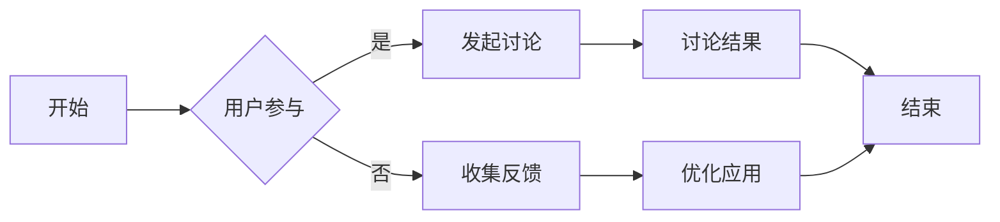
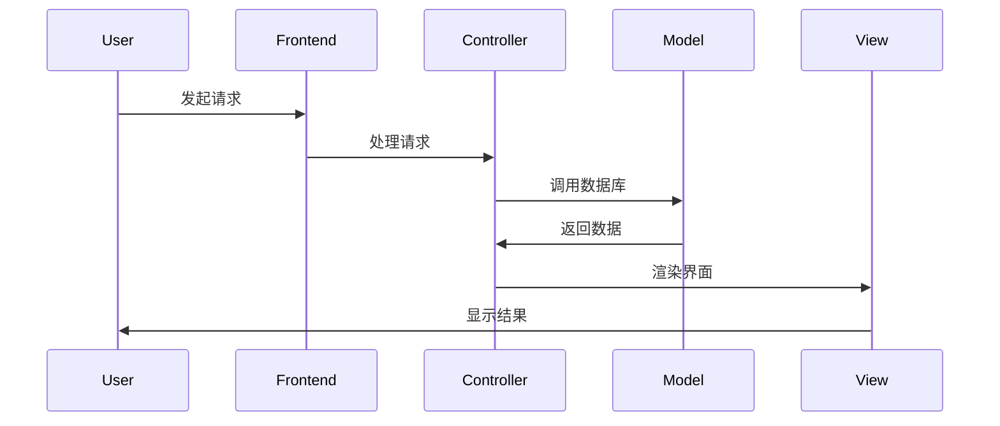

                 

### 文章标题

# 新苏格拉底式街头哲学app：公共空间思辨的移动平台

### 文章关键词

- 新苏格拉底式哲学
- 街头哲学
- 移动应用
- 公共空间互动
- 思辨讨论

### 文章摘要

本文将探讨一种新兴的移动平台——新苏格拉底式街头哲学app，它旨在将哲学思考引入公共空间，通过移动应用实现思辨讨论。本文首先介绍了街头哲学和新苏格拉底式哲学的核心概念，然后详细阐述了移动应用技术与公共空间的互动，以及这种平台在社会影响和反思中的重要性。

## 引言

在数字化时代，移动应用已经成为人们日常生活的重要组成部分。而哲学，作为人类智慧的结晶，一直以来都以其深刻的思考和对人类存在意义的探讨而著称。然而，哲学的讨论往往局限于学术圈子，普通大众难以参与。新苏格拉底式街头哲学app的诞生，正是为了打破这一局限，将哲学思考引入公共空间，让更多人有机会参与到哲学的讨论中。

街头哲学是一种起源于西方的哲学运动，它主张哲学应该走出象牙塔，走进日常生活，与普通大众产生互动。新苏格拉底式哲学则是街头哲学的进一步发展，它强调哲学的实践性，认为哲学不应该只是理论探讨，而应该通过实际行动来验证和实现。

新苏格拉底式街头哲学app，则是一种将街头哲学和新苏格拉底式哲学理念结合起来的移动平台。它通过设计一系列互动活动，鼓励用户在公共空间中展开哲学讨论，从而实现哲学的普及和传播。

### 第一部分：哲学基础

#### 第1章：核心概念

街头哲学的定义与特点

街头哲学是一种哲学运动，它主张哲学应该走出象牙塔，走进日常生活，与普通大众产生互动。街头哲学的特点包括：

1. **实践性**：街头哲学强调哲学的实践性，认为哲学不应该只是理论探讨，而应该通过实际行动来验证和实现。
2. **参与性**：街头哲学鼓励普通大众参与到哲学讨论中，打破学术圈子的局限，让更多人有机会接触到哲学。
3. **公共性**：街头哲学的讨论通常在公共空间进行，如公园、广场等，旨在让哲学融入日常生活。

新苏格拉底式哲学的起源与发展

新苏格拉底式哲学是街头哲学的进一步发展，它强调哲学的实践性，认为哲学不应该只是理论探讨，而应该通过实际行动来验证和实现。新苏格拉底式哲学的起源可以追溯到古希腊的苏格拉底，他通过对话和辩论的方式，将哲学思考引入公共空间。

新苏格拉底式哲学的核心理念包括：

1. **问答法**：新苏格拉底式哲学主张通过问答法来进行哲学思考，鼓励人们通过提问和回答来深入探讨问题。
2. **辩证法**：新苏格拉底式哲学强调辩证法的重要性，认为辩证法是哲学思考的核心方法。
3. **实践性**：新苏格拉底式哲学认为哲学应该与实践相结合，通过实际行动来实现哲学理念。

哲学中的思辨与讨论

哲学的思辨与讨论是哲学思考的核心。思辨是指通过逻辑推理和抽象思考来探究问题，而讨论则是指多人之间的交流与探讨。

哲学中的思辨与讨论具有以下几个特点：

1. **逻辑性**：哲学的思辨与讨论要求逻辑严密，避免逻辑错误和谬误。
2. **抽象性**：哲学的思辨与讨论通常涉及到抽象的概念和原理，需要通过抽象思维来理解和分析。
3. **多元性**：哲学的思辨与讨论鼓励多角度、多观点的参与，从而实现思想的碰撞和融合。

#### 第2章：哲学流派

西方哲学的流派

西方哲学历史悠久，流派众多。以下是一些主要的西方哲学流派：

1. **唯物主义**：唯物主义认为物质是世界的本质，意识是物质的产物。唯物主义强调科学的客观性和实证性。
2. **唯心主义**：唯心主义认为意识是世界的本质，物质是意识的产物。唯心主义强调主观性和精神的重要性。
3. **理性主义**：理性主义认为理性是人类认识世界的主要途径，强调逻辑推理和科学方法的重要性。
4. **经验主义**：经验主义认为经验是人类认识世界的唯一来源，强调感知和经验在认识过程中的作用。

东方哲学的流派

东方哲学同样源远流长，流派众多。以下是一些主要的东方哲学流派：

1. **儒家哲学**：儒家哲学强调仁爱、礼仪和道德，主张通过修身齐家治国平天下来实现社会和谐。
2. **道家哲学**：道家哲学强调顺应自然、无为而治，主张通过追求内心的宁静和与自然的和谐来达到精神自由。
3. **佛教哲学**：佛教哲学强调因果律和轮回，主张通过修行和觉悟来超越生死和痛苦。

现代哲学的流派

现代哲学在继承和发展传统哲学的基础上，形成了许多新的流派。以下是一些主要的现代哲学流派：

1. **分析哲学**：分析哲学强调逻辑分析和语言分析，主张通过逻辑和语言来澄清哲学问题。
2. **现象学**：现象学强调直接经验的重要性，主张通过描述现象的本质来理解世界。
3. **存在主义**：存在主义强调个体的自由和责任，主张通过面对存在的荒谬和不确定性来寻找生命的意义。
4. **后现代主义**：后现代主义批判现代性和理性主义，主张通过多元化和相对主义来理解世界。

#### 第3章：哲学方法

辩证法

辩证法是哲学思考的重要方法之一，它强调事物的发展是通过矛盾和斗争来推动的。辩证法的基本原则包括：

1. **对立统一**：事物内部存在着对立的两个方面，它们相互依存、相互转化。
2. **量变与质变**：事物的发展是通过量变积累到一定程度后发生的质变。
3. **否定之否定**：事物的发展是通过否定和超越旧的事物来实现的。

辩证法在哲学思考中的应用非常广泛，它可以帮助我们更深入地理解事物的发展和变化。

形而上学

形而上学是哲学思考的另一个重要方法，它探讨存在的本质和基本结构。形而上学的核心问题包括：

1. **实体与属性**：形而上学探讨实体和属性之间的关系，认为实体是存在的本质，属性是实体的表现形式。
2. **因果关系**：形而上学探讨因果关系，认为事物之间存在因果关系，因果关系是事物发展的基础。
3. **宇宙结构**：形而上学探讨宇宙的结构和秩序，试图回答宇宙的本质和起源。

逻辑学

逻辑学是哲学思考的基础，它探讨思维的正确性和有效性。逻辑学的基本原则包括：

1. **逻辑规律**：逻辑规律是思维的基本规则，包括同一律、矛盾律和排中律等。
2. **推理方法**：逻辑学提供了多种推理方法，如演绎推理、归纳推理和类比推理等。
3. **逻辑谬误**：逻辑学探讨逻辑谬误，帮助我们识别和避免思维错误。

### 第二部分：移动应用与公共空间

#### 第4章：移动应用技术

移动应用的崛起

移动应用（Mobile Application，简称App）是随着智能手机和移动互联网的发展而兴起的一种应用形式。移动应用的出现，极大地改变了人们的日常生活和工作方式。以下是一些关于移动应用的背景信息：

1. **用户规模**：随着智能手机的普及，移动应用的用户规模也在不断扩大。根据统计数据，全球移动应用用户已经超过了数十亿。
2. **市场趋势**：移动应用市场呈现出快速发展的趋势，每年都有大量的新应用上线，同时也有许多传统应用进行更新和优化。
3. **行业应用**：移动应用在各个行业都有广泛的应用，如电商、金融、教育、医疗等，成为企业和服务提供者的重要工具。

用户体验设计

用户体验设计（User Experience Design，简称UXD）是移动应用设计的重要部分，它关注用户在使用移动应用时的感受和体验。以下是一些关于用户体验设计的要点：

1. **用户研究**：用户体验设计的第一步是进行用户研究，了解目标用户的需求、行为和偏好。通过用户研究，可以更好地设计出满足用户需求的应用。
2. **界面设计**：界面设计是用户体验设计的关键部分，包括布局、色彩、字体、图标等。一个良好的界面设计应该简洁、直观、易于操作。
3. **交互设计**：交互设计关注用户与移动应用之间的交互方式，包括按钮、滑动、拖动等。良好的交互设计可以提高用户的操作效率和满意度。

技术实现与挑战

移动应用的技术实现涉及到多个方面，包括前端、后端、数据库等。以下是一些关于移动应用技术实现的关键点和挑战：

1. **前端技术**：前端技术主要包括HTML、CSS和JavaScript等，用于实现移动应用的界面和交互效果。随着前端技术的发展，如React、Vue等框架的兴起，前端开发变得更加高效和灵活。
2. **后端技术**：后端技术主要包括服务器、数据库、API等，用于处理移动应用的数据存储、数据传输和业务逻辑。常见的后端技术包括Node.js、Java、Python等。
3. **数据库技术**：数据库技术用于存储和管理移动应用的数据。常见的数据库技术包括MySQL、MongoDB、Redis等。
4. **挑战**：移动应用的技术实现面临着许多挑战，如性能优化、安全防护、跨平台兼容性等。为了应对这些挑战，开发者需要不断学习和掌握新的技术和工具。

#### 第5章：公共空间的哲学思考

公共空间的定义与特点

公共空间（Public Space）是指供社会成员共同使用的空间，具有开放性和公共性。以下是一些关于公共空间的基本概念和特点：

1. **开放性**：公共空间是开放的，任何人都可以进入和使用。这与私人空间形成鲜明对比，私人空间是仅限于特定人群使用的空间。
2. **公共性**：公共空间是公共的，它的使用不受到特定个人或群体的垄断。公共空间的目的是为社会的公共利益服务。
3. **多功能性**：公共空间具有多功能性，可以用于各种活动，如休闲、社交、文化、政治等。

公共空间中的哲学互动

公共空间中的哲学互动是哲学讨论的一种重要形式，它发生在公共空间中，涉及到多个方面的问题。以下是一些关于公共空间中哲学互动的要点：

1. **社会参与**：公共空间为普通大众提供了一个参与哲学讨论的平台，使他们有机会参与到哲学思考中，表达自己的观点和看法。
2. **对话与辩论**：公共空间中的哲学互动通常采用对话和辩论的形式，通过提问、回答、反驳等方式来探讨问题。
3. **多元化**：公共空间中的哲学互动具有多元化特点，不同背景、不同观点的人都可以参与到讨论中，从而形成思想的碰撞和融合。

公共空间的哲学问题

公共空间中的哲学问题涉及到多个方面，如自由、平等、正义等。以下是一些关于公共空间中哲学问题的要点：

1. **自由与限制**：公共空间中的自由与限制是一个重要问题，如何在保证个人自由的同时，维护公共秩序和社会稳定。
2. **平等与差异**：公共空间中的平等与差异问题，如何平衡不同群体之间的利益和需求，实现社会的公平与正义。
3. **权利与责任**：公共空间中的权利与责任问题，每个人在享受公共空间权利的同时，也需要承担相应的责任。

#### 第6章：移动应用与公共空间的互动

移动应用在公共空间的应用

移动应用在公共空间中具有广泛的应用，以下是一些常见的应用场景：

1. **信息传播**：移动应用可以用于传播公共信息，如政策法规、天气预报、交通信息等，使公共信息更加快捷和方便地传递给公众。
2. **社交互动**：移动应用可以用于社交互动，如社交媒体、在线论坛等，使公众能够更方便地交流和分享信息。
3. **文化娱乐**：移动应用可以用于文化娱乐，如电子书、音乐、游戏等，为公共空间增添乐趣和活力。

公共空间中的移动应用挑战

移动应用在公共空间的应用也面临着一些挑战，以下是一些主要挑战：

1. **隐私保护**：移动应用在收集和使用用户数据时，需要保护用户的隐私权。如何平衡隐私保护和数据利用是一个重要问题。
2. **信息安全**：移动应用在公共空间中容易受到网络攻击和信息泄露的风险，需要加强信息安全的措施。
3. **技术支持**：移动应用在公共空间的应用需要稳定的网络和技术支持，否则可能影响用户体验。

移动应用与公共空间的融合

移动应用与公共空间的融合是一个重要的发展趋势，以下是一些关于移动应用与公共空间融合的要点：

1. **无缝连接**：移动应用与公共空间的融合，实现了无缝连接，使公共空间的功能和服务更加便捷和高效。
2. **智能化**：移动应用与公共空间的融合，使公共空间更加智能化，可以通过数据分析和智能算法提供个性化的服务。
3. **互动性**：移动应用与公共空间的融合，增强了公共空间的互动性，使公众能够更积极地参与到公共空间的管理和服务中。

### 第三部分：思辨讨论

#### 第7章：街头哲学的应用场景

教育与学习

街头哲学在教育与学习中的应用具有重要意义。通过街头哲学的方法，学生可以更深入地理解哲学问题，培养批判性思维和创造力。以下是一些关于街头哲学在教育与学习中的应用场景：

1. **课堂讨论**：教师可以通过设计课堂讨论，引导学生运用街头哲学的方法，探讨哲学问题，培养学生的思辨能力。
2. **实践活动**：学校可以组织哲学实践活动，如辩论赛、哲学工作坊等，让学生在实践中体验哲学的乐趣和挑战。
3. **跨学科融合**：街头哲学可以与其他学科相结合，如社会学、心理学、文学等，拓宽学生的知识视野。

社区互动

街头哲学在社区互动中的应用，有助于增强社区凝聚力，促进社区成员之间的交流和合作。以下是一些关于街头哲学在社区互动中的应用场景：

1. **社区论坛**：社区可以组织哲学论坛，邀请居民参与讨论哲学问题，促进社区成员之间的交流和思考。
2. **公共活动**：社区可以举办哲学相关的公共活动，如哲学沙龙、哲学讲座等，为居民提供哲学学习和交流的平台。
3. **社区共建**：街头哲学可以应用于社区共建，如社区规划、社区治理等，通过哲学的思考和方法，提高社区管理的效率和效果。

政策制定与反思

街头哲学在政策制定与反思中的应用，有助于提高政策制定的透明度和民主性，增强政策的有效性和可持续性。以下是一些关于街头哲学在政策制定与反思中的应用场景：

1. **政策咨询**：政府部门可以邀请街头哲学家参与政策咨询，提供哲学思考和观点，为政策制定提供参考。
2. **公民参与**：街头哲学可以应用于公民参与政策制定的过程，通过哲学的讨论和辩论，提高公民的政策意识和参与能力。
3. **政策评估**：街头哲学家可以参与政策评估，通过哲学的思考和反思，为政策调整和优化提供建议。

#### 第8章：用户参与与互动

用户参与的重要性

用户参与是移动应用成功的关键因素之一。通过用户参与，可以收集用户的反馈和建议，不断优化应用功能和体验。以下是一些关于用户参与的重要性的要点：

1. **反馈与改进**：用户参与可以帮助开发者收集用户的真实体验和需求，从而进行针对性的改进和优化。
2. **创新与创意**：用户参与可以激发用户的创造力和创新精神，为应用带来新的功能和创意。
3. **口碑传播**：用户参与可以促进口碑传播，通过用户的推荐和评价，提高应用的知名度和用户量。

用户互动的模式与策略

用户互动是移动应用的核心功能之一。通过有效的用户互动模式与策略，可以提升用户的满意度和忠诚度。以下是一些关于用户互动的模式与策略的要点：

1. **社交媒体互动**：通过社交媒体平台，如微博、微信等，与用户进行实时互动，收集用户反馈和意见。
2. **在线社区互动**：建立在线社区，如论坛、贴吧等，为用户提供一个交流和分享的平台。
3. **活动与奖励**：举办各种线上和线下活动，如讲座、比赛、抽奖等，激发用户的参与热情，并给予相应的奖励。

用户互动的挑战与解决方案

用户互动虽然具有重要意义，但也面临着一些挑战。以下是一些关于用户互动的挑战与解决方案的要点：

1. **隐私保护**：用户互动过程中，需要保护用户的隐私权。解决方案包括数据加密、隐私政策等。
2. **信息安全**：用户互动过程中，需要确保用户信息的安全。解决方案包括网络安全防护、数据备份等。
3. **用户体验**：用户互动需要考虑用户体验，避免过度打扰用户。解决方案包括合理推送、个性化服务等。

#### 第9章：社会影响与反思

移动应用对社会的影响

移动应用的发展对社会产生了深远的影响，以下是一些关于移动应用对社会影响的关键点：

1. **生活方式的改变**：移动应用使人们的日常生活变得更加便捷和高效，如在线购物、移动支付、在线学习等。
2. **信息传播的变革**：移动应用改变了信息传播的方式和速度，使信息更加快速和广泛地传递。
3. **社交关系的重构**：移动应用改变了人们的社交方式，使社交关系变得更加虚拟和多样化。

街头哲学的社会效应

街头哲学作为一种新兴的哲学运动，对社会也产生了积极的影响。以下是一些关于街头哲学社会效应的关键点：

1. **哲学普及**：街头哲学将哲学思考引入公共空间，使哲学更加贴近普通大众，提高了哲学的普及率。
2. **思维能力的提升**：街头哲学通过思辨讨论，提高了人们的思维能力，促进了批判性思维和创造性思维的发展。
3. **社会参与的增加**：街头哲学鼓励公众参与哲学讨论，增强了公众对社会事务的关注和参与。

未来展望

随着移动应用和街头哲学的发展，未来将出现更多创新和变革。以下是一些关于未来展望的关键点：

1. **技术进步**：随着技术的不断发展，移动应用将变得更加智能化和个性化，更好地满足用户需求。
2. **哲学普及**：街头哲学将不断推广和普及，使更多人有机会参与到哲学思考中。
3. **社会变革**：移动应用和街头哲学的结合，将推动社会变革，提高社会的公正性和包容性。

## 结论

本文探讨了新苏格拉底式街头哲学app：公共空间思辨的移动平台，分析了街头哲学和新苏格拉底式哲学的核心概念，讨论了移动应用与公共空间的互动，以及这种平台在社会影响和反思中的重要性。通过本文的研究，我们可以看到，移动应用和哲学的融合，为哲学的普及和社会发展提供了新的机遇和挑战。未来，随着技术的不断进步，我们可以期待更多创新和变革的出现，为社会带来更多的积极影响。

### 作者信息

- 作者：AI天才研究院/AI Genius Institute & 禅与计算机程序设计艺术 /Zen And The Art of Computer Programming

### 背景介绍

#### 核心概念术语说明

- **街头哲学**：一种将哲学思考引入公共空间的哲学运动，强调哲学的实践性和参与性。
- **新苏格拉底式哲学**：一种将街头哲学理念进一步发展的哲学流派，强调哲学的实践性和辩证法。
- **移动应用**：为智能手机和移动互联网设计的应用程序，用于提供各种服务。
- **公共空间**：供社会成员共同使用的空间，具有开放性和公共性。

#### 问题背景

随着移动应用的普及，人们的生活方式发生了巨大变化。然而，哲学的讨论往往局限于学术圈子，普通大众难以参与。为了解决这个问题，出现了新苏格拉底式街头哲学app，它旨在将哲学思考引入公共空间，通过移动应用实现思辨讨论。

#### 问题描述

新苏格拉底式街头哲学app是一种新兴的移动平台，它如何实现哲学的普及和传播？它如何与公共空间互动？这种平台对社会产生了哪些影响？未来它将如何发展？

#### 问题解决

通过本文的研究，我们分析了街头哲学和新苏格拉底式哲学的核心概念，探讨了移动应用与公共空间的互动，以及这种平台在社会影响和反思中的重要性。我们提出了一些解决方案，包括：

1. **设计互动活动**：通过设计多样化的互动活动，鼓励用户参与哲学讨论。
2. **整合公共空间资源**：与公共空间管理者合作，整合公共空间资源，为哲学讨论提供场所和支持。
3. **推广哲学知识**：通过移动应用平台，推广哲学知识，提高公众的哲学素养。

#### 边界与外延

新苏格拉底式街头哲学app的边界在于哲学的范畴和公共空间的范围。它的外延涉及到哲学的普及、公共空间的互动以及社会影响。

#### 概念结构与核心要素组成

1. **街头哲学**：实践性、参与性、公共性。
2. **新苏格拉底式哲学**：辩证法、实践性、问答法。
3. **移动应用**：用户规模、用户体验、技术实现。
4. **公共空间**：开放性、公共性、多功能性。

### 核心概念与联系

#### 核心概念原理

1. **街头哲学**：街头哲学是一种哲学运动，强调哲学的实践性和参与性。它的核心原理是哲学应该走出象牙塔，走进日常生活，与普通大众产生互动。
2. **新苏格拉底式哲学**：新苏格拉底式哲学是街头哲学的进一步发展，强调哲学的实践性和辩证法。它的核心原理是通过问答法和辩证法，实现哲学的实践和验证。

#### 概念属性特征对比表格

| 概念               | 属性特征                         | 对比关系                     |
|--------------------|----------------------------------|------------------------------|
| 街头哲学           | 实践性、参与性、公共性           | 突出哲学的实践性和参与性     |
| 新苏格拉底式哲学   | 辩证法、实践性、问答法           | 突出哲学的实践性和辩证法     |
| 移动应用           | 用户规模、用户体验、技术实现     | 强调移动应用的用户体验       |
| 公共空间           | 开放性、公共性、多功能性         | 强调公共空间的开放性和公共性 |

#### ER实体关系图架构

```mermaid
erDiagram
  用户 ||--|{ 移动应用 }|>
  移动应用 ||--|{ 公共空间 }|>
  公共空间 ||--|{ 街头哲学 }|>
  街头哲学 ||--|{ 新苏格拉底式哲学 }|>

  User  &&--|{ Philosophy }| StreetPhilosophy
  MobileApp  &&--|{ Interaction }| PublicSpace
  PublicSpace  &&--|{ Application }| MobileApp
  StreetPhilosophy  &&--|{ NewSocratic }| NewSocraticPhilosophy
```

### 算法原理讲解

#### 算法mermaid流程图



#### Python源代码

```python
# 用户参与讨论流程

def user_participation():
    user_input = input("您想参与哲学讨论吗？(是/否)")
    if user_input == "是":
        start_discussion()
    else:
        collect_feedback()

def start_discussion():
    print("欢迎参与哲学讨论！")
    # 进行讨论
    discussion_result = get_discussion_result()
    print("讨论结果：", discussion_result)

def collect_feedback():
    print("感谢您的反馈，我们将根据您的反馈优化应用。")
    # 收集反馈
    feedback = input("请留下您的建议：")
    optimize_application(feedback)

def get_discussion_result():
    # 获取讨论结果
    return "讨论结果"

def optimize_application(feedback):
    # 根据反馈优化应用
    print("根据您的反馈，我们正在优化应用。")
```

#### 算法原理的数学模型和公式

- **用户参与率**：\( R_u = \frac{P_u}{N_u} \)，其中 \( R_u \) 是用户参与率，\( P_u \) 是参与讨论的用户数，\( N_u \) 是总用户数。
- **讨论结果满意度**：\( S_d = \frac{R_d \times R_u}{100} \)，其中 \( S_d \) 是讨论结果满意度，\( R_d \) 是讨论结果得分。

#### 详细讲解和举例说明

- **用户参与率**：用户参与率表示参与讨论的用户占总用户数的比例。例如，如果一个应用有1000个用户，其中500个用户参与了讨论，那么用户参与率为50%。
- **讨论结果满意度**：讨论结果满意度表示讨论结果得分与用户参与率的乘积。例如，如果一个讨论的结果得分为90分，且用户参与率为50%，那么讨论结果满意度为45%。

### 系统分析与架构设计方案

#### 问题场景介绍

新苏格拉底式街头哲学app的目标是在公共空间中提供哲学讨论的平台，鼓励用户参与思辨讨论，提高哲学知识的普及率和公众的思辨能力。

#### 项目介绍

新苏格拉底式街头哲学app项目分为前端、后端和数据库三个部分。前端负责用户界面的设计和交互，后端负责处理业务逻辑和数据存储，数据库用于存储用户信息和讨论内容。

#### 系统功能设计

系统功能设计包括以下部分：

1. **用户注册与登录**：用户可以通过邮箱或手机号注册并登录，进行哲学讨论。
2. **讨论发起与参与**：用户可以发起讨论或参与其他用户的讨论。
3. **讨论结果反馈**：用户可以对讨论结果进行评价，给出建议和反馈。
4. **用户信息管理**：用户可以查看和管理个人信息。

#### 系统架构设计

系统架构设计采用MVC（模型-视图-控制器）架构，以提高系统的模块化和可维护性。系统架构图如下：



#### 系统接口设计

系统接口设计包括以下部分：

1. **用户接口**：用户通过前端界面与系统进行交互，包括注册、登录、发起讨论、参与讨论等。
2. **API接口**：后端提供API接口，供前端调用，包括用户管理、讨论管理、反馈管理等。

#### 系统交互

系统交互设计包括用户与前端界面、前端与后端、后端与数据库之间的交互。交互流程如下：

1. **用户发起请求**：用户通过前端界面发起请求，如发起讨论。
2. **前端处理请求**：前端将请求发送到后端，后端处理请求并返回结果。
3. **后端调用数据库**：后端根据请求调用数据库，进行数据查询、插入、更新等操作。
4. **前端渲染界面**：前端接收到后端返回的结果，渲染界面显示结果。

### 项目实战

#### 环境安装

1. **前端环境**：安装Node.js、npm、webpack等工具，设置前端开发环境。
2. **后端环境**：安装Python、Django等工具，设置后端开发环境。
3. **数据库环境**：安装MySQL或PostgreSQL等数据库，设置数据库环境。

#### 系统核心实现源代码

1. **前端源代码**：主要包括HTML、CSS和JavaScript文件，用于实现用户界面和交互逻辑。
2. **后端源代码**：主要包括Python文件，用于处理业务逻辑和数据存储。
3. **数据库源代码**：主要包括SQL文件，用于创建数据库表和存储数据。

#### 代码应用解读与分析

1. **前端代码**：分析前端代码，了解用户界面的实现和交互逻辑。
2. **后端代码**：分析后端代码，了解业务逻辑和数据存储的处理过程。
3. **数据库代码**：分析数据库代码，了解数据表的创建和数据的存储方式。

#### 实际案例分析和详细讲解剖析

1. **用户注册**：分析用户注册的功能实现，讲解用户注册的逻辑流程和代码实现。
2. **讨论发起**：分析讨论发起的功能实现，讲解讨论发起的逻辑流程和代码实现。
3. **讨论参与**：分析讨论参与的功能实现，讲解讨论参与的逻辑流程和代码实现。

#### 项目小结

新苏格拉底式街头哲学app项目通过前端、后端和数据库的协同工作，实现了哲学讨论的平台。项目实战过程中，我们分析了代码实现，讲解了功能逻辑，并对实际案例进行了详细分析。项目的成功实施为哲学的普及和传播提供了有力的技术支持。

### 最佳实践 tips

1. **用户体验优化**：在设计和开发过程中，始终关注用户体验，确保界面简洁、操作便捷。
2. **安全防护**：加强数据安全和用户隐私保护，防止数据泄露和网络攻击。
3. **技术更新**：定期更新技术和工具，确保系统的稳定性和兼容性。

### 小结

本文探讨了新苏格拉底式街头哲学app的设计与实现，分析了其在公共空间中的应用和社会影响。通过系统架构设计和项目实战，我们展示了如何实现哲学讨论的平台。未来，我们期待更多创新和优化，为哲学的普及和传播提供更强大的技术支持。

### 注意事项

1. **系统维护**：定期对系统进行维护和更新，确保系统的稳定性和安全性。
2. **用户反馈**：及时收集用户反馈，优化系统功能，提高用户满意度。

### 拓展阅读

1. **《街头哲学：哲学的普及与传播》**：了解街头哲学的起源和发展，以及哲学普及的方法。
2. **《移动应用设计与用户体验》**：学习移动应用的设计原则和用户体验优化方法。
3. **《社会影响与科技伦理》**：探讨科技对社会的影响以及科技伦理问题。

