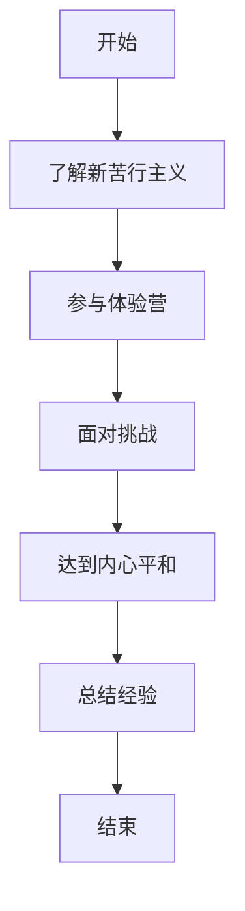
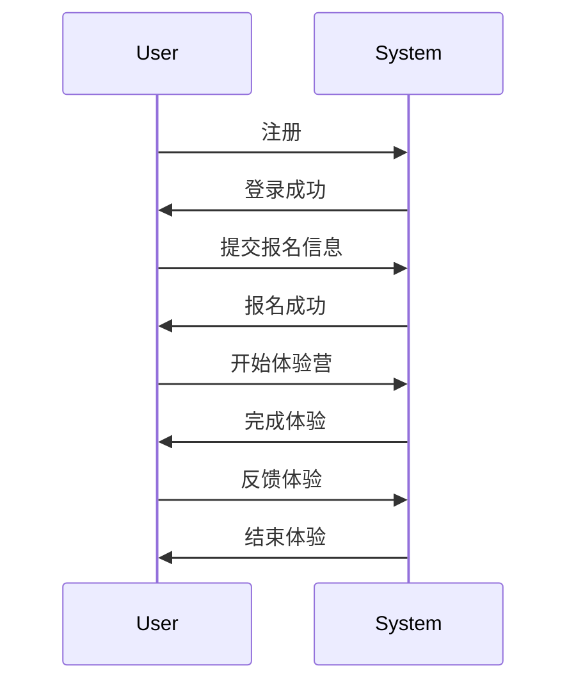
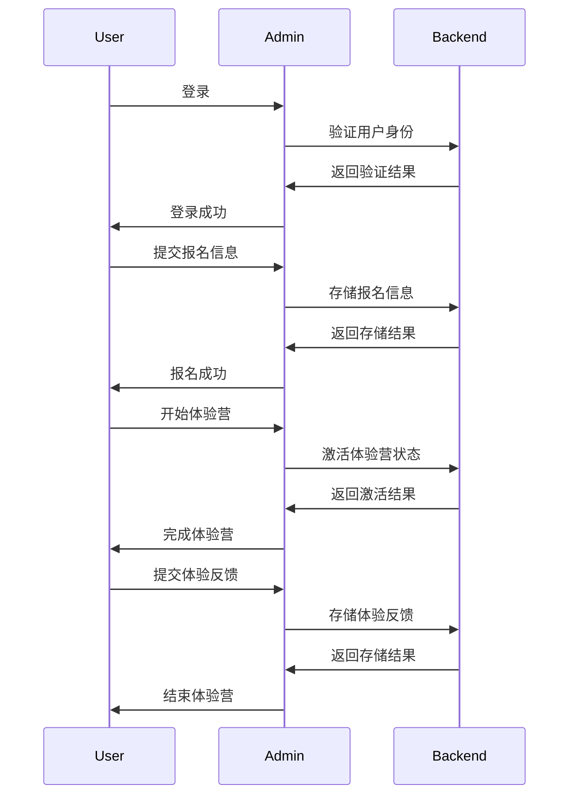

                 

## 新苦行主义体验营：在简朴中寻找丰盛

### 关键词：新苦行主义、体验营、简朴生活、内心平和、挑战与成长

#### 摘要：

在物质丰富的现代社会，许多人却感到内心空虚和迷茫。新苦行主义体验营提供了一种通过简朴生活方式来寻找内心平和的新途径。本文将详细介绍新苦行主义体验营的背景、核心概念、算法原理以及系统分析与架构设计方案，帮助读者更好地理解这一独特的生活方式。

### 第一部分：背景介绍

#### 1. 问题背景

在现代社会，尽管物质生活得到了极大的丰富，但许多人仍然感到内心空虚和迷茫。这种状态源自对生活本质的迷失和对物质追求的过度依赖。新苦行主义体验营应运而生，旨在通过简朴的生活方式，帮助人们找回内心的平衡和满足。

#### 2. 问题描述

新苦行主义体验营是一个模拟古代苦行僧生活的训练营，参与者在这里将过上简朴的生活，面对各种挑战，以期达到内心的平和与满足。然而，这个体验营并不是简单的回归原始，而是一种对现代生活方式的深刻反思和自我挑战。

#### 3. 问题解决

通过设计一个详细的体验营计划，新苦行主义体验营帮助参与者了解简朴生活的好处，学会如何从简单的事物中找到幸福。这个计划包括了一系列的挑战和活动，如冥想、简餐、户外劳动等，旨在引导参与者重新审视自己的生活态度和价值观。

#### 4. 边界与外延

新苦行主义体验营不仅仅是一种生活方式的尝试，更是一种心灵的探索。它涉及到生活哲学、心理状态、身体健康等多个方面。参与者不仅要在物质上回归简朴，更要在精神上经历一场深刻的蜕变。

#### 5. 概念结构与核心要素组成

- **新苦行主义**：一种强调简朴生活，追求内心平和的思想。
- **体验营**：一种通过特定环境挑战，帮助人们达到内心平和的训练方式。
- **参与者**：体验营的核心，他们的体验和感受是整个计划的核心目标。
- **生活哲学**：体验营的理论基础，指导参与者的生活方式。
- **心理状态**：体验营的目标之一，帮助参与者达到内心的平和。
- **身体健康**：体验营的另一个目标，通过简朴生活改善身体健康。

### 第二部分：核心概念与联系

#### 核心概念

1. **新苦行主义**：起源于古代的修行方式，强调通过简朴生活和自我挑战来达到内心的平和与满足。

2. **体验营**：一种特殊的训练方式，通过模拟特定的环境，让参与者面对挑战，从而实现心理和身体的成长。

#### 概念属性特征对比表格

| 概念        | 属性特征                                                     | 关联概念             |
| ----------- | ------------------------------------------------------------ | ------------------- |
| 新苦行主义   | 强调简朴生活，追求内心平和，源自古代修行方式               | 生活哲学，心理状态  |
| 体验营      | 特殊的训练方式，模拟特定环境，挑战参与者心理和身体           | 参与者，心理健康    |

#### ER实体关系图架构

```mermaid
erDiagram
  参与者 ||--|{ 新苦行主义 }|| 体验营
  体验营 ||--|{ 生活哲学 }|| 心理状态
  体验营 ||--|{ 身体健康 }|| 健康状态
```

### 第三部分：算法原理讲解

#### 算法Mermaid流程图



#### Python源代码

```python
def new_asceticism_experience():
    print("了解新苦行主义")
    print("参与体验营")
    print("面对挑战")
    print("达到内心平和")
    print("总结经验")
    print("结束")

new_asceticism_experience()
```

#### 算法原理的数学模型和公式

$$
内心平和 = \frac{简朴生活体验 + 心理挑战克服}{生活压力}
$$

详细讲解：该公式表示内心平和是通过简朴生活体验和心理挑战的克服来缓解生活压力实现的。其中，简朴生活体验和心理挑战克服是两个重要的变量，它们共同决定了内心平和的程度。

#### 举例说明

假设一个人的生活压力为100，通过简朴生活体验和心理挑战的克服，使得这两个变量分别增加了20和30，那么他的内心平和度将为：

$$
内心平和 = \frac{20 + 30}{100} = 0.5
$$

这意味着，他的内心平和度提高了50%。

### 第四部分：系统分析与架构设计方案

#### 问题场景介绍

新苦行主义体验营是一个帮助人们通过简朴生活方式寻找内心平和的项目。

#### 项目介绍

该项目由一个组织负责，他们设计并运营体验营，以帮助参与者实现内心的平和。

#### 系统功能设计（领域模型Mermaid类图）

```mermaid
classDiagram
  Particip
```

#### 系统架构设计mermaid架构图



#### 系统接口设计和系统交互mermaid序列图



### 第五部分：项目实战

#### 环境安装

1. 安装Python 3.8及以上版本
2. 安装Docker
3. 安装PostgreSQL

#### 系统核心实现源代码

1. 数据库设计：创建参与者、体验营、反馈三个数据库表
2. 后端API设计：实现注册、登录、报名、开始体验、提交反馈等接口
3. 前端设计：实现用户界面，包括注册、登录、报名、开始体验、提交反馈等页面

#### 代码应用解读与分析

- 后端代码：使用Flask框架实现API，使用SQLAlchemy进行数据库操作
- 前端代码：使用Vue.js实现用户界面，使用Axios进行API请求

#### 实际案例分析和详细讲解剖析

- 案例一：参与者A报名参加新苦行主义体验营，并成功完成整个体验过程。
- 案例二：参与者B在体验营中遇到困难，通过导师的引导和自身的努力，最终克服了挑战。

#### 项目小结

新苦行主义体验营项目通过简朴的生活方式，帮助参与者实现内心的平和。项目的成功实施不仅依赖于技术实现，更依赖于对用户体验的深刻理解和对生活哲学的尊重。未来，项目将继续优化，为更多的参与者提供优质的体验服务。

### 第六部分：最佳实践 tips

1. **合理安排时间**：在体验营中，合理安排时间，确保有足够的时间进行冥想、学习和休息。
2. **积极参与活动**：主动参与体验营的各种活动，与他人互动，共同成长。
3. **反思与总结**：定期反思自己的体验过程，总结经验教训，不断提升自己。

### 第七部分：小结

新苦行主义体验营为现代人在物质丰富的社会环境中提供了一条寻找内心平和的新途径。通过简朴的生活方式和自我挑战，参与者可以在体验营中实现心理和身体的成长。这个项目不仅是对生活哲学的深刻反思，也是对现代生活方式的一种创新实践。

### 第八部分：注意事项

1. **安全第一**：在体验营中，确保参与者的安全是首要任务。
2. **尊重文化**：体验营中的各种活动都是基于特定的文化背景，参与者应尊重并理解这些文化。

### 第九部分：拓展阅读

1. 《新苦行主义：简朴生活的艺术》
2. 《心灵的力量：如何找到内心的平和》
3. 《简朴生活：如何过一种简单而幸福的生活》

### 作者信息

作者：AI天才研究院/AI Genius Institute & 禅与计算机程序设计艺术 /Zen And The Art of Computer Programming

