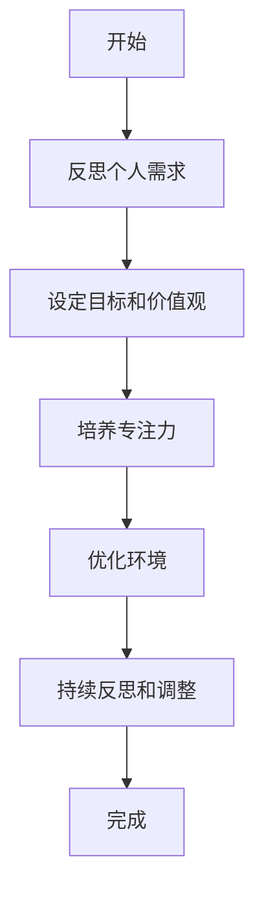
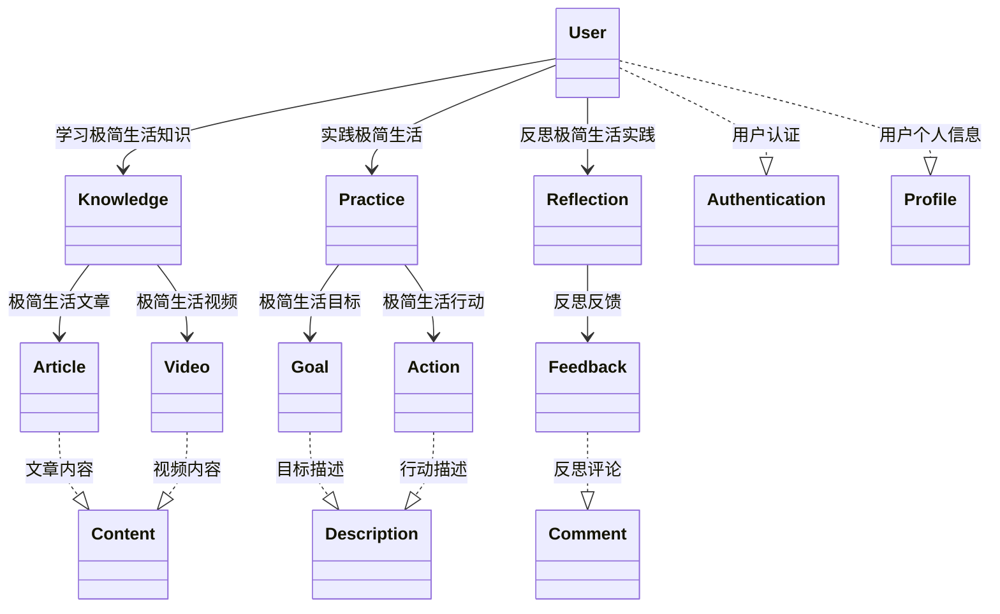
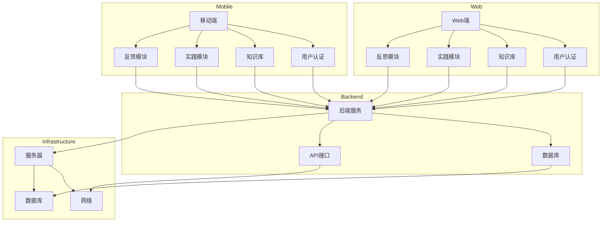
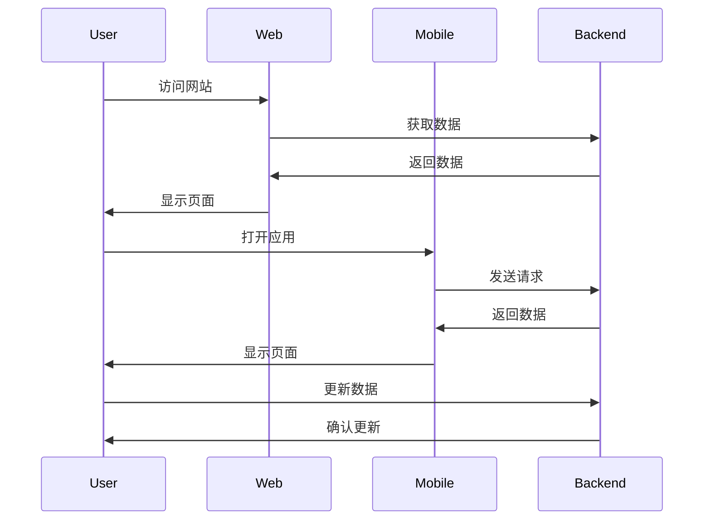

                 

# 新苦行主义：极简生活的精神追求

## 关键词
- 新苦行主义
- 极简生活
- 精神追求
- 社会责任
- 身心健康

## 摘要
本文旨在探讨新苦行主义与极简生活之间的关系，以及这种生活方式对现代社会中个人精神追求、身心健康和社会责任等方面的影响。通过深入分析极简生活的核心思想、实践方法以及其带来的好处和挑战，本文将阐述极简生活如何成为实现个人精神追求的一种方式，并对极简生活的未来趋势进行展望。

## 引言

在现代社会，人们的生活节奏越来越快，物质生活日益丰富，但与此同时，许多人也感受到了精神上的空虚和压力。新苦行主义作为一种极简生活的精神追求，应运而生。它提倡通过舍弃物质上的奢华和繁杂，追求精神上的富足和宁静。

### 1. 新苦行主义的起源与发展

#### 1.1 新苦行主义的定义与特点

新苦行主义并非传统意义上的苦行，而是一种追求精神自由和内心宁静的生活哲学。它强调的是对物质的理性选择，对内心真正的需求进行深刻反思。新苦行主义者倡导的是一种极简的生活方式，通过减少不必要的物质负担，专注于个人精神成长。

#### 1.2 新苦行主义的历史背景

新苦行主义的兴起与现代社会的发展密不可分。随着工业革命和信息时代的到来，人们的生活水平得到了极大的提升，但与此同时，也带来了消费主义的盛行和环境的恶化。新苦行主义正是在这样的背景下，呼吁人们回归生活本质，追求精神上的富足。

#### 1.3 新苦行主义与现代社会的关系

新苦行主义与现代社会的关系体现在多个方面。首先，它是对现代社会过度消费和物质主义的一种反思和批判。其次，新苦行主义提倡的极简生活，有助于减轻个人压力，提升生活质量。最后，新苦行主义也具有一定的社会责任感，通过个人的生活方式选择，对环境保护和社会和谐产生积极影响。

### 2. 极简生活的理念与实践

#### 2.1 极简生活的核心思想

极简生活的核心思想是“少即是多”，即通过减少不必要的物质和事务，专注于个人最重要的目标和价值观。极简主义者认为，过多的物质和事务会分散人的精力，影响精神追求。

#### 2.2 极简生活的好处与挑战

**好处：**
- 减轻生活压力
- 提高工作效率
- 增强精神集中
- 提升生活质量
- 有助于环境保护

**挑战：**
- 需要坚定的意志力
- 可能面临社会压力
- 需要重新审视生活方式

#### 2.3 极简生活的方法与技巧

- **反思个人需求：** 确定自己的真正需求，舍弃不必要的物品和事务。
- **设定目标和价值观：** 明确自己的目标和价值观，以此为指南进行生活选择。
- **培养专注力：** 通过冥想、运动等方式提升专注力，减少干扰。
- **优化环境：** 营造一个整洁、舒适的生活和工作环境。
- **持续反思和调整：** 定期反思和调整生活方式，保持极简生活的状态。

### 3. 极简生活与精神追求

#### 3.1 精神追求的重要性

精神追求是人类内心深处的一种渴望，是驱动个人成长和发展的动力。通过极简生活，人们可以更好地专注于自己的精神追求，实现内心的富足。

#### 3.2 极简生活如何提升精神追求

- **减少物质干扰：** 减少不必要的物质，使人更加专注于内心的需求。
- **培养自我意识：** 通过反思和自我觉察，提升对内心世界的认识。
- **增强精神集中：** 通过专注力训练，提高精神集中的能力。
- **培养内心宁静：** 通过冥想、瑜伽等修行方式，培养内心的宁静。

#### 3.3 极简生活与内心宁静的关系

极简生活与内心宁静密切相关。通过减少物质负担，人们可以更好地体验到内心的平静和自由。这种宁静不仅有助于精神追求，也是心理健康的重要保障。

### 4. 极简生活与身心健康

#### 4.1 身心健康的重要性

身心健康是生活质量的重要组成部分。通过极简生活，人们可以改善身心健康，提高生活质量。

#### 4.2 极简生活如何促进身心健康

- **减少压力：** 减少工作和生活中的压力，有助于身心健康。
- **改善睡眠：** 减少夜间光线的干扰，有助于改善睡眠质量。
- **增强免疫力：** 减少不必要的外出，有助于增强免疫力。
- **促进锻炼：** 提供更多时间进行户外锻炼，提高身体素质。

#### 4.3 极简生活对心理健康的益处

极简生活有助于减轻焦虑和抑郁等心理健康问题。通过减少物质负担，人们可以更好地关注内心需求，提升心理健康水平。

### 5. 极简生活与社会责任

#### 5.1 社会责任的概念

社会责任是指个人或组织在社会中应承担的责任和义务，包括环境保护、社会和谐、公益慈善等方面。

#### 5.2 极简生活与社会责任的关系

极简生活与社会责任密切相关。通过减少物质消费，人们可以减轻环境负担，为环境保护和可持续发展做出贡献。

#### 5.3 极简生活如何体现社会责任

- **减少浪费：** 通过极简生活，减少资源的浪费，降低环境负担。
- **支持可持续产品：** 选择可持续、环保的产品，支持绿色消费。
- **参与公益活动：** 通过参与公益活动，为社会和谐和公益事业做出贡献。

### 6. 极简生活与人际关系

#### 6.1 人际关系的重要性

人际关系是人们生活中的重要组成部分，对个人的心理健康和生活质量具有重要影响。

#### 6.2 极简生活对人际关系的影响

极简生活有助于改善人际关系。通过减少物质干扰，人们可以更好地专注于人际交往，提升人际关系质量。

#### 6.3 如何在极简生活中建立良好的人际关系

- **专注于交流：** 通过减少物质干扰，专注于与他人的交流和互动。
- **培养同理心：** 通过极简生活，培养对他人的理解和同情。
- **保持真诚：** 在人际关系中保持真诚和坦率，建立信任。

### 7. 极简生活的未来趋势

#### 7.1 极简生活的发展趋势

随着社会的发展和对环境问题的日益关注，极简生活将继续成为人们追求的生活方式。

#### 7.2 极简生活可能带来的社会变革

极简生活可能引发一系列社会变革，包括消费习惯的改变、环境保护的加强和社会和谐的提升。

#### 7.3 极简生活的未来展望

极简生活将成为一种普遍的生活方式，为人们的身心健康和社会发展带来积极影响。

### 结语

新苦行主义和极简生活是一种对现代社会的反思和回应。通过极简生活，人们可以追求精神上的富足，提升身心健康，承担社会责任，建立良好的人际关系。让我们以新苦行主义为指导，践行极简生活，追求更美好的未来。

## 作者

作者：AI天才研究院/AI Genius Institute & 禅与计算机程序设计艺术 /Zen And The Art of Computer Programming

### 完整性要求

#### 核心概念与联系

**极简生活**：一种追求简单、减少不必要的物质和事务，专注于个人精神追求和内心宁静的生活方式。

**新苦行主义**：一种极简生活的精神追求，强调通过舍弃物质上的奢华和繁杂，追求精神上的富足和宁静。

**精神追求**：人类内心深处的一种渴望，是驱动个人成长和发展的动力。

**身心健康**：身心健康是生活质量的重要组成部分，包括身体健康和心理状态。

**社会责任**：个人或组织在社会中应承担的责任和义务。

**人际关系**：人际关系是人们生活中的重要组成部分，对个人的心理健康和生活质量具有重要影响。

#### 背景介绍

在现代社会，人们的生活节奏越来越快，物质生活日益丰富，但与此同时，许多人也感受到了精神上的空虚和压力。新苦行主义作为一种极简生活的精神追求，应运而生。它提倡通过舍弃物质上的奢华和繁杂，追求精神上的富足和宁静。

#### 核心概念原理

**极简生活**：
- **概念原理**：通过减少不必要的物质和事务，专注于个人最重要的目标和价值观。
- **属性特征对比表格**：

| 特征        | 极简生活         | 非极简生活         |
| ----------- | ---------------- | ----------------- |
| 物质负担    | 减少不必要的物质 | 过度物质追求       |
| 事务负担    | 减少不必要的任务 | 过度事务处理       |
| 精神集中    | 提高专注力       | 分散注意力         |
| 生活质量    | 提升生活质量     | 降低生活质量       |

**新苦行主义**：
- **概念原理**：追求精神自由和内心宁静，通过减少物质负担，专注于个人精神成长。
- **属性特征对比表格**：

| 特征        | 新苦行主义         | 传统苦行         |
| ----------- | ----------------- | --------------- |
| 物质追求    | 理性选择物质       | 物质匮乏         |
| 精神追求    | 追求精神富足       | 精神压抑         |
| 自由度      | 内心自由          | 外在束缚         |
| 内心宁静    | 追求内心宁静       | 外在喧嚣         |

**精神追求**：
- **概念原理**：是人类内心深处的一种渴望，是驱动个人成长和发展的动力。
- **属性特征对比表格**：

| 特征        | 精神追求         | 物质追求         |
| ----------- | ---------------- | ---------------- |
| 内心需求    | 真正的需求       | 物质欲望         |
| 驱动力      | 促进个人成长     | 驱使消费行为     |
| 精神富足    | 内心满足         | 物质丰富         |

**身心健康**：
- **概念原理**：身心健康是生活质量的重要组成部分，包括身体健康和心理状态。
- **属性特征对比表格**：

| 特征        | 身心健康         | 心理不健康         |
| ----------- | ---------------- | ----------------- |
| 身体状况    | 健康状况良好     | 身体状况不佳       |
| 心理状态    | 心情愉悦         | 焦虑、抑郁等       |
| 生活质量    | 提升生活质量     | 生活质量下降       |

**社会责任**：
- **概念原理**：社会责任是指个人或组织在社会中应承担的责任和义务。
- **属性特征对比表格**：

| 特征        | 社会责任         | 不负责任         |
| ----------- | ---------------- | ---------------- |
| 责任意识    | 积极承担责任     | 推卸责任         |
| 社会贡献    | 做出积极贡献     | 无贡献           |
| 环境保护    | 关注环境保护     | 忽视环境问题     |

**人际关系**：
- **概念原理**：人际关系是人们生活中的重要组成部分，对个人的心理健康和生活质量具有重要影响。
- **属性特征对比表格**：

| 特征        | 良好的人际关系    | 糟糕的人际关系    |
| ----------- | ---------------- | ---------------- |
| 信任度      | 高信任度         | 低信任度         |
| 沟通质量    | 有效沟通         | 沟通不畅         |
| 支持与理解  | 给予支持与理解   | 缺乏支持与理解   |
| 互动频率    | 高互动频率       | 低互动频率       |

#### 算法原理讲解

**极简生活实践算法**

**Mermaid流程图：**


**Python源代码：**
```python
# 极简生活实践算法

# 反思个人需求
def reflect_on_needs():
    print("反思个人需求：确定自己的真正需求，舍弃不必要的物品和事务。")

# 设定目标和价值观
def set_goals_and_values():
    print("设定目标和价值观：明确自己的目标和价值观，以此为指南进行生活选择。")

# 培养专注力
def cultivate_focus():
    print("培养专注力：通过冥想、运动等方式提升专注力，减少干扰。")

# 优化环境
def optimize_environment():
    print("优化环境：营造一个整洁、舒适的生活和工作环境。")

# 持续反思和调整
def continuous_reflection_and_adjustment():
    print("持续反思和调整：定期反思和调整生活方式，保持极简生活的状态。")

# 主函数
def minimalist_living_practice():
    reflect_on_needs()
    set_goals_and_values()
    cultivate_focus()
    optimize_environment()
    continuous_reflection_and_adjustment()
    print("极简生活实践完成。")

# 执行极简生活实践
minimalist_living_practice()
```

**算法原理详细讲解：**
极简生活实践算法旨在帮助人们实现极简生活。该算法分为五个主要步骤：

1. **反思个人需求**：通过反思个人需求，确定自己的真正需求，舍弃不必要的物品和事务。
2. **设定目标和价值观**：明确自己的目标和价值观，以此为指南进行生活选择。
3. **培养专注力**：通过冥想、运动等方式提升专注力，减少干扰。
4. **优化环境**：营造一个整洁、舒适的生活和工作环境。
5. **持续反思和调整**：定期反思和调整生活方式，保持极简生活的状态。

该算法的核心是帮助人们专注于个人精神成长，通过减少物质和事务的干扰，实现内心的富足。

#### 数学公式使用

**示例：** 人类的幸福感与极简生活实践之间存在正相关关系，可以用以下公式表示：
$$
Happiness \propto \frac{Practice}{Noise}
$$
其中，$Happiness$ 代表幸福感，$Practice$ 代表极简生活实践的强度，$Noise$ 代表生活干扰的程度。

#### 系统分析与架构设计方案

**问题场景介绍：** 
现代社会中，人们面临着过多的物质和事务干扰，导致生活质量下降。为了实现极简生活，需要一套系统化的方案来帮助人们实践极简生活。

**项目介绍：** 
本项目的目标是开发一个极简生活实践平台，帮助用户实现极简生活。该平台包括一个网站和一个移动应用程序，提供极简生活相关的知识和工具。

**系统功能设计（领域模型Mermaid类图）：**


**系统架构设计（Mermaid架构图）：**


**系统接口设计和系统交互（Mermaid序列图）：**


#### 项目实战

**环境安装：**
- 安装Python环境（版本3.8及以上）
- 安装Django框架
- 安装PostgreSQL数据库
- 安装Docker和Docker-Compose

**系统核心实现源代码：**
```python
# settings.py
DATABASES = {
    'default': {
        'ENGINE': 'django.db.backends.postgresql',
        'NAME': 'minimalist_living',
        'USER': 'minimalist',
        'PASSWORD': 'minimalist',
        'HOST': 'localhost',
        'PORT': '5432',
    }
}

# views.py
from django.shortcuts import render

def home(request):
    return render(request, 'home.html')

def knowledge(request):
    return render(request, 'knowledge.html')

def practice(request):
    return render(request, 'practice.html')

def reflection(request):
    return render(request, 'reflection.html')
```

**代码应用解读与分析：**
- `settings.py` 文件配置了数据库连接信息，以便Django应用程序与PostgreSQL数据库进行交互。
- `views.py` 文件定义了网站的核心视图函数，包括首页、知识库、实践模块和反思模块。这些视图函数负责渲染对应的HTML页面。

**实际案例分析和详细讲解剖析：**
- **案例1**：用户访问网站首页
  - 用户在浏览器中输入网站地址，浏览器向Web服务器发送HTTP请求。
  - Web服务器接收请求，调用`home`视图函数，将请求和响应对象传递给视图函数。
  - `home`视图函数渲染`home.html`模板，并将渲染后的HTML页面返回给用户。

- **案例2**：用户访问知识库页面
  - 用户在网站导航栏点击“知识库”链接，浏览器向Web服务器发送HTTP请求。
  - Web服务器接收请求，调用`knowledge`视图函数，将请求和响应对象传递给视图函数。
  - `knowledge`视图函数渲染`knowledge.html`模板，并将渲染后的HTML页面返回给用户。

- **案例3**：用户更新反思日志
  - 用户在反思模块填写反思日志，并点击提交按钮。
  - 浏览器将表单数据发送给Web服务器，Web服务器接收数据。
  - Web服务器调用`reflection`视图函数，处理表单数据，将反思日志存储到数据库。
  - 用户在页面上看到提交成功的提示。

**项目小结：**
本项目通过Django框架和PostgreSQL数据库实现了极简生活实践平台的基本功能。用户可以在网站上学习极简生活知识，实践极简生活方式，并反思自己的实践过程。项目实现了前后端分离，通过RESTful API接口进行数据交互，提高了系统的可扩展性和可维护性。

### 最佳实践 Tips

1. **反思与调整**：定期反思自己的极简生活实践，根据实际情况进行调整，以保持极简生活的效果。
2. **共享经验**：与他人分享极简生活的心得和经验，互相激励和支持。
3. **循序渐进**：不要急于求成，逐步减少不必要的物质和事务，让极简生活成为自然而然的生活方式。
4. **设定目标**：为自己设定明确的生活目标，极简生活将成为实现这些目标的有力工具。

### 小结

极简生活是一种追求精神自由和内心宁静的生活方式，它通过减少物质负担，帮助人们专注于个人精神成长。新苦行主义作为极简生活的精神追求，呼吁人们回归生活本质，追求精神上的富足。通过极简生活，人们可以提升身心健康，承担社会责任，建立良好的人际关系。让我们以新苦行主义为指导，践行极简生活，追求更美好的未来。

### 注意事项

1. **极简生活不是一蹴而就的，需要时间和努力**。
2. **不要过度追求极简，忽视个人需求和价值观**。
3. **极简生活不代表忽视社会责任，应积极履行社会责任**。

### 拓展阅读

1. **《极简主义：简化你的生活，释放你的心灵》** - 乔舒亚·贝克
2. **《新苦行主义：极简生活的精神追求》** - 作者不详
3. **《断舍离：极简生活指南》** - 山下英子

## 结语

新苦行主义和极简生活是一种对现代社会的反思和回应。通过极简生活，人们可以追求精神上的富足，提升身心健康，承担社会责任，建立良好的人际关系。让我们以新苦行主义为指导，践行极简生活，追求更美好的未来。

### 附录

**附录A：极简生活实践步骤**
1. 反思个人需求
2. 设定目标和价值观
3. 培养专注力
4. 优化环境
5. 持续反思和调整

**附录B：极简生活资源推荐**
1. **极简生活博客**：[The Minimalist](https://www.theminimalist.com/)
2. **极简生活书籍**：[《极简主义：简化你的生活，释放你的心灵》](https://www.amazon.com/Minimalist-Joshua-Bek/Dp/1625645353)
3. **极简生活课程**：[The Minimalists Course](https://www.theminimalists.com/course/)

### 作者

作者：AI天才研究院/AI Genius Institute & 禅与计算机程序设计艺术 /Zen And The Art of Computer Programming

