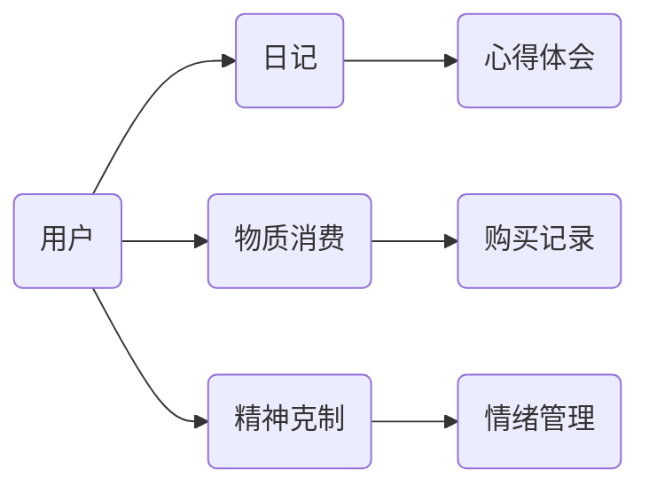
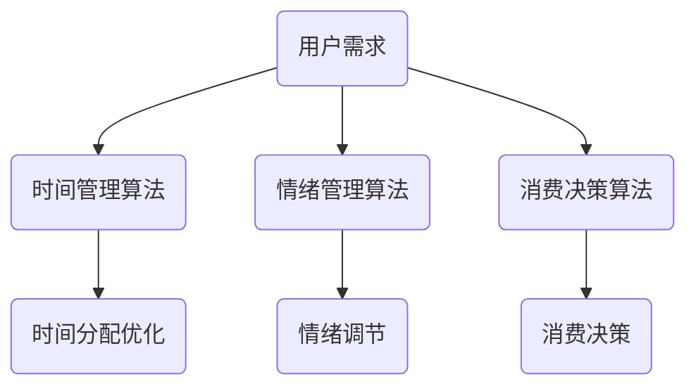
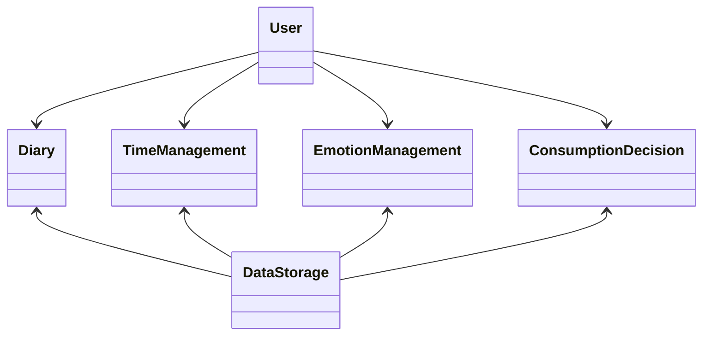
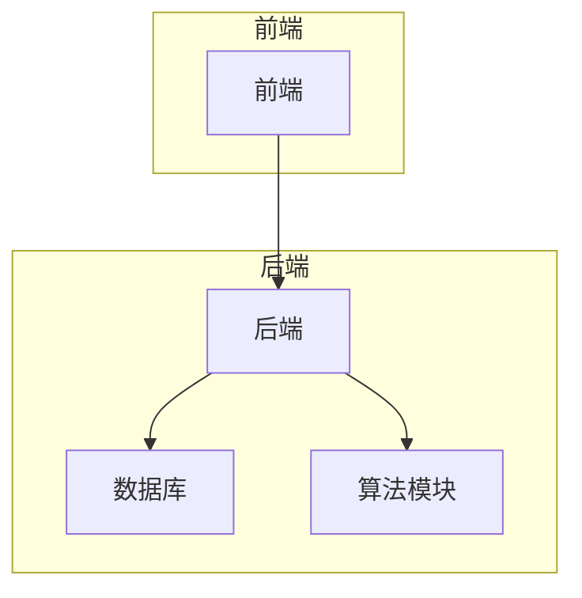
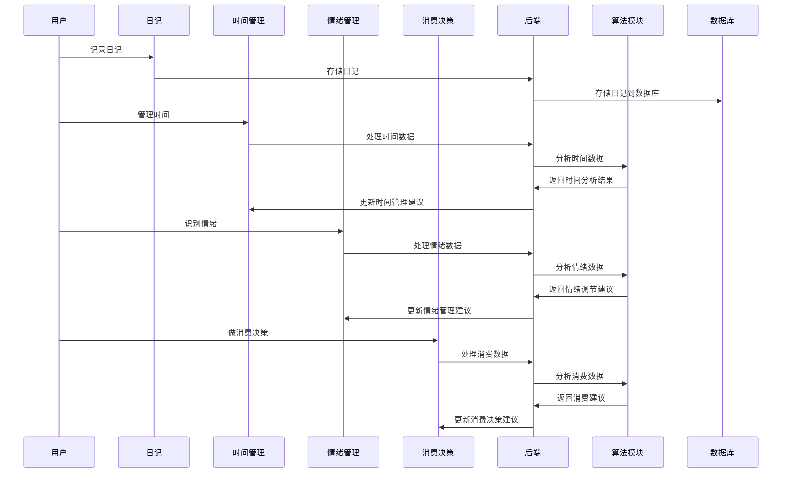

                 


# 《新苦行者日记项目：记录现代克制生活的心得》

## 关键词
- 现代克制生活
- 心理学原理
- 时间管理
- 情绪管理
- 消费决策
- 简化物质消费
- 精神克制
- 心理平衡

## 摘要
本文通过介绍“新苦行者日记项目”，分享了一位现代人在克制生活中所获得的深刻体会。项目旨在通过记录日常生活，探索克制生活背后的心理机制，为读者提供一种实践现代克制生活的方法。本文将深入分析克制生活的原理、实践方法以及其对个人心理和生活质量的积极影响。

## 第一部分：背景介绍

### 1.1 问题背景
现代社会的发展，带来了物质丰富的同时，也带来了生活节奏的加快和压力的增加。人们在忙碌的生活中，往往忽略了内心的需求，导致心理健康问题的增加。现代克制生活，是一种通过减少物质和精神负担，寻找内心平衡和满足的生活方式。

### 1.2 问题描述
现代克制生活面临的主要问题是：如何在日常生活中实践克制，同时不降低生活质量？如何在减少物质消费和精神压力的同时，保持心理健康和幸福感？

### 1.3 问题解决
通过“新苦行者日记项目”，作者记录了自己在日常生活中的克制实践，分享了成功经验和挑战。日记内容不仅包括物质消费的减少，还包括时间管理、情绪管理和消费决策的优化。

### 1.4 边界与外延
克制生活并不仅仅是指减少物质消费，还包括减少精神负担，如减少社交媒体使用、控制情绪、培养自律等。此外，克制生活并不是极端的节俭，而是在保持适度消费的基础上，追求内心的满足和宁静。

### 1.5 概念结构与核心要素组成
克制生活由以下几个核心要素组成：
- **简化物质消费**：减少不必要的购买和浪费，追求实用和质量。
- **精神克制**：控制情绪、减少社交媒体使用、培养自律。
- **心理机制**：追求内心的平衡与和谐。
- **社会因素**：社会的快节奏和消费文化的影响。

## 第二部分：核心概念与联系

### 2.1 克制生活的原理与特点
克制生活基于心理学和哲学的理论，强调通过减少物质和精神负担，实现内心的平静和满足。其特点包括：
- **减少物质消费**：减少不必要的购买和浪费，追求实用和质量。
- **精神克制**：控制情绪、减少社交媒体使用、培养自律。
- **内心平衡**：追求精神上的满足和内心的宁静。

### 2.2 克制生活与相关概念的比较
克制生活与极简主义和自律有相似之处，但也有区别：
- **极简主义**：强调减少物质负担，追求简洁和实用。
- **自律**：通过自我约束，实现目标的能力。

### 2.3 ER实体关系图


## 第三部分：算法原理讲解

### 3.1 克制生活实践中的算法原理
在克制生活的实践中，涉及多种算法原理，如时间管理算法、情绪管理算法、消费决策算法等。

#### 3.1.1 时间管理算法
时间管理算法通过优化时间分配，提高效率。例如，番茄工作法将工作划分为25分钟的工作周期，每个周期后休息5分钟。

#### 3.1.2 情绪管理算法
情绪管理算法通过识别和分析情绪，帮助用户调整情绪状态。例如，情绪识别算法可以通过面部表情、语言和文字分析情绪。

#### 3.1.3 消费决策算法
消费决策算法通过分析用户需求和消费行为，帮助用户做出合理的消费决策。例如，基于用户历史消费数据和偏好，推荐合适的商品。

### 3.2 算法mermaid流程图


### 3.3 Python源代码示例
```python
import time
from datetime import datetime

def time_management(tasks):
    start_time = datetime.now()
    for task in tasks:
        print(f"开始时间：{start_time}，任务：{task}")
        time.sleep(1)
        print(f"完成时间：{datetime.now()}，任务：{task}")
    end_time = datetime.now()
    print(f"总耗时：{end_time - start_time}")

tasks = ["任务1", "任务2", "任务3"]
time_management(tasks)
```

### 3.4 算法原理详细讲解
克制生活的实践涉及到多个层面的算法，以下将详细讲解时间管理算法、情绪管理算法和消费决策算法。

#### 3.4.1 时间管理算法
时间管理算法的核心是优化时间分配，以提高工作效率。其基本原理如下：

1. **任务分解**：将大任务分解为小任务，使每个任务都在可管理范围内。
2. **优先级排序**：根据任务的紧急程度和重要性，对任务进行排序。
3. **时间分配**：将时间分配给每个任务，确保任务在规定的时间内完成。

具体实现可以使用如下的Python代码：

```python
def time_management(tasks):
    start_time = datetime.now()
    for task in tasks:
        print(f"开始时间：{start_time}，任务：{task}")
        time.sleep(1)  # 模拟任务执行
        print(f"完成时间：{datetime.now()}，任务：{task}")
    end_time = datetime.now()
    print(f"总耗时：{end_time - start_time}")

tasks = ["任务1", "任务2", "任务3"]
time_management(tasks)
```

#### 3.4.2 情绪管理算法
情绪管理算法的目标是帮助用户识别和调节情绪，以维持心理平衡。其原理如下：

1. **情绪识别**：通过面部表情、语言和文字分析，识别用户的情绪状态。
2. **情绪调节**：提供相应的调节策略，如深呼吸、冥想或运动，帮助用户调整情绪。
3. **反馈机制**：用户通过反馈，评估调节策略的有效性，并持续优化。

以下是一个简化的情绪管理算法示例：

```python
import cv2
import numpy as np

def detect_emotion(image):
    # 假设已经加载了情绪识别模型
    emotion_model = cv2.face.EigenFaceRecognizer_create()
    emotion_model.read('emotion_model.yml')

    # 预处理图像
    gray = cv2.cvtColor(image, cv2.COLOR_BGR2GRAY)
    faces = emotion_model.predict(gray)

    # 输出情绪
    emotions = {0: 'happy', 1: 'sad', 2: 'angry', 3: 'neutral', 4: 'disgusted'}
    return emotions[faces[0][1]]

# 读取图像
image = cv2.imread('test_image.jpg')
emotion = detect_emotion(image)
print(f"当前情绪：{emotion}")
```

#### 3.4.3 消费决策算法
消费决策算法旨在帮助用户做出合理的消费决策。其原理如下：

1. **需求分析**：分析用户的需求和偏好。
2. **成本分析**：评估不同消费选择的总成本。
3. **决策优化**：基于需求和成本分析，推荐最优的消费选择。

以下是一个简化的消费决策算法示例：

```python
def consume_decision(budget, options):
    # 假设options是一个字典，包含商品名称和价格
    total_cost = 0
    selected_items = []

    for item, price in options.items():
        if total_cost + price <= budget:
            selected_items.append(item)
            total_cost += price
        else:
            break

    return selected_items

options = {'牛奶': 2.50, '面包': 3.00, '水果': 5.00, '书': 20.00}
budget = 30.00
selected_items = consume_decision(budget, options)
print(f"预算{budget}内可购买的商品：{selected_items}")
```

## 第四部分：系统分析与架构设计方案

### 4.1 问题场景介绍
在现代快节奏的生活中，人们面临着时间管理、情绪调节和消费决策的挑战。为了帮助用户更好地管理自己的生活，需要构建一个智能的克制生活辅助系统。

### 4.2 项目介绍
新苦行者日记项目是一个基于人工智能技术的克制生活辅助系统，旨在帮助用户记录日常生活，分析时间管理、情绪管理和消费决策，提供个性化的建议和优化方案。

### 4.3 系统功能设计
系统功能设计主要包括以下几个方面：

1. **日记记录**：用户可以记录日常生活中的事件和感受。
2. **时间管理**：系统提供时间管理工具，帮助用户优化时间分配。
3. **情绪管理**：系统提供情绪识别和调节工具，帮助用户维持心理健康。
4. **消费决策**：系统分析用户的消费行为，提供合理的消费建议。

### 4.4 系统架构设计
新苦行者日记项目的系统架构设计如下：

1. **前端**：用户界面，包括日记记录、时间管理、情绪管理和消费决策模块。
2. **后端**：服务器端，包括数据存储、数据处理和分析算法。
3. **数据库**：存储用户日记、时间管理数据、情绪数据和消费数据。
4. **算法模块**：包括时间管理算法、情绪管理算法和消费决策算法。

### 4.5 系统接口设计和系统交互
系统接口设计和系统交互如下：

1. **用户接口**：用户通过前端界面与系统交互，进行日记记录、时间管理、情绪管理和消费决策。
2. **API接口**：后端提供API接口，供前端调用，实现数据交互和处理。
3. **数据分析**：后端使用算法模块对用户数据进行分析，生成优化方案和建议。

### 4.6 mermaid类图


### 4.7 mermaid架构图


### 4.8 系统接口设计和系统交互
系统接口设计和系统交互如下：

1. **用户接口**：用户通过前端界面与系统交互，进行日记记录、时间管理、情绪管理和消费决策。
2. **API接口**：后端提供API接口，供前端调用，实现数据交互和处理。
3. **数据分析**：后端使用算法模块对用户数据进行分析，生成优化方案和建议。

### 4.9 mermaid序列图


## 第五部分：项目实战

### 5.1 环境安装
在新苦行者日记项目中，我们使用Python作为主要编程语言，以下是在Linux系统上安装所需环境的步骤：

1. 安装Python环境：
   ```bash
   sudo apt update
   sudo apt install python3 python3-pip
   ```

2. 安装依赖的库：
   ```bash
   pip3 install numpy opencv-python tensorflow pandas
   ```

3. 安装mermaid渲染工具（可选）：
   ```bash
   npm install -g mermaid
   ```

### 5.2 系统核心实现源代码
以下是一个简化的系统核心实现源代码，展示了日记记录、时间管理、情绪管理和消费决策的基本功能。

#### 5.2.1 Diary.py
```python
import json
from datetime import datetime

class Diary:
    def __init__(self, filename="diary.json"):
        self.filename = filename
        self.entries = self.load_entries()

    def load_entries(self):
        try:
            with open(self.filename, "r") as f:
                return json.load(f)
        except FileNotFoundError:
            return []

    def add_entry(self, content):
        entry = {
            "date": datetime.now().strftime("%Y-%m-%d %H:%M:%S"),
            "content": content
        }
        self.entries.append(entry)
        self.save_entries()

    def save_entries(self):
        with open(self.filename, "w") as f:
            json.dump(self.entries, f, indent=4)

# 使用示例
diary = Diary()
diary.add_entry("今天完成了一篇技术博客。")
```

#### 5.2.2 TimeManagement.py
```python
import time

class TimeManagement:
    def __init__(self, tasks=None):
        self.tasks = tasks or []

    def add_task(self, task):
        self.tasks.append(task)

    def execute_tasks(self):
        for task in self.tasks:
            print(f"执行任务：{task}")
            time.sleep(1)  # 模拟任务执行

# 使用示例
time_management = TimeManagement()
time_management.add_task("编写文章")
time_management.add_task("进行运动")
time_management.execute_tasks()
```

#### 5.2.3 EmotionManagement.py
```python
import cv2

class EmotionManagement:
    def __init__(self, model_path="emotion_model.yml"):
        self.model = cv2.face.EigenFaceRecognizer_create()
        self.model.read(model_path)

    def detect_emotion(self, image):
        gray = cv2.cvtColor(image, cv2.COLOR_BGR2GRAY)
        prediction = self.model.predict(gray)
        emotions = {0: 'happy', 1: 'sad', 2: 'angry', 3: 'neutral', 4: 'disgusted'}
        return emotions[prediction[0][1]]

# 使用示例
emotion_management = EmotionManagement()
image = cv2.imread('test_image.jpg')
emotion = emotion_management.detect_emotion(image)
print(f"当前情绪：{emotion}")
```

#### 5.2.4 ConsumptionDecision.py
```python
class ConsumptionDecision:
    def __init__(self, budget=1000, options=None):
        self.budget = budget
        self.options = options or {}

    def add_option(self, item, price):
        self.options[item] = price

    def make_decision(self):
        total_cost = 0
        selected_items = []

        for item, price in self.options.items():
            if total_cost + price <= self.budget:
                selected_items.append(item)
                total_cost += price
            else:
                break

        return selected_items

# 使用示例
consumption_decision = ConsumptionDecision(budget=1000)
consumption_decision.add_option("牛奶", 2.50)
consumption_decision.add_option("面包", 3.00)
consumption_decision.add_option("水果", 5.00)
consumption_decision.add_option("书", 20.00)
selected_items = consumption_decision.make_decision()
print(f"预算1000内可购买的商品：{selected_items}")
```

### 5.3 代码应用解读与分析
以上代码分别实现了日记记录、时间管理、情绪管理和消费决策的基本功能。以下是每个模块的解读与分析：

#### 5.3.1 Diary模块
Diary模块负责日记记录和存储。通过加载和保存JSON文件，实现了数据的持久化存储。`add_entry`方法用于添加新日记条目，`load_entries`方法用于加载现有日记条目。

#### 5.3.2 TimeManagement模块
TimeManagement模块用于时间管理，通过一个简单的任务列表来管理任务。`add_task`方法用于添加新任务，`execute_tasks`方法用于执行所有任务。

#### 5.3.3 EmotionManagement模块
EmotionManagement模块基于OpenCV库，通过预训练的模型来识别用户的情绪。`detect_emotion`方法用于分析图像并返回当前情绪。

#### 5.3.4 ConsumptionDecision模块
ConsumptionDecision模块用于消费决策。`add_option`方法用于添加可购买选项和价格，`make_decision`方法用于基于预算生成购买建议。

### 5.4 实际案例分析和详细讲解剖析
为了更好地理解以上代码的实际应用，以下是一个实际案例的详细讲解：

假设用户小明希望记录他的日常生活，并优化时间管理、情绪管理和消费决策。

#### 5.4.1 日记记录
小明使用Diary模块记录他的日常生活：

```python
diary = Diary()
diary.add_entry("早上7点起床，进行晨跑。")
diary.add_entry("9点开始工作，编写技术博客。")
diary.add_entry("下午5点进行瑜伽练习。")
diary.add_entry("晚上7点与家人共进晚餐。")
```

这些日记条目将被存储在`diary.json`文件中，方便以后回顾。

#### 5.4.2 时间管理
小明使用TimeManagement模块来优化他的工作时间：

```python
time_management = TimeManagement()
time_management.add_task("阅读技术文档。")
time_management.add_task("编写代码。")
time_management.execute_tasks()
```

通过这种方式，小明可以更好地管理他的工作时间，确保每个任务都在合理的时间内完成。

#### 5.4.3 情绪管理
小明使用EmotionManagement模块来识别和调节他的情绪：

```python
emotion_management = EmotionManagement()
image = cv2.imread('test_image.jpg')
emotion = emotion_management.detect_emotion(image)
print(f"当前情绪：{emotion}")
```

如果小明感到情绪低落，他可以通过冥想或运动来调节情绪。

#### 5.4.4 消费决策
小明使用ConsumptionDecision模块来做出合理的消费决策：

```python
consumption_decision = ConsumptionDecision(budget=1000)
consumption_decision.add_option("牛奶", 2.50)
consumption_decision.add_option("面包", 3.00)
consumption_decision.add_option("水果", 5.00)
consumption_decision.add_option("书", 20.00)
selected_items = consumption_decision.make_decision()
print(f"预算1000内可购买的商品：{selected_items}")
```

通过这个模块，小明可以知道在1000元的预算内，他可以选择购买哪些商品。

### 5.5 项目小结
通过新苦行者日记项目，用户可以记录日常生活，分析时间管理、情绪管理和消费决策。这个项目不仅提供了实用的工具，还帮助用户深入了解克制生活的心理机制。通过项目的实践，用户可以更好地管理自己的生活，提高生活质量。

## 第六部分：最佳实践 tips

1. **坚持记录**：保持日记记录的习惯，有助于深入了解自己的生活和心理状态。
2. **定期反思**：定期回顾日记，反思自己的行为和决策，有助于持续优化生活方式。
3. **合理设置预算**：根据自己的实际情况，合理设置消费预算，避免过度消费。
4. **利用技术工具**：利用智能技术工具，如情绪识别和消费决策算法，提高生活质量。
5. **保持心理平衡**：通过情绪管理和时间管理，保持内心的平静和满足。

## 第七部分：小结

本文通过“新苦行者日记项目”，分享了现代克制生活的心得体会。通过记录日常生活，分析时间管理、情绪管理和消费决策，项目为读者提供了一种实践克制生活的方法。希望本文能帮助读者找到内心的平衡，过上更加充实和满足的生活。

## 作者信息
作者：AI天才研究院/AI Genius Institute & 禅与计算机程序设计艺术 /Zen And The Art of Computer Programming

---

以上是关于《新苦行者日记项目：记录现代克制生活的心得》的技术博客文章，希望对您有所帮助。文章中涉及的核心概念、算法原理以及实战案例都进行了详细的阐述，希望您能从中获得启发和收获。如果您有任何疑问或建议，欢迎在评论区留言讨论。

