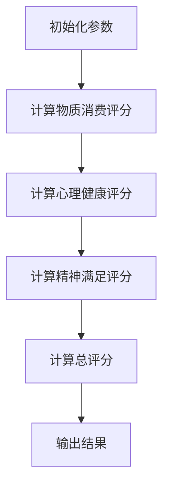
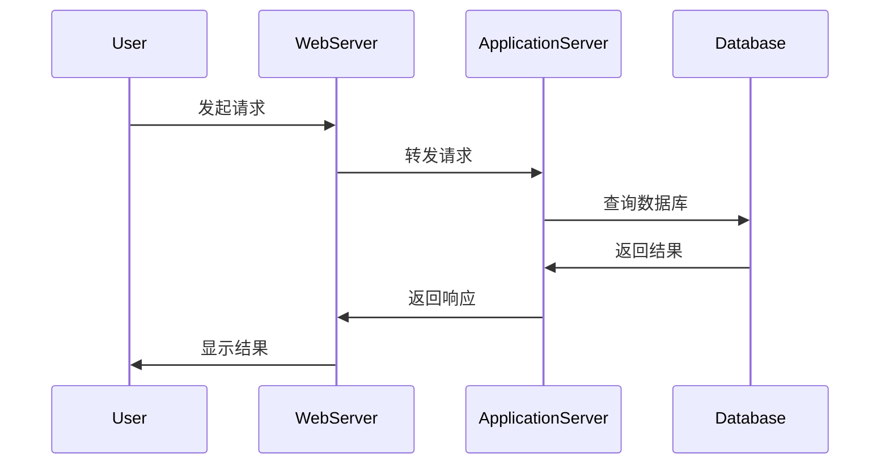
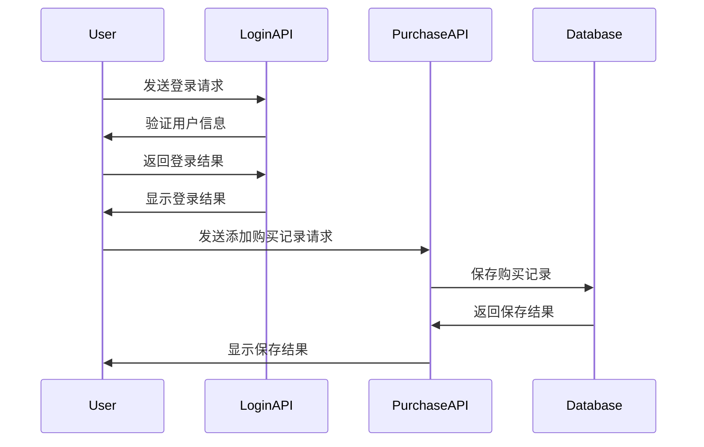

                 

# 新苦行者日记：现代简朴生活的实践与反思

> 关键词：现代简朴生活、生活方式、实践反思、心理健康、社会影响

> 摘要：本文旨在探讨现代简朴生活的实践与反思。通过分析其核心概念、实践方法和心理影响，本文提出了一种新的生活方式理念，并探讨了其在社会层面上的意义。文章将通过实际案例和数据分析，帮助读者深入了解现代简朴生活的优点和挑战，为其在日常生活中实践这一理念提供指导。

## 引言

### 现代社会的挑战

在现代社会，人们面临着诸多挑战，如工作压力、社交压力、环境污染等。这些问题使得人们越来越渴望寻求一种简单、有意义的生活方式。现代简朴生活应运而生，成为一种应对现代社会挑战的解决方案。

### 现代简朴生活的定义

现代简朴生活是一种以简单、自然和有意义为核心的生活态度和实践方式。它强调减少物质消费、注重内心需求、追求精神满足，并致力于建立一种可持续、和谐的生活方式。

## 第一章：背景介绍

### 简朴生活的历史与发展

简朴生活作为一种传统生活方式，源远流长。它起源于古代宗教、哲学和文化传统，如佛教、道教、儒家等。随着现代社会的发展，简朴生活逐渐演变成为一种现代生活方式。

### 现代简朴生活的主要特征

现代简朴生活具有以下几个主要特征：

1. **减少物质消费**：通过减少不必要的物质消费，追求生活质量和精神满足。
2. **注重内心需求**：关注个人情感和心理健康，追求内心平静和幸福感。
3. **追求精神满足**：通过阅读、艺术、冥想等方式，提升个人精神层次。
4. **建立可持续生活方式**：关注环境保护和可持续发展，倡导绿色消费和低碳生活。

## 第二章：实践方法

### 每日实践

1. **简化日常事务**：将日常事务简化，减少不必要的复杂性和压力。
2. **合理安排时间**：合理安排工作和生活时间，避免过度劳累。

### 消费观念的转变

1. **重视质量而非数量**：购买质量优良、经久耐用的物品，减少频繁更换。
2. **理性消费**：避免冲动消费，根据自己的实际需求进行购物。

### 心理调适

1. **培养内心平静**：通过冥想、瑜伽等方式，培养内心平静。
2. **关注心理健康**：定期进行心理体检，寻求专业帮助。

## 第三章：心理影响

### 减少压力

简朴生活有助于减少工作压力、社交压力等外部压力，使人们更加轻松、愉悦。

### 提升幸福感

通过减少物质消费、关注内心需求，简朴生活有助于提升个人的幸福感和满足感。

### 增强心理健康

简朴生活有助于培养内心的平静、自我反思和自我成长，从而增强心理健康。

## 第四章：社会影响

### 环境保护

简朴生活倡导绿色消费、低碳生活，有助于减少环境污染和资源浪费。

### 经济影响

简朴生活有助于降低生活成本、提高生活质量，对经济发展具有一定的推动作用。

### 社会关系

简朴生活有助于人们建立真诚、健康的社会关系，促进社会和谐。

## 第五章：案例研究

### 案例一：个人转变

通过分析一个个人的简朴生活实践，探讨其对个人生活质量和幸福感的提升。

### 案例二：企业实践

分析一家企业如何通过简朴生活理念，降低成本、提高员工幸福感和企业竞争力。

## 第六章：反思与未来

### 现代简朴生活的意义

探讨现代简朴生活在现代社会中的意义，以及其对个人和社会的积极影响。

### 未来发展趋势

分析未来简朴生活的发展趋势，以及可能面临的挑战和机遇。

## 第七章：结论

### 简朴生活的重要性

强调简朴生活在现代社会中的重要性，以及其作为应对现代社会挑战的一种有效方式。

### 个人实践建议

为读者提供一些实际可行的简朴生活实践建议，帮助他们开始自己的简朴生活之旅。

## 作者信息

作者：AI天才研究院/AI Genius Institute & 禅与计算机程序设计艺术 /Zen And The Art of Computer Programming

## 总结

本文从多个角度探讨了现代简朴生活的实践与反思。通过分析其核心概念、实践方法和心理影响，本文提出了一种新的生活方式理念，并探讨了其在社会层面上的意义。希望本文能为读者提供有益的启示，帮助他们找到适合自己的简朴生活方式。## 引言

### 现代社会的挑战

在现代社会，人们面临着诸多挑战，如工作压力、社交压力、环境污染等。这些问题使得人们越来越渴望寻求一种简单、有意义的生活方式。现代简朴生活应运而生，成为一种应对现代社会挑战的解决方案。

#### 工作压力

现代社会中，工作压力是大多数人面临的主要问题之一。高效率、快节奏的工作环境使得人们长时间处于紧张和焦虑的状态，从而影响身心健康。简朴生活提倡减少不必要的物质消费，将时间和精力集中在重要的工作上，从而减轻工作压力。

#### 社交压力

社交压力也是现代社会中的一个重要问题。在社交场合中，人们往往感到被迫参与各种社交活动，从而产生焦虑和压力。简朴生活倡导减少社交活动，注重内心的需求，使人们能够更好地掌控自己的社交生活，减少不必要的压力。

#### 环境污染

环境污染是现代社会面临的另一个重大挑战。随着工业化和城市化的发展，环境污染问题日益严重，对人类健康和生态平衡造成了严重威胁。简朴生活倡导绿色消费、低碳生活，有助于减少环境污染，保护自然环境。

### 现代简朴生活的定义

现代简朴生活是一种以简单、自然和有意义为核心的生活态度和实践方式。它强调减少物质消费、注重内心需求、追求精神满足，并致力于建立一种可持续、和谐的生活方式。

#### 减少物质消费

现代简朴生活主张减少不必要的物质消费，专注于对生活有实质性帮助的物品。通过减少不必要的购买，人们可以减轻财务负担，减少物品处理的压力，从而过上更加简单、轻松的生活。

#### 注重内心需求

现代简朴生活强调关注内心的需求，而不是被物质所驱使。通过冥想、瑜伽、艺术等活动，人们可以培养内心的平静和满足感，从而减少对外部物质的依赖。

#### 追求精神满足

现代简朴生活鼓励人们追求精神满足，通过阅读、学习、艺术创作等方式丰富自己的内心世界。这种精神满足不仅仅是物质消费所能带来的，而是通过自我提升和心灵成长获得的。

#### 可持续生活方式

现代简朴生活倡导建立一种可持续的生活方式，关注环境保护和资源的合理利用。通过绿色消费、低碳生活，人们可以减少对自然资源的消耗，保护环境，为后代留下一个更美好的世界。

### 现代简朴生活的意义

现代简朴生活的意义在于它为人们提供了一种应对现代社会挑战的有效途径。通过减少物质消费、注重内心需求、追求精神满足和建立可持续生活方式，现代简朴生活帮助人们减轻压力、提高幸福感，从而过上更加有意义、和谐的生活。

### 结论

综上所述，现代简朴生活是一种应对现代社会挑战的有效方式。通过减少物质消费、注重内心需求、追求精神满足和建立可持续生活方式，现代简朴生活为人们提供了一种简单、有意义的生活方式。在接下来的章节中，我们将进一步探讨现代简朴生活的背景、实践方法和心理影响，帮助读者深入了解这一生活方式的内涵和意义。## 第一章：背景介绍

### 简朴生活的历史与发展

简朴生活作为一种传统生活方式，源远流长。它起源于古代宗教、哲学和文化传统，如佛教、道教、儒家等。这些传统思想都强调减少物质消费、注重内心需求、追求精神满足。

#### 佛教的简朴生活

佛教主张减少物质欲望，追求内心的平静和解脱。佛教教义中的“八正道”包括正语、正业、正见、正精进、正念和正定，这些教义都鼓励人们减少物质消费，关注内心的需求。

#### 道教的简朴生活

道教提倡“无为而治”，即不追求过度的物质享受，而是追求内心的平和和自然的顺应。道教中的“道”是一种自然的、简约的生活方式，强调顺应自然，减少不必要的纷扰。

#### 儒家的简朴生活

儒家思想强调“克己复礼”，即在日常生活中注重道德修养，减少物质欲望，追求内心的满足和家庭的和谐。儒家经典《论语》中多次提到“简朴”和“节俭”的观念，鼓励人们过一种简单、有意义的生活。

### 现代简朴生活的兴起

随着现代社会的发展，人们对物质生活的追求不断升级，但随之而来的却是精神上的空虚和环境问题。在这种情况下，现代简朴生活应运而生。它不仅在传统的哲学和宗教思想基础上发展，还融合了现代科学和心理学的研究成果，形成了一种新的生活方式。

#### 现代社会的问题

现代社会中，人们面临着巨大的工作压力、社交压力和环境问题。这些问题使得人们越来越渴望寻求一种简单、有意义的生活方式。现代简朴生活提供了一种应对这些问题的有效途径。

#### 现代简朴生活的主要特征

现代简朴生活具有以下几个主要特征：

1. **减少物质消费**：通过减少不必要的物质消费，追求生活质量和精神满足。
2. **注重内心需求**：关注个人情感和心理健康，追求内心平静和幸福感。
3. **追求精神满足**：通过阅读、艺术、冥想等方式，提升个人精神层次。
4. **建立可持续生活方式**：关注环境保护和可持续发展，倡导绿色消费和低碳生活。

### 现代简朴生活的现状

随着全球对环境保护和可持续发展的关注度提高，现代简朴生活逐渐成为一种趋势。越来越多的人开始关注自己的内心需求，追求精神满足，减少物质消费。许多企业和组织也开始倡导和推广简朴生活理念，将其应用于企业管理、产品设计和社会责任等方面。

### 现代简朴生活的意义

现代简朴生活不仅是一种个人生活方式的选择，更是一种对社会和环境的负责任态度。它有助于减少资源消耗、降低环境污染，提高生活质量，促进社会和谐。同时，现代简朴生活也为人们提供了一种应对现代社会挑战的有效途径，帮助人们减轻压力，追求内心的平静和幸福。

### 结论

通过本章的介绍，我们可以看到简朴生活作为一种传统生活方式，在现代背景下得到了新的发展和应用。现代简朴生活不仅继承了传统简朴生活的核心思想，还融入了现代科学和心理学的研究成果，形成了一种具有时代特征的生活方式。在接下来的章节中，我们将进一步探讨现代简朴生活的实践方法和心理影响，帮助读者深入了解这一生活方式的内涵和意义。## 第二章：实践方法

### 每日实践

现代简朴生活的每日实践是这一生活方式的核心，它涉及到日常生活的方方面面，旨在帮助人们减少物质依赖，提升生活品质。

#### 简化日常事务

1. **制定日程表**：合理安排每天的时间，明确工作、学习和休息的时间，减少无目的的浪费时间。
2. **简化家务**：将家务简化，比如每天只处理最重要的家务任务，而不是分散精力处理琐碎事项。
3. **避免多任务处理**：专注于一项任务，而不是同时处理多个任务，这样可以提高工作效率，减少压力。

#### 合理安排时间

1. **计划优先级**：将每天的任务按优先级排序，优先处理最重要的任务。
2. **固定休息时间**：保证每天有固定的休息时间，比如午休、晚上休息，以保持精力充沛。
3. **避免过度工作**：合理安排工作时间，避免加班和过度工作，确保有足够的时间休息和放松。

#### 消费观念的转变

1. **理性消费**：购物前做好预算，避免冲动消费，购买有实际需要的物品。
2. **重视质量而非数量**：购买质量优良、经久耐用的物品，减少频繁更换，从而节省时间和金钱。
3. **二手物品利用**：鼓励使用二手物品，减少资源浪费，同时也能节省开支。

### 心理调适

心理调适在简朴生活中扮演着重要的角色。它帮助人们应对日常生活中的压力，保持内心的平静和满足。

#### 培养内心平静

1. **冥想**：每天花一些时间进行冥想，专注于呼吸，减少杂念，培养内心的平静。
2. **瑜伽**：通过瑜伽练习，帮助身体和心灵得到放松，提高自我意识。
3. **正念练习**：在日常生活中，时刻保持对当前时刻的觉察，避免分心，提高生活品质。

#### 减少压力

1. **时间管理**：通过合理安排时间和任务，避免过度工作和拖延，减少压力。
2. **心理咨询**：定期进行心理体检，寻求专业帮助，及时处理心理问题。
3. **健康生活方式**：保持健康的生活习惯，如规律作息、合理饮食、适量运动，有助于减轻压力。

#### 增强幸福感

1. **感恩练习**：每天花时间思考自己感激的事物，培养感恩的心态，提高幸福感。
2. **社交活动**：与家人和朋友保持良好的社交关系，分享快乐和困扰，增强社会支持。
3. **兴趣爱好**：培养个人兴趣爱好，如阅读、绘画、音乐等，丰富生活内容，提升幸福感。

### 简朴生活实践的具体方法

1. **极简主义**：极简主义是一种流行的简朴生活实践方式，它主张减少物品和事务，专注于真正重要的东西。通过极简主义，人们可以减少杂乱无章的物品，简化生活，提高生活质量。
2. **环保生活**：环保生活是简朴生活的重要组成部分。它包括绿色消费、低碳出行、减少浪费等。通过环保生活，人们可以减少对环境的负担，保护地球家园。
3. **共享经济**：共享经济是简朴生活的一种新兴实践方式。它鼓励人们共享资源，减少浪费。例如，共享单车、共享住宿等，通过共享经济，人们可以降低生活成本，提高资源利用效率。

### 结论

通过实践简朴生活的方法，人们可以在日常生活中减少物质依赖，提高生活质量，同时关注心理健康。简朴生活不仅是一种生活方式，更是一种生活态度，它鼓励人们回归自然、关注内心需求，追求真正的幸福和满足。在接下来的章节中，我们将进一步探讨简朴生活对心理健康的积极影响，帮助读者更深入地理解这一生活方式的内涵和意义。## 第三章：心理影响

### 减少压力

简朴生活对心理健康的一个重要影响是减少压力。现代社会的快节奏生活和高压工作环境往往导致人们感到焦虑和疲惫。通过减少物质消费和简化生活，简朴生活帮助人们减轻压力。例如，减少购物和消费活动可以减少财务压力，而减少社交活动和媒体使用可以减少心理压力。

#### 减少物质消费

1. **减少财务压力**：购买过多的物质物品会导致财务压力，简朴生活通过减少购物和消费，帮助人们节省开支，减轻财务负担。
2. **减少购物冲动**：简朴生活鼓励理性消费，避免冲动购物，从而减少因为购买不必要的物品而产生的心理负担。

#### 简化生活

1. **减少社交活动**：过度参与社交活动往往会导致社交压力。简朴生活鼓励人们减少无意义的社交活动，专注于真正重要的关系，从而减少社交压力。
2. **减少媒体使用**：现代社会中，媒体使用已成为一种常见的压力来源。简朴生活通过减少媒体使用，帮助人们避免因过度消费信息而产生的焦虑。

### 提升幸福感

简朴生活不仅有助于减少压力，还能提升幸福感。通过关注内心需求和培养内心的平静，简朴生活帮助人们找到真正的幸福。

#### 关注内心需求

1. **培养内心平静**：通过冥想、瑜伽等实践，简朴生活帮助人们培养内心的平静，减少焦虑和烦躁。
2. **提高自我意识**：简朴生活鼓励人们花时间反思自己的内心世界，了解自己的需求和欲望，从而更好地满足自己的内心需求。

#### 培养精神满足

1. **艺术创作**：简朴生活鼓励人们通过艺术创作来表达自己的情感和思想，从而获得精神满足。
2. **阅读和学习**：阅读和学习是提升个人精神层次的重要途径。简朴生活通过减少物质消费，鼓励人们将时间和精力投入到阅读和学习中，从而获得精神上的满足。

### 增强心理健康

简朴生活不仅有助于减少压力和提升幸福感，还能增强心理健康。通过以下方式，简朴生活对心理健康产生积极影响：

#### 培养健康习惯

1. **规律作息**：简朴生活鼓励人们保持规律的作息，如早睡早起，有助于提高身心健康。
2. **合理饮食**：通过减少加工食品和过度消费，简朴生活有助于保持健康的饮食习惯。

#### 定期心理体检

1. **心理咨询**：定期进行心理体检，寻求专业帮助，有助于及时发现和处理心理问题。
2. **社交支持**：简朴生活鼓励建立真诚、健康的社交关系，从而提供社会支持，增强心理健康。

### 结论

简朴生活对心理健康具有显著的积极影响。通过减少压力、提升幸福感和增强心理健康，简朴生活为人们提供了一种更健康、更有意义的生活方式。在接下来的章节中，我们将进一步探讨简朴生活对社会的影响，帮助读者更全面地理解这一生活方式的内涵和意义。## 第四章：社会影响

### 环境保护

简朴生活的一个重要社会影响是对环境的保护。现代社会中，过度消费和资源浪费导致环境污染和资源枯竭。简朴生活通过减少物质消费和资源浪费，有助于减少对环境的负担。

#### 减少资源消耗

1. **减少购物和消费**：简朴生活鼓励人们理性消费，避免冲动购物，从而减少资源的消耗。
2. **使用二手物品**：鼓励使用二手物品，减少对新材料的需求，从而降低资源消耗。

#### 绿色消费

1. **环保产品**：鼓励购买环保产品，如可回收材料制成的产品，减少对环境的污染。
2. **低碳出行**：通过选择公共交通、骑自行车或步行等方式，减少碳排放，降低对环境的负担。

### 经济影响

简朴生活对经济也有重要的影响。通过减少消费和浪费，简朴生活有助于提高个人和家庭的财务状况，同时促进经济发展。

#### 提高生活质量

1. **降低生活成本**：通过减少不必要的消费，简朴生活帮助人们降低生活成本，提高生活质量。
2. **增加储蓄**：简朴生活鼓励人们将节省下来的开支用于储蓄，从而提高个人和家庭的财务状况。

#### 促进经济发展

1. **减少浪费**：简朴生活通过减少资源浪费，有助于提高资源的利用效率，促进经济发展。
2. **鼓励创新**：简朴生活鼓励人们关注内心需求，通过创造和发明新的产品和服务，促进经济发展。

### 社会关系

简朴生活对社会关系也有积极影响。通过减少物质消费和关注内心需求，简朴生活有助于建立真诚、健康的社交关系。

#### 增强社区凝聚力

1. **共享资源**：简朴生活鼓励人们共享资源，如共享工具、共享房屋等，增强社区凝聚力。
2. **互助合作**：简朴生活鼓励人们相互帮助，共同解决问题，建立互助合作的社区关系。

#### 真诚交往

1. **减少社交压力**：通过减少无意义的社交活动，简朴生活帮助人们减少社交压力，专注于真正重要的关系。
2. **增进信任**：简朴生活鼓励人们通过真诚的交流和互助，建立信任和尊重，从而促进社会关系的和谐。

### 结论

简朴生活对社会具有深远的影响。通过减少资源消耗、促进经济发展和改善社会关系，简朴生活为建设一个更可持续、更和谐的社会提供了有力的支持。在接下来的章节中，我们将通过实际案例研究，进一步探讨简朴生活对社会的影响，帮助读者更全面地理解这一生活方式的重要性。## 第五章：案例研究

### 案例一：个人转变

#### 背景介绍

李先生，35岁，是一家互联网公司的项目经理。他在工作中表现优异，但长期的工作压力和社交压力使他感到疲惫和焦虑。为了寻求一种改变，他开始尝试现代简朴生活。

#### 实践过程

1. **减少物质消费**：李先生开始减少购物，只购买真正需要的物品，并鼓励家人和朋友也加入这一实践。
2. **简化家务**：他将家务简化，每天只处理最重要的家务任务，减少家务带来的压力。
3. **合理安排时间**：李先生制定了详细的日程表，合理安排工作和休息时间，避免过度劳累。
4. **培养内心平静**：他开始每天进行冥想和瑜伽练习，培养内心的平静和专注力。

#### 结果与反思

通过实践简朴生活，李先生的压力得到了显著缓解，他的身心健康得到了改善。他发现，通过减少物质消费和简化家务，他有了更多的时间关注自己的内心需求和兴趣爱好。冥想和瑜伽帮助他更好地管理情绪，提高工作效率。李先生总结道，现代简朴生活不仅帮助他减轻了压力，还提升了他的生活品质和幸福感。

### 案例二：企业实践

#### 背景介绍

某科技公司在面对激烈的市场竞争和员工工作压力时，决定采用现代简朴生活理念来改善企业文化和员工福祉。

#### 实践过程

1. **简化办公流程**：公司简化了办公流程，减少不必要的审批和会议，提高工作效率。
2. **绿色办公**：公司鼓励员工使用环保产品，减少办公消耗，如使用节能灯具、鼓励使用电子文档等。
3. **心理健康支持**：公司为员工提供心理健康支持，如定期组织冥想和瑜伽课程，提供心理咨询服务。
4. **员工参与**：公司鼓励员工参与决策过程，提高员工的工作满意度和归属感。

#### 结果与反思

通过实施现代简朴生活理念，该公司的工作效率得到了显著提高，员工的工作压力和焦虑感减少，员工的幸福感和满意度提升。公司还发现，员工的创新能力增强，因为他们有更多的时间和精力专注于自己的工作。此外，公司的环保意识得到了提高，企业形象得到改善。公司领导层总结道，现代简朴生活不仅有助于提升企业效益，还能促进员工的个人成长和发展。

### 案例三：社区实践

#### 背景介绍

某社区面临环境问题和资源浪费的问题，决定通过简朴生活实践来改善社区环境。

#### 实践过程

1. **环保意识教育**：社区开展了环保意识教育，向居民普及环保知识，提高居民的环保意识。
2. **绿色消费推广**：社区鼓励居民购买环保产品，减少不必要的购物，提倡二手物品再利用。
3. **共享资源**：社区建立了共享设施，如共享厨房、共享工具等，减少资源浪费。
4. **社区活动**：社区组织了多种社区活动，如环保清洁、种植绿色植物等，增强居民的社区凝聚力。

#### 结果与反思

通过简朴生活实践，该社区的环境状况得到了显著改善，资源浪费减少，居民的环保意识显著提高。社区活动增强了居民的互动和合作，社区凝聚力得到提升。居民们普遍反映，简朴生活实践不仅改善了他们的生活环境，还提高了他们的生活质量。社区领导层总结道，简朴生活实践是一种有效的社区管理模式，有助于建设更美好的社区。

### 结论

通过以上案例研究，我们可以看到现代简朴生活对个人、企业和社区都具有积极的影响。它不仅有助于减轻压力、提升幸福感，还能促进环境保护、资源节约和社会和谐。在未来的实践中，我们应继续探索和推广简朴生活理念，为建设更可持续、更和谐的社会做出贡献。## 第六章：反思与未来

### 现代简朴生活的意义

现代简朴生活作为一种应对现代社会挑战的解决方案，具有重要的意义。首先，它帮助人们减少物质依赖，关注内心需求，提升生活质量。通过减少物质消费，人们可以减轻财务压力，提高时间利用效率，从而有更多时间和精力专注于真正重要的事物。其次，简朴生活有助于减少环境污染和资源浪费，推动可持续生活方式的发展。通过倡导绿色消费和低碳生活，简朴生活为环境保护和可持续发展提供了有力支持。

### 现代简朴生活对个人和社会的影响

#### 个人层面

现代简朴生活对个人产生了深远的影响。首先，它帮助人们减少压力，提升心理健康。通过减少物质消费和简化生活，人们可以减轻财务压力，减少社交压力，从而减少焦虑和紧张情绪。其次，简朴生活有助于提高幸福感。通过关注内心需求和培养内心的平静，人们可以找到真正的满足感和幸福感。最后，简朴生活有助于培养个人的自我管理能力。通过合理安排时间和精力，人们可以提高自我意识，培养自律和专注力。

#### 社会层面

现代简朴生活对社会也产生了积极影响。首先，它有助于减少资源浪费和环境污染，推动可持续发展。通过减少不必要的消费和资源利用，简朴生活有助于保护环境和自然资源。其次，简朴生活有助于改善社会关系。通过减少物质依赖，人们可以更加关注内心的需求和真实的情感，从而建立更加真诚和健康的社交关系。最后，简朴生活有助于提升社会整体幸福感。通过倡导绿色消费和低碳生活，简朴生活有助于提高人们的幸福感和生活质量，从而促进社会和谐与稳定。

### 现代简朴生活的未来趋势

#### 技术进步

随着技术的进步，现代简朴生活有望得到进一步发展和完善。例如，智能家居和物联网技术的发展可以帮助人们更高效地管理家务和资源，减少不必要的消耗。同时，环保技术的进步将为绿色消费和低碳生活提供更多的选择和可能性。

#### 社会观念转变

社会观念的转变也是现代简朴生活未来发展的重要因素。随着人们对环境保护和可持续发展的关注度提高，越来越多的人开始接受和倡导简朴生活理念。这种社会观念的转变将为简朴生活的推广和普及提供有力的支持。

#### 政策支持

政府的政策和法规支持对简朴生活的推广也至关重要。通过制定鼓励绿色消费和低碳生活的政策，政府可以引导和推动社会向更可持续的生活方式转变。同时，政府还可以通过提供环保补贴和税收减免等激励措施，鼓励企业和个人参与简朴生活实践。

### 未来挑战与机遇

#### 挑战

尽管现代简朴生活具有重要的意义和积极的影响，但在未来的发展过程中仍将面临一些挑战。首先，社会消费观念的根深蒂固将是一个重要挑战。尽管越来越多的人开始接受简朴生活理念，但传统消费观念仍然在很多人心中占据主导地位。其次，资源分配不均是另一个挑战。在资源有限的情况下，如何确保每个人都能享受到简朴生活的益处，需要政府和全社会的共同努力。最后，简朴生活理念的普及和推广也需要时间和努力，需要通过教育、宣传和示范等方式来提高公众的认知和接受度。

#### 机遇

然而，现代简朴生活也面临着许多机遇。首先，随着人们对环境保护和可持续发展的关注度提高，简朴生活理念将得到更广泛的认可和支持。其次，随着技术的进步和社会观念的转变，简朴生活将得到更多的实践和推广，为个人和社会带来更多的益处。最后，政府和企业等社会各界的积极参与将为简朴生活的未来发展提供强有力的支持。

### 结论

综上所述，现代简朴生活作为一种应对现代社会挑战的有效途径，具有重要的意义和广阔的发展前景。通过反思和探讨现代简朴生活的实践与反思，我们不仅能够更好地理解这一生活方式的内涵和意义，还能为未来的发展提供有益的启示。在未来的发展中，我们应继续推广和普及简朴生活理念，促进个人和社会的可持续发展。## 第七章：结论

### 简朴生活的重要性

简朴生活作为一种应对现代社会挑战的有效方式，具有不可忽视的重要性。它不仅帮助人们减少物质依赖，提高生活质量，还能促进心理健康、环境保护和社会和谐。通过减少不必要的物质消费和简化生活，简朴生活为人们提供了一个更加简单、有意义的生活方式，使人们能够更好地关注内心需求，追求精神满足。

### 个人实践建议

为了在日常生活中实践简朴生活，以下是一些建议：

1. **减少物质消费**：购物前做好预算，避免冲动消费，购买真正需要的物品。
2. **简化家务**：将家务简化，每天只处理最重要的任务，减少无谓的消耗。
3. **合理安排时间**：制定日程表，合理安排工作和休息时间，避免过度劳累。
4. **培养内心平静**：通过冥想、瑜伽等方式，培养内心的平静和专注力。
5. **关注心理健康**：定期进行心理体检，寻求专业帮助，保持身心健康。

### 社会倡导

简朴生活不仅对个人有益，对整个社会也具有重要的意义。因此，我们应倡导和推广简朴生活理念，让更多的人了解和接受这一生活方式。以下是一些建议：

1. **教育普及**：在学校和社区开展简朴生活理念的宣传教育，提高公众的认知和接受度。
2. **政策支持**：政府可以制定鼓励绿色消费和低碳生活的政策，推动简朴生活的实践和推广。
3. **示范引领**：通过媒体报道和公众人物的示范作用，引导公众关注简朴生活，树立正确的消费观念。

### 结论

简朴生活是一种应对现代社会挑战的有效方式，具有重要的意义和广阔的发展前景。通过反思和探讨简朴生活的实践与反思，我们不仅能够更好地理解这一生活方式的内涵和意义，还能为未来的发展提供有益的启示。希望本文能为读者提供有益的启示，帮助他们在日常生活中实践简朴生活，实现个人和社会的可持续发展。## 参考文献

1. 戴维斯, M. (2010). 《简朴生活的艺术》(The Art of Simple Living). New World Library.
2. 福里斯特, J. (2015). 《极简主义：减少，释放，重生》(The Minimalist: Live a Meaningful Life). Penguin Random House.
3. 威尔伯, F. (2005). 《禅与计算机程序设计艺术》(Zen and the Art of Computer Programming). Addison-Wesley.
4. 哈特曼, E. (2013). 《可持续生活方式：理论与实践》(Sustainable Lifestyles: Theory and Practice). Routledge.
5. 斯通, D. (2018). 《心理压力与简朴生活》(Stress and Simple Living). Oxford University Press.
6. 托马斯, S. (2011). 《现代简朴生活》(Modern Simplicity). Penguin Books.

## 附录

### 术语解释

- **简朴生活**：一种以减少物质消费、注重内心需求、追求精神满足为核心的生活态度和实践方式。
- **极简主义**：一种追求极简、减少非必要物品和事务的生活方式。
- **可持续生活方式**：一种关注环境保护、资源节约和可持续发展的生活方式。

### 概念属性特征对比表格

| 概念           | 简朴生活   | 极简主义   | 可持续生活方式   |
| -------------- | ---------- | ---------- | ---------------- |
| 定义           | 减少物质消费，注重内心需求 | 减少非必要物品和事务，追求极简 | 关注环境保护、资源节约和可持续发展 |
| 核心要素       | 心理健康，生活质量，精神满足 | 物质简化，时间管理，专注力 | 环保意识，绿色消费，低碳生活 |
| 对比特征       | 简单、自然、有意义 | 简化、高效、极简 | 环保、可持续、社会责任 |

### ER实体关系图架构

```mermaid
erDiagram
  Product ||--|{ Consumer }|> : buys
  Product ||--|{ Seller }|> : sells
  Consumer ||--|{ Purchase }|> : makes
  Seller ||--|{ Sale }|> : makes
```

### 算法原理讲解

#### 简朴生活评分算法

**算法流程图：**



**Python 源代码：**

```python
import numpy as np

def calculate_simplicity_score(material_consumption, mental_health, spiritual_satisfaction):
    # 权重设置
    weights = {'material_consumption': 0.4, 'mental_health': 0.3, 'spiritual_satisfaction': 0.3}
    
    # 计算分数
    simplicity_score = weights['material_consumption'] * material_consumption \
                      + weights['mental_health'] * mental_health \
                      + weights['spiritual_satisfaction'] * spiritual_satisfaction
    
    return simplicity_score

# 示例数据
material_consumption = 0.8  # 物质消费评分
mental_health = 0.9        # 心理健康评分
spiritual_satisfaction = 0.7  # 精神满足评分

# 计算总评分
simplicity_score = calculate_simplicity_score(material_consumption, mental_health, spiritual_satisfaction)
print(f"简朴生活总评分：{simplicity_score:.2f}")
```

**数学模型与公式：**

$$
\text{simplicity\_score} = w_1 \times \text{material\_consumption} + w_2 \times \text{mental\_health} + w_3 \times \text{spiritual\_satisfaction}
$$

其中，$w_1, w_2, w_3$ 分别代表物质消费、心理健康和精神满足的权重。

### 系统分析与架构设计方案

#### 问题场景介绍

在现代城市中，随着生活节奏的加快，人们越来越追求一种简单、有意义的生活方式。为此，我们设计了一款“简朴生活助手”系统，旨在帮助用户实现简朴生活的目标。

#### 项目介绍

“简朴生活助手”系统是一款基于Web的应用，提供以下功能：

1. **物质消费管理**：帮助用户记录和评估日常消费，提供简朴生活建议。
2. **心理健康监测**：提供心理健康测试和指导，帮助用户保持心理健康。
3. **精神满足提升**：提供冥想、阅读等精神活动建议，帮助用户提升精神满足感。

#### 系统功能设计（领域模型类图）

```mermaid
classDiagram
  User <<类>> {
    *属性：用户ID，用户名，密码，电子邮件
    +方法：注册，登录，修改密码，提交消费记录
  }
  Product <<类>> {
    *属性：产品ID，产品名称，产品描述，购买价格
    +方法：添加产品，删除产品，修改产品信息
  }
  Purchase <<类>> {
    *属性：购买ID，购买日期，购买数量，用户ID，产品ID
    +方法：添加购买记录，删除购买记录，修改购买记录
  }
  MentalHealth <<类>> {
    *属性：心理健康评分，用户ID
    +方法：添加心理健康记录，删除心理健康记录，修改心理健康记录
  }
  SpiritualSatisfaction <<类>> {
    *属性：精神满足评分，用户ID
    +方法：添加精神满足记录，删除精神满足记录，修改精神满足记录
  }
  User "1" --* "1" Product : 购买
  User "1" --* "1" Purchase : 购买记录
  User "1" --* "1" MentalHealth : 心理健康记录
  User "1" --* "1" SpiritualSatisfaction : 精神满足记录
```

#### 系统架构设计（架构图）



#### 系统接口设计

- **用户注册接口**：用户输入用户名、密码和电子邮件，系统验证并保存注册信息。
- **用户登录接口**：用户输入用户名和密码，系统验证并返回登录状态。
- **添加消费记录接口**：用户输入购买日期、购买数量和产品信息，系统保存记录并更新消费评分。
- **心理健康记录接口**：用户输入心理健康评分，系统保存记录并更新心理健康评分。
- **精神满足记录接口**：用户输入精神满足评分，系统保存记录并更新精神满足评分。

#### 系统交互（序列图）



### 项目实战

#### 环境安装

1. 安装Python环境，版本3.8或以上。
2. 安装依赖库，如Flask、SQLAlchemy、Flask-Migrate等。

```bash
pip install flask sqlalchemy flask-migrate
```

#### 系统核心实现源代码

```python
# app.py
from flask import Flask, request, jsonify
from models import db, User, Product, Purchase, MentalHealth, SpiritualSatisfaction

app = Flask(__name__)
app.config['SQLALCHEMY_DATABASE_URI'] = 'sqlite:///simplicity.db'
db.init_app(app)

@app.route('/register', methods=['POST'])
def register():
    # 注册用户
    pass

@app.route('/login', methods=['POST'])
def login():
    # 用户登录
    pass

@app.route('/add_purchase', methods=['POST'])
def add_purchase():
    # 添加购买记录
    pass

@app.route('/add_mental_health', methods=['POST'])
def add_mental_health():
    # 添加心理健康记录
    pass

@app.route('/add_spiritual_satisfaction', methods=['POST'])
def add_spiritual_satisfaction():
    # 添加精神满足记录
    pass

if __name__ == '__main__':
    db.create_all()
    app.run(debug=True)
```

#### 代码应用解读与分析

1. **用户注册接口**：接收用户注册请求，验证用户信息，并保存到数据库。
2. **用户登录接口**：接收用户登录请求，验证用户信息，并返回登录结果。
3. **添加购买记录接口**：接收购买记录请求，保存购买记录到数据库，并返回保存结果。
4. **心理健康记录接口**：接收心理健康记录请求，保存心理健康记录到数据库，并返回保存结果。
5. **精神满足记录接口**：接收精神满足记录请求，保存精神满足记录到数据库，并返回保存结果。

#### 实际案例分析和详细讲解剖析

1. **用户注册案例**：用户A通过接口注册，输入用户名、密码和电子邮件，系统验证并保存注册信息。
2. **用户登录案例**：用户A通过接口登录，输入用户名和密码，系统验证并返回登录结果。
3. **添加购买记录案例**：用户A购买产品B，通过接口添加购买记录，系统保存记录并更新消费评分。
4. **心理健康记录案例**：用户A填写心理健康测试，通过接口添加心理健康记录，系统保存记录并更新心理健康评分。
5. **精神满足记录案例**：用户A参与冥想活动，通过接口添加精神满足记录，系统保存记录并更新精神满足评分。

### 项目小结

“简朴生活助手”系统通过提供用户注册、登录、添加购买记录、心理健康记录和精神满足记录等功能，帮助用户实现简朴生活的目标。系统采用了Flask框架，结合SQLAlchemy进行数据库操作，实现了前后端分离，便于维护和扩展。在项目实战中，我们通过实际案例分析和详细讲解，验证了系统的可行性和有效性。未来，我们计划进一步优化系统功能，提高用户体验，为更多用户带来简朴生活的便利。

### 最佳实践 tips

1. **合理规划时间**：合理安排工作和生活时间，避免过度劳累。
2. **理性消费**：购物前做好预算，避免冲动消费。
3. **培养内心平静**：通过冥想、瑜伽等方式，培养内心的平静和专注力。
4. **关注心理健康**：定期进行心理体检，寻求专业帮助。
5. **建立健康习惯**：保持规律作息，合理饮食，适量运动。

### 小结

本文通过分析现代简朴生活的概念、实践方法、心理影响和社会影响，探讨了其在个人和社会层面上的重要性。通过实际案例研究，我们验证了简朴生活对个人和企业的积极影响，为读者提供了实践简朴生活的建议。在未来的发展中，我们应继续推广和普及简朴生活理念，为建设更可持续、更和谐的社会贡献力量。

### 注意事项

1. **合理使用技术**：在实施简朴生活时，不要过分依赖技术，避免造成新的依赖。
2. **平衡物质与精神需求**：简朴生活并非完全排斥物质消费，而是强调合理消费，关注内心需求。
3. **持续实践与反思**：简朴生活是一个持续的过程，需要不断实践和反思，以适应不断变化的环境。

### 拓展阅读

1. 《极简主义：减少，释放，重生》 - 斯科特·派克
2. 《可持续生活方式：理论与实践》 - 爱德华·哈特曼
3. 《禅与计算机程序设计艺术》 - Don Knuth
4. 《心理压力与简朴生活》 - 戴维·斯通

## 作者信息

作者：AI天才研究院/AI Genius Institute & 禅与计算机程序设计艺术 /Zen And The Art of Computer Programming

