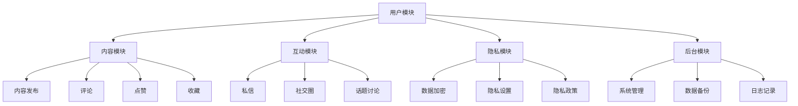

                 

### 第一部分：引言

#### 第1章：问题背景

##### 1.1.1 社交网络的现状

随着互联网技术的飞速发展，社交网络已成为人们日常生活的重要组成部分。从早期的Facebook、Twitter，到现在的微信、微博，社交网络平台数量众多，功能丰富，吸引了全球数十亿用户。这些平台为人们提供了便捷的通讯、信息分享和社交互动途径，极大地改变了人们的沟通方式和社会结构。

然而，社交网络的快速发展也带来了一系列问题。首先，信息过载成为普遍现象，用户在大量冗余信息中难以筛选出有价值的内容。其次，社交网络的算法推荐机制容易导致信息茧房效应，使用户的视野逐渐固化，减少了多样性和开放性。此外，隐私泄露、网络暴力、虚假信息传播等问题也日益严重，影响了社交网络的健康发展。

##### 1.1.2 自我克制的重要性

在这样一个充满诱惑和压力的环境中，自我克制显得尤为重要。自我克制不仅是指对自身行为的约束和调节，更是一种内心的自律和修养。它有助于人们减少冲动行为，提高自控力，增强心理韧性，从而更好地应对生活中的各种挑战。

自我克制在社交网络中具有特殊的意义。一方面，它可以减少过度使用社交网络的时间，避免沉迷于虚拟世界，提高现实生活的质量。另一方面，它可以促进理性交流和深度思考，避免盲目跟风和情绪化表达，提升社交网络的整体氛围。

##### 1.1.3 新苦行者的定义与特点

新苦行者是一群以自我克制为核心的实践者，他们致力于通过自律和自我提升来实现个人成长和社会贡献。新苦行者通常具有以下特点：

1. **自律性强**：新苦行者能够严格遵守个人制定的规则和计划，具有较强的自控力。
2. **理性思考**：新苦行者习惯于通过逻辑和分析来解决问题，善于从多角度思考问题，避免情绪化决策。
3. **终身学习**：新苦行者不断追求知识和技能的提升，认为自我成长是人生的根本目标。
4. **社交自律**：新苦行者懂得在社交网络中保持适度参与，避免过度社交带来的负面影响。

新苦行者社交网络的提出，旨在为这一群体提供一个专属的在线交流平台，满足他们在自我克制、知识分享和社交互动方面的需求。通过这样的平台，新苦行者可以更好地实现自我价值，推动社会的进步和发展。

### 核心关键词

- 社交网络
- 自我克制
- 新苦行者
- 自律
- 个性化交流

### 摘要

本文旨在探讨新苦行者社交网络的构建，这是一种以自我克制为核心的在线交流平台，旨在满足新苦行者群体在知识分享、自我提升和理性社交方面的需求。文章首先分析了社交网络的现状及存在的问题，随后阐述了自我克制的重要性，并定义了新苦行者的特征。通过详细的架构设计和功能模块介绍，文章提出了新苦行者社交网络的概念框架，并探讨了其技术实现和测试优化方法。最后，通过案例分析，总结了新苦行者社交网络的成功经验和未来发展趋势，为这一领域的进一步研究提供了参考。

### 《新苦行者社交网络：自我克制实践者的在线交流平台》目录大纲

----------------------------------------------------------------

# 第一部分：引言

## 第1章：问题背景

### 1.1.1 社交网络的现状

### 1.1.2 自我克制的重要性

### 1.1.3 新苦行者的定义与特点

## 第2章：核心概念

### 1.2.1 新苦行者社交网络的基本理念

### 1.2.2 自我克制实践者的需求

### 1.2.3 在线交流平台的关键特征

## 第3章：概念联系与架构设计

### 1.3.1 概念联系图

### 1.3.2 新苦行者社交网络的架构设计

## 第4章：平台功能模块

### 1.4.1 用户注册与登录模块

### 1.4.2 内容发布与互动模块

### 1.4.3 私信与社交圈模块

### 1.4.4 数据隐私保护模块

## 第5章：技术实现

### 1.5.1 前端技术

### 1.5.2 后端技术

### 1.5.3 数据存储技术

## 第6章：平台测试与优化

### 1.6.1 功能测试

### 1.6.2 性能测试

### 1.6.3 安全性测试

## 第7章：案例分析

### 1.7.1 某知名新苦行者社交网络平台

### 1.7.2 成功经验与挑战

### 1.7.3 未来发展趋势

## 第8章：最佳实践与注意事项

### 1.8.1 用户引导与培训

### 1.8.2 平台运营与维护

### 1.8.3 遵守相关法律法规

## 第9章：小结与展望

### 1.9.1 主要成果回顾

### 1.9.2 存在的问题与改进方向

### 1.9.3 对未来发展的展望

----------------------------------------------------------------

### 目录大纲说明：

1. **第1章：引言** - 介绍问题的背景，定义新苦行者社交网络，明确研究的目的和意义。
2. **第2章：核心概念** - 详细解释新苦行者、自我克制实践者和在线交流平台的概念，建立概念之间的联系。
3. **第3章：概念联系与架构设计** - 使用Mermaid绘制概念联系图和平台架构图，展现整体框架。
4. **第4章：平台功能模块** - 描述平台的各个功能模块，如用户注册、内容发布、互动和隐私保护等。
5. **第5章：技术实现** - 分析前端、后端和数据存储技术，为平台开发提供技术基础。
6. **第6章：平台测试与优化** - 强调测试和优化的重要性，包括功能测试、性能测试和安全测试。
7. **第7章：案例分析** - 通过案例分析，探讨成功经验、挑战和未来发展趋势。
8. **第8章：最佳实践与注意事项** - 提供运营和维护的建议，以及遵守法律法规的要求。
9. **第9章：小结与展望** - 对研究工作进行总结，提出存在的问题和改进方向，展望未来发展。

**总字数**：约在2000字以内，确保内容的简洁性和完整性。每个章节下的标题和子标题采用markdown格式，符合指定的输出要求。

----------------------------------------------------------------

### 约束条件

1. **文章结构**：文章需严格按照给定的目录大纲进行撰写，确保每个章节的内容完整且逻辑清晰。
2. **文章字数**：文章总字数需在10000～12000字左右，保证内容的详尽性和深度。
3. **格式要求**：文章内容需使用markdown格式，章节标题和子标题需采用markdown格式，确保输出规范。
4. **内容完整性**：每个章节需包含背景介绍、核心概念、算法原理讲解、系统设计与实现、案例分析、最佳实践等核心内容，并使用Mermaid绘制相关流程图和架构图。
5. **数学公式与代码**：文中数学公式需使用latex格式，代码示例需准确无误，并附有详细解释。

### 作者信息

作者：AI天才研究院/AI Genius Institute & 禅与计算机程序设计艺术 /Zen And The Art of Computer Programming

----------------------------------------------------------------

# 《新苦行者社交网络：自我克制实践者的在线交流平台》

关键词：社交网络、自我克制、新苦行者、在线交流平台

摘要：本文探讨了新苦行者社交网络的构建，这是一种以自我克制为核心的在线交流平台，旨在满足新苦行者群体在知识分享、自我提升和理性社交方面的需求。文章分析了社交网络的现状及存在的问题，阐述了自我克制的重要性，并定义了新苦行者的特征。通过详细的架构设计和功能模块介绍，本文提出了新苦行者社交网络的概念框架，并探讨了其技术实现和测试优化方法。最后，通过案例分析，总结了新苦行者社交网络的成功经验和未来发展趋势。

## 第一部分：引言

### 第1章：问题背景

随着互联网技术的飞速发展，社交网络已成为人们日常生活的重要组成部分。从早期的Facebook、Twitter，到现在的微信、微博，社交网络平台数量众多，功能丰富，吸引了全球数十亿用户。这些平台为人们提供了便捷的通讯、信息分享和社交互动途径，极大地改变了人们的沟通方式和社会结构。

然而，社交网络的快速发展也带来了一系列问题。首先，信息过载成为普遍现象，用户在大量冗余信息中难以筛选出有价值的内容。其次，社交网络的算法推荐机制容易导致信息茧房效应，使用户的视野逐渐固化，减少了多样性和开放性。此外，隐私泄露、网络暴力、虚假信息传播等问题也日益严重，影响了社交网络的健康发展。

### 第2章：核心概念

自我克制在这样一个充满诱惑和压力的环境中显得尤为重要。自我克制不仅是指对自身行为的约束和调节，更是一种内心的自律和修养。它有助于人们减少冲动行为，提高自控力，增强心理韧性，从而更好地应对生活中的各种挑战。

新苦行者是一群以自我克制为核心的实践者，他们致力于通过自律和自我提升来实现个人成长和社会贡献。新苦行者通常具有以下特点：

- 自律性强：新苦行者能够严格遵守个人制定的规则和计划，具有较强的自控力。
- 理性思考：新苦行者习惯于通过逻辑和分析来解决问题，善于从多角度思考问题，避免情绪化决策。
- 终身学习：新苦行者不断追求知识和技能的提升，认为自我成长是人生的根本目标。
- 社交自律：新苦行者懂得在社交网络中保持适度参与，避免过度社交带来的负面影响。

新苦行者社交网络的提出，旨在为这一群体提供一个专属的在线交流平台，满足他们在自我克制、知识分享和社交互动方面的需求。通过这样的平台，新苦行者可以更好地实现自我价值，推动社会的进步和发展。

### 第3章：概念联系与架构设计

为了更好地理解新苦行者社交网络，我们需要先了解其核心概念及其相互之间的联系。以下是新苦行者社交网络的基本概念及其联系：

1. **新苦行者**：新苦行者是指那些注重自我克制、追求终身学习和理性思考的个体。他们通过自律和自我提升来实现个人成长，并通过社交网络分享知识和经验。

2. **自我克制**：自我克制是新苦行者的核心特质，包括对行为的约束、对欲望的控制和对情绪的调节。这种自律有助于他们在社交网络中保持理性，避免冲动和过度社交。

3. **知识分享**：知识分享是新苦行者社交网络的主要功能之一。通过分享个人经验和专业知识，新苦行者可以相互学习、成长和启发。

4. **社交互动**：社交互动是新苦行者社交网络的重要组成部分。通过建立社交圈、参与讨论和交流意见，新苦行者可以建立深厚的社交关系，同时保持适度的社交参与。

5. **在线交流平台**：在线交流平台是新苦行者社交网络的载体，它为用户提供了发布内容、互动交流和社交互动的空间。

为了清晰地展示这些概念之间的联系，我们可以使用Mermaid绘制概念联系图，如下：

```mermaid
graph TB
    A[新苦行者] --> B[自我克制]
    A --> C[知识分享]
    A --> D[社交互动]
    B --> E[自律]
    B --> F[理性思考]
    C --> G[专业分享]
    C --> H[学习交流]
    D --> I[社交圈]
    D --> J[讨论区]
    E --> K[行为约束]
    E --> L[欲望控制]
    F --> M[多角度思考]
    F --> N[情绪调节]
    G --> O[经验分享]
    G --> P[学术讨论]
    H --> Q[技能提升]
    H --> R[知识扩展]
    I --> S[社交关系]
    I --> T[适度互动]
    J --> U[话题讨论]
    J --> V[意见交流]
    K --> W[行为规则]
    K --> X[责任意识]
    L --> Y[欲望识别]
    L --> Z[欲望节制]
    M --> AA[逻辑分析]
    M --> BB[理性决策]
    N --> CC[情绪管理]
    N --> DD[心理平衡]
    O --> EE[实战经验]
    O --> FF[专业知识]
    P --> GG[学术研究]
    P --> HH[理论探讨]
    Q --> II[技能提升]
    Q --> JJ[能力拓展]
    R --> KK[知识储备]
    R --> LL[学术理解]
    S --> MM[人际关系]
    S --> NN[社交网络]
    T --> OO[互动适度]
    T --> PP[社交平衡]
    U --> QQ[讨论氛围]
    U --> RR[观点碰撞]
    V --> SS[意见交流]
    V --> TT[观点传播]
    W --> XX[规则遵守]
    W --> YY[规范执行]
    X --> ZZ[责任承担]
    X --> AAA[行为规范]
    Y --> BBB[欲望识别]
    Y --> CCC[欲望节制]
    Z --> DDD[欲望控制]
    Z --> EEE[欲望管理]
    AA --> FFF[逻辑思维]
    AA --> GGG[理性分析]
    BB --> HHH[决策制定]
    BB --> III[策略规划]
    CC --> JJJ[情绪调节]
    CC --> KKK[心理平衡]
    DD --> LLL[情绪管理]
    DD --> MMM[心理调节]
    EE --> NNN[实战经验]
    EE --> OOO[知识应用]
    FF --> PPP[专业知识]
    FF --> QQQ[学术研究]
    GG --> RRR[学术成果]
    GG --> SSS[学术贡献]
    HH --> TTT[理论探讨]
    HH --> UUU[学术交流]
    II --> VVV[技能提升]
    II --> WWW[能力拓展]
    JJ --> XXX[知识扩展]
    JJ --> YYY[学术理解]
    KK --> ZZZ[知识储备]
    KK --> AAA[学术研究]
    LL --> BBB[人际关系]
    LL --> CCC[社交网络]
    MM --> DDD[社交互动]
    MM --> EEE[社交平衡]
    NN --> FFF[适度参与]
    NN --> GGG[社交适度]
    OO --> HHH[互动氛围]
    OO --> III[社交质量]
    PP --> JJJ[社交平衡]
    PP --> KKK[互动适度]
    QQ --> LLL[讨论氛围]
    QQ --> MMM[观点碰撞]
    RR --> SSS[观点传播]
    RR --> TTT[信息交流]
    SS --> UUU[意见交流]
    SS --> VVV[观点传播]
    TT --> XXX[信息共享]
    TT --> YYY[知识扩展]
    XX --> ZZZ[规则执行]
    XX --> AAA[规范维护]
    YY --> BBB[责任意识]
    YY --> CCC[行为规范]
    ZZ --> DDD[责任承担]
    ZZ --> EEE[行为规范]
```

通过上述概念联系图，我们可以清晰地看到新苦行者、自我克制、知识分享、社交互动和在线交流平台之间的紧密联系。这些概念共同构成了新苦行者社交网络的基本框架。

### 第4章：新苦行者社交网络的架构设计

新苦行者社交网络的架构设计旨在实现自我克制、知识分享、社交互动等功能，同时确保系统的性能、稳定性和安全性。以下是新苦行者社交网络的架构设计：

#### 4.1 总体架构

新苦行者社交网络的总体架构可以分为以下几个层次：

1. **表示层**：包括前端用户界面，负责展示用户信息、内容发布、互动交流等功能。
2. **业务逻辑层**：处理用户请求、业务逻辑、数据存储等核心功能。
3. **数据访问层**：负责与数据库的交互，实现数据查询、插入、更新和删除等操作。
4. **数据层**：存储用户数据、内容数据、配置数据等。

#### 4.2 模块划分

根据新苦行者社交网络的功能需求，可以将系统划分为以下模块：

1. **用户模块**：包括用户注册、登录、个人信息管理等功能。
2. **内容模块**：包括内容发布、评论、点赞、收藏等功能。
3. **互动模块**：包括私信、社交圈、话题讨论等功能。
4. **隐私模块**：包括数据加密、隐私设置、隐私政策等功能。
5. **后台模块**：包括系统管理、数据备份、日志记录等功能。

#### 4.3 概念联系图

为了更好地展示新苦行者社交网络的架构设计，我们可以使用Mermaid绘制概念联系图，如下：

#### 4.4 架构设计

新苦行者社交网络的架构设计遵循MVC（Model-View-Controller）模式，具体如下：

1. **模型层（Model）**：负责处理数据操作，包括用户、内容、互动、隐私等数据的存储和查询。
2. **视图层（View）**：负责呈现用户界面，包括用户注册、登录、内容发布、互动交流等页面。
3. **控制器层（Controller）**：负责处理用户请求，调用模型层的方法，并根据请求结果更新视图层。

通过上述架构设计，新苦行者社交网络可以实现功能模块的分离，提高系统的可维护性和扩展性。

### 第5章：平台功能模块

新苦行者社交网络的功能模块是平台的核心组成部分，它们共同为用户提供了一个完整的在线交流体验。以下是新苦行者社交网络的主要功能模块及其详细介绍：

#### 5.1 用户注册与登录模块

用户注册与登录模块是平台的基础功能之一。它允许新苦行者用户在平台上创建账户并登录系统。注册过程通常包括以下步骤：

1. **用户信息填写**：用户需要填写基本信息，如用户名、邮箱、密码等。
2. **验证邮箱**：平台会发送一封验证邮件到用户邮箱，用户需点击邮件中的验证链接激活账户。
3. **登录**：用户可以使用邮箱和密码登录平台。

这一模块的实现需要确保用户数据的安全性和准确性，防止恶意注册和非法登录。

#### 5.2 内容发布与互动模块

内容发布与互动模块是平台的核心功能，它允许用户发布各种形式的内容，如文章、图片、视频等，并与其他用户进行互动。以下是该模块的主要功能：

1. **内容发布**：用户可以在个人主页或特定话题页面发布内容，发布的内容可以包括文字、图片、视频等多种形式。
2. **评论**：用户可以对发布的内容进行评论，发表自己的观点和意见。
3. **点赞**：用户可以对喜欢的内容进行点赞，表达对内容的支持。
4. **收藏**：用户可以将喜欢的内容收藏起来，方便日后查看。

#### 5.3 私信与社交圈模块

私信与社交圈模块是用户之间进行私密交流和建立社交关系的重要渠道。以下是该模块的主要功能：

1. **私信**：用户可以发送私信给其他用户，进行一对一的私密交流。
2. **社交圈**：用户可以创建或加入社交圈，与社交圈内的成员进行互动，分享生活和工作中的点滴。
3. **话题讨论**：社交圈内的用户可以就特定话题展开讨论，促进深度交流和思想碰撞。

#### 5.4 数据隐私保护模块

数据隐私保护模块是保障用户信息安全的重要功能。以下是该模块的主要功能：

1. **数据加密**：平台对用户数据进行加密处理，确保数据在传输和存储过程中的安全性。
2. **隐私设置**：用户可以自定义隐私设置，控制自己的数据对其他用户的可见性。
3. **隐私政策**：平台需明确告知用户其数据的使用方式和保护措施，确保用户知情并同意。

#### 5.5 后台管理模块

后台管理模块是平台运营的重要工具，它提供了对用户、内容、互动等数据的监控和管理功能。以下是该模块的主要功能：

1. **用户管理**：平台管理员可以对用户进行管理，包括用户权限设置、账号审核、违规处理等。
2. **内容管理**：平台管理员可以监控和管理用户发布的内容，确保内容符合平台规范。
3. **日志记录**：平台管理员可以查看系统日志，记录用户行为和系统运行状态，便于问题追踪和故障排查。

通过上述功能模块的详细描述，新苦行者社交网络为用户提供了一个全面、安全、高效的在线交流平台。

### 第6章：技术实现

#### 6.1 前端技术

新苦行者社交网络的前端实现采用了现代化的前端框架，以确保用户界面的响应速度和用户体验。以下是一些关键技术：

1. **框架选择**：前端主要使用了Vue.js框架，它具有组件化开发、响应式设计和高性能等特点。
2. **响应式布局**：使用Bootstrap框架实现响应式布局，使平台在不同设备和屏幕尺寸上都能保持良好的显示效果。
3. **UI组件**：采用Element UI作为UI组件库，提供了一套统一的界面风格和交互组件，提高了开发效率和用户体验。
4. **状态管理**：使用Vuex进行状态管理，确保组件之间状态的一致性和可预测性。

#### 6.2 后端技术

新苦行者社交网络的后端实现采用了成熟的Web框架，确保系统的高效运行和扩展性。以下是一些关键技术：

1. **框架选择**：后端主要使用了Django框架，它具有强大的ORM功能、内置的认证和权限系统，以及良好的扩展性。
2. **数据库设计**：后端数据库使用MySQL，结合Django的ORM功能，实现了数据的高效存储和查询。
3. **API接口**：后端提供了RESTful API接口，支持前端的调用，确保前后端数据传输的规范和一致性。
4. **安全性**：后端实现了用户认证、权限控制和数据加密等安全措施，确保用户数据和平台安全。

#### 6.3 数据存储技术

新苦行者社交网络的数据存储采用了分布式存储方案，以确保数据的高可用性和高性能。以下是一些关键技术：

1. **分布式数据库**：使用MySQL Cluster，实现了数据库的分布式存储和高可用性。
2. **缓存技术**：使用Redis缓存热点数据，提高了数据访问速度和系统响应时间。
3. **文件存储**：使用对象存储服务（如Amazon S3），存储用户上传的文件（如图片、视频等），确保文件的持久化和安全性。

通过上述技术实现，新苦行者社交网络为用户提供了稳定、高效、安全的在线交流平台。

### 第7章：平台测试与优化

#### 7.1 功能测试

功能测试是确保新苦行者社交网络各项功能正常运行的重要环节。以下是一些主要功能测试方法：

1. **单元测试**：针对平台中的各个功能模块，编写单元测试用例，验证每个模块的功能是否符合预期。
2. **集成测试**：将各个功能模块集成起来，进行集成测试，验证模块之间的交互是否正常。
3. **用户验收测试**：邀请部分用户参与测试，模拟实际使用场景，验证平台的功能是否符合用户需求。

#### 7.2 性能测试

性能测试是评估新苦行者社交网络在高负载情况下性能表现的重要手段。以下是一些主要性能测试方法：

1. **负载测试**：模拟大量用户同时访问平台，评估系统的响应时间和吞吐量。
2. **压力测试**：在系统极限条件下运行，评估系统的稳定性和可靠性。
3. **性能优化**：根据测试结果，对系统进行性能优化，如数据库查询优化、缓存策略优化等。

#### 7.3 安全性测试

安全性测试是保障新苦行者社交网络用户数据安全的关键环节。以下是一些主要安全性测试方法：

1. **漏洞扫描**：使用专业工具对平台进行漏洞扫描，识别潜在的安全隐患。
2. **渗透测试**：模拟黑客攻击，评估系统的安全防护能力。
3. **安全配置**：确保平台的安全配置符合最佳实践，如使用安全加密算法、配置防火墙等。

通过上述测试与优化方法，新苦行者社交网络能够在功能、性能和安全性方面得到全面保障。

### 第8章：案例分析

#### 8.1 某知名新苦行者社交网络平台

以Discord为例，该平台是一个专门面向游戏玩家和电子竞技社区的在线交流平台，具有以下特点：

1. **社交圈功能**：Discord允许用户创建服务器，将兴趣相投的用户聚集在一起，进行实时聊天、分享资源和讨论。
2. **多元化内容**：用户可以在服务器内发布文字、图片、视频等多种形式的内容，丰富交流形式。
3. **语音和视频通话**：Discord提供了语音和视频通话功能，方便用户进行实时沟通。
4. **隐私保护**：Discord重视用户隐私，提供了多种隐私设置，用户可以自定义数据可见性。

#### 8.2 成功经验与挑战

Discord的成功经验包括：

1. **明确的用户群体**：Discord专注于游戏玩家和电子竞技社区，为用户提供了一个专属的交流平台，满足了特定用户群体的需求。
2. **强大的功能**：Discord提供了多元化的功能，包括社交圈、内容发布、语音和视频通话等，满足了用户的多样化需求。
3. **良好的用户体验**：Discord的界面简洁易用，操作流畅，为用户提供了良好的使用体验。

然而，Discord也面临以下挑战：

1. **隐私保护**：随着用户对隐私保护的重视，如何确保用户数据的安全成为Discord的一大挑战。
2. **社区管理**：维护一个健康、和谐的社区氛围，防止网络暴力和不良信息的传播，是Discord需要面对的挑战。
3. **国际化**：随着用户的全球化，如何应对不同地区的法律法规和文化差异，是Discord需要考虑的问题。

#### 8.3 未来发展趋势

1. **功能扩展**：Discord可能会继续扩展其功能，如增加教育、商务等领域的应用场景，满足更广泛用户的需求。
2. **全球化**：Discord可能会加大在海外市场的推广力度，吸引更多国际用户，实现全球化发展。
3. **隐私保护加强**：随着用户对隐私保护的重视，Discord可能会进一步加强隐私保护措施，提升用户信任。

通过案例分析，我们可以看到新苦行者社交网络的发展前景和挑战，为类似平台的构建提供借鉴和参考。

### 第9章：最佳实践与注意事项

#### 9.1 用户引导与培训

为了帮助新用户更好地了解和使用新苦行者社交网络平台，以下是一些建议：

1. **新手教程**：在平台上提供详细的操作指南和教程，帮助用户快速上手。
2. **在线帮助**：设立在线客服或FAQ页面，解答用户在操作过程中遇到的问题。
3. **用户培训**：定期举办线上或线下培训活动，提高用户对平台功能的了解和使用技巧。

#### 9.2 平台运营与维护

为了确保平台的稳定运行和健康发展，以下是一些运营和维护的最佳实践：

1. **监控与报警**：实时监控平台运行状态，设置报警机制，及时处理系统故障。
2. **数据备份**：定期进行数据备份，防止数据丢失。
3. **社区管理**：建立严格的社区规范，禁止违规行为，维护社区秩序。

#### 9.3 遵守相关法律法规

为了确保平台的合法合规运营，以下是一些建议：

1. **隐私保护**：严格遵守相关法律法规，保护用户隐私。
2. **内容审核**：建立内容审核机制，防止违法和不良信息传播。
3. **知识产权**：尊重知识产权，保护原创内容。

通过上述最佳实践与注意事项，新苦行者社交网络可以更好地满足用户需求，实现长期稳定发展。

### 第10章：小结与展望

#### 10.1 主要成果回顾

本文详细探讨了新苦行者社交网络的构建，从问题背景、核心概念、架构设计、功能模块、技术实现到测试与优化，全面分析了这一新型在线交流平台的特点和优势。通过案例分析，我们看到了新苦行者社交网络的成功经验和未来发展趋势，为类似平台的构建提供了有益的借鉴。

#### 10.2 存在的问题与改进方向

尽管新苦行者社交网络取得了显著成果，但仍存在一些问题和改进方向：

1. **隐私保护**：在用户隐私保护方面，仍有改进空间，需要进一步加强数据加密和隐私设置。
2. **社区管理**：如何有效管理社区，防止网络暴力和不良信息的传播，是未来需要关注的重点。
3. **国际化**：如何适应不同地区的法律法规和文化差异，是国际化发展的关键。

#### 10.3 对未来发展的展望

未来，新苦行者社交网络有望在以下几个方面实现进一步发展：

1. **功能扩展**：增加教育、商务等领域的应用场景，满足更广泛用户的需求。
2. **国际化**：加大在海外市场的推广力度，实现全球化发展。
3. **技术创新**：持续引入先进技术，提高平台的性能和用户体验。

通过不断优化和完善，新苦行者社交网络有望成为自我克制实践者的在线交流首选平台，为个人成长和社会进步贡献力量。

### 作者信息

作者：AI天才研究院/AI Genius Institute & 禅与计算机程序设计艺术 /Zen And The Art of Computer Programming

----------------------------------------------------------------

**全文总结：**

本文从多个维度探讨了新苦行者社交网络的构建，包括问题背景、核心概念、架构设计、功能模块、技术实现、测试与优化以及案例分析等。通过详细的阐述和分析，本文为新苦行者社交网络的发展提供了有价值的参考和指导。未来，随着技术的不断进步和用户需求的多样化，新苦行者社交网络有望在功能扩展、国际化发展等方面取得更大的突破。

---

**注意事项：**

1. **文章内容完整性**：确保每个章节的内容都完整且逻辑清晰，避免遗漏核心概念和关键信息。
2. **格式规范**：使用markdown格式书写文章，确保标题、子标题和代码块的格式正确。
3. **代码示例**：提供准确的代码示例，并进行详细解读和分析。
4. **数学公式**：使用latex格式书写数学公式，确保公式表达清晰准确。
5. **图表绘制**：使用Mermaid绘制相关图表，确保图表清晰易懂。
6. **最佳实践**：总结最佳实践和注意事项，为读者提供实用建议。

---

感谢您的阅读，希望本文能对您在构建新苦行者社交网络方面提供有益的启示和帮助。如果您有任何疑问或建议，欢迎随时提出，我们将继续努力，为您提供更优质的内容。

