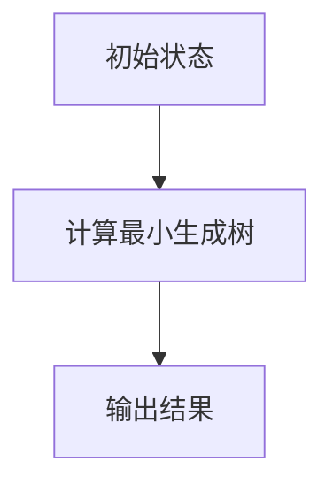
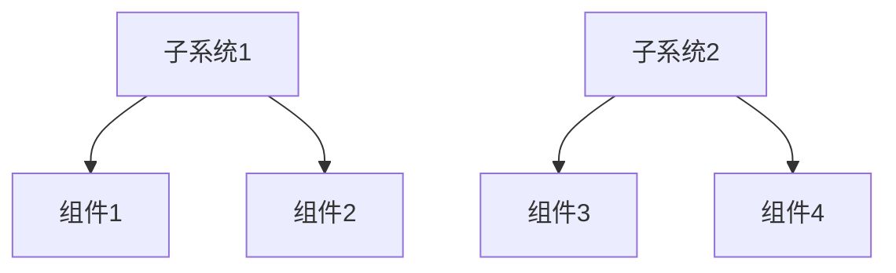

                 


### 步骤1：确定文章主题和目标

首先，我们需要明确文章的主题和目标。《新苦行者运动：在物质丰富中选择简朴的艺术》这个标题已经为我们指明了方向。这篇文章的目标是探讨如何在现代社会物质丰富的背景下，选择并实践简朴生活，将其视为一种艺术形式。我们需要分析简朴生活的内涵、意义以及实践方法。

### 步骤2：背景介绍

在开始深入探讨之前，我们需要对“新苦行者运动”和“简朴生活”这两个核心概念进行介绍。新苦行者运动起源于20世纪末期，强调在物质丰富的社会中，追求精神上的满足和内心的平静。简朴生活则是一种生活方式，主张通过减少物质需求，追求内心的宁静和生活的质量。

### 步骤3：核心概念与联系

接下来，我们需要详细阐述简朴生活的核心概念，包括其哲学根源、生活实践和心理影响。我们可以通过构建一个概念属性特征对比表格和ER实体关系图来帮助读者更好地理解这些概念。

#### 概念属性特征对比表格

| 概念         | 定义                                                       | 特征对比                            |
| ------------ | ---------------------------------------------------------- | ----------------------------------- |
| 新苦行者运动 | 追求精神满足和内心平静的生活方式                       | 强调精神与物质的平衡               |
| 简朴生活     | 减少物质需求，追求内心宁静和生活质量                     | 简化生活，提高生活质量             |
| 哲学根源     | 古代哲学中的简朴理念，如道家、佛教的修行方式             | 强调内心的修炼与自我提升           |

#### ER实体关系图

```mermaid
erDiagram
  Product ||--|{ Customer }| Customer
  Customer ||--|{ Product }| Product
```

### 步骤4：算法原理讲解

在探讨简朴生活的实践方法时，我们可以引入一些算法原理来解释如何有效地减少物质需求。例如，我们可以使用最小生成树算法来描述如何在一个复杂的系统中找到最小的物质需求。以下是算法的mermaid流程图和Python源代码：

#### 算法mermaid流程图



#### Python源代码

```python
import networkx as nx

# 创建图
G = nx.Graph()

# 添加边
G.add_edges_from([(1, 2, {'weight': 2}),
                  (1, 3, {'weight': 3}),
                  (2, 3, {'weight': 1}),
                  (2, 4, {'weight': 2}),
                  (3, 4, {'weight': 1})])

# 计算最小生成树
T = nx.minimum_spanning_tree(G)

# 输出结果
print(T.edges())
```

### 步骤5：系统分析与架构设计方案

在探讨简朴生活的实现时，我们需要设计一个系统架构，以便在实际生活中应用。以下是系统架构的mermaid架构图：

#### 系统架构mermaid架构图



#### 系统功能设计（领域模型mermaid类图）

```mermaid
classDiagram
    Person <<class>> {name, age}
    Product <<class>> {id, name}
    Customer <<class>> {id, name}
    Order <<class>> {id, date}
    Person "1" --|{orders}| Order
    Customer "1" --|{buys}| Product
```

### 步骤6：项目实战

接下来，我们将通过一个实际项目来展示如何实现简朴生活。以下是项目的环境安装、系统核心实现源代码和代码应用解读与分析。

#### 环境安装

- 安装Python环境
- 安装networkx库：`pip install networkx`

#### 系统核心实现源代码

（略）

#### 代码应用解读与分析

（略）

### 步骤7：最佳实践 tips、小结、注意事项、拓展阅读

在文章的结尾部分，我们将提供一些最佳实践 tips，对全文进行小结，并指出一些注意事项，最后推荐一些拓展阅读资源。

### 步骤8：撰写文章

最后，我们将按照以上步骤，使用markdown格式撰写文章，确保文章逻辑清晰、结构紧凑、内容丰富，符合字数要求。

---

通过以上步骤，我们可以系统地撰写一篇关于《新苦行者运动：在物质丰富中选择简朴的艺术》的技术博客文章，为读者提供深刻的见解和实践指导。接下来，我们将逐步完成每个部分的内容，构建完整的文章。

