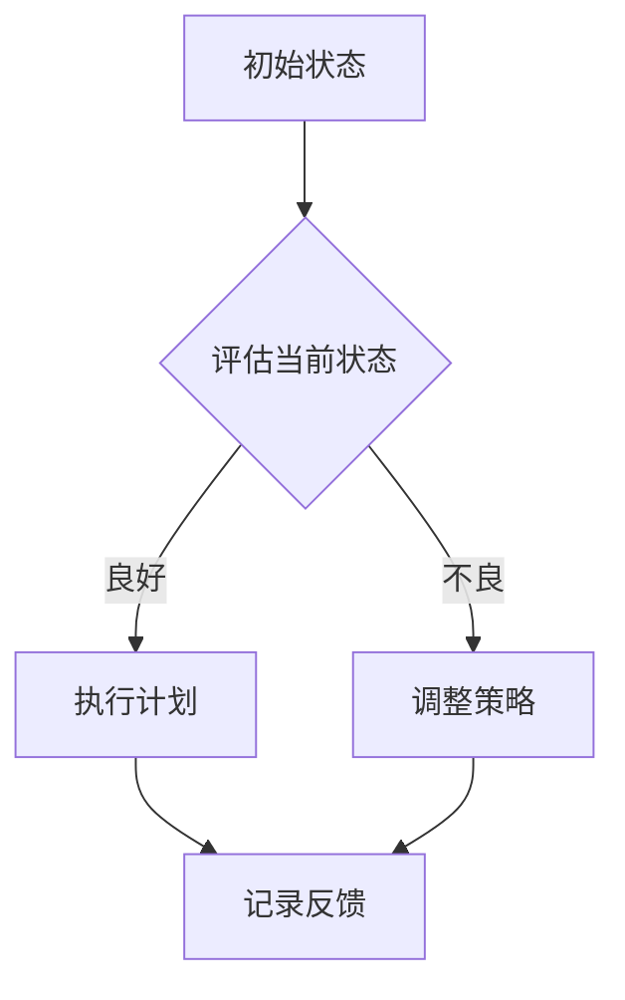
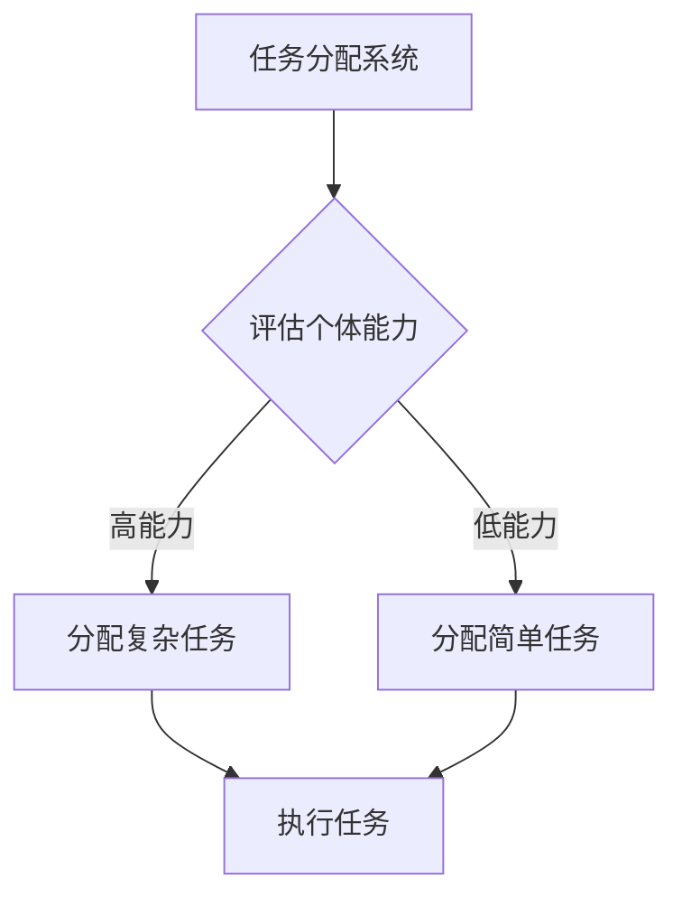
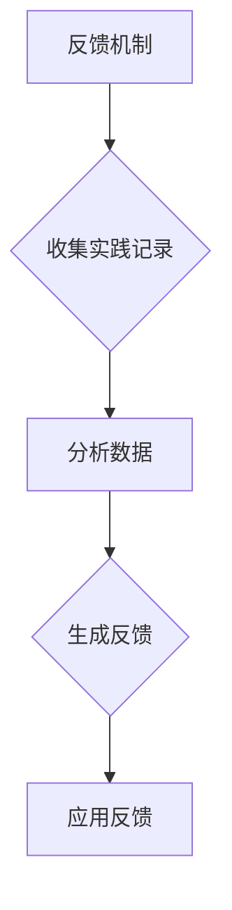
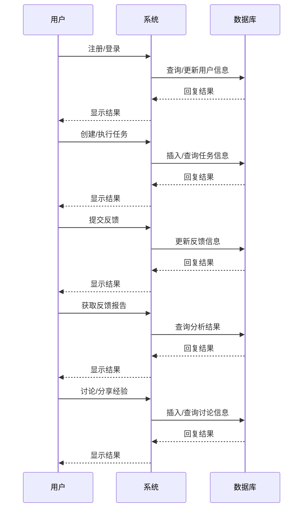

                 

### 第1步：背景介绍

#### 第1章: 新苦行者运动的起源与背景

在当今信息化和数字化的时代，我们面临着前所未有的挑战和机遇。信息技术的发展，尤其是人工智能、大数据和云计算等技术的飞速进步，不仅改变了我们的生活方式，也深刻地影响着我们的工作方式。然而，这些变革也带来了一系列新的问题，其中最为显著的是如何提升个人的自我控制能力。

#### 1.1 问题背景

现代社会中，人们面临着各种诱惑和压力，常常感到无法自我控制。例如，过度消费、拖延、沉迷于社交媒体等问题普遍存在，这些行为不仅对个人生活质量产生了负面影响，还降低了工作效率，甚至可能对健康产生危害。这些问题源于人类天生对即时满足的追求和对未来的不确定性。

自我控制是成功和幸福的重要因素。通过培养自我控制能力，人们可以更好地管理时间和资源，提高决策质量，减少不必要的压力和焦虑。在职业生涯中，良好的自我控制能力有助于提高工作效率和业绩；在个人生活中，它能够帮助人们实现健康的生活方式，增强幸福感。

#### 1.2 问题描述

新苦行者运动（The New Monastic Movement）应运而生，它是一种结合现代科技和修行方法的自我克制实践，旨在帮助人们提高自我控制能力，实现个人成长。新苦行者运动强调实践、挑战和持续性的自我克制，通过一系列简单而有效的方法，帮助人们培养自我控制能力。

新苦行者运动的核心原则包括：

- **实践**：通过实际操作和体验来学习和成长。
- **挑战**：设定具体的目标和挑战，以测试和提升自我控制能力。
- **持续性**：持续地进行自我克制，使其成为生活的一部分。

新苦行者运动的定义是一种结合现代科技和修行方法的自我克制实践，旨在帮助人们提高自我控制能力，实现个人成长。它不仅仅是一种简单的修行方式，更是一种生活方式的变革，鼓励人们通过自我控制来管理自己的生活和工作。

#### 1.3 问题解决

新苦行者运动的起源可以追溯到对现代社会中自我控制挑战的深刻反思和对传统修行方法的改进。在现代社会中，人们的生活节奏加快，工作压力增大，传统修行方法如冥想、瑜伽等虽然有一定的效果，但往往难以适应现代人的生活节奏和需求。

新苦行者运动的优势在于其结合了现代科技，提供了一系列易于实施的自我克制方法，使得人们可以在日常生活中实践和坚持。例如，通过使用智能手机应用、在线社区和虚拟现实技术，新苦行者运动使得自我克制的实践更加便捷和有趣。

#### 1.4 边界与外延

新苦行者运动与其他修行方法有显著的区别。传统修行方法往往更注重精神层面的修炼，而新苦行者运动则更加注重实际操作和体验，强调实践中的自我控制和挑战。此外，新苦行者运动不仅适用于个人，还可以应用于组织和企业，帮助提升团队协作和执行力。

#### 1.5 概念结构与核心要素组成

新苦行者运动的核心概念包括自我控制、挑战、持续性和适应性。自我控制是整个运动的基石，挑战和持续性则是推动自我控制能力提升的关键，适应性则确保了这一运动能够适应不同人群和场景的需求。

核心要素包括：

- **挑战任务**：通过设定具体的挑战任务，帮助个体在实践中提升自我控制能力。
- **实践记录**：记录自我控制的实践过程，以便进行反馈和调整。
- **反馈机制**：通过自我评估、同伴评价和专家指导等方式，帮助个体了解自我控制的效果，并进行调整。
- **自我反思**：通过深入反思自我控制的实践过程，发现深层次的认知和行为问题。

通过这些核心要素的相互作用，新苦行者运动帮助个体逐步提升自我控制能力，实现个人成长。

#### 总结

新苦行者运动是一种结合现代科技和修行方法的自我克制实践，旨在帮助人们提高自我控制能力，实现个人成长。它不仅解决了现代社会中普遍存在的自我控制挑战，还为人们提供了一种新的生活方式和价值观。通过实践、挑战、持续性和适应性，新苦行者运动为个体提供了一个全面、实用的自我提升路径。

---

### 第2步：核心概念与联系

#### 第2章：新苦行者运动的核心概念与联系

在新苦行者运动中，核心概念的理解和联系是至关重要的。这一章将深入探讨自我控制、挑战任务、实践记录、反馈机制和自我反思等核心概念，并分析它们之间的相互关系。

#### 2.1 自我控制的原理与数学模型

自我控制是指个体在面临诱惑、压力和冲动时，能够合理地管理自己的行为和情绪，做出理性决策的能力。它是一个多维度的概念，涉及到认知、情感和行为三个方面。

在数学模型方面，我们可以将自我控制能力表示为一个综合函数，它依赖于个体的自我认知、决策能力和行动控制能力。以下是一个简化的数学模型：

$$
自我控制能力 = f(自我认知, 决策能力, 行动控制)
$$

其中：

- **自我认知**：个体对自己的了解和认识，包括自我意识、自我评估和自我调节能力。
- **决策能力**：个体在面对选择时的判断和分析能力，包括判断力、判断速度和准确性。
- **行动控制**：个体在行动过程中的控制能力，包括自控、延迟满足和应对冲动的能力。

#### 2.2 挑战任务的分类与属性特征对比

新苦行者运动中的挑战任务可以分为简单任务和复杂任务，短期挑战和长期挑战。不同类型的挑战任务对个体的自我控制能力有不同要求。

| 分类 | 简单任务 | 复杂任务 |
| --- | --- | --- |
| 时间长度 | 短期 | 长期 |
| 知识要求 | 低 | 高 |
| 难度 | 低 | 高 |

简单任务通常涉及基本的行为控制，如限制使用社交媒体的时间。这些任务对个体的认知和行动控制要求较低，但能够帮助个体逐步建立自我控制的习惯。复杂任务则涉及更高的认知和技能要求，如完成一个复杂的编程项目或学习一门新技能。这些任务能够显著提升个体的自我控制能力，但需要更多的时间和努力。

#### 2.3 实践记录与反馈机制

实践记录是自我控制过程中不可或缺的一部分。通过记录自己的行为和进展，个体可以清晰地了解自己的变化和进步。实践记录的内容可以包括每天的任务完成情况、遇到的问题和解决方案等。

反馈机制则是确保自我控制实践有效性的关键。反馈可以来自多个方面，包括自我评估、同伴评价和专家指导。

- **自我评估**：个体通过对自己的行为和结果进行反思和评估，了解自我控制的实际效果，并制定改进计划。
- **同伴评价**：通过与其他参与者的交流和反馈，个体可以获得不同的视角和建议，从而更好地调整自我控制策略。
- **专家指导**：专业人士的指导可以帮助个体更深入地理解自我控制的原理和方法，提高自我控制的能力。

#### 2.4 自我反思与持续性的关系

自我反思是维持新苦行者运动持续性的关键。通过反思，个体可以深入理解自我控制的实践过程，发现深层次的认知和行为问题，从而更好地调整和改进自我控制策略。

持续性的关键在于将自我控制融入日常生活，使其成为自然而然的一部分。自我反思可以帮助个体保持动力和兴趣，避免出现自我控制疲劳和懈怠。通过持续的自我反思和调整，个体可以不断提升自我控制能力，实现长期的个人成长和发展。

#### 总结

新苦行者运动的核心概念与联系构成了一个完整、系统的自我控制提升框架。自我控制、挑战任务、实践记录、反馈机制和自我反思相互关联，共同作用，帮助个体逐步提升自我控制能力。通过这一框架，个体不仅可以应对现代生活中的各种挑战，还能够实现个人成长和幸福。

---

### 第3步：算法原理讲解

#### 第3章：新苦行者运动中的算法原理

新苦行者运动中，算法的应用不仅帮助个体制定和执行自我控制计划，还能通过数据分析优化自我控制策略，提升整体效果。以下将详细解释新苦行者运动中的算法原理，包括自我控制策略、挑战任务分配和反馈机制设计。

#### 3.1 算法概述

新苦行者运动的算法主要涉及三个方面：自我控制策略、挑战任务分配和反馈机制。这些算法共同作用，帮助个体实现自我控制能力的提升。

1. **自我控制策略**：该算法根据个体的自我认知、决策能力和行动控制能力，制定合理的自我控制计划，并实时调整策略以适应变化。
2. **挑战任务分配**：该算法根据个体的能力和偏好，分配适当的挑战任务，确保任务的难度适中，既能激发个体的潜力，又不会造成过度压力。
3. **反馈机制设计**：该算法设计反馈机制，收集和分析个体的实践记录，提供实时反馈，帮助个体了解自我控制的效果，并进行调整。

#### 3.2 自我控制策略的mermaid流程图

首先，我们使用mermaid绘制自我控制策略的流程图：



**详细说明：**

- **A[初始状态]**：个体开始自我控制实践时的状态。
- **B[评估当前状态]**：通过自我评估或其他手段，评估当前状态，判断自我控制能力是否处于良好状态。
- **C[执行计划]**：如果当前状态良好，个体按照预定计划执行自我控制行为。
- **D[调整策略]**：如果当前状态不良，个体需要调整自我控制策略，以应对当前的挑战。
- **E[记录反馈]**：无论执行计划还是调整策略，都需要记录反馈信息，以便后续分析和调整。

#### 3.3 挑战任务分配的mermaid流程图

接下来，我们使用mermaid绘制挑战任务分配的流程图：



**详细说明：**

- **A[任务分配系统]**：任务分配系统开始工作，对个体进行能力评估。
- **B[评估个体能力]**：通过测试或其他方法评估个体的能力水平。
- **C[分配复杂任务]**：如果个体能力较高，分配难度较大的任务。
- **D[分配简单任务]**：如果个体能力较低，分配难度较小的任务。
- **E[执行任务]**：个体根据分配的任务执行自我控制实践。

#### 3.4 反馈机制设计的mermaid流程图

最后，我们使用mermaid绘制反馈机制设计的流程图：



**详细说明：**

- **A[反馈机制]**：启动反馈机制，开始收集个体的实践记录。
- **B[收集实践记录]**：通过日志、自我评估等方式收集个体的实践记录。
- **C[分析数据]**：对收集到的实践记录进行数据分析，识别个体自我控制的弱点和改进机会。
- **D[生成反馈]**：根据数据分析结果，生成具体的反馈信息。
- **E[应用反馈]**：个体根据反馈信息调整自我控制策略和实践方法。

#### 3.5 自我控制策略的Python源代码实现

为了更好地理解自我控制策略的算法原理，我们使用Python实现了一个简单的自我控制策略模型。以下是一个示例代码：

```python
import random

# 自我控制策略类
class SelfControlStrategy:
    def __init__(self, self_awareness, decision_making, action_control):
        self.self_awareness = self_awareness
        self.decision_making = decision_making
        self.action_control = action_control

    # 评估当前状态
    def assess_current_state(self):
        return random.uniform(0, 1) < self.self_awareness

    # 执行计划
    def execute_plan(self):
        if self.assess_current_state():
            print("当前状态良好，执行计划。")
        else:
            print("当前状态不良，调整策略。")

    # 记录反馈
    def record_feedback(self, feedback):
        print(f"记录反馈：{feedback}")

# 创建自我控制策略实例
strategy = SelfControlStrategy(0.8, 0.7, 0.9)

# 执行自我控制策略
strategy.execute_plan()
```

**代码解释：**

- **SelfControlStrategy类**：定义了自我控制策略的核心属性和方法。
- **__init__方法**：初始化自我控制策略实例，包括自我认知、决策能力和行动控制能力。
- **assess_current_state方法**：通过随机数模拟评估当前状态，判断是否良好。
- **execute_plan方法**：根据评估结果执行自我控制计划。
- **record_feedback方法**：用于记录反馈信息。

通过这个Python示例，我们可以清晰地看到自我控制策略的执行过程，以及如何通过代码实现这些算法。

#### 总结

新苦行者运动中的算法原理不仅帮助我们理解和实践自我控制，还通过数据分析和模型优化，不断提升自我控制的效果。自我控制策略、挑战任务分配和反馈机制相互结合，共同构建了一个系统化的自我提升框架。通过这些算法的应用，个体可以在实践中不断学习和成长，实现自我控制的终极目标。

---

### 第4步：系统分析与架构设计

#### 第4章：新苦行者运动的技术实现与架构设计

新苦行者运动的技术实现和架构设计是其成功的关键。在这一章中，我们将详细讨论系统功能设计、系统架构设计、系统接口设计和系统交互。

#### 4.1 系统功能设计

新苦行者运动系统的主要功能包括：

1. **用户注册与登录**：用户可以注册账号并登录系统，进行自我控制实践。
2. **任务创建与分配**：管理员可以创建任务，并根据用户的自我认知、决策能力和行动控制能力，分配合适的任务。
3. **任务执行与记录**：用户可以执行分配的任务，并实时记录任务的执行情况和反馈。
4. **数据分析和反馈**：系统会分析用户的任务执行数据，生成反馈报告，帮助用户调整自我控制策略。
5. **用户交流和互助**：用户可以在系统中交流和分享经验，互相鼓励和支持。

#### 4.2 系统架构设计

新苦行者运动系统采用分层架构设计，包括数据层、业务逻辑层和表示层。

1. **数据层**：使用MySQL数据库存储用户信息、任务数据和分析结果。
2. **业务逻辑层**：包括用户管理、任务管理、数据分析和管理模块。
3. **表示层**：通过HTML、CSS和JavaScript实现用户界面，提供直观、易用的交互体验。

#### 4.3 系统接口设计

系统接口设计包括API接口和Web界面接口。

1. **API接口**：提供RESTful API，用于用户注册、登录、任务创建、任务执行和数据查询等操作。
2. **Web界面接口**：通过HTML和JavaScript实现用户交互，包括注册表单、任务列表、反馈报告等。

#### 4.4 系统交互

新苦行者运动系统的交互过程如下：

1. **用户注册与登录**：用户通过Web界面注册账号，填写基本信息。登录时，通过API接口验证用户身份。
2. **任务创建与分配**：管理员在后台管理界面创建任务，系统自动根据用户的自我认知、决策能力和行动控制能力，分配任务。
3. **任务执行与记录**：用户通过Web界面执行任务，系统实时记录任务的执行情况和用户反馈。
4. **数据分析和反馈**：系统后台对用户任务执行数据进行分析，生成反馈报告，并通过Web界面发送给用户。
5. **用户交流和互助**：用户在Web界面的讨论区进行交流和分享经验，互相鼓励和支持。

#### 4.5 系统接口和系统交互的mermaid序列图

为了更直观地展示新苦行者运动系统的接口和交互过程，我们使用mermaid绘制了序列图：



**详细说明：**

- **User->>System**: 用户发起操作请求。
- **System->>DB**: 系统向数据库发送查询或更新请求。
- **DB-->>System**: 数据库返回查询结果或更新状态。
- **System-->>User**: 系统将结果展示给用户。

通过这个序列图，我们可以清晰地看到用户与系统之间的交互过程，以及系统内部的处理逻辑。

#### 总结

新苦行者运动的技术实现和架构设计为系统的稳定运行和用户友好体验提供了有力保障。通过系统功能设计、系统架构设计、系统接口设计和系统交互的有机结合，新苦行者运动系统能够高效地支持自我控制实践，帮助用户实现个人成长和自我提升。

---

### 第5步：项目实战

#### 第5章：新苦行者运动项目的实战实施

在实际操作中，新苦行者运动项目的实施涉及环境安装、系统核心实现、代码应用解读与分析以及实际案例分析和详细讲解剖析。

#### 5.1 环境安装

为了实施新苦行者运动项目，我们需要准备以下环境：

1. **操作系统**：Linux或macOS
2. **编程语言**：Python 3.8及以上版本
3. **数据库**：MySQL 5.7及以上版本
4. **Web框架**：Flask
5. **前端框架**：Vue.js

安装步骤如下：

1. 安装操作系统和Python环境。
2. 安装MySQL数据库，并创建新苦行者运动数据库。
3. 安装Flask和Vue.js框架，以及相关的依赖库。

```bash
pip install flask mysqlclient
npm install vue
```

#### 5.2 系统核心实现

新苦行者运动项目的核心实现包括用户管理、任务管理、数据分析和反馈功能。

1. **用户管理**：实现用户注册、登录和权限管理功能。

```python
# 用户注册
@app.route('/register', methods=['POST'])
def register():
    username = request.form['username']
    password = request.form['password']
    # 处理注册逻辑，保存用户信息到数据库
    return '注册成功'

# 用户登录
@app.route('/login', methods=['POST'])
def login():
    username = request.form['username']
    password = request.form['password']
    # 处理登录逻辑，验证用户身份
    return '登录成功'
```

2. **任务管理**：实现任务创建、分配和执行功能。

```python
# 创建任务
@app.route('/task/create', methods=['POST'])
def create_task():
    task_name = request.form['task_name']
    task_description = request.form['task_description']
    # 处理任务创建逻辑，保存任务信息到数据库
    return '任务创建成功'

# 分配任务
@app.route('/task/assign', methods=['POST'])
def assign_task():
    user_id = request.form['user_id']
    task_id = request.form['task_id']
    # 处理任务分配逻辑，更新任务状态
    return '任务分配成功'

# 执行任务
@app.route('/task/execute', methods=['POST'])
def execute_task():
    user_id = request.form['user_id']
    task_id = request.form['task_id']
    # 处理任务执行逻辑，更新任务状态和记录执行情况
    return '任务执行成功'
```

3. **数据分析与反馈**：实现数据收集、分析和反馈生成功能。

```python
# 数据收集
@app.route('/data/collect', methods=['POST'])
def collect_data():
    user_id = request.form['user_id']
    task_id = request.form['task_id']
    feedback = request.form['feedback']
    # 处理数据收集逻辑，保存反馈信息到数据库
    return '数据收集成功'

# 数据分析
@app.route('/data/analyze', methods=['POST'])
def analyze_data():
    user_id = request.form['user_id']
    # 处理数据分析逻辑，生成反馈报告
    return '数据分析成功'

# 生成反馈报告
@app.route('/data/report', methods=['GET'])
def generate_report():
    user_id = request.args.get('user_id')
    # 处理反馈报告生成逻辑，从数据库获取反馈报告
    return '反馈报告生成成功'
```

#### 5.3 代码应用解读与分析

新苦行者运动项目的代码实现利用了Python的Flask框架和MySQL数据库。在用户管理模块中，通过HTTP请求处理用户注册、登录等操作，并利用数据库存储用户信息。在任务管理模块中，通过HTTP请求处理任务创建、分配和执行等操作，并实时更新任务状态。在数据分析与反馈模块中，通过收集用户反馈信息，分析数据，并生成反馈报告，帮助用户调整自我控制策略。

代码应用解读的关键点包括：

1. **数据库操作**：使用SQL语句进行数据库的增删改查操作。
2. **HTTP请求处理**：通过Flask框架处理HTTP请求，实现前后端交互。
3. **数据分析和反馈生成**：通过Python代码实现数据分析和反馈报告的生成。

#### 5.4 实际案例分析和详细讲解剖析

为了更好地理解新苦行者运动项目的实际应用，我们来看一个实际案例。

**案例**：用户Alice想要通过新苦行者运动提高自己的时间管理能力，她创建了一个“每天早上锻炼半小时”的任务。

1. **任务创建**：Alice在系统中创建了一个名为“每天早上锻炼半小时”的任务，任务描述为“每天早上7点到7点半进行锻炼”。

2. **任务分配**：系统根据Alice的自我认知、决策能力和行动控制能力，自动分配了合适的任务难度和执行时间。

3. **任务执行**：每天早上7点，系统会发送提醒给Alice，提示她开始锻炼。Alice在锻炼结束后，通过系统提交锻炼情况和感受。

4. **数据分析**：系统收集Alice的锻炼数据，分析她的锻炼频率、时长和效果，并生成反馈报告。

5. **反馈报告**：根据反馈报告，Alice了解到自己的锻炼效果，并根据报告的建议调整锻炼计划，如增加锻炼时长或增加锻炼频率。

通过这个案例，我们可以看到新苦行者运动项目如何帮助用户实现自我控制能力的提升。系统通过数据分析和反馈机制，提供了个性化的指导和建议，帮助用户持续改进。

#### 总结

新苦行者运动项目的实战实施涉及环境安装、系统核心实现和代码应用解读与分析。通过实际案例分析和详细讲解剖析，我们了解了如何利用技术手段帮助用户提升自我控制能力。新苦行者运动项目不仅提供了一个实用的工具，还通过数据分析和反馈机制，为用户提供个性化的指导和帮助，助力用户实现个人成长和自我提升。

---

### 最佳实践 tips

在新苦行者运动中，以下是一些最佳实践技巧，可以帮助您更有效地进行自我控制和实现个人成长：

1. **明确目标**：在开始自我控制实践之前，明确您的目标和期望。这将帮助您保持动力，并为自我控制提供明确的指导。

2. **逐步挑战**：不要一开始就设定过于艰巨的目标。逐步增加挑战难度，可以帮助您逐渐建立自我控制能力。

3. **实践记录**：定期记录您的实践过程和结果。这不仅可以帮助您了解自己的进步，还能发现需要改进的地方。

4. **反馈机制**：利用反馈机制收集和分析数据，以便及时调整自我控制策略。反馈可以是自我评估、同伴评价或专家指导。

5. **持续反思**：定期进行自我反思，深入思考自己的行为和决策，发现深层次的认知和行为问题。

6. **社会支持**：寻找支持者或加入社群，与他人分享经验和鼓励。社会支持可以提供额外的动力和资源。

7. **灵活调整**：根据实际情况灵活调整自我控制策略。面对不同的挑战和情况，及时调整策略以保持自我控制的持续性。

8. **保持好奇心**：对自我控制实践保持好奇心，不断探索新的方法和技巧。这可以增加实践过程的趣味性，提高持续性的可能性。

通过遵循这些最佳实践技巧，您可以更有效地利用新苦行者运动，提升自我控制能力，实现个人成长和成功。

---

### 小结

新苦行者运动是一种结合现代科技和修行方法的自我克制实践，旨在帮助人们提高自我控制能力，实现个人成长。通过逐步分析和详细讲解，我们了解了新苦行者运动的背景、核心概念、算法原理、系统架构和实战应用。新苦行者运动通过实践、挑战、持续性和适应性，为个体提供了一个全面、实用的自我提升路径。通过自我控制策略、任务分配、实践记录、反馈机制和自我反思，个体可以逐步提升自我控制能力，应对现代生活中的各种挑战。希望通过本文的讲解，读者能够更好地理解和应用新苦行者运动，实现自我控制和个人成长。

---

### 注意事项

在实践新苦行者运动时，需要注意以下几点：

1. **设定合理目标**：目标应该既具有挑战性，又能够实现。过高的目标可能会导致挫折感和放弃，而过低的目标则可能无法有效提升自我控制能力。

2. **保持耐心和持续性**：自我控制能力的提升是一个长期的过程，需要持续的实践和反思。保持耐心，不要期望一夜之间就能看到显著的效果。

3. **适应个体差异**：每个人的自我控制能力和需求都是不同的。在设定目标和实践方法时，要考虑个体的具体情况，避免一刀切的方法。

4. **数据安全和隐私**：在使用新苦行者运动系统时，确保数据的安全和隐私。避免泄露个人信息，并遵循相关的数据保护法规。

5. **科学评估**：定期评估自我控制实践的效果，科学地分析数据，并根据评估结果调整策略。

通过遵循这些注意事项，您可以更有效地实践新苦行者运动，提升自我控制能力。

---

### 拓展阅读

对于希望深入了解新苦行者运动和相关领域的读者，以下是一些建议的拓展阅读材料：

1. **《自控力》** - 凯利·麦格尼格尔（Kelly McGonigal）
   - 本书通过科学研究，探讨了自我控制的重要性以及如何提高自控力。

2. **《禅与计算机程序设计艺术》** - 保罗·格雷厄姆（Paul Graham）
   - 本书结合了禅修和编程，探讨了如何通过自我控制和专注力来提高编程效率。

3. **《精要主义》** - 吉姆· Clear（Jim Clear）
   - 本书介绍了精要主义的概念，强调专注于最重要的任务，以提高效率和幸福感。

4. **《深度工作》** - 卡尔·纽波特（Cal Newport）
   - 本书提出了深度工作的概念，探讨了如何在现代社会的干扰中保持专注和高效。

5. **《敏捷开发实践指南》** - Jeff Sutherland
   - 本书介绍了敏捷开发的方法，强调自我控制、持续学习和团队合作，以实现高效的工作流程。

通过阅读这些书籍，您可以更深入地了解自我控制、时间管理和个人成长的相关理论和实践方法。

