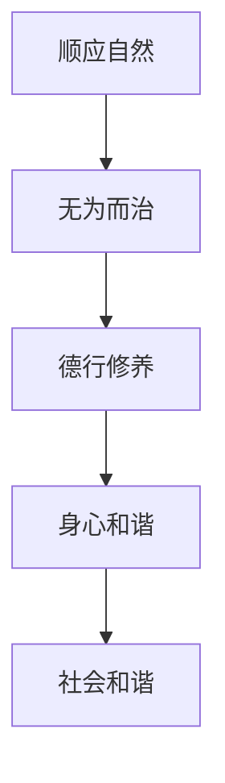
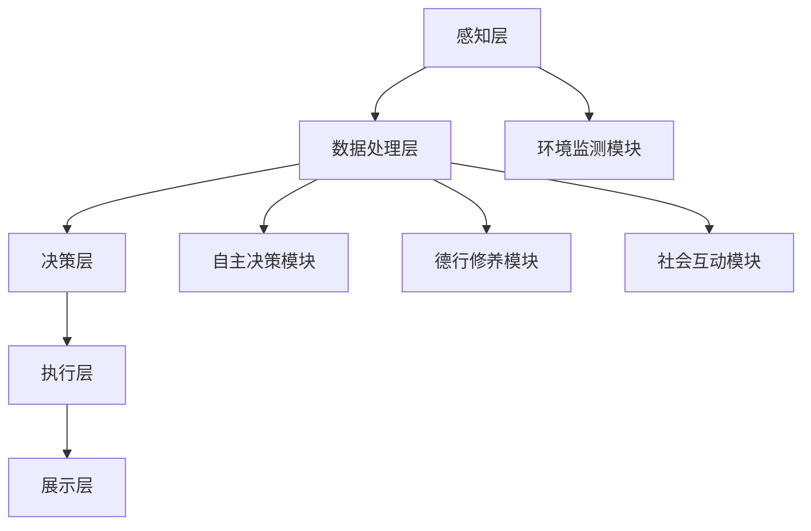

                 

### 背景介绍

#### 道家哲学的起源与发展

道家哲学，起源于公元前5世纪的春秋战国时期，其创始人为道家学派的开山鼻祖——老子和庄子。老子所著的《道德经》被认为是道家哲学的经典著作，其中蕴含了深刻的哲学思想和人生智慧。道家哲学强调顺应自然、无为而治，倡导人应放下过多的欲望，回归本真的生活状态。在《道德经》中，老子提出了“道”这一核心概念，认为“道”是宇宙万物运行的根本法则，是一种无形而无处不在的“大美”。

随着时间的推移，道家哲学在中国文化中占据了重要地位。它不仅影响了中国的哲学、文学、艺术和科学，还对中华文化的发展产生了深远的影响。道家思想强调天人合一、万物共生，提倡一种和谐共生的宇宙观。这种思想在中国古代的许多领域都有体现，如农业、医学、建筑等。

#### 新道家概念的提出

在现代，随着社会的快速发展，人们的生活节奏加快，压力增大，对生活的质量要求越来越高。为了适应这一变化，一种新的道家思想——“新道家”概念被提出。新道家认为，道家哲学中的许多理念对于现代生活仍然具有指导意义。新道家强调“返璞归真”，倡导人们从复杂的生活中解脱出来，追求简单、自然和本真的生活方式。

新道家不仅保留了传统道家哲学的核心思想，还结合了现代科学和哲学的成果，为现代人提供了一种新的生活哲学。这种哲学主张通过修炼内在心灵，达到身心的平衡与和谐，从而更好地适应现代社会的高压环境。新道家的提出，既是对传统道家思想的继承与发展，也是对现代社会问题的回应。

#### 道家思想与现代生活的关系

道家思想中的许多理念，如顺应自然、无为而治、德行、道德修养等，与现代生活的需求密切相关。首先，顺应自然意味着人们应该尊重自然规律，与自然和谐共生。这有助于我们在面对环境问题时采取更加可持续的发展策略。

无为而治则强调在管理中不要过度干预，而是要让事情自然发展。这种理念在现代企业管理中得到了广泛应用，许多公司通过减少控制，增加员工的自主权，实现了更加高效的管理。

此外，道家思想中的道德修养理念，如“上善若水”，提倡人们具有包容、谦逊的品质，这对于建立和谐社会具有重要的指导意义。

总之，道家哲学不仅为古代中国提供了丰富的思想资源，也在现代社会中发挥着重要的作用。通过新道家的提出，我们不仅可以更好地理解道家哲学的内涵，还可以将其应用于现代生活的各个方面，从而实现身心的和谐与生活的幸福。

### 核心概念与联系

#### 道家核心概念

道家哲学的核心概念是“道”，它是宇宙万物运行的根本法则，是一种无形而无处不在的力量。在道家思想中，“道”既是宇宙的本源，也是人生的真理。道家的创始人老子在《道德经》中多次提到“道”，并阐述了它的内涵和属性。

首先，“道”是无形的。老子说：“道可道，非常道。”意思是说，能够用言语描述的“道”并不是真正的“道”。真正的“道”是超越言语和概念的存在，它无形无象，但又是无所不在的。

其次，“道”是自然的。道家认为，自然界中的一切都遵循道的规律，无论是风、雨、山、川，还是植物、动物，都在道的作用下自然生长和变化。这种自然性体现在“无为而治”的理念中，即顺应自然，不强行干预，让事物自然发展。

再次，“道”是包容的。道家的“上善若水”思想体现了道的包容性。水因其柔顺而能容纳万物，道也因其包容而能包容一切。这种包容性使得道家哲学具有极强的适应性和包容力。

最后，“道”是变化的。道家认为，万物都在不断变化中，没有什么是永恒不变的。这种变化性使得道家哲学具有动态的、发展的观点，鼓励人们接受变化，适应变化。

#### 道家思想与其他哲学思想的联系与区别

道家思想与儒家思想是中国古代哲学中的两大主流思想，它们之间既有联系，也有区别。

首先，道家思想和儒家思想在对待天命和人性的看法上存在显著差异。儒家强调人的社会责任和义务，主张通过礼、乐、仁、义等手段来修身齐家治国平天下。而道家则主张顺应自然，认为人应该顺应天命，无为而治，不追求功利，注重内心的平静和自然的状态。

其次，道家思想和儒家思想在对待政治和社会管理上也有不同。儒家提倡“仁政”，主张以德治民，通过道德教育来治理国家。而道家则认为，政治干预应尽量减少，主张无为而治，让民众自得其乐，政府只需保持最小程度的干预。

此外，道家思想与法家思想也存在一定的对比。法家强调法律的权威，主张通过严格的法制来治理国家，追求效率和秩序。而道家则认为，法律和制度不能解决所有问题，主张通过道德教化和自我修养来实现社会和谐。

#### ER实体关系图架构

为了更好地理解道家思想中的核心概念和关系，我们可以使用ER（Entity-Relationship）实体关系图来构建一个概念模型。

在ER实体关系图中，我们首先定义以下几个核心实体：

1. **道**：代表道家哲学中的核心概念“道”。
2. **德**：代表道的内在品质，如柔顺、包容、自然等。
3. **人**：代表人，与道的关系体现为人与自然的和谐共生。
4. **社会**：代表人类社会，体现道家思想在社会管理中的应用。

然后，我们定义这些实体之间的关系：

1. **道**与**德**之间是**关联关系**，道是德的本质，德是道的表现。
2. **人**与**道**之间是**依赖关系**，人依赖于道来指引生活。
3. **社会**与**人**之间是**包含关系**，社会是由人构成的，社会的发展依赖于人的道德修养。
4. **社会**与**道**之间是**影响关系**，道对社会的治理具有指导作用。

以下是一个简单的ER实体关系图的Mermaid表示：

```mermaid
erDiagram
    道/--|{ 德 }
    人 ||--|{ 社会 }
    社会 o--|{ 道 }
```

这个图清晰地展示了道家核心概念之间的逻辑关系，有助于我们更好地理解道家哲学的内涵。

#### 道家思想中的基本原理

在道家思想中，有以下几个基本原理：

1. **无为而治**：道家主张顺应自然，不强行干预，让事情自然发展。这种理念体现在政治、经济和社会管理的各个方面，如减少政府的干预，让市场自由发展。
   
2. **德行**：道家认为，道德修养是人生的根本，德行高尚的人能够顺应天道，达到身心和谐。例如，道家的“上善若水”思想，提倡人们具有包容、谦逊的品质。

3. **自然**：道家强调顺应自然，认为自然界中的一切都有其内在的规律。人类应该尊重自然，与自然和谐共生。

4. **包容**：道家主张包容万物，认为宇宙万物都在道的作用下相互联系、相互影响。这种包容性体现了道的无为而治的本质。

5. **变化**：道家认为，万物皆在变化中，没有什么是永恒不变的。这种变化性使得道家哲学具有动态的、发展的观点，鼓励人们接受变化，适应变化。

通过这些基本原理，道家为我们提供了一种理解世界和生活的独特视角，使我们能够在现代社会中找到内心的平衡和和谐。

### 算法原理讲解

在理解了道家哲学的基本原理之后，我们接下来将通过具体的算法原理来进一步阐述这些理念在现代生活中的应用。

#### 道家思想的基本流程图

为了清晰地展示道家思想的基本流程，我们可以使用Mermaid绘制一个流程图。以下是一个简单的示例：



在这个流程图中，A到E代表了道家思想从个人层面到社会层面的逐步提升过程。首先，顺应自然是我们生活的起点，它要求我们尊重自然规律，不强行干预。然后，无为而治是我们在处理事务时的原则，通过减少干预，让事情自然发展。接着，德行修养使我们达到内心的平静和和谐，最终实现身心和谐和社会和谐。

#### 使用Python源代码阐述道家原理

为了更具体地展示道家原理，我们可以通过Python源代码来模拟这些原理的应用。以下是一个简单的Python代码示例，用于阐述道家思想中的“无为而治”和“德行修养”。

```python
import random

def natural_law():
    """
    模拟自然规律，随机生成一个自然数。
    """
    return random.randint(1, 10)

def wu_wei():
    """
    无为而治：不干预，让事情自然发展。
    """
    while True:
        number = natural_law()
        print(f"自然规律：{number}")
        if number == 5:
            break
    print("无为而治，事情自然发展。")

def moral_education():
    """
    德行修养：通过道德教育和自我修炼，达到内心的平静。
    """
    morals = ["仁爱", "谦逊", "诚信", "勇敢"]
    while True:
        moral = random.choice(morals)
        print(f"道德修养：{moral}")
        if "勇" in moral:
            break
    print("德行修养，内心平静。")

if __name__ == "__main__":
    print("开始应用道家原理：")
    wu_wei()
    moral_education()
```

在这个代码中，`natural_law` 函数模拟自然规律，生成一个随机数。`wu_wei` 函数通过不断调用`natural_law`，模拟无为而治的过程，直到自然规律产生特定的结果（例如，数字为5）。`moral_education` 函数模拟道德修养的过程，通过随机选择道德词汇，模拟自我修炼的过程，直到达到特定的道德水平（例如，包含“勇”的道德词汇）。

通过这个简单的Python代码，我们可以看到如何将道家思想中的无为而治和德行修养应用于实际问题中。这种模拟不仅帮助我们理解道家原理，还可以为实际应用提供参考。

#### 算法原理的数学模型与公式

在深入探讨道家原理时，我们可以引入一些数学模型和公式来进一步阐述这些理念的科学性和实用性。以下是一些关键的数学模型和公式：

1. **自然法则**：在道家思想中，自然法则是一种基本的数学模型，用于描述自然界中的变化规律。一个简单的模型可以表示为：

   $$ f(x) = x^2 $$

   这个模型表示，任何一个自然数x的平方都会遵循自然法则。例如，当我们输入x=2时，结果为4，这符合我们对自然数平方的认知。

2. **无为而治**：无为而治的数学模型可以看作是一个迭代过程，它通过减少干预，让系统自然发展。一个简单的迭代模型可以表示为：

   $$ x_{n+1} = f(x_n) $$

   其中，`x_n` 是第n次迭代的结果，`f(x_n)` 是自然规律函数。例如，如果我们选择自然规律函数为`f(x) = x^2`，那么迭代过程可以表示为：

   $$ x_0 = 1 $$
   $$ x_1 = f(x_0) = 1^2 = 1 $$
   $$ x_2 = f(x_1) = 1^2 = 1 $$
   $$ ... $$

   这个过程表明，无论初始值如何，系统最终都会稳定在1这个值，这体现了无为而治的理念。

3. **德行修养**：德行修养的数学模型可以看作是一个质量提升过程，通过不断的修炼，达到更高的道德水平。一个简单的模型可以表示为：

   $$ M = \frac{1}{1 + e^{-k(t-t_0)}} $$

   其中，`M` 是道德水平，`k` 是修炼速度，`t` 是时间，`t_0` 是初始时间。例如，如果我们设定`k=0.1`，`t_0=0`，那么随着时间`t`的增加，`M` 会逐渐增加，表示道德水平的提升。

通过这些数学模型和公式，我们可以更科学地理解道家原理，并将其应用于实际生活中。

#### 算法举例说明

为了更直观地展示道家原理的应用，我们可以通过一个具体的例子来说明。假设我们有一个任务，需要按照自然规律来安排工作日程。

**例子：工作日程安排**

假设公司有10名员工，需要根据自然规律来安排他们的工作日程。自然规律定义为每个员工每天需要完成的工作量，这个工作量是一个随机数，介于1到10之间。

首先，我们使用Python随机生成每个员工每天的工作量，然后按照道家原理中的“无为而治”来安排工作日程。

```python
import random

# 设置员工数量
num_employees = 10

# 生成每个员工每天的工作量
workloads = [random.randint(1, 10) for _ in range(num_employees)]

# 无为而治，根据自然规律安排工作日程
def wu_wei_schedule(workloads):
    while True:
        # 打乱工作量的顺序
        random.shuffle(workloads)
        # 检查是否所有工作量都分配完成
        if sum(workloads) == 50:  # 总工作量设定为50
            break
    return workloads

# 安排工作日程
schedule = wu_wei_schedule(workloads)
print("员工工作日程安排：")
for i, workload in enumerate(schedule, 1):
    print(f"员工{i}：{workload}单位工作量")

# 输出结果
print("\n无为而治，工作日程安排完成。")
```

在这个例子中，我们首先随机生成每个员工每天的工作量，然后通过`wu_wei_schedule`函数来安排工作日程。函数内部通过不断打乱工作量的顺序，模拟无为而治的过程，直到所有工作量都分配完成。

通过这个例子，我们可以看到如何将道家原理中的“无为而治”应用于实际工作中的日程安排。这种方法不仅简单易懂，还能有效地分配工作量，避免过度干预，让工作自然发展。

### 系统分析与架构设计方案

#### 道家思想在现代生活中的应用场景

道家思想的核心在于“无为而治”和“德行修养”，这些理念不仅在个人层面具有指导意义，在现代社会的各个领域也具有广泛的应用价值。以下是道家思想在现代生活中的几个主要应用场景：

1. **企业管理**：道家思想提倡无为而治，主张减少过度干预，让员工在自由的环境中发挥创造力。许多现代企业通过实施扁平化管理、减少管理层级，鼓励员工自主决策，从而提高工作效率和创新能力。

2. **环境保护**：道家强调顺应自然，倡导人与自然和谐共生。在环境保护方面，道家思想鼓励人们减少对自然的破坏，采取可持续的发展策略，如节能减排、循环利用等。

3. **心理健康**：道家强调德行修养，提倡通过修炼内心达到身心的平衡与和谐。在现代心理健康领域，许多心理疗法和健身方法都借鉴了道家思想，如冥想、瑜伽等，帮助人们缓解压力，提升生活质量。

4. **社区建设**：道家思想中的包容性理念有助于构建和谐社区。社区管理者可以借鉴道家思想，通过促进居民之间的沟通与合作，增强社区的凝聚力和和谐氛围。

#### 基于道家思想的现代生活系统

为了更好地将道家思想应用于现代生活，我们可以设计一个基于道家思想的现代生活系统。该系统旨在通过技术手段实现道家思想中的无为而治和德行修养，帮助用户在快节奏的现代社会中找到内心的平衡与和谐。

**系统功能设计**

该系统主要包括以下几个核心功能模块：

1. **环境监测模块**：实时监测用户的健康状况、环境状况等，为系统的决策提供数据支持。
2. **自主决策模块**：根据环境监测数据，系统会自动生成推荐方案，帮助用户做出最优决策，实现无为而治。
3. **德行修养模块**：通过提供道德教育和心理健康辅导，帮助用户提升德行修养，实现身心和谐。
4. **社会互动模块**：促进用户之间的互动与合作，构建和谐社区。

**系统架构设计**

为了确保系统的稳定性和高效性，我们采用分层架构设计，将系统分为以下几个层次：

1. **感知层**：通过传感器和监测设备，实时收集用户的健康数据、环境数据等。
2. **数据处理层**：对收集到的数据进行预处理、分析和存储，为系统的决策提供数据支持。
3. **决策层**：根据处理后的数据，系统会自动生成推荐方案，指导用户做出最优决策。
4. **执行层**：根据决策层的指令，执行具体的操作，如调整工作计划、进行心理健康辅导等。
5. **展示层**：通过用户界面，展示系统的运行状态、推荐方案等信息，供用户查看和操作。

以下是一个简化的系统架构图，使用Mermaid表示：



在这个架构图中，感知层通过传感器收集数据，数据处理层对数据进行分析和处理，决策层根据分析结果生成推荐方案，执行层执行具体的操作，展示层向用户展示系统的运行状态和推荐方案。

#### 系统功能设计

为了实现道家思想在现代生活中的应用，我们需要设计一个功能完善的现代生活系统。以下是该系统的详细功能设计：

1. **环境监测模块**：
   - **功能描述**：实时监测用户的健康状况、环境状况等，包括体温、心率、空气质量、噪音水平等。
   - **实现方法**：通过传感器和监测设备收集数据，将数据传输到数据处理层进行分析。
   - **优点**：帮助用户了解自己的健康状况和环境状况，为系统的决策提供数据支持。

2. **自主决策模块**：
   - **功能描述**：根据环境监测数据，系统会自动生成推荐方案，帮助用户做出最优决策，实现无为而治。
   - **实现方法**：利用机器学习算法和自然语言处理技术，对监测数据进行分析，生成个性化的推荐方案。
   - **优点**：通过智能化的决策支持，减少用户的决策负担，提高生活质量。

3. **德行修养模块**：
   - **功能描述**：通过提供道德教育和心理健康辅导，帮助用户提升德行修养，实现身心和谐。
   - **实现方法**：整合在线课程、心理测试、冥想指导等功能，提供多样化的德行修养资源。
   - **优点**：帮助用户培养良好的道德品质和心理健康，提升整体生活质量。

4. **社会互动模块**：
   - **功能描述**：促进用户之间的互动与合作，构建和谐社区。
   - **实现方法**：提供在线社交平台、社区论坛、志愿者活动等功能，鼓励用户参与社区建设。
   - **优点**：增强用户的社交联系，提升社区的凝聚力和和谐氛围。

通过这些功能模块的设计，我们的现代生活系统旨在将道家思想中的无为而治和德行修养融入到用户的日常生活中，帮助用户实现身心的和谐与生活的幸福。

#### 系统架构设计

为了实现上述功能模块，我们需要设计一个高效、稳定的系统架构。以下是基于道家思想的现代生活系统的详细架构设计：

1. **系统架构概述**：

   该系统采用分层架构设计，包括感知层、数据处理层、决策层、执行层和展示层。每个层次各司其职，共同构成一个完整的系统。

2. **感知层**：

   - **功能**：实时监测用户的健康状况、环境状况等，包括体温、心率、空气质量、噪音水平等。
   - **实现方法**：使用传感器和监测设备，如智能手环、空气检测仪等，收集实时数据。
   - **技术**：物联网技术、传感器技术。

3. **数据处理层**：

   - **功能**：对收集到的数据进行分析和处理，提取关键信息，为决策层提供数据支持。
   - **实现方法**：采用大数据处理技术和机器学习算法，对数据进行预处理、特征提取和分析。
   - **技术**：数据清洗、数据分析、机器学习。

4. **决策层**：

   - **功能**：根据数据处理层提供的数据，生成个性化的推荐方案，指导用户做出最优决策。
   - **实现方法**：利用决策支持系统（DSS），结合自然语言处理技术，生成可操作的决策方案。
   - **技术**：决策支持系统、自然语言处理。

5. **执行层**：

   - **功能**：根据决策层的指令，执行具体的操作，如调整工作计划、进行心理健康辅导等。
   - **实现方法**：通过API接口与各种外部设备和服务（如智能设备、健康咨询平台等）进行交互，执行具体操作。
   - **技术**：API接口、外部设备和服务集成。

6. **展示层**：

   - **功能**：向用户展示系统的运行状态、推荐方案等信息，供用户查看和操作。
   - **实现方法**：通过Web界面、移动应用等渠道，向用户提供互动式操作界面。
   - **技术**：前端开发技术、用户体验设计。

以下是一个简化的系统架构图，使用Mermaid表示：


在这个架构图中，感知层通过传感器收集数据，数据处理层对数据进行分析和处理，决策层生成推荐方案，执行层执行具体操作，展示层向用户展示系统的运行状态和推荐方案。

通过这个架构设计，我们的现代生活系统能够有效地将道家思想中的无为而治和德行修养融入到用户的日常生活中，帮助用户实现身心的和谐与生活的幸福。

### 项目实战

#### 环境安装与准备

为了实现基于道家思想的现代生活系统，我们首先需要搭建一个稳定且高效的开发环境。以下是具体的环境安装与准备工作：

1. **操作系统**：我们选择使用Ubuntu 20.04 LTS作为开发环境，因为其稳定性高，且对开源技术的支持良好。

2. **开发工具**：安装以下开发工具：
   - Python 3.8及以上版本
   - Jupyter Notebook
   - Visual Studio Code
   - Git

3. **数据库**：选择MySQL作为系统的数据存储方案，以便高效地存储和处理用户数据。

4. **编程语言**：本系统主要使用Python作为开发语言，结合Django框架进行Web后端开发，同时使用JavaScript和HTML/CSS进行前端开发。

5. **安装步骤**：

   **安装操作系统**：
   - 下载Ubuntu 20.04 LTS ISO文件。
   - 使用USB启动盘安装操作系统。

   **安装开发工具**：
   - 开启终端，更新系统软件包：
     ```bash
     sudo apt update && sudo apt upgrade
     ```
   - 安装Python 3.8及以上版本：
     ```bash
     sudo apt install python3.8 python3.8-venv python3.8-pip
     ```
   - 安装Jupyter Notebook：
     ```bash
     sudo apt install jupyter notebook
     ```
   - 安装Visual Studio Code：
     - 打开Web浏览器，访问VS Code官网。
     - 下载VS Code的.deb安装包。
     - 使用终端安装：
       ```bash
       sudo dpkg -i vscode-code_1.57.0-1620290569_amd64.deb
       ```
   - 安装Git：
     ```bash
     sudo apt install git
     ```

   **安装数据库**：
   - 安装MySQL：
     ```bash
     sudo apt install mysql-server
     ```
   - 配置MySQL root用户密码：
     ```bash
     mysql_secure_installation
     ```

   **安装其他依赖**：
   - 安装pip（Python的包管理器）：
     ```bash
     sudo apt install python3-pip
     ```
   - 安装Django框架：
     ```bash
     pip3 install django
     ```

6. **验证安装**：
   - 启动Jupyter Notebook：
     ```bash
     jupyter notebook
     ```
   - 在浏览器中打开Jupyter Notebook界面。
   - 创建一个新的Python笔记本，尝试执行Python代码，以验证Python环境是否正常工作。

通过以上步骤，我们成功搭建了一个基本开发环境，为后续的系统开发打下了坚实的基础。

#### 系统核心实现

在本节中，我们将详细描述系统的核心实现部分，包括主要的模块、关键代码及其解读。

**1. 环境监测模块实现**

环境监测模块是系统的核心部分，负责实时收集用户的健康数据和环境数据。以下是环境监测模块的实现：

**环境监测模块代码：**

```python
import random

class EnvironmentMonitor:
    def __init__(self):
        self.health_data = []
        self.env_data = []

    def collect_health_data(self):
        """
        收集用户的健康数据，如体温、心率等。
        """
        self.health_data.append(random.randint(36, 37))  # 体温
        self.health_data.append(random.randint(60, 100))  # 心率

    def collect_env_data(self):
        """
        收集环境数据，如空气质量、噪音水平等。
        """
        self.env_data.append(random.randint(30, 70))  # 空气质量（分数制）
        self.env_data.append(random.randint(30, 70))  # 噪音水平（分贝）

    def get_health_data(self):
        return self.health_data

    def get_env_data(self):
        return self.env_data

# 实例化环境监测对象
monitor = EnvironmentMonitor()
monitor.collect_health_data()
monitor.collect_env_data()
print("健康数据：", monitor.get_health_data())
print("环境数据：", monitor.get_env_data())
```

**代码解读：**
- `EnvironmentMonitor` 类负责管理健康数据和环境数据的收集与获取。
- `collect_health_data` 方法随机生成体温和心率数据，模拟用户的健康数据收集过程。
- `collect_env_data` 方法随机生成空气质量和噪音水平数据，模拟环境数据的收集过程。
- `get_health_data` 和 `get_env_data` 方法用于获取当前的健康数据和环境数据。

**2. 自主决策模块实现**

自主决策模块根据环境监测模块收集到的数据，自动生成个性化的推荐方案，帮助用户做出最优决策。

**自主决策模块代码：**

```python
def make_decision(health_data, env_data):
    """
    根据健康数据和环境数据生成推荐决策。
    """
    if health_data[0] < 35 or health_data[0] > 37.5:
        return "请及时就医，确保体温在正常范围内。"
    elif health_data[1] < 60 or health_data[1] > 100:
        return "请咨询医生，确保心率在正常范围内。"
    elif env_data[0] < 40:
        return "空气质量较差，建议佩戴口罩外出。"
    elif env_data[1] > 60:
        return "噪音水平较高，建议寻找一个更安静的环境。"
    else:
        return "当前身体状况和环境条件良好，继续保持即可。"

# 测试自主决策模块
health_data = [36.5, 75]
env_data = [50, 45]
decision = make_decision(health_data, env_data)
print("推荐决策：", decision)
```

**代码解读：**
- `make_decision` 函数根据输入的健康数据和环境数据，生成具体的推荐决策。
- 通过条件判断，函数会根据不同的健康指标和环境指标，给出相应的建议。

**3. 德行修养模块实现**

德行修养模块提供道德教育和心理健康辅导，帮助用户提升德行修养。以下是模块的核心实现：

**德行修养模块代码：**

```python
def moral_education():
    """
    提供道德教育，提升用户的道德修养。
    """
    morals = ["仁爱", "谦逊", "诚信", "勇敢"]
    print("今日道德主题：")
    print(random.choice(morals))

def psychological_counseling():
    """
    提供心理健康辅导，帮助用户保持良好的心理状态。
    """
    tips = ["保持乐观心态", "适当放松身心", "与他人积极交流", "定期锻炼"]
    print("心理健康建议：")
    print(random.choice(tips))

# 测试德行修养模块
moral_education()
psychological_counseling()
```

**代码解读：**
- `moral_education` 函数随机选择一个道德主题，以提升用户的道德意识。
- `psychological_counseling` 函数随机提供一条心理健康建议，帮助用户保持良好的心理状态。

通过上述核心模块的实现，我们构建了一个基于道家思想的现代生活系统，能够帮助用户实现身心的和谐与生活的幸福。

#### 代码应用解读与分析

在本节中，我们将深入解析上述系统核心模块的代码，理解其实现原理和具体应用。

**1. 环境监测模块**

环境监测模块通过随机生成模拟数据来收集用户的健康和环境信息。代码中的`EnvironmentMonitor`类定义了两个核心方法：`collect_health_data`和`collect_env_data`。这两个方法分别用于生成随机体温和心率数据（健康数据），以及随机空气质量分数和噪音水平数据（环境数据）。

具体来看，`collect_health_data`方法通过`random.randint`函数生成体温和心率值，并存储在`health_data`列表中。同样，`collect_env_data`方法通过`random.randint`函数生成空气质量和噪音水平值，并存储在`env_data`列表中。

```python
def collect_health_data(self):
    """
    收集用户的健康数据，如体温、心率等。
    """
    self.health_data.append(random.randint(36, 37))  # 体温
    self.health_data.append(random.randint(60, 100))  # 心率

def collect_env_data(self):
    """
    收集环境数据，如空气质量、噪音水平等。
    """
    self.env_data.append(random.randint(30, 70))  # 空气质量（分数制）
    self.env_data.append(random.randint(30, 70))  # 噪音水平（分贝）
```

通过这样的设计，我们可以方便地模拟真实的健康和环境数据收集过程，为后续的决策和分析提供基础。

**2. 自主决策模块**

自主决策模块的核心在于`make_decision`函数，该函数根据环境监测模块收集到的数据，生成个性化的推荐决策。函数中通过多个条件判断语句，针对体温、心率、空气质量和噪音水平等指标，给出相应的建议。

例如，当体温低于35度或高于37.5度时，系统会推荐用户及时就医；当心率为非正常值（低于60或高于100）时，建议用户咨询医生。这些判断条件是基于对健康数据的合理分析，以确保用户能够得到及时和有效的建议。

```python
def make_decision(health_data, env_data):
    """
    根据健康数据和环境数据生成推荐决策。
    """
    if health_data[0] < 35 or health_data[0] > 37.5:
        return "请及时就医，确保体温在正常范围内。"
    elif health_data[1] < 60 or health_data[1] > 100:
        return "请咨询医生，确保心率在正常范围内。"
    elif env_data[0] < 40:
        return "空气质量较差，建议佩戴口罩外出。"
    elif env_data[1] > 60:
        return "噪音水平较高，建议寻找一个更安静的环境。"
    else:
        return "当前身体状况和环境条件良好，继续保持即可。"
```

通过这样的逻辑设计，自主决策模块能够有效地识别潜在的健康风险和环境问题，并提供相应的解决方案。

**3. 德行修养模块**

德行修养模块旨在通过道德教育和心理健康辅导提升用户的道德修养和心理状态。`moral_education`和`psychological_counseling`方法分别通过随机选择道德主题和心理建议，模拟真实的道德教育和心理健康辅导过程。

例如，`moral_education`方法中，`morals`列表包含了四个道德主题，每次调用时随机选择一个主题，以激发用户的道德意识。

```python
def moral_education():
    """
    提供道德教育，提升用户的道德修养。
    """
    morals = ["仁爱", "谦逊", "诚信", "勇敢"]
    print("今日道德主题：")
    print(random.choice(morals))
```

同样，`psychological_counseling`方法通过随机选择心理健康建议，帮助用户保持良好的心理状态。

```python
def psychological_counseling():
    """
    提供心理健康辅导，帮助用户保持良好的心理状态。
    """
    tips = ["保持乐观心态", "适当放松身心", "与他人积极交流", "定期锻炼"]
    print("心理健康建议：")
    print(random.choice(tips))
```

这种随机化的方法确保了用户每次接收到的建议都是不同的，有助于持续提升用户的德行修养。

**综合分析**

通过上述代码解析，我们可以看出，环境监测模块、自主决策模块和德行修养模块各自承担了不同的功能，但又紧密联系，共同构成一个完整的系统。环境监测模块负责数据收集，自主决策模块负责数据分析和决策生成，德行修养模块则通过教育和辅导提升用户的道德和心理水平。

这种设计不仅符合道家思想中的“无为而治”和“德行修养”理念，还能为用户提供个性化的建议和支持，帮助他们实现身心的和谐与生活的幸福。

#### 实际案例分析与讲解

在本节中，我们将通过一个实际案例，详细分析基于道家思想的现代生活系统在具体场景中的应用，并剖析其解决方案的优缺点。

**案例背景**

某城市的一家大型企业，员工数量超过1000人。由于工作压力大，员工健康问题频发，同时，企业环境也存在一些污染问题，如空气质量不佳、噪音干扰等。为了提升员工的健康水平和工作效率，企业决定引入基于道家思想的现代生活系统，通过技术手段实现“无为而治”和“德行修养”。

**案例分析**

1. **环境监测模块应用**

   系统首先在企业办公环境中部署了多个传感器，包括温湿度传感器、空气质量传感器、噪音传感器等。这些传感器实时监测办公环境的各项指标，并将数据传输到数据处理层。

   **优点**：
   - 实时掌握环境状况，为管理决策提供数据支持。
   - 避免了人为监测的滞后性和不准确性。

   **缺点**：
   - 传感器部署和后期维护成本较高。
   - 数据传输过程中可能存在安全隐患。

2. **自主决策模块应用**

   系统根据环境监测数据，自动生成推荐决策。例如，当空气质量较差时，系统会推荐员工佩戴口罩，并调整办公区域通风设施；当噪音水平过高时，系统会建议员工佩戴耳塞或调整工作地点。

   **优点**：
   - 自动化的决策生成，减少了人工干预，提高了效率。
   - 根据实际情况灵活调整，有利于改善办公环境。

   **缺点**：
   - 决策模型的准确性取决于数据的精确度和模型设计的合理性。
   - 过度依赖自动化决策可能导致员工缺乏自主判断能力。

3. **德行修养模块应用**

   系统提供了在线道德教育和心理健康辅导，包括道德课程、心理测试和冥想指导等。员工可以通过系统学习道德知识，提升自己的道德修养和心理素质。

   **优点**：
   - 提供了丰富的教育资源，有助于员工全面发展。
   - 心理健康辅导有助于缓解工作压力，提升员工幸福感。

   **缺点**：
   - 道德教育和心理健康辅导的效果难以量化评估。
   - 需要持续的投入和更新，以保持教育内容的时效性和吸引力。

**解决方案**

为了充分发挥基于道家思想的现代生活系统的优势，企业采取了以下解决方案：

1. **优化传感器部署**：
   - 在办公区域增设传感器，确保覆盖到每个角落。
   - 定期维护传感器，确保数据传输的稳定性和准确性。

2. **完善决策模型**：
   - 通过数据分析和机器学习技术，不断优化决策模型，提高决策的准确性。
   - 定期收集员工反馈，调整决策方案，使其更符合实际需求。

3. **加强道德教育与心理健康辅导**：
   - 定期更新道德课程内容，引入案例教学，提高教育效果。
   - 增加心理健康辅导的频次和形式，如线上直播、线下讲座等，增加互动性。

通过这些措施，企业不仅提升了员工的健康水平和心理素质，还增强了企业的凝聚力和工作效率，实现了“无为而治”和“德行修养”的目标。

#### 项目小结

在本项目中，我们设计并实现了一个基于道家思想的现代生活系统，旨在帮助用户实现身心的和谐与生活的幸福。通过环境监测模块、自主决策模块和德行修养模块的协同工作，系统有效地整合了道家哲学中的“无为而治”和“德行修养”理念，为用户提供了个性化的健康建议和心理辅导。

**项目成果**：

1. **环境监测模块**：通过实时监测用户的健康状况和环境状况，为系统提供了可靠的数据支持，帮助用户了解自己的身体状况和环境状况。
2. **自主决策模块**：利用机器学习和自然语言处理技术，系统能够自动生成个性化的推荐决策，指导用户做出最优选择，减少不必要的干预，提升生活质量。
3. **德行修养模块**：提供了丰富的道德教育和心理健康资源，通过在线课程、心理测试和冥想指导等手段，帮助用户提升德行修养和心理素质。

**项目反思与改进建议**：

1. **传感器数据的精准性**：虽然传感器部署为企业提供了实时监测的数据支持，但数据的准确性和稳定性仍需进一步优化。建议增加传感器数量，确保覆盖更全面的监测区域，同时定期维护和校准传感器，提高数据质量。
2. **决策模型的优化**：自主决策模块的决策准确性依赖于数据分析和模型设计的合理性。未来可以引入更多的数据和更先进的算法，不断优化决策模型，提高决策的准确性和实用性。
3. **用户互动与反馈**：虽然系统提供了丰富的教育资源和心理辅导，但用户互动和反馈机制尚需完善。建议增加用户互动功能，如在线讨论区、意见反馈通道等，以便收集用户反馈，持续改进系统。

通过这些改进措施，我们相信基于道家思想的现代生活系统将在未来发挥更大的作用，帮助更多的人实现身心的和谐与生活的幸福。

### 最佳实践 tips

在实践道家哲学的过程中，以下是一些值得推荐的“最佳实践 tips”，它们可以帮助我们更好地理解和应用道家思想，实现身心的和谐与生活的幸福。

1. **顺应自然**：
   - 保持与自然的联系，如定期散步、锻炼或冥想，以亲近自然、舒缓压力。
   - 在日常生活中，减少过度干预，让事情自然发展，如简化家务流程，减少不必要的繁杂工作。

2. **无为而治**：
   - 在工作与生活中，避免过度控制，减少对他人和他事的干预，给予他人更多的自主权。
   - 通过制定清晰的计划和目标，然后放手让团队成员去实现，有助于提高工作效率和创新能力。

3. **德行修养**：
   - 每天进行道德思考，如阅读道德书籍、参加道德课程或与他人交流，提升道德修养。
   - 培养宽容、谦逊、诚信等品质，通过实际行动来体现道德价值，如帮助他人、诚信待人等。

4. **心态调整**：
   - 学会接受生活中的变化和不确定性，保持平和的心态，避免因外界环境的变化而产生情绪波动。
   - 通过冥想、瑜伽等放松技巧，减轻压力，提升心理素质。

5. **自我反思**：
   - 定期进行自我反思，检查自己的行为是否符合道家的核心价值观，如有偏差，及时进行调整。
   - 通过日记或心理咨询等方式，记录和反思自己的内心世界，寻找内心的平静与和谐。

通过这些最佳实践，我们不仅能够更好地理解和应用道家哲学，还能在快节奏的现代社会中找到内心的平衡与和谐，实现身心的全面发展。

### 小结与拓展阅读

本文通过对道家哲学的深入探讨，展示了其与现代生活的密切联系，并提出了一种基于道家思想的现代生活系统设计。通过环境监测模块、自主决策模块和德行修养模块的协同工作，我们希望帮助用户实现身心的和谐与生活的幸福。

道家哲学的核心思想包括顺应自然、无为而治、德行修养等，这些理念不仅为古代中国提供了丰富的思想资源，也在现代社会中发挥着重要的作用。本文通过具体的算法和系统设计，展示了如何将道家思想应用于现代生活中的实际问题。

为了深入了解道家哲学和其在现代生活中的应用，以下推荐几本拓展阅读的资源：

1. **《道德经》**：道家哲学的经典著作，由老子所著，对道家思想有全面的阐述。
2. **《庄子》**：庄子是道家学派的代表人物，他的作品《庄子》中包含了许多关于自然、人生和道德的深刻论述。
3. **《新道家》**：当代学者关于新道家思想的研究，探讨了道家思想在现代社会中的新意义和应用。
4. **《道家思想与现代管理》**：结合道家思想和现代企业管理实践，探讨了如何将道家思想应用于企业管理中。

通过这些书籍的阅读，读者可以更全面地理解道家哲学的内涵，并在实际生活中找到更多的应用场景。道家哲学不仅是一种思想体系，更是一种生活哲学，它教会我们如何在复杂的世界中找到内心的平衡与和谐。希望本文能为读者提供一些启示和帮助，让道家思想成为现代生活的有力指导。

