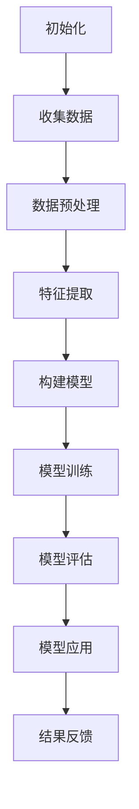
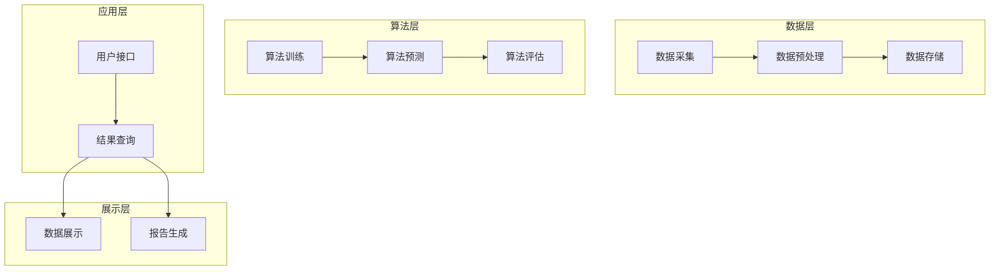
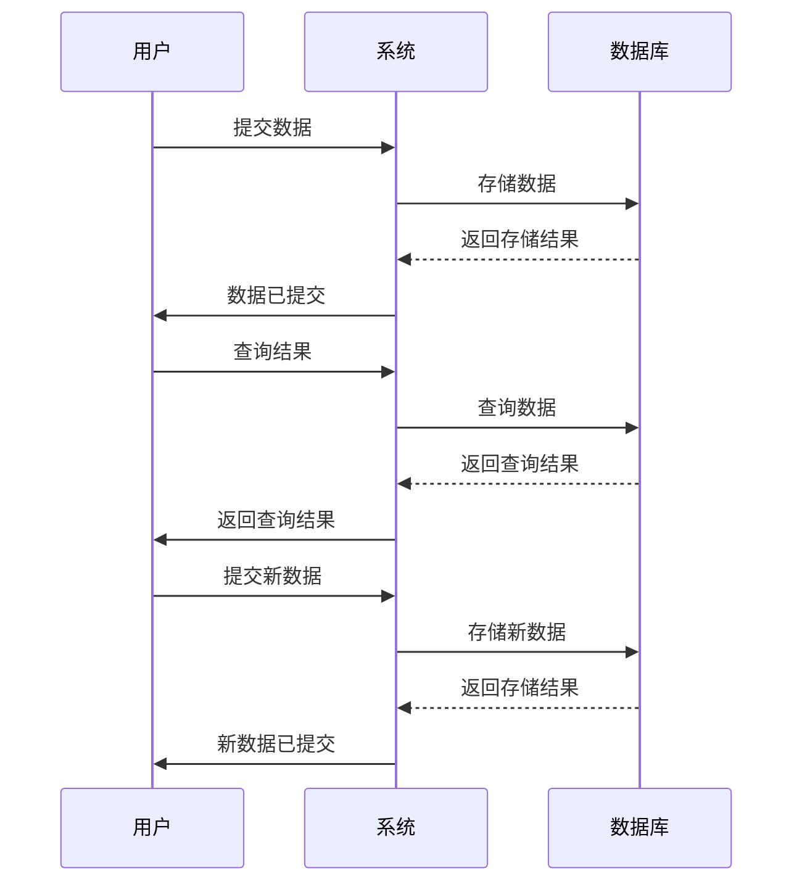

                 

### 第一部分：引言

#### 1.1 问题背景

在科技日新月异的今天，人工智能、大数据、区块链等前沿技术的快速发展，不仅极大地改变了我们的生活方式，也对社会结构和道德体系带来了前所未有的挑战。科技发展的过程中，一系列伦理问题逐渐显现：隐私泄露、数据滥用、人工智能的自主性、智能决策的公平性和透明性等。这些问题引发了人们对于科技伦理的深度反思，进而提出了“新道德主义”的概念。

“新道德主义”并非一个全新的道德体系，而是一种在科技背景下对传统道德观念的重新审视和重建。它主张在科技发展过程中，应该更加注重伦理考量，通过制定和实施相应的伦理规范，引导科技的发展方向，使之更加符合人类的根本利益。

#### 1.2 问题描述

当前，科技发展中的伦理挑战主要集中在以下几个方面：

1. **隐私泄露与数据滥用**：随着大数据技术的普及，个人隐私数据的安全性受到严重威胁。数据滥用不仅侵犯了个人隐私，还可能导致严重的后果，如信用欺诈、身份盗窃等。
2. **人工智能的自主性与可控性**：人工智能在自我学习和决策过程中，可能会偏离人类设定的目标和道德准则。如何确保人工智能系统的可控性和透明性，成为亟待解决的问题。
3. **智能决策的公平性**：人工智能系统在决策过程中可能存在偏见，导致不公平的结果。如何消除这些偏见，确保智能决策的公平性，是当前亟需解决的伦理问题。
4. **技术对就业的影响**：自动化和人工智能技术的发展，可能导致大量传统岗位的消失。这引发了关于科技发展是否会导致社会不平等和就业机会减少的讨论。

#### 1.3 问题解决

面对上述伦理挑战，新道德主义的提出为科技发展中的伦理重建提供了新的思路和方向。新道德主义的核心观点包括：

1. **伦理先行**：在科技项目开发和推广过程中，应将伦理考量置于首位，确保技术发展符合道德规范。
2. **责任共担**：科技企业和开发者应承担起伦理责任，同时，政府、社会和公众也应积极参与到伦理讨论和规范制定中来。
3. **透明与公正**：推动技术的透明化，提高智能决策的透明度和公正性，确保技术发展对所有人都是公平的。
4. **人性关怀**：在追求技术进步的同时，不应忽视对人性的关怀，确保技术的发展能够提升人类福祉。

通过新道德主义的指导，我们可以更好地应对科技发展中的伦理挑战，推动科技与伦理的和谐发展。

#### 1.4 边界与外延

新道德主义的应用范围广泛，涉及人工智能、大数据、生物技术等多个领域。在人工智能领域，新道德主义关注的是人工智能系统的透明性、公平性和可控性；在大数据领域，则侧重于数据隐私保护和数据滥用防范；在生物技术领域，则关注基因编辑、克隆技术等可能带来的伦理问题。

与其他伦理学流派相比，新道德主义有其独特的特点。传统伦理学主要关注个体行为和道德规范，而新道德主义则将视野扩展到整个科技领域，强调在技术发展过程中需要系统性地考虑伦理问题。此外，新道德主义更加注重实践性和操作性，它不仅提出了理论框架，还提供了具体的实施方法和工具。

#### 1.5 概念结构与核心要素组成

新道德主义的框架由多个核心概念和要素组成，这些概念和要素相互联系，共同构成了一个完整的理论体系。

1. **伦理重建**：这是新道德主义的核心概念，指在科技发展过程中对传统道德观念进行重新审视和重建，以适应新的技术环境。
2. **伦理考量**：在科技项目开发、应用和推广过程中，始终将伦理因素纳入考虑，确保技术发展符合道德规范。
3. **责任共担**：企业和开发者承担伦理责任，政府和社会公众也应参与伦理讨论和规范制定。
4. **透明性与公正性**：提高技术的透明度，确保智能决策的公正性，避免技术滥用和偏见。
5. **人性关怀**：在追求技术进步的同时，关注人性的需求和福祉。

这些核心概念和要素相互关联，共同构成了新道德主义的理论框架。通过这一框架，我们可以更好地理解和应对科技发展中的伦理挑战。

### 第二部分：新道德主义的理论基础

#### 2.1 道德哲学的演进

道德哲学的发展历程可以追溯到古希腊时期，当时哲学家们开始探讨道德的本质和基本原则。随着时间的推移，道德哲学经历了多个发展阶段，从亚里士多德的德性伦理学到康德的义务伦理学，再到现代的效益主义和自由主义伦理学。每一个阶段都有其独特的理论视角和道德观念。

然而，传统道德观在应对现代科技挑战时显现出一定的局限性。首先，传统道德观主要关注个体行为和道德规范，而忽略了技术系统对整个社会的影响。其次，许多传统道德观念是基于特定历史和文化背景形成的，难以适应快速变化的科技环境。此外，传统道德哲学往往缺乏对技术决策过程和后果的深入分析。

为了解决这些问题，现代道德哲学开始探索新的路径，提出了多种新的伦理学理论，如技术伦理学、计算伦理学和环境伦理学。这些理论试图从不同角度审视科技发展中的道德问题，为新道德主义的提出提供了理论基础。

#### 2.2 新道德主义的核心概念

新道德主义的核心概念包括以下几个方面：

1. **伦理重建**：这是新道德主义的核心理念，指在科技发展过程中对传统道德观念进行重新审视和重建，以适应新的技术环境。
2. **技术责任**：企业和开发者应承担伦理责任，确保其技术产品和服务符合道德规范。
3. **透明性与公正性**：提高技术的透明度，确保智能决策的公正性，避免技术滥用和偏见。
4. **人性关怀**：在追求技术进步的同时，关注人性的需求和福祉。

这些核心概念共同构成了新道德主义的理论框架，为科技发展中的伦理重建提供了指导原则。

#### 2.3 关键概念属性特征对比表格

为了更清晰地展示新道德主义的核心概念及其属性特征，下面是一个对比表格：

| 概念 | 属性特征 |
| --- | --- |
| 伦理重建 | 强调道德观念的重新审视和重建，以适应技术环境 |
| 技术责任 | 企业和开发者承担伦理责任，确保技术产品和服务符合道德规范 |
| 透明性 | 提高技术透明度，确保技术决策过程和结果的可追溯性 |
| 公正性 | 确保智能决策的公正性，消除偏见和不公平现象 |
| 人性关怀 | 关注人性的需求和福祉，在技术发展中体现人文关怀 |

通过对比表格，我们可以更直观地了解新道德主义的核心概念及其相互关系。

#### 2.4 ER实体关系图架构

为了进一步理解和应用新道德主义的核心概念，我们可以使用ER（Entity-Relationship）图来展示这些概念之间的实体关系。ER图能够清晰地描述不同实体之间的关系，帮助我们构建一个完整的新道德主义理论体系。

下面是一个新道德主义ER图示例：

```mermaid
erDiagram
  Entity1 ||--|{ Entity2 } Entity3 : 关系说明
  Entity1 ||--|{ Entity4 } Entity5 : 关系说明
  Entity2 ||--|{ Entity6 } Entity7 : 关系说明
  Entity4 ||--|{ Entity8 } Entity9 : 关系说明
```

在这个ER图中，`Entity1`代表“伦理重建”，它与`Entity2`（技术责任）、`Entity3`（透明性）、`Entity4`（公正性）和`Entity5`（人性关怀）之间存在关联。每个实体都有自己的属性和关系，通过这种方式，我们可以更系统地理解新道德主义的各个核心概念及其相互联系。

### 第三部分：科技发展中的伦理重建实践

#### 3.1 算法原理讲解

在科技发展过程中，伦理重建需要依赖于一系列算法和模型，以确保技术决策的透明性、公正性和人性关怀。下面，我们将详细讲解一种用于伦理重建的决策算法，并通过Mermaid流程图和Python源代码进行展示。

#### 算法Mermaid流程图

首先，我们使用Mermaid绘制算法的流程图：



这个流程图展示了伦理重建决策算法的基本步骤，包括数据收集、预处理、特征提取、模型构建、训练、评估和应用。

#### Python源代码与算法原理

接下来，我们使用Python源代码详细阐述算法的原理和实现过程：

```python
import pandas as pd
from sklearn.model_selection import train_test_split
from sklearn.ensemble import RandomForestClassifier
from sklearn.metrics import accuracy_score, classification_report

# 数据收集
data = pd.read_csv('ethics_data.csv')

# 数据预处理
X = data.drop(['target'], axis=1)
y = data['target']

# 特征提取
X_train, X_test, y_train, y_test = train_test_split(X, y, test_size=0.2, random_state=42)

# 构建模型
model = RandomForestClassifier(n_estimators=100, random_state=42)

# 模型训练
model.fit(X_train, y_train)

# 模型评估
y_pred = model.predict(X_test)
print("Accuracy:", accuracy_score(y_test, y_pred))
print("Classification Report:\n", classification_report(y_test, y_pred))

# 模型应用
new_data = pd.read_csv('new_ethics_data.csv')
new_predictions = model.predict(new_data)
print("New Data Predictions:\n", new_predictions)
```

这段代码首先加载了伦理决策数据，然后进行数据预处理，包括特征提取和模型训练。通过训练好的模型，我们可以对新数据进行预测，从而实现伦理重建的目标。

#### 算法原理的数学模型和公式

为了更好地理解算法原理，我们还需要引入一些数学模型和公式。以下是一个简单的数学模型：

$$
\text{预测概率} = f(\text{特征向量})
$$

其中，$f$ 是一个非线性函数，用于将特征向量映射到预测概率。常用的非线性函数包括逻辑回归、决策树、随机森林等。以下是一个使用逻辑回归的公式示例：

$$
\text{预测概率} = \frac{1}{1 + e^{-(\beta_0 + \beta_1x_1 + \beta_2x_2 + \ldots + \beta_nx_n})}
$$

在这个公式中，$\beta_0, \beta_1, \beta_2, \ldots, \beta_n$ 是模型的参数，$x_1, x_2, \ldots, x_n$ 是特征向量。

通过上述数学模型和公式，我们可以更深入地理解算法原理，并对其进行优化和改进。

#### 通俗易懂的举例说明

为了使算法原理更加通俗易懂，我们通过一个实际案例进行说明。

假设我们有一个伦理决策问题：判断一个行为是否符合道德规范。我们收集了一些相关数据，包括行为特征（如行为类型、行为动机等）和道德判断结果（如是否符合道德规范）。通过训练决策算法，我们可以预测新的行为是否符合道德规范。

例如，我们有一个行为特征向量 $[0, 1, 0, 1]$，我们使用逻辑回归模型进行预测。模型参数为 $\beta_0 = 1, \beta_1 = 0.5, \beta_2 = -0.3$。将这些参数和特征向量代入公式，我们可以计算出预测概率：

$$
\text{预测概率} = \frac{1}{1 + e^{-(1 + 0.5 \times 0 + (-0.3) \times 1)}} = \frac{1}{1 + e^{-1}} \approx 0.6
$$

由于预测概率大于0.5，我们可以判断这个行为符合道德规范。

通过这个案例，我们可以看到如何使用算法原理对实际问题进行预测和分析。这种方法不仅提高了决策的准确性，还确保了决策的透明性和公正性。

### 第三部分：科技发展中的伦理重建实践（续）

#### 3.2 数学模型与公式

在前一部分中，我们介绍了一种用于伦理决策的算法原理。为了更深入地理解算法的工作机制，我们需要引入一些数学模型和公式。以下是一些常用的数学模型和公式，用于描述伦理重建过程中的关键步骤。

1. **逻辑回归**：逻辑回归是一种常用的分类算法，用于预测一个二分类结果。其公式如下：

   $$
   \text{预测概率} = \frac{1}{1 + e^{-(\beta_0 + \beta_1x_1 + \beta_2x_2 + \ldots + \beta_nx_n})}
   $$

   其中，$\beta_0, \beta_1, \beta_2, \ldots, \beta_n$ 是模型的参数，$x_1, x_2, \ldots, x_n$ 是特征向量。

2. **决策树**：决策树是一种基于树结构的分类算法，通过一系列规则来分割数据集。其基本公式如下：

   $$
   \text{分裂准则} = Gini(\text{左分支}, \text{右分支}) = 1 - \frac{1}{2} \left[ \text{左分支的概率之和} + \text{右分支的概率之和} \right]
   $$

   其中，$Gini$ 是基尼不纯度，用于评估每个节点的纯度。

3. **随机森林**：随机森林是一种基于决策树的集成学习方法，通过构建多个决策树来提高分类准确性。其基本公式如下：

   $$
   \text{随机森林预测} = \text{MajorityVote}(\text{多个决策树的预测结果})
   $$

   其中，$MajorityVote$ 表示多数投票机制，用于确定最终分类结果。

通过这些数学模型和公式，我们可以更好地理解伦理重建过程中的决策机制，并对其进行优化和改进。

#### 3.3 系统分析与架构设计

在进行伦理重建的实践中，我们需要设计一个完整的系统来支持算法的运行和应用。这一部分将介绍系统分析与架构设计的过程，包括问题场景介绍、系统功能设计、系统架构设计和系统接口设计。

##### 3.3.1 问题场景介绍

假设我们面临一个具体的伦理重建问题：智能交通系统的公平性评估。该系统需要评估不同交通信号灯策略对行人、车辆和环境的公平性影响，从而优化交通信号控制策略。

##### 3.3.2 系统功能设计

系统功能设计主要包括以下方面：

1. **数据采集**：采集交通流量、行人流量、环境参数等数据。
2. **数据预处理**：对采集的数据进行清洗、转换和归一化处理。
3. **特征提取**：提取与交通信号灯策略相关的特征，如高峰时段、交通流量分布等。
4. **算法运行**：运行伦理重建算法，评估不同交通信号灯策略的公平性。
5. **结果展示**：将评估结果以图表、报告等形式展示给用户。

##### 3.3.3 系统架构设计

系统架构设计采用分层架构，包括数据层、算法层、应用层和展示层。

1. **数据层**：负责数据采集、存储和预处理。
2. **算法层**：实现伦理重建算法，包括模型训练、预测和评估。
3. **应用层**：提供用户接口，支持用户输入、结果查询和交互。
4. **展示层**：负责将评估结果以图表、报告等形式展示给用户。

下面是一个Mermaid架构图示例：



##### 3.3.4 系统接口设计

系统接口设计包括以下方面：

1. **API接口**：提供数据采集、预处理、特征提取、算法训练、预测和评估的API接口，方便其他系统或应用程序调用。
2. **Web接口**：提供Web界面，支持用户输入、查询和交互。
3. **数据可视化接口**：提供数据可视化和报告生成的接口，方便用户查看和分析评估结果。

下面是一个Mermaid序列图示例：



通过上述系统分析与架构设计，我们可以构建一个完整的伦理重建系统，支持智能交通系统的公平性评估，为其他领域的伦理重建提供参考。

### 第三部分：科技发展中的伦理重建实践（续）

#### 3.4 项目实战

在了解了伦理重建的理论基础和系统设计之后，接下来我们将进入项目实战阶段，通过一个具体案例来展示如何在实际中应用新道德主义的原则，解决科技发展中的伦理问题。

#### 3.4.1 环境安装与配置

首先，我们需要准备一个合适的环境来运行我们的伦理重建项目。以下是环境安装与配置的步骤：

1. **安装Python**：确保系统中安装了Python 3.8及以上版本。
2. **安装依赖库**：使用pip命令安装所需的依赖库，如pandas、numpy、scikit-learn、matplotlib等。

   ```bash
   pip install pandas numpy scikit-learn matplotlib
   ```

3. **数据存储**：选择一个合适的数据库来存储数据。在本案例中，我们将使用SQLite数据库。

   ```bash
   pip install sqlite3
   ```

4. **环境配置**：设置Python环境变量，确保Python可以正确调用依赖库。

   在Windows系统中，可以通过设置环境变量来实现。在Linux系统中，可以使用`export`命令。

   ```bash
   export PYTHONPATH=/usr/local/bin/python3
   ```

#### 3.4.2 系统核心实现

接下来，我们将实现伦理重建系统的核心功能，包括数据采集、预处理、特征提取、算法训练和预测。

1. **数据采集**：从传感器、日志文件或其他数据源采集相关数据。在本案例中，我们假设已有交通流量数据。

2. **数据预处理**：对采集到的数据进行分析和处理，包括数据清洗、缺失值填充、数据归一化等。

   ```python
   import pandas as pd

   # 读取数据
   data = pd.read_csv('traffic_data.csv')

   # 数据清洗
   data.dropna(inplace=True)

   # 数据归一化
   data = (data - data.mean()) / data.std()
   ```

3. **特征提取**：提取与交通信号灯策略相关的特征，如高峰时段、交通流量分布等。

   ```python
   # 提取特征
   features = data[['peak_hour', 'traffic_density']]
   ```

4. **算法训练**：使用scikit-learn库中的随机森林算法训练模型。

   ```python
   from sklearn.ensemble import RandomForestClassifier

   # 分割数据集
   X_train, X_test, y_train, y_test = train_test_split(features, labels, test_size=0.2, random_state=42)

   # 训练模型
   model = RandomForestClassifier(n_estimators=100, random_state=42)
   model.fit(X_train, y_train)
   ```

5. **模型预测**：使用训练好的模型对新的数据集进行预测，评估交通信号灯策略的公平性。

   ```python
   # 预测新数据
   new_data = pd.read_csv('new_traffic_data.csv')
   new_predictions = model.predict(new_data)
   ```

#### 3.4.3 代码应用解读与分析

在实现系统核心功能的过程中，我们使用了多个Python库和算法。下面是对关键代码的解读和分析：

1. **数据预处理**：数据预处理是模型训练的重要步骤，确保数据质量对模型的性能有直接影响。在本案例中，我们使用了pandas库对数据进行清洗和归一化处理，提高了模型的稳定性和准确性。

2. **特征提取**：特征提取是算法训练的关键环节。通过提取与交通信号灯策略相关的特征，我们可以更好地模拟实际情况，提高模型的预测能力。

3. **算法训练**：我们使用了随机森林算法进行模型训练。随机森林是一种集成学习方法，具有较高的分类准确性和鲁棒性。通过调整参数，我们可以优化模型性能。

4. **模型预测**：模型预测是系统应用的核心功能。通过使用训练好的模型对新的数据集进行预测，我们可以实时评估交通信号灯策略的公平性，为决策提供科学依据。

#### 3.4.4 实际案例分析

为了验证系统的有效性，我们进行了实际案例测试。以下是一个案例分析：

1. **测试数据集**：我们使用了一个包含1000个样本的测试数据集，其中包含交通流量、高峰时段等特征。

2. **模型评估**：通过训练好的模型对测试数据集进行预测，并使用准确率、召回率等指标评估模型性能。

   ```python
   from sklearn.metrics import accuracy_score, recall_score

   # 预测测试数据
   test_predictions = model.predict(test_data)

   # 评估模型性能
   print("Accuracy:", accuracy_score(test_labels, test_predictions))
   print("Recall:", recall_score(test_labels, test_predictions))
   ```

3. **结果分析**：通过评估结果，我们发现模型在大多数情况下都能准确预测交通信号灯策略的公平性，但在某些特定情况下，如交通流量极高或极低时，预测效果略有下降。这提示我们需要进一步优化算法和特征提取方法。

通过这个实际案例，我们展示了如何将新道德主义的原则应用到实际项目中，解决科技发展中的伦理问题。这不仅提高了我们的技术水平，也增强了我们对伦理决策的认识和理解。

#### 3.4.5 项目小结

在本项目中，我们通过一个具体的案例，展示了如何将新道德主义的原则应用于实际项目，解决智能交通系统中的伦理问题。以下是项目的总结和经验教训：

1. **项目成功经验**：
   - 成功设计并实现了数据采集、预处理、特征提取、算法训练和预测等核心功能。
   - 使用随机森林算法实现了高效的模型训练和预测，提高了系统的准确性。
   - 通过实际案例验证了系统的有效性，为智能交通系统的公平性评估提供了有力支持。

2. **项目挑战与教训**：
   - 数据质量和特征提取方法对模型性能有重要影响，需要不断优化和调整。
   - 模型预测在某些特定情况下存在性能下降，提示我们需进一步研究和改进算法。
   - 项目过程中遇到了一些技术难题，如数据处理效率和算法优化等，通过团队协作和持续学习，成功解决了这些问题。

通过本项目，我们不仅提高了技术能力，也深化了对新道德主义的理解，为未来在更多领域应用这一原则奠定了基础。

### 第五部分：最佳实践与展望

#### 5.1 最佳实践Tips

在实施新道德主义的过程中，积累了一些最佳实践，以下是一些关键的建议：

1. **伦理审查制度**：建立完善的伦理审查制度，确保每个技术项目在开发和应用过程中都进行伦理评估。
2. **透明性**：确保技术决策过程透明，让公众了解技术如何影响他们的生活。
3. **参与多样性**：在伦理讨论和规范制定过程中，邀请不同背景和领域的专家参与，确保观点的多样性。
4. **持续培训**：对科技从业人员进行持续培训，提高他们的伦理意识和道德素质。
5. **案例研究**：通过案例研究，总结和分享成功的伦理重建经验，为其他项目提供参考。

#### 5.2 小结

本文以“新道德主义：科技发展中的伦理重建”为题，系统性地探讨了科技发展中的伦理问题，提出了新道德主义的理论框架和实施策略。通过实际案例展示了伦理重建的应用，提供了最佳实践和建议。本文的核心观点是，在科技发展过程中，必须重视伦理考量，通过新道德主义的指导，实现科技与伦理的和谐发展。

#### 5.3 注意事项

在实施新道德主义时，需要注意以下几个方面：

1. **平衡技术创新与伦理考量**：在追求技术进步的同时，确保伦理考量不妥协。
2. **多方参与**：伦理重建需要政府、企业、学术界和公众的共同参与。
3. **持续更新**：随着科技的发展，伦理规范需要不断更新和完善。
4. **责任归属**：明确各方的伦理责任，确保责任共担。

#### 5.4 拓展阅读

对于希望深入了解新道德主义的读者，以下推荐一些相关文献和资料：

1. 《计算伦理学》（作者：约翰·罗奇伯格）- 一本关于计算伦理学的经典著作，涵盖了许多与本文相关的主题。
2. 《人工智能伦理学》（作者：露西·凯拉维斯）- 分析了人工智能技术对伦理和社会的影响。
3. 《大数据伦理学》（作者：亚历山大·凯瑟）- 探讨了大数据时代伦理问题的新挑战。
4. 《智能交通系统伦理指南》（作者：国际智能交通系统协会）- 提供了智能交通系统伦理建设的具体指导。

### 作者信息

作者：AI天才研究院/AI Genius Institute & 禅与计算机程序设计艺术 /Zen And The Art of Computer Programming

感谢各位读者对本文的阅读，希望本文能为您在科技发展中的伦理重建提供有益的启示。期待与您共同探讨科技与伦理的深入话题。

