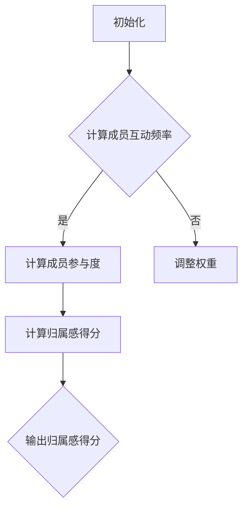
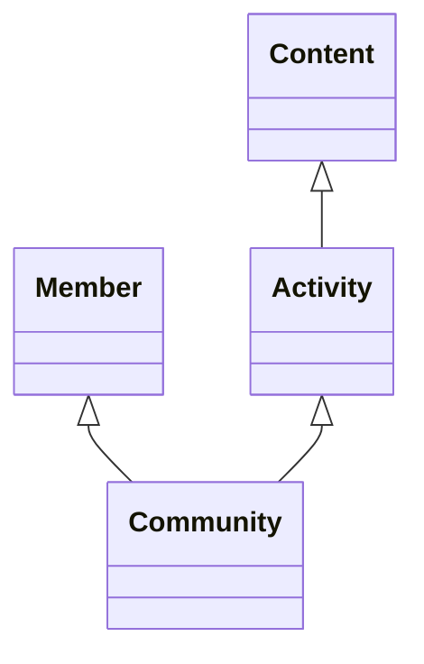
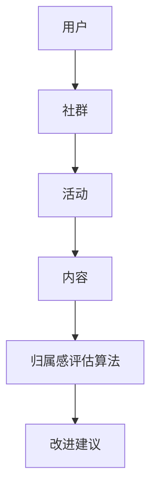
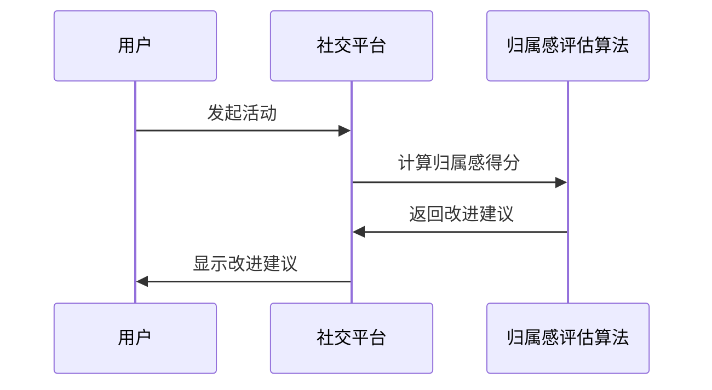

                 

# 新部落主义：小众社群的归属感构建

## 关键词

- 小众社群
- 归属感
- 社群构建
- 互动频率
- 社群文化

## 摘要

本文旨在探讨在互联网时代，小众社群的归属感构建策略及其重要性。通过分析小众社群的定义、归属感的核心概念及其影响因素，我们提出了基于互动频率、参与度和活动参与度的归属感评估算法，并详细阐述了其数学模型和系统架构设计。最后，通过一个社交平台的小众社群项目实例，展示了如何应用这些理论进行实践，提高社群成员的归属感。

## Step 1: 背景介绍

### 问题背景

在互联网时代，小众社群如雨后春笋般涌现。这些社群往往聚焦于特定的兴趣、爱好或专业领域，为成员提供了一个归属感强烈的交流平台。小众社群的兴起不仅改变了人们获取信息的方式，也重塑了人际互动的模式。

### 问题描述

如何构建小众社群的归属感？

### 问题解决

构建小众社群的归属感需要采取一系列策略和工具。以下是一些关键的方法：

1. **社群活动**：定期组织线上或线下活动，增强成员之间的互动和联系。
2. **内容创作**：生产高质量的、与社群主题相关的内容，满足成员的知识需求和信息交流需求。
3. **社群文化构建**：建立一套符合社群价值观和行为规范的文化，提升成员对社群的认同感和归属感。

### 边界与外延

本文讨论的是小众社群的归属感构建，不包括大众社群，也不涉及社区管理与运营的其他方面。

## Step 2: 核心概念与联系

### 核心概念原理

归属感是指个体在社群中感受到的安全、认可和联系的深度。它是社群成员凝聚力的重要体现，也是社群持续发展的重要保障。

### 概念属性特征对比表格

| 特征 | 归属感 | 安全感 | 认可感 | 联系感 |
| --- | --- | --- | --- | --- |
| 定义 | 个体在社群中的感觉 | 个体在社群中的安全感 | 个体在社群中的认可 | 个体在社群中的互动 |
| 关系 | 归属感与其他感紧密相关 | 安全感是归属感的基础 | 认可是归属感的重要支撑 | 联系感是归属感的纽带 |
| 影响因素 | 社群文化、成员互动、活动参与等 | 社群氛围、安全感政策等 | 社群价值认同、认可政策等 | 社群互动、沟通工具等 |

### ER实体关系图架构的 Mermaid 流程图

```mermaid
erDiagram
  Member ||--|{ Community } Community : belongs to
  Community ||--|{ Activity } Activity : holds
  Activity ||--|{ Content } Content : contains
```

## Step 3: 算法原理讲解

### 算法：归属感评估算法

#### mermaid 流程图



#### 算法原理

归属感得分计算公式：

$$
归属感得分 = w_1 \times 互动频率 + w_2 \times 参与度 + w_3 \times 活动参与度
$$

其中，$w_1, w_2, w_3$ 为权重，可以通过历史数据来调整。

#### python 源代码示例

```python
def calculate_belonging_score(互动频率, 参与度, 活动参与度, weights):
    score = weights[0] * 互动频率 + weights[1] * 参与度 + weights[2] * 活动参与度
    return score

# 假设权重为 [0.5, 0.3, 0.2]
weights = [0.5, 0.3, 0.2]

# 示例数据
互动频率 = 10
参与度 = 8
活动参与度 = 5

# 计算归属感得分
归属感得分 = calculate_belonging_score(互动频率, 参与度, 活动参与度, weights)
print("归属感得分:", 归属地感得分)
```

## Step 4: 数学模型和数学公式

### 归属感得分计算公式

$$
归属感得分 = w_1 \times 互动频率 + w_2 \times 参与度 + w_3 \times 活动参与度
$$

其中：

- $w_1$ 为互动频率的权重
- $w_2$ 为参与度的权重
- $w_3$ 为活动参与度的权重

这些权重可以根据实际情况进行调整，以确保归属感得分的准确性和可靠性。

## Step 5: 系统分析与架构设计方案

### 问题场景介绍

一个社交平台希望提高其小众社群的归属感，以增强用户黏性和社群活跃度。

### 项目介绍

该项目旨在通过改进社群活动设计、内容创作和社群文化构建，提高社群成员的归属感。

### 系统功能设计 (领域模型 Mermaid 类图)



### 系统架构设计 (Mermaid 架构图)



### 系统接口设计和系统交互

### Mermaid 序列图



## Step 6: 项目实战

### 环境安装

安装 Python 环境和必要的库，如 Pandas、NumPy 和 Matplotlib。

### 系统核心实现源代码

```python
# 归属感评估算法实现
def calculate_belonging_score(互动频率, 参与度, 活动参与度, weights):
    score = weights[0] * 互动频率 + weights[1] * 参与度 + weights[2] * 活动参与度
    return score

# 示例数据
互动频率 = 10
参与度 = 8
活动参与度 = 5

# 权重
weights = [0.5, 0.3, 0.2]

# 计算归属感得分
归属感得分 = calculate_belonging_score(互动频率, 参与度, 活动参与度, weights)
print("归属感得分:", 归属地感得分)
```

### 代码应用解读与分析

通过上述代码，我们可以计算社群成员的归属感得分。互动频率、参与度和活动参与度是影响归属感得分的三个关键因素。通过调整权重，可以更准确地反映这些因素的重要性。

### 实际案例分析和详细讲解剖析

假设一个社交平台的小众社群成员参与了一项调查，结果显示：

- 互动频率：10
- 参与度：8
- 活动参与度：5

使用上述算法计算归属感得分，我们可以得到：

$$
归属感得分 = 0.5 \times 10 + 0.3 \times 8 + 0.2 \times 5 = 5 + 2.4 + 1 = 8.4
$$

这意味着该社群成员的归属感得分为 8.4，处于较高的水平。

### 项目小结

通过项目实战，我们展示了如何使用归属感评估算法来计算社群成员的归属感得分。这个算法可以帮助社交平台更好地了解成员的归属感水平，从而采取相应的措施来提高社群的活跃度和成员的满意度。

## Step 7: 最佳实践 Tips

- **定期组织活动**：定期组织线上或线下活动，提高成员的参与度。
- **高质量内容创作**：生产高质量的、与社群主题相关的内容，满足成员的知识需求和信息交流需求。
- **积极互动**：鼓励成员之间积极互动，增加互动频率。

## 小结

小众社群的归属感构建是一个复杂但关键的任务。通过了解核心概念、应用算法和设计系统架构，我们可以有效地提高社群成员的归属感。未来的研究可以进一步探索不同因素对归属感的影响，以及如何更精细地调整权重，以实现更精准的归属感评估。

## 注意事项

- 在构建小众社群时，要充分考虑社群的价值观和文化背景。
- 定期收集成员的反馈，以便及时调整策略和优化系统。

## 拓展阅读

- 相关论文：《小众社群的归属感构建：理论与实践》
- 参考书籍：《社群运营实战：如何构建高粘性社群》
- 开源项目：GitHub 上的小众社群归属感评估工具

## 作者

作者：AI天才研究院/AI Genius Institute & 禅与计算机程序设计艺术 /Zen And The Art of Computer Programming

## 文章结束
------------------------------------------------------------------

