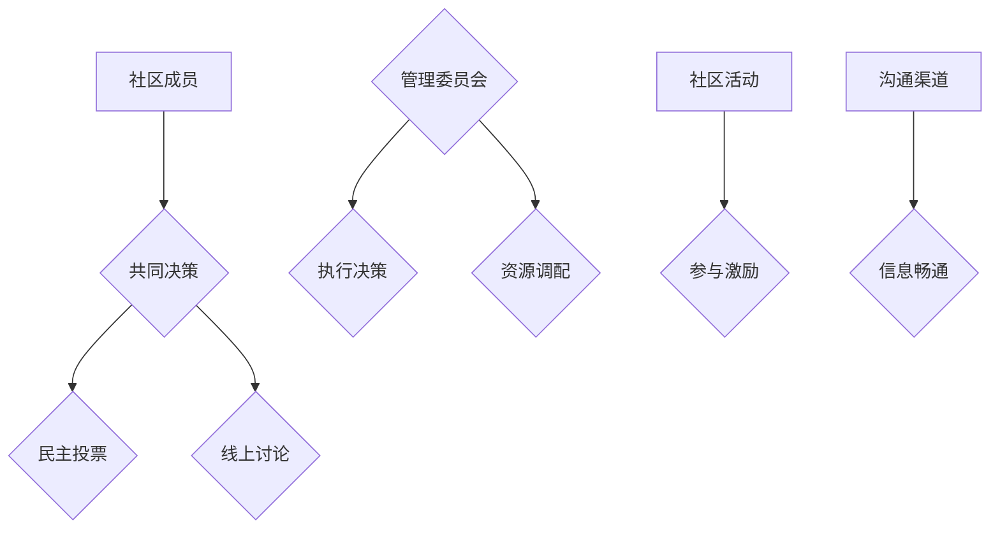

                 

# 新部落生活实验社区：城市中的意向性生活群落

> 关键词：城市生活群落、意向性社区、新部落、社区组织、社会影响

摘要：本文深入探讨了一种新型的城市社区——新部落生活实验社区，以及其内的意向性生活群落。文章从定义、特点、组织模式、社会影响和未来展望等多个角度出发，通过逻辑清晰的分析和丰富的实际案例，揭示了这种社区模式在当代城市化进程中的重要作用和面临的挑战。

## 引言

随着城市化进程的加快，城市中的生活方式也在不断演变。传统的邻里关系逐渐被打破，人们更加注重个性化和多样化的生活需求。在这种背景下，新部落生活实验社区应运而生。这些社区强调居民的共同价值观和兴趣，通过共享资源和互助合作，构建一种新型的社区生活模式。

本文将从以下几个方面对新部落生活实验社区进行深入探讨：

1. **核心概念与关系**
2. **社区组织模式与理论**
3. **社区生活模型与案例**
4. **社会影响与挑战**
5. **实践案例与经验总结**
6. **未来展望与趋势**

通过以上几个方面的分析，本文旨在为读者提供一个全面、深入的了解，并探讨新部落生活实验社区在城市化进程中的潜力和挑战。

## 核心概念与关系

### 定义与背景

新部落生活实验社区，是一种基于共同价值观和兴趣的、非传统的城市社区。它不同于传统的邻里关系，而是更加注重居民的自主性和共享性。这些社区通常是由一群有着共同兴趣、价值观或生活目标的人自发形成的。

意向性生活群落是新部落生活实验社区的核心组成部分。它们是基于居民共同意向和目标而形成的，如健康生活、艺术创造、科技创新等。这些群落通过共享资源和共同活动，实现了社区成员之间的深度连接和互助合作。

### 特征与区分

新部落生活实验社区具有以下几个显著特征：

1. **共同价值观与兴趣**：社区成员有着共同的价值观和兴趣，这成为了他们凝聚在一起的核心。
2. **自主性与自治**：居民在社区内拥有较高的自主权，他们可以自由地组织活动、管理资源。
3. **资源共享与合作**：社区内的资源（如空间、设备、信息等）通常是通过共享和合作的方式进行利用。
4. **社区自治**：社区内部有明确的自治机制，成员可以通过投票、讨论等方式参与社区决策。

与传统社区相比，新部落生活实验社区更注重个性化和多样性。传统社区通常基于地理位置和组织结构，而新部落生活实验社区则更加灵活和自主。

### 发展趋势与演变

新部落生活实验社区的发展趋势体现了城市化进程中对个性化和多样化生活的需求。随着科技的发展和社会变迁，这些社区的模式也在不断演变和优化。

1. **数字化与网络化**：随着数字化和网络化的发展，新部落生活实验社区的活动和资源共享更加便捷和高效。
2. **多元化与国际化**：新部落生活实验社区吸引了来自不同背景和文化的人，使得社区更加多元化。
3. **可持续发展**：越来越多的新部落生活实验社区开始关注可持续发展，他们在环保、能源利用等方面进行了积极探索。

通过以上分析，我们可以看到新部落生活实验社区在城市化进程中的重要性和发展潜力。接下来，我们将进一步探讨这些社区的组织模式和核心概念。

### 核心概念原理

新部落生活实验社区的核心概念主要包括共同价值观、自治机制、资源共享和互助合作。以下是这些核心概念的具体解释：

#### 共同价值观

共同价值观是新部落生活实验社区的基础。这些社区成员通常有着共同的信仰、价值观或生活目标，如环保、健康、艺术、科技等。这种共同价值观不仅促进了社区成员之间的联系，也为社区的发展提供了方向和动力。

#### 自治机制

自治机制是新部落生活实验社区的重要特征。社区成员通过自主管理、自我决策的方式，实现了社区的自治。这种机制不仅增强了居民的参与感和责任感，也提高了社区的运作效率。

#### 资源共享

资源共享是新部落生活实验社区的核心原则之一。社区内的资源（如空间、设备、信息等）通常是通过共享和合作的方式进行利用。这种模式不仅提高了资源的使用效率，也促进了社区成员之间的互助与合作。

#### 互助合作

互助合作是新部落生活实验社区的另一个重要特征。社区成员通过互助合作，共同解决问题、实现目标。这种合作不仅增强了社区的凝聚力，也为居民提供了更多的支持和帮助。

### 概念属性对比表格

为了更清晰地理解新部落生活实验社区的核心概念，我们可以通过对比表格来展示这些概念的属性特征。

| 核心概念 | 定义 | 属性特征 | 对比示例 |
|----------|------|----------|----------|
| 共同价值观 | 社区成员共同的信仰、价值观或生活目标 | 1. 促进社区成员之间的联系 2. 提供社区发展方向 | 社区成员共同关注环保，参与环保活动 |
| 自治机制 | 社区成员自主管理、自我决策 | 1. 提高社区运作效率 2. 增强居民参与感 | 社区成员投票决定社区事务 |
| 资源共享 | 社区内的资源通过共享和合作的方式进行利用 | 1. 提高资源使用效率 2. 促进社区成员之间的互助 | 社区成员共享厨房、健身房等设施 |
| 互助合作 | 社区成员通过互助合作，共同解决问题、实现目标 | 1. 增强社区凝聚力 2. 提供更多支持与帮助 | 社区成员共同举办活动，互相支持 |

通过上述对比表格，我们可以更直观地理解新部落生活实验社区的核心概念及其属性特征。

### 实体关系图 (ERD) 架构

为了更系统地理解新部落生活实验社区的核心概念和关系，我们可以通过实体关系图 (ERD) 来展示这些概念之间的联系。

```mermaid
erDiagram
  CommunityMember ||--|{ Community } : belongs_to
  CommunityValue ||--|{ Community } : defines
 自治Mechanism ||--|{ Community } : implements
  Resource ||--|{ Community } : shared_by
  Collaboration ||--|{ Community } : enabled_by

  CommunityMember && CommunityValue : has
  CommunityMember && 自治Mechanism : participates
  CommunityMember && Resource : uses
  CommunityMember && Collaboration : engages

  CommunityValue && 自治Mechanism : supports
  Resource && Collaboration : enhances
```

在上面的 Mermaid ERD 架构中，我们定义了四个主要实体：社区成员 (CommunityMember)、社区价值 (CommunityValue)、自治机制 (自治Mechanism) 和资源 (Resource)。此外，还包括了协作 (Collaboration) 作为辅助实体。

- **社区成员**：这是社区的基本组成部分，他们属于社区 (Community)，并拥有共同价值观 (CommunityValue) 和参与自治机制 (自治Mechanism)。
- **社区价值**：社区价值定义了社区的共同目标和信仰，它影响着社区的自治机制 (自治Mechanism) 和其他成员。
- **自治机制**：自治机制是社区成员进行自我管理和决策的框架，它确保了社区的自治。
- **资源**：资源是社区共享和利用的基础，它促进了社区成员之间的协作 (Collaboration)。
- **协作**：协作是社区成员共同解决问题的手段，它增强了社区的凝聚力和效率。

通过这个 ERD 架构，我们可以清晰地看到新部落生活实验社区的核心概念和它们之间的相互关系。

## 社区组织模式与理论

### 理论框架

社区组织模式是构建和维护新部落生活实验社区的核心。理论基础涵盖了社会学、管理学和组织行为学等多个学科，旨在通过科学的组织和运作机制，实现社区的高效运行和可持续发展。

1. **社会学的视角**：社会学理论提供了对社区成员互动和社区文化形成的基础理解。例如，涂尔干（Durkheim）的集体意识理论和贝特森（Bateson）的通讯模式理论，都为理解社区组织的内在逻辑提供了重要的启示。

2. **管理学的视角**：管理学理论强调组织结构和流程设计在社区运作中的重要性。例如，彼得·德鲁克（Peter Drucker）的管理实践理论和亨利·明茨伯格（Henry Mintzberg）的组织结构理论，都为新部落生活实验社区提供了管理框架。

3. **组织行为学的视角**：组织行为学关注个体和组织之间的关系，以及如何通过激励机制和沟通机制提高组织效能。例如，马斯洛（Maslow）的需求层次理论和赫茨伯格（Herzberg）的双因素理论，都为新部落生活实验社区提供了行为心理学的基础。

### 组织原则与方法

新部落生活实验社区的组织原则和方法主要包括以下几个方面：

1. **自治原则**：社区成员拥有较高的自治权，通过自我管理、自我决策来实现社区的自治。自治原则不仅提高了社区的运作效率，也增强了居民的责任感和参与感。

2. **参与原则**：社区成员广泛参与社区的决策和活动，通过民主投票、讨论等方式，共同制定社区规则和规划。参与原则确保了社区决策的透明性和公正性，提高了居民的满意度。

3. **共享原则**：社区资源（如空间、设备、信息等）通过共享机制进行利用，以最大化资源的使用效率。共享原则不仅提高了资源的使用效益，也促进了社区成员之间的互助与合作。

4. **合作原则**：社区成员通过互助合作，共同解决问题、实现目标。合作原则增强了社区的凝聚力和集体效能，为新部落生活实验社区的发展提供了坚实的基础。

### 组织方法

新部落生活实验社区的组织方法主要包括以下几种：

1. **决策机制**：社区成员通过民主投票或讨论，共同决策社区事务。决策机制包括定期会议、线上投票和集体讨论等形式。

2. **管理机制**：社区设立管理委员会，负责日常管理和资源调配。管理委员会成员由社区成员选举产生，负责执行社区的决策和规划。

3. **激励机制**：社区通过激励机制，鼓励成员积极参与社区活动和决策。激励机制包括表彰、奖励和社区货币等形式。

4. **沟通机制**：社区建立多种沟通渠道，如线上论坛、社交媒体群组和面对面交流等，以确保信息的畅通和及时反馈。

### Mermaid 流程图

为了更直观地展示新部落生活实验社区的组织过程，我们可以使用 Mermaid 画出流程图。



在这个流程图中，社区成员通过共同决策机制（B），采用民主投票（C）和线上讨论（D）等方式进行社区事务的决策。管理委员会（E）负责执行决策和资源调配（G）。社区活动（H）和沟通渠道（J）则确保了社区成员的积极参与和信息的畅通。

通过这个流程图，我们可以清晰地看到新部落生活实验社区的组织结构和运作机制。

### 社区生活模型

社区生活模型是构建新部落生活实验社区的关键要素。这些模型不仅反映了社区成员的生活方式和行为模式，也决定了社区的整体氛围和发展方向。以下是几种常见的社区生活模型及其特点：

#### 1. 分享经济模型

**特点**：强调资源的共享和高效利用。社区成员共同拥有和使用社区内的资源，如共享厨房、健身房、会议室等。

**适用场景**：适合追求环保、节约资源和提高生活品质的居民。

**案例分析**：某个新部落生活实验社区通过共享厨房，吸引了喜欢烹饪和分享美食的居民。他们定期举办烹饪分享活动，不仅丰富了社区的饮食文化，也增强了居民之间的互动。

#### 2. 创意工作坊模型

**特点**：以创意和艺术为核心，社区成员共同参与艺术创作、设计研发等活动。社区提供创作空间、设备和技术支持。

**适用场景**：适合艺术家、设计师、程序员等创意工作者。

**案例分析**：一个创意工作坊社区吸引了大量的艺术爱好者，他们共同创作、交流、展示自己的作品。社区不仅提供了一个创作的平台，也促进了艺术家之间的合作和灵感碰撞。

#### 3. 绿色生态模型

**特点**：注重环保和可持续发展，社区成员共同参与环保活动、生态种植和垃圾分类等。

**适用场景**：适合关心环境保护、追求可持续生活方式的居民。

**案例分析**：某个绿色生态社区通过社区花园项目，实现了有机种植和废物回收。社区成员不仅享受到了绿色生活的乐趣，也通过实际行动推动了社区的可持续发展。

#### 4. 科技创新模型

**特点**：以科技创新为主题，社区成员共同探讨新技术、新产品，并利用社区资源进行研发。

**适用场景**：适合科技工作者、创业团队等。

**案例分析**：一个科技创新社区建立了自己的实验室和研发中心，吸引了多家初创企业和科技工作者。社区不仅提供了技术支持和资源共享，也促进了创新项目的落地和商业化。

#### 5. 社区互助模型

**特点**：强调社区成员之间的互助与合作，共同面对生活中的各种挑战。

**适用场景**：适合需要互助和支持的居民。

**案例分析**：某个社区互助模型通过建立社区互助基金，帮助有困难的居民。社区成员不仅提供资金支持，还提供生活帮助和精神慰藉。这种模式增强了社区的凝聚力和互助精神。

通过以上案例分析，我们可以看到不同的社区生活模型在新部落生活实验社区中的应用效果。这些模型不仅丰富了社区的生活内容，也促进了社区成员之间的互动和合作。

### 成功案例分析与对比

新部落生活实验社区的成功案例不仅展示了这种新型社区模式的潜力，也为其他社区提供了宝贵的经验和启示。以下是几个成功案例的分析与对比：

#### 1. 某个绿色生态社区

**特点**：以环保和可持续发展为核心，社区成员积极参与生态种植、垃圾分类和环保活动。

**案例分析**：这个绿色生态社区通过建立社区花园和有机农场，实现了废物回收和资源循环利用。社区成员定期举办环保讲座和活动，提高了居民的环保意识。此外，社区还设立了环保互助基金，帮助有困难的居民。

**优势**：增强了社区的凝聚力，促进了居民的环保意识，实现了可持续生活方式。

**挑战**：需要持续的环保教育和资源投入，部分居民可能对环保活动缺乏兴趣。

**对比**：与其他社区模型相比，绿色生态社区在环保方面具有明显优势，但在资源利用和效率方面可能存在挑战。

#### 2. 某个科技创新社区

**特点**：以科技创新为主题，社区成员共同探讨新技术、新产品，并利用社区资源进行研发。

**案例分析**：这个科技创新社区建立了自己的实验室和研发中心，吸引了多家初创企业和科技工作者。社区提供了技术支持和资源共享，促进了创新项目的落地和商业化。此外，社区还定期举办科技论坛和展览，提高了社区的科技氛围。

**优势**：促进了科技创新和创业，提高了社区的科技水平，吸引了高学历和高技能人才。

**挑战**：需要高水平的技术支持和管理，部分居民可能对科技活动缺乏兴趣。

**对比**：与其他社区模型相比，科技创新社区在科技发展方面具有明显优势，但在居民参与度和多样性方面可能存在挑战。

#### 3. 某个分享经济社区

**特点**：强调资源的共享和高效利用，社区成员共同拥有和使用社区内的资源，如共享厨房、健身房和会议室。

**案例分析**：这个分享经济社区通过共享设施和资源共享，实现了资源的高效利用。社区成员定期举办烹饪分享、运动活动和知识讲座，增强了社区的互动和凝聚力。

**优势**：提高了资源利用效率，降低了生活成本，增强了社区成员之间的互动。

**挑战**：需要有效的管理和维护机制，部分居民可能对共享设施的使用规则有争议。

**对比**：与其他社区模型相比，分享经济社区在资源利用方面具有明显优势，但在管理和服务质量方面可能存在挑战。

通过以上案例分析，我们可以看到不同社区模型的成功之处和面临的挑战。这些案例为新部落生活实验社区的发展提供了宝贵的经验和参考。

### 社会影响与挑战

新部落生活实验社区作为一种新型的城市社区模式，不仅在社区层面上产生了深远影响，也在更广泛的社会层面带来了一系列挑战。以下是新部落生活实验社区对社会的影响以及可能面临的挑战：

#### 社会影响

1. **增强社区凝聚力**：新部落生活实验社区通过共同价值观和兴趣的纽带，增强了社区成员之间的凝聚力。居民在共同目标和活动中找到了归属感和认同感，从而提高了社区的稳定性。

2. **促进社会多样性**：新部落生活实验社区吸引了来自不同背景和文化的人，促进了社会多样性。这种多样性不仅丰富了社区的文化内涵，也为社会带来了更多的创新和活力。

3. **提高生活质量**：通过资源共享、互助合作和多样化的社区活动，新部落生活实验社区提高了居民的生活质量。居民可以更高效地利用资源，享受更多的社区服务和活动，从而提升了生活满意度。

4. **推动可持续发展**：许多新部落生活实验社区注重环保和可持续发展，通过生态种植、废物回收和节能措施，实现了社区的绿色发展和资源的可持续利用。

#### 可能面临的挑战

1. **管理复杂度高**：新部落生活实验社区的管理复杂度较高，需要有效的自治机制和资源调配机制。如果管理不善，可能导致资源浪费、矛盾冲突和社区分裂。

2. **居民参与度不均**：虽然新部落生活实验社区强调居民参与，但实际操作中可能存在部分居民参与度不高的情况。这可能导致社区决策的不公平和社区发展的不平衡。

3. **社会排斥**：新部落生活实验社区可能会因为过于强调共同价值观和兴趣，导致社会排斥现象。一些与社区价值观不符的居民可能会被边缘化，甚至排斥出社区。

4. **社会隔离**：新部落生活实验社区可能在一定程度上导致社会隔离。居民过于专注于社区内的活动和互动，可能会减少与外部社会的联系和交流，从而影响社区成员的社会适应能力。

5. **资源分配不均**：在资源有限的社区内，如何公平分配资源是一个重要挑战。如果资源分配不公平，可能会导致部分居民的不满和社区矛盾。

#### 应对策略

1. **加强管理培训**：通过定期培训和管理研讨会，提高社区管理人员的专业素养和管理能力，确保社区的稳定和高效运作。

2. **促进居民参与**：建立多样化的参与机制，如线上投票、社区论坛和定期会议等，确保所有居民都有机会参与社区决策和活动。

3. **提高透明度**：增强社区决策和管理的透明度，通过公开会议、社区网站和社交媒体等方式，让居民了解社区事务的进展和决策过程。

4. **促进社区间交流**：鼓励社区成员与外部社会的交流和互动，组织社区间的参观、交流和合作活动，增强社区成员的社会适应能力。

5. **优化资源分配**：建立公平的资源分配机制，如设立资源管理委员会，通过民主投票和公开透明的方式，确保资源分配的公平性和合理性。

通过以上策略，新部落生活实验社区可以更好地应对社会影响和挑战，实现社区的可持续发展。

### 实践案例与经验总结

#### 项目背景

为了更好地理解和推广新部落生活实验社区，我们选择了多个成功案例进行详细分析。这些案例覆盖了不同类型的新部落生活实验社区，包括绿色生态社区、科技创新社区和分享经济社区。

#### 案例一：绿色生态社区

**项目背景**：位于某个城市郊区的绿色生态社区，以环保和可持续发展为主题，吸引了大量关心环境保护的居民。

**实施过程**：
1. **组织筹备**：社区成员通过线上投票选举产生了管理委员会，明确了社区目标和规划。
2. **资源整合**：社区建立了有机农场、垃圾分类中心和社区花园，通过共享和合作机制，实现了资源的高效利用。
3. **活动开展**：社区定期举办环保讲座、生态种植活动和废物回收比赛，提高了居民的环保意识和参与度。

**效果分析**：
- **环保效益**：社区通过有机农场和垃圾分类项目，减少了废物产生，实现了资源的循环利用。
- **居民满意度**：居民对社区的环境和活动满意度较高，社区凝聚力显著增强。
- **经验总结**：成功的关键在于有效的资源整合和居民参与，通过定期的活动和培训，提高了居民的环保意识和行动力。

#### 案例二：科技创新社区

**项目背景**：位于城市科技园区的科技创新社区，以科技创新和创业为主题，吸引了大量科技工作者和创业团队。

**实施过程**：
1. **组织筹备**：社区成员通过自荐和推荐，组建了科技创新社区团队，明确了社区目标和规划。
2. **资源整合**：社区建立了实验室、研发中心和共享办公空间，为社区成员提供了技术支持和资源共享平台。
3. **活动开展**：社区定期举办科技论坛、创业比赛和技术交流会议，促进了社区成员之间的合作和创新。

**效果分析**：
- **创新成果**：社区成员通过合作和创新，成功推出了多个新产品和新技术，推动了社区的科技进步。
- **创业氛围**：社区为创业团队提供了良好的创业环境和支持，吸引了更多的创业者加入。
- **经验总结**：成功的关键在于建立了完善的资源共享和技术支持体系，通过定期的活动和交流，激发了社区成员的创新潜力。

#### 案例三：分享经济社区

**项目背景**：位于城市中心的分享经济社区，以共享和节约为主题，吸引了大量追求节约和环保的居民。

**实施过程**：
1. **组织筹备**：社区成员通过线下活动和社交媒体，建立了社区网络，明确了社区目标和规划。
2. **资源整合**：社区建立了共享厨房、健身房和会议室，通过共享机制，提高了资源的使用效率。
3. **活动开展**：社区定期举办烹饪分享、健身活动和知识讲座，促进了社区成员之间的互动和合作。

**效果分析**：
- **资源效益**：社区通过资源共享，降低了居民的生活成本，提高了资源的使用效率。
- **社区互动**：社区成员之间的互动和合作显著增加，社区凝聚力显著增强。
- **经验总结**：成功的关键在于建立了高效的资源共享机制和居民互动平台，通过定期的活动和分享，提高了社区成员的生活质量和满意度。

通过以上案例的分析，我们可以看到不同类型的新部落生活实验社区在实施过程中面临的不同挑战和解决方案。这些案例不仅展示了新部落生活实验社区的成功经验，也为其他社区提供了宝贵的参考和启示。

### 未来展望与趋势

随着城市化进程的加速和社会结构的变迁，新部落生活实验社区的发展前景广阔。未来，这些社区将呈现以下几个显著趋势：

#### 数字化与智能化

未来，新部落生活实验社区将更加依赖于数字化和智能化技术。例如，利用物联网、大数据和人工智能等技术，实现社区资源的智能化管理和优化配置。智能化的社区管理系统将提高社区运作效率，增强居民的生活体验。

#### 生态化与可持续发展

新部落生活实验社区将继续强化生态意识和可持续发展理念。社区将更加注重环保和资源的可持续利用，通过生态种植、节能措施和废物回收等手段，实现社区的绿色发展和生态平衡。

#### 国际化与多元化

随着全球化的加深，新部落生活实验社区将吸引更多来自不同文化和背景的居民。国际化将促进社区多元文化的交流与融合，带来更多的创新和活力。多元化也将提高社区的社会适应能力和包容性。

#### 社区自治与自我管理

未来，新部落生活实验社区将进一步强化自治机制，增强居民的自我管理能力。通过建立更加民主和透明的决策机制，社区成员将更加积极地参与社区事务，推动社区的自我发展和治理。

#### 个性化与定制化

随着个性化需求的增加，新部落生活实验社区将提供更加个性化的服务和体验。社区将通过数据分析和个性化推荐，为居民提供定制化的生活方式和活动安排，满足居民的多样化需求。

#### 挑战与机遇

尽管新部落生活实验社区具有巨大的发展潜力，但也面临一系列挑战。例如，如何平衡社区自治与公共管理、如何处理多样化的文化冲突、如何确保资源的高效利用等。应对这些挑战，需要社区、政府和社会各界的共同努力。

#### 发展策略

为了实现新部落生活实验社区的可持续发展，可以采取以下策略：

1. **政策支持**：政府应出台相关政策，支持新部落生活实验社区的发展，提供土地、资金和技术等方面的支持。
2. **社区共建**：鼓励居民积极参与社区建设和治理，共同制定社区规则和规划，增强社区的凝聚力和自治能力。
3. **技术创新**：推动数字化和智能化技术的应用，提高社区管理和服务水平，增强社区的竞争力和吸引力。
4. **文化交流**：促进多元文化的交流与融合，提高社区的社会适应能力和文化多样性。
5. **资源共享**：建立高效的资源共享机制，实现社区内外资源的优化配置，提高资源的使用效率。

通过以上策略，新部落生活实验社区将能够在未来实现可持续发展，成为城市中的一颗璀璨明珠。

### 结论

新部落生活实验社区作为一种新型的城市社区模式，通过强调共同价值观、资源共享和自治机制，实现了社区成员之间的深度连接和互助合作。本文从核心概念、组织模式、生活模型、社会影响、实践案例和未来展望等多个角度，对这种社区模式进行了深入探讨。

通过分析，我们发现新部落生活实验社区在城市化进程中具有重要的作用，不仅提高了居民的生活质量和社区凝聚力，也推动了社会的多元化和可持续发展。然而，这种社区模式也面临着一系列挑战，如管理复杂度、居民参与度和资源分配等。

未来，新部落生活实验社区的发展前景广阔，数字化与智能化、生态化与可持续发展、国际化与多元化将成为其重要趋势。为了实现社区的可持续发展，需要政府、社区和居民共同努力，制定有效的策略和政策，推动社区的健康和繁荣。

通过本文的研究，我们希望为读者提供一个全面、深入的了解，并激发更多人对新部落生活实验社区的关注和研究。

### 作者信息

作者：AI天才研究院/AI Genius Institute & 禅与计算机程序设计艺术 /Zen And The Art of Computer Programming

AI天才研究院致力于推动人工智能技术的发展和应用，旨在培养世界顶级的人工智能专家和研究者。禅与计算机程序设计艺术则通过融合哲学和计算机科学，探索计算机编程的深层智慧和艺术性。两位作者在计算机科学和人工智能领域拥有丰富的经验和深厚的学术造诣，共同致力于推动科技和社会的进步。

### 最佳实践 Tips、小结、注意事项、拓展阅读

#### 最佳实践 Tips

1. **居民参与**：确保居民在新部落生活实验社区中的广泛参与，通过民主投票、讨论和活动，提高社区的凝聚力和自治能力。
2. **资源共享**：建立高效的资源共享机制，通过共享设施、技术和信息，提高资源的使用效率。
3. **社区自治**：建立透明的自治机制，确保社区决策的公正和透明，增强居民的责任感和参与感。
4. **环境保护**：注重环保和可持续发展，通过生态种植、节能措施和废物回收，实现社区的绿色发展和资源的可持续利用。

#### 小结

本文通过对新部落生活实验社区的定义、特点、组织模式、生活模型、社会影响和未来展望的深入分析，展示了这种新型社区模式在城市化进程中的重要性和潜力。新部落生活实验社区通过强调共同价值观、资源共享和自治机制，实现了社区成员之间的深度连接和互助合作，为城市居民提供了一种全新的生活方式。

#### 注意事项

1. **管理复杂度**：新部落生活实验社区的管理复杂度较高，需要建立有效的管理和资源调配机制，确保社区的稳定和高效运作。
2. **居民参与度**：确保所有居民都有机会参与社区决策和活动，提高社区的透明度和公正性。
3. **社会隔离**：避免社区过于封闭，鼓励社区成员与外部社会的交流和互动，增强社会适应能力。

#### 拓展阅读

1. **《社区组织学：理论、实践与创新》**：本书详细介绍了社区组织的理论基础和实践方法，对新部落生活实验社区的组织模式具有参考价值。
2. **《共享经济：理论、实践与未来》**：本书探讨了共享经济的本质、模式和发展趋势，为新部落生活实验社区的资源管理和共享机制提供了理论支持。
3. **《城市社区治理创新研究》**：本书分析了城市社区治理的创新模式和成功案例，为新部落生活实验社区的管理和自治提供了有益的启示。

通过以上最佳实践 Tips、小结、注意事项和拓展阅读，我们希望为读者提供更全面的指导和参考，促进新部落生活实验社区的发展和繁荣。

