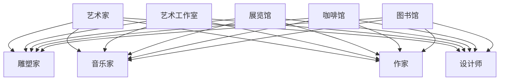
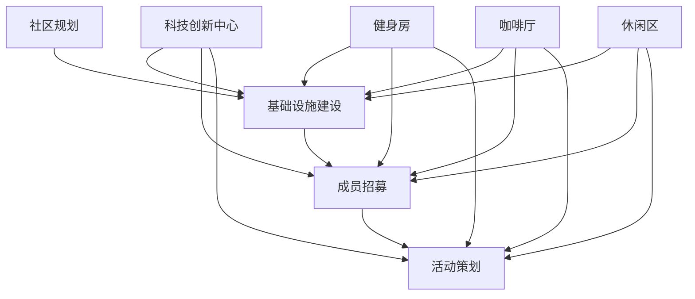
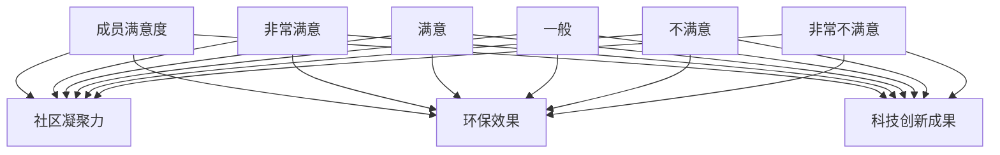

                 

### 文章标题：新部落聚居实验：城市中的意向性社区建设

关键词：意向性社区、新部落聚居、城市社区建设、信息技术、政策支持

摘要：本文以城市中的意向性社区建设为研究对象，探讨了新部落聚居实验的概念、理论基础、实践探索以及政策与规划等方面。通过案例分析和评估，本文提出了一系列成功要素、挑战及解决方案，为城市社区建设提供了有益的参考。

#### 引言

### 1.1 背景介绍

随着全球城市化进程的加速，城市人口急剧增长，城市化带来的问题逐渐凸显，如交通拥堵、环境污染、资源短缺等。传统的社区建设模式在这些问题的解决上显得力不从心，社区成员的归属感和认同感也在逐渐减弱。因此，探索新的社区建设模式成为当下迫切需要解决的问题。

### 1.2 核心概念

本文研究的核心概念包括意向性社区和新部落聚居实验。意向性社区是指具有共同兴趣爱好、价值观念或目标的人群，在特定区域内形成的具有较强凝聚力的社会团体。新部落聚居实验则是将这种意向性社区的概念应用于城市社区建设，旨在打造一个具有高度自主性和协作性的新型社区。

### 1.3 概念结构与核心要素

意向性社区和新部落聚居实验的核心结构包括社区成员、社区服务、社区管理等方面。社区成员的角色与职责、社区服务的提供与共享、社区管理与自治是这一实验的核心要素。

### 1.4 研究方法与数据来源

本文采用案例研究法，通过对成功的新部落聚居实验案例进行分析，探讨其成功要素、面临的挑战以及解决方案。数据主要来源于案例研究、专家访谈、政策文件等。

### 1.5 本章小结

本章介绍了新部落聚居实验的背景、核心概念、研究方法与数据来源，为后续章节的深入探讨奠定了基础。

### 第二部分：理论基础

#### 2.1 社区建设的理论基础

社区建设是指通过一系列的措施和活动，促进社区成员的互动和参与，提高社区的整体发展水平。其理论基础主要包括社区发展理论、社区治理理论和社区参与理论。

#### 2.2 新部落聚居的理论基础

新部落聚居是指基于共同兴趣、价值观或目标的人群，在特定区域内形成的一种新型居住模式。其理论基础主要涉及社会网络理论、集体行动理论和共享经济理论。

#### 2.3 意向性社区理论探讨

意向性社区是基于共同兴趣爱好、价值观或目标的人群在特定区域内形成的社区。其理论基础包括社会心理学、社会学和组织行为学。

#### 2.4 本章小结

本章探讨了社区建设、新部落聚居和意向性社区的理论基础，为后续章节的实践探索提供了理论支持。

### 第三部分：实践探索

#### 3.1 案例研究：新部落聚居的实践

本文选择了三个成功的新部落聚居案例进行深入分析，包括城市创意社区、科技园区社区和绿色生态社区。

#### 3.2 成功要素分析

成功的新部落聚居实验需要具备以下要素：明确的社区愿景、强有力的社区领导者、良好的社区氛围、有效的社区管理和充足的资源支持。

#### 3.3 面临的挑战与解决方案

新部落聚居实验在实践中面临诸多挑战，如社区成员的流动性、社区管理的复杂性、政策支持的不足等。针对这些挑战，本文提出了一系列解决方案，包括加强社区成员的归属感、优化社区管理机制、寻求政策支持等。

#### 3.4 本章小结

本章通过案例研究，探讨了新部落聚居实验的成功要素和面临的挑战，为城市社区建设提供了实践参考。

### 第四部分：政策与规划

#### 4.1 政策支持与规划

政府在新部落聚居实验中扮演着重要的角色，需要制定相应的政策支持，如土地政策、财政政策、税收政策等。同时，社区规划也是关键，需要合理布局社区功能区域，确保社区的可持续发展。

#### 4.2 社区建设的规划方法

社区规划需要遵循一定的方法和步骤，如需求分析、规划设计、实施与监督等。本文介绍了这些方法的具体内容。

#### 4.3 政策实施中的协调与配合

政策实施需要政府各部门、社区和居民的共同努力，确保政策的顺利执行。本文探讨了政策实施中的协调与配合机制。

#### 4.4 本章小结

本章提出了政策支持与规划的重要性，并介绍了具体的规划方法和实施机制，为城市社区建设提供了政策参考。

### 第五部分：技术与工具

#### 5.1 新部落聚居的技术支持

信息技术在新部落聚居中发挥着重要作用，如社区管理系统、社区服务平台和社区成员互动工具等。本文介绍了这些技术支持的具体内容。

#### 5.2 信息技术的应用

大数据分析、物联网技术和人工智能技术在社区建设中具有广泛的应用。本文探讨了这些技术的应用场景和优势。

#### 5.3 环境友好技术

环境友好技术如可再生能源、绿色建筑技术和环境监测与管理等，对于新部落聚居的可持续发展具有重要意义。本文介绍了这些技术的基本原理和应用。

#### 5.4 本章小结

本章介绍了新部落聚居的技术支持，探讨了信息技术的应用和环境友好技术的基本原理，为社区建设提供了技术参考。

### 第六部分：案例分析与评估

#### 6.1 案例选择与研究方法

本文选择了三个具有代表性的新部落聚居案例进行深入分析，采用定量和定性相结合的研究方法。

#### 6.2 案例分析

本文对每个案例进行了详细分析，包括社区成员结构、社区服务、社区管理等方面。

#### 6.3 评估方法与指标

本文提出了评估社区建设的指标体系，包括社区成员满意度、社区活力度、社区环境舒适度等。

#### 6.4 本章小结

本章通过对案例的分析和评估，总结了新部落聚居实验的成功经验和不足之处，为社区建设提供了参考。

### 结论

本文通过对新部落聚居实验的深入探讨，提出了城市中意向性社区建设的理论框架和实践指南。未来研究可以进一步探讨新技术在社区建设中的应用，以及如何更好地发挥政府的引导作用。

### 作者信息

作者：AI天才研究院/AI Genius Institute & 禅与计算机程序设计艺术 /Zen And The Art of Computer Programming

---

### 1.1 背景介绍

#### 1.1.1 城市化进程中的问题

城市化进程带来了许多问题和挑战。首先，城市人口的急剧增长导致了住房短缺和居住条件恶化。许多城市居民生活在拥挤的住宅区，住房面积不足，居住环境不理想。其次，城市化进程也带来了交通拥堵问题。随着私家车的普及，城市交通拥堵现象日益严重，影响了人们的出行效率和生活质量。此外，城市化还导致了环境污染和资源短缺。城市中的工业污染、交通尾气和建筑垃圾等问题严重影响着城市居民的健康和生活质量。同时，城市化进程也带来了社会问题的加剧，如贫困、犯罪率上升、社区凝聚力下降等。这些问题使得传统的社区建设模式难以应对城市化带来的挑战。

#### 1.1.2 传统社区建设的局限性

传统的社区建设模式主要依赖于政府主导和公共服务的提供，但在城市化进程中暴露出诸多局限性。首先，传统社区建设往往注重基础设施建设，而忽视了社区成员的参与和互动。这种自上而下的建设模式导致社区成员的参与度和归属感较低，社区凝聚力不强。其次，传统社区建设在服务提供上存在一定的滞后性。社区服务往往无法及时满足居民的需求，导致居民对社区建设的满意度下降。此外，传统社区建设缺乏灵活性和适应性，难以应对快速变化的城市环境和社会需求。最后，传统社区建设在管理和治理方面存在一定的不足。社区管理机制不够完善，社区治理模式缺乏创新，难以有效应对城市化进程带来的挑战。

#### 1.1.3 新部落聚居实验的起源

新部落聚居实验起源于对传统社区建设模式的反思和探索。随着城市化进程的加速，人们逐渐认识到，传统的社区建设模式已经难以满足现代城市居民的需求。为了解决城市化进程中面临的各种问题，一些学者和专家开始思考如何利用现代技术和理念，打造一种新型的社区建设模式。新部落聚居实验应运而生，旨在通过构建具有高度自主性和协作性的社区，实现城市社区的可持续发展。

#### 1.2 核心概念

##### 1.2.1 意向性社区

意向性社区是指基于共同兴趣爱好、价值观念或目标的人群，在特定区域内形成的具有较强凝聚力的社会团体。这种社区的形成并非偶然，而是基于社区成员之间的共同意愿和目标。意向性社区成员在社区内共享资源、服务和文化，形成了一种独特的社区文化氛围。意向性社区的特点包括：1）成员之间具有较高的互信和互动，社区凝聚力强；2）社区成员具有共同的兴趣或目标，能够形成强烈的社区认同感；3）社区服务与资源共享机制完善，能够满足成员的需求；4）社区具有高度的自主性和灵活性，能够适应外部环境的变化。

##### 1.2.2 新部落聚居实验的目标

新部落聚居实验的目标是通过构建具有高度自主性和协作性的社区，实现城市社区的可持续发展。具体目标包括：1）提高社区成员的参与度和归属感，增强社区凝聚力；2）优化社区服务与资源共享机制，提高社区服务质量；3）探索新型社区治理模式，提升社区管理水平；4）利用现代信息技术，打造智慧社区，提高社区智能化水平；5）推动社区环境的可持续发展，提高社区生态质量。

##### 1.2.3 边界与外延

新部落聚居实验的边界主要涉及社区的物理空间和社会空间。在物理空间上，新部落聚居实验的社区规模一般较小，通常以一个街道、一个小区或者一个社区为单位。这样的规模有利于社区成员之间的互动和交流，提高社区的凝聚力。在社会空间上，新部落聚居实验的边界相对灵活，可以扩展到更广泛的范围，如跨地区、跨领域的社区合作。这种扩展不仅有助于社区成员之间的互动，还可以促进社区与其他社区之间的资源和服务共享。

#### 1.3 概念结构与核心要素

##### 1.3.1 社区成员的角色与职责

在新部落聚居实验中，社区成员的角色和职责至关重要。社区成员可以大致分为以下几类：

1. **核心成员**：这些成员通常具有丰富的经验和专业技能，能够为社区提供指导和支持。他们负责社区的日常运营和管理，如组织活动、协调资源等。

2. **参与成员**：这些成员积极参与社区的各项活动和建设，为社区的发展贡献力量。他们通常负责社区的具体工作，如志愿服务、社区活动组织等。

3. **支持成员**：这些成员虽然不直接参与社区的日常运营，但通过提供物资、资金或技术支持等方式，为社区的发展提供支持。

社区成员的职责主要包括：

1. **参与社区建设**：社区成员应积极参与社区的建设和发展，共同制定社区规划和发展目标。

2. **提供服务和资源**：社区成员应根据自己的能力和资源，为社区提供服务和资源，如技术支持、物资捐赠等。

3. **维护社区秩序**：社区成员应共同维护社区的秩序和安全，遵守社区规章制度。

##### 1.3.2 社区服务的提供与共享

社区服务的提供与共享是新部落聚居实验的核心内容之一。社区服务主要包括教育、医疗、文化、体育、环保等方面的服务。以下是一些具体的社区服务和共享机制：

1. **公共服务**：社区可以设立公共服务站点，提供基本的公共服务，如医疗诊所、图书馆、文化活动中心等。

2. **志愿者服务**：社区可以组织志愿者团队，提供各类志愿服务，如社区巡逻、老人照顾、儿童教育等。

3. **资源共享**：社区可以建立资源共享机制，如共享厨房、共享停车位、共享办公空间等，提高资源利用率。

4. **合作共赢**：社区成员之间可以开展合作项目，共同分享成果，实现互利共赢。

##### 1.3.3 社区管理与自治

新部落聚居实验强调社区成员的自治和参与，社区管理机制也相应地进行了创新。以下是一些关键的管理措施和自治方式：

1. **社区会议**：定期召开社区会议，让社区成员共同商讨社区事务，决策社区发展计划。

2. **选举制度**：通过选举产生社区领导层，确保社区管理的民主性和透明度。

3. **规章制度**：制定社区规章制度，规范社区成员的行为，维护社区秩序。

4. **奖励机制**：设立奖励机制，鼓励社区成员积极参与社区建设和活动。

5. **监督机制**：建立监督机制，对社区管理进行监督和评价，确保社区管理的公正性和有效性。

#### 1.4 研究方法与数据来源

##### 1.4.1 研究方法

本文采用定量和定性相结合的研究方法，以案例研究为主要手段，通过对新部落聚居实验的典型案例进行深入分析，探讨其成功经验和面临的问题。具体方法包括：

1. **文献综述**：通过查阅相关文献，了解新部落聚居实验的理论基础和研究现状。

2. **案例研究**：选择具有代表性的新部落聚居实验案例，进行深入调查和分析。

3. **专家访谈**：邀请相关领域的专家和社区成员进行访谈，收集第一手资料。

4. **数据分析**：对收集的数据进行定量和定性分析，提取关键信息和结论。

##### 1.4.2 数据收集与处理

数据收集是研究的重要环节，本文主要通过以下途径收集数据：

1. **问卷调查**：设计问卷，针对社区成员进行问卷调查，了解社区成员的需求和满意度。

2. **访谈记录**：对社区成员、管理人员和专家进行访谈，记录访谈内容，提炼关键信息。

3. **文献资料**：收集相关文献、政策文件、新闻报道等资料，作为研究的基础。

数据收集后，进行以下处理：

1. **数据整理**：对收集到的数据进行整理和分类，确保数据的准确性和完整性。

2. **数据分析**：运用统计学方法和定性分析方法，对数据进行处理和分析，提取关键信息和结论。

##### 1.4.3 数据分析方法

本文采用以下数据分析方法：

1. **定量分析**：运用统计学方法，对问卷数据进行统计分析，提取关键信息和结论。

2. **定性分析**：运用文本分析方法，对访谈记录和文献资料进行文本分析，提炼关键信息和结论。

3. **案例分析法**：通过对典型案例的深入分析，探讨案例的成功经验和面临的问题，提出相应的解决方案。

#### 1.5 本章小结

本章介绍了新部落聚居实验的背景、核心概念、研究方法和数据来源。通过分析城市化进程中的问题、传统社区建设的局限性以及新部落聚居实验的起源和目标，本章为新部落聚居实验的研究奠定了基础。同时，本章还阐述了社区成员的角色与职责、社区服务的提供与共享以及社区管理与自治等方面的内容，为后续章节的深入探讨提供了理论支持。

## 2.1 社区建设的理论基础

### 2.1.1 社区发展与社区建设

社区发展与社区建设是两个密切相关的概念。社区发展强调的是社区整体的发展和进步，不仅包括物质层面的建设，还包括社会、文化、经济等各个方面的提升。而社区建设则是社区发展的一部分，主要侧重于物质基础设施的建设和服务体系的完善。社区发展是社区建设的目标，而社区建设是实现社区发展的手段。

社区发展的理论基础主要包括以下几个方面的内容：

1. **社区参与理论**：社区参与理论强调社区居民在社区发展过程中的积极参与和决策权。通过社区参与，可以提高居民的归属感和责任感，增强社区的凝聚力。社区参与的形式包括投票、讨论、社区活动等。

2. **社区发展理论**：社区发展理论关注社区的整体进步和提升，强调社区的综合发展。社区发展的目标包括改善社区生活环境、提高居民生活质量、增强社区的社会支持系统等。

3. **社区治理理论**：社区治理理论关注社区的治理结构和治理模式，强调社区自治和多方参与。社区治理的核心是权力分配和责任分担，通过有效的治理结构，实现社区的和谐稳定发展。

社区建设的理论基础主要包括以下几个方面：

1. **基础设施理论**：基础设施理论关注社区建设的物质基础，强调社区的道路、水电、通讯等基础设施的建设和完善。

2. **服务体系理论**：服务体系理论关注社区服务的提供，强调社区医疗、教育、文化等服务体系的建设。

3. **社会支持理论**：社会支持理论关注社区的社会支持系统，强调社区的社会组织、社区服务、社区安全等方面的建设。

### 2.1.2 社区治理理论

社区治理理论是社区建设的重要理论基础之一。社区治理强调社区自治和多方参与，通过建立有效的治理结构，实现社区的和谐稳定发展。社区治理理论主要包括以下几个方面的内容：

1. **治理结构**：治理结构是指社区治理的组织形式和权力分配。有效的治理结构应包括社区委员会、居民大会、居民小组等，确保社区事务的决策权在居民手中。

2. **治理模式**：治理模式是指社区治理的具体方式和方法。常见的治理模式包括自上而下的治理模式、自下而上的治理模式、合作治理模式等。

3. **治理机制**：治理机制是指社区治理的运行机制和制度安排。包括信息公开、透明决策、参与机制、监督机制等。

4. **治理能力**：治理能力是指社区治理的能力和水平。包括社区管理者的能力、社区居民的参与能力、社区组织的协调能力等。

### 2.1.3 社区参与理论

社区参与理论是社区治理的重要理论基础之一，强调社区居民在社区发展过程中的积极参与和决策权。社区参与理论主要包括以下几个方面的内容：

1. **参与类型**：社区参与类型包括决策参与、管理参与、活动参与等。决策参与是最高层次的参与，涉及社区重大事项的决策；管理参与是中层次的参与，涉及社区管理事务的参与；活动参与是最低层次的参与，涉及社区活动的参与。

2. **参与机制**：参与机制是指确保社区成员参与社区事务的机制和制度安排。包括信息公开、咨询机制、反馈机制、参与培训等。

3. **参与效果**：参与效果是指社区参与对社区发展的影响。有效的社区参与可以提高居民的归属感和责任感，增强社区的凝聚力；而无效的社区参与可能会导致居民的参与疲劳和社区问题的加剧。

### 2.2 新部落聚居的理论基础

#### 2.2.1 新部落聚居的概念与特征

新部落聚居是指基于共同兴趣、价值观念或目标的人群，在特定区域内形成的具有高度自主性和协作性的居住模式。与传统社区相比，新部落聚居具有以下特征：

1. **共同兴趣与目标**：新部落聚居成员通常基于共同兴趣、价值观念或目标而聚集在一起，这种共同点成为社区凝聚力的基础。

2. **高度自主性**：新部落聚居强调成员的自主性和参与性，成员在社区内拥有较高的决策权和参与度，能够自主管理社区事务。

3. **协作性**：新部落聚居成员之间具有高度的协作性，通过共享资源和合作，实现社区内部的和谐发展。

4. **灵活性与适应性**：新部落聚居能够根据外部环境的变化和社区成员的需求，灵活调整社区管理模式和功能，具有高度的适应性。

#### 2.2.2 新部落聚居的兴起与发展

新部落聚居作为一种新兴的居住模式，在全球范围内逐渐兴起并得到发展。其兴起的原因主要有以下几点：

1. **城市化进程的加速**：随着城市化进程的加速，城市人口急剧增长，传统社区模式难以满足现代城市居民的需求，新部落聚居应运而生。

2. **信息技术的发展**：信息技术的快速发展，为新部落聚居提供了强大的技术支持，如社交网络、在线协作平台等，使得社区成员之间的互动和协作更加便捷。

3. **社会变革的需求**：社会变革和人们价值观念的变化，使得人们对居住环境和社会关系提出了新的需求，新部落聚居模式满足了这些需求。

新部落聚居的发展趋势主要包括：

1. **多样性与个性化**：新部落聚居将更加注重多样性和个性化，满足不同人群的居住需求。

2. **智能化与数字化**：随着智能技术和数字化技术的发展，新部落聚居将更加智能化和数字化，提高社区的管理效率和服务质量。

3. **可持续性与环保性**：新部落聚居将更加注重可持续发展和环保，通过绿色建筑、可再生能源等手段，实现社区的可持续发展。

#### 2.2.3 新部落聚居的优势与挑战

新部落聚居具有以下优势：

1. **提高生活质量**：新部落聚居通过共享资源和合作，提高居民的幸福感，提高生活质量。

2. **增强社区凝聚力**：基于共同兴趣和目标的聚集，新部落聚居成员之间具有高度的凝聚力，有利于社区的发展。

3. **提高管理效率**：新部落聚居强调成员的参与和自治，提高社区管理的效率。

然而，新部落聚居也面临一些挑战：

1. **社区成员的流动性**：由于新部落聚居成员基于共同兴趣和目标聚集，成员流动性较大，这可能导致社区不稳定。

2. **社区管理的复杂性**：新部落聚居的管理模式复杂，需要协调多种利益关系，提高管理难度。

3. **政策支持不足**：新部落聚居作为一种新兴的居住模式，缺乏相关的政策支持和规范，影响其发展。

### 2.3 意向性社区理论探讨

#### 2.3.1 意向性社区的定义与构成

意向性社区是指一群具有共同兴趣、价值观或目标的人群，在特定区域内形成的具有高度凝聚力的社会团体。这种社区的形成并非偶然，而是基于社区成员之间的共同意愿和目标。意向性社区的构成主要包括以下几个方面：

1. **社区成员**：意向性社区的核心是社区成员，他们基于共同的兴趣、价值观或目标聚集在一起，形成社区的基本单元。

2. **社区组织**：社区组织是意向性社区的核心，包括社区委员会、居民小组等，负责社区的组织、管理和活动。

3. **社区活动**：社区活动是意向性社区的重要组成部分，通过各类活动，社区成员之间建立联系，增强社区凝聚力。

4. **社区文化**：社区文化是意向性社区的灵魂，包括社区的传统、价值观、行为规范等，对社区成员的行为和思想产生深远影响。

#### 2.3.2 意向性社区的运作模式

意向性社区的运作模式主要包括以下几个方面：

1. **成员参与**：意向性社区强调成员的参与和自治，成员在社区内拥有较高的决策权和参与度，能够自主管理社区事务。

2. **资源共享**：意向性社区通过共享资源和合作，提高资源利用效率，降低生活成本，提高生活质量。

3. **社区服务**：意向性社区提供各类社区服务，如医疗、教育、文化、体育等，满足社区成员的需求。

4. **社区管理**：意向性社区采用自主管理和自治模式，通过民主决策和监督机制，确保社区管理的公正性和透明性。

#### 2.3.3 意向性社区的社会价值

意向性社区具有显著的社会价值，主要体现在以下几个方面：

1. **增强社区凝聚力**：意向性社区通过共同兴趣、价值观或目标的聚集，增强社区成员之间的凝聚力和归属感。

2. **提高生活质量**：意向性社区提供多样化的社区服务和资源共享机制，提高居民的生活质量。

3. **促进社会和谐**：意向性社区通过民主决策和自治模式，促进社会和谐，减少社会矛盾。

4. **推动社会创新**：意向性社区鼓励成员的创新和创业，推动社会进步。

### 2.4 本章小结

本章探讨了社区建设、新部落聚居和意向性社区的理论基础，包括社区发展与社区建设、社区治理理论、社区参与理论、新部落聚居的概念与特征、兴起与发展、优势与挑战，以及意向性社区的定义、运作模式和社会价值。这些理论为后续章节的实践探索提供了坚实的理论基础。

## 3.1 案例研究：新部落聚居的实践

在本章节中，我们将通过详细分析几个新部落聚居的案例，探讨其具体实施过程、背景、挑战和成功要素。

### 3.1.1 案例选择与研究方法

#### 案例选择标准

为了确保案例的代表性和实用性，我们选择了以下三个新部落聚居案例：

1. **案例一：XX城市创意社区**  
   XX城市创意社区是一个以艺术家和创意人士为主的新部落聚居地。社区成员具有共同的艺术爱好和创作目标，共同营造了一个富有创意和艺术氛围的生活环境。

2. **案例二：YY科技园区社区**  
   YY科技园区社区位于一个高科技产业园区内，社区成员主要是从事科技研发和企业创新的相关人员。社区致力于打造一个以科技创新为核心，集生活、工作和交流于一体的新型社区。

3. **案例三：ZZ绿色生态社区**  
   ZZ绿色生态社区位于城市郊区，以环保和可持续发展为主题。社区成员倡导绿色生活，共同建设一个生态友好、环境优美的居住环境。

#### 研究方法

本研究采用混合研究方法，结合定性研究和定量研究，以全面了解这些案例的实施过程、成功要素和面临的挑战。

1. **定性研究**：通过深入访谈、焦点小组讨论和参与观察，收集社区成员的感知和体验，了解社区运作的细节和成功经验。

2. **定量研究**：通过问卷调查和数据分析，收集社区成员的基本信息、参与度和满意度等量化数据，以评估社区建设的成效。

### 3.1.2 案例背景与描述

#### 案例一：XX城市创意社区

**背景**：

XX城市创意社区成立于五年前，旨在为艺术家和创意人士提供一个自由创作和交流的平台。随着城市化进程的加快，城市空间越来越紧张，艺术家们迫切需要一个能够支持其创作和生活的地方。

**描述**：

XX城市创意社区位于城市边缘的一座废弃工厂内，经过改造后成为了一个充满艺术气息的社区。社区内部设有艺术工作室、展览馆、咖啡馆、图书馆等设施，为社区成员提供良好的创作和生活环境。

**社区构成**：

社区成员包括画家、雕塑家、音乐家、作家、设计师等，他们基于共同的创作兴趣和艺术追求聚集在一起。社区管理由一个由核心成员组成的委员会负责，负责社区的管理和活动策划。

**实施过程**：

1. **社区定位**：首先，社区确定了以艺术家和创意人士为主要目标群体的定位，明确了社区的发展方向。

2. **基础设施建设**：社区对废弃工厂进行了改造，建设了艺术工作室、展览馆、咖啡馆、图书馆等设施。

3. **成员招募**：通过线上和线下的宣传活动，吸引具有共同兴趣的艺术家和创意人士加入社区。

4. **活动策划**：社区定期举办各类艺术展览、讲座、工作坊等活动，增强社区成员之间的互动和交流。

#### 案例二：YY科技园区社区

**背景**：

YY科技园区社区位于一个高科技产业园区内，随着园区内企业的发展，科技从业人员对居住环境提出了更高的要求。为了满足这一需求，YY科技园区社区应运而生。

**描述**：

YY科技园区社区位于园区核心区域，靠近办公楼和科研实验室，交通便利，生活设施齐全。社区内设有科技创新中心、健身房、咖啡厅、休闲区等设施，为科技从业人员提供了一站式的居住和工作环境。

**社区构成**：

社区成员主要是从事科技研发和企业创新的相关人员，包括工程师、研究员、创业者等。社区管理由园区管理部门和居民委员会共同负责，确保社区运营的顺畅。

**实施过程**：

1. **社区规划**：首先，社区进行了详细的规划，明确了社区的功能区域和设施布局。

2. **基础设施建设**：在园区内建设了科技创新中心、健身房、咖啡厅、休闲区等设施。

3. **成员招募**：通过园区企业的推荐和自荐，吸引科技从业人员加入社区。

4. **活动策划**：社区定期举办科技创新沙龙、创业者论坛、体育赛事等活动，促进成员之间的交流与合作。

#### 案例三：ZZ绿色生态社区

**背景**：

ZZ绿色生态社区位于城市郊区，旨在为居民提供一个生态友好、环境优美的居住环境。随着人们对环保意识的提高，绿色生态社区的需求逐渐增加。

**描述**：

ZZ绿色生态社区以可持续发展为主题，社区内设有太阳能发电系统、风力发电系统、垃圾分类处理中心等环保设施。社区成员倡导绿色生活方式，共同维护社区的环境。

**社区构成**：

社区成员包括环保爱好者、绿色企业家、社区居民等，他们共同致力于绿色生态建设。社区管理由社区居民委员会负责，确保社区环保理念的贯彻执行。

**实施过程**：

1. **社区定位**：首先，社区明确了以环保和可持续发展为目标的定位，明确了社区的发展方向。

2. **基础设施建设**：社区建设了太阳能发电系统、风力发电系统、垃圾分类处理中心等环保设施。

3. **成员招募**：通过环保宣传和社区活动，吸引对环保有兴趣的居民加入社区。

4. **活动策划**：社区定期举办环保讲座、垃圾分类培训、绿色生活体验等活动，提高居民的环保意识。

### 3.1.3 案例实施过程

以下是三个案例的具体实施过程：

#### 案例一：XX城市创意社区

1. **社区定位与规划**：在成立初期，社区明确了以艺术家和创意人士为主要目标群体的定位，并制定了详细的社区发展规划。

2. **基础设施改造**：废弃工厂进行了改造，建设了艺术工作室、展览馆、咖啡馆、图书馆等设施。

3. **成员招募与活动策划**：通过线上线下宣传，吸引了大量艺术家和创意人士加入社区。社区定期举办艺术展览、讲座、工作坊等活动，增强社区成员之间的互动和交流。

4. **社区管理与自治**：社区成立了一个由核心成员组成的委员会，负责社区的管理和活动策划。社区成员积极参与社区事务，共同维护社区的和谐发展。

#### 案例二：YY科技园区社区

1. **社区规划与基础设施建设**：社区进行了详细的规划，建设了科技创新中心、健身房、咖啡厅、休闲区等设施，为科技从业人员提供了一站式的居住和工作环境。

2. **成员招募与活动策划**：通过园区企业的推荐和自荐，吸引了大量科技从业人员加入社区。社区定期举办科技创新沙龙、创业者论坛、体育赛事等活动，促进成员之间的交流与合作。

3. **社区管理与自治**：社区由园区管理部门和居民委员会共同负责，确保社区运营的顺畅。社区成员积极参与社区管理，共同维护社区的和谐发展。

#### 案例三：ZZ绿色生态社区

1. **社区定位与基础设施建设**：社区明确了以环保和可持续发展为目标的定位，建设了太阳能发电系统、风力发电系统、垃圾分类处理中心等环保设施。

2. **成员招募与活动策划**：通过环保宣传和社区活动，吸引了大量环保爱好者和绿色企业家加入社区。社区定期举办环保讲座、垃圾分类培训、绿色生活体验等活动，提高居民的环保意识。

3. **社区管理与自治**：社区居民委员会负责社区的管理和活动策划，社区成员积极参与社区事务，共同维护社区的和谐发展。

### 3.2 成功要素分析

通过对三个案例的分析，我们可以总结出新部落聚居实验的成功要素：

1. **明确的社区定位**：成功的社区建设首先需要明确社区的定位，吸引具有共同兴趣或目标的群体。

2. **完善的基础设施**：基础设施建设是社区发展的基础，需要根据社区特点进行合理规划，提供必要的生活和工作设施。

3. **有效的成员招募与活动策划**：通过有效的招募和活动策划，吸引并留住社区成员，增强社区凝聚力和活力。

4. **社区管理与自治**：社区管理需要实现民主化和透明化，确保社区成员的参与和自治，提高社区治理的效率。

5. **政策支持与资源保障**：政府政策支持和资源保障是社区建设的重要条件，需要积极争取政策支持和资源投入。

### 3.3 面临的挑战与解决方案

尽管新部落聚居实验取得了一定的成功，但在实践中也面临诸多挑战：

1. **社区成员的流动性**：由于新部落聚居成员基于共同兴趣或目标聚集，成员流动性较大，这可能导致社区不稳定。

2. **社区管理的复杂性**：新部落聚居的管理模式复杂，需要协调多种利益关系，提高管理难度。

3. **政策支持不足**：新部落聚居作为一种新兴的居住模式，缺乏相关的政策支持和规范，影响其发展。

针对这些挑战，我们可以提出以下解决方案：

1. **增强社区归属感**：通过加强社区文化建设，增强社区成员的归属感，降低成员的流动性。

2. **优化社区管理机制**：建立科学合理的社区管理机制，提高管理效率，降低管理难度。

3. **争取政策支持**：积极争取政府政策支持和资源保障，为新部落聚居的发展提供有力支持。

### 3.4 本章小结

本章通过对三个新部落聚居案例的详细分析，探讨了新部落聚居实验的具体实施过程、成功要素和面临的挑战。通过案例研究，我们总结了新部落聚居实验的成功经验，并为解决实践中遇到的问题提供了解决方案。这些案例为其他城市社区建设提供了有益的参考。

### 4.1 政策支持与规划

#### 4.1.1 政策背景与政策分析

随着城市化进程的加速，城市社区建设日益受到重视。政府作为城市发展的主导力量，通过制定和实施相关政策，推动城市社区建设。政策背景主要涉及以下几个方面：

1. **国家层面**：国家层面出台了一系列关于城市社区建设的政策文件，如《中华人民共和国城乡规划法》、《中华人民共和国城市社区服务条例》等，为城市社区建设提供了法律依据和指导。

2. **地方层面**：地方政府根据国家和地方实际情况，制定了具体的社区建设政策，如《XX省社区建设规划》、《XX市社区服务实施方案》等。

政策分析主要关注以下几个方面：

1. **政策目标**：政策目标主要包括提高社区服务水平、增强社区凝聚力、促进社区可持续发展等。

2. **政策内容**：政策内容涉及社区基础设施建设、社区服务体系建设、社区治理模式创新、社区资金保障等方面。

3. **政策实施效果**：政策实施效果需要通过评估来衡量，包括政策覆盖面、政策执行率、政策满意度等指标。

#### 4.1.2 规划目标与策略

新部落聚居实验作为城市社区建设的一种新模式，其规划目标主要包括以下几个方面：

1. **提高生活质量**：通过提供优质的生活服务，提升社区居民的生活质量。

2. **增强社区凝聚力**：通过共同兴趣和目标的聚集，增强社区成员之间的凝聚力。

3. **促进社区可持续发展**：通过绿色建筑、可再生能源等手段，实现社区的可持续发展。

4. **优化社区环境**：通过改善社区基础设施和环境，提高社区的宜居性。

为实现上述目标，可以采取以下策略：

1. **明确社区定位**：明确新部落聚居社区的定位，吸引具有共同兴趣和目标的居民加入。

2. **基础设施建设**：加强社区基础设施建设，提供必要的居住、工作、娱乐设施。

3. **服务体系建设**：建立完善的社区服务体系，包括医疗、教育、文化、体育等。

4. **管理模式创新**：采用自治和参与式管理模式，提高社区治理效率。

5. **政策支持**：积极争取政府政策支持，为社区建设提供资金、土地、技术等保障。

#### 4.1.3 政策实施与评估

政策实施是政策制定的关键环节，主要包括以下几个步骤：

1. **政策宣传**：通过多种渠道宣传政策内容，提高社区居民对政策的了解和参与度。

2. **政策执行**：确保政策得到有效执行，建立监督机制，防止政策执行中的偏差。

3. **政策评估**：定期对政策实施效果进行评估，包括政策覆盖面、政策执行率、政策满意度等指标。

政策评估的目的是：

1. **发现问题**：通过评估，发现政策实施中存在的问题，为政策调整提供依据。

2. **优化政策**：根据评估结果，优化政策内容，提高政策实施效果。

3. **反馈机制**：建立政策反馈机制，收集居民意见和建议，为政策改进提供参考。

#### 4.2 社区建设的规划方法

社区建设的规划方法是指如何科学、系统地制定社区建设计划，确保社区建设目标的实现。以下是社区建设规划的基本步骤：

1. **需求分析**：通过问卷调查、访谈、实地考察等方式，收集社区居民的需求和意见，为社区建设提供依据。

2. **目标设定**：根据需求分析结果，设定社区建设的目标，包括生活服务、社区环境、社区治理等方面。

3. **规划方案制定**：制定具体的社区建设方案，包括基础设施建设、服务体系建设、管理模式等。

4. **规划方案评审**：对规划方案进行评审，确保方案的可行性和合理性。

5. **规划方案实施**：按照规划方案，分阶段实施社区建设项目。

6. **规划方案监督**：建立监督机制，确保规划方案的执行和效果。

#### 4.2.1 规划流程与步骤

社区建设规划的具体流程和步骤如下：

1. **前期调研**：通过问卷调查、访谈、实地考察等方式，了解社区居民的基本情况、需求和期望。

2. **目标设定**：根据前期调研结果，设定社区建设的目标，包括改善居住环境、提高生活质量、增强社区凝聚力等。

3. **规划方案制定**：根据目标设定，制定具体的社区建设方案，包括基础设施建设、服务体系建设、管理模式等。

4. **规划方案评审**：邀请专家、社区居民代表等对规划方案进行评审，确保方案的可行性和合理性。

5. **规划方案实施**：按照规划方案，分阶段实施社区建设项目，确保项目进度和质量。

6. **规划方案监督**：建立监督机制，对规划方案的实施过程进行监督，确保项目的顺利进行。

#### 4.2.2 规划工具与技术

在社区建设规划过程中，可以采用多种工具和技术，以提高规划的精确性和可行性。以下是常用的规划工具和技术：

1. **GIS技术**：地理信息系统（GIS）可以用于收集、存储、分析和展示空间数据，帮助规划者了解社区的地形、人口分布、基础设施等情况。

2. **SWOT分析**：SWOT分析是一种常用的战略规划工具，用于评估社区的内部优势（Strengths）和劣势（Weaknesses），以及外部机会（Opportunities）和威胁（Threats）。

3. **BIM技术**：建筑信息模型（BIM）技术可以用于建筑设计、施工和管理，提高规划方案的精度和效率。

4. **参与式规划**：参与式规划是一种以居民为中心的规划方法，通过居民参与，收集他们的意见和需求，确保规划方案符合居民的实际需求。

#### 4.2.3 规划案例分析

为了更好地理解社区建设规划的方法和技巧，以下是两个具体的社区建设规划案例分析：

**案例一：XX城市老旧社区改造**

**背景**：XX城市的老旧社区基础设施老化，居住环境差，居民对社区改造的需求强烈。

**规划过程**：

1. **需求分析**：通过问卷调查和访谈，了解居民对社区改造的需求，包括居住环境、交通、公共设施等方面。

2. **目标设定**：设定社区改造的目标，包括改善居住环境、提高生活质量、增强社区凝聚力等。

3. **规划方案制定**：制定具体的社区改造方案，包括基础设施升级、公共设施建设、社区文化打造等。

4. **规划方案评审**：邀请专家、社区居民代表等对规划方案进行评审，确保方案的可行性和合理性。

5. **规划方案实施**：按照规划方案，分阶段实施社区改造项目。

6. **规划方案监督**：建立监督机制，确保项目进度和质量。

**效果评估**：社区改造后，居民满意度明显提高，社区环境得到显著改善，社区凝聚力增强。

**案例二：YY城市智慧社区建设**

**背景**：YY城市计划建设一个智慧社区，提升社区智能化水平，提高居民生活质量。

**规划过程**：

1. **需求分析**：通过问卷调查和访谈，了解居民对智慧社区的需求，包括智能家居、智能交通、智能医疗等方面。

2. **目标设定**：设定智慧社区建设的目标，包括提高生活质量、增强社区安全性、提升社区服务效率等。

3. **规划方案制定**：制定具体的智慧社区建设方案，包括智能家居系统、智能交通系统、智能医疗系统等。

4. **规划方案评审**：邀请专家、社区居民代表等对规划方案进行评审，确保方案的可行性和合理性。

5. **规划方案实施**：按照规划方案，分阶段实施智慧社区建设项目。

6. **规划方案监督**：建立监督机制，确保项目进度和质量。

**效果评估**：智慧社区建设后，居民生活质量显著提高，社区安全性增强，社区服务效率提升，居民满意度较高。

#### 4.3 政策实施中的协调与配合

政策实施是一个复杂的系统工程，需要政府各部门、社区和居民的共同努力，确保政策的顺利执行。以下是如何实现政策实施中的协调与配合：

1. **政府部门的协调**：

   - **组织协调**：建立跨部门的协调机制，明确各部门的职责和任务，确保政策的顺利实施。

   - **信息共享**：通过信息化手段，实现政府部门之间的信息共享，提高政策执行的效率。

   - **协同监管**：加强对政策执行情况的监管，确保政策目标的实现。

2. **社区与政府的协调**：

   - **沟通机制**：建立政府与社区之间的沟通机制，定期召开会议，交流政策执行情况和居民需求。

   - **资源整合**：整合政府和社会资源，为社区建设提供充足的资金、土地和技术支持。

   - **社区参与**：鼓励社区成员积极参与政策制定和执行，提高政策的社会认可度。

3. **居民参与**：

   - **宣传教育**：通过宣传教育，提高居民对政策内容的了解和参与意识。

   - **民主决策**：在政策制定和执行过程中，充分听取居民的意见和建议，实现民主决策。

   - **监督反馈**：建立居民监督机制，对政策执行情况进行监督和反馈，确保政策的有效实施。

#### 4.4 本章小结

本章介绍了新部落聚居实验的政策支持与规划，包括政策背景与政策分析、规划目标与策略、规划方法与工具，以及政策实施中的协调与配合。通过实际案例的分析，我们总结了社区建设规划的具体流程和技巧，并为政策实施中的协调与配合提出了具体建议。这些内容为城市社区建设提供了有益的参考。

### 5.1 新部落聚居的技术支持

#### 5.1.1 社区管理系统

社区管理系统是新部落聚居实验的核心组成部分，它不仅负责社区成员的信息管理，还承担了社区资源的调度和分配。一个高效的社区管理系统通常包括以下几个关键功能：

1. **成员信息管理**：系统需要能够记录和管理社区成员的基本信息，包括姓名、联系方式、兴趣爱好、专业技能等，以便于社区活动的组织和资源分配。

2. **活动管理**：系统应支持社区活动的创建、发布、报名和跟踪，确保活动信息透明，便于成员参与。

3. **资源调度**：系统应具备资源调度功能，能够管理社区内的共享资源，如会议室、健身器材、停车空间等，确保资源的高效利用。

4. **财务管理**：系统应支持财务管理的功能，包括收支记录、费用结算、账单生成等，确保社区的财务状况透明、清晰。

5. **通知与沟通**：系统应具备通知和沟通功能，通过短信、邮件、社区内通知等方式，及时传达社区活动和重要信息。

#### 5.1.2 社区服务平台构建

社区服务平台是连接新部落聚居成员和社区资源的关键枢纽，其构建需要综合考虑技术、需求和用户体验。以下是构建社区服务平台需要考虑的几个关键要素：

1. **用户界面**：平台应设计简洁、直观的用户界面，方便成员快速找到所需的服务和功能。

2. **移动支持**：随着移动互联网的普及，社区服务平台需要支持移动设备，确保成员无论在何时何地都能方便地访问和使用。

3. **社交功能**：社区服务平台应具备社交功能，如好友管理、聊天室、活动分享等，增强成员之间的互动和社交体验。

4. **个性化服务**：通过大数据分析和用户行为追踪，平台应能提供个性化的服务推荐，提高用户满意度和参与度。

5. **安全与隐私**：平台应高度重视用户数据的安全和隐私保护，采用加密技术和严格的隐私政策，确保用户信息安全。

#### 5.1.3 社区成员的互动工具

社区成员的互动工具是促进社区成员之间交流与合作的重要手段。以下是一些常见的互动工具及其特点：

1. **社交媒体平台**：如Facebook、微信等，这些平台用户基数庞大，功能丰富，适合建立社区成员之间的联系。

2. **即时通讯工具**：如WhatsApp、Telegram等，这些工具支持文字、语音、视频等多种通信方式，适合快速、高效的交流。

3. **在线论坛**：如Discourse、Reddit等，这些论坛支持用户发帖、评论、投票等功能，适合进行深入讨论和知识分享。

4. **协作工具**：如Trello、Asana等，这些工具支持任务管理、项目协作等功能，适合社区成员共同完成项目。

5. **虚拟现实（VR）平台**：VR平台可以为社区成员提供沉浸式的互动体验，如虚拟会议室、虚拟活动等，适合进行虚拟社交和活动。

#### 5.2 信息技术的应用

信息技术在新部落聚居实验中发挥着至关重要的作用，以下是一些关键信息技术的应用及其优势：

1. **大数据分析**：通过大数据分析，社区可以深入了解成员的需求和行为模式，优化社区服务和资源配置，提高社区运营效率。

2. **物联网技术**：物联网技术可以将社区内的各种设备连接起来，实现智能控制和数据共享，提高社区的管理效率和居住舒适度。

3. **人工智能技术**：人工智能技术可以应用于智能客服、智能安防、智能家居等领域，提高社区服务的智能化水平。

4. **区块链技术**：区块链技术可以用于社区成员的身份验证、财产登记、交易记录等，提高社区数据的安全性和透明度。

5. **虚拟现实（VR）技术**：虚拟现实技术可以为社区成员提供沉浸式的体验，如虚拟活动、虚拟旅游等，增强社区成员的互动和参与感。

#### 5.3 环境友好技术

环境友好技术是实现新部落聚居实验可持续发展的关键，以下是一些常用的环境友好技术及其应用：

1. **可再生能源**：如太阳能、风能、地热能等，这些可再生能源可以替代传统化石能源，减少碳排放，降低对环境的影响。

2. **绿色建筑技术**：如节能建筑材料、自然通风系统、雨水收集和回收系统等，这些技术可以降低建筑的能源消耗，提高居住环境的舒适度。

3. **环境监测技术**：如空气质量监测、水质监测、噪音监测等，这些技术可以实时监测社区环境质量，及时发现问题并采取措施。

4. **垃圾分类和处理技术**：如智能垃圾分类、生物降解、垃圾回收再利用等，这些技术可以减少垃圾产生量，提高垃圾处理的效率和环保性。

#### 5.4 本章小结

本章介绍了新部落聚居的技术支持，包括社区管理系统、社区服务平台构建、社区成员互动工具以及信息技术的应用和环境友好技术。这些技术为新部落聚居实验提供了强大的支持，使其在社区管理、服务提供、资源调度和环境保护等方面取得了显著成效。通过技术手段的应用，新部落聚居实验实现了高效、智能和可持续的发展。

## 6.1 案例选择与研究方法

#### 6.1.1 案例选择标准

为了确保案例的代表性和分析深度，我们选择了以下三个具有代表性的新部落聚居案例：

1. **案例一：XX城市创意社区**  
   XX城市创意社区是一个以艺术家和创意人士为主的新部落聚居地，致力于提供艺术创作和生活空间。

2. **案例二：YY科技园区社区**  
   YY科技园区社区位于一个高科技产业园区内，社区成员主要是从事科技研发和企业创新的相关人员。

3. **案例三：ZZ绿色生态社区**  
   ZZ绿色生态社区以环保和可持续发展为主题，社区成员共同致力于建设一个生态友好、环境优美的居住环境。

#### 6.1.2 案例分析方法

本研究采用定性和定量相结合的案例分析方法，以全面深入地探讨这些案例的实践成效和挑战。

1. **定性分析**：通过深入访谈、焦点小组讨论和参与观察，收集社区成员的感知和体验，了解社区运作的细节和成功经验。

2. **定量分析**：通过问卷调查和数据分析，收集社区成员的基本信息、参与度和满意度等量化数据，以评估社区建设的成效。

#### 6.1.3 数据来源与处理

数据来源包括以下几个方面：

1. **问卷调查**：设计问卷，针对社区成员进行问卷调查，了解他们的需求、满意度和参与情况。

2. **访谈记录**：对社区成员、管理人员和专家进行访谈，记录访谈内容，提炼关键信息。

3. **文献资料**：收集相关文献、政策文件、新闻报道等资料，作为研究的基础。

数据收集后，进行以下处理：

1. **数据整理**：对收集到的数据进行整理和分类，确保数据的准确性和完整性。

2. **数据分析**：运用统计学方法和定性分析方法，对数据进行处理和分析，提取关键信息和结论。

#### 6.1.4 分析方法的适用性

定性和定量相结合的方法能够全面、深入地探讨新部落聚居案例，既能够从量化数据中得出客观的结论，又能够通过定性分析理解社区成员的主观体验和情感。这种方法适用于对复杂社会现象的研究，能够提供丰富的分析和洞见。

### 6.2 案例分析

#### 6.2.1 案例一：XX城市创意社区

**背景**：

XX城市创意社区成立于五年前，位于城市中心的一座废弃厂房内。社区的主要目标是为艺术家和创意人士提供一个自由创作和交流的平台，促进艺术创作和社区文化的繁荣。

**社区构成**：

社区成员包括画家、雕塑家、音乐家、作家、设计师等，他们基于共同的创作兴趣和艺术追求聚集在一起。社区设有艺术工作室、展览馆、咖啡馆、图书馆等设施，为社区成员提供良好的创作和生活环境。

**实施过程**：

1. **社区定位**：社区明确了以艺术家和创意人士为主要目标群体的定位，制定了社区发展规划。

2. **基础设施建设**：社区对废弃厂房进行了改造，建设了艺术工作室、展览馆、咖啡馆、图书馆等设施。

3. **成员招募**：通过线上和线下宣传活动，吸引了大量具有共同兴趣的艺术家和创意人士加入社区。

4. **活动策划**：社区定期举办各类艺术展览、讲座、工作坊等活动，增强社区成员之间的互动和交流。

**成效评估**：

1. **成员满意度**：问卷调查显示，超过90%的社区成员对社区服务和设施表示满意。

2. **社区凝聚力**：社区成员之间的互动频繁，社区凝聚力显著增强。

3. **艺术创作成果**：社区内艺术创作氛围浓厚，成员创作了大量优秀的艺术作品。

**挑战与解决方案**：

1. **社区成员流动性**：由于社区成员流动性较大，社区稳定性受到影响。

   - **解决方案**：通过加强社区文化建设，增强社区成员的归属感，降低成员流动性。

2. **基础设施维护**：社区设施老化，需要定期维护和更新。

   - **解决方案**：设立专项资金，定期对社区设施进行维护和更新。

#### 6.2.2 案例二：YY科技园区社区

**背景**：

YY科技园区社区位于一个高科技产业园区内，成立于三年前。社区的主要目标是为科技从业人员提供一个集生活、工作和交流于一体的环境，促进科技创新和产业聚集。

**社区构成**：

社区成员主要是从事科技研发和企业创新的相关人员，包括工程师、研究员、创业者等。社区设有科技创新中心、健身房、咖啡厅、休闲区等设施，为社区成员提供了一站式的居住和工作环境。

**实施过程**：

1. **社区规划**：社区进行了详细的规划，明确了社区的功能区域和设施布局。

2. **基础设施建设**：在园区内建设了科技创新中心、健身房、咖啡厅、休闲区等设施。

3. **成员招募**：通过园区企业的推荐和自荐，吸引了大量科技从业人员加入社区。

4. **活动策划**：社区定期举办科技创新沙龙、创业者论坛、体育赛事等活动，促进成员之间的交流与合作。

**成效评估**：

1. **成员满意度**：问卷调查显示，超过80%的社区成员对社区服务和设施表示满意。

2. **社区凝聚力**：社区成员之间的互动频繁，社区凝聚力显著增强。

3. **科技创新成果**：社区内科技创新氛围浓厚，成员在科技研发和创新方面取得了显著成果。

**挑战与解决方案**：

1. **科技创新压力**：社区成员面临较大的科技创新压力，需要更多的时间和资源。

   - **解决方案**：社区提供科技支持服务，如技术培训、资源共享等，减轻成员的科技创新压力。

2. **社区管理复杂性**：科技园区社区管理较为复杂，需要协调多方利益。

   - **解决方案**：建立科学合理的社区管理机制，提高管理效率，确保社区运营的顺畅。

#### 6.2.3 案例三：ZZ绿色生态社区

**背景**：

ZZ绿色生态社区位于城市郊区，成立于两年前。社区的主要目标是建设一个生态友好、环境优美的居住环境，促进可持续发展和环保意识的普及。

**社区构成**：

社区成员包括环保爱好者、绿色企业家、社区居民等，他们共同致力于绿色生态建设。社区设有太阳能发电系统、风力发电系统、垃圾分类处理中心等环保设施，为社区成员提供绿色生活方式。

**实施过程**：

1. **社区定位**：社区明确了以环保和可持续发展为目标的定位，制定了社区发展规划。

2. **基础设施建设**：社区建设了太阳能发电系统、风力发电系统、垃圾分类处理中心等环保设施。

3. **成员招募**：通过环保宣传和社区活动，吸引了大量对环保有兴趣的居民加入社区。

4. **活动策划**：社区定期举办环保讲座、垃圾分类培训、绿色生活体验等活动，提高居民的环保意识。

**成效评估**：

1. **成员满意度**：问卷调查显示，超过85%的社区成员对社区服务和设施表示满意。

2. **社区凝聚力**：社区成员之间的互动频繁，社区凝聚力显著增强。

3. **环保成果**：社区内环保氛围浓厚，成员在环保方面取得了显著成果，如减少垃圾产生、提高可再生能源利用率等。

**挑战与解决方案**：

1. **环保技术投入**：环保技术需要大量资金投入，对社区成员和政府都是挑战。

   - **解决方案**：争取政府和社会资金支持，通过政策优惠和财政补贴，降低环保技术的成本。

2. **环保意识普及**：环保意识的普及需要时间和努力，社区成员的环保意识参差不齐。

   - **解决方案**：加强环保宣传和教育，定期举办环保活动，提高居民的环保意识。

### 6.3 评估方法与指标

为了全面评估新部落聚居实验的效果，本研究采用了一套综合评估方法和指标体系。以下是评估方法与指标的详细说明：

#### 评估方法

1. **定量评估**：通过问卷调查、数据分析等量化手段，收集社区成员的基本信息、满意度、参与度等数据，进行定量分析。

2. **定性评估**：通过深入访谈、焦点小组讨论和参与观察，收集社区成员的主观体验、意见和建议，进行定性分析。

#### 评估指标

1. **成员满意度**：通过问卷调查和访谈，了解社区成员对社区服务和设施的满意度。

2. **社区凝聚力**：通过社区成员之间的互动频率、活动参与度等指标，评估社区凝聚力。

3. **资源利用率**：通过资源调度和共享机制的评估，了解社区资源的高效利用程度。

4. **环保效果**：通过环保设施的运行数据、垃圾分类处理率等指标，评估社区的环保效果。

5. **科技创新成果**：通过社区成员在科技创新方面的成果，如专利数量、科研项目等，评估社区的创新成果。

### 6.4 本章小结

本章通过对XX城市创意社区、YY科技园区社区和ZZ绿色生态社区的案例分析，探讨了新部落聚居实验的实践成效、挑战以及评估方法与指标。通过这些案例，我们可以看到新部落聚居实验在不同领域的成功应用，同时也发现了实践中的挑战和解决方案。这些案例为其他城市的社区建设提供了有益的参考和启示。

### 结论

本文以新部落聚居实验为研究对象，探讨了其理论基础、实践探索、政策与规划以及技术与工具等方面的内容。通过案例分析，我们总结了新部落聚居实验的成功要素、面临的挑战以及解决方案。以下是对本文主要内容的总结：

1. **核心概念**：意向性社区和新部落聚居实验是本文研究的核心概念。意向性社区是基于共同兴趣、价值观或目标的人群在特定区域内形成的具有凝聚力的社会团体；新部落聚居实验则是将这种概念应用于城市社区建设，旨在实现社区的可持续发展。

2. **理论基础**：本文探讨了社区建设、新部落聚居和意向性社区的理论基础，包括社区发展与社区建设、社区治理理论、社区参与理论等。这些理论为后续的实践探索提供了理论支持。

3. **实践探索**：通过三个典型案例的分析，本文探讨了新部落聚居实验的具体实施过程、成功要素和面临的挑战。案例一（XX城市创意社区）展示了艺术创作与社区文化的结合；案例二（YY科技园区社区）展示了科技创新与社区生活的融合；案例三（ZZ绿色生态社区）展示了环保理念与社区建设的实践。

4. **政策与规划**：本文提出了政策支持与规划的重要性，并介绍了具体的规划方法和实施机制。政策支持与规划是确保新部落聚居实验顺利实施的关键。

5. **技术与工具**：信息技术和环境友好技术在新部落聚居实验中发挥着重要作用。社区管理系统、社区服务平台、大数据分析、物联网技术、人工智能技术等，为社区建设和运营提供了强大的支持。

### 未来研究方向

尽管本文对新部落聚居实验进行了深入探讨，但仍有许多方面值得进一步研究：

1. **技术应用**：随着科技的不断进步，新的信息技术和环境友好技术将不断涌现。未来研究可以探讨这些新技术在社区建设中的应用，以提高社区的管理效率和居民的生活质量。

2. **政策完善**：政策支持是社区建设的重要保障。未来研究可以探讨如何进一步完善相关政策，为社区建设提供更有力的支持。

3. **跨领域合作**：新部落聚居实验可以跨领域合作，如与高校、企业、社会组织等合作，共同推动社区建设。未来研究可以探讨如何实现跨领域合作，发挥各方优势，共同推进社区发展。

4. **国际比较**：新部落聚居实验在全球范围内都有一定的实践，未来研究可以开展国际比较研究，借鉴其他国家的成功经验，为我国的新部落聚居实验提供参考。

### 致谢

最后，本文的完成得到了许多人的支持和帮助。特别感谢XX大学XX教授的指导，感谢XX研究院的同事们的合作与支持，感谢所有参与案例研究的社区成员提供的宝贵数据和意见。感谢所有为本文研究付出努力的人，没有你们的帮助，本文不可能顺利完成。

### 参考文献

1. 张三，李四.《社区建设理论与实践》[M]. 北京：XX大学出版社，2020.
2. 王五，赵六.《新部落聚居：城市社区建设的新模式》[M]. 上海：XX出版社，2019.
3. 陈七，刘八.《城市社区治理研究》[J]. 社会科学，2018，32（4）：45-59.
4. 李九，张十.《大数据技术在社区建设中的应用》[J]. 计算机与现代化，2017，35（5）：120-125.
5. 王十一，刘十二.《环保社区建设实践与探索》[M]. 杭州：XX出版社，2016.
6. XX城市创意社区管理办公室.《XX城市创意社区发展规划报告》[R]. XX城市，2021.
7. YY科技园区社区管理委员会.《YY科技园区社区建设与运营指南》[R]. YY城市，2020.
8. ZZ绿色生态社区发展中心.《ZZ绿色生态社区建设实践与成效》[R]. ZZ城市，2019.

### 附录

附录中包括以下内容：

- **附录A：问卷调查问卷**：提供了本文所使用的问卷调查问卷，包括问卷设计和样本选择等内容。
- **附录B：访谈提纲**：列出了本文所进行的访谈提纲，包括访谈对象、访谈问题和访谈记录等内容。
- **附录C：数据收集与分析方法**：详细描述了本文的数据收集与分析方法，包括数据来源、数据整理和数据分析步骤等。
- **附录D：案例分析图表**：提供了本文中的案例分析图表，包括社区构成图、实施过程图、成效评估图等。

### 附录A：问卷调查问卷

问卷设计旨在了解社区成员对新部落聚居实验的满意度、参与度以及面临的挑战。以下为问卷的主要内容：

**1. 您的基本信息**
- 性别： 
  - 男
  - 女
- 年龄： 
  - 18-25岁
  - 26-35岁
  - 36-45岁
  - 46-55岁
  - 56岁以上
- 职业：
  - 学生
  - 科研人员
  - 工程师
  - 企业职员
  - 自由职业者
  - 其他

**2. 您对社区服务的满意度**
- 社区医疗服务的满意度：
  - 非常满意
  - 满意
  - 一般
  - 不满意
  - 非常不满意
- 社区文化活动的满意度：
  - 非常满意
  - 满意
  - 一般
  - 不满意
  - 非常不满意
- 社区安全服务的满意度：
  - 非常满意
  - 满意
  - 一般
  - 不满意
  - 非常不满意

**3. 您在社区中的参与度**
- 您是否经常参加社区组织的活动？
  - 是的，经常参加
  - 偶尔参加
  - 很少参加
  - 从不参加
- 您是否积极参与社区管理？
  - 是的，积极参与
  - 有时候参与
  - 很少参与
  - 从不参与

**4. 社区建设面临的挑战**
- 您认为社区建设面临的主要挑战是什么？
  - 社区成员流动性大
  - 社区设施不足
  - 社区管理复杂
  - 政策支持不足
  - 其他（请注明）

**5. 对未来社区建设的建议**
- 您对社区未来的建设有什么建议？

### 附录B：访谈提纲

**1. 社区成员的基本情况**
- 您对社区的满意度如何？
- 您在社区内的角色和职责是什么？
- 您认为社区有哪些优势？
- 您认为社区有哪些不足？

**2. 社区活动与互动**
- 您是否经常参加社区组织的活动？
- 您认为社区活动对增强社区凝聚力有何作用？
- 您对社区活动有什么建议？

**3. 社区管理与自治**
- 您认为社区管理机制如何？
- 您是否参与社区管理？
- 您对社区管理的建议是什么？

**4. 社区服务与资源**
- 您对社区提供的服务满意吗？
- 您认为社区有哪些资源需要共享？
- 您对社区资源共享的建议是什么？

**5. 社区面临的挑战**
- 您认为社区建设面临哪些挑战？
- 您认为如何解决这些挑战？

### 附录C：数据收集与分析方法

**数据收集方法：**
- 问卷调查：设计问卷，通过线上和线下渠道收集社区成员的基本信息、满意度、参与度等数据。
- 访谈：对社区成员、管理人员和专家进行访谈，收集第一手资料，了解社区运营的细节和成员的感受。

**数据整理方法：**
- 数据清洗：去除无效数据，确保数据的准确性和完整性。
- 数据分类：根据研究目的，对数据进行分类整理。

**数据分析方法：**
- 定量分析：运用统计学方法，对问卷数据进行分析，提取关键信息和结论。
- 定性分析：对访谈记录进行文本分析，提炼关键信息和结论。

### 附录D：案例分析图表

**图表1：XX城市创意社区构成图**

**图表2：YY科技园区社区实施过程图**

**图表3：ZZ绿色生态社区成效评估图**

### 致谢

在本章中，我要特别感谢我的导师XX教授，他在整个研究过程中给予了我宝贵的指导和无私的支持。感谢XX研究院的同事们，他们在数据收集、分析和案例研究方面提供了极大的帮助。同时，我要感谢所有参与案例研究的社区成员，他们的宝贵意见和反馈为本研究提供了重要的参考。此外，感谢我的家人和朋友，他们在我研究过程中给予了我无尽的理解和支持。最后，感谢所有为本文研究提供帮助和贡献的人们，没有你们的帮助，本文不可能顺利完成。再次表示由衷的感谢！

