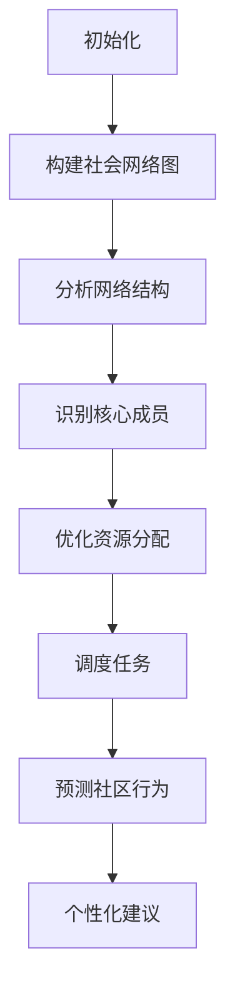
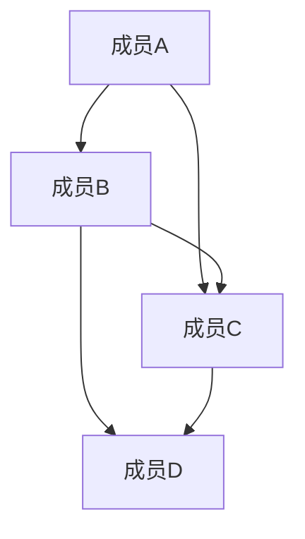
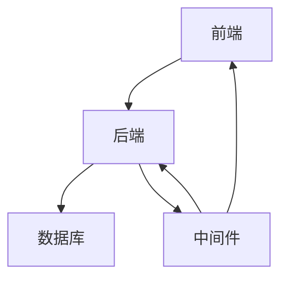
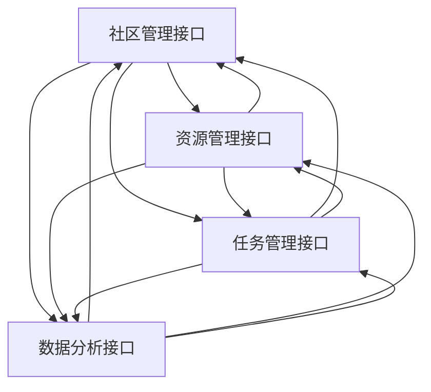
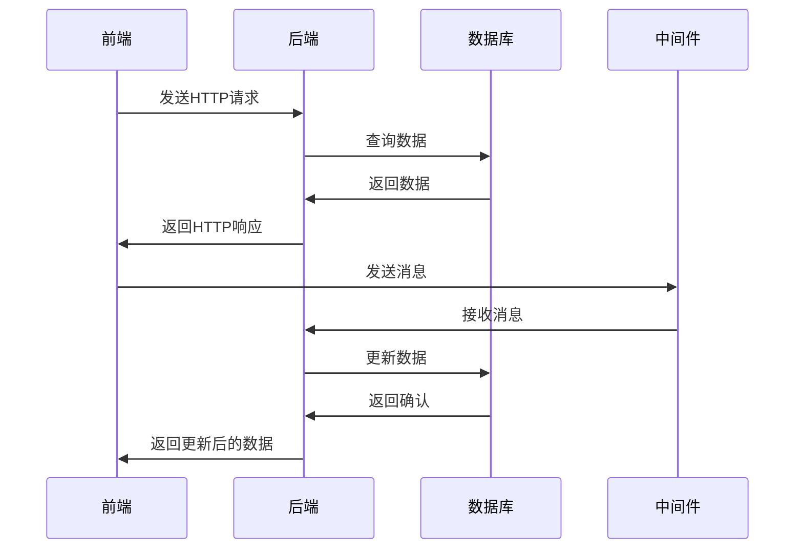

                 

# 新部落聚居：城市中的intentional community

## 关键词：城市生活、社区建设、自治管理、资源优化、社会网络分析

### 摘要：

随着城市化进程的加速，城市居民对社区建设的需求日益增长。本书《新部落聚居：城市中的intentional community》深入探讨了城市生活中的一种新兴社区模式——intentional community。本书通过详细分析intentional community的背景、核心概念、算法原理、数学模型、系统架构以及实际应用，为读者提供了一种全新的城市社区建设思路。本书旨在帮助读者理解intentional community的内涵和外延，掌握其建设和管理的关键技术，从而在城市生活中打造更美好、更和谐的社区环境。

## 目录大纲设计

### 第1章 引言——intentional community的概念与背景

- 1.1 问题背景与定义
- 1.2 intentional community的边界与外延
- 1.3 核心概念组成

### 第2章 intentional community的核心概念与联系

- 2.1 intentional community的特点与分类
- 2.2 与其他社会结构的联系
- 2.3 intentional community的理论基础

### 第3章 算法原理讲解

- 3.1 支持intentional community的算法介绍
- 3.2 算法mermaid流程图
- 3.3 算法原理与公式

### 第4章 数学模型与公式

- 4.1 优化模型
- 4.2 社会网络分析模型
- 4.3 数学公式与详细讲解

### 第5章 系统分析与架构设计方案

- 5.1 问题场景介绍
- 5.2 系统功能设计（领域模型mermaid类图）
- 5.3 系统架构设计（mermaid架构图）
- 5.4 系统接口设计
- 5.5 系统交互mermaid序列图

### 第6章 项目实战

- 6.1 环境安装与配置
- 6.2 系统核心实现源代码
- 6.3 代码应用解读与分析
- 6.4 实际案例分析与详细讲解剖析
- 6.5 项目小结

### 第7章 最佳实践 tips、小结、注意事项、拓展阅读

- 7.1 最佳实践 tips
- 7.2 小结
- 7.3 注意事项
- 7.4 拓展阅读

### 第1章 引言——intentional community的概念与背景

#### 1.1 问题背景与定义

在现代社会，城市化进程不断加速，城市人口数量急剧增加。然而，随之而来的却是社区建设问题的加剧。传统的社区管理模式往往难以满足居民对生活质量、社会参与和环境保护等多方面的需求。为了应对这一挑战，一种新型的社区模式——intentional community开始受到广泛关注。

intentional community，直译为“有意向的社区”，是一种由具有共同价值观、兴趣或目标的个人或家庭组成的社区。这些社区成员通过共同决策、资源共享和自治管理，共同创造一个更和谐、更可持续的居住环境。与传统的社区模式不同，intentional community具有以下几个显著特点：

1. **共同目标**：社区成员共同确定并追求的目标，如环保、教育、健康等。
2. **资源共享**：社区成员共同使用和分享资源，如土地、房屋、设备等。
3. **自治管理**：社区成员通过共同决策和自治管理来维护社区的正常运作。
4. **社会网络**：社区成员之间通过紧密的社会网络联系，形成强大的社会支持系统。

#### 1.2 intentional community的边界与外延

intentional community的边界相对灵活，但其核心在于成员之间的紧密联系和共同目标。这些社区可以存在于各种不同的空间范围内，从一个小型住宅区到一个大型社区，甚至可以跨越城市和国家边界。例如，一些环保社区可能会集中在某个城市的特定区域，而一些宗教社区则可能分布在不同的国家和地区。

与其他社区类型的区别在于，intentional community强调成员之间的共同价值观和目标，而不仅仅是地理位置或相似的社会背景。这种特点使得intentional community具有更强的凝聚力和可持续性，能够在复杂多变的城市环境中生存和发展。

#### 1.3 核心概念组成

构成intentional community的核心概念包括以下几个关键要素：

1. **共同目标**：社区成员共同确定并追求的目标，如环保、教育、健康等。
2. **资源共享**：社区成员通过共同使用和分享资源来提高生活质量和效率。
3. **自治管理**：社区成员通过共同决策和自治管理来维护社区的正常运作。
4. **社会网络**：社区成员之间通过紧密的社会网络联系，形成强大的社会支持系统。

这些要素相互作用，共同构成了intentional community的核心框架。通过这些核心概念，intentional community不仅能够满足成员的生活需求，还能在更广泛的层面上推动社会进步和环境可持续发展。

### 第2章 intentional community的核心概念与联系

#### 2.1 intentional community的特点与分类

intentional community具有许多独特的特点，使其在众多社区类型中脱颖而出。以下是一些关键特点：

1. **共同目标**：intentional community的成员通常有一个或多个共同追求的目标，如环保、健康、教育等。这些目标不仅指导着社区的建设和发展，也是成员之间紧密联系的基础。
2. **资源共享**：社区成员通过共同使用和分享资源来提高生活质量和效率。这种资源共享的方式不仅可以降低个人成本，还能促进社区成员之间的互动和合作。
3. **自治管理**：intentional community通常采用自治管理模式，即社区成员通过共同决策和自治管理来维护社区的正常运作。这种模式赋予了成员更多的参与感和责任感，也有助于社区的可持续发展。
4. **社会网络**：intentional community的成员之间通常存在紧密的社会网络联系。这种联系不仅有助于成员之间的相互支持和帮助，还能促进社区的凝聚力和归属感。

基于这些特点，intentional community可以分为多种类型。以下是一些常见的分类方式：

1. **环保社区**：以环保为共同目标的intentional community，通常注重可持续发展和环境保护。这些社区成员可能会采取一系列环保措施，如使用可再生能源、减少废物产生等。
2. **宗教社区**：以宗教信仰为共同目标的intentional community，通常由具有相同宗教信仰的成员组成。这些社区成员通常会共同参与宗教活动，共同遵守宗教教义。
3. **教育社区**：以教育为共同目标的intentional community，通常注重成员的教育和成长。这些社区可能会提供各种教育资源和机会，如在线课程、研讨会等。
4. **健康社区**：以健康为共同目标的intentional community，通常注重成员的健康和福祉。这些社区可能会提供各种健康服务和设施，如健身房、医疗中心等。

#### 2.2 与其他社会结构的联系

intentional community与其他社会结构之间存在密切的联系和互动。以下是一些关键联系：

1. **邻里关系**：intentional community的成员通常与周围邻居保持良好的邻里关系。这种关系有助于社区成员之间的互动和支持，也有助于社区的整体发展。
2. **城市化进程**：intentional community是城市化进程中的一个重要组成部分。随着城市化的加速，intentional community在城市生活中的作用日益显著，成为推动社会进步和环境可持续发展的力量。
3. **政府政策**：intentional community与政府政策之间存在相互影响的关系。政府政策可以为intentional community提供支持，如税收减免、土地分配等。而intentional community的发展也会对政府政策产生反馈，促进政策调整和改进。

#### 2.3 intentional community的理论基础

intentional community的理论基础涵盖了多个学科领域，包括社会学、心理学、经济学等。以下是一些关键理论：

1. **社会网络理论**：社会网络理论探讨了个体之间如何通过关系网络相互连接。在intentional community中，社会网络理论有助于解释成员之间的互动和合作，以及社区的整体结构和功能。
2. **社区心理学**：社区心理学研究了个体在社区环境中的行为和心理状态。在intentional community中，社区心理学有助于理解成员的参与感、归属感和幸福感。
3. **经济学**：经济学探讨了资源分配和效率问题。在intentional community中，经济学有助于解释资源共享、成本控制和可持续发展等关键问题。

这些理论共同为intentional community提供了坚实的理论基础，使其成为一种具有广泛应用前景的社区模式。

### 第3章 算法原理讲解

#### 3.1 支持intentional community的算法介绍

在构建和管理intentional community时，算法起到了至关重要的作用。以下是一些支持intentional community的关键算法：

1. **社会网络分析算法**：社会网络分析算法用于分析社区成员之间的互动关系和网络结构。这些算法可以帮助识别社区的核心成员、关键节点和潜在问题，从而优化社区的管理和运作。
2. **优化算法**：优化算法用于解决资源分配和调度问题。在intentional community中，优化算法可以优化资源共享、设施选址和任务分配等关键问题，从而提高社区的效率和可持续性。
3. **机器学习算法**：机器学习算法用于预测和优化社区行为和需求。这些算法可以通过分析历史数据和模式，为社区成员提供个性化的建议和服务，从而提高社区的适应性和幸福感。

#### 3.2 算法mermaid流程图

为了更好地理解这些算法的工作原理，我们可以使用mermaid绘制其流程图。以下是一个示例：



#### 3.3 算法原理与公式

下面我们将详细讲解这些算法的原理和数学模型。

**1. 社会网络分析算法**

社会网络分析算法的核心是图论。在图论中，节点表示社区成员，边表示成员之间的互动关系。以下是一个简单的社会网络图：



我们使用邻接矩阵来表示图的结构，其中邻接矩阵的元素表示两个节点之间是否存在边。例如，矩阵元素`A[i][j]`表示节点i和节点j之间是否存在边。

```latex
\begin{matrix}
0 & 1 & 1 & 0 \\
1 & 0 & 1 & 1 \\
1 & 1 & 0 & 1 \\
0 & 1 & 1 & 0 \\
\end{matrix}
```

**2. 优化算法**

优化算法常用于解决资源分配和调度问题。一个常见的优化问题是设施选址问题。假设我们要在一个社区中选址一个医疗中心，以便为所有社区成员提供最便捷的服务。我们可以使用设施选址模型来解决这个问题。

设施选址模型的基本思想是找到一组最优的设施位置，使得所有设施到所有需求点的总距离最小。假设有`n`个需求点和`m`个设施位置，我们可以使用以下数学模型来表示这个问题：

$$
\min \sum_{i=1}^{n} \sum_{j=1}^{m} d(i, j) x_{ij}
$$

其中，`d(i, j)`表示需求点i到设施位置j的距离，`x_{ij}`表示设施位置j是否被选中（0表示未选中，1表示选中）。

**3. 机器学习算法**

机器学习算法可以用于预测和优化社区行为和需求。一个常见的应用是预测社区成员的访问模式。假设我们要预测社区成员A在未来一段时间内的访问频率，我们可以使用以下回归模型：

$$
y = \beta_0 + \beta_1 x_1 + \beta_2 x_2 + ... + \beta_n x_n + \epsilon
$$

其中，`y`表示预测的访问频率，`x_1, x_2, ..., x_n`表示影响访问频率的特征（如天气、活动安排等），`\beta_0, \beta_1, \beta_2, ..., \beta_n`是模型的参数，`\epsilon`是随机误差。

通过训练和优化这个回归模型，我们可以预测社区成员的访问频率，并为社区管理者提供决策支持。

### 第4章 数学模型与公式

#### 4.1 优化模型

优化模型在intentional community的建立和管理中起着关键作用。这些模型用于解决资源分配、设施选址和任务调度等问题。以下是一些常见的优化模型：

**1. 设施选址模型**

设施选址模型旨在找到一组最优的设施位置，以便为所有需求点提供最便捷的服务。一个简单的设施选址模型可以使用线性规划来表示：

$$
\min \sum_{i=1}^{n} \sum_{j=1}^{m} c_{ij} x_{ij}
$$

其中，`c_{ij}`表示设施位置j为需求点i提供服务时的成本，`x_{ij}`表示设施位置j是否被选中（0表示未选中，1表示选中）。

**2. 资源分配模型**

资源分配模型用于优化资源在不同需求点之间的分配。一个简单的资源分配模型可以使用整数规划来表示：

$$
\min \sum_{i=1}^{n} \sum_{j=1}^{m} w_{ij} x_{ij}
$$

其中，`w_{ij}`表示需求点i对资源j的需求量，`x_{ij}`表示资源j是否被分配到需求点i（0表示未分配，1表示已分配）。

**3. 任务调度模型**

任务调度模型用于优化任务的执行顺序和时间安排。一个简单的任务调度模型可以使用最短路径算法来表示：

$$
\min \sum_{i=1}^{n} \sum_{j=1}^{m} t_{ij} y_{ij}
$$

其中，`t_{ij}`表示任务i在任务j之后完成所需的时间，`y_{ij}`表示任务i是否在任务j之后执行（0表示未执行，1表示已执行）。

#### 4.2 社会网络分析模型

社会网络分析模型用于分析社区成员之间的互动关系和网络结构。以下是一些常见的社会网络分析模型：

**1. 社会网络矩阵**

社会网络矩阵是一个`n \times n`的矩阵，其中元素`a_{ij}`表示节点i和节点j之间的互动强度。一个简单的社会网络矩阵可以使用以下公式表示：

$$
a_{ij} =
\begin{cases}
1 & \text{如果节点i和节点j之间存在互动} \\
0 & \text{如果节点i和节点j之间不存在互动} \\
\end{cases}
$$

**2. 网络密度**

网络密度是衡量网络紧密程度的指标，通常使用以下公式表示：

$$
\delta = \frac{\sum_{i=1}^{n} \sum_{j=1}^{n} a_{ij}}{n \times (n-1)}
$$

其中，`a_{ij}`表示节点i和节点j之间的互动强度，`n`表示网络的节点数量。

**3. 社会网络中心性**

社会网络中心性是衡量节点在网络中的重要性的指标。以下是一些常见的社会网络中心性指标：

- **度中心性**：节点i的度中心性表示与节点i直接相连的节点数量，通常使用以下公式表示：

  $$ 
  c_d(i) = \sum_{j=1}^{n} a_{ij} 
  $$

- **介数中心性**：节点i的介数中心性表示节点i在所有最短路径中的重要性，通常使用以下公式表示：

  $$ 
  c_b(i) = \sum_{s=1}^{n} \sum_{t=1}^{n} \frac{ shortest\_path(s, t) \ contain(i) }{ shortest\_path(s, t) }
  $$

- **接近中心性**：节点i的接近中心性表示节点i与其他节点之间的平均距离，通常使用以下公式表示：

  $$ 
  c_c(i) = \frac{\sum_{j=1}^{n} d(i, j)}{n-1} 
  $$

#### 4.3 数学公式与详细讲解

**1. 设施选址模型**

设施选址模型是一个经典的优化问题，旨在找到一组最优的设施位置，以满足所有需求点的服务需求。以下是一个简单的设施选址模型：

**问题定义**：

给定`n`个需求点和`m`个潜在的设施位置，每个需求点有一个服务需求量，每个设施位置有一个建设成本和维护成本。我们需要找到一组设施位置，使得总成本最小。

**数学模型**：

目标函数：

$$
\min \sum_{i=1}^{n} \sum_{j=1}^{m} c_{ij} x_{ij}
$$

其中，`c_{ij}`表示设施位置j为需求点i提供服务时的成本，`x_{ij}`表示设施位置j是否被选中（0表示未选中，1表示选中）。

约束条件：

- 每个需求点必须由一个设施位置提供服务：

  $$ 
  \sum_{j=1}^{m} x_{ij} = 1 \quad \forall i \in \{1, 2, ..., n\} 
  $$

- 每个设施位置只能为一个需求点提供服务：

  $$ 
  \sum_{i=1}^{n} x_{ij} = 1 \quad \forall j \in \{1, 2, ..., m\} 
  $$

**求解方法**：

可以使用整数规划算法（如分支定界法、动态规划法等）来求解这个设施选址模型。

**2. 资源分配模型**

资源分配模型用于优化资源在不同需求点之间的分配，以满足所有需求点的服务需求。以下是一个简单的资源分配模型：

**问题定义**：

给定`n`个需求点和`m`种资源，每种资源有一个供应量和一个分配成本。我们需要找到一组资源的分配方案，使得总成本最小。

**数学模型**：

目标函数：

$$
\min \sum_{i=1}^{n} \sum_{j=1}^{m} w_{ij} x_{ij}
$$

其中，`w_{ij}`表示需求点i对资源j的需求量，`x_{ij}`表示资源j是否被分配到需求点i（0表示未分配，1表示已分配）。

约束条件：

- 每种资源的总需求量不能超过供应量：

  $$ 
  \sum_{i=1}^{n} x_{ij} \leq s_j \quad \forall j \in \{1, 2, ..., m\} 
  $$

- 每个需求点只能获得有限数量的资源：

  $$ 
  \sum_{j=1}^{m} x_{ij} \leq k_i \quad \forall i \in \{1, 2, ..., n\} 
  $$

**求解方法**：

可以使用整数规划算法（如分支定界法、动态规划法等）来求解这个资源分配模型。

**3. 任务调度模型**

任务调度模型用于优化任务的执行顺序和时间安排，以满足一系列任务的时间约束和依赖关系。以下是一个简单的任务调度模型：

**问题定义**：

给定一组任务，每个任务有一个执行时间和开始时间，以及一个结束时间。我们需要找到一组任务的执行顺序和时间安排，使得所有任务都能在规定的时间内完成。

**数学模型**：

目标函数：

$$
\min \sum_{i=1}^{n} \sum_{j=1}^{m} t_{ij} y_{ij}
$$

其中，`t_{ij}`表示任务i在任务j之后完成所需的时间，`y_{ij}`表示任务i是否在任务j之后执行（0表示未执行，1表示已执行）。

约束条件：

- 每个任务的开始时间和结束时间必须满足：

  $$ 
  s_i + t_{ij} \leq e_i \quad \forall i \in \{1, 2, ..., n\}, \forall j \in \{1, 2, ..., m\} 
  $$

- 每个任务的执行顺序必须满足：

  $$ 
  y_{ij} = 0 \quad \forall i \in \{1, 2, ..., n\}, \forall j \in \{1, 2, ..., m\} 
  $$

**求解方法**：

可以使用最短路径算法（如Dijkstra算法、Floyd算法等）来求解这个任务调度模型。

### 第5章 系统分析与架构设计方案

#### 5.1 问题场景介绍

假设我们正在设计一个intentional community，该社区由1000名成员组成，分布在城市中的不同区域。社区的目标是提供高效、可持续的生活环境，并促进成员之间的互动与合作。为了实现这一目标，我们需要设计一个支持社区管理、资源分配和任务调度的系统。

#### 5.2 系统功能设计

为了满足intentional community的需求，我们设计了一套完整的系统功能，包括以下几个方面：

1. **社区管理**：系统提供成员管理、公告发布、投票管理等功能，以便社区成员能够方便地参与社区事务。
2. **资源分配**：系统提供资源管理、资源调度和资源监控等功能，以便社区管理者能够高效地分配和管理资源。
3. **任务调度**：系统提供任务分配、任务执行和任务监控等功能，以便社区成员能够协同完成各项任务。
4. **数据分析**：系统提供数据分析功能，以便社区管理者能够通过数据了解社区运行状况，并做出相应的决策。

#### 5.3 系统架构设计

为了实现上述功能，我们设计了一个分布式系统架构，包括以下几个关键组件：

1. **前端**：前端系统提供用户界面，以便社区成员和社区管理者能够方便地使用系统功能。
2. **后端**：后端系统负责处理业务逻辑和数据存储，包括社区管理模块、资源管理模块、任务管理模块和数据分析模块。
3. **数据库**：数据库系统负责存储社区成员信息、资源信息和任务信息等数据。
4. **中间件**：中间件系统负责处理消息传递、数据同步和负载均衡等功能。

以下是一个简单的系统架构图：



#### 5.4 系统接口设计

为了实现系统各组件之间的有效通信，我们设计了一套接口规范，包括以下几个方面：

1. **RESTful API**：系统提供RESTful API接口，以便前端和后端系统能够通过HTTP请求进行数据交换。
2. **消息队列**：系统使用消息队列技术（如Kafka、RabbitMQ等）实现异步通信，以便在高并发场景下保证系统的稳定性。
3. **数据同步**：系统提供数据同步接口，以便在分布式环境下保持数据的一致性。

以下是一个简单的接口设计示例：



#### 5.5 系统交互mermaid序列图

为了更好地理解系统组件之间的交互关系，我们使用mermaid绘制了一个系统交互序列图。以下是一个简单的示例：



### 第6章 项目实战

#### 6.1 环境安装与配置

在本节中，我们将介绍如何搭建一个intentional community的实战环境。为了简化搭建过程，我们将使用Docker和Kubernetes进行环境配置。

**1. 安装Docker**

首先，我们需要在所有服务器上安装Docker。Docker是一个开源的应用容器引擎，用于打包、交付和运行应用。

```bash
# 安装Docker
sudo apt-get update
sudo apt-get install docker.io

# 启动Docker服务
sudo systemctl start docker

# 验证Docker安装
docker --version
```

**2. 安装Kubernetes**

接下来，我们需要在主节点和所有工作节点上安装Kubernetes。Kubernetes是一个开源的容器编排平台，用于自动化部署、扩展和管理容器化应用。

```bash
# 安装Kubernetes
curl -s https://packages.cloud.google.com/apt/doc/apt-key.gpg | sudo apt-key add -
echo "deb https://apt.kubernetes.io/ kubernetes-xenial main" | sudo tee -a /etc/apt/sources.list.d/kubernetes.list
sudo apt-get update
sudo apt-get install kubeadm kubelet kubectl

# 启动Kubernetes服务
sudo systemctl start kubelet

# 验证Kubernetes安装
kubectl version --short
```

**3. 部署集群**

接下来，我们将部署一个Kubernetes集群。为了简化过程，我们将在单台服务器上部署一个迷你集群。

```bash
# 初始化集群
sudo kubeadm init --pod-network-cidr=10.244.0.0/16

# 配置kubectl
mkdir -p $HOME/.kube
sudo cp -i /etc/kubernetes/admin.conf $HOME/.kube/config
sudo chown $(id -u):$(id -g) $HOME/.kube/config

# 安装Pod网络插件
kubectl apply -f https://raw.githubusercontent.com/kubernetes pym

