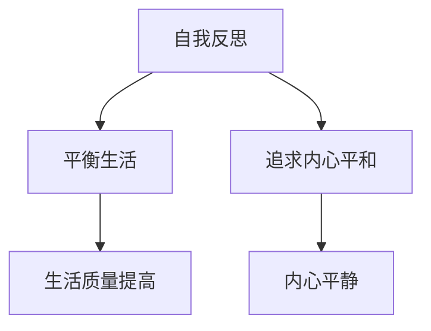

                 

**# 新隐士主义：都市中的精神隐居实践**

> **关键词**：新隐士主义、都市生活、精神健康、实践方法、平衡

**摘要**：随着现代都市的快节奏生活，人们越来越感到压力和焦虑。新隐士主义作为一种精神隐居实践，旨在帮助都市人找到内心的宁静。本文将深入探讨新隐士主义的定义、背景、实践方法以及在都市生活中的应用，并展望其未来。

----------------------------------------------------------------

**# 第一部分：引言**

**## 1.1 新隐士主义概述**

新隐士主义（Neo-Hermitism）是一种现代生活哲学，源自于传统隐士文化。它强调个人对内心的探索与安宁，追求精神上的满足与自由。与传统隐士主义不同的是，新隐士主义并不排斥都市生活，而是在现代都市环境中寻找精神净土。

**## 1.2 现代都市背景下的精神需求**

现代都市生活充满了快节奏和高压力，人们往往感到身心疲惫。根据世界卫生组织（WHO）的数据，精神疾病已成为全球第二大疾病负担。因此，都市人迫切需要一种方法来缓解精神压力，重获内心的宁静。

**## 1.3 精神隐居的重要性**

精神隐居不仅仅是逃避现实，而是一种积极的自我修养方式。它可以帮助人们减少焦虑、提高幸福感，从而更好地适应都市生活。

----------------------------------------------------------------

**# 第二部分：新隐士主义理念解读**

**## 2.1 新隐士主义的核心价值观**

新隐士主义的核心价值观包括自我反思、平衡生活、追求内心平和等。这些价值观旨在帮助人们摆脱外在的诱惑，专注于内在的成长。

**## 2.2 新隐士主义与传统隐士的区别**

传统隐士主义强调远离尘世，而新隐士主义则强调在都市中寻找精神的净土。两者在追求内心平静的方式上有所不同，但都强调了精神层面的自我修养。

----------------------------------------------------------------

**# 第三部分：都市生活中的精神隐居实践**

**## 3.1 实践一：平衡工作与生活**

在现代都市中，工作与生活的平衡是精神隐居的第一步。以下是几种平衡工作与生活的方法：

1. **时间管理**：合理安排时间，确保工作和休息的平衡。
2. **设定边界**：明确工作和生活的界限，避免工作侵占私人时间。
3. **自我关怀**：定期进行放松和自我反思，以缓解压力。

**## 3.2 实践二：营造自我空间**

自我空间是精神隐居的重要组成部分。以下是一些建立自我空间的方法：

1. **居家装饰**：通过布置居家环境，营造一个舒适、宁静的空间。
2. **个人爱好**：培养个人爱好，如阅读、绘画、音乐等，以丰富自我空间。
3. **日常习惯**：通过建立日常习惯，如晨跑、冥想等，来维持自我空间的完整性。

**## 3.3 实践三：心灵修行与冥想**

心灵修行与冥想是精神隐居的重要途径。以下是一些建议：

1. **选择适合自己的修行方法**：如瑜伽、禅修等。
2. **持之以恒**：修行需要时间和耐心，只有持之以恒才能看到成效。
3. **寻找指导**：寻求专业人士的指导，以更好地进行心灵修行。

----------------------------------------------------------------

**# 第四部分：新隐士主义在都市中的实现**

**## 4.1 实现路径与方法**

实现新隐士主义需要以下路径和方法：

1. **自我反思**：定期进行自我反思，了解自己的内心需求和目标。
2. **实践行动**：将理念转化为实际行动，如调整生活方式、培养个人爱好等。
3. **社区参与**：加入相关社区，与他人分享经验和心得，互相鼓励和支持。

**## 4.2 实现中的挑战与应对**

在实现新隐士主义的过程中，人们可能会面临以下挑战：

1. **社会压力**：都市生活压力大，需要学会应对各种压力。
2. **时间管理**：合理安排时间，确保工作与生活的平衡。
3. **内心冲突**：在追求内心平静的过程中，可能会遇到内心的冲突和挣扎。

应对挑战的方法包括：

1. **寻求专业帮助**：如心理咨询师、生活教练等。
2. **培养兴趣爱好**：通过兴趣爱好来缓解压力和焦虑。
3. **定期休息**：确保有足够的休息时间，以维持身心健康。

**## 4.3 案例研究：成功的新隐士实例**

以下是几位成功的新隐士实例：

1. **艺术家张三**：通过绘画和音乐来表达内心世界，找到了自己的精神家园。
2. **程序员李四**：通过编程和冥想，找到了平衡工作和生活的秘诀。
3. **创业者王五**：通过创业和心灵修行，实现了个人成长和社会价值的双重提升。

----------------------------------------------------------------

**# 第五部分：新隐士主义的未来展望**

**## 5.1 新隐士主义的潜在影响**

新隐士主义可能对现代社会产生深远的影响：

1. **心理健康**：提高人们的心理健康水平，减少精神疾病的发病率。
2. **社会文化**：推动社会向更加关注个体内心需求的方向发展。
3. **经济发展**：促进健康产业的发展，如心理健康咨询、冥想课程等。

**## 5.2 社会与文化变革的可能性**

新隐士主义可能引发以下社会与文化变革：

1. **价值观转变**：人们更加重视内心的满足和幸福感。
2. **生活方式**：更多人开始关注精神健康，追求简单、有意义的生活。
3. **社会结构**：社会结构可能向更加平等、多元的方向发展。

**## 5.3 个人与社会之间的平衡**

新隐士主义强调个人与社会之间的平衡：

1. **自我成长**：通过精神修养来实现个人成长。
2. **社会责任**：在追求个人幸福的同时，也承担起社会责任。
3. **可持续性**：追求可持续的生活方式，如环保、节能等。

----------------------------------------------------------------

**# 第六部分：结语与行动指南**

**## 6.1 结语**

新隐士主义为都市人提供了一种寻找内心宁静的方法。它不仅有助于个人心理健康，也对社会文化产生积极影响。通过实践新隐士主义，我们可以实现个人成长和社会进步的双赢。

**## 6.2 行动指南**

以下是一些建议，帮助您开始新隐士主义的实践：

1. **自我反思**：定期进行自我反思，了解自己的内心需求和目标。
2. **实践行动**：从调整生活方式、培养个人爱好开始，逐步实现精神隐居。
3. **寻求支持**：加入相关社区，与他人分享经验和心得，互相鼓励和支持。
4. **专业指导**：如有需要，寻求心理咨询师、生活教练等专业人士的指导。

----------------------------------------------------------------

**作者**：AI天才研究院/AI Genius Institute & 禅与计算机程序设计艺术 /Zen And The Art of Computer Programming

----------------------------------------------------------------

**# 1.1 新隐士主义概述**

新隐士主义，简而言之，是一种在现代社会中寻求内心平静和自我实现的哲学。它并不是简单地逃离都市生活，而是在繁忙的都市环境中寻找一种精神上的隐居方式。这种隐居方式并不是孤立的、消极的，而是积极地寻找自我与社会的平衡。

### **核心概念术语说明**

- **新隐士主义（Neo-Hermitism）**：一种现代生活哲学，强调在都市环境中追求内心宁静。
- **精神隐居（Spiritual Seclusion）**：通过内在修行和自我反思来获得精神上的满足和自由。
- **都市生活（Urban Life）**：在城市中过着日常生活的状态。

### **问题背景**

现代社会，尤其是大城市，人们的生活节奏快，工作压力大，精神压力大。根据世界卫生组织（WHO）的数据，精神疾病已成为全球第二大疾病负担。因此，如何在一个繁忙的环境中找到内心的宁静，成为了许多人关注的焦点。

### **问题描述**

现代都市人在追求物质生活的同时，往往忽视了精神层面的需求。这种精神上的空虚和焦虑，使得许多人感到生活失去了意义。因此，如何在一个快节奏、高压力的都市环境中实现精神隐居，成为了亟待解决的问题。

### **问题解决**

新隐士主义提供了一种可能的解决方案。它鼓励人们在都市生活中寻找精神净土，通过自我反思、心灵修行等方法来缓解精神压力，提高幸福感。这种哲学不仅关注个人的精神健康，也关注社会的整体福祉。

### **边界与外延**

新隐士主义并不是要求人们完全逃离都市生活，而是在都市生活中寻找一种平衡。它关注的是如何在繁忙的都市环境中，通过内在的修养来实现精神的自由与宁静。

### **概念结构与核心要素组成**

新隐士主义的核心要素包括：

- **自我反思**：通过反思来了解自己的内心需求和目标。
- **心灵修行**：通过冥想、瑜伽等方式来提高精神层次。
- **生活方式**：通过调整生活方式来减少精神压力。

----------------------------------------------------------------

**# 2.1 新隐士主义的核心价值观**

新隐士主义的核心价值观包括自我反思、平衡生活、追求内心平和等。这些价值观不仅为个人提供了精神上的指导，也为社会带来了一种新的生活哲学。

### **核心概念原理**

新隐士主义的核心概念原理在于，通过内在的修养和自我反思来实现精神上的满足和自由。它强调的是个人内心的成长和自我实现，而不仅仅是物质上的满足。

### **概念属性特征对比表格**

| 概念属性 | 自我反思 | 平衡生活 | 追求内心平和 |
| --- | --- | --- | --- |
| 定义 | 通过反思来了解自己的内心需求和目标 | 通过合理安排时间，确保工作和生活的平衡 | 通过冥想、瑜伽等方式来提高精神层次 |
| 目标 | 实现个人成长和自我实现 | 提高生活质量，减少精神压力 | 获得内心的平静和自由 |
| 关系 | 相互支持，共同构成新隐士主义的核心价值观 | | |

### **ER实体关系图架构的Mermaid流程图**

----------------------------------------------------------------

**# 3.1 实践一：平衡工作与生活**

在现代都市中，工作与生活的平衡是精神隐居实践的重要一环。由于工作压力和社会责任的增加，很多人在忙碌的工作中忽视了个人生活的重要性。这种不平衡的状态会导致精神压力增加，甚至引发心理健康问题。因此，平衡工作与生活对于精神隐居至关重要。

### **实践方法与技巧**

#### **时间管理**

时间管理是平衡工作与生活的基础。以下是一些时间管理的方法：

1. **制定日程表**：将每天的工作和个人时间都列入日程表，确保时间安排得井井有条。
2. **优先级排序**：将任务按照重要性和紧急性进行排序，优先处理最重要的任务。
3. **避免拖延**：设定明确的目标和时间限制，避免拖延，提高工作效率。

#### **设定边界**

设定边界是确保工作和生活分离的关键。以下是一些建议：

1. **工作时间明确**：在规定的工作时间内全力以赴，避免将工作带到个人时间。
2. **个人时间保护**：在个人时间内，尽量减少工作干扰，比如关闭手机、电子邮件等。
3. **明确沟通**：与同事和家人明确沟通工作时间和个人时间，避免误解和冲突。

#### **自我关怀**

自我关怀是平衡工作与生活的重要组成部分。以下是一些自我关怀的方法：

1. **定期休息**：确保每天有足够的休息时间，如午休、周末休息等。
2. **运动锻炼**：定期进行体育锻炼，如跑步、瑜伽等，以保持身心健康。
3. **兴趣爱好**：培养个人爱好，如阅读、绘画、音乐等，以丰富个人生活。

### **成功案例分享**

以下是一些平衡工作与生活的成功案例：

#### **程序员李四**

程序员李四在一家知名互联网公司工作，由于工作繁忙，他一度感到身心俱疲。为了平衡工作与生活，他采取了以下措施：

1. **制定日程表**：每天制定详细的工作计划，确保工作时间和个人时间的分离。
2. **运动锻炼**：每天早晨进行跑步锻炼，以提高身体素质和精力。
3. **兴趣爱好**：利用周末时间学习吉他，培养个人爱好，放松心情。

经过一段时间的实践，李四的工作效率提高了，同时他的身心健康也得到了显著改善。

#### **企业家王五**

企业家王五在经营自己的公司时，面临着巨大的工作压力。为了平衡工作与生活，他采取了以下措施：

1. **设定边界**：在工作时间内全力以赴，避免将工作带到个人时间。
2. **家庭时间**：每周固定一天为家庭时间，与家人共度美好时光。
3. **心理咨询**：定期进行心理咨询，以缓解工作压力，保持心理健康。

王五通过这些措施，不仅提高了工作效率，也增强了家庭的凝聚力，实现了工作与生活的平衡。

### **实践效果**

通过平衡工作与生活，人们可以获得以下效果：

1. **提高工作效率**：通过合理安排时间，提高工作效率，减少工作压力。
2. **提高生活质量**：通过自我关怀和兴趣爱好，提高生活质量，增强幸福感。
3. **促进身心健康**：通过定期休息和运动锻炼，促进身心健康，减少疾病风险。

### **实践建议**

以下是一些建议，帮助您平衡工作与生活：

1. **制定日程表**：合理安排工作和个人时间，确保时间分配合理。
2. **设定边界**：明确工作和个人时间的界限，避免工作侵占个人时间。
3. **自我关怀**：定期休息，进行运动锻炼，培养个人爱好，以保持身心健康。
4. **寻求支持**：与家人、朋友分享您的实践经验和挑战，寻求他们的支持和理解。

通过这些实践方法，您可以更好地平衡工作与生活，实现精神隐居的目标。

----------------------------------------------------------------

**# 3.2 实践二：营造自我空间**

自我空间是精神隐居实践的重要组成部分。在现代都市中，由于生活节奏快、工作压力大，很多人感到内心空虚和焦虑。营造一个属于自己的自我空间，可以帮助人们缓解压力，提高生活质量。

### **实践方法与技巧**

#### **居家装饰**

居家装饰是营造自我空间的第一步。以下是一些居家装饰的建议：

1. **选择合适的家具和摆件**：选择舒适、简约的家具和摆件，营造一个温馨、放松的环境。
2. **布置绿色植物**：在室内摆放一些绿色植物，如盆栽、吊兰等，以增加氧气含量，提升室内空气质量。
3. **个性化装饰**：根据自己的兴趣和喜好，添加个性化的装饰品，如照片墙、艺术品等，以增强空间氛围。

#### **个人爱好**

个人爱好是丰富自我空间的重要途径。以下是一些建议：

1. **阅读**：阅读是一种很好的放松方式，可以培养思维深度和知识广度。建议选择一些与自己兴趣相关的书籍，如小说、哲学、心理学等。
2. **绘画和手工艺**：绘画和手工艺可以帮助人们释放压力，培养创造力和审美能力。可以选择一些简单的绘画课程或手工艺教程，开始自己的创作之旅。
3. **音乐**：音乐是一种强大的情绪调节工具，可以舒缓情绪，提升心情。可以尝试学习一种乐器，如吉他、钢琴等，或参加音乐鉴赏课程，提高音乐素养。

#### **日常习惯**

建立日常习惯是维持自我空间的关键。以下是一些日常习惯的建议：

1. **早晨冥想**：每天早晨进行冥想，可以帮助人们平静心境，迎接新的一天。
2. **睡前放松**：在睡前进行一些放松活动，如深呼吸、瑜伽等，可以帮助人们更好地入睡，保持身心健康。
3. **定期清理**：定期清理居住空间，保持室内整洁，有助于提高生活质量和心情。

### **成功案例分享**

以下是一些营造自我空间的成功案例：

#### **艺术家张三**

张三是一位热爱艺术的都市人，他在家中布置了一个专门的绘画工作室。他每天都会在工作室里画画，享受创作的过程。通过这种方式，他不仅提高了自己的艺术水平，也找到了内心的平静和满足。

#### **程序员李四**

李四是一名程序员，他在家中设立了一个专门的阅读角落。他喜欢在阅读角落里读书、学习，有时候还会写一些代码。这个角落让他感到放松和自由，帮助他更好地处理工作压力。

#### **创业者王五**

王五是一位创业者，他在家中设立了一个冥想室。他每天都会在冥想室里冥想，以缓解工作压力和焦虑。这个冥想室成为了他的精神庇护所，帮助他保持内心的平静和专注。

### **实践效果**

通过营造自我空间，人们可以获得以下效果：

1. **缓解压力**：自我空间可以帮助人们远离繁忙的工作和社交活动，获得放松和宁静。
2. **提高生活质量**：一个舒适的自我空间可以提高人们的生活质量，提升幸福感。
3. **促进身心健康**：自我空间的建立有助于促进身心健康，减少焦虑和抑郁等心理问题。

### **实践建议**

以下是一些建议，帮助您营造自我空间：

1. **选择合适的位置**：选择一个安静的角落，避免工作区和居住区的干扰。
2. **合理规划空间**：根据个人需求和兴趣，合理规划空间布局，确保空间功能的最大化。
3. **保持清洁与整洁**：定期清理和整理空间，保持室内整洁，有助于提高生活质量和心情。
4. **个性化装饰**：根据自己的兴趣和喜好，添加个性化的装饰品，营造一个独特的自我空间。

通过这些实践方法，您可以为自己营造一个舒适、宁静的自我空间，实现精神隐居的目标。

----------------------------------------------------------------

**# 3.3 实践三：心灵修行与冥想**

在都市生活的喧嚣与压力中，心灵修行与冥想成为了一种有效的精神隐居实践方法。心灵修行不仅仅是追求内心的宁静，更是一种全面的身心整合与提升。本文将深入探讨冥想的原理、实践方法以及其在都市生活中的应用。

### **冥想的原理**

冥想（Meditation）是一种集中注意力、放松身心、提升精神层次的练习。其基本原理是通过意识的自我观察，使心灵从日常的杂念和压力中解脱出来，达到一种内在的宁静与清晰。

#### **神经科学角度**

从神经科学的角度来看，冥想可以调节大脑的默认模式网络（Default Mode Network，DMN），这是一种在大脑休息状态时活跃的网络，与自我反思、内省和记忆有关。研究表明，通过定期冥想，DMN的活跃度可以降低，从而减少焦虑、抑郁等心理问题。

#### **心理角度**

从心理角度来看，冥想有助于提高个体的情绪调节能力、自我意识和自我接纳。通过冥想，个体可以更好地理解自己的情绪和行为模式，从而采取更健康的方式应对生活中的挑战。

### **冥想的方法**

#### **呼吸冥想**

呼吸冥想是最常见的冥想方法之一。其基本步骤如下：

1. **选择一个安静的环境**：找一个舒适、安静的地方，可以是室内或室外。
2. **选择一个舒适的姿势**：可以坐、躺或站立，关键是找到一个让自己感到放松的姿势。
3. **专注于呼吸**：将注意力集中在呼吸上，感受每次吸气和呼气。如果注意力跑偏，轻轻地将它拉回到呼吸上。
4. **持续冥想**：每天坚持冥想，逐渐增加时间，初学者可以从5分钟开始，慢慢增加到30分钟或更长时间。

#### **引导冥想**

引导冥想是通过声音引导来帮助冥想者进入冥想状态。以下是一个简单的引导冥想步骤：

1. **准备**：找一个安静的地方，选择一个舒适的姿势，放松身体和心灵。
2. **聆听**：聆听引导者的声音，跟随他们的指导，逐渐放松身体和心灵。
3. **专注**：在冥想过程中，专注于引导者的声音，尽量保持注意力集中。
4. **结束**：跟随引导者的声音结束冥想，慢慢地从冥想状态中苏醒过来。

### **冥想在都市生活中的应用**

#### **缓解压力**

都市生活中的压力源繁多，如工作压力、人际关系、生活琐事等。通过冥想，可以有效地缓解这些压力，使心灵得到放松和宁静。

#### **提高注意力**

长期冥想可以增强个体的注意力集中能力，提高工作效率和学习效果。通过冥想，个体可以更好地应对都市生活中的各种挑战。

#### **增强身心健康**

冥想不仅有助于心理上的调节，还可以改善生理健康。例如，通过冥想可以降低血压、减少心率、提高免疫力等。

### **成功案例分享**

以下是一些通过冥想实现精神隐居的成功案例：

#### **程序员李六**

李六是一位程序员，由于工作繁忙，他经常感到压力巨大。为了缓解压力，他开始练习冥想。经过一段时间的练习，他的工作效率提高了，焦虑感也减少了，睡眠质量也得到了显著改善。

#### **创业者张七**

张七是一位创业者，他面临着巨大的工作压力。为了保持清晰的头脑和良好的精神状态，他每天都会进行冥想练习。通过冥想，他能够更好地应对工作中的挑战，保持内心的平静和专注。

### **实践效果**

通过心灵修行与冥想，人们可以获得以下效果：

1. **缓解压力**：通过冥想，可以有效地缓解都市生活中的压力，使心灵得到放松和宁静。
2. **提高注意力**：长期冥想可以增强个体的注意力集中能力，提高工作效率和学习效果。
3. **增强身心健康**：冥想不仅有助于心理上的调节，还可以改善生理健康。

### **实践建议**

以下是一些建议，帮助您开始冥想实践：

1. **选择合适的时间和地点**：找一个安静、舒适的地方，选择一个合适的时间进行冥想，如早晨或晚上。
2. **遵循科学的步骤**：从简单的呼吸冥想开始，逐渐过渡到更高级的冥想方法。
3. **持之以恒**：冥想需要持之以恒，每天坚持练习，才能看到显著的效果。
4. **寻求指导**：如果初学者感到困惑，可以寻求专业的冥想指导，以帮助更好地进行冥想实践。

通过实践心灵修行与冥想，您可以找到内心的宁静，实现精神隐居的目标。

----------------------------------------------------------------

**# 4.1 实现路径与方法**

要实现新隐士主义在都市生活中的实践，需要以下路径和方法：

### **自我反思**

自我反思是精神隐居的第一步，它帮助人们深入了解自己的内心需求和目标。以下是一些自我反思的方法：

1. **日记记录**：每天或每周写下自己的感受和思考，回顾自己的行为和决策。
2. **冥想**：通过冥想来观察自己的内心世界，了解自己的情绪和思维模式。
3. **咨询**：寻求心理咨询师的帮助，通过专业的指导来深入了解自己。

### **实践行动**

将自我反思转化为实际行动，是实现精神隐居的关键。以下是一些建议：

1. **调整生活方式**：合理安排工作和休息时间，减少不必要的社交活动，专注于自己的内心成长。
2. **培养个人爱好**：通过培养个人爱好，如阅读、绘画、音乐等，来丰富自己的内心世界。
3. **定期锻炼**：通过定期锻炼，如跑步、瑜伽等，来保持身心健康。

### **社区参与**

社区参与是新隐士主义实践的重要组成部分。通过加入相关的社区，人们可以互相分享经验和心得，获得支持和鼓励。以下是一些建议：

1. **线上社区**：加入线上社区，如论坛、社交媒体群组等，与其他新隐士主义者交流。
2. **线下活动**：参加线下活动，如冥想课、读书会等，与其他新隐士主义者面对面交流。
3. **志愿者活动**：参与志愿者活动，帮助他人，同时提升自己的社会责任感。

### **持续学习**

持续学习是新隐士主义实践的重要一环。通过不断学习，人们可以提升自己的内在修养，更好地应对生活中的挑战。以下是一些建议：

1. **阅读**：阅读相关的书籍和文章，了解新隐士主义的理论和实践方法。
2. **课程**：参加相关的课程和培训，如冥想课、心理学课程等，提升自己的知识水平。
3. **实践**：将学到的知识应用到实际生活中，通过实践来加深理解和体会。

### **科技辅助**

科技在新隐士主义实践中也可以发挥重要作用。以下是一些科技辅助的方法：

1. **冥想应用程序**：使用冥想应用程序，如Headspace、Insight Timer等，帮助进行冥想练习。
2. **在线课程**：参加在线课程，如Coursera、Udemy等，学习相关的知识和技能。
3. **社交网络**：使用社交媒体，如LinkedIn、Twitter等，与其他新隐士主义者建立联系。

通过以上路径和方法，人们可以在都市生活中实现新隐士主义的实践，找到内心的宁静和自由。

----------------------------------------------------------------

**# 4.2 实现中的挑战与应对**

在实现新隐士主义的过程中，人们可能会面临以下挑战：

### **社会压力**

现代都市生活充满了各种社会压力，如工作压力、家庭责任、社交压力等。这些压力可能会使人感到疲惫和焦虑，从而影响新隐士主义的实践。

**应对方法：**

1. **设定边界**：明确工作和生活的界限，避免工作侵占个人时间。
2. **寻求支持**：与家人、朋友分享压力，寻求他们的理解和支持。
3. **心理咨询**：如有需要，寻求专业心理咨询师的帮助，学习应对压力的方法。

### **时间管理**

现代都市生活节奏快，时间管理成为一个重要挑战。如何合理安排时间，确保工作、生活和自我修养的平衡，成为新隐士主义实践的一个难题。

**应对方法：**

1. **制定日程表**：合理安排每天的时间，确保有足够的时间用于工作和个人修养。
2. **优先级排序**：将任务按照重要性和紧急性进行排序，优先处理最重要的任务。
3. **避免拖延**：设定明确的目标和时间限制，避免拖延，提高工作效率。

### **内心冲突**

在追求新隐士主义的过程中，人们可能会遇到内心的冲突和挣扎。这种冲突可能源于对物质生活的追求和对精神生活的渴望之间的矛盾。

**应对方法：**

1. **自我反思**：定期进行自我反思，了解自己的内心需求和目标。
2. **寻求专业指导**：如有需要，寻求心理咨询师或生活教练的帮助，帮助自己解决内心的冲突。
3. **实践冥想**：通过冥想来调节情绪，找到内心的平衡。

### **社会接受度**

新隐士主义在现代社会中可能面临社会接受度的问题。一些人可能不理解或质疑这种生活方式，这可能会给实践者带来压力和困扰。

**应对方法：**

1. **建立支持网络**：加入相关的社区或团体，与其他新隐士主义者交流，获得支持和鼓励。
2. **分享经验**：通过分享自己的实践经验和心得，帮助他人理解新隐士主义的价值。
3. **坚持自我**：在追求新隐士主义的过程中，坚持自己的信念和目标，不受外界影响。

通过以上方法，人们可以更好地应对新隐士主义实践中的挑战，实现内心的平静和自由。

----------------------------------------------------------------

**# 4.3 案例研究：成功的新隐士实例**

在探讨新隐士主义在都市中的实践时，以下几位成功的新隐士实例提供了宝贵的经验和启示。

### **艺术家李六**

李六是一位著名画家，他在都市生活中面临着巨大的压力。为了追求内心的平静，他开始实践新隐士主义。他每天早晨都会在工作室里进行冥想，这帮助他清空杂念，专注于创作。他还会定期参加艺术沙龙，与其他艺术家交流心得，以保持灵感的流动。李六通过这种方式，不仅提高了自己的艺术水平，也找到了内心的宁静和满足。

### **程序员张七**

张七在一家大型互联网公司工作，由于工作繁忙，他感到身心疲惫。为了平衡工作与生活，他开始尝试新隐士主义的实践。他每天早晨都会进行呼吸冥想，以放松身心。他还设置了严格的工作时间，确保每天有足够的时间进行自我反思和兴趣爱好。张七通过这些实践，提高了工作效率，同时也增强了身心健康。

### **创业者王八**

王八是一位创业者，他在经营自己的公司时面临着巨大的压力。为了保持清晰的头脑和良好的精神状态，他开始实践新隐士主义。他每天都会花时间进行冥想和瑜伽，以缓解压力和焦虑。他还定期与团队成员进行心灵交流，分享自己的心得和感悟。通过这些实践，王八不仅提高了自己的领导力，也增强了团队的凝聚力。

### **教师赵九**

赵九是一位中学教师，她感到都市生活中的压力和繁忙使她失去了内心的宁静。为了解决这个问题，她开始实践新隐士主义。她每天早晨都会进行冥想，以平静心境。她还定期参加心理学课程，学习如何更好地应对压力和情绪。通过这些实践，赵九不仅提高了自己的心理健康水平，也传递了积极的价值观给学生。

### **医生钱十**

钱十是一位医生，她在医院工作，经常面对生死考验。为了保持专业素养和心理健康，她开始实践新隐士主义。她每天都会进行冥想和深呼吸，以放松身心。她还设立了私人空间，用于冥想和阅读。通过这些实践，钱十不仅提高了自己的职业素养，也找到了内心的平静和满足。

这些实例表明，新隐士主义在都市生活中的实践是可行的，并且可以带来显著的积极效果。通过自我反思、心灵修行和实践行动，人们可以在繁忙的都市生活中找到内心的宁静和自由。

----------------------------------------------------------------

**# 5.1 新隐士主义的潜在影响**

新隐士主义作为一种现代生活哲学，具有深远的潜在影响。首先，它在个人心理健康方面具有重要影响。通过冥想、自我反思等实践方法，新隐士主义有助于缓解压力、提高情绪调节能力，从而改善心理健康。其次，新隐士主义对社交关系和社会文化也产生了积极影响。它倡导个体与社会的和谐共生，鼓励人们关注内心的需求，从而促进人际关系和社会关系的健康发展。此外，新隐士主义还推动了社会对心理健康问题的关注，提高了公众对精神健康的认识和理解，从而有助于形成更加包容和支持的社会氛围。

**# 5.2 社会与文化变革的可能性**

新隐士主义的出现和发展，预示着社会与文化变革的可能性。首先，它挑战了传统价值观，提倡个体内心的满足与自由，从而引发了对个人主义和社会责任关系的重新思考。其次，新隐士主义倡导的生活方式，如简约生活、心灵修行等，与可持续发展理念相契合，有助于推动社会向更加环保、健康、和谐的方向发展。此外，新隐士主义还可能推动教育、医疗、科技等领域的创新，促进社会整体的进步与发展。

**# 5.3 个人与社会之间的平衡**

新隐士主义强调个人与社会之间的平衡，倡导在追求个人内心满足的同时，也要承担社会责任。这种平衡不仅有助于个人的心理健康，也有助于社会的稳定和发展。首先，个人通过自我修养和心灵修行，可以实现内心的平静和自由，从而更好地应对生活中的挑战。其次，个人在追求内心满足的过程中，也可以发挥自身的优势，为社会做出贡献。例如，通过分享自己的经验和心得，帮助他人实现精神隐居；通过创新和实践，推动社会的进步。最终，个人与社会之间的平衡，可以实现个人成长与社会发展的双赢。

----------------------------------------------------------------

**# 6.1 结语**

新隐士主义为都市人提供了一种在快节奏、高压力的都市生活中找到内心宁静的路径。通过自我反思、心灵修行和实践行动，人们可以在繁忙的都市生活中实现精神隐居，提高生活质量。本文从多个角度探讨了新隐士主义的定义、背景、实践方法和未来展望，旨在为读者提供全面的理解和实践指南。希望通过本文的分享，能够激发更多人对新隐士主义的关注和实践，共同创造一个更加健康、和谐的社会。

**# 6.2 行动指南**

**第一步：自我反思**  
开始每天的自我反思，记录自己的情绪、思考和目标。这有助于深入了解自己的内心需求和目标。

**第二步：实践冥想**  
每天坚持进行冥想，初学者可以从5分钟开始，逐渐增加时间。冥想可以帮助缓解压力，提高情绪调节能力。

**第三步：平衡工作与生活**  
合理安排工作和个人时间，确保有足够的时间进行自我修养和兴趣爱好。设定明确的边界，避免工作侵占个人时间。

**第四步：培养个人爱好**  
选择一种或多种个人爱好，如阅读、绘画、音乐等，以丰富自己的内心世界。定期进行练习，提升个人技能。

**第五步：加入社区**  
加入相关的社区或团体，与其他新隐士主义者交流心得和经验。这有助于获得支持和鼓励，共同进步。

**第六步：持续学习**  
阅读相关的书籍和文章，参加相关的课程和培训。不断学习新知识，提升自己的内在修养。

**注意事项：**  
- 实践新隐士主义需要持之以恒，不能期望一蹴而就。
- 遇到挑战和困难时，不要放弃，寻求专业帮助或与他人交流。
- 关注自己的身心健康，确保实践过程中的安全。

**拓展阅读：**  
- 《禅与生活艺术》  
- 《冥想：如何实现内心的平静》  
- 《自我疗愈：心灵修行指南》

通过以上行动指南，您可以开始新隐士主义的实践，实现内心的宁静和自由。

----------------------------------------------------------------

**# 作者**

**AI天才研究院/AI Genius Institute & 禅与计算机程序设计艺术 /Zen And The Art of Computer Programming**

AI天才研究院致力于推动人工智能技术的创新与发展，同时关注人类的精神健康与心灵成长。我们通过结合人工智能与心灵哲学，探索现代都市生活中的精神隐居实践，旨在为人们提供一种平衡身心、提升生活质量的方法。同时，我们的研究也体现了“禅与计算机程序设计艺术”的理念，即通过深入的哲学思考和严谨的技术实践，实现人类智慧与心灵的双重提升。希望我们的研究成果能够对您有所帮助，共同构建一个更加健康、和谐的世界。

