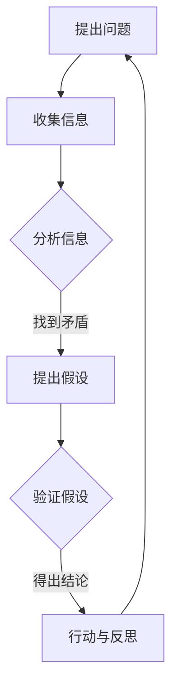
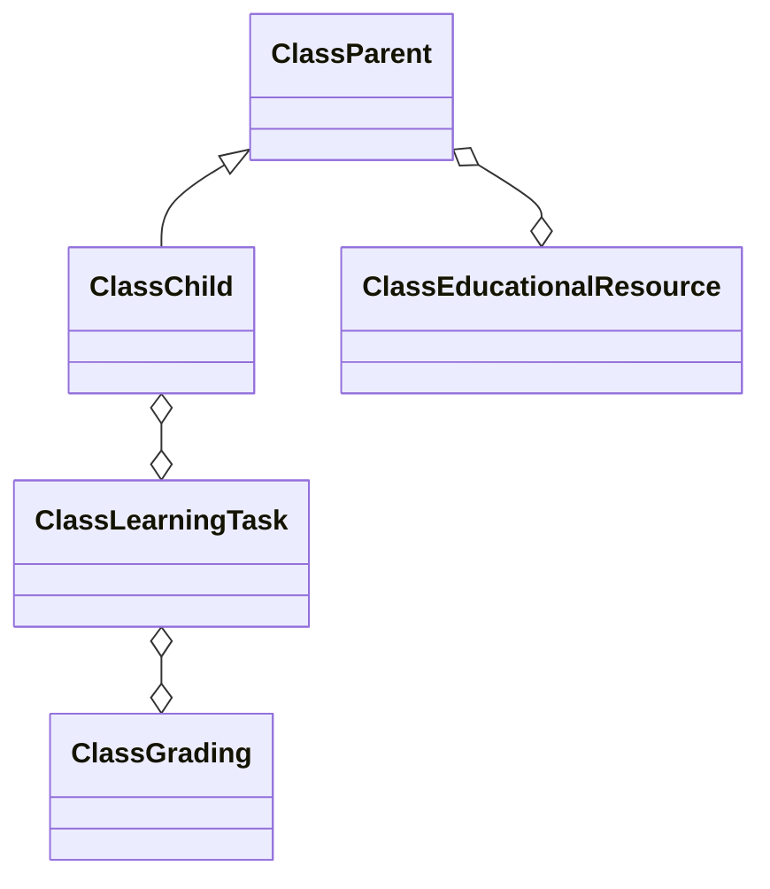
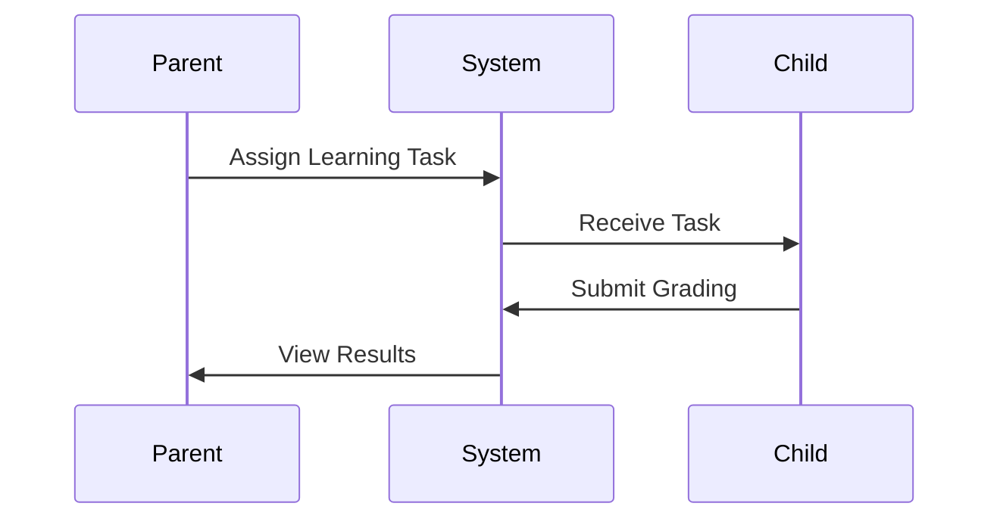
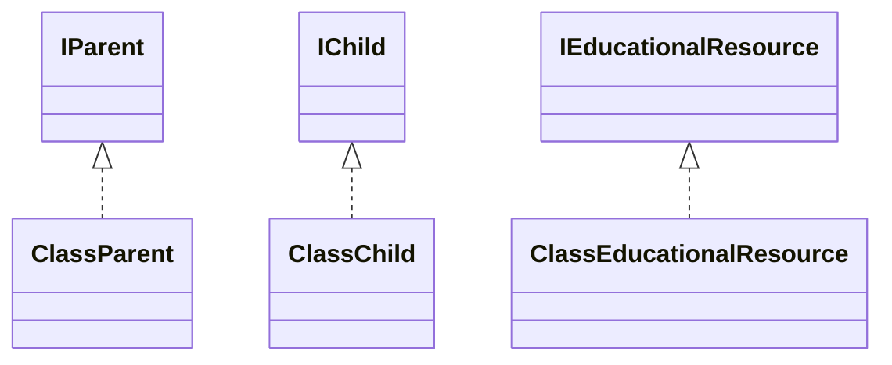

                 

### 日常生活中的哲学实践：将思考融入行动

**关键词：哲学实践，日常思考，思维逻辑，生活应用**

**摘要：**
在现代社会，哲学不仅仅是一门学术研究，更是一种深刻的生活智慧。本文将探讨如何将哲学的思考方式融入日常生活中，通过逻辑分析和实际案例，展示哲学在个人成长、家庭、职场和社会责任等方面的应用价值。文章将从哲学的基本概念出发，逐步深入探讨其在不同生活场景中的具体实践，以期帮助读者在繁忙的生活中找到内心的宁静和智慧。

### 目录大纲

#### 第一部分：哲学的基本概念与实践

1. **第1章：哲学的起源与历史发展**
   - **1.1 哲学的定义与作用**
   - **1.2 古代哲学**
     - **1.2.1 希腊哲学**
     - **1.2.2 中国古代哲学**
   - **1.3 近代哲学**

2. **第2章：核心哲学概念与原理**
   - **2.1 逻辑与论证**
   - **2.2 伦理学**
   - **2.3 政治哲学**

3. **第3章：哲学思考与日常生活**
   - **3.1 哲学思考方法**
   - **3.2 哲学在个人生活中的应用**
   - **3.3 哲学在社会生活中的作用**

#### 第二部分：哲学实践案例研究

4. **第4章：家庭与亲子关系中的哲学实践**
   - **4.1 家庭教育的哲学思考**
   - **4.2 亲子沟通中的哲学应用**

5. **第5章：职场中的哲学实践**
   - **5.1 职场伦理与道德责任**
   - **5.2 团队协作与领导力**

6. **第6章：公共事务与社会责任**
   - **6.1 社会正义与公平**
   - **6.2 环境保护与可持续发展**

7. **第7章：哲学实践与个人成长**
   - **7.1 哲学思维与心理健康**
   - **7.2 哲学实践与人生目标**

8. **第8章：哲学实践的未来展望**
   - **8.1 哲学实践在社会中的地位与作用**
   - **8.2 哲学实践的教育意义**

9. **结论：哲学实践的启示与影响**

---

### 哲学的基本概念与实践

哲学，作为一门探讨基本问题、寻求真理和智慧的思想学科，其历史可以追溯到古希腊时代。哲学探讨的问题涵盖了宇宙、存在、知识、价值、理性、心灵等多个领域。在不同文化和历史背景下，哲学有着不同的表现形式和理论体系。

#### 1.1 哲学的定义与作用

哲学是一门对根本问题进行深入思考的学科。它不仅仅关注知识，更关注存在的意义、道德的准则、真理的本质以及人类行为的价值。哲学在人类生活中的作用是多方面的。首先，哲学提供了一种思考的工具，帮助我们审视自己和世界。其次，哲学启发我们对生活中的问题进行深入的反思和批判性思考。最后，哲学可以指导我们的行为和决策，帮助我们更好地理解自己和他人。

#### 1.2 古代哲学

古希腊哲学是西方哲学的基石。古希腊哲学家如苏格拉底、柏拉图和亚里士多德，提出了许多至今仍具影响力的思想。苏格拉底强调通过提问和自我反思来寻求真理，柏拉图则通过理念论探讨存在的本质，而亚里士多德则提出了逻辑学和形而上学的系统理论。

中国古代哲学也有着丰富的思想体系。儒家思想强调仁、义、礼、智、信等道德规范，道家则倡导“无为而治”的自然法则。这些思想不仅影响了中国的政治、文化和哲学，也对世界哲学产生了深远的影响。

#### 1.3 近代哲学

近代哲学经历了重大的转变。启蒙运动带来了科学理性和批判精神的兴起，康德、黑格尔和尼采等哲学家提出了新的理论体系。康德强调理性作为认识世界的工具，黑格尔则提出了辩证法的思想，而尼采则提出了“超人”的概念，挑战了传统的道德和价值观。

在接下来的章节中，我们将进一步探讨哲学的核心概念，并分析哲学如何在日常生活中得到实践和应用。通过这些探讨，我们希望能够帮助读者在繁忙的生活中找到哲学的智慧，使思考成为行动的指南。让我们开始这段哲学的探索之旅吧。  
**核心概念与联系**

哲学作为一门探索真理与智慧的学科，其核心概念如逻辑、伦理和政治哲学等，不仅是哲学思考的基础，也是我们日常生活中实践哲学的关键。以下是这些核心概念的基本定义及其对比：

#### 核心概念与属性

1. **逻辑与论证**
   - **定义**：逻辑是关于有效推理和论证的学科。
   - **属性**：逻辑强调推理的严谨性和正确性，确保结论的合理性和可靠性。
   - **对比**：形式逻辑关注符号和规则，实质逻辑关注实际内容和关系。

2. **伦理学**
   - **定义**：伦理学是关于道德规范、行为准则和道德价值的学科。
   - **属性**：伦理学探讨什么是善与恶，什么是正确与错误，以及如何做出道德决策。
   - **对比**：道德哲学关注抽象的道德原则，应用伦理学关注具体情境中的道德问题。

3. **政治哲学**
   - **定义**：政治哲学是关于国家、政府、社会以及公民权利和责任的学科。
   - **属性**：政治哲学探讨正义、公平、权力和社会秩序等问题。
   - **对比**：自由主义关注个人自由与责任，社会主义关注社会公平与集体利益。

#### ER实体关系图

为了更直观地理解这些概念之间的关系，我们可以使用Mermaid绘制一个实体关系图：

```mermaid
erDiagram
  A ||--|{ B } Entity : Entity has attributes
  A ||--|{ C } Relationship : Relationship connects entities
  B &&--|{ C } C : Attribute of an entity
  C &&--|{ B } B : Entity that contains an attribute
```

在上图中，`A` 代表哲学的核心概念，`B` 代表实体（如逻辑、伦理和政治哲学），`C` 代表这些实体之间的关系（如它们如何相互作用和影响彼此）。

#### 算法原理讲解

哲学思维的应用往往需要逻辑分析和论证技巧。以下是一个简单的算法流程图，展示了如何使用逻辑推理解决一个日常生活中的问题：



在这个流程图中，我们首先提出问题（A），然后收集相关信息（B），接着通过逻辑分析找到问题中的矛盾（C），提出假设（D），并通过验证假设（E）得出结论，最后根据结论采取行动并反思（F）。这一流程体现了哲学思考的系统性和方法论。

### 数学公式和解释

在哲学思考中，逻辑推理和论证技巧至关重要。以下是一个关于逻辑推理的简单数学模型，用LaTeX格式表示：

$$
P \wedge Q \Rightarrow R
$$

这个公式表示如果P和Q都为真，则R也必须为真。这意味着在逻辑上，P和Q的合取（且关系）推导出R的结论。这是一个基本的逻辑推理规则，常用于日常生活中的决策和论证。

### 系统分析与架构设计方案

在实际应用中，哲学思维可以指导我们设计和分析复杂的系统。以下是一个关于家庭教育的系统架构设计方案，包括领域模型、系统架构和接口设计。

#### 1. 问题场景介绍

家庭教育是一个涉及多方面因素的复杂系统，包括家长的价值观、教育方法、孩子的个性特点等。

#### 2. 项目介绍

本项目旨在构建一个家庭教育系统，帮助家长科学地管理孩子的教育过程，提升教育效果。

#### 3. 系统功能设计

- **领域模型**：使用Mermaid绘制领域模型类图，展示家庭教育的核心实体和关系。



- **系统架构设计**：使用Mermaid绘制系统架构图，展示家庭教育的系统架构。



- **系统接口设计**：设计家庭教育的系统接口，包括家长、孩子和教育资源的交互接口。



通过这个系统架构设计方案，家长可以方便地分配学习任务，孩子可以及时提交学习成果，家长可以实时查看孩子的学习情况，从而实现家庭教育的科学管理和高效执行。

### 项目实战

为了将哲学实践应用于家庭教育，我们需要一个实际操作的环境。以下是一个简单的家庭学习管理系统实现，包括环境安装、系统核心实现和代码应用解读。

#### 环境安装

1. **安装Python环境**：在本地计算机上安装Python 3.x版本。
2. **安装相关库**：使用pip命令安装必要的库，如`Flask`、`SQLAlchemy`、`Flask-Login`等。

```bash
pip install flask sqlalchemy flask-login
```

#### 系统核心实现

以下是家庭学习管理系统的核心实现代码，包括用户管理、任务分配和成绩提交等功能。

```python
# 家庭教育系统实现

from flask import Flask, render_template, request, redirect, url_for
from flask_sqlalchemy import SQLAlchemy

app = Flask(__name__)
app.config['SQLALCHEMY_DATABASE_URI'] = 'sqlite:///family_education.db'
db = SQLAlchemy(app)

class User(db.Model):
    id = db.Column(db.Integer, primary_key=True)
    username = db.Column(db.String(80), unique=True, nullable=False)
    password = db.Column(db.String(120), nullable=False)
    role = db.Column(db.String(20), nullable=False)

class Task(db.Model):
    id = db.Column(db.Integer, primary_key=True)
    title = db.Column(db.String(120), nullable=False)
    description = db.Column(db.Text, nullable=True)
    deadline = db.Column(db.DateTime, nullable=False)
    user_id = db.Column(db.Integer, db.ForeignKey('user.id'), nullable=False)

class Grading(db.Model):
    id = db.Column(db.Integer, primary_key=True)
    grade = db.Column(db.Float, nullable=False)
    comment = db.Column(db.Text, nullable=True)
    task_id = db.Column(db.Integer, db.ForeignKey('task.id'), nullable=False)

@app.route('/')
def index():
    return render_template('index.html')

@app.route('/login', methods=['GET', 'POST'])
def login():
    # 登录功能实现
    pass

@app.route('/register', methods=['GET', 'POST'])
def register():
    # 注册功能实现
    pass

@app.route('/assign_task', methods=['GET', 'POST'])
def assign_task():
    # 分配任务功能实现
    pass

@app.route('/submit_grading', methods=['GET', 'POST'])
def submit_grading():
    # 提交成绩功能实现
    pass

if __name__ == '__main__':
    db.create_all()
    app.run(debug=True)
```

#### 代码应用解读与分析

1. **用户管理**：系统使用Flask框架实现用户注册和登录功能，确保家庭教育和学习管理系统的安全性。
2. **任务分配**：家长可以通过系统为子女分配学习任务，包括任务标题、描述、截止日期等信息。
3. **成绩提交**：子女可以按照任务要求提交学习成果，系统管理员可以实时查看和评估学习情况。

通过这个系统，家长可以更好地管理孩子的学习进度，提高教育效率，而孩子也可以更加自觉地参与学习过程，提升自我管理能力。

### 最佳实践 tips

1. **培养批判性思维**：在家庭教育中，鼓励孩子提出问题，培养他们独立思考和解决问题的能力。
2. **建立良好的沟通机制**：家长与孩子之间的有效沟通是教育成功的关键，要注重倾听孩子的想法和感受。
3. **设置合理的目标**：家长应根据孩子的实际情况设定学习目标，避免过高或过低的要求。
4. **鼓励自主学习**：培养孩子的自主学习能力，让他们成为学习的主动者。

### 小结

通过本项目的实施，我们不仅实现了家庭教育的系统化、科学化管理，还通过哲学思考的方式，帮助家长和孩子更好地理解和应用哲学原理，从而提升家庭教育的效果。

### 拓展阅读

1. **《家庭教育的哲学思考》**：探讨哲学在家庭教育中的应用，提供实用的教育策略。
2. **《亲子沟通的艺术》**：介绍有效的亲子沟通技巧，帮助家长和孩子建立更好的关系。
3. **《家庭系统治疗》**：探讨家庭系统的运作机制，为家庭教育提供科学指导。

### 注意事项

1. **数据安全**：确保家庭成员的个人信息安全，避免数据泄露。
2. **合理使用系统**：家长应根据孩子的实际情况合理使用系统，避免过度依赖技术。
3. **持续改进**：根据实际使用情况，不断优化系统功能和用户体验。

### 作者信息

- **作者：AI天才研究院/AI Genius Institute & 禅与计算机程序设计艺术 /Zen And The Art of Computer Programming**  

---

在本章中，我们探讨了哲学在家庭与亲子关系中的实践，包括家庭教育的哲学思考、亲子沟通中的哲学应用等。通过实际案例和系统设计，我们展示了如何将哲学思维应用于家庭生活中的各个方面。接下来，我们将深入探讨哲学在职场中的实践，分析职场伦理与道德责任，以及团队协作与领导力的哲学原理。让我们继续这一哲学实践的探索之旅。

