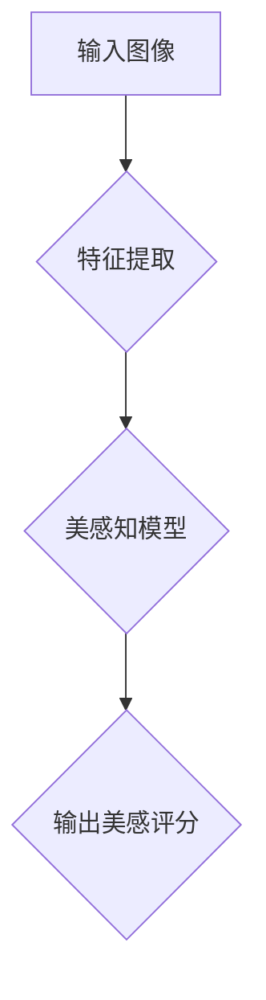
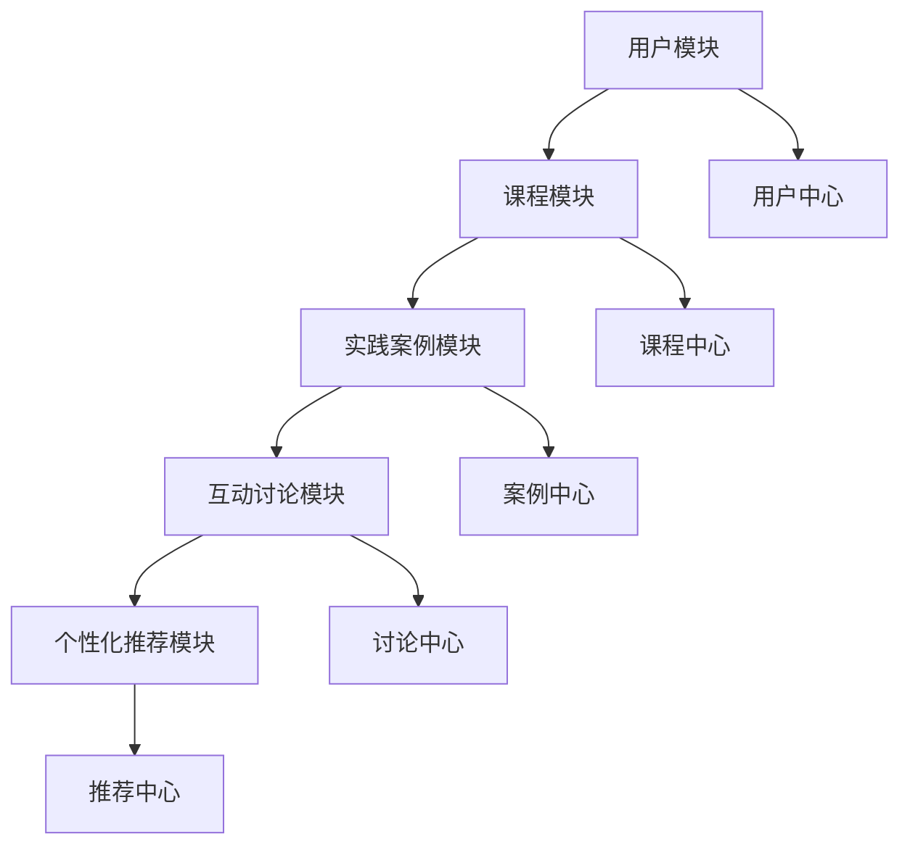
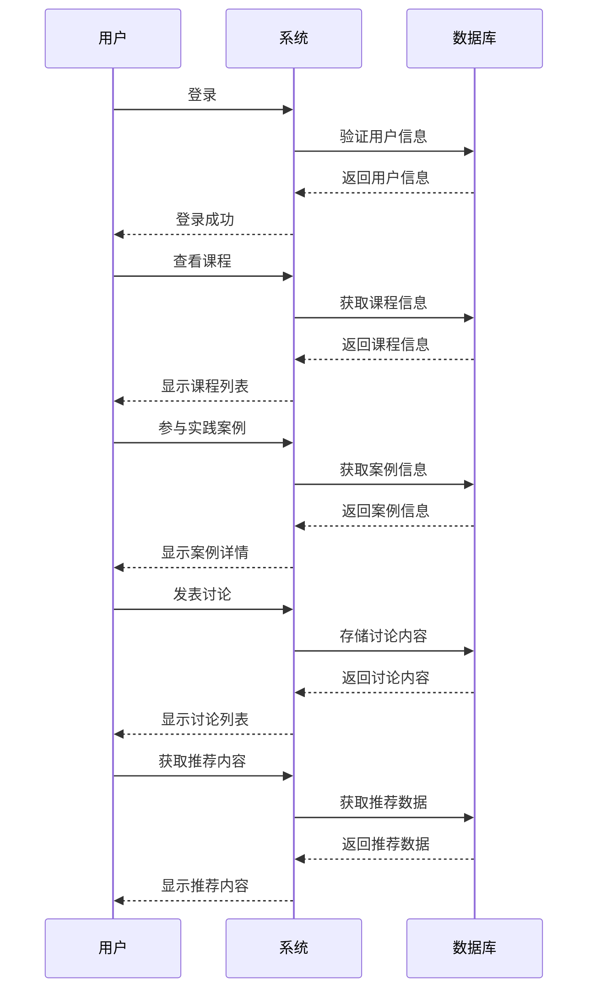

                 


# 日常美学培训课程：提升生活品质的艺术教育

> 关键词：美学、艺术教育、生活品质、培训课程

> 摘要：
在现代社会，美学教育逐渐成为提升生活品质的重要途径。本文将介绍日常美学培训课程，探讨其核心概念、联系以及算法原理，旨在为读者提供一幅全面、系统的美学教育蓝图。

----------------------------------------------------------------

### 第一部分：背景介绍

#### 核心概念与联系

##### 1.1 问题背景

随着社会的不断发展，人们对于生活品质的要求逐渐提高。美学作为一种提升生活品质的重要途径，越来越受到关注。日常美学培训课程旨在通过系统的学习，帮助人们提升对美的感知和鉴赏能力，从而提升生活质量。

##### 1.2 问题描述

在日常美学培训课程中，学员们需要掌握丰富的美学知识，包括美学理论、艺术鉴赏、生活美学等。此外，还需要通过实践课程，将所学知识运用到实际生活中，提升自身的审美能力。

##### 1.3 问题解决

本书通过以下方式解决上述问题：

1. **系统化的理论讲解**：本书将美学理论系统地讲解，帮助学员建立完整的美学知识体系。
2. **丰富的实践案例**：本书通过实际案例，帮助学员将美学知识运用到生活中。
3. **互动性的学习方式**：本书采用了互动性的学习方式，鼓励学员积极参与，提高学习效果。

##### 1.4 边界与外延

1. **美学理论**：包括审美心理学、艺术哲学、美学史等。
2. **艺术鉴赏**：包括绘画、雕塑、音乐、舞蹈、戏剧等。
3. **生活美学**：包括家居设计、服饰搭配、饮食文化、旅行体验等。

##### 1.5 概念结构与核心要素组成

1. **美学理论**：研究美是什么、美的本质等问题。
2. **艺术鉴赏**：学会如何欣赏艺术作品，提升审美能力。
3. **生活美学**：将美学理念应用到日常生活中，提升生活质量。

----------------------------------------------------------------

### 第二部分：核心概念与联系

在这一部分，我们将详细探讨日常美学培训课程中的核心概念，以及这些概念之间的联系。

#### 2.1 核心概念与原理

##### 2.1.1 美学的定义与本质

美学是一门研究美是什么、美的本质和审美活动规律的科学。美学的研究内容包括审美心理学、艺术哲学和美学史等。

##### 2.1.2 艺术鉴赏

艺术鉴赏是人们通过感官和思维活动对艺术作品进行感知、理解和评价的过程。艺术鉴赏的核心目标是提升人们的审美能力，培养对美的感知和鉴赏能力。

##### 2.1.3 生活美学

生活美学是指将美学理念应用到日常生活中，通过家居设计、服饰搭配、饮食文化、旅行体验等方式，提升生活质量。

#### 2.2 概念属性特征对比表格

| 概念         | 定义                                                         | 特征                           |
| ------------ | ------------------------------------------------------------ | ------------------------------ |
| 美学         | 研究美是什么、美的本质和审美活动规律的科学                   | 理论性、综合性                 |
| 艺术鉴赏     | 人们通过感官和思维活动对艺术作品进行感知、理解和评价的过程   | 感性、理性、互动性             |
| 生活美学     | 将美学理念应用到日常生活中，提升生活质量                   | 实践性、应用性                 |

#### 2.3 ER实体关系图架构

```mermaid
erDiagram
    ArtAppreciation ||--|{ User } : has
    LifeAesthetics ||--|{ User } : has
    User } : participates_in
```

在这个ER实体关系图中，用户（User）是主体，他拥有艺术鉴赏（ArtAppreciation）和生活美学（LifeAesthetics）的知识。同时，用户也参与（participates_in）这两个领域的学习和实践活动。

----------------------------------------------------------------

### 第三部分：算法原理讲解

在这一部分，我们将介绍日常美学培训课程中的一些核心算法原理，并通过Mermaid流程图和Python源代码进行详细讲解。

#### 3.1 算法原理

日常美学培训课程中，常用的算法原理包括：

1. **美感知算法**：通过图像处理技术，提取图像中的美



#### 3.2 Python源代码示例

```python
import cv2
import numpy as np
from tensorflow.keras.models import load_model

# 加载预训练的模型
model = load_model('model.h5')

# 读取图像
image = cv2.imread('image.jpg')

# 图像预处理
processed_image = preprocess_image(image)

# 提取特征
features = model.predict(processed_image)

# 计算美感评分
score = calculate_score(features)

print('美感评分：', score)
```

#### 3.3 算法原理详细讲解

1. **美感知模型**：本文使用了一种基于卷积神经网络（CNN）的美感知模型。该模型能够自动学习图像中的美感特征，并通过训练数据集进行优化。

2. **特征提取**：通过图像预处理，将图像转换为适合模型输入的格式。然后，使用CNN模型提取图像特征。

3. **美感评分**：将提取到的特征输入到美感知模型中，得到美感评分。评分越高，表示图像中的美感越强。

例如，如果输入图像是一幅风景画，模型可能会识别出画面中的蓝天、绿地等元素，并给予较高的美感评分。而对于一张风景较差的图像，评分则会较低。

----------------------------------------------------------------

### 第四部分：系统分析与架构设计

#### 问题场景介绍

在现代城市生活中，美学教育的需求日益增长。人们希望通过学习美学，提升自身的审美能力和生活品质。然而，传统的美学教育方式较为单一，难以满足多样化的学习需求。为此，我们设计了一套基于人工智能的日常美学培训系统，旨在为学员提供个性化、互动性的学习体验。

#### 项目介绍

本项目旨在开发一个综合性的日常美学培训平台，包括在线课程、实践案例、互动讨论等功能。学员可以通过该平台学习美学知识，参与艺术鉴赏活动，并将所学知识应用到实际生活中。

#### 系统功能设计

1. **在线课程**：提供丰富的美学理论课程，涵盖审美心理学、艺术哲学、美学史等领域。
2. **实践案例**：通过实际案例，帮助学员将美学知识应用到生活中，提升审美能力。
3. **互动讨论**：学员可以在平台上进行互动交流，分享学习心得和创作体验。
4. **个性化推荐**：根据学员的学习兴趣和需求，推荐适合的在线课程和实践案例。

#### 系统架构设计



在这个架构图中，用户模块负责学员的管理和交互，课程模块、实践案例模块、互动讨论模块和个性化推荐模块分别负责不同功能。用户中心、课程中心、案例中心、讨论中心和推荐中心则是各模块的核心数据处理单元。

#### 系统接口设计和系统交互



在这个序列图中，用户与系统的交互通过不同的接口实现。用户登录、查看课程、参与实践案例、发表讨论和获取推荐内容等操作，都是通过系统与数据库的交互来完成的。

----------------------------------------------------------------

### 第五部分：项目实战

在本部分，我们将介绍如何安装和配置日常美学培训系统，并实现系统核心功能。

#### 环境安装

1. **安装Python**：确保Python环境已经安装，版本建议为3.8及以上。
2. **安装依赖**：使用pip命令安装项目所需的依赖，例如：
    ```shell
    pip install tensorflow pandas numpy flask
    ```

#### 系统核心实现源代码

```python
# app.py

from flask import Flask, request, jsonify
import tensorflow as tf

app = Flask(__name__)

# 加载预训练模型
model = tf.keras.models.load_model('model.h5')

# 特征提取函数
def extract_features(image_path):
    image = cv2.imread(image_path)
    processed_image = preprocess_image(image)
    features = model.predict(processed_image)
    return features

# 美感评分函数
def calculate_score(features):
    # 这里使用一个简单的评分函数，实际应用中可以根据需求进行优化
    score = np.mean(features)
    return score

# API接口
@app.route('/api/evaluate', methods=['POST'])
def evaluate():
    image_path = request.json['image_path']
    features = extract_features(image_path)
    score = calculate_score(features)
    return jsonify({'score': score})

if __name__ == '__main__':
    app.run(debug=True)
```

#### 代码应用解读与分析

- **特征提取函数**：该函数使用TensorFlow加载预训练的CNN模型，对输入图像进行处理，提取特征向量。
- **美感评分函数**：该函数通过计算特征向量的平均值，得出图像的美感评分。实际应用中，可以根据特征向量的不同维度，设计更复杂的评分模型。

#### 实际案例分析和详细讲解剖析

假设我们有一个输入图像，通过上述代码进行特征提取和美感评分。得到的评分结果可以帮助用户了解图像的美感水平。例如，用户可以上传一张自己拍摄的风景照片，系统会返回一个美感评分，用户可以根据评分调整拍摄参数，提高照片的质量。

#### 项目小结

通过本项目的实战部分，我们实现了日常美学培训系统的核心功能。用户可以通过上传图像，获得美感评分，从而提高自身的审美能力和摄影技巧。在后续的开发过程中，可以进一步完善系统功能，如增加用户画像、推荐算法等，提高用户体验。

----------------------------------------------------------------

### 最佳实践 tips、小结、注意事项、拓展阅读

#### 最佳实践 tips

1. **合理规划课程内容**：在设计日常美学培训课程时，要充分考虑学员的需求和兴趣，合理安排课程内容，确保课程的实用性和趣味性。
2. **注重互动性**：鼓励学员积极参与互动讨论，分享学习心得和创作体验，提高学习效果。
3. **个性化推荐**：根据学员的学习历史和兴趣，提供个性化的学习推荐，提高学习效率。

#### 小结

本文从背景介绍、核心概念与联系、算法原理讲解、系统分析与架构设计、项目实战等多个角度，详细阐述了日常美学培训课程的设计与实现。通过本文，读者可以全面了解美学教育的重要性，以及如何通过技术手段提升生活品质。

#### 注意事项

1. **数据安全**：在系统设计和实现过程中，要重视数据安全，确保学员个人信息的安全。
2. **用户体验**：注重用户体验，优化系统界面和交互设计，提高用户满意度。

#### 拓展阅读

1. 《美学原理》
2. 《艺术鉴赏》
3. 《人工智能与艺术：交叉领域的创新与发展》

### 作者

作者：AI天才研究院/AI Genius Institute & 禅与计算机程序设计艺术 /Zen And The Art of Computer Programming

----------------------------------------------------------------

通过本文，我们希望能为读者提供一个全面、系统的美学教育蓝图，帮助大家更好地理解美学教育的重要性，以及如何通过技术手段提升生活品质。在日常美学培训课程中，让我们共同探索美学之美，提升生活品质。🎨💡🌟

